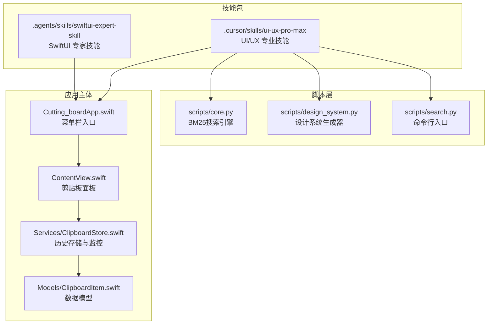
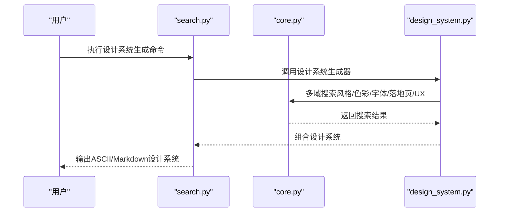
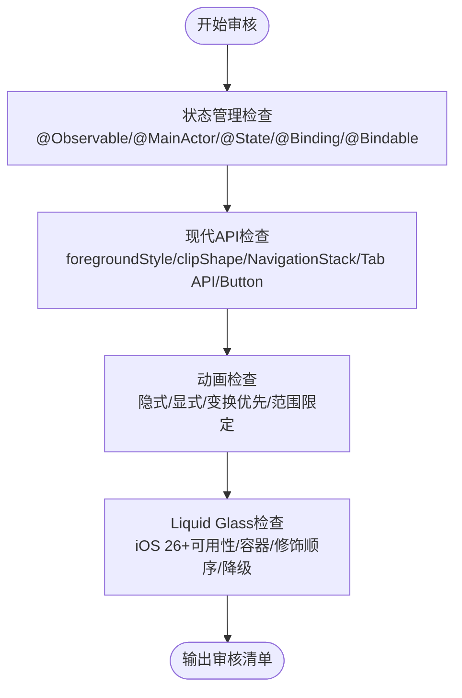
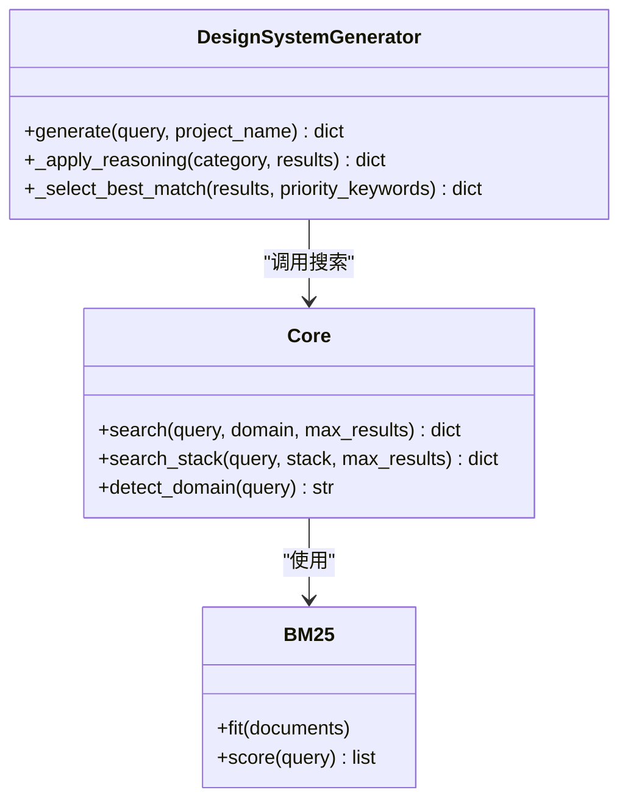
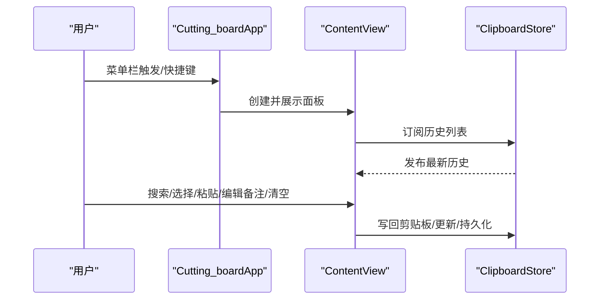
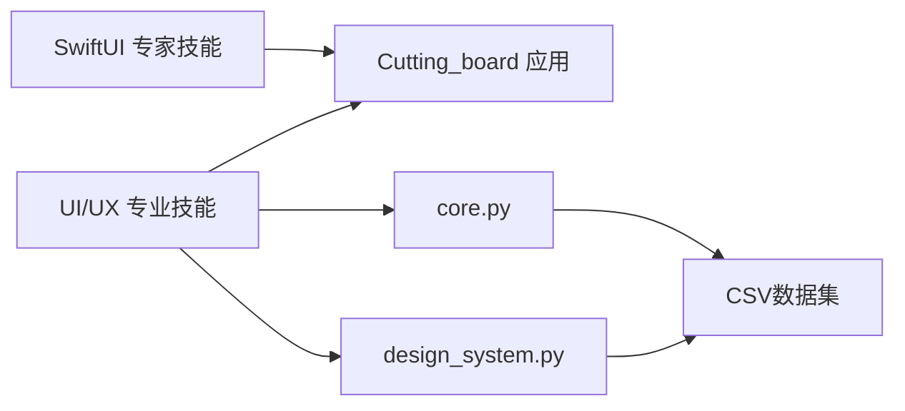

# AI增强功能

<cite>
**本文档引用的文件**
- [SKILL.md](file://.agents/skills/swiftui-expert-skill/SKILL.md)
- [.skill4agent.json](file://.agents/skills/swiftui-expert-skill/.skill4agent.json)
- [SKILL.md](file://.cursor/skills/ui-ux-pro-max/SKILL.md)
- [core.py](file://.cursor/skills/ui-ux-pro-max/scripts/core.py)
- [design_system.py](file://.cursor/skills/ui-ux-pro-max/scripts/design_system.py)
- [search.py](file://.cursor/skills/ui-ux-pro-max/scripts/search.py)
- [state-management.md](file://.agents/skills/swiftui-expert-skill/references/state-management.md)
- [modern-apis.md](file://.agents/skills/swiftui-expert-skill/references/modern-apis.md)
- [animation-basics.md](file://.agents/skills/swiftui-expert-skill/references/animation-basics.md)
- [liquid-glass.md](file://.agents/skills/swiftui-expert-skill/references/liquid-glass.md)
- [Cutting_boardApp.swift](file://Cutting_board/Cutting_boardApp.swift)
- [ContentView.swift](file://Cutting_board/ContentView.swift)
- [ClipboardStore.swift](file://Cutting_board/Services/ClipboardStore.swift)
- [ClipboardItem.swift](file://Cutting_board/Models/ClipboardItem.swift)
</cite>

## 目录
1. [简介](#简介)
2. [项目结构](#项目结构)
3. [核心组件](#核心组件)
4. [架构总览](#架构总览)
5. [详细组件分析](#详细组件分析)
6. [依赖分析](#依赖分析)
7. [性能考虑](#性能考虑)
8. [故障排查指南](#故障排查指南)
9. [结论](#结论)
10. [附录](#附录)

## 简介
本文件系统化梳理 Cutting_board 项目中的 AI 增强能力，围绕三大模块展开：
- SwiftUI 专家技能模块：提供状态管理、现代 API 使用、动画设计模式与 iOS 26+ Liquid Glass 适配的最佳实践与审核清单。
- UI/UX 专业技能模块：提供跨栈设计系统生成、风格与色彩推荐、排版与落地页模式、UX 指南与实现策略，支持持久化与分页覆盖。
- AI 技能模块：通过脚本化搜索与设计系统生成，辅助开发者高效产出符合设计规范的界面与交互。

文档同时给出使用示例、集成方法、配置选项、自定义能力与扩展机制，帮助团队在实际工程中快速落地 AI 增强。

## 项目结构
项目采用“技能包 + 应用主体”的组织方式：
- 技能包位于 .agents 与 .cursor 目录，分别提供 SwiftUI 专家技能与 UI/UX 专业技能。
- 应用主体位于 Cutting_board 目录，包含菜单栏入口、剪贴板监控与历史面板、数据模型与服务层。
- 脚本层位于 .cursor/skills/ui-ux-pro-max/scripts，提供搜索、设计系统生成与持久化能力。

图表来源
- [Cutting_boardApp.swift](file://Cutting_board/Cutting_boardApp.swift#L11-L31)
- [ContentView.swift](file://Cutting_board/ContentView.swift#L20-L95)
- [ClipboardStore.swift](file://Cutting_board/Services/ClipboardStore.swift#L14-L39)
- [core.py](file://.cursor/skills/ui-ux-pro-max/scripts/core.py#L1-L254)
- [design_system.py](file://.cursor/skills/ui-ux-pro-max/scripts/design_system.py#L1-L120)
- [search.py](file://.cursor/skills/ui-ux-pro-max/scripts/search.py#L1-L115)

章节来源
- [Cutting_boardApp.swift](file://Cutting_board/Cutting_boardApp.swift#L11-L31)
- [ContentView.swift](file://Cutting_board/ContentView.swift#L20-L95)
- [ClipboardStore.swift](file://Cutting_board/Services/ClipboardStore.swift#L14-L39)
- [core.py](file://.cursor/skills/ui-ux-pro-max/scripts/core.py#L1-L254)
- [design_system.py](file://.cursor/skills/ui-ux-pro-max/scripts/design_system.py#L1-L120)
- [search.py](file://.cursor/skills/ui-ux-pro-max/scripts/search.py#L1-L115)

## 核心组件
- SwiftUI 专家技能：提供状态管理、现代 API、动画与 Liquid Glass 的最佳实践与审核清单，支持工作流决策树与快速参考表格。
- UI/UX 专业技能：提供多领域搜索（风格、色彩、字体、落地页、图表、UX、Web 接口等）与多栈实现指南，支持设计系统生成与持久化。
- 应用主体：菜单栏入口、剪贴板监控、历史面板、数据模型与服务层，体现现代 SwiftUI 与性能优化实践。

章节来源
- [SKILL.md](file://.agents/skills/swiftui-expert-skill/SKILL.md#L9-L293)
- [SKILL.md](file://.cursor/skills/ui-ux-pro-max/SKILL.md#L1-L289)
- [Cutting_boardApp.swift](file://Cutting_board/Cutting_boardApp.swift#L11-L31)
- [ContentView.swift](file://Cutting_board/ContentView.swift#L20-L95)
- [ClipboardStore.swift](file://Cutting_board/Services/ClipboardStore.swift#L14-L39)

## 架构总览
AI 增强功能的运行链路如下：
- UI/UX 专业技能：通过命令行入口调用搜索脚本，脚本加载核心引擎与设计系统生成器，输出设计系统或搜索结果。
- SwiftUI 专家技能：以技能文档与参考文件形式提供最佳实践，配合应用主体的 SwiftUI 代码进行审核与改进。
- 应用主体：通过菜单栏入口与剪贴板监控服务，将 AI 增强能力与实际产品体验结合。

图表来源
- [search.py](file://.cursor/skills/ui-ux-pro-max/scripts/search.py#L56-L115)
- [core.py](file://.cursor/skills/ui-ux-pro-max/scripts/core.py#L158-L254)
- [design_system.py](file://.cursor/skills/ui-ux-pro-max/scripts/design_system.py#L163-L236)

## 详细组件分析

### SwiftUI 专家技能模块
该模块聚焦以下方面：
- 状态管理：优先使用 @Observable 与 @MainActor，明确私有状态所有权，避免嵌套 ObservableObject。
- 现代 API：统一使用 foregroundStyle、clipShape、NavigationStack、Tab API、Button 等替代方案。
- 动画设计：区分隐式与显式动画，强调变换优于布局，限定动画范围与时机。
- Liquid Glass：iOS 26+ 原生 API 的正确使用顺序与降级策略。

图表来源
- [SKILL.md](file://.agents/skills/swiftui-expert-skill/SKILL.md#L46-L129)
- [state-management.md](file://.agents/skills/swiftui-expert-skill/references/state-management.md#L3-L18)
- [modern-apis.md](file://.agents/skills/swiftui-expert-skill/references/modern-apis.md#L9-L26)
- [animation-basics.md](file://.agents/skills/swiftui-expert-skill/references/animation-basics.md#L34-L93)
- [liquid-glass.md](file://.agents/skills/swiftui-expert-skill/references/liquid-glass.md#L176-L194)

章节来源
- [SKILL.md](file://.agents/skills/swiftui-expert-skill/SKILL.md#L14-L45)
- [state-management.md](file://.agents/skills/swiftui-expert-skill/references/state-management.md#L3-L18)
- [modern-apis.md](file://.agents/skills/swiftui-expert-skill/references/modern-apis.md#L67-L125)
- [animation-basics.md](file://.agents/skills/swiftui-expert-skill/references/animation-basics.md#L162-L221)
- [liquid-glass.md](file://.agents/skills/swiftui-expert-skill/references/liquid-glass.md#L176-L235)

### UI/UX 专业技能模块
该模块提供：
- 多域搜索：风格、色彩、字体、落地页、图表、UX、Web 接口、React 性能等。
- 多栈指南：html-tailwind、react、nextjs、vue、svelte、swiftui、react-native、flutter、shadcn、jetpack-compose。
- 设计系统生成：基于推理规则与多域搜索结果，生成完整设计系统并支持持久化（Master + Overrides）。

图表来源
- [core.py](file://.cursor/skills/ui-ux-pro-max/scripts/core.py#L96-L156)
- [core.py](file://.cursor/skills/ui-ux-pro-max/scripts/core.py#L212-L254)
- [design_system.py](file://.cursor/skills/ui-ux-pro-max/scripts/design_system.py#L37-L121)

章节来源
- [SKILL.md](file://.cursor/skills/ui-ux-pro-max/SKILL.md#L118-L150)
- [core.py](file://.cursor/skills/ui-ux-pro-max/scripts/core.py#L17-L84)
- [design_system.py](file://.cursor/skills/ui-ux-pro-max/scripts/design_system.py#L24-L34)

### 应用主体与 AI 增强的结合
应用主体通过菜单栏入口与剪贴板面板，体现现代 SwiftUI 与性能优化实践：
- 菜单栏入口：MenuBarExtra、快捷键、通知中心联动。
- 剪贴板面板：搜索、列表、空态、无结果态、备注编辑、清空未钉住项。
- 数据模型与服务：ClipboardItem、ClipboardStore（监控、去重、排序、持久化、加解密）。

图表来源
- [Cutting_boardApp.swift](file://Cutting_board/Cutting_boardApp.swift#L35-L143)
- [ContentView.swift](file://Cutting_board/ContentView.swift#L20-L95)
- [ClipboardStore.swift](file://Cutting_board/Services/ClipboardStore.swift#L14-L39)

章节来源
- [Cutting_boardApp.swift](file://Cutting_board/Cutting_boardApp.swift#L11-L31)
- [ContentView.swift](file://Cutting_board/ContentView.swift#L20-L95)
- [ClipboardStore.swift](file://Cutting_board/Services/ClipboardStore.swift#L14-L39)
- [ClipboardItem.swift](file://Cutting_board/Models/ClipboardItem.swift#L16-L46)

## 依赖分析
- 技能包依赖关系
  - SwiftUI 专家技能：以文档与参考文件为主，无额外依赖。
  - UI/UX 专业技能：依赖 Python CSV 文件与推理规则，核心算法为 BM25。
- 应用主体依赖关系
  - SwiftUI、AppKit、Foundation、Combine。
  - 与技能包通过命令行与文档协作，不直接导入脚本。

图表来源
- [SKILL.md](file://.agents/skills/swiftui-expert-skill/SKILL.md#L1-L20)
- [SKILL.md](file://.cursor/skills/ui-ux-pro-max/SKILL.md#L1-L20)
- [core.py](file://.cursor/skills/ui-ux-pro-max/scripts/core.py#L13-L254)
- [design_system.py](file://.cursor/skills/ui-ux-pro-max/scripts/design_system.py#L1-L120)

章节来源
- [core.py](file://.cursor/skills/ui-ux-pro-max/scripts/core.py#L13-L254)
- [design_system.py](file://.cursor/skills/ui-ux-pro-max/scripts/design_system.py#L1-L120)

## 性能考虑
- SwiftUI 专家技能
  - 使用变换动画优于布局动画，限定动画范围，避免在热路径频繁动画。
  - 使用 @Observable 与 @MainActor 提升线程安全与性能。
- UI/UX 专业技能
  - BM25 搜索仅在必要时加载 CSV，限制返回结果数量，避免大规模文本处理。
- 应用主体
  - 历史列表使用 LazyVStack，按需生成缩略图，避免在主线程进行重型计算。
  - 搜索过滤使用 localizedStandardContains，兼顾性能与本地化。

章节来源
- [animation-basics.md](file://.agents/skills/swiftui-expert-skill/references/animation-basics.md#L162-L221)
- [state-management.md](file://.agents/skills/swiftui-expert-skill/references/state-management.md#L31-L56)
- [core.py](file://.cursor/skills/ui-ux-pro-max/scripts/core.py#L158-L188)
- [ContentView.swift](file://Cutting_board/ContentView.swift#L184-L207)
- [ClipboardStore.swift](file://Cutting_board/Services/ClipboardStore.swift#L47-L60)

## 故障排查指南
- SwiftUI 专家技能
  - 审核清单：逐项对照状态管理、现代 API、弹窗与导航、滚动视图、文本与格式化、视图结构、性能优化、列表模式、布局、动画与 Liquid Glass。
  - 常见问题：@State 滥用、@Observable 未标注 @MainActor、动画修饰符顺序错误、未提供 iOS 26+ 降级方案。
- UI/UX 专业技能
  - 搜索失败：确认 Python 版本与 CSV 文件存在；检查 domain 与 stack 参数。
  - 设计系统生成：确认推理规则文件存在；检查项目名与持久化目录权限。
- 应用主体
  - 剪贴板监控：检查定时器与 changeCount 比较；确认忽略的应用列表。
  - 粘贴回写：检查内容类型与 Base64 图像转换。

章节来源
- [SKILL.md](file://.agents/skills/swiftui-expert-skill/SKILL.md#L188-L268)
- [search.py](file://.cursor/skills/ui-ux-pro-max/scripts/search.py#L56-L115)
- [design_system.py](file://.cursor/skills/ui-ux-pro-max/scripts/design_system.py#L490-L540)
- [ClipboardStore.swift](file://Cutting_board/Services/ClipboardStore.swift#L47-L90)

## 结论
本项目通过“技能包 + 应用主体”的方式，将 AI 增强能力与实际产品体验深度融合：
- SwiftUI 专家技能提供严谨的开发规范与审核流程，确保代码质量与性能。
- UI/UX 专业技能提供可复用的设计系统生成与搜索能力，支持多领域与多栈策略。
- 应用主体以现代 SwiftUI 实践为基础，结合 AI 增强实现高效、易用的产品体验。

## 附录

### 使用示例与集成方法
- SwiftUI 专家技能
  - 审核现有代码：依据工作流决策树逐项检查状态管理、现代 API、视图组合、性能优化、列表模式、动画与 Liquid Glass。
  - 改进现有代码：优先采用 @Observable 与 @MainActor，替换废弃 API，优化动画与修饰符顺序。
  - 实现新功能：先设计数据流，再使用现代 API 与动画模式，最后适配 iOS 26+ Liquid Glass 并提供降级方案。
- UI/UX 专业技能
  - 生成设计系统：使用命令行入口，指定查询词与项目名，支持 ASCII/Markdown 输出与持久化。
  - 多域搜索：根据需求选择 domain（style/color/typography/landing/chart/ux/web/react）或 stack（swiftui/react-native/flutter 等）。
  - 设计系统持久化：采用 Master + Overrides 模式，支持页面级覆盖文件。
- 应用主体集成
  - 菜单栏入口：通过 MenuBarExtra 与快捷键触发面板。
  - 剪贴板面板：支持搜索、列表、空态、无结果态、备注编辑与清空未钉住项。
  - 数据持久化：历史记录加密存储，支持最大条数限制与去重。

章节来源
- [SKILL.md](file://.agents/skills/swiftui-expert-skill/SKILL.md#L14-L45)
- [SKILL.md](file://.cursor/skills/ui-ux-pro-max/SKILL.md#L32-L116)
- [search.py](file://.cursor/skills/ui-ux-pro-max/scripts/search.py#L56-L115)
- [Cutting_boardApp.swift](file://Cutting_board/Cutting_boardApp.swift#L11-L31)
- [ContentView.swift](file://Cutting_board/ContentView.swift#L20-L95)
- [ClipboardStore.swift](file://Cutting_board/Services/ClipboardStore.swift#L14-L39)

### 配置选项与自定义能力
- SwiftUI 专家技能
  - 工作流决策树与审核清单可按项目需求调整检查项。
  - Liquid Glass 仅在用户明确要求时启用，并提供降级方案。
- UI/UX 专业技能
  - 域与栈配置：可在 CSV 配置中新增域或栈文件，扩展搜索范围。
  - 输出格式：支持 ASCII 与 Markdown，满足不同消费场景。
  - 持久化：支持 Master + Overrides 模式，实现全局规则与页面覆盖。
- 应用主体
  - 最大历史条数：通过 maxItems 控制存储上限。
  - 忽略应用列表：通过 UserDefaults 存储忽略的应用 Bundle ID 列表。

章节来源
- [SKILL.md](file://.agents/skills/swiftui-expert-skill/SKILL.md#L122-L129)
- [core.py](file://.cursor/skills/ui-ux-pro-max/scripts/core.py#L17-L84)
- [design_system.py](file://.cursor/skills/ui-ux-pro-max/scripts/design_system.py#L490-L540)
- [ClipboardStore.swift](file://Cutting_board/Services/ClipboardStore.swift#L20-L23)

### 扩展机制
- 技能包扩展
  - 新增域：在 CSV 配置中添加新域的搜索列与输出列，实现新的搜索维度。
  - 新增栈：在栈配置中添加新栈文件，提供栈特定的实现指南。
- 应用主体扩展
  - 新增剪贴板类型：在 ClipboardContentType 中扩展类型，并在捕获逻辑中处理。
  - 新增持久化字段：在 ClipboardItem 中扩展字段，并在编码/解码中兼容。

章节来源
- [core.py](file://.cursor/skills/ui-ux-pro-max/scripts/core.py#L17-L84)
- [ClipboardItem.swift](file://Cutting_board/Models/ClipboardItem.swift#L10-L27)