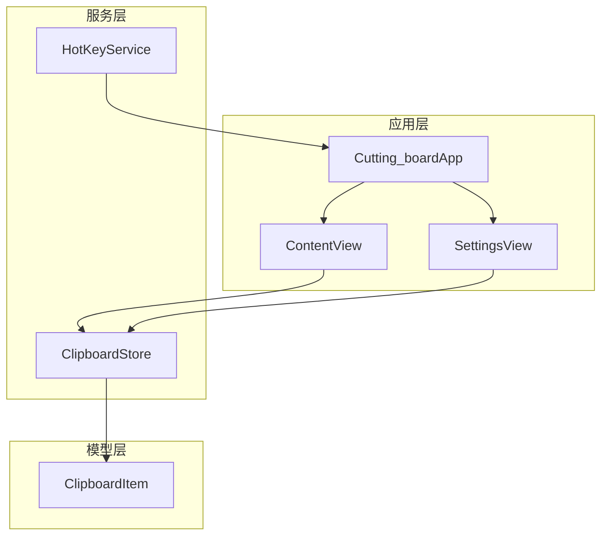
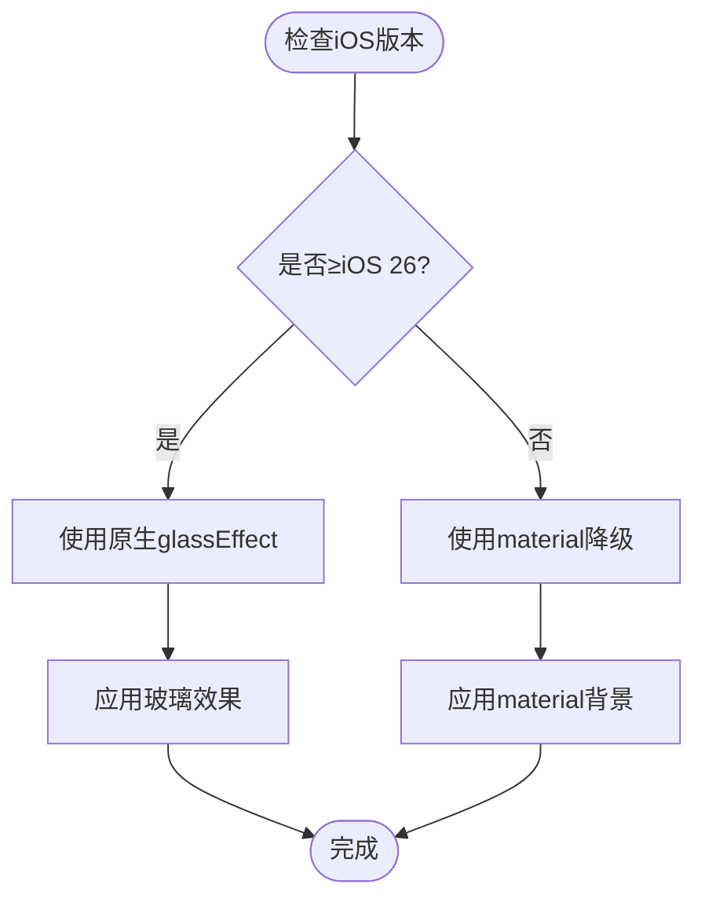
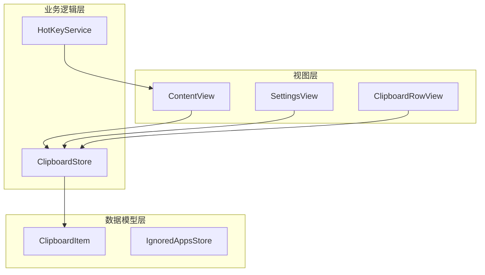
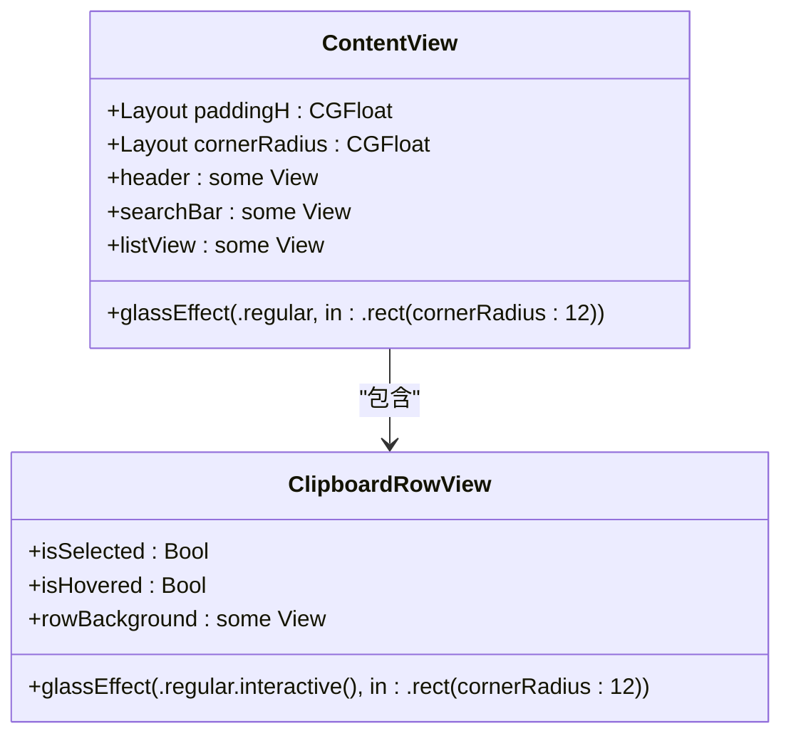
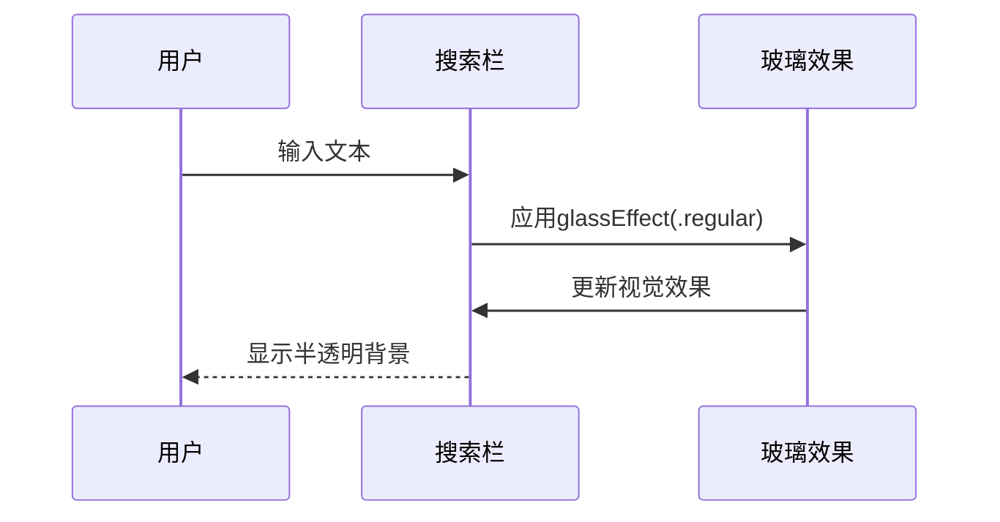
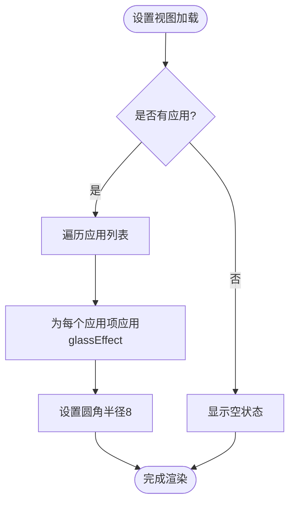
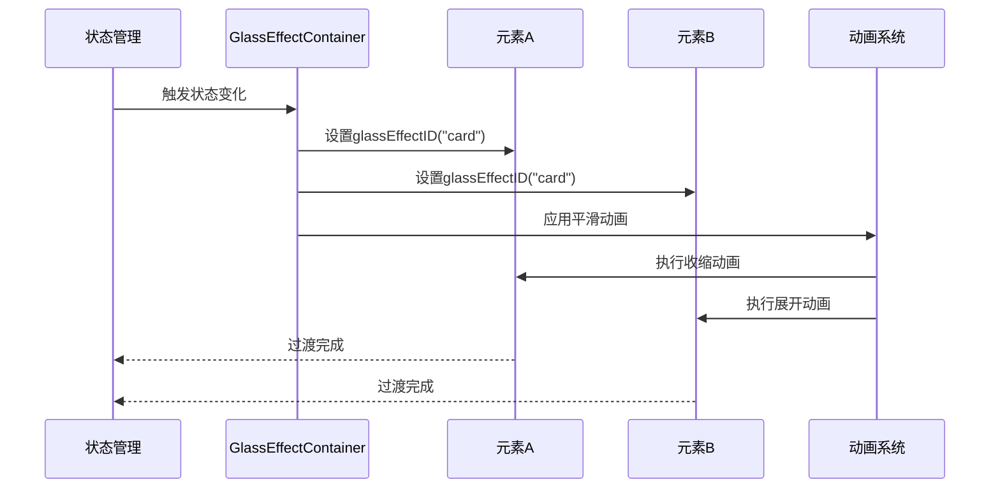
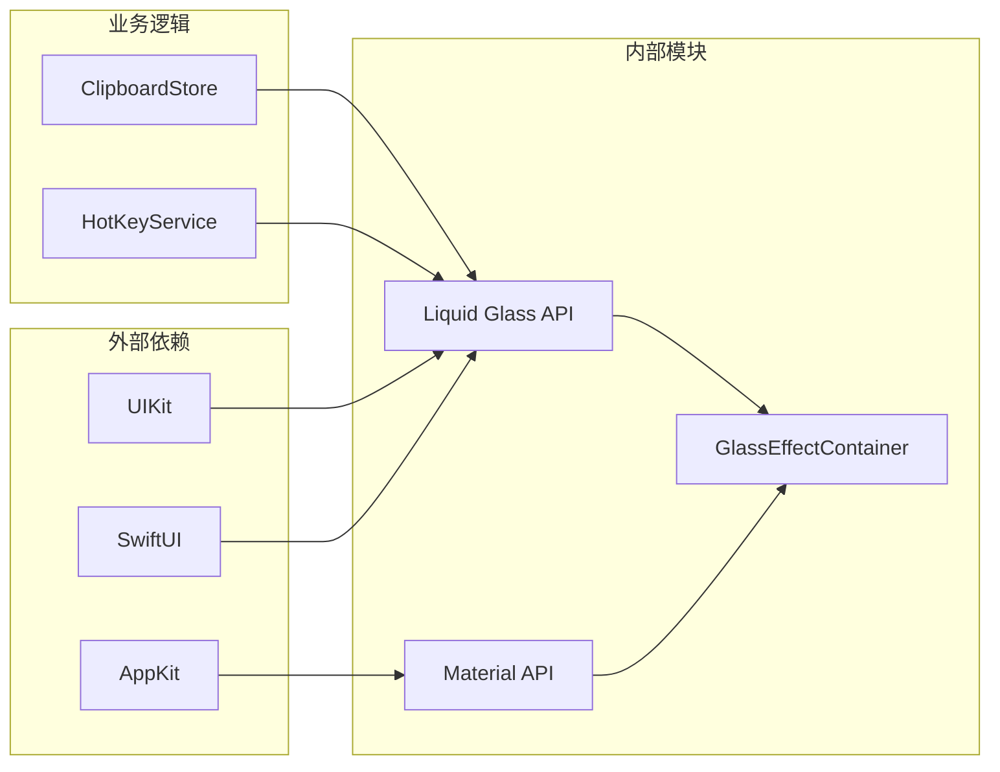

# Liquid Glass适配方案

<cite>
**本文档引用的文件**
- [liquid-glass.md](file://.agents/skills/swiftui-expert-skill/references/liquid-glass.md)
- [ContentView.swift](file://Cutting_board/ContentView.swift)
- [SettingsView.swift](file://Cutting_board/SettingsView.swift)
- [Cutting_boardApp.swift](file://Cutting_board/Cutting_boardApp.swift)
- [ClipboardStore.swift](file://Cutting_board/Services/ClipboardStore.swift)
- [HotKeyService.swift](file://Cutting_board/Services/HotKeyService.swift)
</cite>

## 目录
1. [简介](#简介)
2. [项目结构](#项目结构)
3. [核心组件](#核心组件)
4. [架构概览](#架构概览)
5. [详细组件分析](#详细组件分析)
6. [依赖关系分析](#依赖关系分析)
7. [性能考虑](#性能考虑)
8. [故障排除指南](#故障排除指南)
9. [结论](#结论)

## 简介

本文档详细介绍SwiftUI Liquid Glass适配方案，基于iOS 26+的原生Liquid Glass API设计。Liquid Glass是苹果公司推出的新一代设计语言，提供半透明、动态的表面效果，能够响应内容和用户交互。

该项目展示了完整的Liquid Glass实现方案，包括基础玻璃效果、玻璃按钮、玻璃容器和变形过渡等场景。文档深入解释了原生API的正确使用方法、玻璃效果容器的设计模式、交互式玻璃元素的实现技巧，以及版本兼容性处理和性能优化策略。

## 项目结构

该项目采用标准的SwiftUI项目结构，主要包含以下关键组件：



**图表来源**
- [Cutting_boardApp.swift](file://Cutting_board/Cutting_boardApp.swift#L12-L31)
- [ContentView.swift](file://Cutting_board/ContentView.swift#L20-L101)
- [SettingsView.swift](file://Cutting_board/SettingsView.swift#L11-L39)

**章节来源**
- [Cutting_boardApp.swift](file://Cutting_board/Cutting_boardApp.swift#L12-L31)
- [ContentView.swift](file://Cutting_board/ContentView.swift#L20-L101)
- [SettingsView.swift](file://Cutting_board/SettingsView.swift#L11-L39)

## 核心组件

### Liquid Glass API概述

Liquid Glass提供了三种核心API：

1. **glassEffect修饰符** - 主要的玻璃效果修饰符
2. **GlassEffectContainer** - 玻璃效果容器，用于分组管理
3. **GlassEffectStyle** - 玻璃效果样式配置

### 版本兼容性策略

所有Liquid Glass API都要求iOS 26或更高版本。项目实现了完整的降级方案：



**图表来源**
- [liquid-glass.md](file://.agents/skills/swiftui-expert-skill/references/liquid-glass.md#L9-L17)

### 玻璃效果样式系统

GlassEffectStyle支持多种配置选项：

- **显著性级别**：`.regular` 和 `.prominent`
- **着色**：通过 `.tint()` 方法添加颜色
- **交互性**：通过 `.interactive()` 使效果响应用户交互

**章节来源**
- [liquid-glass.md](file://.agents/skills/swiftui-expert-skill/references/liquid-glass.md#L54-L85)

## 架构概览

项目采用MVVM架构模式，结合SwiftUI的数据绑定机制：



**图表来源**
- [ContentView.swift](file://Cutting_board/ContentView.swift#L20-L101)
- [SettingsView.swift](file://Cutting_board/SettingsView.swift#L11-L39)
- [ClipboardStore.swift](file://Cutting_board/Services/ClipboardStore.swift#L14-L232)

## 详细组件分析

### 主内容视图中的Liquid Glass实现

主内容视图展示了多种Liquid Glass应用场景：

#### 基础玻璃容器



**图表来源**
- [ContentView.swift](file://Cutting_board/ContentView.swift#L20-L101)
- [ContentView.swift](file://Cutting_board/ContentView.swift#L373-L535)

#### 交互式玻璃按钮

项目中的玻璃按钮实现了完整的交互响应：

- **悬停效果**：`.glassEffect(.regular.interactive())`
- **选中效果**：`.glassEffect(.regular.tint(.primary.opacity(0.12)).interactive())`
- **圆角胶囊形状**：`.rect(cornerRadius: 12)`

#### 搜索栏玻璃效果

搜索栏区域使用了圆角矩形的玻璃效果：



**图表来源**
- [ContentView.swift](file://Cutting_board/ContentView.swift#L144-L171)

**章节来源**
- [ContentView.swift](file://Cutting_board/ContentView.swift#L57-L58)
- [ContentView.swift](file://Cutting_board/ContentView.swift#L167-L168)
- [ContentView.swift](file://Cutting_board/ContentView.swift#L474-L478)

### 设置视图中的Liquid Glass应用

设置视图展示了列表项的玻璃效果实现：

#### 列表项玻璃效果



**图表来源**
- [SettingsView.swift](file://Cutting_board/SettingsView.swift#L49-L76)

**章节来源**
- [SettingsView.swift](file://Cutting_board/SettingsView.swift#L37-L38)
- [SettingsView.swift](file://Cutting_board/SettingsView.swift#L69-L70)

### 玻璃效果容器模式

项目中使用了GlassEffectContainer来管理多个玻璃元素：

#### 容器设计原则

- **间距一致性**：容器的spacing参数应与布局间距匹配
- **元素分组**：将相关的玻璃元素组织在同一个容器中
- **视觉统一**：确保容器内元素的形状和样式保持一致

**章节来源**
- [liquid-glass.md](file://.agents/skills/swiftui-expert-skill/references/liquid-glass.md#L86-L116)

### 变形过渡实现

项目展示了如何实现玻璃元素间的平滑过渡：

#### Morphing过渡技术



**图表来源**
- [liquid-glass.md](file://.agents/skills/swiftui-expert-skill/references/liquid-glass.md#L143-L175)

**章节来源**
- [liquid-glass.md](file://.agents/skills/swiftui-expert-skill/references/liquid-glass.md#L147-L167)

## 依赖关系分析

### 核心依赖关系



**图表来源**
- [Cutting_boardApp.swift](file://Cutting_board/Cutting_boardApp.swift#L8-L9)
- [ContentView.swift](file://Cutting_board/ContentView.swift#L8-L9)

### 版本兼容性矩阵

| 组件 | iOS 26+ | iOS < 26 | 降级方案 |
|------|---------|----------|----------|
| glassEffect | ✅ 原生API | ❌ 不可用 | .ultraThinMaterial |
| GlassEffectContainer | ✅ 原生API | ❌ 不可用 | 手动间距控制 |
| GlassEffectStyle | ✅ 完整支持 | ❌ 部分支持 | 材料API替代 |
| 交互式效果 | ✅ .interactive() | ❌ 不可用 | 手动状态管理 |

**章节来源**
- [liquid-glass.md](file://.agents/skills/swiftui-expert-skill/references/liquid-glass.md#L309-L346)

## 性能考虑

### 性能优化策略

1. **修饰符顺序优化**
   - 玻璃效果修饰符应放在最后应用
   - 避免在玻璃效果上叠加过多复杂修饰符

2. **内存管理**
   - 合理使用@State和@ObservedObject
   - 及时释放不需要的资源

3. **动画性能**
   - 使用合适的动画曲线
   - 避免同时进行大量动画

### 性能监控指标

- **渲染帧率**：确保UI流畅度
- **内存使用**：监控应用内存占用
- **CPU使用率**：避免过度计算

## 故障排除指南

### 常见问题及解决方案

#### 玻璃效果不显示

**问题症状**：应用在iOS 26+设备上无法显示玻璃效果

**可能原因**：
1. 修饰符顺序错误
2. 形状参数配置不当
3. 缺少版本检查

**解决方案**：
```swift
// 正确的修饰符顺序
Text("内容")
    .padding()           // 布局修饰符
    .foregroundStyle()   // 颜色修饰符
    .glassEffect()       // 玻璃效果修饰符（最后应用）
```

#### 交互效果异常

**问题症状**：玻璃按钮没有响应用户交互

**可能原因**：
1. 未使用.interactive()修饰符
2. 按钮样式不正确
3. 事件处理冲突

**解决方案**：
```swift
// 确保交互式玻璃按钮
Button("操作") {
    // 业务逻辑
}
.glassEffect(.regular.interactive(), in: .rect(cornerRadius: 12))
```

#### 性能问题

**问题症状**：应用在低端设备上运行缓慢

**可能原因**：
1. 过多的玻璃效果叠加
2. 复杂的动画效果
3. 内存泄漏

**解决方案**：
1. 减少不必要的玻璃效果
2. 使用简单的动画曲线
3. 实施适当的内存管理

**章节来源**
- [liquid-glass.md](file://.agents/skills/swiftui-expert-skill/references/liquid-glass.md#L348-L367)

## 结论

本项目成功实现了iOS 26+ Liquid Glass的完整适配方案，展示了以下关键成果：

### 技术成就

1. **完整的版本兼容性**：实现了iOS 26+原生API与iOS < 26材料API的无缝降级
2. **多样化的应用场景**：涵盖了基础玻璃效果、交互式按钮、列表项等多种使用场景
3. **性能优化实践**：通过合理的修饰符顺序和内存管理确保了良好的性能表现

### 最佳实践总结

1. **API使用规范**：严格按照Apple的API文档使用Liquid Glass相关功能
2. **设计一致性**：保持玻璃效果在应用内的统一性和协调性
3. **用户体验优先**：在追求视觉效果的同时确保功能的可用性和性能

### 未来发展方向

1. **持续更新**：随着iOS版本的演进，及时更新Liquid Glass的实现方式
2. **性能优化**：进一步优化渲染性能，提升用户体验
3. **功能扩展**：探索更多Liquid Glass的应用场景和创新用法

通过本项目的实现，开发者可以参考这些最佳实践，在自己的SwiftUI项目中成功集成Liquid Glass效果，为用户提供现代化的视觉体验。