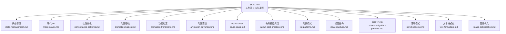
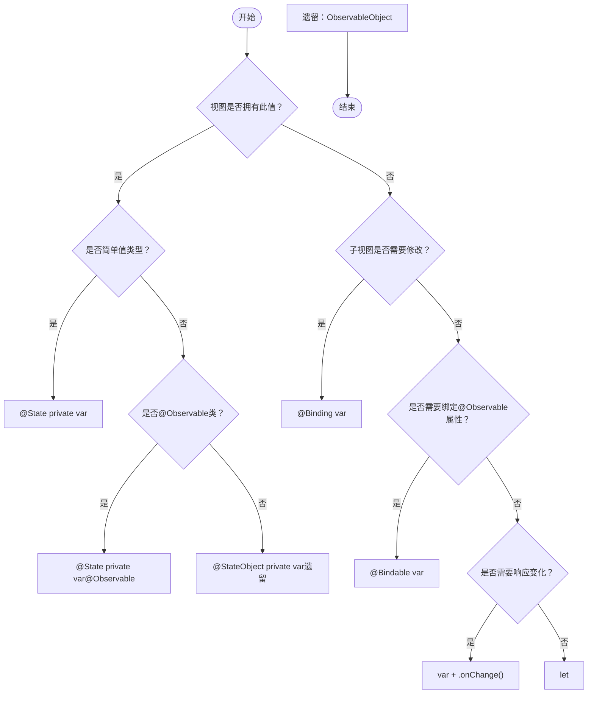
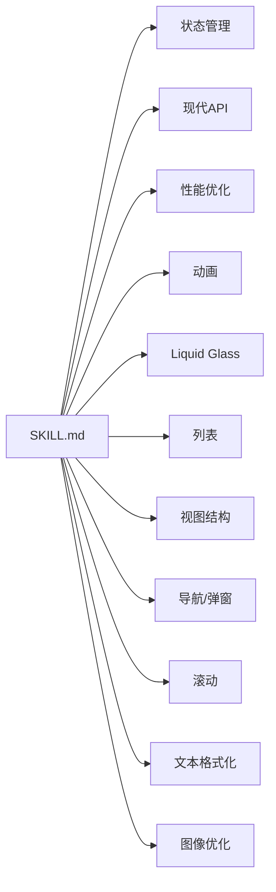

# SwiftUI专家技能

<cite>
**本文档引用的文件**
- [.agents/skills/swiftui-expert-skill/SKILL.md](file://.agents/skills/swiftui-expert-skill/SKILL.md)
- [.agents/skills/swiftui-expert-skill/.skill4agent.json](file://.agents/skills/swiftui-expert-skill/.skill4agent.json)
- [.agents/skills/swiftui-expert-skill/references/state-management.md](file://.agents/skills/swiftui-expert-skill/references/state-management.md)
- [.agents/skills/swiftui-expert-skill/references/modern-apis.md](file://.agents/skills/swiftui-expert-skill/references/modern-apis.md)
- [.agents/skills/swiftui-expert-skill/references/performance-patterns.md](file://.agents/skills/swiftui-expert-skill/references/performance-patterns.md)
- [.agents/skills/swiftui-expert-skill/references/animation-basics.md](file://.agents/skills/swiftui-expert-skill/references/animation-basics.md)
- [.agents/skills/swiftui-expert-skill/references/animation-transitions.md](file://.agents/skills/swiftui-expert-skill/references/animation-transitions.md)
- [.agents/skills/swiftui-expert-skill/references/animation-advanced.md](file://.agents/skills/swiftui-expert-skill/references/animation-advanced.md)
- [.agents/skills/swiftui-expert-skill/references/liquid-glass.md](file://.agents/skills/swiftui-expert-skill/references/liquid-glass.md)
- [.agents/skills/swiftui-expert-skill/references/layout-best-practices.md](file://.agents/skills/swiftui-expert-skill/references/layout-best-practices.md)
- [.agents/skills/swiftui-expert-skill/references/list-patterns.md](file://.agents/skills/swiftui-expert-skill/references/list-patterns.md)
- [.agents/skills/swiftui-expert-skill/references/view-structure.md](file://.agents/skills/swiftui-expert-skill/references/view-structure.md)
- [.agents/skills/swiftui-expert-skill/references/sheet-navigation-patterns.md](file://.agents/skills/swiftui-expert-skill/references/sheet-navigation-patterns.md)
- [.agents/skills/swiftui-expert-skill/references/scroll-patterns.md](file://.agents/skills/swiftui-expert-skill/references/scroll-patterns.md)
- [.agents/skills/swiftui-expert-skill/references/text-formatting.md](file://.agents/skills/swiftui-expert-skill/references/text-formatting.md)
- [.agents/skills/swiftui-expert-skill/references/image-optimization.md](file://.agents/skills/swiftui-expert-skill/references/image-optimization.md)
</cite>

## 目录
1. [简介](#简介)
2. [项目结构](#项目结构)
3. [核心组件](#核心组件)
4. [架构总览](#架构总览)
5. [详细组件分析](#详细组件分析)
6. [依赖分析](#依赖分析)
7. [性能考量](#性能考量)
8. [故障排查指南](#故障排查指南)
9. [结论](#结论)
10. [附录](#附录)

## 简介
本技能模块面向SwiftUI专家级开发者，系统阐述状态管理策略（@Observable vs ObservableObject）、现代API使用、性能优化、动画设计模式与Liquid Glass适配方案（iOS 26+）。它提供三类工作流的决策树：代码审核、改进现有代码、实现新功能。同时给出检查清单、快速参考与实际代码示例路径，帮助团队在实践中统一标准、提升质量与一致性。

## 项目结构
该技能模块由一个主技能文件与一组参考文档组成，形成“技能指引 + 专题参考”的知识体系：
- 主技能文件：SKILL.md 提供工作流、核心准则、快速参考与检查清单
- 参考文档：按主题拆分，覆盖状态管理、现代API、性能、动画、布局、列表、视图结构、导航与弹窗、滚动、文本格式化、图像优化、Liquid Glass等

图表来源
- [.agents/skills/swiftui-expert-skill/SKILL.md](file://.agents/skills/swiftui-expert-skill/SKILL.md#L1-L293)
- [.agents/skills/swiftui-expert-skill/references/state-management.md](file://.agents/skills/swiftui-expert-skill/references/state-management.md#L1-L448)
- [.agents/skills/swiftui-expert-skill/references/modern-apis.md](file://.agents/skills/swiftui-expert-skill/references/modern-apis.md#L1-L401)
- [.agents/skills/swiftui-expert-skill/references/performance-patterns.md](file://.agents/skills/swiftui-expert-skill/references/performance-patterns.md#L1-L378)
- [.agents/skills/swiftui-expert-skill/references/animation-basics.md](file://.agents/skills/swiftui-expert-skill/references/animation-basics.md#L1-L285)
- [.agents/skills/swiftui-expert-skill/references/animation-transitions.md](file://.agents/skills/swiftui-expert-skill/references/animation-transitions.md#L1-L327)
- [.agents/skills/swiftui-expert-skill/references/animation-advanced.md](file://.agents/skills/swiftui-expert-skill/references/animation-advanced.md#L1-L352)
- [.agents/skills/swiftui-expert-skill/references/liquid-glass.md](file://.agents/skills/swiftui-expert-skill/references/liquid-glass.md#L1-L378)
- [.agents/skills/swiftui-expert-skill/references/layout-best-practices.md](file://.agents/skills/swiftui-expert-skill/references/layout-best-practices.md#L1-L313)
- [.agents/skills/swiftui-expert-skill/references/list-patterns.md](file://.agents/skills/swiftui-expert-skill/references/list-patterns.md#L1-L154)
- [.agents/skills/swiftui-expert-skill/references/view-structure.md](file://.agents/skills/swiftui-expert-skill/references/view-structure.md#L1-L277)
- [.agents/skills/swiftui-expert-skill/references/sheet-navigation-patterns.md](file://.agents/skills/swiftui-expert-skill/references/sheet-navigation-patterns.md#L1-L293)
- [.agents/skills/swiftui-expert-skill/references/scroll-patterns.md](file://.agents/skills/swiftui-expert-skill/references/scroll-patterns.md#L1-L306)
- [.agents/skills/swiftui-expert-skill/references/text-formatting.md](file://.agents/skills/swiftui-expert-skill/references/text-formatting.md#L1-L286)
- [.agents/skills/swiftui-expert-skill/references/image-optimization.md](file://.agents/skills/swiftui-expert-skill/references/image-optimization.md#L1-L287)

章节来源
- [.agents/skills/swiftui-expert-skill/SKILL.md](file://.agents/skills/swiftui-expert-skill/SKILL.md#L1-L293)

## 核心组件
- 状态管理：优先使用@Observable（iOS 17+），配合@State；对注入式@Observable使用@Bindable；避免将传入值声明为@State/@StateObject；避免嵌套ObservableObject（iOS 17+的@Observable可完美支持嵌套）
- 现代API：优先使用foregroundStyle()、clipShape(.rect(cornerRadius:))、NavigationStack + navigationDestination(for:)、Tab API、Button替代onTapGesture()（除非需要位置/次数）、ScrollViewReader结合稳定ID实现程序化滚动、避免UIScreen.main.bounds与GeometryReader滥用
- 性能优化：避免冗余状态更新、热路径节流、仅传递必要值、大列表使用Lazy容器、避免在body创建对象与重计算、使用POD视图与等价视图加速diff、使用Self._printChanges()调试更新风暴
- 动画设计：使用带value参数的.animation(_:value:)、withAnimation处理事件驱动、优先使用变换而非布局变更、过渡需置于条件结构外、自定义Animatable必须显式animatableData、iOS 17+使用phaseAnimator/keyframeAnimator、完成回调使用.transaction(value:)
- Liquid Glass（iOS 26+）：使用glassEffect、GlassEffectContainer、GlassButton样式；仅对可交互元素使用.interactive()；在布局/外观修饰符之后应用；提供#available包裹与降级方案
- 视图组合：优先使用修饰符而非条件视图；复杂视图抽取为独立子视图；容器视图使用@ViewBuilder let content: Content；避免AnyView；合理选择overlay/background/ZStack
- 列表优化：ForEach使用稳定身份（非.indices）、每元素对应视图数恒定、预过滤缓存、避免AnyView在行内
- 导航与弹窗：.sheet(item:)优于.sheet(isPresented:)；弹窗自管动作与dismiss；NavigationStack + navigationDestination(for:)实现类型安全导航
- 滚动优化：.scrollIndicators(.hidden)替代初始化参数；ScrollViewReader + 稳定ID + 显式动画；阈值门控频繁滚动事件
- 文本与格式化：使用Text的.format参数替代String(format:)；货币/百分比/日期时间格式化；用户搜索使用localizedStandardContains()
- 图像优化：AsyncImage状态处理；在性能敏感场景考虑UIImage降采样（off-main-thread）

章节来源
- [.agents/skills/swiftui-expert-skill/SKILL.md](file://.agents/skills/swiftui-expert-skill/SKILL.md#L46-L129)
- [.agents/skills/swiftui-expert-skill/references/state-management.md](file://.agents/skills/swiftui-expert-skill/references/state-management.md#L1-L448)
- [.agents/skills/swiftui-expert-skill/references/modern-apis.md](file://.agents/skills/swiftui-expert-skill/references/modern-apis.md#L1-L401)
- [.agents/skills/swiftui-expert-skill/references/performance-patterns.md](file://.agents/skills/swiftui-expert-skill/references/performance-patterns.md#L1-L378)
- [.agents/skills/swiftui-expert-skill/references/animation-basics.md](file://.agents/skills/swiftui-expert-skill/references/animation-basics.md#L1-L285)
- [.agents/skills/swiftui-expert-skill/references/animation-transitions.md](file://.agents/skills/swiftui-expert-skill/references/animation-transitions.md#L1-L327)
- [.agents/skills/swiftui-expert-skill/references/animation-advanced.md](file://.agents/skills/swiftui-expert-skill/references/animation-advanced.md#L1-L352)
- [.agents/skills/swiftui-expert-skill/references/liquid-glass.md](file://.agents/skills/swiftui-expert-skill/references/liquid-glass.md#L1-L378)
- [.agents/skills/swiftui-expert-skill/references/layout-best-practices.md](file://.agents/skills/swiftui-expert-skill/references/layout-best-practices.md#L1-L313)
- [.agents/skills/swiftui-expert-skill/references/list-patterns.md](file://.agents/skills/swiftui-expert-skill/references/list-patterns.md#L1-L154)
- [.agents/skills/swiftui-expert-skill/references/view-structure.md](file://.agents/skills/swiftui-expert-skill/references/view-structure.md#L1-L277)
- [.agents/skills/swiftui-expert-skill/references/sheet-navigation-patterns.md](file://.agents/skills/swiftui-expert-skill/references/sheet-navigation-patterns.md#L1-L293)
- [.agents/skills/swiftui-expert-skill/references/scroll-patterns.md](file://.agents/skills/swiftui-expert-skill/references/scroll-patterns.md#L1-L306)
- [.agents/skills/swiftui-expert-skill/references/text-formatting.md](file://.agents/skills/swiftui-expert-skill/references/text-formatting.md#L1-L286)
- [.agents/skills/swiftui-expert-skill/references/image-optimization.md](file://.agents/skills/swiftui-expert-skill/references/image-optimization.md#L1-L287)

## 架构总览
下图展示了三种工作流（审核、改进、实现）与各专题参考之间的映射关系，体现“从准则到实践”的闭环：

```mermaid
graph TB
subgraph "工作流"
R["审核现有代码"] --> A1["状态管理检查"]
R --> A2["现代API检查"]
R --> A3["视图结构检查"]
R --> A4["性能优化检查"]
R --> A5["列表模式检查"]
R --> A6["动画模式检查"]
R --> A7["Liquid Glass检查"]
R --> A8["iOS 26+可用性与降级"]
end
subgraph "改进现有代码"
U["改进现有代码"] --> B1["@Observable优先"]
U --> B2["现代API替换"]
U --> B3["视图提取与组合"]
U --> B4["热点路径重构"]
U --> B5["ForEach稳定标识"]
U --> B6["动画优化"]
U --> B7["图像降采样建议"]
U --> B8["仅在明确需求时适配Liquid Glass"]
end
subgraph "实现新功能"
N["实现新功能"] --> C1["设计数据流"]
N --> C2["使用现代API"]
N --> C3["@Observable + @State"]
N --> C4["视图结构与组合"]
N --> C5["业务逻辑模型化"]
N --> C6["动画模式"]
N --> C7["布局/外观后应用玻璃效果"]
N --> C8["#available包裹与降级"]
end
A1 --> SM["状态管理参考"]
A2 --> MA["现代API参考"]
A3 --> VS["视图结构参考"]
A4 --> PP["性能优化参考"]
A5 --> LP["列表模式参考"]
A6 --> ANB["动画基础/过渡/高级"]
A7 --> LG["Liquid Glass参考"]
A8 --> LG
B1 --> SM
B2 --> MA
B3 --> VS
B4 --> PP
B5 --> LP
B6 --> ANB
B7 --> IO["图像优化参考"]
B8 --> LG
C1 --> SM
C2 --> MA
C3 --> SM
C4 --> VS
C5 --> SM
C6 --> ANB
C7 --> LG
C8 --> LG
```

图表来源
- [.agents/skills/swiftui-expert-skill/SKILL.md](file://.agents/skills/swiftui-expert-skill/SKILL.md#L14-L45)
- [.agents/skills/swiftui-expert-skill/references/state-management.md](file://.agents/skills/swiftui-expert-skill/references/state-management.md#L1-L448)
- [.agents/skills/swiftui-expert-skill/references/modern-apis.md](file://.agents/skills/swiftui-expert-skill/references/modern-apis.md#L1-L401)
- [.agents/skills/swiftui-expert-skill/references/view-structure.md](file://.agents/skills/swiftui-expert-skill/references/view-structure.md#L1-L277)
- [.agents/skills/swiftui-expert-skill/references/performance-patterns.md](file://.agents/skills/swiftui-expert-skill/references/performance-patterns.md#L1-L378)
- [.agents/skills/swiftui-expert-skill/references/list-patterns.md](file://.agents/skills/swiftui-expert-skill/references/list-patterns.md#L1-L154)
- [.agents/skills/swiftui-expert-skill/references/animation-basics.md](file://.agents/skills/swiftui-expert-skill/references/animation-basics.md#L1-L285)
- [.agents/skills/swiftui-expert-skill/references/animation-transitions.md](file://.agents/skills/swiftui-expert-skill/references/animation-transitions.md#L1-L327)
- [.agents/skills/swiftui-expert-skill/references/animation-advanced.md](file://.agents/skills/swiftui-expert-skill/references/animation-advanced.md#L1-L352)
- [.agents/skills/swiftui-expert-skill/references/liquid-glass.md](file://.agents/skills/swiftui-expert-skill/references/liquid-glass.md#L1-L378)
- [.agents/skills/swiftui-expert-skill/references/image-optimization.md](file://.agents/skills/swiftui-expert-skill/references/image-optimization.md#L1-L287)

## 详细组件分析

### 状态管理策略（@Observable vs ObservableObject）
- 优先使用@Observable（iOS 17+）与@State搭配，类上标注@MainActor（除非使用默认actor隔离）
- 注入式@Observable使用@Bindable；传入值不声明为@State/@StateObject
- 避免嵌套ObservableObject；iOS 17+的@Observable可完美支持嵌套
- 决策流程：是否视图自有？是否简单值类型？是否为类？是否需要绑定？是否需要响应外部变化？

图表来源
- [.agents/skills/swiftui-expert-skill/references/state-management.md](file://.agents/skills/swiftui-expert-skill/references/state-management.md#L356-L377)

章节来源
- [.agents/skills/swiftui-expert-skill/SKILL.md](file://.agents/skills/swiftui-expert-skill/SKILL.md#L48-L58)
- [.agents/skills/swiftui-expert-skill/references/state-management.md](file://.agents/skills/swiftui-expert-skill/references/state-management.md#L1-L448)

### 现代API使用指南
- 样式与外观：foregroundStyle()替代foregroundColor()；clipShape(.rect(cornerRadius:))替代cornerRadius()
- 导航：NavigationStack + navigationDestination(for:)；Tab API替代tabItem()
- 交互：Button替代onTapGesture()（除非需要位置/次数）；按钮含文本标签
- 布局与尺寸：避免UIScreen.main.bounds；优先containerRelativeFrame/visualEffect；避免GeometryReader
- 类型擦除：避免AnyView除非必要；静态成员查找优先

章节来源
- [.agents/skills/swiftui-expert-skill/SKILL.md](file://.agents/skills/swiftui-expert-skill/SKILL.md#L60-L74)
- [.agents/skills/swiftui-expert-skill/references/modern-apis.md](file://.agents/skills/swiftui-expert-skill/references/modern-apis.md#L1-L401)

### 性能优化技巧
- 减少冗余更新：比较值后再赋值；热路径使用阈值门控
- 传递最小必要数据：避免传递大型配置对象
- 视图优化：POD视图、等价视图、懒加载容器、避免在body创建对象与重计算
- 调试：Self._printChanges()定位异常更新
- 依赖收敛：缩小状态作用域，降低更新扩散

章节来源
- [.agents/skills/swiftui-expert-skill/SKILL.md](file://.agents/skills/swiftui-expert-skill/SKILL.md#L94-L110)
- [.agents/skills/swiftui-expert-skill/references/performance-patterns.md](file://.agents/skills/swiftui-expert-skill/references/performance-patterns.md#L1-L378)

### 动画设计模式
- 基础：带value参数的.animation(_:value:)；withAnimation处理事件驱动
- 过渡：条件结构外添加动画；异步过渡使用.asymmetric
- 高级：iOS 17+使用phaseAnimator/keyframeAnimator；完成回调使用.transaction(value:)
- 性能：优先变换（offset/scale/rotation）而非布局变更；避免在热路径动画

章节来源
- [.agents/skills/swiftui-expert-skill/SKILL.md](file://.agents/skills/swiftui-expert-skill/SKILL.md#L111-L121)
- [.agents/skills/swiftui-expert-skill/references/animation-basics.md](file://.agents/skills/swiftui-expert-skill/references/animation-basics.md#L1-L285)
- [.agents/skills/swiftui-expert-skill/references/animation-transitions.md](file://.agents/skills/swiftui-expert-skill/references/animation-transitions.md#L1-L327)
- [.agents/skills/swiftui-expert-skill/references/animation-advanced.md](file://.agents/skills/swiftui-expert-skill/references/animation-advanced.md#L1-L352)

### Liquid Glass适配方案（iOS 26+）
- 核心API：glassEffect、GlassEffectContainer、GlassButton样式
- 使用顺序：在布局/外观修饰符之后应用glassEffect；仅对可交互元素使用.interactive()
- 形状与间距：保持形状与色调一致；容器spacing匹配布局spacing
- 降级策略：#available包裹；iOS 26以下使用ultraThinMaterial等材质

章节来源
- [.agents/skills/swiftui-expert-skill/SKILL.md](file://.agents/skills/swiftui-expert-skill/SKILL.md#L122-L129)
- [.agents/skills/swiftui-expert-skill/references/liquid-glass.md](file://.agents/skills/swiftui-expert-skill/references/liquid-glass.md#L1-L378)

### 列表优化与布局最佳实践
- 列表：ForEach稳定身份、每元素视图数恒定、预过滤缓存、避免AnyView
- 布局：相对布局优先；上下文无关；避免深度层级与过度GeometryReader；阈值门控频繁几何更新
- 视图结构：修饰符优于条件视图；容器使用@ViewBuilder let content: Content

章节来源
- [.agents/skills/swiftui-expert-skill/SKILL.md](file://.agents/skills/swiftui-expert-skill/SKILL.md#L238-L251)
- [.agents/skills/swiftui-expert-skill/references/list-patterns.md](file://.agents/skills/swiftui-expert-skill/references/list-patterns.md#L1-L154)
- [.agents/skills/swiftui-expert-skill/references/layout-best-practices.md](file://.agents/skills/swiftui-expert-skill/references/layout-best-practices.md#L1-L313)
- [.agents/skills/swiftui-expert-skill/references/view-structure.md](file://.agents/skills/swiftui-expert-skill/references/view-structure.md#L1-L277)

### 导航与弹窗模式
- 弹窗：.sheet(item:)优于.sheet(isPresented:)；弹窗自管动作与dismiss
- 导航：NavigationStack + navigationDestination(for:)；NavigationPath程序化导航
- 其他：全屏封面、气泡弹出、警示与确认对话框

章节来源
- [.agents/skills/swiftui-expert-skill/SKILL.md](file://.agents/skills/swiftui-expert-skill/SKILL.md#L210-L214)
- [.agents/skills/swiftui-expert-skill/references/sheet-navigation-patterns.md](file://.agents/skills/swiftui-expert-skill/references/sheet-navigation-patterns.md#L1-L293)

### 滚动视图模式
- 指标隐藏：.scrollIndicators(.hidden)
- 程序化滚动：ScrollViewReader + 稳定ID + 显式动画
- 滚动事件：阈值门控频繁更新；iOS 17+使用visualEffect与scrollTargetBehavior

章节来源
- [.agents/skills/swiftui-expert-skill/SKILL.md](file://.agents/skills/swiftui-expert-skill/SKILL.md#L215-L218)
- [.agents/skills/swiftui-expert-skill/references/scroll-patterns.md](file://.agents/skills/swiftui-expert-skill/references/scroll-patterns.md#L1-L306)

### 文本格式化与字符串操作
- 数字/货币/百分比/日期时间：使用Text的.format参数
- 用户搜索：localizedStandardContains()；本地化排序使用localizedStandardCompare()

章节来源
- [.agents/skills/swiftui-expert-skill/SKILL.md](file://.agents/skills/swiftui-expert-skill/SKILL.md#L219-L222)
- [.agents/skills/swiftui-expert-skill/references/text-formatting.md](file://.agents/skills/swiftui-expert-skill/references/text-formatting.md#L1-L286)

### 图像优化与渲染
- AsyncImage状态处理；过渡动画；在性能敏感场景考虑UIImage降采样（off-main-thread）
- SF Symbols渲染模式；ImageRenderer导出快照

章节来源
- [.agents/skills/swiftui-expert-skill/SKILL.md](file://.agents/skills/swiftui-expert-skill/SKILL.md#L106-L106)
- [.agents/skills/swiftui-expert-skill/references/image-optimization.md](file://.agents/skills/swiftui-expert-skill/references/image-optimization.md#L1-L287)

## 依赖分析
- 技能文件作为中枢，串联各专题参考，形成“准则—实践—检查”的闭环
- 各专题之间存在交叉依赖：状态管理影响动画与性能；现代API影响布局与滚动；Liquid Glass依赖iOS版本与降级策略

图表来源
- [.agents/skills/swiftui-expert-skill/SKILL.md](file://.agents/skills/swiftui-expert-skill/SKILL.md#L1-L293)

章节来源
- [.agents/skills/swiftui-expert-skill/SKILL.md](file://.agents/skills/swiftui-expert-skill/SKILL.md#L1-L293)

## 性能考量
- 避免在body创建对象与重计算；使用惰性容器与等价视图
- 热路径使用阈值门控；减少不必要的依赖与更新扩散
- 优先使用变换动画；避免在滚动处理器中频繁动画
- 使用Self._printChanges()定位异常更新

## 故障排查指南
- 状态更新风暴：使用Self._printChanges()定位；收敛状态作用域；避免传递大型配置对象
- 列表闪烁/卡顿：稳定ForEach身份；每元素视图数恒定；预过滤缓存；避免AnyView
- 动画卡顿：使用transform动画；在热路径避免动画；使用阈值门控滚动事件
- Liquid Glass问题：确认#available包裹与降级；glassEffect顺序；仅对可交互元素使用.interactive()

章节来源
- [.agents/skills/swiftui-expert-skill/references/performance-patterns.md](file://.agents/skills/swiftui-expert-skill/references/performance-patterns.md#L201-L222)
- [.agents/skills/swiftui-expert-skill/references/list-patterns.md](file://.agents/skills/swiftui-expert-skill/references/list-patterns.md#L33-L99)
- [.agents/skills/swiftui-expert-skill/references/animation-basics.md](file://.agents/skills/swiftui-expert-skill/references/animation-basics.md#L162-L221)
- [.agents/skills/swiftui-expert-skill/references/liquid-glass.md](file://.agents/skills/swiftui-expert-skill/references/liquid-glass.md#L176-L194)

## 结论
本技能模块以“事实与最佳实践”为核心，提供从状态管理到动画、性能、布局、导航、滚动、文本与图像优化的完整指南，并特别强调iOS 26+ Liquid Glass的正确使用与降级策略。通过三类工作流决策树与检查清单，帮助团队在不同阶段统一标准、提升质量与一致性。

## 附录

### 工作流决策树（代码审核）
- 状态管理：是否使用@Observable？是否私有化@State/@StateObject？是否避免嵌套ObservableObject？
- 现代API：是否使用foregroundStyle()/clipShape()/NavigationStack/Tab API/Button/ScrollViewReader？
- 视图结构：是否使用修饰符而非条件视图？是否抽取复杂视图为子视图？
- 性能优化：是否避免冗余更新与在body创建对象？是否使用Lazy容器与POD视图？
- 列表模式：ForEach是否稳定身份？每元素视图数是否恒定？是否避免AnyView与内联过滤？
- 动画：是否使用带value参数的.animation？是否使用withAnimation？是否使用transform动画？
- Liquid Glass：是否#available包裹并提供降级？是否在布局/外观修饰符之后应用？是否仅对可交互元素使用.interactive()？

章节来源
- [.agents/skills/swiftui-expert-skill/SKILL.md](file://.agents/skills/swiftui-expert-skill/SKILL.md#L16-L25)

### 工作流决策树（改进现有代码）
- 状态管理：优先@Observable + @State；注入式@Observable使用@Bindable
- 现代API：替换废弃API；使用NavigationStack + navigationDestination(for:)
- 视图结构：抽取复杂视图；容器使用@ViewBuilder let content: Content
- 性能优化：热点路径节流；仅传递必要值；避免在body创建对象
- 列表模式：稳定身份；恒定视图数；预过滤缓存
- 动画优化：带value的.animation；withAnimation；transform动画
- 图像降采样：在性能敏感场景建议off-main-thread降采样
- Liquid Glass：仅在明确需求时适配

章节来源
- [.agents/skills/swiftui-expert-skill/SKILL.md](file://.agents/skills/swiftui-expert-skill/SKILL.md#L26-L35)

### 工作流决策树（实现新功能）
- 数据流设计：区分自有状态与注入状态；优先@Observable + @State
- 现代API：避免废弃API；使用NavigationStack + navigationDestination(for:)
- 视图结构：构建轻量化视图；尽早抽取子视图
- 业务逻辑：分离到可测试模型
- 动画：事件驱动使用withAnimation；过渡在条件结构外
- 布局：在布局/外观修饰符之后应用玻璃效果
- iOS 26+：#available包裹并提供降级

章节来源
- [.agents/skills/swiftui-expert-skill/SKILL.md](file://.agents/skills/swiftui-expert-skill/SKILL.md#L36-L45)

### 快速参考（属性包装器选择）
- @State：视图内部状态（必须private）
- @Binding：子视图需要修改父视图状态
- @Bindable：iOS 17+注入式@Observable绑定
- let：来自父视图的只读值
- var：通过.onChange()监听的只读值

章节来源
- [.agents/skills/swiftui-expert-skill/SKILL.md](file://.agents/skills/swiftui-expert-skill/SKILL.md#L132-L146)
- [.agents/skills/swiftui-expert-skill/references/state-management.md](file://.agents/skills/swiftui-expert-skill/references/state-management.md#L5-L11)

### 快速参考（现代API替代方案）
- foregroundColor() → foregroundStyle()
- cornerRadius() → clipShape(.rect(cornerRadius:))
- tabItem() → Tab API
- onTapGesture() → Button（除非需要位置/次数）
- NavigationView → NavigationStack + navigationDestination(for:)
- GeometryReader → containerRelativeFrame()/visualEffect
- showsIndicators: false → .scrollIndicators(.hidden)

章节来源
- [.agents/skills/swiftui-expert-skill/SKILL.md](file://.agents/skills/swiftui-expert-skill/SKILL.md#L147-L161)
- [.agents/skills/swiftui-expert-skill/references/modern-apis.md](file://.agents/skills/swiftui-expert-skill/references/modern-apis.md#L9-L399)

### Liquid Glass示例代码（路径）
- 基础玻璃效果与降级：[示例路径](file://.agents/skills/swiftui-expert-skill/SKILL.md#L163-L186)
- 分组玻璃元素：[示例路径](file://.agents/skills/swiftui-expert-skill/SKILL.md#L175-L182)
- 玻璃按钮：[示例路径](file://.agents/skills/swiftui-expert-skill/SKILL.md#L183-L186)

章节来源
- [.agents/skills/swiftui-expert-skill/SKILL.md](file://.agents/skills/swiftui-expert-skill/SKILL.md#L162-L187)

### 审核检查清单（摘录）
- 状态管理：@Observable优先、@MainActor、@State/@StateObject私有、避免嵌套ObservableObject
- 现代API：foregroundStyle/clipShape/Tab API/Button/NavigationStack/避免UIScreen.main.bounds
- 弹窗与导航：.sheet(item:)/弹窗自管动作
- 滚动视图：ScrollViewReader + 稳定ID、.scrollIndicators(.hidden)
- 文本与格式化：现代格式化、localizedStandardContains
- 视图结构：修饰符优于条件视图、抽取复杂视图、容器使用@ViewBuilder let content: Content
- 性能优化：仅传递必要值、消除不必要依赖、热点路径节流、避免在body创建对象
- 列表模式：ForEach稳定身份、恒定视图数、避免AnyView、避免内联过滤
- 布局：避免布局抖动、阈值门控几何更新、逻辑分离到可测试模型
- 动画：带value的.animation、withAnimation、过渡在条件结构外、transform优先
- Liquid Glass：#available包裹、GlassEffectContainer、修饰符顺序、仅对可交互元素使用.interactive()

章节来源
- [.agents/skills/swiftui-expert-skill/SKILL.md](file://.agents/skills/swiftui-expert-skill/SKILL.md#L188-L268)