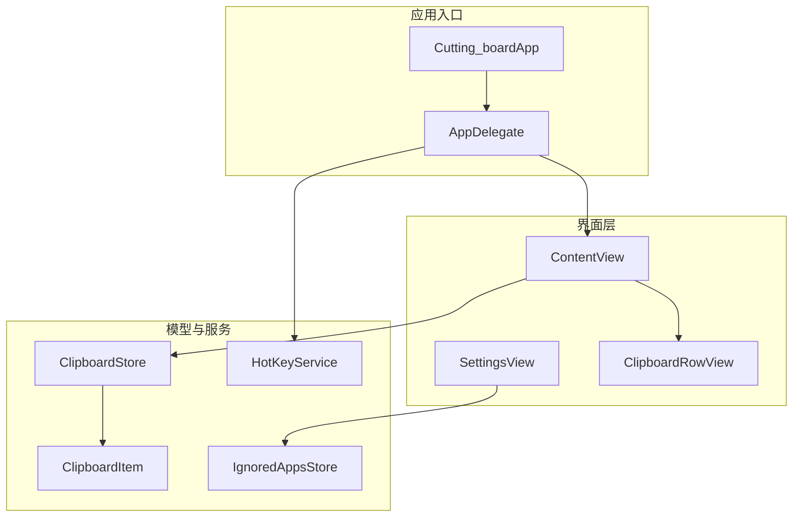
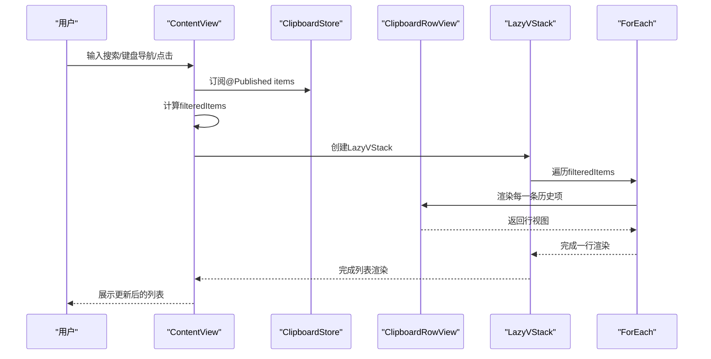
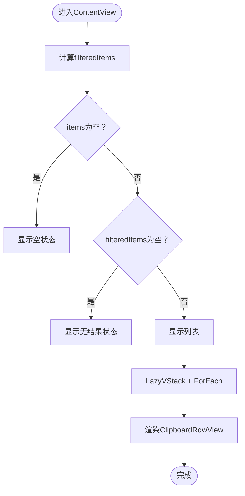
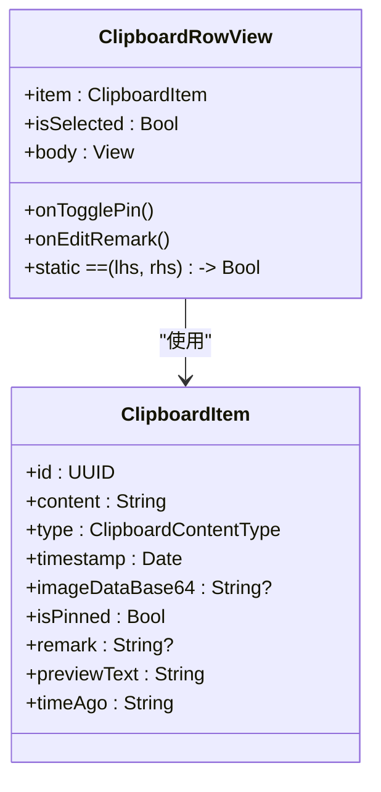
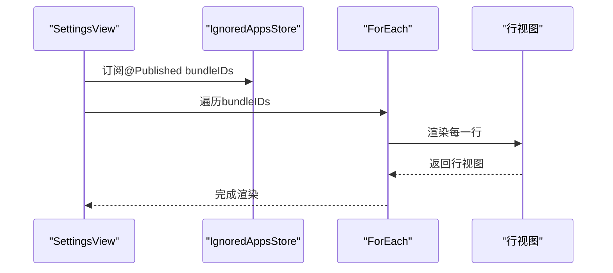
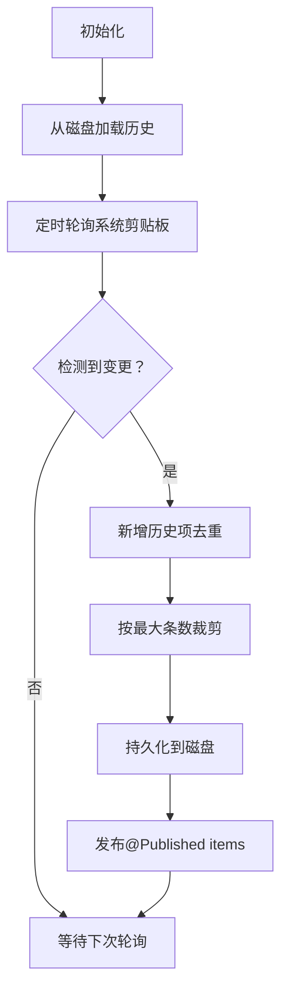
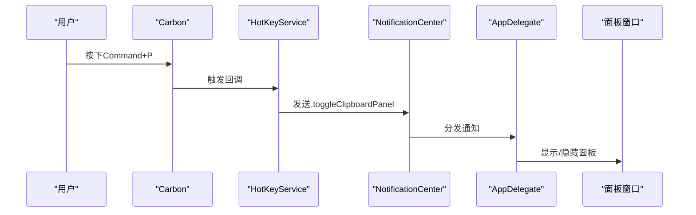
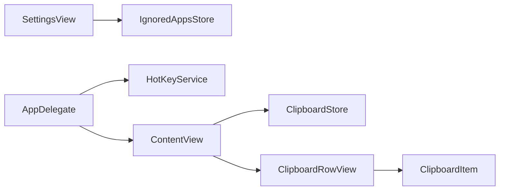

# 列表模式与ForEach优化

<cite>
**本文引用的文件**
- [ContentView.swift](file://Cutting_board/ContentView.swift)
- [SettingsView.swift](file://Cutting_board/SettingsView.swift)
- [ClipboardItem.swift](file://Cutting_board/Models/ClipboardItem.swift)
- [ClipboardStore.swift](file://Cutting_board/Services/ClipboardStore.swift)
- [IgnoredAppsStore.swift](file://Cutting_board/Services/IgnoredAppsStore.swift)
- [HotKeyService.swift](file://Cutting_board/Services/HotKeyService.swift)
- [Cutting_boardApp.swift](file://Cutting_board/Cutting_boardApp.swift)
- [list-patterns.md](file://.agents/skills/swiftui-expert-skill/references/list-patterns.md)
- [performance-patterns.md](file://.agents/skills/swiftui-expert-skill/references/performance-patterns.md)
</cite>

## 目录
1. [简介](#简介)
2. [项目结构](#项目结构)
3. [核心组件](#核心组件)
4. [架构总览](#架构总览)
5. [详细组件分析](#详细组件分析)
6. [依赖关系分析](#依赖关系分析)
7. [性能考量](#性能考量)
8. [故障排查指南](#故障排查指南)
9. [结论](#结论)
10. [附录](#附录)

## 简介
本文件围绕SwiftUI列表模式与ForEach优化展开，结合项目中的实际实现，系统阐述稳定标识的使用原则、列表性能优化策略、动态内容处理方法，并给出最佳实践与具体示例路径。重点覆盖：
- ForEach的最佳实践：稳定标识的选择、视图数量恒定性要求、内联过滤的避免策略
- 不同类型列表的实现方法：静态列表、动态列表、复杂列表项的优化技巧
- LazyVStack/LazyHStack的使用场景与性能优势
- 通过代码级分析与可视化图表，帮助读者快速掌握高性能列表设计

## 项目结构
该项目是一个基于macOS的菜单栏应用，提供剪贴板历史面板与设置界面。列表相关的核心逻辑集中在内容视图与模型层，服务层负责数据持久化与系统交互。

**图表来源**
- [Cutting_boardApp.swift](file://Cutting_board/Cutting_boardApp.swift#L11-L31)
- [AppDelegate](file://Cutting_board/Cutting_boardApp.swift#L35-L143)
- [ContentView.swift](file://Cutting_board/ContentView.swift#L20-L305)
- [SettingsView.swift](file://Cutting_board/SettingsView.swift#L11-L89)
- [ClipboardStore.swift](file://Cutting_board/Services/ClipboardStore.swift#L14-L222)
- [ClipboardItem.swift](file://Cutting_board/Models/ClipboardItem.swift#L17-L89)
- [IgnoredAppsStore.swift](file://Cutting_board/Services/IgnoredAppsStore.swift#L16-L40)
- [HotKeyService.swift](file://Cutting_board/Services/HotKeyService.swift#L30-L81)

**章节来源**
- [Cutting_boardApp.swift](file://Cutting_board/Cutting_boardApp.swift#L11-L31)
- [Cutting_board/ContentView.swift](file://Cutting_board/ContentView.swift#L20-L305)
- [Cutting_board/SettingsView.swift](file://Cutting_board/SettingsView.swift#L11-L89)

## 核心组件
- 内容视图（ContentView）：负责构建顶部标题、搜索框、空状态、无结果状态以及列表区域；列表采用LazyVStack包裹的ForEach，支持键盘导航、滚动定位与无障碍访问。
- 列表行视图（ClipboardRowView）：单条历史项的渲染视图，包含缩略图、内容预览、备注行、时间描述与操作按钮；通过Equatable与修饰符优化重绘与动画。
- 数据模型（ClipboardItem）：实现Identifiable协议，提供稳定的id与预览文本、相对时间等便捷属性。
- 存储服务（ClipboardStore）：负责剪贴板监控、历史增删改查、排序与持久化，暴露@Published数组供视图订阅。
- 设置视图（SettingsView）：展示忽略的应用列表，使用ForEach配合稳定标识进行动态列表渲染。
- 快捷键服务（HotKeyService）：注册全局快捷键，触发面板显示/隐藏。
- 忽略应用存储（IgnoredAppsStore）：维护忽略的应用Bundle ID列表。

**章节来源**
- [ContentView.swift](file://Cutting_board/ContentView.swift#L20-L305)
- [ClipboardRowView](file://Cutting_board/ContentView.swift#L321-L471)
- [ClipboardItem.swift](file://Cutting_board/Models/ClipboardItem.swift#L17-L89)
- [ClipboardStore.swift](file://Cutting_board/Services/ClipboardStore.swift#L14-L222)
- [SettingsView.swift](file://Cutting_board/SettingsView.swift#L11-L89)
- [HotKeyService.swift](file://Cutting_board/Services/HotKeyService.swift#L30-L81)
- [IgnoredAppsStore.swift](file://Cutting_board/Services/IgnoredAppsStore.swift#L16-L40)

## 架构总览
下图展示了列表渲染的关键流程：视图层通过状态驱动数据流，服务层提供数据与事件，最终由ForEach与Lazy容器完成高效渲染。

**图表来源**
- [ContentView.swift](file://Cutting_board/ContentView.swift#L29-L35)
- [ContentView.swift](file://Cutting_board/ContentView.swift#L184-L207)
- [ContentView.swift](file://Cutting_board/ContentView.swift#L210-L235)
- [ClipboardStore.swift](file://Cutting_board/Services/ClipboardStore.swift#L17-L18)

## 详细组件分析

### 组件一：ContentView（列表主视图）
- 稳定标识与过滤策略
  - 使用计算属性filteredItems进行外层过滤，避免在ForEach内部进行内联过滤，从而保持ForEach的稳定标识与一致的视图数量。
  - 列表主体使用LazyVStack包裹ForEach，确保只有可见区域的子视图被创建，提升性能。
- 键盘导航与滚动定位
  - 通过onKeyPress监听上下方向键，维护selectedId并在onChange中联动ScrollViewReader的scrollTo实现平滑滚动定位。
- 动态内容与空状态
  - 根据store.items与filteredItems是否为空，切换空状态、无结果状态与列表状态，并通过.animation与.transition提升过渡体验。
- 行视图与可访问性
  - 每个列表行通过listRow函数生成，设置id(item.id)与accessibilityLabel/traits，确保可访问性与稳定标识。

**图表来源**
- [ContentView.swift](file://Cutting_board/ContentView.swift#L29-L35)
- [ContentView.swift](file://Cutting_board/ContentView.swift#L184-L207)
- [ContentView.swift](file://Cutting_board/ContentView.swift#L210-L235)

**章节来源**
- [ContentView.swift](file://Cutting_board/ContentView.swift#L29-L35)
- [ContentView.swift](file://Cutting_board/ContentView.swift#L184-L207)
- [ContentView.swift](file://Cutting_board/ContentView.swift#L210-L235)

### 组件二：ClipboardRowView（列表行视图）
- 稳定标识与等价性
  - 实现Equatable，比较id、isSelected、remark、isPinned等关键字段，减少不必要的重绘。
  - 使用.equatable()修饰符进一步优化diff算法。
- 视图数量恒定性
  - 行内布局采用固定数量的子视图（预览、备注行、时间、操作按钮），保证ForEach中每条数据对应相同数量的子视图。
- 性能优化细节
  - 使用compositingGroup减少合成开销；task(id: item.id)异步加载图片缩略图并缓存；hover状态与选中阴影动画受reduceMotion环境变量控制。

**图表来源**
- [ClipboardRowView](file://Cutting_board/ContentView.swift#L321-L471)
- [ClipboardItem.swift](file://Cutting_board/Models/ClipboardItem.swift#L17-L89)

**章节来源**
- [ClipboardRowView](file://Cutting_board/ContentView.swift#L321-L471)
- [ClipboardItem.swift](file://Cutting_board/Models/ClipboardItem.swift#L17-L89)

### 组件三：SettingsView（静态/动态列表示例）
- 稳定标识
  - 使用ForEach(ignoredStore.bundleIDs, id: \.self)为字符串数组提供稳定标识，避免使用.indices。
- 动态内容处理
  - 忽略应用列表随IgnoredAppsStore.bundleIDs变化而动态更新，列表项数量可变但每项的视图结构保持一致。
- 复杂列表项优化
  - 每行包含图标、名称、占位符与移除按钮，视图数量恒定，适合懒加载容器。

**图表来源**
- [SettingsView.swift](file://Cutting_board/SettingsView.swift#L49-L76)
- [IgnoredAppsStore.swift](file://Cutting_board/Services/IgnoredAppsStore.swift#L19-L21)

**章节来源**
- [SettingsView.swift](file://Cutting_board/SettingsView.swift#L49-L76)
- [IgnoredAppsStore.swift](file://Cutting_board/Services/IgnoredAppsStore.swift#L19-L21)

### 组件四：ClipboardStore（数据源与性能影响）
- 稳定标识与一致性
  - ClipboardItem实现Identifiable，id为UUID，确保ForEach稳定标识。
- 动态更新与排序
  - 通过整体替换items数组的方式触发@Published，保持列表视图的稳定更新。
  - 支持钉住排序与最大条数裁剪，避免列表无限增长。
- 持久化与线程安全
  - 使用后台队列进行读写，主线程更新UI，避免阻塞。

**图表来源**
- [ClipboardStore.swift](file://Cutting_board/Services/ClipboardStore.swift#L31-L53)
- [ClipboardStore.swift](file://Cutting_board/Services/ClipboardStore.swift#L65-L90)
- [ClipboardStore.swift](file://Cutting_board/Services/ClipboardStore.swift#L110-L115)
- [ClipboardStore.swift](file://Cutting_board/Services/ClipboardStore.swift#L183-L221)

**章节来源**
- [ClipboardStore.swift](file://Cutting_board/Services/ClipboardStore.swift#L14-L222)
- [ClipboardItem.swift](file://Cutting_board/Models/ClipboardItem.swift#L17-L45)

### 组件五：HotKeyService（触发列表交互）
- 全局快捷键注册与通知分发
  - 使用Carbon API注册Command+P，通过NotificationCenter在任意应用焦点下触发面板显示/隐藏。
- 与列表交互
  - AppDelegate接收通知后调用showClipboardPanel，将焦点设置到列表底层视图，便于键盘导航。

**图表来源**
- [HotKeyService.swift](file://Cutting_board/Services/HotKeyService.swift#L36-L69)
- [Cutting_boardApp.swift](file://Cutting_board/Cutting_boardApp.swift#L49-L66)
- [Cutting_boardApp.swift](file://Cutting_board/Cutting_boardApp.swift#L100-L142)

**章节来源**
- [HotKeyService.swift](file://Cutting_board/Services/HotKeyService.swift#L30-L81)
- [Cutting_boardApp.swift](file://Cutting_board/Cutting_boardApp.swift#L35-L143)

## 依赖关系分析
- 视图层依赖于服务层的数据与状态，通过@ObservedObject与@State维持响应式更新。
- ClipboardRowView依赖ClipboardItem的稳定标识与等价性，确保列表diff正确。
- SettingsView依赖IgnoredAppsStore的bundleIDs，使用稳定标识渲染动态列表。
- AppDelegate与HotKeyService解耦，通过通知机制触发面板显示。

**图表来源**
- [ContentView.swift](file://Cutting_board/ContentView.swift#L20-L30)
- [SettingsView.swift](file://Cutting_board/SettingsView.swift#L11-L13)
- [ClipboardStore.swift](file://Cutting_board/Services/ClipboardStore.swift#L14-L18)
- [IgnoredAppsStore.swift](file://Cutting_board/Services/IgnoredAppsStore.swift#L16-L21)
- [HotKeyService.swift](file://Cutting_board/Services/HotKeyService.swift#L30-L34)
- [Cutting_boardApp.swift](file://Cutting_board/Cutting_boardApp.swift#L35-L44)

**章节来源**
- [ContentView.swift](file://Cutting_board/ContentView.swift#L20-L30)
- [SettingsView.swift](file://Cutting_board/SettingsView.swift#L11-L13)
- [ClipboardStore.swift](file://Cutting_board/Services/ClipboardStore.swift#L14-L18)
- [IgnoredAppsStore.swift](file://Cutting_board/Services/IgnoredAppsStore.swift#L16-L21)
- [HotKeyService.swift](file://Cutting_board/Services/HotKeyService.swift#L30-L34)
- [Cutting_boardApp.swift](file://Cutting_board/Cutting_boardApp.swift#L35-L44)

## 性能考量
- 稳定标识与视图数量恒定性
  - ForEach必须提供稳定标识，避免使用.indices；每条数据对应的视图数量应保持恒定，防止diff不稳定。
  - 参考：[list-patterns.md](file://.agents/skills/swiftui-expert-skill/references/list-patterns.md#L3-L50)
- 内联过滤的避免
  - 不要在ForEach内部进行过滤，应预先计算并缓存过滤结果，减少每次更新的identity变化。
  - 参考：[list-patterns.md](file://.agents/skills/swiftui-expert-skill/references/list-patterns.md#L52-L71)
- Lazy容器的使用
  - 大型列表使用LazyVStack/LazyHStack延迟创建子视图，显著降低内存占用与首帧耗时。
  - 参考：[performance-patterns.md](file://.agents/skills/swiftui-expert-skill/references/performance-patterns.md#L157-L179)
- 视图等价性与POD优化
  - 对昂贵视图实现Equatable或采用POD包装，减少diff成本。
  - 参考：[performance-patterns.md](file://.agents/skills/swiftui-expert-skill/references/performance-patterns.md#L82-L156)
- 状态更新与热点路径
  - 避免在滚动、动画等热点路径频繁更新状态；必要时进行阈值判断与去抖。
  - 参考：[performance-patterns.md](file://.agents/skills/swiftui-expert-skill/references/performance-patterns.md#L23-L40)

## 故障排查指南
- 列表闪烁或动画异常
  - 检查是否为每条数据提供了稳定id；确认行视图实现了Equatable并使用.equatable()修饰。
  - 参考：[ContentView.swift](file://Cutting_board/ContentView.swift#L190-L191), [ClipboardRowView](file://Cutting_board/ContentView.swift#L327-L332)
- 搜索后选中项丢失
  - onChange中根据selectedId检查是否仍在filteredItems中，若不在则重新选择第一条。
  - 参考：[ContentView.swift](file://Cutting_board/ContentView.swift#L64-L68)
- 快捷键无效
  - 确认HotKeyService注册成功，AppDelegate已添加通知观察者。
  - 参考：[HotKeyService.swift](file://Cutting_board/Services/HotKeyService.swift#L36-L69), [Cutting_boardApp.swift](file://Cutting_board/Cutting_boardApp.swift#L49-L66)
- 列表无法获得焦点
  - AppDelegate在显示面板后递归查找NSTableView并设置第一响应者。
  - 参考：[Cutting_boardApp.swift](file://Cutting_board/Cutting_boardApp.swift#L108-L121)

**章节来源**
- [ContentView.swift](file://Cutting_board/ContentView.swift#L64-L68)
- [ContentView.swift](file://Cutting_board/ContentView.swift#L190-L191)
- [ClipboardRowView](file://Cutting_board/ContentView.swift#L327-L332)
- [HotKeyService.swift](file://Cutting_board/Services/HotKeyService.swift#L36-L69)
- [Cutting_boardApp.swift](file://Cutting_board/Cutting_boardApp.swift#L108-L121)

## 结论
本项目在列表渲染方面体现了多项性能优化实践：稳定的Identifiable标识、恒定的视图数量、避免内联过滤、Lazy容器的使用、行视图的等价性与POD优化，以及键盘导航与无障碍访问的完整支持。通过这些策略，列表在大数据量场景下仍能保持流畅的交互与良好的用户体验。

## 附录
- ForEach最佳实践清单
  - 使用稳定标识（如Identifiable或id: keypath），避免.indices
  - 每条数据对应固定数量的子视图
  - 预过滤并缓存，避免在ForEach内部进行过滤
  - 避免AnyView在行视图中使用
  - 参考：[list-patterns.md](file://.agents/skills/swiftui-expert-skill/references/list-patterns.md#L145-L154)
- 性能优化清单
  - 状态更新前检查值变化
  - 热点路径最小化状态更新
  - 传递所需值而非大型对象
  - 大列表使用Lazy容器
  - 避免在body中创建对象与执行重计算
  - 参考：[performance-patterns.md](file://.agents/skills/swiftui-expert-skill/references/performance-patterns.md#L365-L378)