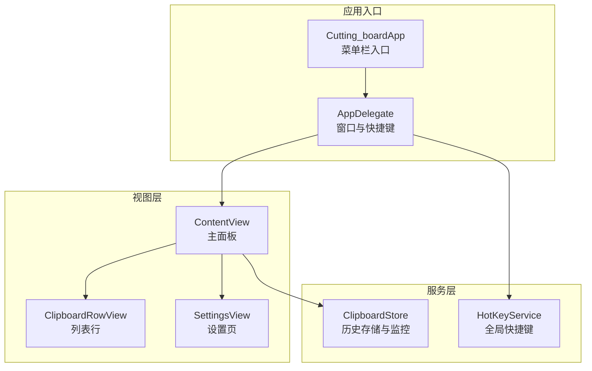
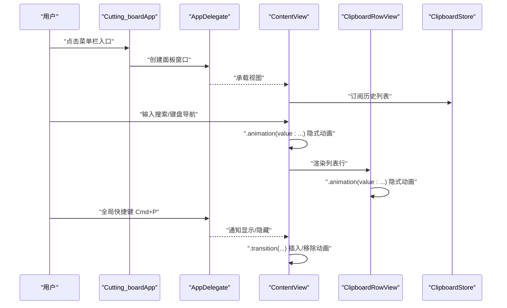
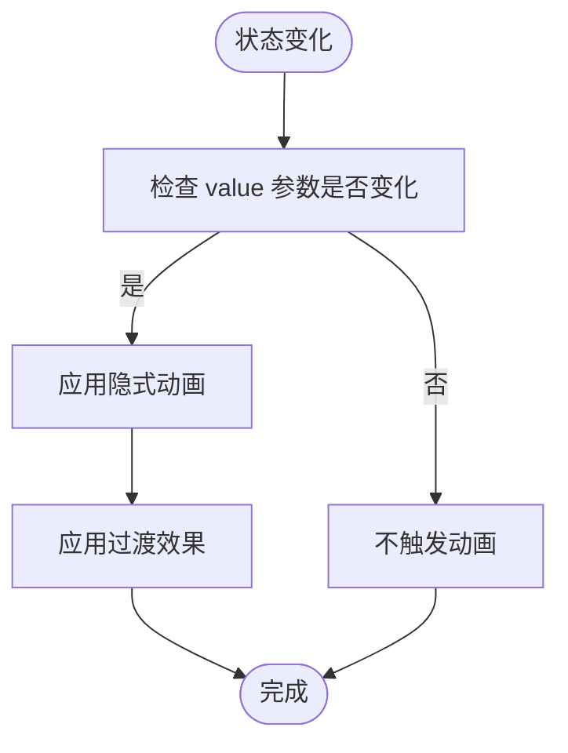
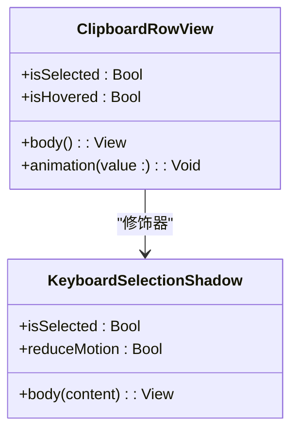
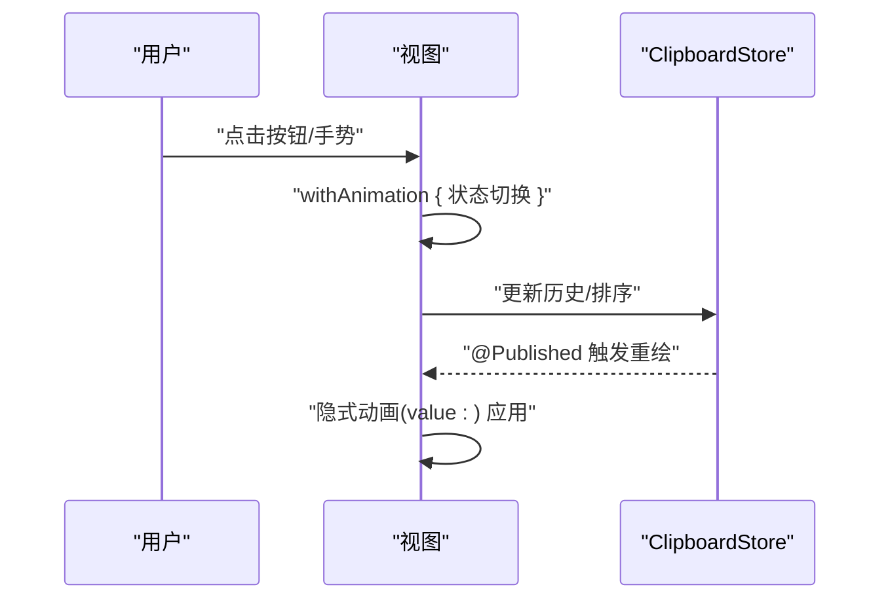
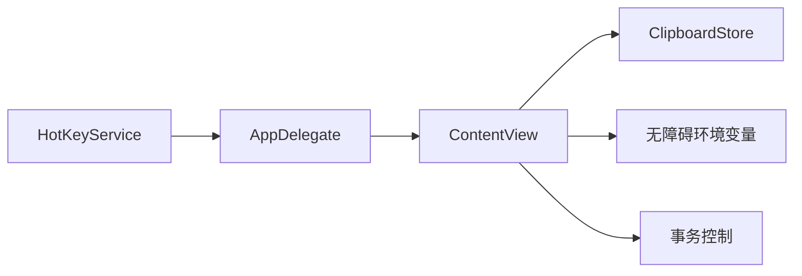

# 动画基础与核心概念

<cite>
**本文引用的文件**
- [ContentView.swift](file://Cutting_board/ContentView.swift)
- [Cutting_boardApp.swift](file://Cutting_board/Cutting_boardApp.swift)
- [ClipboardStore.swift](file://Cutting_board/Services/ClipboardStore.swift)
- [HotKeyService.swift](file://Cutting_board/Services/HotKeyService.swift)
- [animation-basics.md](file://.agents/skills/swiftui-expert-skill/references/animation-basics.md)
- [animation-transitions.md](file://.agents/skills/swiftui-expert-skill/references/animation-transitions.md)
- [animation-advanced.md](file://.agents/skills/swiftui-expert-skill/references/animation-advanced.md)
- [performance-patterns.md](file://.agents/skills/swiftui-expert-skill/references/performance-patterns.md)
- [liquid-glass.md](file://.agents/skills/swiftui-expert-skill/references/liquid-glass.md)
</cite>

## 目录
1. [简介](#简介)
2. [项目结构](#项目结构)
3. [核心组件](#核心组件)
4. [架构总览](#架构总览)
5. [详细组件分析](#详细组件分析)
6. [依赖关系分析](#依赖关系分析)
7. [性能考量](#性能考量)
8. [故障排查指南](#故障排查指南)
9. [结论](#结论)
10. [附录](#附录)

## 简介
本文件围绕 SwiftUI 动画的基础与核心概念，结合项目中的实际实现，系统讲解隐式动画与显式动画的区别、动画性能优化策略、动画控制技巧，并总结动画设计的核心原则。同时提供基于项目源码的示例路径，帮助读者快速定位到可复用的动画模式，如基于 value 参数的隐式动画、事件驱动的 withAnimation、变换动画与过渡动画的选择与组合。

## 项目结构
该项目是一个菜单栏取词工具，包含剪贴板历史面板、设置页以及全局快捷键服务。动画主要集中在内容视图与行视图中，通过隐式动画与过渡实现状态变化的平滑呈现；同时利用事务机制与无障碍能力控制动画行为。

图表来源
- [Cutting_boardApp.swift](file://Cutting_board/Cutting_boardApp.swift#L11-L31)
- [ContentView.swift](file://Cutting_board/ContentView.swift#L20-L95)
- [ClipboardStore.swift](file://Cutting_board/Services/ClipboardStore.swift#L14-L39)
- [HotKeyService.swift](file://Cutting_board/Services/HotKeyService.swift#L30-L81)

章节来源
- [Cutting_boardApp.swift](file://Cutting_board/Cutting_boardApp.swift#L11-L31)
- [ContentView.swift](file://Cutting_board/ContentView.swift#L20-L95)

## 核心组件
- 隐式动画与 value 参数
  - 在主面板中，通过为容器视图设置 .animation(..., value: ...) 实现基于状态变化的隐式动画，避免不必要的全树重绘。
  - 示例路径：[ContentView.swift](file://Cutting_board/ContentView.swift#L50-L53)
- 事件驱动动画
  - 使用 withAnimation 包裹交互状态变更，确保用户操作触发的动画具备合适的时序曲线。
  - 示例路径：[animation-basics.md](file://.agents/skills/swiftui-expert-skill/references/animation-basics.md#L139-L158)
- 变换 vs 布局动画
  - 优先使用变换（offset、scale、rotation）而非布局（frame、padding）以提升性能。
  - 示例路径：[animation-basics.md](file://.agents/skills/swiftui-expert-skill/references/animation-basics.md#L166-L179)
- 过渡动画与视图插入/移除
  - 视图插入/移除时使用 .transition(...)，并确保动画上下文位于条件结构之外。
  - 示例路径：[animation-transitions.md](file://.agents/skills/swiftui-expert-skill/references/animation-transitions.md#L38-L77)
- 事务与动画优先级
  - 隐式动画会覆盖显式动画（后声明者生效），可通过事务禁用或调整。
  - 示例路径：[animation-advanced.md](file://.agents/skills/swiftui-expert-skill/references/animation-advanced.md#L40-L50)

章节来源
- [ContentView.swift](file://Cutting_board/ContentView.swift#L50-L53)
- [animation-basics.md](file://.agents/skills/swiftui-expert-skill/references/animation-basics.md#L139-L179)
- [animation-transitions.md](file://.agents/skills/swiftui-expert-skill/references/animation-transitions.md#L38-L77)
- [animation-advanced.md](file://.agents/skills/swiftui-expert-skill/references/animation-advanced.md#L40-L50)

## 架构总览
下图展示了动画在应用中的流转：用户交互触发状态变化，视图根据 value 参数产生隐式动画；当视图插入/移除时，过渡动画负责插入/移除的视觉表现；全局快捷键服务通过通知驱动面板显示/隐藏，同样受无障碍与事务控制影响。

图表来源
- [Cutting_boardApp.swift](file://Cutting_board/Cutting_boardApp.swift#L35-L98)
- [ContentView.swift](file://Cutting_board/ContentView.swift#L37-L95)
- [HotKeyService.swift](file://Cutting_board/Services/HotKeyService.swift#L12-L27)

## 详细组件分析

### 主面板动画：隐式动画与过渡
- 隐式动画
  - 容器视图对多个状态（如“是否为空”、“是否有结果”）使用 .animation(..., value: ...)，仅在对应值变化时触发动画。
  - 示例路径：[ContentView.swift](file://Cutting_board/ContentView.swift#L50-L53)
- 过渡动画
  - 使用 .transition(.opacity.combined(with: .scale(scale: 0.98))) 组合透明度与缩放，实现插入/切换时的自然过渡。
  - 示例路径：[ContentView.swift](file://Cutting_board/ContentView.swift#L53)
- 无障碍与性能
  - 通过环境变量判断是否禁用动画，避免对减少动态需求的用户造成干扰。
  - 示例路径：[ContentView.swift](file://Cutting_board/ContentView.swift#L27)

图表来源
- [ContentView.swift](file://Cutting_board/ContentView.swift#L50-L53)

章节来源
- [ContentView.swift](file://Cutting_board/ContentView.swift#L37-L54)

### 行视图动画：悬停与选中阴影
- 隐式动画
  - 行视图在悬停与选中状态变化时分别应用 .animation(..., value: ...)，实现阴影与玻璃效果的平滑过渡。
  - 示例路径：[ContentView.swift](file://Cutting_board/ContentView.swift#L314-L316), [ContentView.swift](file://Cutting_board/ContentView.swift#L381-L382)
- 性能优化
  - 使用 compositingGroup() 提升合成性能；优先变换属性而非布局属性。
  - 示例路径：[ContentView.swift](file://Cutting_board/ContentView.swift#L378-L382), [animation-basics.md](file://.agents/skills/swiftui-expert-skill/references/animation-basics.md#L166-L179)

图表来源
- [ContentView.swift](file://Cutting_board/ContentView.swift#L308-L317)
- [ContentView.swift](file://Cutting_board/ContentView.swift#L321-L387)

章节来源
- [ContentView.swift](file://Cutting_board/ContentView.swift#L308-L317)
- [ContentView.swift](file://Cutting_board/ContentView.swift#L321-L387)

### 事件驱动动画：withAnimation 与事务
- 事件驱动
  - 使用 withAnimation 包裹交互状态变更，确保反馈及时且符合预期时序。
  - 示例路径：[animation-basics.md](file://.agents/skills/swiftui-expert-skill/references/animation-basics.md#L139-L158)
- 事务控制
  - 通过事务禁用或覆盖隐式动画，或在特定上下文中统一动画策略。
  - 示例路径：[animation-advanced.md](file://.agents/skills/swiftui-expert-skill/references/animation-advanced.md#L40-L61)

图表来源
- [animation-basics.md](file://.agents/skills/swiftui-expert-skill/references/animation-basics.md#L139-L158)
- [ClipboardStore.swift](file://Cutting_board/Services/ClipboardStore.swift#L117-L147)

章节来源
- [animation-basics.md](file://.agents/skills/swiftui-expert-skill/references/animation-basics.md#L139-L158)
- [animation-advanced.md](file://.agents/skills/swiftui-expert-skill/references/animation-advanced.md#L40-L61)
- [ClipboardStore.swift](file://Cutting_board/Services/ClipboardStore.swift#L117-L147)

### 自定义动画与复杂序列
- 关键帧动画（iOS 17+）
  - 使用 .keyframeAnimator 实现多轨道同步动画（如旋转与缩放并行）。
  - 示例路径：[animation-advanced.md](file://.agents/skills/swiftui-expert-skill/references/animation-advanced.md#L224-L262)
- 阶段动画（iOS 17+）
  - 使用 .phaseAnimator 在离散阶段间自动循环，适合提示类动画。
  - 示例路径：[animation-advanced.md](file://.agents/skills/swiftui-expert-skill/references/animation-advanced.md#L96-L140)

章节来源
- [animation-advanced.md](file://.agents/skills/swiftui-expert-skill/references/animation-advanced.md#L224-L262)
- [animation-advanced.md](file://.agents/skills/swiftui-expert-skill/references/animation-advanced.md#L96-L140)

### 动画设计核心原则
- value 参数的使用
  - 仅在指定值变化时触发动画，避免全树重绘。
  - 示例路径：[ContentView.swift](file://Cutting_board/ContentView.swift#L50-L53)
- 事件驱动动画
  - 交互触发使用 withAnimation，保证即时反馈与合适时序。
  - 示例路径：[animation-basics.md](file://.agents/skills/swiftui-expert-skill/references/animation-basics.md#L139-L158)
- 变换 vs 布局动画
  - 优先使用变换属性，减少布局计算成本。
  - 示例路径：[animation-basics.md](file://.agents/skills/swiftui-expert-skill/references/animation-basics.md#L166-L179)
- 过渡与视图身份
  - 视图身份变化触发过渡，而非属性动画；过渡需置于条件结构外。
  - 示例路径：[animation-transitions.md](file://.agents/skills/swiftui-expert-skill/references/animation-transitions.md#L15-L32), [animation-transitions.md](file://.agents/skills/swiftui-expert-skill/references/animation-transitions.md#L187-L208)

章节来源
- [ContentView.swift](file://Cutting_board/ContentView.swift#L50-L53)
- [animation-basics.md](file://.agents/skills/swiftui-expert-skill/references/animation-basics.md#L139-L179)
- [animation-transitions.md](file://.agents/skills/swiftui-expert-skill/references/animation-transitions.md#L15-L32)
- [animation-transitions.md](file://.agents/skills/swiftui-expert-skill/references/animation-transitions.md#L187-L208)

## 依赖关系分析
- 视图层依赖服务层的状态发布，从而驱动动画。
- 全局快捷键服务通过通知驱动视图显示/隐藏，视图内部再根据无障碍设置决定是否播放动画。
- 事务与环境变量共同决定动画是否启用及如何执行。

图表来源
- [HotKeyService.swift](file://Cutting_board/Services/HotKeyService.swift#L12-L27)
- [Cutting_boardApp.swift](file://Cutting_board/Cutting_boardApp.swift#L35-L98)
- [ContentView.swift](file://Cutting_board/ContentView.swift#L27)
- [animation-advanced.md](file://.agents/skills/swiftui-expert-skill/references/animation-advanced.md#L40-L61)

章节来源
- [HotKeyService.swift](file://Cutting_board/Services/HotKeyService.swift#L12-L27)
- [Cutting_boardApp.swift](file://Cutting_board/Cutting_boardApp.swift#L35-L98)
- [ContentView.swift](file://Cutting_board/ContentView.swift#L27)
- [animation-advanced.md](file://.agents/skills/swiftui-expert-skill/references/animation-advanced.md#L40-L61)

## 性能考量
- 优先使用变换属性而非布局属性
  - 示例路径：[animation-basics.md](file://.agents/skills/swiftui-expert-skill/references/animation-basics.md#L166-L179)
- 精确限定动画范围
  - 将动画作用域限制在子视图，避免根节点动画风暴。
  - 示例路径：[animation-basics.md](file://.agents/skills/swiftui-expert-skill/references/animation-basics.md#L183-L198)
- 避免在热路径中频繁触发动画
  - 通过阈值判断与节流，仅在必要时触发动画。
  - 示例路径：[animation-basics.md](file://.agents/skills/swiftui-expert-skill/references/animation-basics.md#L204-L219), [performance-patterns.md](file://.agents/skills/swiftui-expert-skill/references/performance-patterns.md#L23-L40)
- 减少不必要的状态更新
  - 在热路径中比较新旧值，避免重复触发。
  - 示例路径：[performance-patterns.md](file://.agents/skills/swiftui-expert-skill/references/performance-patterns.md#L7-L21)

章节来源
- [animation-basics.md](file://.agents/skills/swiftui-expert-skill/references/animation-basics.md#L166-L198)
- [animation-basics.md](file://.agents/skills/swiftui-expert-skill/references/animation-basics.md#L204-L219)
- [performance-patterns.md](file://.agents/skills/swiftui-expert-skill/references/performance-patterns.md#L7-L21)
- [performance-patterns.md](file://.agents/skills/swiftui-expert-skill/references/performance-patterns.md#L23-L40)

## 故障排查指南
- 动画未生效
  - 检查是否将动画修饰符置于条件结构内（过渡需在条件外）。
  - 示例路径：[animation-transitions.md](file://.agents/skills/swiftui-expert-skill/references/animation-transitions.md#L62-L76)
- 动画被覆盖
  - 隐式动画会覆盖显式动画（后声明者生效），可通过事务禁用或调整。
  - 示例路径：[animation-advanced.md](file://.agents/skills/swiftui-expert-skill/references/animation-advanced.md#L40-L50)
- 动画卡顿或掉帧
  - 检查是否在热路径中频繁触发动画，是否使用了昂贵的布局属性。
  - 示例路径：[animation-basics.md](file://.agents/skills/swiftui-expert-skill/references/animation-basics.md#L204-L219), [animation-basics.md](file://.agents/skills/swiftui-expert-skill/references/animation-basics.md#L166-L179)
- 调试动画
  - 使用慢放与自定义 DebugModifier 观察动画值变化。
  - 示例路径：[animation-basics.md](file://.agents/skills/swiftui-expert-skill/references/animation-basics.md#L245-L265)

章节来源
- [animation-transitions.md](file://.agents/skills/swiftui-expert-skill/references/animation-transitions.md#L62-L76)
- [animation-advanced.md](file://.agents/skills/swiftui-expert-skill/references/animation-advanced.md#L40-L50)
- [animation-basics.md](file://.agents/skills/swiftui-expert-skill/references/animation-basics.md#L204-L219)
- [animation-basics.md](file://.agents/skills/swiftui-expert-skill/references/animation-basics.md#L245-L265)

## 结论
本项目通过合理的隐式动画与过渡策略，在保证用户体验的同时兼顾性能与可访问性。建议在实际开发中遵循“事件驱动 withAnimation + 精准 value 参数 + 变换优于布局”的原则，并在热路径中谨慎使用动画，配合事务与无障碍能力进行精细化控制。

## 附录
- 无障碍与动画
  - 通过环境变量判断是否禁用动画，尊重用户的减少动态需求。
  - 示例路径：[ContentView.swift](file://Cutting_board/ContentView.swift#L27)
- 玻璃效果与动画
  - 在支持的平台上使用玻璃效果修饰器，并注意修饰顺序与交互性。
  - 示例路径：[liquid-glass.md](file://.agents/skills/swiftui-expert-skill/references/liquid-glass.md#L176-L193), [ContentView.swift](file://Cutting_board/ContentView.swift#L56-L60)

章节来源
- [ContentView.swift](file://Cutting_board/ContentView.swift#L27)
- [liquid-glass.md](file://.agents/skills/swiftui-expert-skill/references/liquid-glass.md#L176-L193)
- [ContentView.swift](file://Cutting_board/ContentView.swift#L56-L60)