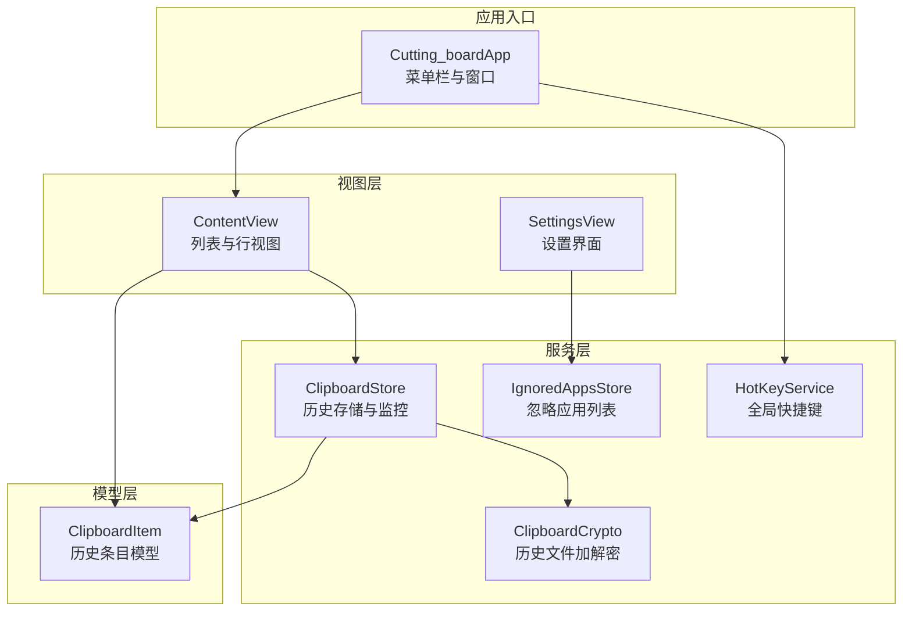
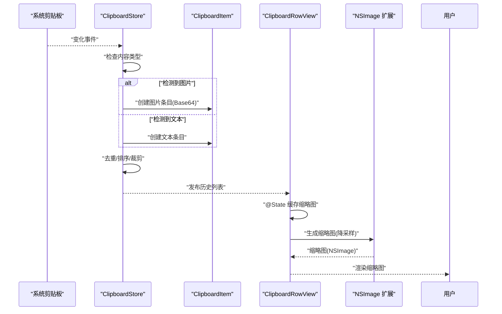
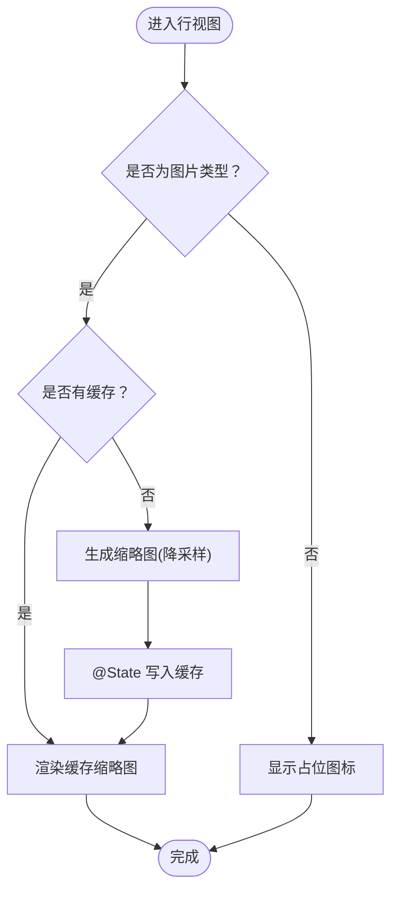
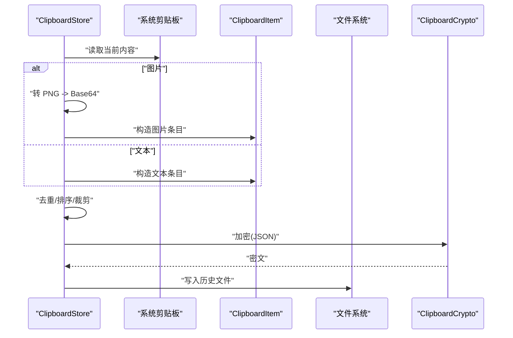
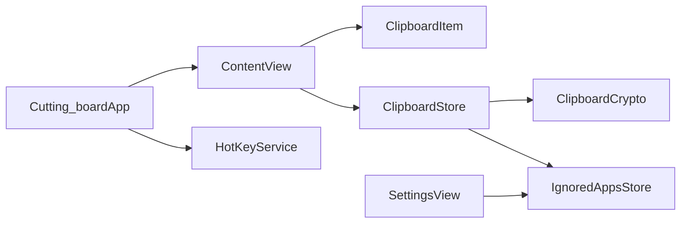

# 图像优化与AsyncImage

<cite>
**本文引用的文件**
- [ContentView.swift](file://Cutting_board/ContentView.swift)
- [ClipboardItem.swift](file://Cutting_board/Models/ClipboardItem.swift)
- [ClipboardStore.swift](file://Cutting_board/Services/ClipboardStore.swift)
- [ClipboardCrypto.swift](file://Cutting_board/Services/ClipboardCrypto.swift)
- [Cutting_boardApp.swift](file://Cutting_board/Cutting_boardApp.swift)
- [SettingsView.swift](file://Cutting_board/SettingsView.swift)
- [HotKeyService.swift](file://Cutting_board/Services/HotKeyService.swift)
- [IgnoredAppsStore.swift](file://Cutting_board/Services/IgnoredAppsStore.swift)
- [image-optimization.md](file://.agents/skills/swiftui-expert-skill/references/image-optimization.md)
</cite>

## 目录
1. [简介](#简介)
2. [项目结构](#项目结构)
3. [核心组件](#核心组件)
4. [架构总览](#架构总览)
5. [组件详解](#组件详解)
6. [依赖关系分析](#依赖关系分析)
7. [性能考量](#性能考量)
8. [故障排查指南](#故障排查指南)
9. [结论](#结论)
10. [附录](#附录)

## 简介
本文件围绕 SwiftUI 中的图像优化与 AsyncImage 使用展开，结合项目中的实际实现，系统讲解以下主题：
- AsyncImage 的正确使用方式与状态处理
- 图像降采样与缩略图生成的实现技巧
- 内存优化与性能提升策略
- 图像处理的核心原则：异步加载、尺寸控制、内存管理
- 典型场景示例：网络图像加载、本地图像处理、批量图像优化
- 图像缓存策略与性能监控建议

本项目中，剪贴板历史列表展示了基于 NSImage 的缩略图生成与缓存实践，可作为 AsyncImage 与降采样策略的参考实现。

## 项目结构
该项目采用“视图层 + 模型 + 服务层”的分层组织，图像相关逻辑集中在视图层的缩略图生成与服务层的剪贴板图像捕获与持久化之间形成闭环。

图表来源
- [ContentView.swift](file://Cutting_board/ContentView.swift#L20-L101)
- [ClipboardItem.swift](file://Cutting_board/Models/ClipboardItem.swift#L17-L45)
- [ClipboardStore.swift](file://Cutting_board/Services/ClipboardStore.swift#L14-L39)
- [Cutting_boardApp.swift](file://Cutting_board/Cutting_boardApp.swift#L12-L31)
- [SettingsView.swift](file://Cutting_board/SettingsView.swift#L11-L39)
- [HotKeyService.swift](file://Cutting_board/Services/HotKeyService.swift#L30-L69)
- [IgnoredAppsStore.swift](file://Cutting_board/Services/IgnoredAppsStore.swift#L16-L40)
- [ClipboardCrypto.swift](file://Cutting_board/Services/ClipboardCrypto.swift#L16-L46)

章节来源
- [ContentView.swift](file://Cutting_board/ContentView.swift#L20-L101)
- [ClipboardItem.swift](file://Cutting_board/Models/ClipboardItem.swift#L17-L45)
- [ClipboardStore.swift](file://Cutting_board/Services/ClipboardStore.swift#L14-L39)
- [Cutting_boardApp.swift](file://Cutting_board/Cutting_boardApp.swift#L12-L31)

## 核心组件
- 视图层：负责渲染剪贴板历史列表、行内缩略图展示与交互；在行视图中通过任务异步生成缩略图并缓存。
- 模型层：ClipboardItem 描述历史条目，其中图片类型以 Base64 字符串存储。
- 服务层：ClipboardStore 负责监控系统剪贴板、捕获图片/文本、持久化与更新；ClipboardCrypto 提供历史文件的加解密；IgnoredAppsStore 维护忽略的应用列表；HotKeyService 提供全局快捷键；SettingsView 提供设置界面。

章节来源
- [ContentView.swift](file://Cutting_board/ContentView.swift#L373-L535)
- [ClipboardItem.swift](file://Cutting_board/Models/ClipboardItem.swift#L17-L45)
- [ClipboardStore.swift](file://Cutting_board/Services/ClipboardStore.swift#L14-L39)
- [ClipboardCrypto.swift](file://Cutting_board/Services/ClipboardCrypto.swift#L16-L46)
- [SettingsView.swift](file://Cutting_board/SettingsView.swift#L11-L39)
- [HotKeyService.swift](file://Cutting_board/Services/HotKeyService.swift#L30-L69)
- [IgnoredAppsStore.swift](file://Cutting_board/Services/IgnoredAppsStore.swift#L16-L40)

## 架构总览
下图展示图像相关流程：系统剪贴板变化触发服务层捕获，图片以 Base64 存储于模型；视图层在行视图中异步生成缩略图并缓存，最终在列表中展示。

图表来源
- [ClipboardStore.swift](file://Cutting_board/Services/ClipboardStore.swift#L65-L90)
- [ClipboardItem.swift](file://Cutting_board/Models/ClipboardItem.swift#L17-L45)
- [ContentView.swift](file://Cutting_board/ContentView.swift#L447-L450)
- [ContentView.swift](file://Cutting_board/ContentView.swift#L510-L515)
- [ContentView.swift](file://Cutting_board/ContentView.swift#L539-L557)

## 组件详解

### 行视图中的缩略图生成与缓存
- 异步生成：在行视图中使用任务在后台生成缩略图，并缓存到 @State 属性中，避免重复计算。
- 降采样策略：根据固定的最大尺寸计算缩放比例，生成新尺寸的 NSImage，确保缩略图占用更少内存。
- 缓存命中：若已存在缓存，则直接使用，减少 CPU/GPU 开销。

图表来源
- [ContentView.swift](file://Cutting_board/ContentView.swift#L447-L450)
- [ContentView.swift](file://Cutting_board/ContentView.swift#L484-L498)
- [ContentView.swift](file://Cutting_board/ContentView.swift#L510-L515)
- [ContentView.swift](file://Cutting_board/ContentView.swift#L539-L557)

章节来源
- [ContentView.swift](file://Cutting_board/ContentView.swift#L373-L535)

### NSImage 缩略图扩展
- 计算缩放比例：以目标最大尺寸与原图宽高比较，取最小缩放比例，保证不超过目标尺寸。
- 新建缩略图：创建新的 NSImage 并锁定焦点，设置高质量插值，绘制缩放后的图像。
- 性能提示：高质量插值会带来一定开销，适合离屏生成与缓存复用。

章节来源
- [ContentView.swift](file://Cutting_board/ContentView.swift#L539-L557)

### 剪贴板图像捕获与持久化
- 图片捕获：优先尝试从系统剪贴板读取图片，转换为 PNG 数据并编码为 Base64，再封装为 ClipboardItem。
- 文本捕获：若非图片则读取字符串内容。
- 持久化：使用 JSON 编码与加密写入磁盘，异步队列保证主线程流畅。

图表来源
- [ClipboardStore.swift](file://Cutting_board/Services/ClipboardStore.swift#L65-L90)
- [ClipboardStore.swift](file://Cutting_board/Services/ClipboardStore.swift#L192-L230)
- [ClipboardCrypto.swift](file://Cutting_board/Services/ClipboardCrypto.swift#L32-L46)

章节来源
- [ClipboardStore.swift](file://Cutting_board/Services/ClipboardStore.swift#L65-L90)
- [ClipboardStore.swift](file://Cutting_board/Services/ClipboardStore.swift#L192-L230)
- [ClipboardItem.swift](file://Cutting_board/Models/ClipboardItem.swift#L17-L45)
- [ClipboardCrypto.swift](file://Cutting_board/Services/ClipboardCrypto.swift#L16-L46)

### AsyncImage 使用与最佳实践
- 状态处理：针对 empty、success、failure 分支分别提供占位、成功与错误占位视图。
- 过渡动画：在 URL 变化时添加过渡动画，改善视觉体验。
- 自定义占位：使用颜色叠加进度指示器或警告图标，提升可用性。
- 参考实现：仓库中提供了 AsyncImage 的最佳实践与降采样建议，可作为网络图像加载的参考。

章节来源
- [image-optimization.md](file://.agents/skills/swiftui-expert-skill/references/image-optimization.md#L5-L79)
- [image-optimization.md](file://.agents/skills/swiftui-expert-skill/references/image-optimization.md#L81-L196)

### 设置与忽略应用
- 忽略应用：通过设置界面维护忽略的应用 Bundle ID 列表，避免保存特定应用的复制内容。
- 应用信息：提供从 Bundle ID 获取应用名称与图标的工具方法。

章节来源
- [SettingsView.swift](file://Cutting_board/SettingsView.swift#L41-L88)
- [IgnoredAppsStore.swift](file://Cutting_board/Services/IgnoredAppsStore.swift#L16-L40)
- [IgnoredAppsStore.swift](file://Cutting_board/Services/IgnoredAppsStore.swift#L44-L68)

## 依赖关系分析
- 视图层依赖模型层的数据结构与服务层的状态变更。
- 服务层内部通过加密模块保障历史文件安全，通过定时器监控剪贴板变化。
- 应用入口负责创建窗口与注册全局快捷键，驱动视图层展示。

图表来源
- [ContentView.swift](file://Cutting_board/ContentView.swift#L20-L101)
- [ClipboardItem.swift](file://Cutting_board/Models/ClipboardItem.swift#L17-L45)
- [ClipboardStore.swift](file://Cutting_board/Services/ClipboardStore.swift#L14-L39)
- [ClipboardCrypto.swift](file://Cutting_board/Services/ClipboardCrypto.swift#L16-L46)
- [Cutting_boardApp.swift](file://Cutting_board/Cutting_boardApp.swift#L12-L31)
- [HotKeyService.swift](file://Cutting_board/Services/HotKeyService.swift#L30-L69)
- [SettingsView.swift](file://Cutting_board/SettingsView.swift#L11-L39)
- [IgnoredAppsStore.swift](file://Cutting_board/Services/IgnoredAppsStore.swift#L16-L40)

章节来源
- [ContentView.swift](file://Cutting_board/ContentView.swift#L20-L101)
- [ClipboardStore.swift](file://Cutting_board/Services/ClipboardStore.swift#L14-L39)
- [Cutting_boardApp.swift](file://Cutting_board/Cutting_boardApp.swift#L12-L31)

## 性能考量
- 异步加载与状态处理
  - 使用任务在后台生成缩略图，避免阻塞主线程。
  - 对 AsyncImage 的 empty、success、failure 分支进行明确处理，减少闪烁与布局抖动。
- 尺寸控制与降采样
  - 通过计算缩放比例生成固定尺寸的缩略图，降低内存占用与渲染成本。
  - 对于网络图像，可参考降采样策略在解码阶段就限制像素尺寸。
- 内存优化
  - 使用 @State 缓存缩略图，避免重复解码与缩放。
  - 对于大量图片的列表，建议结合懒加载与回收策略，及时释放不再可见的图像资源。
- I/O 与加密
  - 历史文件读写使用异步队列，避免影响 UI 流畅度。
  - 加密与解密操作尽量在后台执行，必要时使用一次性解密策略以兼容旧版本明文。

章节来源
- [ContentView.swift](file://Cutting_board/ContentView.swift#L447-L450)
- [ContentView.swift](file://Cutting_board/ContentView.swift#L539-L557)
- [image-optimization.md](file://.agents/skills/swiftui-expert-skill/references/image-optimization.md#L81-L196)
- [ClipboardStore.swift](file://Cutting_board/Services/ClipboardStore.swift#L192-L230)
- [ClipboardCrypto.swift](file://Cutting_board/Services/ClipboardCrypto.swift#L32-L46)

## 故障排查指南
- 缩略图为空或显示异常
  - 检查图片数据是否有效与 Base64 是否完整。
  - 确认缩放比例计算与新尺寸创建逻辑。
- 列表滚动卡顿
  - 确保缩略图生成在后台线程完成，并通过缓存复用。
  - 控制缩略图尺寸，避免过大导致内存峰值。
- 历史文件读取失败
  - 检查加密文件头与解密流程，确认密钥存在且有效。
  - 核对 JSON 解码日期格式策略与文件路径。
- 快捷键无效
  - 确认 Carbon 注册流程与事件回调是否成功安装。
  - 检查命令键组合是否冲突。

章节来源
- [ContentView.swift](file://Cutting_board/ContentView.swift#L510-L515)
- [ContentView.swift](file://Cutting_board/ContentView.swift#L539-L557)
- [ClipboardStore.swift](file://Cutting_board/Services/ClipboardStore.swift#L192-L230)
- [ClipboardCrypto.swift](file://Cutting_board/Services/ClipboardCrypto.swift#L32-L46)
- [HotKeyService.swift](file://Cutting_board/Services/HotKeyService.swift#L36-L69)

## 结论
本项目在剪贴板图像处理上体现了良好的异步与降采样实践：通过后台任务生成缩略图并缓存，结合固定尺寸的降采样策略，有效降低了内存与渲染压力。对于网络图像加载，可参考 AsyncImage 的状态处理与降采样建议，进一步优化用户体验与性能表现。同时，历史文件的加密与异步持久化也为长期使用提供了安全保障。

## 附录
- 代码片段路径（不含具体代码内容）
  - AsyncImage 基本用法与状态处理：[image-optimization.md](file://.agents/skills/swiftui-expert-skill/references/image-optimization.md#L5-L25)
  - AsyncImage 自定义占位与过渡动画：[image-optimization.md](file://.agents/skills/swiftui-expert-skill/references/image-optimization.md#L27-L79)
  - 图像降采样与异步解码建议：[image-optimization.md](file://.agents/skills/swiftui-expert-skill/references/image-optimization.md#L81-L196)
  - 行视图缩略图生成与缓存：[ContentView.swift](file://Cutting_board/ContentView.swift#L447-L450)
  - NSImage 缩略图扩展实现：[ContentView.swift](file://Cutting_board/ContentView.swift#L539-L557)
  - 剪贴板图片捕获与 Base64 存储：[ClipboardStore.swift](file://Cutting_board/Services/ClipboardStore.swift#L65-L90)
  - 历史文件加密与解密流程：[ClipboardCrypto.swift](file://Cutting_board/Services/ClipboardCrypto.swift#L32-L46)
  - 设置界面与忽略应用列表：[SettingsView.swift](file://Cutting_board/SettingsView.swift#L41-L88), [IgnoredAppsStore.swift](file://Cutting_board/Services/IgnoredAppsStore.swift#L16-L40)
  - 全局快捷键注册与回调：[HotKeyService.swift](file://Cutting_board/Services/HotKeyService.swift#L36-L69)