# 布局最佳实践

<cite>
**本文档引用的文件**
- [ContentView.swift](file://Cutting_board/ContentView.swift)
- [SettingsView.swift](file://Cutting_board/SettingsView.swift)
- [Cutting_boardApp.swift](file://Cutting_board/Cutting_boardApp.swift)
- [ClipboardItem.swift](file://Cutting_board/Models/ClipboardItem.swift)
- [ClipboardStore.swift](file://Cutting_board/Services/ClipboardStore.swift)
- [HotKeyService.swift](file://Cutting_board/Services/HotKeyService.swift)
- [IgnoredAppsStore.swift](file://Cutting_board/Services/IgnoredAppsStore.swift)
- [ClipboardCrypto.swift](file://Cutting_board/Services/ClipboardCrypto.swift)
- [layout-best-practices.md](file://.agents/skills/swiftui-expert-skill/references/layout-best-practices.md)
- [modern-apis.md](file://.agents/skills/swiftui-expert-skill/references/modern-apis.md)
- [performance-patterns.md](file://.agents/skills/swiftui-expert-skill/references/performance-patterns.md)
</cite>

## 目录
1. [简介](#简介)
2. [项目结构](#项目结构)
3. [核心组件](#核心组件)
4. [架构概览](#架构概览)
5. [详细组件分析](#详细组件分析)
6. [依赖关系分析](#依赖关系分析)
7. [性能考虑](#性能考虑)
8. [故障排除指南](#故障排除指南)
9. [结论](#结论)

## 简介

本文档基于Cutting_board项目的实际代码实现，深入探讨SwiftUI布局的最佳实践。该项目是一个macOS菜单栏应用，提供了剪贴板历史管理功能，展示了现代SwiftUI开发中的布局设计原则、性能优化策略和无障碍功能支持。

通过分析项目中的实际实现，我们将重点讲解：
- 相对布局的使用原则和上下文无关视图的设计方法
- 布局性能优化策略和布局抖动的避免
- 合理使用SwiftUI修饰符和事件处理函数的分离
- 响应式布局、复杂容器设计和无障碍功能支持的具体实现
- 布局调试技巧和常见布局问题的解决方案

## 项目结构

Cutting_board项目采用清晰的分层架构，每个模块都有明确的职责分工：

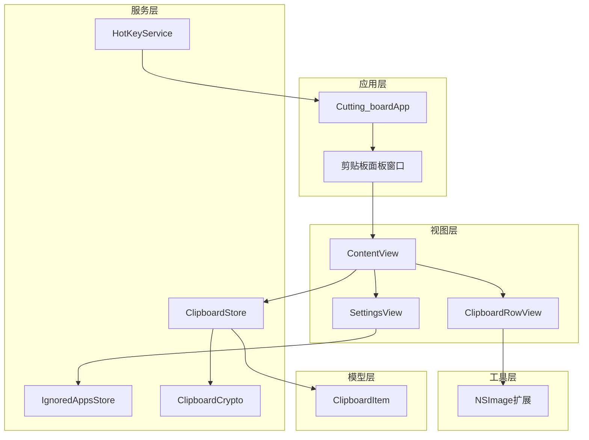

**图表来源**
- [Cutting_boardApp.swift](file://Cutting_board/Cutting_boardApp.swift#L15-L31)
- [ContentView.swift](file://Cutting_board/ContentView.swift#L20-L95)
- [SettingsView.swift](file://Cutting_board/SettingsView.swift#L11-L39)

**章节来源**
- [Cutting_boardApp.swift](file://Cutting_board/Cutting_boardApp.swift#L1-L144)
- [ContentView.swift](file://Cutting_board/ContentView.swift#L1-L500)

## 核心组件

### 主要视图组件

项目包含三个核心视图组件，每个都体现了不同的布局设计理念：

#### ContentView - 主界面布局
主界面采用了经典的分层布局模式，展示了如何构建复杂的用户界面：

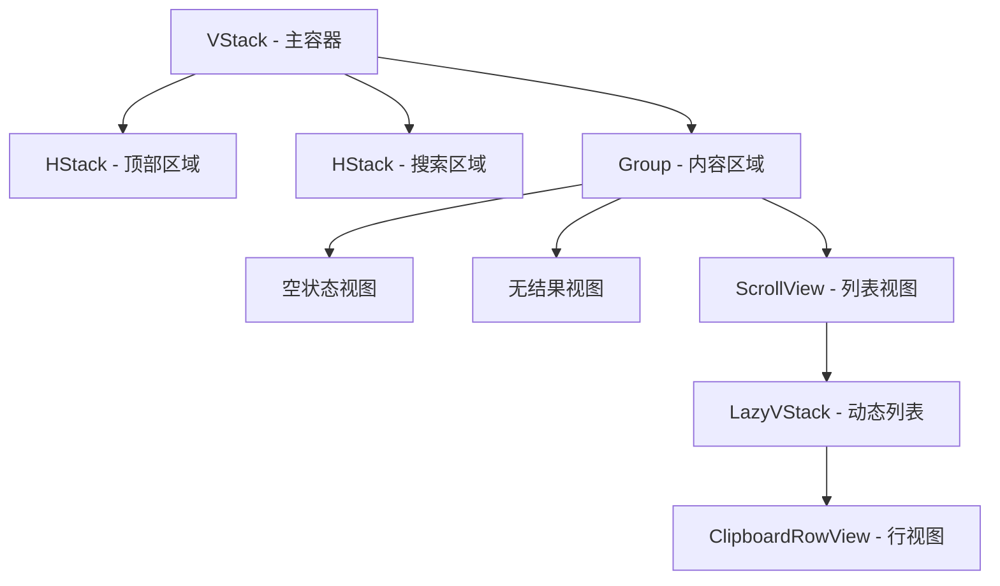

**图表来源**
- [ContentView.swift](file://Cutting_board/ContentView.swift#L37-L54)
- [ContentView.swift](file://Cutting_board/ContentView.swift#L184-L207)

#### SettingsView - 设置界面布局
设置界面展示了如何构建信息丰富的配置页面：

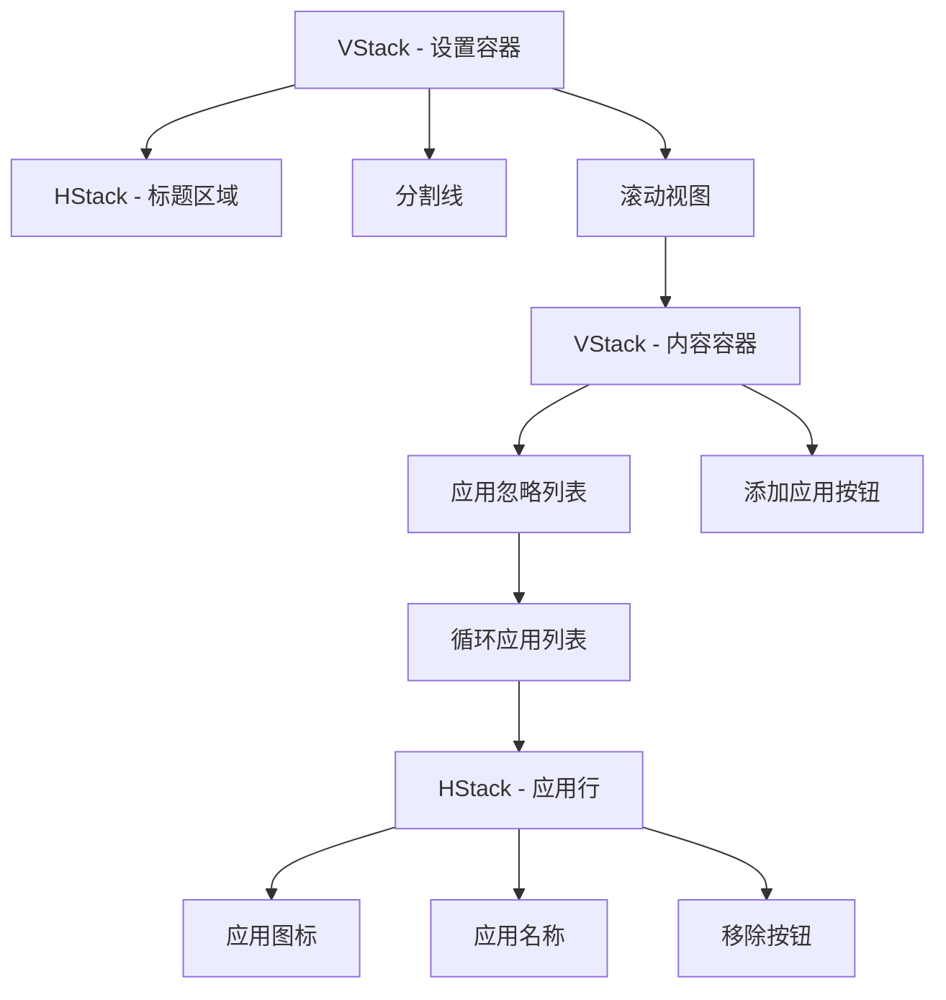

**图表来源**
- [SettingsView.swift](file://Cutting_board/SettingsView.swift#L15-L39)
- [SettingsView.swift](file://Cutting_board/SettingsView.swift#L41-L88)

#### ClipboardRowView - 复杂行视图
这是项目中最复杂的布局组件，展示了如何在一个单一视图中处理多种内容类型：

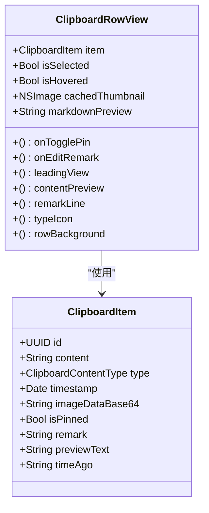

**图表来源**
- [ClipboardRowView.swift](file://Cutting_board/ContentView.swift#L321-L471)
- [ClipboardItem.swift](file://Cutting_board/Models/ClipboardItem.swift#L17-L45)

**章节来源**
- [ContentView.swift](file://Cutting_board/ContentView.swift#L20-L305)
- [SettingsView.swift](file://Cutting_board/SettingsView.swift#L11-L89)

## 架构概览

### 数据流架构

项目采用MVVM架构模式，通过观察者模式实现数据绑定：

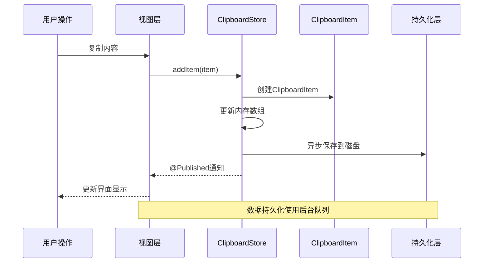

**图表来源**
- [ClipboardStore.swift](file://Cutting_board/Services/ClipboardStore.swift#L94-L108)
- [ClipboardStore.swift](file://Cutting_board/Services/ClipboardStore.swift#L210-L221)

### 事件处理流程

应用实现了完整的键盘导航和快捷键支持：

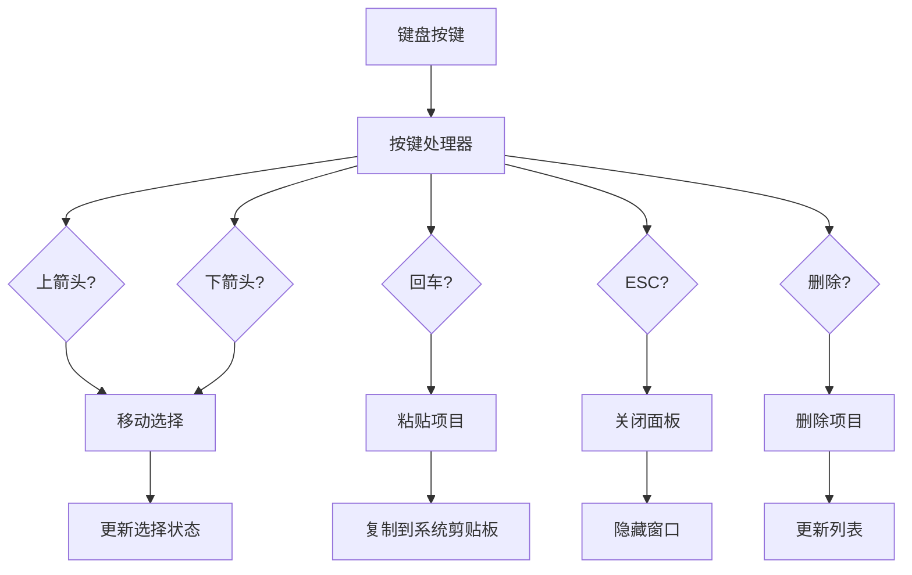

**图表来源**
- [ContentView.swift](file://Cutting_board/ContentView.swift#L69-L87)
- [ContentView.swift](file://Cutting_board/ContentView.swift#L276-L296)

**章节来源**
- [Cutting_boardApp.swift](file://Cutting_board/Cutting_boardApp.swift#L35-L143)
- [HotKeyService.swift](file://Cutting_board/Services/HotKeyService.swift#L30-L81)

## 详细组件分析

### 相对布局设计原则

#### 使用相对尺寸而非硬编码值

项目严格遵循相对布局原则，避免使用固定的像素值：

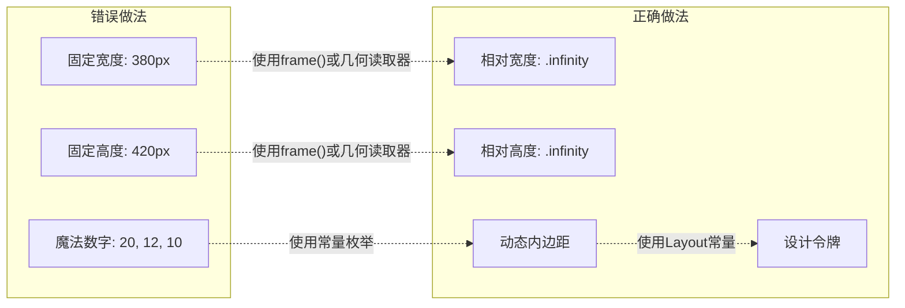

**图表来源**
- [layout-best-practices.md](file://.agents/skills/swiftui-expert-skill/references/layout-best-practices.md#L3-L25)

#### 上下文无关视图设计

所有视图都设计为可以在任何上下文中工作：

```swift
// 在ContentView中使用
.frame(minWidth: 380, minHeight: 340, maxHeight: 560)

// 在SettingsView中使用
.frame(minWidth: 420, minHeight: 320)

// 在行视图中使用
.frame(width: thumbnailSize, height: thumbnailSize)
```

这种设计确保了视图在不同场景下的适应性。

**章节来源**
- [ContentView.swift](file://Cutting_board/ContentView.swift#L55-L56)
- [SettingsView.swift](file://Cutting_board/SettingsView.swift#L37-L38)
- [ContentView.swift](file://Cutting_board/ContentView.swift#L339-L434)

### 修饰符使用策略

#### 合理使用视觉修饰符

项目展示了如何有效使用SwiftUI的修饰符来增强用户体验：

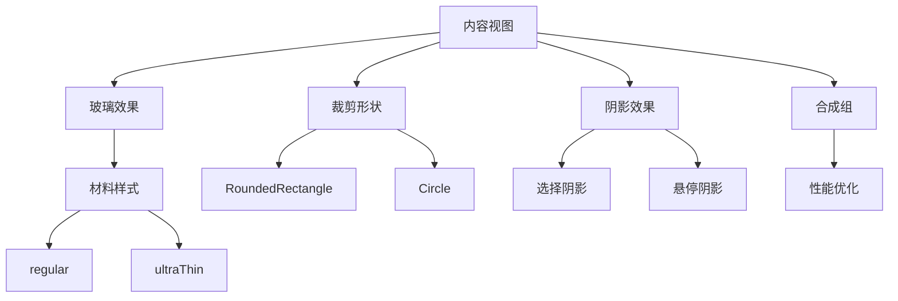

**图表来源**
- [ContentView.swift](file://Cutting_board/ContentView.swift#L56-L60)
- [ContentView.swift](file://Cutting_board/ContentView.swift#L377-L379)
- [ContentView.swift](file://Cutting_board/ContentView.swift#L378)

#### 动画和过渡效果

项目实现了智能的动画系统，根据用户的无障碍偏好进行调整：

```swift
// 根据reduceMotion环境值决定是否启用动画
.animation(reduceMotion ? nil : Layout.spring, value: store.items.isEmpty)
.animation(reduceMotion ? nil : Layout.spring, value: filteredItems.isEmpty)

// 使用组合过渡效果
.transition(.opacity.combined(with: .scale(scale: 0.98)))
```

**章节来源**
- [ContentView.swift](file://Cutting_board/ContentView.swift#L51-L53)
- [ContentView.swift](file://Cutting_board/ContentView.swift#L28-L35)

### 事件处理函数分离

#### 清晰的职责分离

项目严格遵循将布局与逻辑分离的原则：

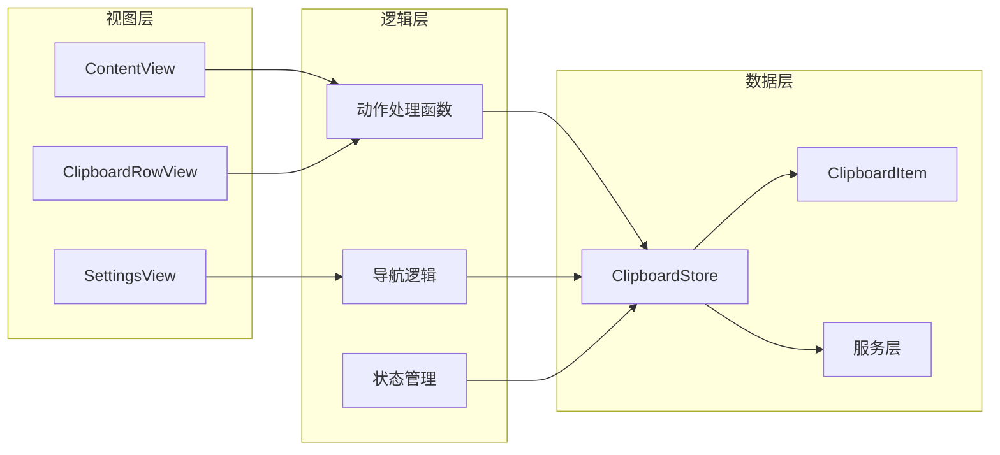

**图表来源**
- [ContentView.swift](file://Cutting_board/ContentView.swift#L20-L305)
- [ClipboardStore.swift](file://Cutting_board/Services/ClipboardStore.swift#L14-L223)

#### 具体的分离实现

```swift
// 键盘事件处理 - 分离到独立函数
.onKeyPress(.upArrow) { self.moveSelection(by: -1) }
.onKeyPress(.downArrow) { self.moveSelection(by: 1) }
.onKeyPress(.return) { self.pasteItem() }

// 点击事件处理 - 分离到独立函数
.onTapGesture(count: 1) { self.selectedId = item.id }
.onTapGesture(count: 2) { self.pasteItem(item) }

// 生命周期处理 - 分离到独立函数
.onAppear { self.selectedId = filteredItems.first?.id }
.onChange(of: searchText) { _, _ in self.handleSearchChange() }
```

**章节来源**
- [ContentView.swift](file://Cutting_board/ContentView.swift#L69-L95)
- [ContentView.swift](file://Cutting_board/ContentView.swift#L276-L304)

### 响应式布局实现

#### 自适应内容区域

项目使用Group视图实现条件渲染，避免布局抖动：

```swift
Group {
    if store.items.isEmpty {
        emptyView
    } else if filteredItems.isEmpty {
        noSearchResultsView
    } else {
        listView
    }
}
.id(store.items.isEmpty ? "empty" : (filteredItems.isEmpty ? "noResults" : "list"))
.animation(.spring(), value: store.items.isEmpty)
.animation(.spring(), value: filteredItems.isEmpty)
.transition(.opacity.combined(with: .scale(scale: 0.98)))
```

#### 动态内容预览

行视图根据内容类型动态调整布局：

```swift
private var contentPreview: some View {
    Group {
        if item.type == .text, let attr = markdownPreview {
            Text(attr).lineLimit(2)
        } else {
            Text(item.previewText).lineLimit(2)
        }
    }
}
```

**章节来源**
- [ContentView.swift](file://Cutting_board/ContentView.swift#L41-L53)
- [ContentView.swift](file://Cutting_board/ContentView.swift#L436-L444)

### 复杂容器设计

#### 多层次嵌套容器

项目展示了如何设计复杂的嵌套容器结构：

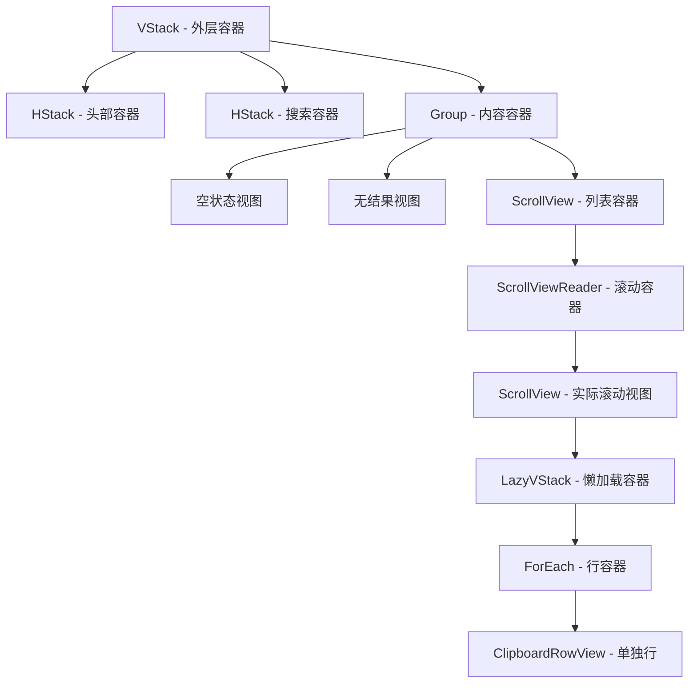

**图表来源**
- [ContentView.swift](file://Cutting_board/ContentView.swift#L37-L50)
- [ContentView.swift](file://Cutting_board/ContentView.swift#L184-L207)

#### 容器相对帧的应用

```swift
// 使用容器相对帧替代几何读取器
.frame(maxWidth: .infinity, maxHeight: .infinity)
```

**章节来源**
- [ContentView.swift](file://Cutting_board/ContentView.swift#L169-L181)
- [ContentView.swift](file://Cutting_board/ContentView.swift#L194-L200)

### 无障碍功能支持

#### 完整的无障碍标签

项目为所有交互元素提供了完整的无障碍支持：

```swift
// 头部区域的无障碍支持
.accessibilityLabel("剪贴板")
.accessibilityElement(children: .combine)

// 搜索框的无障碍支持
.accessibilityLabel("搜索")
.accessibilityHint("按内容或备注过滤列表")

// 清空按钮的无障碍支持
.accessibilityLabel("清空")
.accessibilityHint("清空未钉住的历史，已置顶项保留")

// 备注编辑的无障碍支持
.accessibilityLabel("备注")
.accessibilityHint("输入备注便于搜索")
```

#### 键盘导航支持

```swift
// 键盘快捷键支持
.onKeyPress(.upArrow) { /* 移动选择 */ }
.onKeyPress(.downArrow) { /* 移动选择 */ }
.onKeyPress(.return) { /* 粘贴项目 */ }
.onKeyPress(.escape) { /* 关闭面板 */ }
.onKeyPress(.delete) { /* 删除项目 */ }
```

**章节来源**
- [ContentView.swift](file://Cutting_board/ContentView.swift#L103-L135)
- [ContentView.swift](file://Cutting_board/ContentView.swift#L144-L158)
- [ContentView.swift](file://Cutting_board/ContentView.swift#L298-L304)

## 依赖关系分析

### 组件间依赖关系

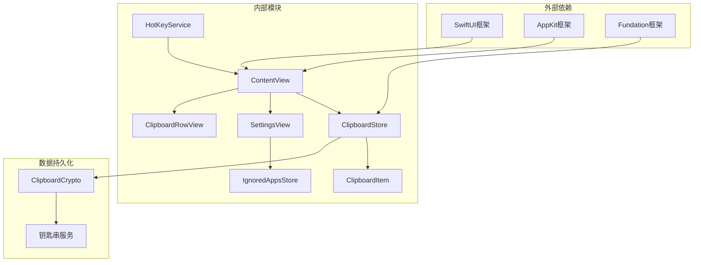

**图表来源**
- [Cutting_boardApp.swift](file://Cutting_board/Cutting_boardApp.swift#L8-L9)
- [ClipboardStore.swift](file://Cutting_board/Services/ClipboardStore.swift#L8-L11)
- [ClipboardCrypto.swift](file://Cutting_board/Services/ClipboardCrypto.swift#L8-L10)

### 性能相关的依赖

项目在性能方面有以下关键依赖：

1. **异步队列管理**：使用专用队列处理磁盘I/O操作
2. **内存缓存**：图片缩略图的缓存机制
3. **状态管理**：使用@Published属性进行响应式更新
4. **任务取消**：利用SwiftUI的任务生命周期管理

**章节来源**
- [ClipboardStore.swift](file://Cutting_board/Services/ClipboardStore.swift#L29-L30)
- [ContentView.swift](file://Cutting_board/ContentView.swift#L383-L386)

## 性能考虑

### 布局性能优化

#### 避免布局抖动

项目通过以下方式避免布局抖动：

```swift
// 使用稳定的ID确保视图重用
.listRow(for: item)
    .id(item.id)

// 使用equatable协议优化视图相等性判断
.equatable()

// 使用contentShape定义精确的点击区域
.contentShape(Rectangle())
```

#### 懒加载和虚拟化

```swift
// 使用LazyVStack处理大量数据
LazyVStack(spacing: 0) {
    ForEach(filteredItems) { item in
        listRow(for: item)
    }
}

// 使用ScrollViewReader实现程序化滚动
ScrollViewReader { proxy in
    ScrollView {
        // 列表内容
    }
    .onChange(of: selectedId) { _, newId in
        withTransaction(Transaction(animation: nil)) { 
            proxy.scrollTo(newId, anchor: .center) 
        }
    }
}
```

**章节来源**
- [ContentView.swift](file://Cutting_board/ContentView.swift#L187-L200)
- [ContentView.swift](file://Cutting_board/ContentView.swift#L218-L220)

### 内存和资源管理

#### 图片处理优化

```swift
// 使用任务缓存图片缩略图
.task(id: item.id) {
    guard item.type == .image else { return }
    cachedThumbnail = thumbnailImage
}

// 图片缩放优化
func resizedForThumbnail(maxSize: CGFloat) -> NSImage? {
    let scale = min(maxSize / width, maxSize / height, 1)
    guard scale < 1 else { return self }
    // 优化的缩放算法
}
```

#### 数据持久化优化

```swift
// 使用后台队列处理磁盘I/O
private let queue = DispatchQueue(label: "Cutting_board.storage", qos: .userInitiated)

// 异步加载和保存数据
queue.async { [weak self] in
    // 数据处理
}
```

**章节来源**
- [ContentView.swift](file://Cutting_board/ContentView.swift#L383-L386)
- [ContentView.swift](file://Cutting_board/ContentView.swift#L475-L494)
- [ClipboardStore.swift](file://Cutting_board/Services/ClipboardStore.swift#L29-L30)

### 事件处理性能

#### 键盘事件优化

```swift
// 使用环境值获取无障碍偏好
@Environment(\.accessibilityReduceMotion) private var reduceMotion

// 根据环境值优化动画性能
.animation(reduceMotion ? nil : Layout.spring, value: isSelected)
```

#### 状态更新优化

```swift
// 使用过滤后的数组避免不必要的重绘
private var filteredItems: [ClipboardItem] {
    let q = searchText.trimmingCharacters(in: .whitespacesAndNewlines)
    guard !q.isEmpty else { return store.items }
    return store.items.filter {
        $0.content.localizedStandardContains(q) || 
        ($0.remark?.localizedStandardContains(q) ?? false)
    }
}
```

**章节来源**
- [ContentView.swift](file://Cutting_board/ContentView.swift#L27-L27)
- [ContentView.swift](file://Cutting_board/ContentView.swift#L29-L35)

## 故障排除指南

### 常见布局问题及解决方案

#### 布局抖动问题

**问题症状**：界面在用户交互时出现闪烁或跳动

**解决方案**：
1. 确保使用稳定的ID标识视图
2. 避免在视图主体中使用频繁变化的状态
3. 使用equatable协议优化视图相等性判断

**相关实现**：
```swift
// 稳定的视图ID
.id(item.id)

// 视图相等性优化
.equatable()
```

#### 性能问题诊断

**问题症状**：大量数据时界面响应缓慢

**诊断方法**：
1. 使用`Self._printChanges()`调试视图更新
2. 检查是否有过度的几何读取器使用
3. 验证懒加载容器的正确使用

**调试技巧**：
```swift
// 在视图中添加调试输出
let _ = Self._printChanges()
```

#### 无障碍功能问题

**问题症状**：屏幕阅读器无法正确读取界面内容

**检查清单**：
1. 确保所有交互元素都有适当的标签
2. 验证键盘导航的完整性
3. 检查动态内容的无障碍支持

**解决方案**：
```swift
// 提供详细的无障碍标签
.accessibilityLabel("详细描述")
.accessibilityHint("使用说明")
.accessibilityAddTraits(.isHeader)
```

**章节来源**
- [performance-patterns.md](file://.agents/skills/swiftui-expert-skill/references/performance-patterns.md#L201-L221)
- [ContentView.swift](file://Cutting_board/ContentView.swift#L103-L135)

### 调试工具和技术

#### 视图更新调试

SwiftUI提供了内置的调试工具来帮助识别布局问题：

```swift
// 打印导致视图更新的原因
let _ = Self._printChanges()

// 检查视图层次结构
.debugBody()
```

#### 性能分析

使用Xcode的Instruments工具分析应用性能：
1. **Time Profiler**：分析CPU使用情况
2. **Allocations**：监控内存分配
3. **Leaks**：检测内存泄漏
4. **Leaks**：检测内存泄漏

#### 布局可视化

```swift
// 显示视图边界
.overlay(RoundedRectangle(cornerRadius: 8).stroke(Color.red, lineWidth: 1))

// 调试颜色标记
.background(Color.blue.opacity(0.1))
```

**章节来源**
- [performance-patterns.md](file://.agents/skills/swiftui-expert-skill/references/performance-patterns.md#L201-L221)

## 结论

通过分析Cutting_board项目的实际实现，我们可以总结出SwiftUI布局最佳实践的关键要点：

### 核心原则总结

1. **相对布局优于硬编码值**：使用相对尺寸和动态计算替代固定像素值
2. **上下文无关设计**：确保视图在任何环境中都能正常工作
3. **职责分离**：将布局与业务逻辑分离，提高可维护性
4. **性能优先**：优化布局性能，避免布局抖动和过度重绘

### 实践建议

1. **使用现代API**：采用新的SwiftUI API替代过时的方法
2. **合理使用修饰符**：谨慎使用视觉修饰符，避免过度装饰
3. **优化数据流**：建立清晰的数据流向，减少不必要的状态传播
4. **重视无障碍**：从设计初期就考虑无障碍功能支持

### 技术债务管理

项目展示了如何在现有代码基础上逐步改进：
- 逐步替换过时的API
- 渐进式重构复杂的布局组件
- 持续优化性能和用户体验

这些最佳实践不仅适用于当前项目，也为其他SwiftUI应用的开发提供了宝贵的参考。通过遵循这些原则，开发者可以创建出更加健壮、高效和用户友好的SwiftUI应用。