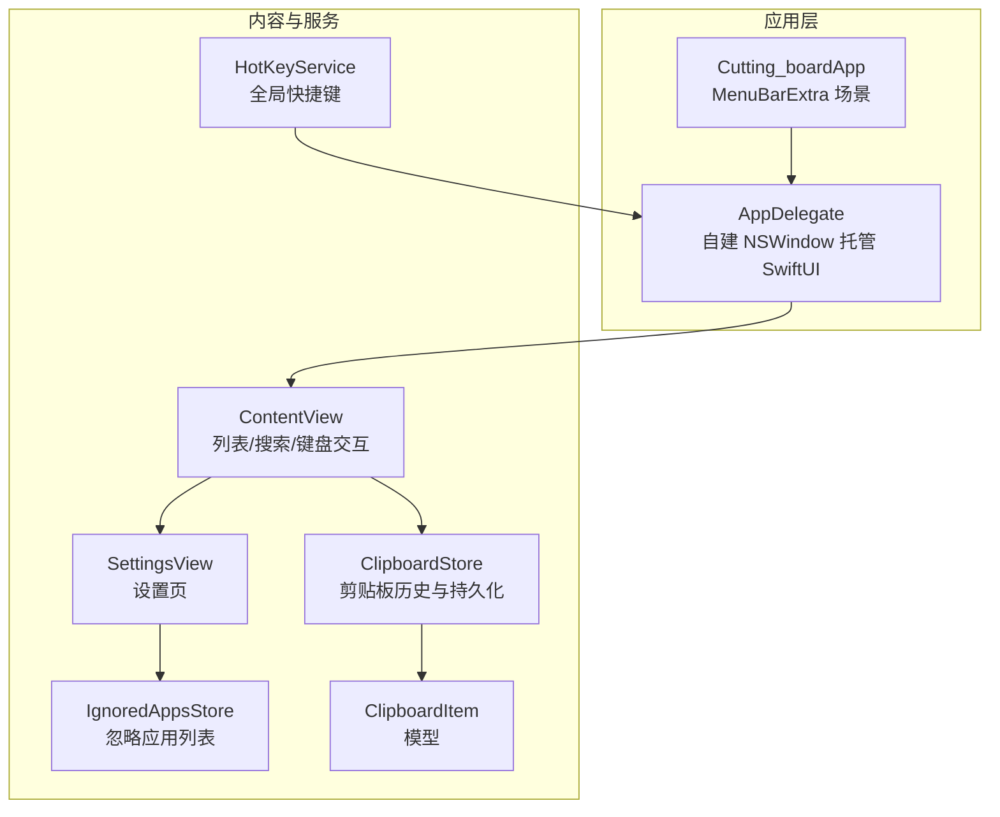
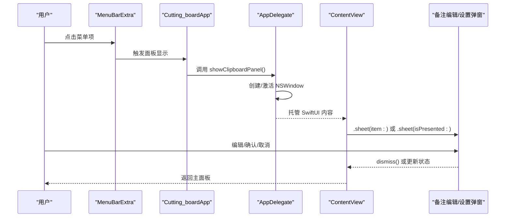
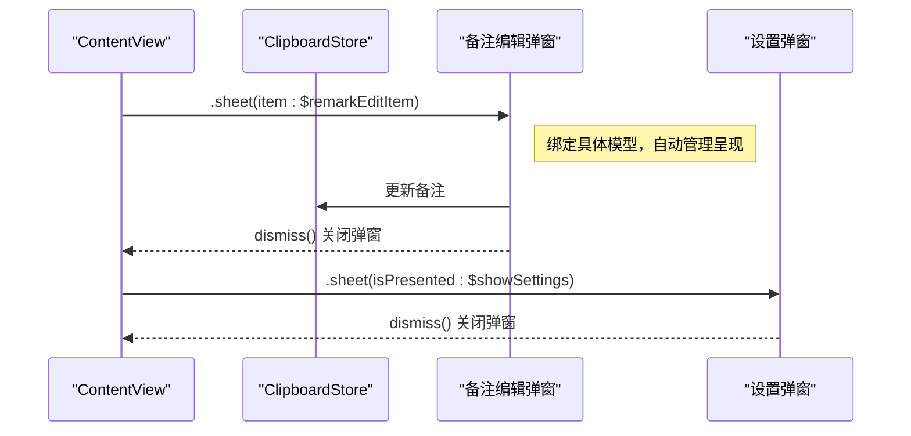
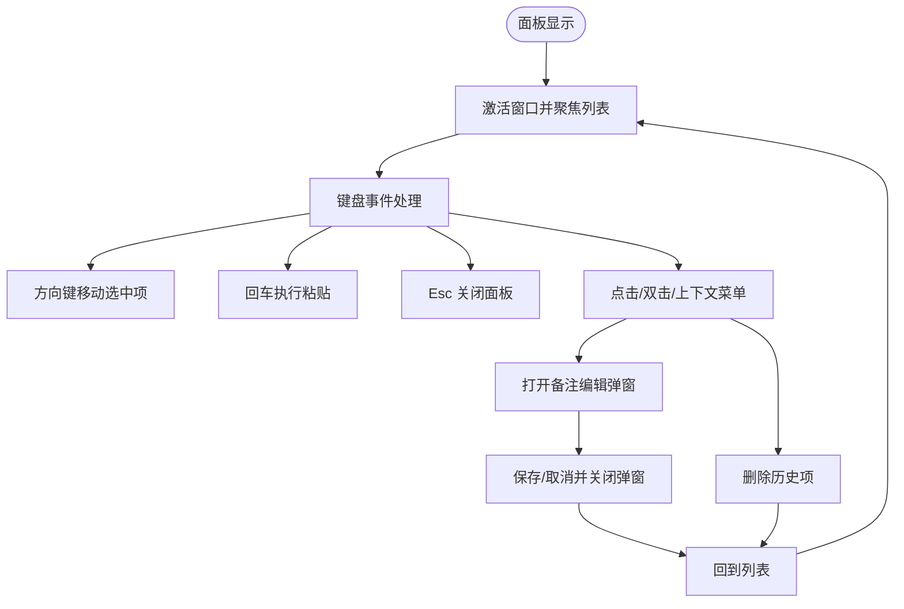
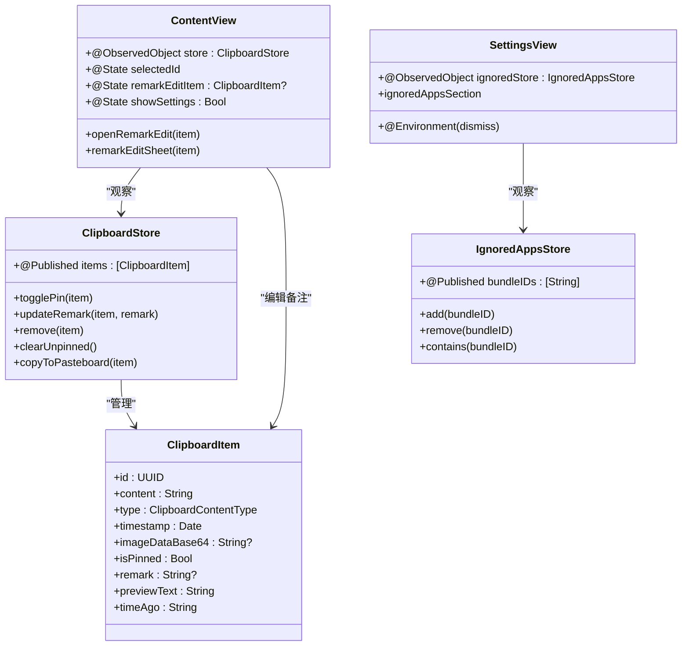
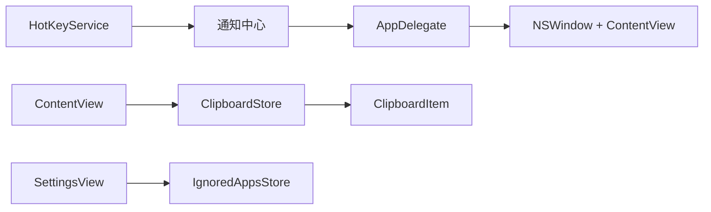

# 弹窗与导航模式

<cite>
**本文引用的文件**
- [ContentView.swift](file://Cutting_board/ContentView.swift)
- [Cutting_boardApp.swift](file://Cutting_board/Cutting_boardApp.swift)
- [SettingsView.swift](file://Cutting_board/SettingsView.swift)
- [ClipboardItem.swift](file://Cutting_board/Models/ClipboardItem.swift)
- [ClipboardStore.swift](file://Cutting_board/Services/ClipboardStore.swift)
- [HotKeyService.swift](file://Cutting_board/Services/HotKeyService.swift)
- [IgnoredAppsStore.swift](file://Cutting_board/Services/IgnoredAppsStore.swift)
- [SKILL.md（专家技能）](file://.agents/skills/swiftui-expert-skill/SKILL.en.md)
- [sheet-navigation-patterns.md](file://.agents/skills/swiftui-expert-skill/references/sheet-navigation-patterns.md)
- [state-management.md](file://.agents/skills/swiftui-expert-skill/references/state-management.md)
- [performance-patterns.md](file://.agents/skills/swiftui-expert-skill/references/performance-patterns.md)
- [text-formatting.md](file://.agents/skills/swiftui-expert-skill/references/text-formatting.md)
</cite>

## 目录
1. [简介](#简介)
2. [项目结构](#项目结构)
3. [核心组件](#核心组件)
4. [架构总览](#架构总览)
5. [组件详解](#组件详解)
6. [依赖关系分析](#依赖关系分析)
7. [性能考量](#性能考量)
8. [故障排查指南](#故障排查指南)
9. [结论](#结论)
10. [附录](#附录)

## 简介
本文件围绕 Swift 应用“Cutting_board”的弹窗与导航模式进行系统性梳理，重点覆盖：
- 基于模型的弹窗（Sheet）实现与最佳实践
- 类型安全导航的设计方法
- 导航生命周期管理、目的地安全实现与用户交互处理
- 状态管理与性能优化策略
- 典型场景：模态弹窗、表单弹窗、复杂导航流程

通过结合项目源码与专家技能参考文档，帮助读者快速掌握在 macOS 上使用 SwiftUI 实现稳定、可维护、高性能的弹窗与导航体验。

## 项目结构
该项目采用“菜单栏增强（MenuBarExtra）+ 自托管窗口”的架构，主界面由 AppKit 托管的窗口承载，内部使用 SwiftUI 构建内容视图。弹窗主要通过 Sheet 进行呈现，设置页作为独立视图以 Sheet 形式展示。

图表来源
- [Cutting_boardApp.swift](file://Cutting_board/Cutting_boardApp.swift#L15-L31)
- [Cutting_boardApp.swift](file://Cutting_board/Cutting_boardApp.swift#L35-L143)
- [ContentView.swift](file://Cutting_board/ContentView.swift#L20-L95)
- [SettingsView.swift](file://Cutting_board/SettingsView.swift#L11-L39)
- [ClipboardStore.swift](file://Cutting_board/Services/ClipboardStore.swift#L14-L39)
- [HotKeyService.swift](file://Cutting_board/Services/HotKeyService.swift#L30-L81)
- [IgnoredAppsStore.swift](file://Cutting_board/Services/IgnoredAppsStore.swift#L16-L40)
- [ClipboardItem.swift](file://Cutting_board/Models/ClipboardItem.swift#L17-L45)

章节来源
- [Cutting_boardApp.swift](file://Cutting_board/Cutting_boardApp.swift#L15-L31)
- [Cutting_boardApp.swift](file://Cutting_board/Cutting_boardApp.swift#L35-L143)
- [ContentView.swift](file://Cutting_board/ContentView.swift#L20-L95)
- [SettingsView.swift](file://Cutting_board/SettingsView.swift#L11-L39)
- [ClipboardStore.swift](file://Cutting_board/Services/ClipboardStore.swift#L14-L39)
- [HotKeyService.swift](file://Cutting_board/Services/HotKeyService.swift#L30-L81)
- [IgnoredAppsStore.swift](file://Cutting_board/Services/IgnoredAppsStore.swift#L16-L40)
- [ClipboardItem.swift](file://Cutting_board/Models/ClipboardItem.swift#L17-L45)

## 核心组件
- 内容视图（ContentView）：负责剪贴板历史列表、搜索、键盘导航、备注编辑弹窗、设置弹窗等。
- 设置视图（SettingsView）：展示忽略应用列表，并支持添加/移除应用。
- 存储服务（ClipboardStore）：监控系统剪贴板变化、维护历史、持久化、提供增删改查能力。
- 热键服务（HotKeyService）：注册全局快捷键，触发面板显示/隐藏。
- 忽略应用存储（IgnoredAppsStore）：维护忽略的应用 Bundle ID 列表。
- 模型（ClipboardItem）：剪贴板历史项的数据结构与辅助属性。

章节来源
- [ContentView.swift](file://Cutting_board/ContentView.swift#L20-L95)
- [SettingsView.swift](file://Cutting_board/SettingsView.swift#L11-L39)
- [ClipboardStore.swift](file://Cutting_board/Services/ClipboardStore.swift#L14-L39)
- [HotKeyService.swift](file://Cutting_board/Services/HotKeyService.swift#L30-L81)
- [IgnoredAppsStore.swift](file://Cutting_board/Services/IgnoredAppsStore.swift#L16-L40)
- [ClipboardItem.swift](file://Cutting_board/Models/ClipboardItem.swift#L17-L45)

## 架构总览
下图展示了弹窗与导航的关键交互路径：用户通过菜单栏入口或全局快捷键唤起面板；面板内通过 Sheet 展示“备注编辑”和“设置”；备注编辑完成后自动关闭；设置页通过环境提供的 dismiss 完成内部关闭。

图表来源
- [Cutting_boardApp.swift](file://Cutting_board/Cutting_boardApp.swift#L15-L31)
- [Cutting_boardApp.swift](file://Cutting_board/Cutting_boardApp.swift#L100-L142)
- [ContentView.swift](file://Cutting_board/ContentView.swift#L88-L94)
- [SettingsView.swift](file://Cutting_board/SettingsView.swift#L13-L24)

## 组件详解

### 弹窗与导航：基于模型的 Sheet 实践
- 备注编辑弹窗（模态弹窗）
  - 使用 .sheet(item:) 绑定模型 ClipboardItem，避免布尔标志带来的额外状态管理。
  - 弹窗内部通过环境 dismiss 完成自身关闭，遵循“弹窗拥有其动作”的最佳实践。
  - 输入框支持多行文本与键盘快捷键（默认动作/Escape），提升可用性。
- 设置弹窗（表单弹窗）
  - 使用 .sheet(isPresented:) 控制显示，内部通过按钮完成关闭。
  - 设置页包含滚动列表与交互按钮，采用玻璃材质与圆角边框提升视觉一致性。

图表来源
- [ContentView.swift](file://Cutting_board/ContentView.swift#L88-L94)
- [ContentView.swift](file://Cutting_board/ContentView.swift#L237-L274)
- [SettingsView.swift](file://Cutting_board/SettingsView.swift#L13-L24)

章节来源
- [ContentView.swift](file://Cutting_board/ContentView.swift#L88-L94)
- [ContentView.swift](file://Cutting_board/ContentView.swift#L237-L274)
- [SettingsView.swift](file://Cutting_board/SettingsView.swift#L11-L39)

### 类型安全导航设计
- 当前项目以 Sheet 为主，未使用 NavigationStack/navigationDestination(for:)。
- 若未来需要引入类型安全导航，可参考专家技能文档中的模式：
  - 使用 NavigationStack 与 navigationDestination(for:) 实现类型安全的目的地映射。
  - 使用 NavigationPath 进行程序化导航。
- 本项目建议：若仍以 Sheet 为主，保持 .sheet(item:) 的模型驱动方式，确保弹窗内部自包含行为，避免父级过度耦合。

章节来源
- [sheet-navigation-patterns.md](file://.agents/skills/swiftui-expert-skill/references/sheet-navigation-patterns.md#L122-L176)
- [SKILL.md（专家技能）](file://.agents/skills/swiftui-expert-skill/SKILL.en.md#L207-L210)

### 导航生命周期管理与用户交互
- 生命周期
  - AppDelegate 负责创建/激活/隐藏面板窗口，确保在 LSUIElement 场景下也能正常工作。
  - 热键服务通过 Carbon API 注册全局快捷键，触发面板切换。
- 用户交互
  - 键盘：方向键移动选中项、回车粘贴、Esc 关闭面板。
  - 触控板/鼠标：点击、双击、右键上下文菜单、悬停高亮。
  - 弹窗：Escape/默认动作键、按钮操作、dismiss 完成交互。

图表来源
- [Cutting_boardApp.swift](file://Cutting_board/Cutting_boardApp.swift#L100-L142)
- [ContentView.swift](file://Cutting_board/ContentView.swift#L69-L87)
- [ContentView.swift](file://Cutting_board/ContentView.swift#L209-L235)
- [ContentView.swift](file://Cutting_board/ContentView.swift#L237-L274)

章节来源
- [Cutting_boardApp.swift](file://Cutting_board/Cutting_boardApp.swift#L100-L142)
- [ContentView.swift](file://Cutting_board/ContentView.swift#L69-L87)
- [ContentView.swift](file://Cutting_board/ContentView.swift#L209-L235)
- [ContentView.swift](file://Cutting_board/ContentView.swift#L237-L274)

### 状态管理与弹窗状态控制
- 弹窗状态
  - 备注编辑弹窗：使用 @State 绑定 ClipboardItem，配合 .sheet(item:) 自动管理呈现。
  - 设置弹窗：使用 @State 布尔值控制是否显示。
- 父子状态传递
  - 父视图通过 @ObservedObject 访问 ClipboardStore，子视图通过环境注入或参数接收。
- 环境与绑定
  - SettingsView 使用 @Environment(\.dismiss) 完成内部关闭。
  - 专家技能强调：@Observable 优先、@State 私有、@Bindable 用于外部注入的可观察对象。

图表来源
- [ContentView.swift](file://Cutting_board/ContentView.swift#L20-L95)
- [SettingsView.swift](file://Cutting_board/SettingsView.swift#L11-L39)
- [ClipboardStore.swift](file://Cutting_board/Services/ClipboardStore.swift#L14-L39)
- [IgnoredAppsStore.swift](file://Cutting_board/Services/IgnoredAppsStore.swift#L16-L40)
- [ClipboardItem.swift](file://Cutting_board/Models/ClipboardItem.swift#L17-L45)

章节来源
- [ContentView.swift](file://Cutting_board/ContentView.swift#L20-L95)
- [SettingsView.swift](file://Cutting_board/SettingsView.swift#L11-L39)
- [ClipboardStore.swift](file://Cutting_board/Services/ClipboardStore.swift#L14-L39)
- [IgnoredAppsStore.swift](file://Cutting_board/Services/IgnoredAppsStore.swift#L16-L40)
- [ClipboardItem.swift](file://Cutting_board/Models/ClipboardItem.swift#L17-L45)
- [state-management.md](file://.agents/skills/swiftui-expert-skill/references/state-management.md#L31-L56)

### 复杂导航流程（概念性说明）
- 若引入类型安全导航，可采用 NavigationStack + navigationDestination(for:) 的组合，将路由枚举作为目的地标识，实现清晰的类型约束与可维护性。
- 程序化导航可通过 NavigationPath 管理路径栈，适合动态目的地与深层嵌套场景。
- 本项目当前以 Sheet 为主，建议保持现有模式；如需扩展导航，应遵循专家技能文档中的类型安全与现代 API 推荐。

章节来源
- [sheet-navigation-patterns.md](file://.agents/skills/swiftui-expert-skill/references/sheet-navigation-patterns.md#L122-L176)
- [SKILL.md（专家技能）](file://.agents/skills/swiftui-expert-skill/SKILL.en.md#L144-L183)

## 依赖关系分析
- ContentView 依赖 ClipboardStore 提供数据与业务逻辑；通过 @ObservedObject 订阅变更。
- SettingsView 依赖 IgnoredAppsStore 管理忽略应用列表；通过 @ObservedObject 订阅变更。
- AppDelegate 依赖 ContentView 创建 NSHostingView 并托管窗口；同时监听通知以响应菜单/快捷键。
- HotKeyService 通过 Carbon API 注册全局快捷键，向 AppDelegate 发送切换通知。

图表来源
- [HotKeyService.swift](file://Cutting_board/Services/HotKeyService.swift#L30-L81)
- [Cutting_boardApp.swift](file://Cutting_board/Cutting_boardApp.swift#L46-L72)
- [Cutting_boardApp.swift](file://Cutting_board/Cutting_boardApp.swift#L78-L98)
- [ContentView.swift](file://Cutting_board/ContentView.swift#L20-L22)
- [SettingsView.swift](file://Cutting_board/SettingsView.swift#L11-L13)
- [ClipboardStore.swift](file://Cutting_board/Services/ClipboardStore.swift#L14-L19)
- [IgnoredAppsStore.swift](file://Cutting_board/Services/IgnoredAppsStore.swift#L16-L21)
- [ClipboardItem.swift](file://Cutting_board/Models/ClipboardItem.swift#L17-L28)

章节来源
- [HotKeyService.swift](file://Cutting_board/Services/HotKeyService.swift#L30-L81)
- [Cutting_boardApp.swift](file://Cutting_board/Cutting_boardApp.swift#L46-L72)
- [Cutting_boardApp.swift](file://Cutting_board/Cutting_boardApp.swift#L78-L98)
- [ContentView.swift](file://Cutting_board/ContentView.swift#L20-L22)
- [SettingsView.swift](file://Cutting_board/SettingsView.swift#L11-L13)
- [ClipboardStore.swift](file://Cutting_board/Services/ClipboardStore.swift#L14-L19)
- [IgnoredAppsStore.swift](file://Cutting_board/Services/IgnoredAppsStore.swift#L16-L21)
- [ClipboardItem.swift](file://Cutting_board/Models/ClipboardItem.swift#L17-L28)

## 性能考量
- 减少冗余状态更新：在高频事件（如滚动、按键）中，仅在阈值变化时更新状态，避免频繁触发重绘。
- 优化热路径：键盘事件与列表滚动属于热路径，应尽量减少不必要的状态写入与布局计算。
- 视图懒加载：大型列表使用 LazyVStack，延迟构建可见区域内的视图。
- 任务取消：使用 .task 生命周期在视图消失时自动取消异步任务，避免后台资源浪费。
- 状态范围收敛：窄化依赖范围，避免将整个模型注入子视图，仅传入所需字段。
- 性能调试：利用 Self._printChanges() 定位导致视图更新的真正原因。

章节来源
- [performance-patterns.md](file://.agents/skills/swiftui-expert-skill/references/performance-patterns.md#L5-L40)
- [performance-patterns.md](file://.agents/skills/swiftui-expert-skill/references/performance-patterns.md#L157-L179)
- [performance-patterns.md](file://.agents/skills/swiftui-expert-skill/references/performance-patterns.md#L181-L199)
- [performance-patterns.md](file://.agents/skills/swiftui-expert-skill/references/performance-patterns.md#L223-L261)
- [performance-patterns.md](file://.agents/skills/swiftui-expert-skill/references/performance-patterns.md#L201-L222)

## 故障排查指南
- 弹窗无法关闭
  - 确认弹窗内部是否使用 @Environment(\.dismiss) 完成关闭。
  - 检查是否误用 .sheet(isPresented:) 且未正确重置布尔值。
- 备注编辑弹窗未显示
  - 确保将 ClipboardItem 赋值给 @State remarkEditItem，以便 .sheet(item:) 正常触发。
  - 检查 remarkEditText 是否同步初始化。
- 设置页样式异常
  - 确认玻璃效果修饰器顺序正确（先布局/颜色，后 glassEffect）。
- 键盘交互无效
  - 检查 AppDelegate 是否成功将焦点交给列表视图（findFirstTableView）。
  - 确认全局快捷键注册成功，Carbon 回调是否触发通知。

章节来源
- [SettingsView.swift](file://Cutting_board/SettingsView.swift#L13-L24)
- [ContentView.swift](file://Cutting_board/ContentView.swift#L88-L94)
- [ContentView.swift](file://Cutting_board/ContentView.swift#L237-L274)
- [Cutting_boardApp.swift](file://Cutting_board/Cutting_boardApp.swift#L100-L142)
- [HotKeyService.swift](file://Cutting_board/Services/HotKeyService.swift#L30-L81)

## 结论
本项目在 macOS 上通过 MenuBarExtra 与自建 NSWindow 承载 SwiftUI 内容，实现了稳定的剪贴板历史面板。弹窗采用基于模型的 Sheet 模式，结合环境注入与现代 API，确保了良好的可维护性与可访问性。未来如需扩展导航，建议引入类型安全的 NavigationStack 模式，并遵循专家技能文档中的最佳实践，持续优化状态管理与性能表现。

## 附录
- 搜索与本地化比较
  - 使用 localizedStandardContains() 进行用户输入过滤，提升搜索体验与国际化兼容性。
- 现代 API 替代
  - 使用 foregroundStyle/clipShape/.scrollIndicators(.hidden)/NavigationStack 等替代旧 API，提升可读性与可维护性。

章节来源
- [text-formatting.md](file://.agents/skills/swiftui-expert-skill/references/text-formatting.md#L142-L161)
- [SKILL.md（专家技能）](file://.agents/skills/swiftui-expert-skill/SKILL.en.md#L144-L158)