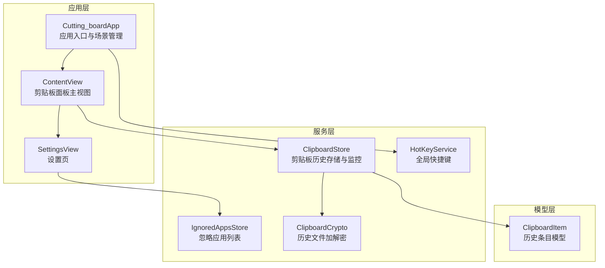
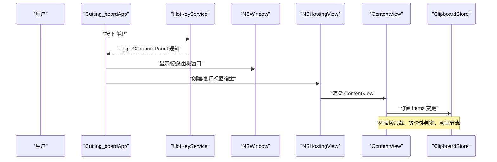
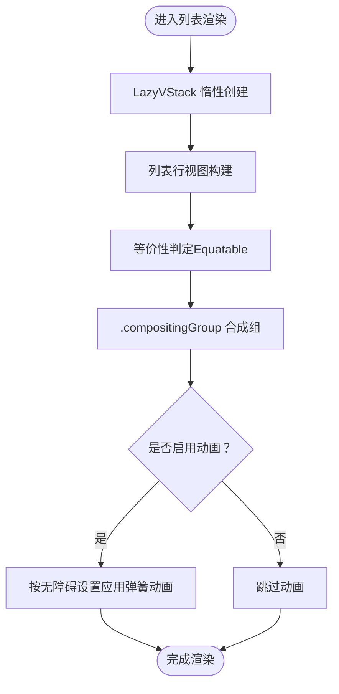
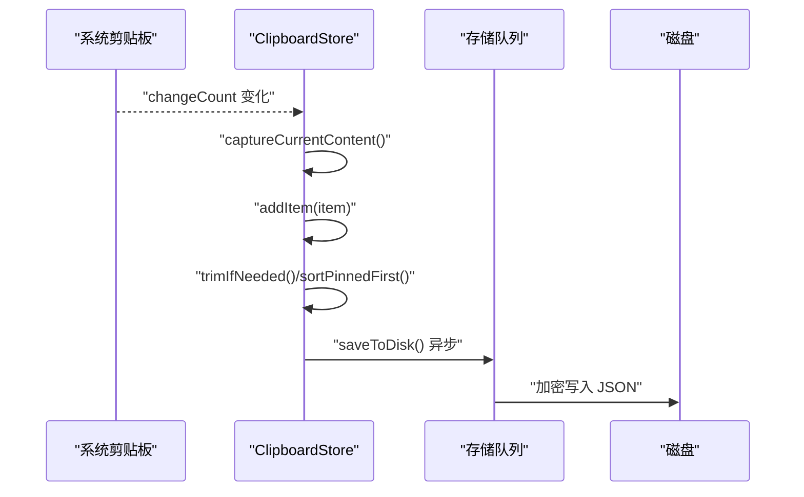
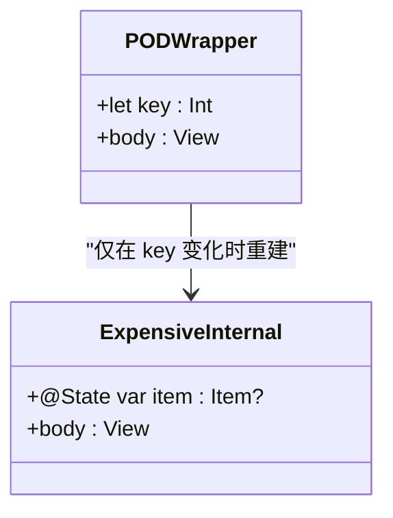
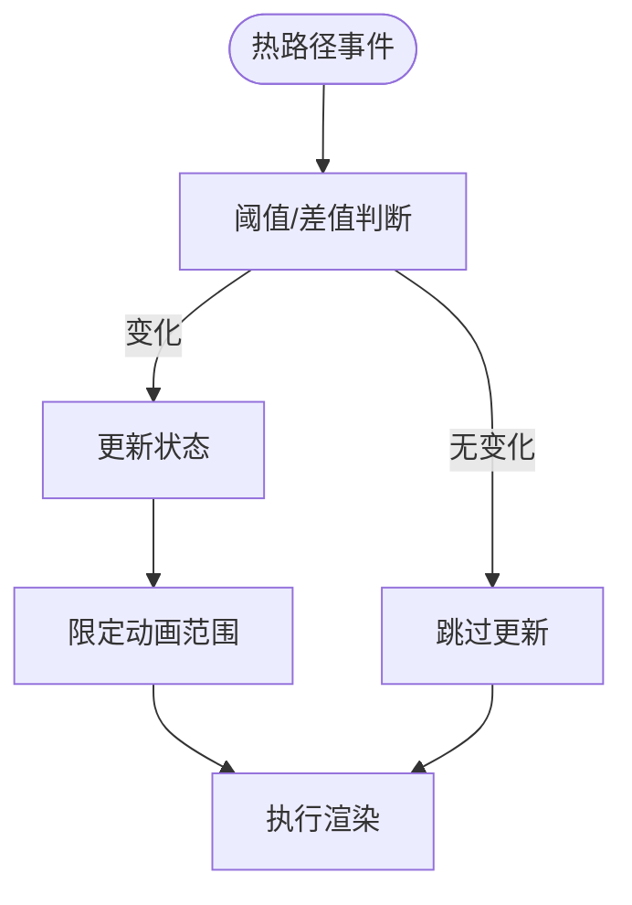
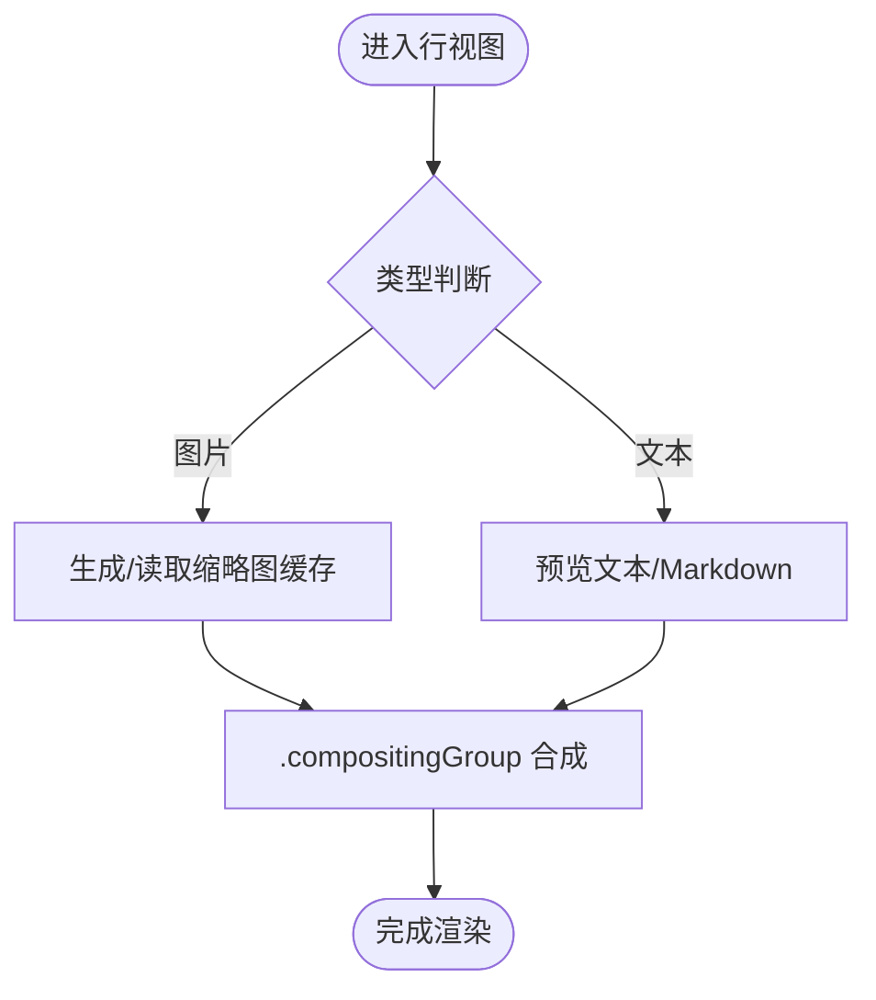
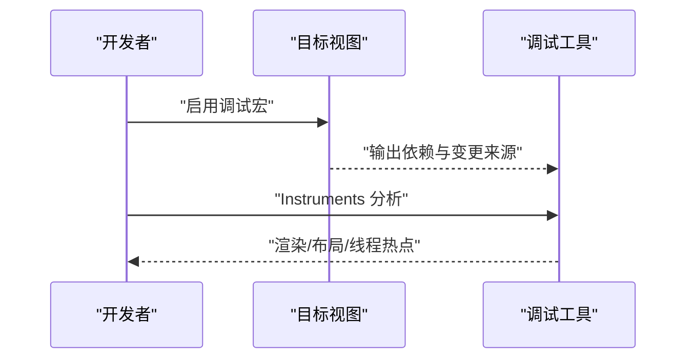
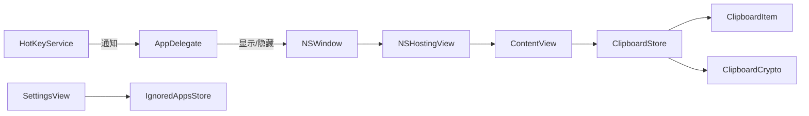

# 性能优化模式

<cite>
**本文引用的文件**
- [ContentView.swift](file://Cutting_board/ContentView.swift)
- [ClipboardItem.swift](file://Cutting_board/Models/ClipboardItem.swift)
- [ClipboardStore.swift](file://Cutting_board/Services/ClipboardStore.swift)
- [HotKeyService.swift](file://Cutting_board/Services/HotKeyService.swift)
- [Cutting_boardApp.swift](file://Cutting_board/Cutting_boardApp.swift)
- [SettingsView.swift](file://Cutting_board/SettingsView.swift)
- [IgnoredAppsStore.swift](file://Cutting_board/Services/IgnoredAppsStore.swift)
- [ClipboardCrypto.swift](file://Cutting_board/Services/ClipboardCrypto.swift)
- [performance-patterns.md](file://.agents/skills/swiftui-expert-skill/references/performance-patterns.md)
- [layout-best-practices.md](file://.agents/skills/swiftui-expert-skill/references/layout-best-practices.md)
</cite>

## 目录
1. [简介](#简介)
2. [项目结构](#项目结构)
3. [核心组件](#核心组件)
4. [架构总览](#架构总览)
5. [组件详细分析](#组件详细分析)
6. [依赖关系分析](#依赖关系分析)
7. [性能考量](#性能考量)
8. [故障排查指南](#故障排查指南)
9. [结论](#结论)
10. [附录](#附录)

## 简介
本文件围绕剪贴板历史面板应用的SwiftUI性能优化实践，系统阐述热点路径优化、状态更新控制与视图渲染性能提升策略，并结合项目源码给出可操作的优化建议与示例路径。重点覆盖以下主题：
- 依赖关系最小化：通过窄化状态作用域、避免大对象注入、减少不必要的订阅与观察链路
- 状态更新频率控制：在热路径中进行阈值判断与去抖、避免重复赋值、合并状态变更
- 昂贵计算的延迟处理：将昂贵任务放入后台队列、使用懒加载容器、缓存结果、延迟初始化
- 视图更新优化：使用惰性列表、组合组、等价性判定、POD视图包装器
- 内存使用控制：避免在body中创建对象、及时释放资源、合理缓存与缩略图
- 渲染性能提升：使用合成组、变换动画、避免布局抖动、减少深度层级
- 性能调试工具：利用调试宏打印变化、Instruments剖析、日志定位瓶颈

## 项目结构
该应用采用“菜单栏附加 + 自托管窗口”的架构，核心界面由一个自定义面板承载，配合全局快捷键唤起、剪贴板监控与持久化存储。

**图表来源**
- [Cutting_boardApp.swift](file://Cutting_board/Cutting_boardApp.swift#L11-L31)
- [ContentView.swift](file://Cutting_board/ContentView.swift#L20-L95)
- [SettingsView.swift](file://Cutting_board/SettingsView.swift#L11-L39)
- [ClipboardStore.swift](file://Cutting_board/Services/ClipboardStore.swift#L14-L39)
- [HotKeyService.swift](file://Cutting_board/Services/HotKeyService.swift#L30-L81)
- [IgnoredAppsStore.swift](file://Cutting_board/Services/IgnoredAppsStore.swift#L16-L40)
- [ClipboardItem.swift](file://Cutting_board/Models/ClipboardItem.swift#L17-L89)
- [ClipboardCrypto.swift](file://Cutting_board/Services/ClipboardCrypto.swift#L16-L46)

**章节来源**
- [Cutting_boardApp.swift](file://Cutting_board/Cutting_boardApp.swift#L11-L31)
- [ContentView.swift](file://Cutting_board/ContentView.swift#L20-L95)
- [SettingsView.swift](file://Cutting_board/SettingsView.swift#L11-L39)

## 核心组件
- 应用入口与场景管理：负责菜单栏入口、全局快捷键注册、面板窗口生命周期与焦点管理
- 主视图：包含头部、搜索栏、空态/无结果/列表三种状态视图切换，支持键盘导航、双击粘贴、备注编辑、清空历史等
- 剪贴板存储：监控系统剪贴板变化、去重与排序、钉住置顶、持久化与加解密
- 设置页：维护忽略应用列表，支持增删与应用信息查询
- 快捷键服务：基于Carbon API注册全局快捷键，无需辅助功能权限
- 数据模型：剪贴板条目结构，包含类型、时间戳、预览文本与备注等

**章节来源**
- [Cutting_boardApp.swift](file://Cutting_board/Cutting_boardApp.swift#L35-L143)
- [ContentView.swift](file://Cutting_board/ContentView.swift#L20-L305)
- [ClipboardStore.swift](file://Cutting_board/Services/ClipboardStore.swift#L14-L222)
- [SettingsView.swift](file://Cutting_board/SettingsView.swift#L11-L88)
- [HotKeyService.swift](file://Cutting_board/Services/HotKeyService.swift#L30-L81)
- [ClipboardItem.swift](file://Cutting_board/Models/ClipboardItem.swift#L17-L89)

## 架构总览
应用采用“菜单栏附加 + 自托管NSWindow + SwiftUI视图”的混合架构。SwiftUI负责UI呈现，AppKit负责窗口与快捷键；数据流从系统剪贴板经存储服务落盘，再由视图订阅更新。

**图表来源**
- [Cutting_boardApp.swift](file://Cutting_board/Cutting_boardApp.swift#L46-L142)
- [HotKeyService.swift](file://Cutting_board/Services/HotKeyService.swift#L36-L69)
- [ContentView.swift](file://Cutting_board/ContentView.swift#L20-L95)
- [ClipboardStore.swift](file://Cutting_board/Services/ClipboardStore.swift#L17-L39)

## 组件详细分析

### 主视图与列表渲染优化
- 懒加载列表：使用惰性堆栈容器，仅在可见时构建视图，降低初始开销与内存占用
- 等价性判定：列表行视图实现等价比较，避免非必要重绘
- 动画节流：根据无障碍设置动态启用/禁用动画，减少热路径中的布局与绘制压力
- 状态作用域：将搜索、选中、备注编辑等状态限定在局部，避免影响整体视图树
- 组合组：对需要阴影与合成效果的行使用组合组，将绘制合并到离屏缓冲，减少GPU绘制次数

**图表来源**
- [ContentView.swift](file://Cutting_board/ContentView.swift#L184-L207)
- [ContentView.swift](file://Cutting_board/ContentView.swift#L321-L471)
- [ContentView.swift](file://Cutting_board/ContentView.swift#L377-L382)

**章节来源**
- [ContentView.swift](file://Cutting_board/ContentView.swift#L184-L207)
- [ContentView.swift](file://Cutting_board/ContentView.swift#L321-L471)

### 剪贴板存储与状态更新控制
- 频率控制：定时器周期检查系统剪贴板变化，避免高频轮询带来的主线程压力
- 去重与排序：插入新条目前进行内容与类型比对，避免重复；钉住项置顶，未钉住部分按阈值裁剪
- 批量更新：整体替换数组以触发发布，减少细粒度变更导致的多次重绘
- 异步持久化：使用专用队列进行序列化与磁盘写入，避免阻塞主线程
- 加密存储：对历史文件进行带魔数的AEAD加密，兼顾隐私与兼容旧版本

**图表来源**
- [ClipboardStore.swift](file://Cutting_board/Services/ClipboardStore.swift#L47-L90)
- [ClipboardStore.swift](file://Cutting_board/Services/ClipboardStore.swift#L94-L147)
- [ClipboardStore.swift](file://Cutting_board/Services/ClipboardStore.swift#L210-L221)
- [ClipboardCrypto.swift](file://Cutting_board/Services/ClipboardCrypto.swift#L32-L46)

**章节来源**
- [ClipboardStore.swift](file://Cutting_board/Services/ClipboardStore.swift#L47-L90)
- [ClipboardStore.swift](file://Cutting_board/Services/ClipboardStore.swift#L110-L147)
- [ClipboardStore.swift](file://Cutting_board/Services/ClipboardStore.swift#L210-L221)
- [ClipboardCrypto.swift](file://Cutting_board/Services/ClipboardCrypto.swift#L16-L46)

### POD视图与懒加载技术
- POD视图：通过仅持有简单值类型的参数，使SwiftUI使用快速内存比较进行差异计算，显著降低重绘成本
- 包装器模式：将昂贵内部视图封装在轻量POD父视图下，仅当关键参数变化时才触发内部视图的差异计算
- 懒加载容器：对大型列表使用惰性容器，按需创建子视图，避免一次性构造所有节点

**图表来源**
- [performance-patterns.md](file://.agents/skills/swiftui-expert-skill/references/performance-patterns.md#L106-L155)
- [ContentView.swift](file://Cutting_board/ContentView.swift#L186-L192)

**章节来源**
- [performance-patterns.md](file://.agents/skills/swiftui-expert-skill/references/performance-patterns.md#L106-L155)
- [ContentView.swift](file://Cutting_board/ContentView.swift#L186-L192)

### 热点路径优化与动画策略
- 热点路径：键盘导航、滚动与按键事件处理，应避免在每次回调中进行昂贵计算或状态赋值
- 动画策略：优先使用变换类动画（缩放、偏移、旋转），并限定动画范围，避免根级宽泛动画
- 无障碍适配：根据系统“减少动感”偏好动态关闭动画，保证性能与可用性的平衡

**图表来源**
- [performance-patterns.md](file://.agents/skills/swiftui-expert-skill/references/performance-patterns.md#L23-L40)
- [performance-patterns.md](file://.agents/skills/swiftui-expert-skill/references/performance-patterns.md#L162-L199)
- [ContentView.swift](file://Cutting_board/ContentView.swift#L69-L87)
- [ContentView.swift](file://Cutting_board/ContentView.swift#L51-L53)

**章节来源**
- [performance-patterns.md](file://.agents/skills/swiftui-expert-skill/references/performance-patterns.md#L23-L40)
- [performance-patterns.md](file://.agents/skills/swiftui-expert-skill/references/performance-patterns.md#L162-L199)
- [ContentView.swift](file://Cutting_board/ContentView.swift#L69-L87)
- [ContentView.swift](file://Cutting_board/ContentView.swift#L51-L53)

### 内存使用控制与渲染性能提升
- 避免在body中创建对象：静态或存储式格式化器与解析器，避免每帧重建
- 图像缩略图缓存：对图片类型条目生成缩略图并缓存，减少重复解码与绘制
- 合成组与变换：对需要阴影与高斯模糊的区域使用合成组，减少多次绘制
- 布局优化：扁平化层级、避免深层几何读取链与频繁尺寸回调

**图表来源**
- [ContentView.swift](file://Cutting_board/ContentView.swift#L446-L451)
- [ContentView.swift](file://Cutting_board/ContentView.swift#L377-L382)
- [layout-best-practices.md](file://.agents/skills/swiftui-expert-skill/references/layout-best-practices.md#L103-L163)

**章节来源**
- [ContentView.swift](file://Cutting_board/ContentView.swift#L446-L451)
- [ContentView.swift](file://Cutting_board/ContentView.swift#L377-L382)
- [layout-best-practices.md](file://.agents/skills/swiftui-expert-skill/references/layout-best-practices.md#L103-L163)

### 性能调试工具与方法
- 调试宏：使用调试宏打印导致视图更新的原因，定位不必要的依赖与状态变更
- Instruments剖析：使用SwiftUI模板定位具体瓶颈（如重绘风暴、布局抖动、异步任务卡顿）
- 日志与通知：通过通知中心在面板显示/隐藏与切换时进行行为验证

**图表来源**
- [performance-patterns.md](file://.agents/skills/swiftui-expert-skill/references/performance-patterns.md#L201-L222)
- [Cutting_boardApp.swift](file://Cutting_board/Cutting_boardApp.swift#L100-L142)

**章节来源**
- [performance-patterns.md](file://.agents/skills/swiftui-expert-skill/references/performance-patterns.md#L201-L222)
- [Cutting_boardApp.swift](file://Cutting_board/Cutting_boardApp.swift#L100-L142)

## 依赖关系分析
- 视图与模型：主视图通过观察存储服务的发布属性驱动UI，列表行视图依赖条目模型的稳定标识与等价性
- 窗口与视图：应用委托负责创建与管理窗口，视图作为宿主内容存在
- 快捷键与通知：快捷键服务通过通知中心与应用委托交互，触发面板显示/隐藏
- 设置与忽略应用：设置页依赖忽略应用存储，读取应用图标与名称

**图表来源**
- [HotKeyService.swift](file://Cutting_board/Services/HotKeyService.swift#L12-L27)
- [Cutting_boardApp.swift](file://Cutting_board/Cutting_boardApp.swift#L35-L143)
- [ContentView.swift](file://Cutting_board/ContentView.swift#L20-L95)
- [ClipboardStore.swift](file://Cutting_board/Services/ClipboardStore.swift#L14-L39)
- [SettingsView.swift](file://Cutting_board/SettingsView.swift#L11-L39)
- [IgnoredAppsStore.swift](file://Cutting_board/Services/IgnoredAppsStore.swift#L16-L40)
- [ClipboardCrypto.swift](file://Cutting_board/Services/ClipboardCrypto.swift#L16-L46)

**章节来源**
- [HotKeyService.swift](file://Cutting_board/Services/HotKeyService.swift#L12-L27)
- [Cutting_boardApp.swift](file://Cutting_board/Cutting_boardApp.swift#L35-L143)
- [ContentView.swift](file://Cutting_board/ContentView.swift#L20-L95)
- [ClipboardStore.swift](file://Cutting_board/Services/ClipboardStore.swift#L14-L39)
- [SettingsView.swift](file://Cutting_board/SettingsView.swift#L11-L39)
- [IgnoredAppsStore.swift](file://Cutting_board/Services/IgnoredAppsStore.swift#L16-L40)
- [ClipboardCrypto.swift](file://Cutting_board/Services/ClipboardCrypto.swift#L16-L46)

## 性能考量
- 依赖关系最小化：避免将大对象注入到子视图，仅传递必要字段；在模型层计算派生值，减少视图内重复计算
- 状态更新频率控制：在热路径中进行差值/阈值判断，避免重复赋值；批量更新数组而非逐项变更
- 昂贵计算的延迟处理：图片缩略图、Markdown解析、JSON编解码与磁盘IO均在后台队列执行
- 视图更新优化：惰性列表、组合组、等价性判定、POD视图包装器
- 内存使用控制：静态/存储式对象、缓存缩略图、及时释放资源
- 渲染性能提升：变换动画、限定动画范围、扁平化层级、减少深度几何读取

[本节为通用指导，无需列出具体文件来源]

## 故障排查指南
- 视图更新风暴：使用调试宏定位导致body重新计算的状态来源，检查是否存在对大对象的直接依赖
- 列表卡顿：确认使用惰性容器、稳定的identifiable、等价性判定与无AnyView包装
- 动画卡顿：检查根级动画范围与布局动画，改为变换动画并限定作用域
- 搜索无响应：核对过滤逻辑是否在热路径中重复计算，建议预过滤与缓存
- 图片加载慢：确认缩略图缓存与后台解码流程，避免在主线程进行图像处理
- 磁盘写入阻塞：确保持久化在专用队列执行，避免主线程等待

**章节来源**
- [performance-patterns.md](file://.agents/skills/swiftui-expert-skill/references/performance-patterns.md#L201-L222)
- [performance-patterns.md](file://.agents/skills/swiftui-expert-skill/references/performance-patterns.md#L262-L271)
- [layout-best-practices.md](file://.agents/skills/swiftui-expert-skill/references/layout-best-practices.md#L103-L163)
- [ContentView.swift](file://Cutting_board/ContentView.swift#L29-L35)
- [ContentView.swift](file://Cutting_board/ContentView.swift#L446-L451)
- [ClipboardStore.swift](file://Cutting_board/Services/ClipboardStore.swift#L210-L221)

## 结论
本项目在SwiftUI性能优化方面体现了多项最佳实践：惰性列表、组合组、等价性判定、POD视图包装器、后台队列与缓存、动画范围限定与无障碍适配。通过将昂贵计算与IO迁移至后台、缩小状态作用域、避免在body中创建对象与布局抖动，有效提升了渲染性能与用户体验。建议持续使用调试工具与Instruments进行回归测试，确保在不同设备与场景下的稳定性。

[本节为总结性内容，无需列出具体文件来源]

## 附录
- 关键实现路径参考
  - 列表懒加载与行视图：[ContentView.swift](file://Cutting_board/ContentView.swift#L184-L207)
  - 行视图等价性与组合组：[ContentView.swift](file://Cutting_board/ContentView.swift#L321-L471)
  - 剪贴板监控与存储：[ClipboardStore.swift](file://Cutting_board/Services/ClipboardStore.swift#L47-L90)
  - 异步持久化与加解密：[ClipboardStore.swift](file://Cutting_board/Services/ClipboardStore.swift#L210-L221)、[ClipboardCrypto.swift](file://Cutting_board/Services/ClipboardCrypto.swift#L32-L46)
  - 全局快捷键注册：[HotKeyService.swift](file://Cutting_board/Services/HotKeyService.swift#L36-L69)
  - 应用委托与窗口管理：[Cutting_boardApp.swift](file://Cutting_board/Cutting_boardApp.swift#L78-L142)
  - 设置页与忽略应用：[SettingsView.swift](file://Cutting_board/SettingsView.swift#L11-L88)、[IgnoredAppsStore.swift](file://Cutting_board/Services/IgnoredAppsStore.swift#L16-L40)
  - 性能模式参考：[performance-patterns.md](file://.agents/skills/swiftui-expert-skill/references/performance-patterns.md#L106-L155)
  - 布局最佳实践：[layout-best-practices.md](file://.agents/skills/swiftui-expert-skill/references/layout-best-practices.md#L103-L163)

[本节为索引性内容，无需列出具体文件来源]