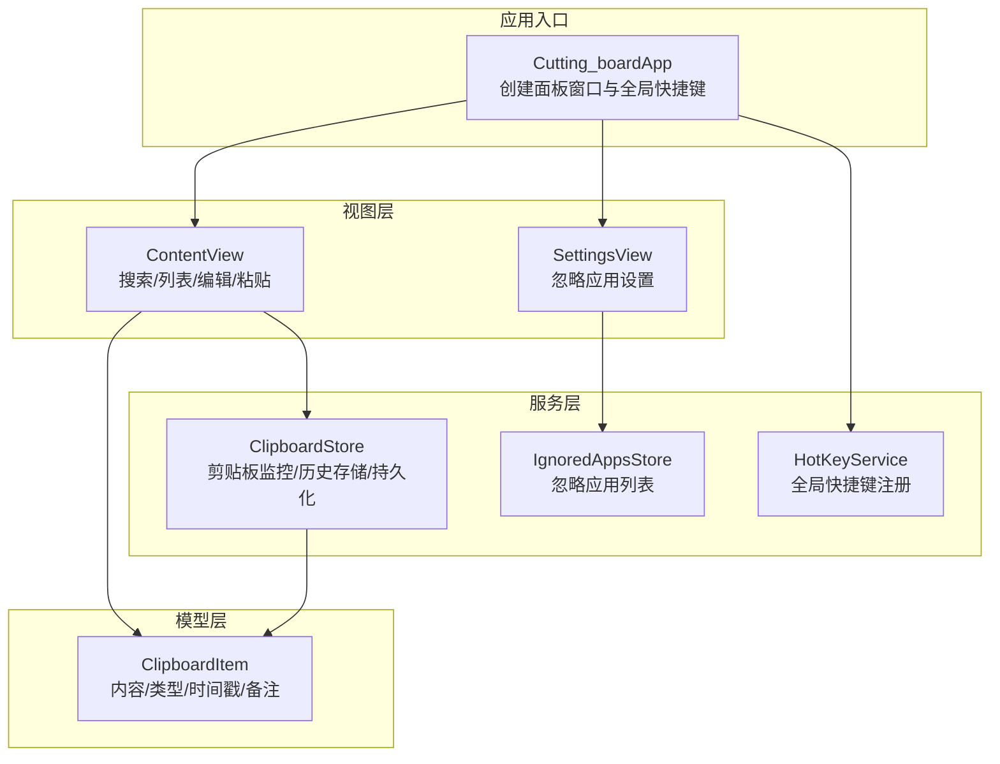
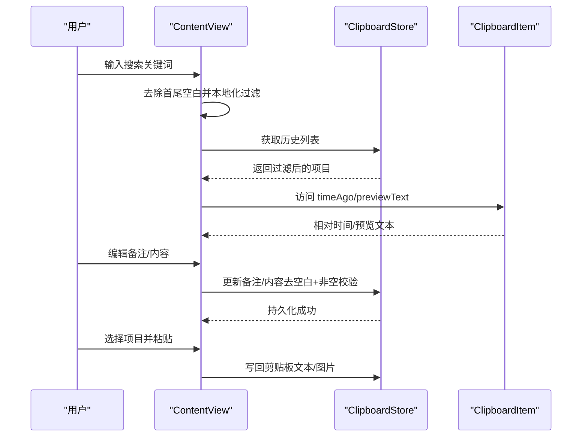
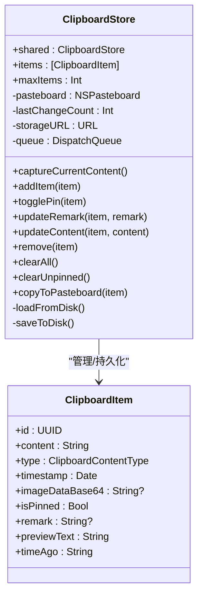
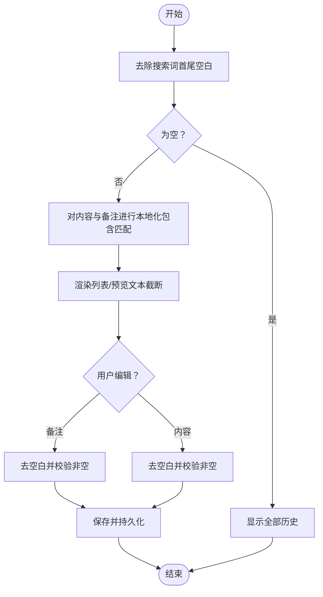
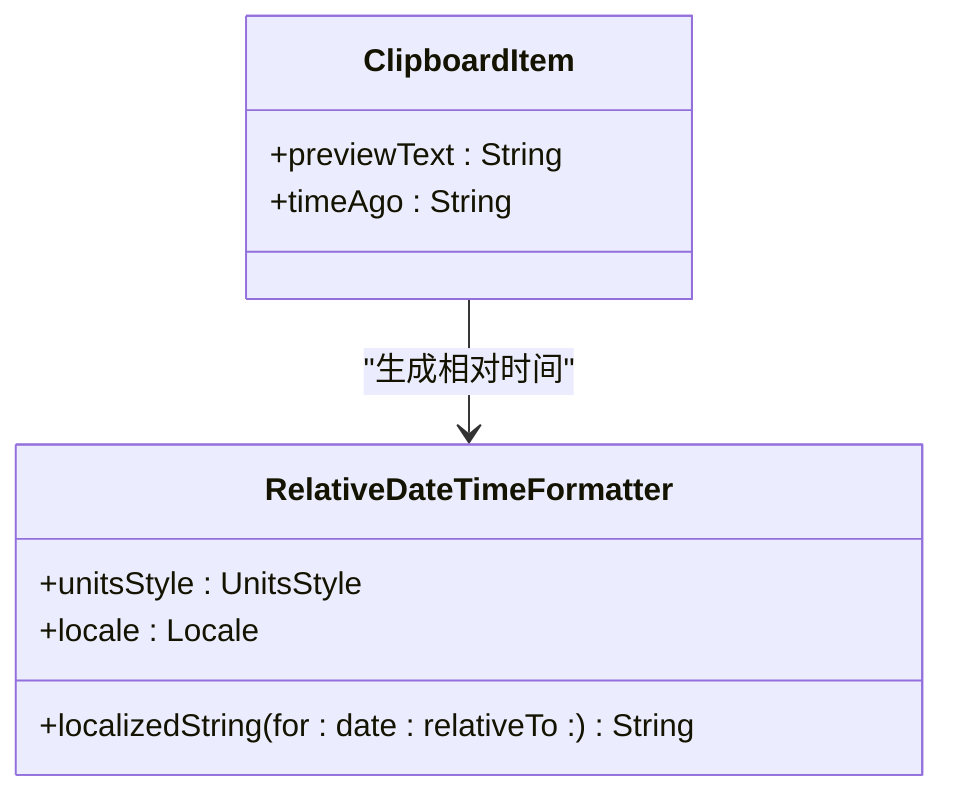
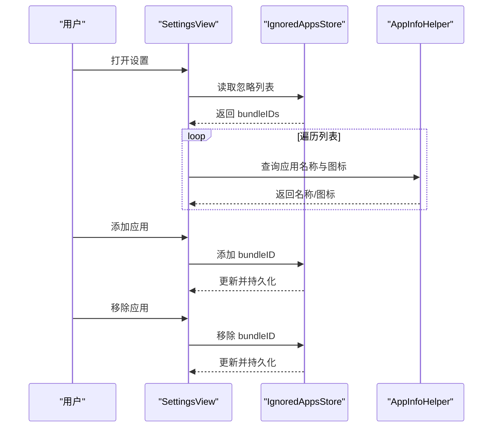
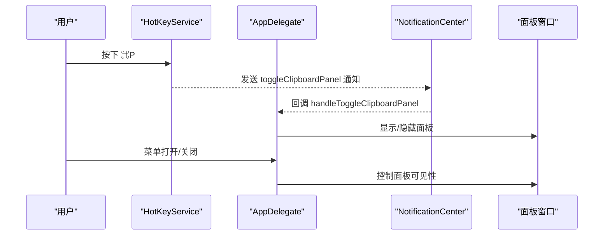
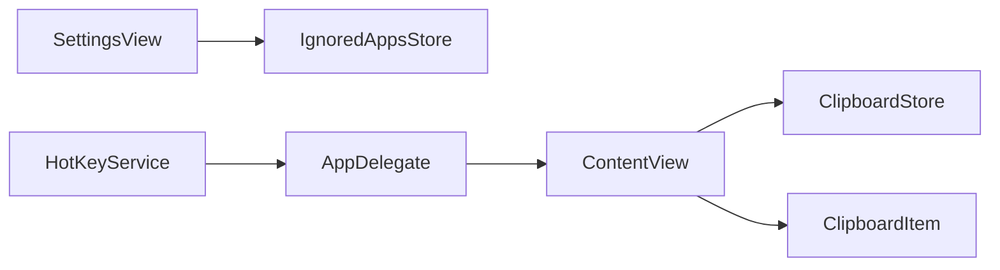

# 文本格式化与字符串操作

<cite>
**本文引用的文件**
- [ClipboardStore.swift](file://Cutting_board/Services/ClipboardStore.swift)
- [ClipboardItem.swift](file://Cutting_board/Models/ClipboardItem.swift)
- [ContentView.swift](file://Cutting_board/ContentView.swift)
- [SettingsView.swift](file://Cutting_board/SettingsView.swift)
- [IgnoredAppsStore.swift](file://Cutting_board/Services/IgnoredAppsStore.swift)
- [HotKeyService.swift](file://Cutting_board/Services/HotKeyService.swift)
- [Cutting_boardApp.swift](file://Cutting_board/Cutting_boardApp.swift)
- [text-formatting.md](file://.agents/skills/swiftui-expert-skill/references/text-formatting.md)
- [SKILL.md](file://.agents/skills/swiftui-expert-skill/SKILL.md)
</cite>

## 目录
1. [简介](#简介)
2. [项目结构](#项目结构)
3. [核心组件](#核心组件)
4. [架构总览](#架构总览)
5. [详细组件分析](#详细组件分析)
6. [依赖分析](#依赖分析)
7. [性能考虑](#性能考虑)
8. [可访问性支持](#可访问性支持)
9. [故障排查指南](#故障排查指南)
10. [结论](#结论)
11. [附录](#附录)

## 简介
本文件围绕剪贴板历史管理应用中的“文本格式化与字符串操作”主题，系统梳理现代 SwiftUI 文本格式化方式、用户输入过滤、本地化字符串处理、以及与之相关的性能与可访问性策略。通过对项目中实际实现的分析，总结出可复用的原则与最佳实践，并给出面向不同场景的实现思路与流程图。

## 项目结构
该项目采用 SwiftUI + AppKit 的菜单栏额外面板（MenuBarExtra）架构，核心关注点在于：
- 文本预览与本地化搜索
- 相对时间显示与日期格式化
- 输入过滤与字符串比较
- 备注与内容编辑的输入处理
- 剪贴板内容写回与去重

图表来源
- [Cutting_boardApp.swift](file://Cutting_board/Cutting_boardApp.swift#L11-L31)
- [ContentView.swift](file://Cutting_board/ContentView.swift#L20-L110)
- [ClipboardStore.swift](file://Cutting_board/Services/ClipboardStore.swift#L14-L39)
- [IgnoredAppsStore.swift](file://Cutting_board/Services/IgnoredAppsStore.swift#L16-L40)
- [HotKeyService.swift](file://Cutting_board/Services/HotKeyService.swift#L30-L81)
- [ClipboardItem.swift](file://Cutting_board/Models/ClipboardItem.swift#L17-L45)

章节来源
- [Cutting_boardApp.swift](file://Cutting_board/Cutting_boardApp.swift#L11-L31)
- [ContentView.swift](file://Cutting_board/ContentView.swift#L20-L110)
- [ClipboardStore.swift](file://Cutting_board/Services/ClipboardStore.swift#L14-L39)
- [IgnoredAppsStore.swift](file://Cutting_board/Services/IgnoredAppsStore.swift#L16-L40)
- [HotKeyService.swift](file://Cutting_board/Services/HotKeyService.swift#L30-L81)
- [ClipboardItem.swift](file://Cutting_board/Models/ClipboardItem.swift#L17-L45)

## 核心组件
- 文本预览与截断：模型提供预览文本，统一处理空白与截断，避免列表中出现不可读内容。
- 本地化搜索：使用本地化标准包含判断进行用户输入过滤，兼顾大小写与变音符号。
- 相对时间显示：使用相对日期格式化器，指定语言环境，输出“几分钟前/几小时后”等人性化时间描述。
- 输入处理：编辑备注与内容时，统一去除首尾空白并进行非空校验，防止无效数据进入历史。
- 剪贴板写回：根据类型分别写回文本或图片，确保与监控采集一致。

章节来源
- [ClipboardItem.swift](file://Cutting_board/Models/ClipboardItem.swift#L74-L88)
- [ContentView.swift](file://Cutting_board/ContentView.swift#L31-L37)
- [ClipboardStore.swift](file://Cutting_board/Services/ClipboardStore.swift#L125-L138)
- [ClipboardStore.swift](file://Cutting_board/Services/ClipboardStore.swift#L177-L188)

## 架构总览
下图展示了“输入过滤与文本格式化”的端到端流程：用户在搜索框输入 → 视图层进行本地化过滤 → 列表渲染 → 相对时间显示 → 备注与内容编辑 → 写回剪贴板。

图表来源
- [ContentView.swift](file://Cutting_board/ContentView.swift#L31-L37)
- [ClipboardStore.swift](file://Cutting_board/Services/ClipboardStore.swift#L125-L138)
- [ClipboardStore.swift](file://Cutting_board/Services/ClipboardStore.swift#L177-L188)
- [ClipboardItem.swift](file://Cutting_board/Models/ClipboardItem.swift#L82-L88)

## 详细组件分析

### 组件一：剪贴板监控与历史存储（ClipboardStore）
职责与要点：
- 监控系统剪贴板变化，优先识别图片，其次为纯文本。
- 去除前后空白并进行去重（相同内容与类型，图片还需 Base64 一致）。
- 支持钉住置顶、备注编辑、内容更新、删除与清空。
- 持久化采用 JSON 编解码，日期采用 ISO8601，加密存储。

图表来源
- [ClipboardStore.swift](file://Cutting_board/Services/ClipboardStore.swift#L14-L39)
- [ClipboardStore.swift](file://Cutting_board/Services/ClipboardStore.swift#L94-L148)
- [ClipboardItem.swift](file://Cutting_board/Models/ClipboardItem.swift#L17-L45)

章节来源
- [ClipboardStore.swift](file://Cutting_board/Services/ClipboardStore.swift#L47-L90)
- [ClipboardStore.swift](file://Cutting_board/Services/ClipboardStore.swift#L110-L148)
- [ClipboardStore.swift](file://Cutting_board/Services/ClipboardStore.swift#L192-L230)

### 组件二：视图层文本与交互（ContentView）
职责与要点：
- 搜索过滤：对查询词去空白后使用本地化包含判断，同时匹配内容与备注。
- 列表渲染：使用惰性列表与稳定 ID，支持键盘导航、双击粘贴、右键菜单。
- 预览文本：对长文本进行截断，避免 UI 抖动与阅读困难。
- 相对时间：在行内显示“几分钟前/几小时后”，增强可读性。
- 编辑弹窗：备注与内容编辑均进行去空白与非空校验，禁用无效操作。

图表来源
- [ContentView.swift](file://Cutting_board/ContentView.swift#L31-L37)
- [ContentView.swift](file://Cutting_board/ContentView.swift#L125-L138)
- [ContentView.swift](file://Cutting_board/ContentView.swift#L267-L301)
- [ContentView.swift](file://Cutting_board/ContentView.swift#L303-L335)

章节来源
- [ContentView.swift](file://Cutting_board/ContentView.swift#L31-L37)
- [ContentView.swift](file://Cutting_board/ContentView.swift#L199-L222)
- [ContentView.swift](file://Cutting_board/ContentView.swift#L267-L335)

### 组件三：模型层文本与时间（ClipboardItem）
职责与要点：
- 预览文本：统一去除空白，超过阈值截断并加省略号，保证列表一致性。
- 相对时间：使用相对日期格式化器，设置单位风格与语言环境，输出本地化时间描述。

图表来源
- [ClipboardItem.swift](file://Cutting_board/Models/ClipboardItem.swift#L74-L88)

章节来源
- [ClipboardItem.swift](file://Cutting_board/Models/ClipboardItem.swift#L74-L88)

### 组件四：设置与忽略应用（SettingsView 与 IgnoredAppsStore）
职责与要点：
- 设置页面展示忽略的应用列表，支持添加与移除。
- 通过应用信息助手获取名称与图标，便于用户识别。
- 忽略应用列表持久化到用户默认设置。

图表来源
- [SettingsView.swift](file://Cutting_board/SettingsView.swift#L41-L88)
- [IgnoredAppsStore.swift](file://Cutting_board/Services/IgnoredAppsStore.swift#L16-L40)
- [IgnoredAppsStore.swift](file://Cutting_board/Services/IgnoredAppsStore.swift#L44-L68)

章节来源
- [SettingsView.swift](file://Cutting_board/SettingsView.swift#L41-L88)
- [IgnoredAppsStore.swift](file://Cutting_board/Services/IgnoredAppsStore.swift#L16-L40)
- [IgnoredAppsStore.swift](file://Cutting_board/Services/IgnoredAppsStore.swift#L44-L68)

### 组件五：全局快捷键与面板控制（HotKeyService 与 Cutting_boardApp）
职责与要点：
- 使用 Carbon API 注册全局快捷键，无需辅助功能权限。
- 应用委托负责创建面板窗口、处理通知、切换显示状态。
- 菜单栏入口提供打开/关闭与退出。

图表来源
- [HotKeyService.swift](file://Cutting_board/Services/HotKeyService.swift#L30-L81)
- [Cutting_boardApp.swift](file://Cutting_board/Cutting_boardApp.swift#L35-L76)
- [Cutting_boardApp.swift](file://Cutting_board/Cutting_boardApp.swift#L100-L142)

章节来源
- [HotKeyService.swift](file://Cutting_board/Services/HotKeyService.swift#L30-L81)
- [Cutting_boardApp.swift](file://Cutting_board/Cutting_boardApp.swift#L35-L76)
- [Cutting_boardApp.swift](file://Cutting_board/Cutting_boardApp.swift#L100-L142)

## 依赖分析
- 视图层依赖服务层提供的数据与行为，通过观察对象与通知进行解耦。
- 模型层提供稳定的文本与时间格式化能力，避免视图层重复实现。
- 设置层与忽略应用存储相互配合，影响剪贴板监控的采集范围。
- 全局快捷键与应用委托共同决定面板生命周期与焦点管理。

图表来源
- [ContentView.swift](file://Cutting_board/ContentView.swift#L20-L30)
- [ClipboardStore.swift](file://Cutting_board/Services/ClipboardStore.swift#L14-L23)
- [SettingsView.swift](file://Cutting_board/SettingsView.swift#L11-L13)
- [IgnoredAppsStore.swift](file://Cutting_board/Services/IgnoredAppsStore.swift#L16-L21)
- [HotKeyService.swift](file://Cutting_board/Services/HotKeyService.swift#L30-L34)
- [Cutting_boardApp.swift](file://Cutting_board/Cutting_boardApp.swift#L35-L44)

章节来源
- [ContentView.swift](file://Cutting_board/ContentView.swift#L20-L30)
- [ClipboardStore.swift](file://Cutting_board/Services/ClipboardStore.swift#L14-L23)
- [SettingsView.swift](file://Cutting_board/SettingsView.swift#L11-L13)
- [IgnoredAppsStore.swift](file://Cutting_board/Services/IgnoredAppsStore.swift#L16-L21)
- [HotKeyService.swift](file://Cutting_board/Services/HotKeyService.swift#L30-L34)
- [Cutting_boardApp.swift](file://Cutting_board/Cutting_boardApp.swift#L35-L44)

## 性能考虑
- 列表渲染：使用惰性列表与稳定 ID，避免不必要的重建。
- 文本测量：避免使用过深的布局层级与频繁的几何读取，必要时采用现代几何变化监听。
- 搜索过滤：在视图层进行本地化包含匹配，避免在模型层重复计算。
- 输入处理：编辑时立即去空白与非空校验，减少无效更新。
- 持久化：异步队列进行编解码与磁盘写入，避免主线程阻塞。

章节来源
- [ContentView.swift](file://Cutting_board/ContentView.swift#L199-L222)
- [ClipboardStore.swift](file://Cutting_board/Services/ClipboardStore.swift#L219-L230)
- [text-formatting.md](file://.agents/skills/swiftui-expert-skill/references/text-formatting.md#L234-L271)

## 可访问性支持
- 为关键交互提供可读标签与提示，例如搜索、清空、编辑备注/内容、粘贴等。
- 为列表项提供可选中状态与键盘导航，支持高对比度与减少动态效果。
- 相对时间与预览文本在无障碍环境中清晰表达，避免歧义。

章节来源
- [ContentView.swift](file://Cutting_board/ContentView.swift#L118-L127)
- [ContentView.swift](file://Cutting_board/ContentView.swift#L159-L173)
- [ContentView.swift](file://Cutting_board/ContentView.swift#L240-L242)
- [ContentView.swift](file://Cutting_board/ContentView.swift#L359-L365)

## 故障排查指南
- 搜索不到结果：确认搜索词已去空白；检查本地化包含匹配是否符合预期。
- 编辑无效：确认输入非空；检查去空白逻辑是否导致内容被清空。
- 时间显示异常：确认相对时间格式化器的语言环境与单位风格设置。
- 剪贴板写回失败：检查类型分支与数据完整性（图片 Base64）。

章节来源
- [ContentView.swift](file://Cutting_board/ContentView.swift#L31-L37)
- [ClipboardStore.swift](file://Cutting_board/Services/ClipboardStore.swift#L125-L138)
- [ClipboardItem.swift](file://Cutting_board/Models/ClipboardItem.swift#L82-L88)
- [ClipboardStore.swift](file://Cutting_board/Services/ClipboardStore.swift#L177-L188)

## 结论
本项目在文本格式化与字符串操作方面体现了现代 SwiftUI 的最佳实践：使用本地化搜索、统一的文本预览与截断、相对时间显示、以及严格的输入过滤与非空校验。通过服务层与视图层的清晰分层，既保证了可维护性，也兼顾了性能与可访问性。建议在后续扩展中继续遵循现代 API 与本地化原则，持续优化文本渲染与交互体验。

## 附录
- 文本格式化与字符串操作参考：[text-formatting.md](file://.agents/skills/swiftui-expert-skill/references/text-formatting.md#L1-L286)
- 技能指南与审核清单：[SKILL.md](file://.agents/skills/swiftui-expert-skill/SKILL.md#L75-L81)