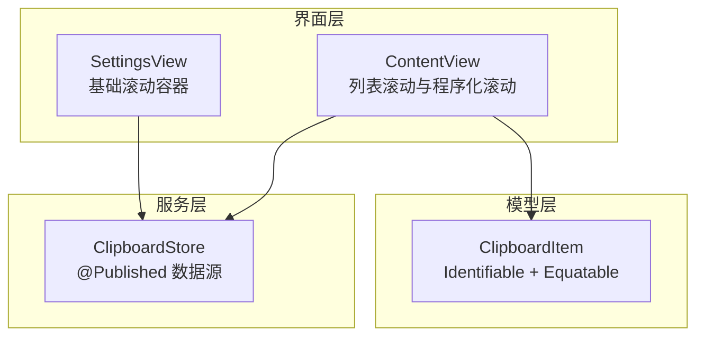
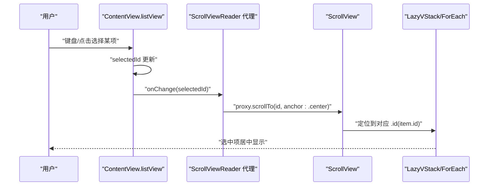
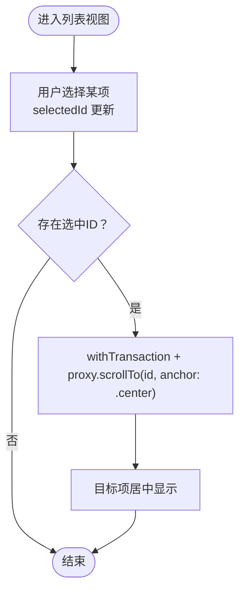
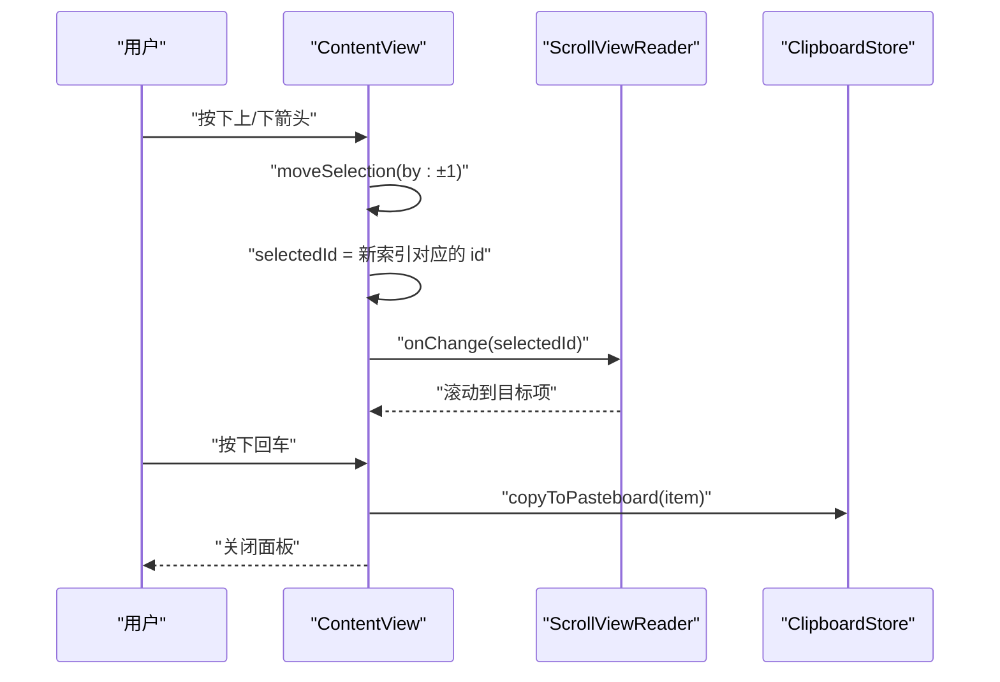
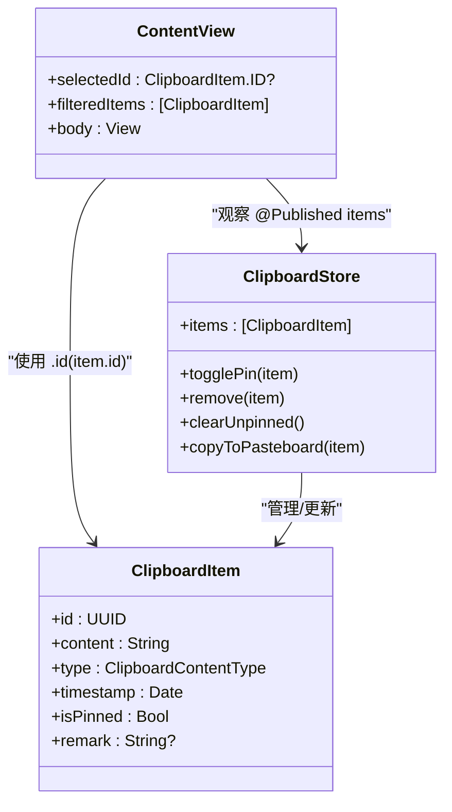

# 滚动视图模式

<cite>
**本文引用的文件**
- [ContentView.swift](file://Cutting_board/ContentView.swift)
- [SettingsView.swift](file://Cutting_board/SettingsView.swift)
- [ClipboardItem.swift](file://Cutting_board/Models/ClipboardItem.swift)
- [ClipboardStore.swift](file://Cutting_board/Services/ClipboardStore.swift)
- [scroll-patterns.md](file://.agents/skills/swiftui-expert-skill/references/scroll-patterns.md)
- [list-patterns.md](file://.agents/skills/swiftui-expert-skill/references/list-patterns.md)
- [performance-patterns.md](file://.agents/skills/swiftui-expert-skill/references/performance-patterns.md)
</cite>

## 目录
1. [简介](#简介)
2. [项目结构](#项目结构)
3. [核心组件](#核心组件)
4. [架构总览](#架构总览)
5. [详细组件分析](#详细组件分析)
6. [依赖关系分析](#依赖关系分析)
7. [性能考量](#性能考量)
8. [故障排查指南](#故障排查指南)
9. [结论](#结论)
10. [附录](#附录)

## 简介
本文件聚焦于 SwiftUI 的滚动视图模式，围绕以下主题展开：
- ScrollViewReader 的使用方法与最佳实践
- 稳定 ID 结合程序化滚动的实现
- 滚动指示器的现代化控制
- 滚动设计的核心原则：程序化滚动的触发时机、滚动状态的正确管理、滚动性能的优化策略
- 具体场景示例：列表滚动、复杂布局滚动、用户触发的滚动控制
- 滚动事件处理与性能监控技巧

## 项目结构
该项目采用功能模块化组织，滚动视图模式主要体现在内容面板与设置面板两个入口视图中：
- 内容视图负责剪贴板历史列表的滚动、键盘导航与程序化滚动
- 设置视图演示了基础滚动容器的使用
- 模型层提供稳定的唯一标识，支撑 ScrollViewReader 的锚点定位
- 存储层提供数据源与状态变更，驱动滚动行为

图表来源
- [ContentView.swift](file://Cutting_board/ContentView.swift#L20-L366)
- [SettingsView.swift](file://Cutting_board/SettingsView.swift#L11-L95)
- [ClipboardItem.swift](file://Cutting_board/Models/ClipboardItem.swift#L17-L89)
- [ClipboardStore.swift](file://Cutting_board/Services/ClipboardStore.swift#L14-L232)

章节来源
- [ContentView.swift](file://Cutting_board/ContentView.swift#L20-L366)
- [SettingsView.swift](file://Cutting_board/SettingsView.swift#L11-L95)
- [ClipboardItem.swift](file://Cutting_board/Models/ClipboardItem.swift#L17-L89)
- [ClipboardStore.swift](file://Cutting_board/Services/ClipboardStore.swift#L14-L232)

## 核心组件
- 列表滚动与程序化滚动：通过 ScrollViewReader 提供代理，结合每个列表项的稳定 ID 实现锚点滚动与选中高亮
- 滚动指示器控制：统一使用现代修饰符隐藏滚动条，保持界面简洁
- 键盘交互：上下方向键切换选中项，Enter 执行粘贴，Delete 删除，Esc 关闭面板
- 视图稳定性：列表项视图实现 Equatable 并使用 .equatable()，减少不必要的重绘
- 数据驱动：基于 @Published 的 ClipboardStore 提供实时数据更新，触发滚动行为

章节来源
- [ContentView.swift](file://Cutting_board/ContentView.swift#L199-L222)
- [ContentView.swift](file://Cutting_board/ContentView.swift#L200-L215)
- [ContentView.swift](file://Cutting_board/ContentView.swift#L224-L254)
- [ClipboardItem.swift](file://Cutting_board/Models/ClipboardItem.swift#L17-L45)

## 架构总览
滚动视图模式在本项目中的整体流程如下：
- 用户操作（键盘/点击）改变选中项
- 选中项变化触发 onChange，通过 ScrollViewReader 代理执行 scrollTo
- 列表项通过 .id(item.id) 与稳定 ID 绑定，确保锚点定位准确
- 滚动指示器通过修饰符统一隐藏，提升视觉一致性

图表来源
- [ContentView.swift](file://Cutting_board/ContentView.swift#L199-L222)
- [ContentView.swift](file://Cutting_board/ContentView.swift#L200-L215)

## 详细组件分析

### 组件一：列表滚动与程序化滚动（ContentView.listView）
- 使用 ScrollViewReader 包裹 ScrollView，获得代理以进行锚点滚动
- 列表采用 LazyVStack + ForEach，每项通过 .id(item.id) 绑定稳定 ID
- 通过 onChange(selectedId) 触发滚动，使用 Transaction 控制动画
- 滚动指示器统一隐藏，避免视觉干扰

图表来源
- [ContentView.swift](file://Cutting_board/ContentView.swift#L199-L222)
- [ContentView.swift](file://Cutting_board/ContentView.swift#L200-L215)

章节来源
- [ContentView.swift](file://Cutting_board/ContentView.swift#L199-L222)
- [ContentView.swift](file://Cutting_board/ContentView.swift#L200-L215)

### 组件二：键盘导航与滚动联动（ContentView）
- 上下箭头键调用 moveSelection(by:)，计算新索引并更新 selectedId
- Enter 执行粘贴，Esc 关闭面板
- onChange(searchText) 中当选中项不在过滤结果中时，重置选中项
- onKeyPress(.delete) 支持删除并调整选中项

图表来源
- [ContentView.swift](file://Cutting_board/ContentView.swift#L71-L98)
- [ContentView.swift](file://Cutting_board/ContentView.swift#L337-L348)
- [ContentView.swift](file://Cutting_board/ContentView.swift#L350-L357)

章节来源
- [ContentView.swift](file://Cutting_board/ContentView.swift#L71-L98)
- [ContentView.swift](file://Cutting_board/ContentView.swift#L337-L348)
- [ContentView.swift](file://Cutting_board/ContentView.swift#L350-L357)

### 组件三：滚动指示器的现代化控制
- 在 ScrollView 上使用 .scrollIndicators(.hidden) 隐藏滚动条
- 该方式替代旧式初始化参数，符合现代 SwiftUI 推荐做法

章节来源
- [ContentView.swift](file://Cutting_board/ContentView.swift#L210-L210)
- [scroll-patterns.md](file://.agents/skills/swiftui-expert-skill/references/scroll-patterns.md#L5-L20)

### 组件四：复杂布局滚动（SettingsView）
- 设置面板使用基础 ScrollView 容器，内部包含可滚动区域
- 展示了在复杂布局中如何嵌套滚动容器与内容组织

章节来源
- [SettingsView.swift](file://Cutting_board/SettingsView.swift#L30-L35)

### 组件五：视图稳定性与性能（ClipboardRowView）
- 列表项视图实现 Equatable 并使用 .equatable()，减少不必要的重绘
- 通过 task(id: item.id) 预加载图片缩略图，提升滚动流畅度

章节来源
- [ContentView.swift](file://Cutting_board/ContentView.swift#L382-L396)
- [ContentView.swift](file://Cutting_board/ContentView.swift#L456-L460)

## 依赖关系分析
- ContentView 依赖 ClipboardStore 提供的数据源，@Published 的 items 变化驱动列表渲染与滚动
- ClipboardItem 实现 Identifiable，为 ScrollViewReader 的锚点提供稳定 ID
- ClipboardStore 负责数据持久化、去重、排序与更新，间接影响滚动行为（如删除后选中项调整）

图表来源
- [ContentView.swift](file://Cutting_board/ContentView.swift#L20-L366)
- [ClipboardStore.swift](file://Cutting_board/Services/ClipboardStore.swift#L14-L232)
- [ClipboardItem.swift](file://Cutting_board/Models/ClipboardItem.swift#L17-L89)

章节来源
- [ContentView.swift](file://Cutting_board/ContentView.swift#L20-L366)
- [ClipboardStore.swift](file://Cutting_board/Services/ClipboardStore.swift#L14-L232)
- [ClipboardItem.swift](file://Cutting_board/Models/ClipboardItem.swift#L17-L89)

## 性能考量
- 程序化滚动的触发时机
  - 仅在选中项变化时触发滚动，避免频繁滚动导致的卡顿
  - 使用 Transaction 控制动画，确保滚动过程平滑
- 滚动状态的正确管理
  - 通过 selectedId 管理当前选中项，onChange 监听变化并触发滚动
  - 过滤状态下若选中项不在结果集中，及时重置选中项
- 滚动性能优化策略
  - 使用 LazyVStack 减少视图构建开销
  - 列表项实现 Equatable 并使用 .equatable()，降低重绘频率
  - 预加载图片缩略图，避免滚动过程中图片解码造成的掉帧
  - 隐藏滚动条，减少绘制负担
- 参考资料
  - 列表稳定性与 ForEach 身份绑定的最佳实践
  - 动画与过渡的性能注意事项

章节来源
- [ContentView.swift](file://Cutting_board/ContentView.swift#L199-L222)
- [ContentView.swift](file://Cutting_board/ContentView.swift#L200-L215)
- [ContentView.swift](file://Cutting_board/ContentView.swift#L224-L254)
- [ContentView.swift](file://Cutting_board/ContentView.swift#L456-L460)
- [list-patterns.md](file://.agents/skills/swiftui-expert-skill/references/list-patterns.md#L3-L31)
- [performance-patterns.md](file://.agents/skills/swiftui-expert-skill/references/performance-patterns.md#L82-L104)

## 故障排查指南
- 滚动不生效
  - 确认列表项是否正确绑定 .id(item.id)，且 item.id 是稳定的
  - 确认 selectedId 已更新，且 onChange(selectedId) 正常触发
- 滚动跳动或卡顿
  - 检查是否存在频繁的状态更新导致的重绘
  - 使用 .equatable() 优化视图相等性判断
  - 避免在滚动过程中进行昂贵的计算或网络请求
- 滚动指示器显示异常
  - 使用 .scrollIndicators(.hidden) 替代旧式初始化参数
- 键盘导航异常
  - 确保 moveSelection 计算的新索引在合法范围内
  - 检查过滤逻辑是否导致选中项丢失

章节来源
- [ContentView.swift](file://Cutting_board/ContentView.swift#L200-L215)
- [ContentView.swift](file://Cutting_board/ContentView.swift#L337-L348)
- [scroll-patterns.md](file://.agents/skills/swiftui-expert-skill/references/scroll-patterns.md#L5-L20)

## 结论
本项目展示了在 SwiftUI 中实现高效、稳定、可维护的滚动视图模式的关键路径：
- 使用 ScrollViewReader 与稳定 ID 实现可靠的锚点滚动
- 通过合理的状态管理与触发时机，确保滚动行为与用户意图一致
- 采用现代修饰符与视图稳定性技术，显著提升滚动性能
- 在复杂布局中合理嵌套滚动容器，保持良好的用户体验

## 附录
- 滚动设计核心原则清单
  - 使用 .scrollIndicators(.hidden) 替代初始化参数
  - 使用 ScrollViewReader 与稳定 ID 实现程序化滚动
  - 为 scrollTo() 显式添加动画
  - 使用 .visualEffect 等 API 实现基于滚动的视觉效果
  - 使用 .scrollTargetBehavior 实现分页或对齐行为
  - 通过阈值门控减少滚动位置更新频率
  - 使用偏好键实现自定义滚动位置跟踪

章节来源
- [scroll-patterns.md](file://.agents/skills/swiftui-expert-skill/references/scroll-patterns.md#L296-L305)