# 状态管理最佳实践

<cite>
**本文档引用的文件**
- [ContentView.swift](file://Cutting_board/ContentView.swift)
- [SettingsView.swift](file://Cutting_board/SettingsView.swift)
- [ClipboardItem.swift](file://Cutting_board/Models/ClipboardItem.swift)
- [ClipboardStore.swift](file://Cutting_board/Services/ClipboardStore.swift)
- [IgnoredAppsStore.swift](file://Cutting_board/Services/IgnoredAppsStore.swift)
- [HotKeyService.swift](file://Cutting_board/Services/HotKeyService.swift)
- [Cutting_boardApp.swift](file://Cutting_board/Cutting_boardApp.swift)
- [ClipboardCrypto.swift](file://Cutting_board/Services/ClipboardCrypto.swift)
- [state-management.md](file://.agents/skills/swiftui-expert-skill/references/state-management.md)
</cite>

## 目录
1. [引言](#引言)
2. [项目结构概览](#项目结构概览)
3. [核心组件分析](#核心组件分析)
4. [架构总览](#架构总览)
5. [详细组件分析](#详细组件分析)
6. [依赖关系分析](#依赖关系分析)
7. [性能考虑](#性能考虑)
8. [故障排除指南](#故障排除指南)
9. [结论](#结论)

## 引言

本文件旨在为SwiftUI状态管理提供一套完整的最佳实践指南。通过对Cutting_board项目的深入分析，我们将探讨现代SwiftUI状态管理的核心原则，包括@Observable与ObservableObject的选择策略、@MainActor标记的重要性、属性包装器的正确使用方式（@State、@Binding、@Bindable），以及状态管理的完整生命周期。

该项目展示了从传统ObservableObject模式向现代@Observable模式的演进，为我们提供了宝贵的实践经验。通过分析实际代码实现，我们可以总结出适用于各种应用场景的状态管理模式。

## 项目结构概览

Cutting_board项目采用清晰的分层架构设计，将状态管理、业务逻辑和服务层进行了有效分离：

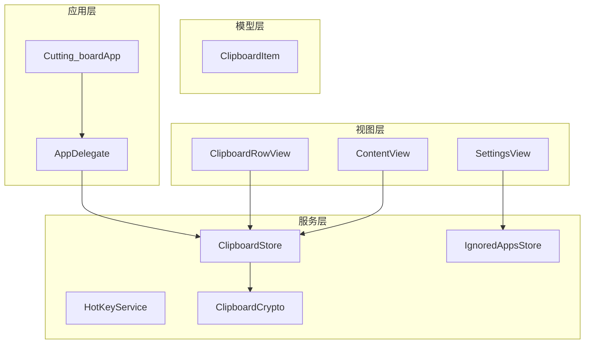

**图表来源**
- [Cutting_boardApp.swift](file://Cutting_board/Cutting_boardApp.swift#L35-L143)
- [ContentView.swift](file://Cutting_board/ContentView.swift#L20-L305)
- [SettingsView.swift](file://Cutting_board/SettingsView.swift#L11-L89)

**章节来源**
- [Cutting_boardApp.swift](file://Cutting_board/Cutting_boardApp.swift#L1-L144)
- [ContentView.swift](file://Cutting_board/ContentView.swift#L1-L500)
- [SettingsView.swift](file://Cutting_board/SettingsView.swift#L1-L95)

## 核心组件分析

### 状态管理架构模式

项目中的状态管理遵循以下核心原则：

#### 1. 视图内状态管理
视图内部使用@State管理临时状态，确保状态的私有性和作用域限制：

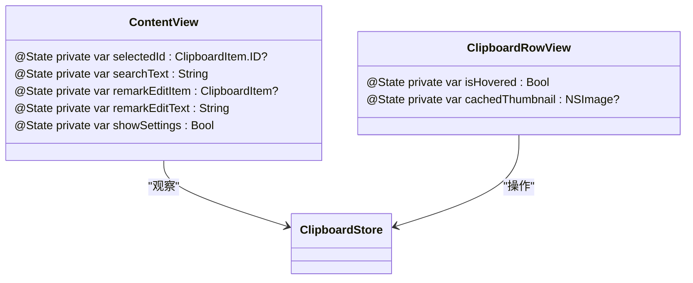

**图表来源**
- [ContentView.swift](file://Cutting_board/ContentView.swift#L21-L26)
- [ClipboardRowView.swift](file://Cutting_board/ContentView.swift#L334-L336)

#### 2. 注入状态管理
通过@ObservedObject注入外部状态管理器，实现跨视图的状态共享：

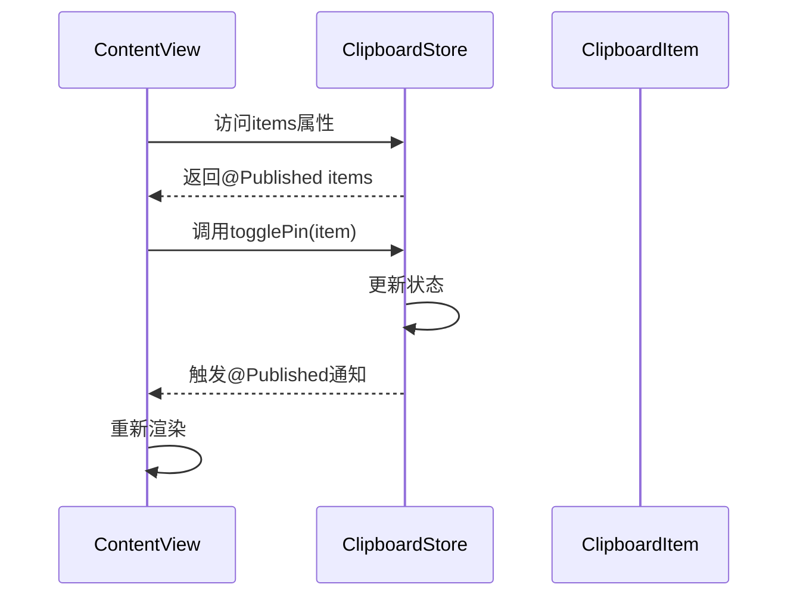

**图表来源**
- [ContentView.swift](file://Cutting_board/ContentView.swift#L21-L305)
- [ClipboardStore.swift](file://Cutting_board/Services/ClipboardStore.swift#L14-L18)

#### 3. 线程安全保证
所有状态更新都在主线程执行，确保UI更新的安全性：

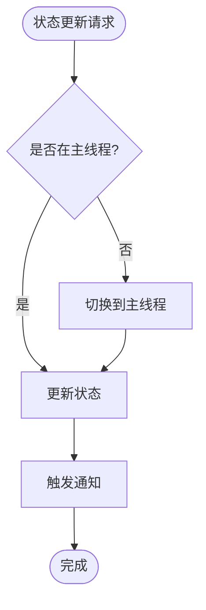

**图表来源**
- [ClipboardStore.swift](file://Cutting_board/Services/ClipboardStore.swift#L101-L107)
- [HotKeyService.swift](file://Cutting_board/Services/HotKeyService.swift#L23-L26)

**章节来源**
- [ContentView.swift](file://Cutting_board/ContentView.swift#L20-L305)
- [ClipboardStore.swift](file://Cutting_board/Services/ClipboardStore.swift#L14-L223)

## 架构总览

### 状态管理层次结构

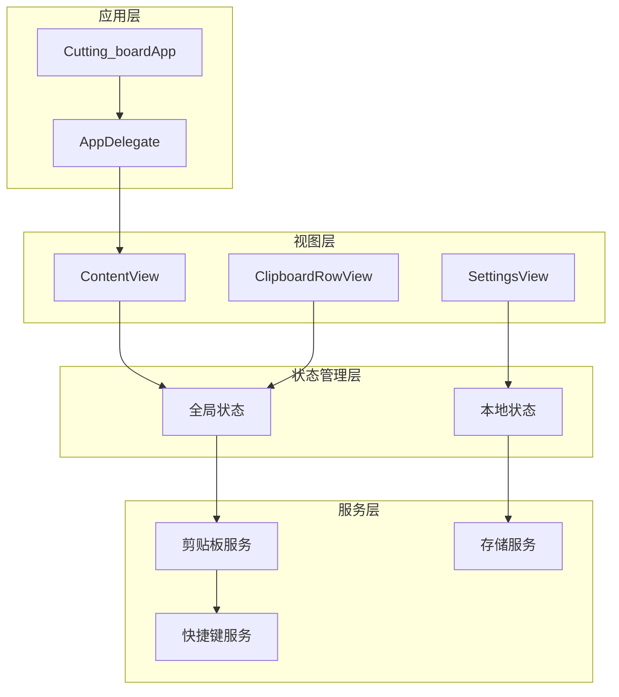

**图表来源**
- [Cutting_boardApp.swift](file://Cutting_board/Cutting_boardApp.swift#L11-L31)
- [ContentView.swift](file://Cutting_board/ContentView.swift#L20-L305)
- [SettingsView.swift](file://Cutting_board/SettingsView.swift#L11-L89)

### 状态流控制

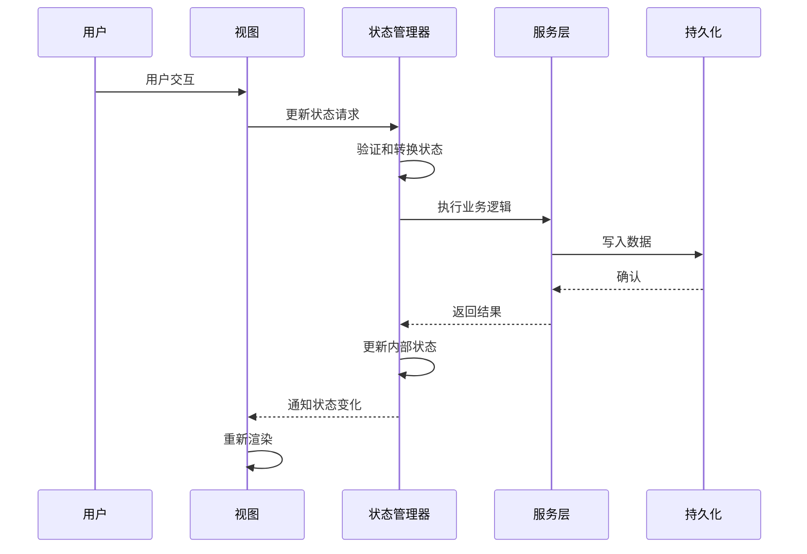

**图表来源**
- [ClipboardStore.swift](file://Cutting_board/Services/ClipboardStore.swift#L94-L108)
- [ClipboardStore.swift](file://Cutting_board/Services/ClipboardStore.swift#L210-L221)

## 详细组件分析

### ClipboardStore - 状态管理核心

ClipboardStore是项目中最复杂的状态管理组件，实现了完整的CRUD操作和状态同步机制：

#### 核心特性

1. **单例模式**: 使用shared实例确保全局状态一致性
2. **线程安全**: 所有状态更新都在主线程执行
3. **持久化集成**: 自动序列化和反序列化状态
4. **实时监控**: 通过定时器监控系统剪贴板变化

#### 状态更新流程

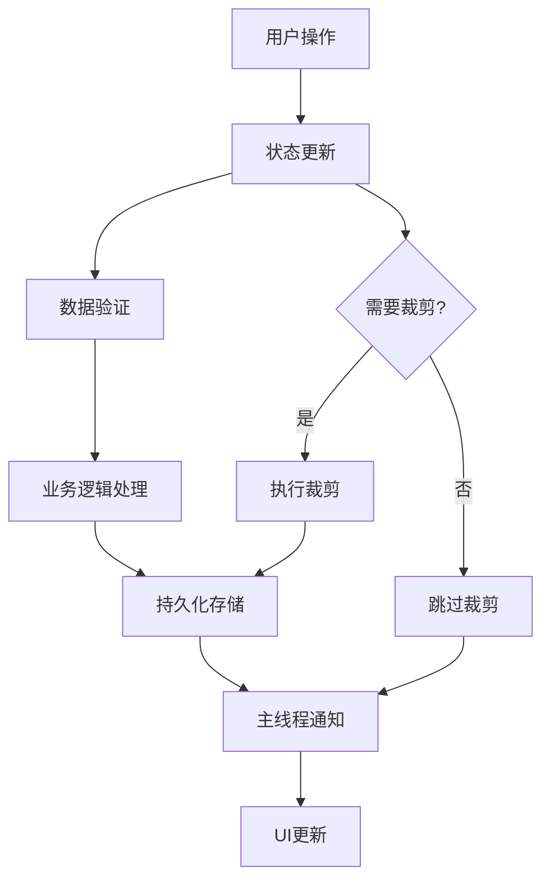

**图表来源**
- [ClipboardStore.swift](file://Cutting_board/Services/ClipboardStore.swift#L94-L147)
- [ClipboardStore.swift](file://Cutting_board/Services/ClipboardStore.swift#L110-L115)

#### 关键实现模式

1. **状态替换模式**: 通过整体替换数组触发@Published通知
2. **异步处理**: 使用DispatchQueue进行后台数据处理
3. **错误恢复**: 支持明文和加密两种存储格式

**章节来源**
- [ClipboardStore.swift](file://Cutting_board/Services/ClipboardStore.swift#L14-L223)

### ContentView - 视图状态管理

ContentView展示了现代SwiftUI状态管理的最佳实践：

#### 视图内状态管理

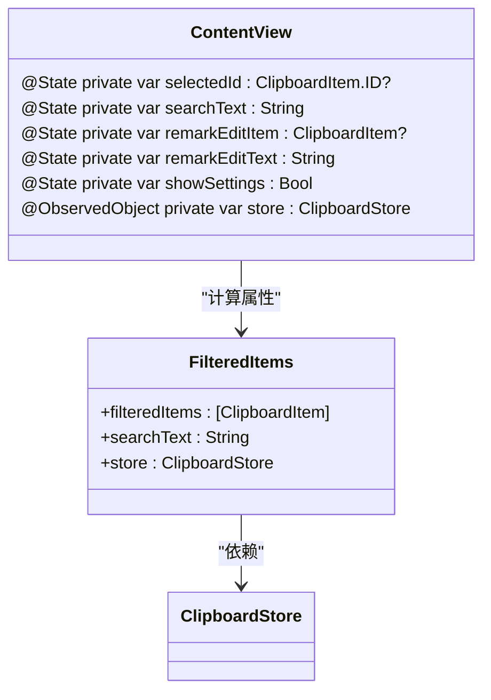

**图表来源**
- [ContentView.swift](file://Cutting_board/ContentView.swift#L21-L35)

#### 事件处理模式

1. **键盘导航**: 实现上下箭头键选择和回车粘贴
2. **手势支持**: 双击粘贴和右键菜单操作
3. **动态过滤**: 实时搜索和结果高亮

**章节来源**
- [ContentView.swift](file://Cutting_board/ContentView.swift#L61-L95)
- [ContentView.swift](file://Cutting_board/ContentView.swift#L184-L207)

### SettingsView - 注入状态管理

SettingsView演示了如何正确使用@ObservedObject注入外部状态：

#### 状态注入模式

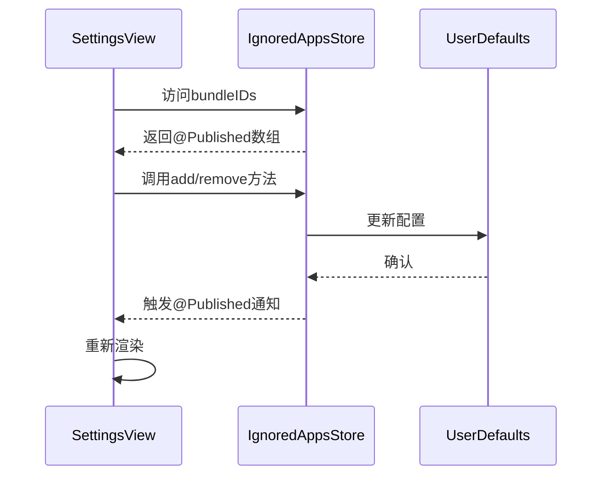

**图表来源**
- [SettingsView.swift](file://Cutting_board/SettingsView.swift#L12-L41)
- [IgnoredAppsStore.swift](file://Cutting_board/Services/IgnoredAppsStore.swift#L16-L40)

**章节来源**
- [SettingsView.swift](file://Cutting_board/SettingsView.swift#L11-L89)
- [IgnoredAppsStore.swift](file://Cutting_board/Services/IgnoredAppsStore.swift#L16-L40)

### ClipboardRowView - 组件状态管理

ClipboardRowView展示了如何在子组件中管理局部状态：

#### 局部状态模式

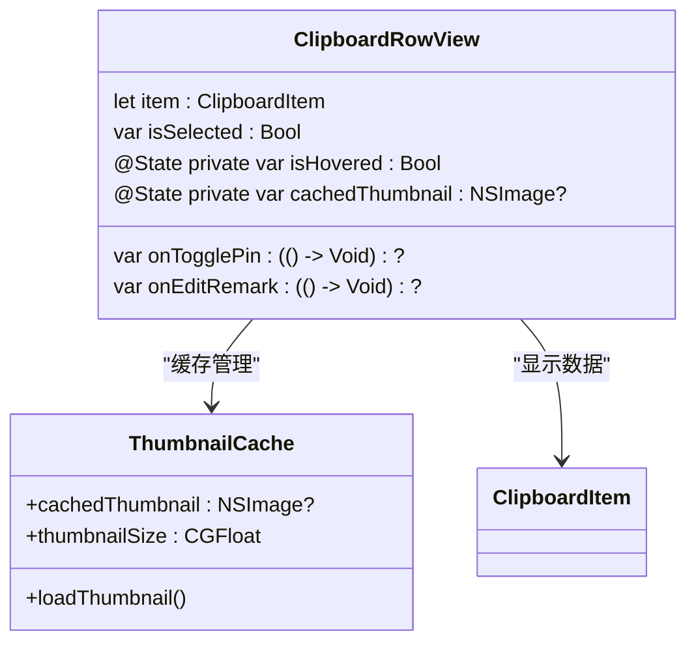

**图表来源**
- [ClipboardRowView.swift](file://Cutting_board/ContentView.swift#L321-L337)

**章节来源**
- [ClipboardRowView.swift](file://Cutting_board/ContentView.swift#L321-L471)

## 依赖关系分析

### 状态管理依赖图

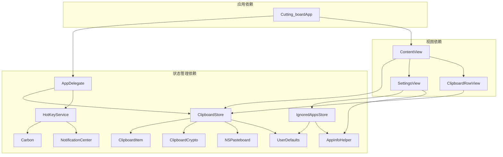

**图表来源**
- [ClipboardStore.swift](file://Cutting_board/Services/ClipboardStore.swift#L25-L39)
- [IgnoredAppsStore.swift](file://Cutting_board/Services/IgnoredAppsStore.swift#L23-L25)
- [HotKeyService.swift](file://Cutting_board/Services/HotKeyService.swift#L31-L69)

### 状态传播路径

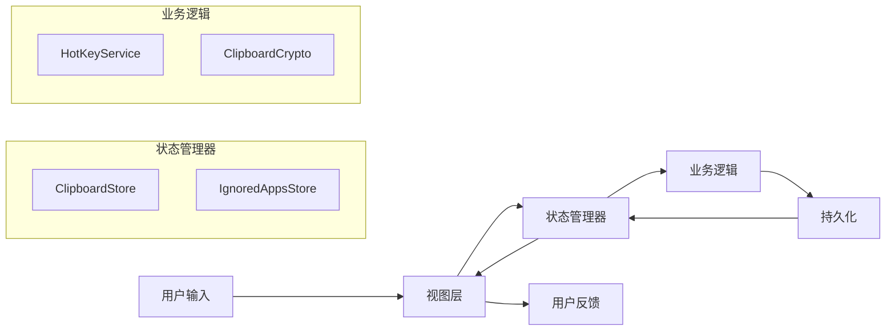

**图表来源**
- [Cutting_boardApp.swift](file://Cutting_board/Cutting_boardApp.swift#L46-L66)
- [ClipboardStore.swift](file://Cutting_board/Services/ClipboardStore.swift#L47-L60)

**章节来源**
- [Cutting_boardApp.swift](file://Cutting_board/Cutting_boardApp.swift#L35-L143)
- [ClipboardStore.swift](file://Cutting_board/Services/ClipboardStore.swift#L14-L223)
- [IgnoredAppsStore.swift](file://Cutting_board/Services/IgnoredAppsStore.swift#L16-L40)

## 性能考虑

### 状态更新优化策略

1. **批量更新**: 通过整体替换数组减少不必要的重渲染
2. **懒加载**: 图片缩略图的延迟加载避免内存占用
3. **条件渲染**: 使用Equatable协议优化视图重渲染
4. **异步处理**: 后台线程处理耗时操作保持UI响应

### 内存管理最佳实践

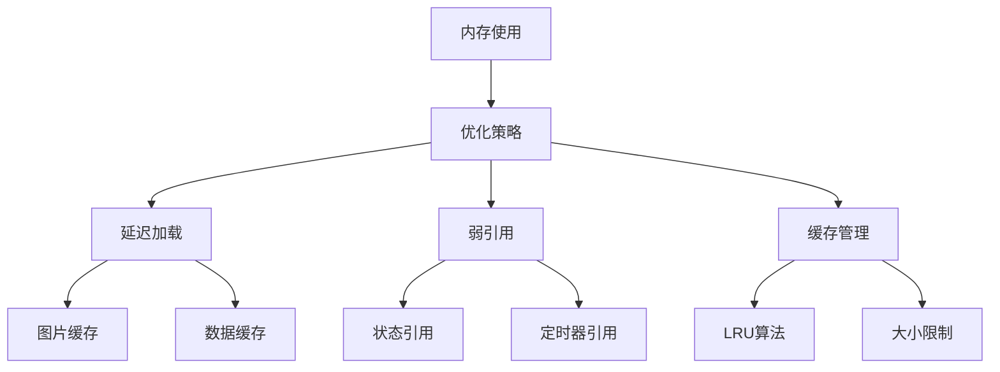

**图表来源**
- [ClipboardRowView.swift](file://Cutting_board/ContentView.swift#L383-L386)
- [ClipboardStore.swift](file://Cutting_board/Services/ClipboardStore.swift#L210-L221)

### 线程安全保证

1. **主线程更新**: 所有UI相关状态更新强制在主线程执行
2. **弱引用**: 定时器和观察者使用弱引用避免循环引用
3. **异步隔离**: 后台线程处理完成后切换到主线程更新状态

**章节来源**
- [ClipboardStore.swift](file://Cutting_board/Services/ClipboardStore.swift#L101-L107)
- [HotKeyService.swift](file://Cutting_board/Services/HotKeyService.swift#L23-L26)

## 故障排除指南

### 常见状态管理问题

#### 1. 状态不更新问题
**症状**: UI不响应状态变化
**原因**: 
- 使用@State接收外部传入的值
- 状态更新不在主线程执行
- @ObservedObject对象被重新创建

**解决方案**:
- 使用@Binding或let接收外部状态
- 确保状态更新在主线程执行
- 使用shared单例模式管理状态对象

#### 2. 内存泄漏问题
**症状**: 应用内存持续增长
**原因**:
- 定时器未正确释放
- 观察者未移除
- 循环引用

**解决方案**:
- 在deinit中释放定时器
- 使用weak self避免循环引用
- 正确管理观察者生命周期

#### 3. 线程安全问题
**症状**: 随机崩溃或状态不一致
**原因**:
- 在后台线程直接更新UI
- 并发访问共享状态
- 状态更新顺序错误

**解决方案**:
- 使用DispatchQueue.main.async更新UI
- 实现适当的并发控制
- 确保状态更新的原子性

**章节来源**
- [ClipboardStore.swift](file://Cutting_board/Services/ClipboardStore.swift#L41-L43)
- [HotKeyService.swift](file://Cutting_board/Services/HotKeyService.swift#L71-L79)

### 调试技巧

1. **状态追踪**: 使用print语句跟踪状态变化
2. **断点调试**: 在状态更新点设置断点
3. **性能分析**: 使用Instruments分析内存和CPU使用
4. **日志记录**: 记录关键状态变更的时间戳

## 结论

通过分析Cutting_board项目的状态管理实现，我们可以总结出以下最佳实践：

### 核心原则

1. **优先使用@Observable**: iOS 17+推荐使用@Observable替代ObservableObject
2. **@MainActor标记**: @Observable类应标记@MainActor确保线程安全
3. **状态封装**: 视图内状态使用@State，外部状态使用@ObservedObject或@Bindable
4. **线程安全**: 所有UI更新必须在主线程执行
5. **性能优化**: 实现懒加载、缓存管理和批量更新

### 实践建议

1. **状态设计**: 将状态分为视图内状态和共享状态，明确责任边界
2. **错误处理**: 实现完善的错误恢复机制，支持明文和加密两种存储格式
3. **测试覆盖**: 为状态管理逻辑编写单元测试和集成测试
4. **文档维护**: 保持状态管理文档与代码同步更新

### 迁移策略

对于遗留的ObservableObject代码，建议采用渐进式迁移：
1. 识别状态管理的关键路径
2. 逐步替换为@Observable实现
3. 保持API兼容性
4. 逐步移除ObservableObject依赖

通过遵循这些最佳实践，开发者可以构建出高性能、可维护的SwiftUI应用状态管理系统。