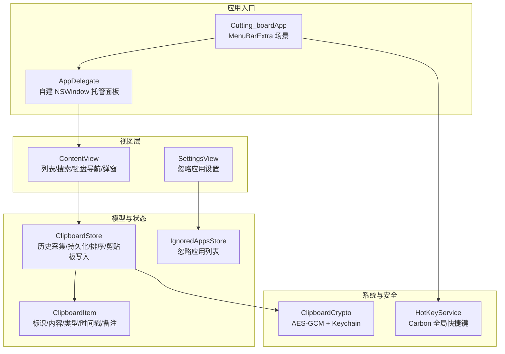
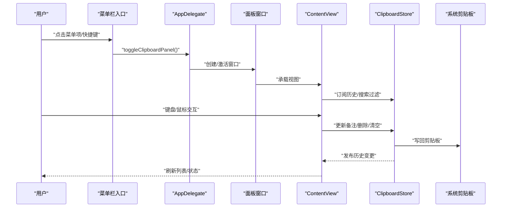
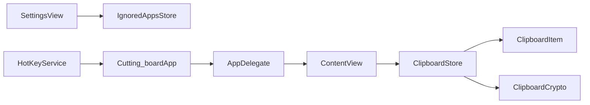

# 现代API使用指南

<cite>
**本文引用的文件**
- [ContentView.swift](file://Cutting_board/ContentView.swift)
- [Cutting_boardApp.swift](file://Cutting_board/Cutting_boardApp.swift)
- [SettingsView.swift](file://Cutting_board/SettingsView.swift)
- [ClipboardItem.swift](file://Cutting_board/Models/ClipboardItem.swift)
- [ClipboardStore.swift](file://Cutting_board/Services/ClipboardStore.swift)
- [HotKeyService.swift](file://Cutting_board/Services/HotKeyService.swift)
- [IgnoredAppsStore.swift](file://Cutting_board/Services/IgnoredAppsStore.swift)
- [ClipboardCrypto.swift](file://Cutting_board/Services/ClipboardCrypto.swift)
- [modern-apis.md](file://.agents/skills/swiftui-expert-skill/references/modern-apis.md)
- [text-formatting.md](file://.agents/skills/swiftui-expert-skill/references/text-formatting.md)
- [layout-best-practices.md](file://.agents/skills/swiftui-expert-skill/references/layout-best-practices.md)
- [state-management.md](file://.agents/skills/swiftui-expert-skill/references/state-management.md)
</cite>

## 目录
1. [引言](#引言)
2. [项目结构](#项目结构)
3. [核心组件](#核心组件)
4. [架构总览](#架构总览)
5. [详细组件分析](#详细组件分析)
6. [依赖关系分析](#依赖关系分析)
7. [性能考量](#性能考量)
8. [故障排查指南](#故障排查指南)
9. [结论](#结论)
10. [附录](#附录)

## 引言
本指南面向SwiftUI开发者，系统梳理现代API的使用方式与最佳实践，重点覆盖颜色与外观、导航、文本格式化、几何与布局等领域的API现代化改造路径。结合项目中的实际实现，给出从废弃API到现代API的替换范式、迁移原则、兼容性策略与可操作的示例路径，帮助团队在保证功能正确的同时，提升可维护性、可测试性与未来兼容性。

## 项目结构
该项目采用“视图层 + 模型层 + 服务层”的分层组织，围绕剪贴板历史面板展开，包含菜单栏入口、全局快捷键、列表渲染、备注编辑、玻璃效果与无障碍等特性。整体结构清晰，适合进行现代API迁移与优化。

图表来源
- [Cutting_boardApp.swift](file://Cutting_board/Cutting_boardApp.swift#L15-L31)
- [AppDelegate](file://Cutting_board/Cutting_boardApp.swift#L35-L143)
- [ContentView.swift](file://Cutting_board/ContentView.swift#L20-L305)
- [SettingsView.swift](file://Cutting_board/SettingsView.swift#L11-L95)
- [ClipboardItem.swift](file://Cutting_board/Models/ClipboardItem.swift#L17-L89)
- [ClipboardStore.swift](file://Cutting_board/Services/ClipboardStore.swift#L14-L223)
- [HotKeyService.swift](file://Cutting_board/Services/HotKeyService.swift#L30-L82)
- [ClipboardCrypto.swift](file://Cutting_board/Services/ClipboardCrypto.swift#L16-L73)

章节来源
- [Cutting_boardApp.swift](file://Cutting_board/Cutting_boardApp.swift#L11-L143)
- [ContentView.swift](file://Cutting_board/ContentView.swift#L20-L305)
- [SettingsView.swift](file://Cutting_board/SettingsView.swift#L11-L95)
- [ClipboardItem.swift](file://Cutting_board/Models/ClipboardItem.swift#L17-L89)
- [ClipboardStore.swift](file://Cutting_board/Services/ClipboardStore.swift#L14-L223)
- [HotKeyService.swift](file://Cutting_board/Services/HotKeyService.swift#L30-L82)
- [ClipboardCrypto.swift](file://Cutting_board/Services/ClipboardCrypto.swift#L16-L73)

## 核心组件
- 视图层：负责用户交互、渲染与行为编排，如列表、搜索、键盘导航、弹窗与玻璃效果。
- 模型层：定义剪贴板条目的数据结构与派生属性（预览文本、相对时间）。
- 服务层：封装历史采集、持久化、加密、全局快捷键与忽略应用管理。
- 应用入口：通过菜单栏入口与AppDelegate自建窗口托管，支持全局快捷键触发。

章节来源
- [ContentView.swift](file://Cutting_board/ContentView.swift#L20-L305)
- [ClipboardItem.swift](file://Cutting_board/Models/ClipboardItem.swift#L17-L89)
- [ClipboardStore.swift](file://Cutting_board/Services/ClipboardStore.swift#L14-L223)
- [HotKeyService.swift](file://Cutting_board/Services/HotKeyService.swift#L30-L82)
- [SettingsView.swift](file://Cutting_board/SettingsView.swift#L11-L95)

## 架构总览
下图展示了应用从用户交互到系统服务的整体流程，以及现代API在各环节的应用点（如颜色样式、导航容器、文本格式化、滚动指示器等）。

图表来源
- [Cutting_boardApp.swift](file://Cutting_board/Cutting_boardApp.swift#L15-L31)
- [AppDelegate](file://Cutting_board/Cutting_boardApp.swift#L35-L143)
- [ContentView.swift](file://Cutting_board/ContentView.swift#L20-L305)
- [ClipboardStore.swift](file://Cutting_board/Services/ClipboardStore.swift#L14-L223)

## 详细组件分析

### 颜色与外观：从废弃API到现代API
- 替换原则
  - 使用前景样式API统一颜色语义，避免硬编码颜色与过时的前景色API。
  - 使用形状裁剪替代圆角半径，提升表达力与一致性。
  - 使用粗细字重API简化粗体声明，避免复杂的权重枚举。
- 实战映射
  - 前景色替换：将旧版前景色API替换为前景样式API，以获得层次化与材质化支持。
  - 形状裁剪：将圆角半径替换为形状裁剪，支持矩形、连续圆角等更丰富的形状。
  - 字体粗细：使用粗体API替代特定字重，保持简洁与可读性。
- 项目中的体现
  - 使用前景样式API设置文本与图标颜色。
  - 使用形状裁剪实现圆角与连续圆角。
  - 使用粗体API强调重要信息。
- 迁移清单
  - 统一替换所有前景色API为前景样式API。
  - 将圆角半径替换为形状裁剪。
  - 将特定字重替换为粗体API（必要时再回退到字重API）。

章节来源
- [modern-apis.md](file://.agents/skills/swiftui-expert-skill/references/modern-apis.md#L9-L66)
- [ContentView.swift](file://Cutting_board/ContentView.swift#L356-L400)
- [ContentView.swift](file://Cutting_board/ContentView.swift#L410-L418)

### 导航与页面：从传统容器到现代导航栈
- 替换原则
  - 使用现代导航栈容器替代传统导航视图，获得更好的路由与目的地声明能力。
  - 使用类型化的目的地声明，提升安全性与可维护性。
- 实战映射
  - 将导航视图替换为导航栈容器。
  - 使用类型化的目的地声明替代字符串或无类型链接。
- 项目中的体现
  - 当前项目为面板应用，未使用导航栈；若扩展为多页面应用，应采用现代导航栈与类型化目的地。
- 迁移清单
  - 评估现有导航模式，逐步迁移到导航栈与类型化目的地。
  - 保持向后兼容，通过可用性检查或条件编译适配不同系统版本。

章节来源
- [modern-apis.md](file://.agents/skills/swiftui-expert-skill/references/modern-apis.md#L67-L124)
- [Cutting_boardApp.swift](file://Cutting_board/Cutting_boardApp.swift#L15-L31)

### 文本格式化：从C风格到现代格式参数
- 替换原则
  - 使用文本格式参数替代C风格字符串格式化，确保本地化与类型安全。
  - 使用货币、百分比、日期时间等专用格式器，避免手动拼接。
  - 使用本地化字符串比较与搜索，提升用户体验。
- 实战映射
  - 数字精度、整数分组、显著数字等场景使用现代格式参数。
  - 货币与百分比格式使用专用格式器。
  - 相对时间与日期时间格式使用专用样式。
  - 用户输入过滤使用本地化包含判断。
- 项目中的体现
  - 相对时间格式化使用专用格式器。
  - 用户搜索使用本地化包含判断。
- 迁移清单
  - 统一替换所有C风格格式化为文本格式参数。
  - 使用专用格式器处理货币、百分比、日期时间。
  - 使用本地化比较与搜索函数。

章节来源
- [text-formatting.md](file://.agents/skills/swiftui-expert-skill/references/text-formatting.md#L1-L286)
- [ClipboardItem.swift](file://Cutting_board/Models/ClipboardItem.swift#L82-L88)
- [ContentView.swift](file://Cutting_board/ContentView.swift#L32-L34)

### 几何与布局：从传统几何到现代容器框架
- 替换原则
  - 使用容器相对框架替代几何阅读器，减少布局抖动与复杂度。
  - 使用滚动指示器隐藏替代显式开关，提升一致性。
  - 采用相对布局与上下文无关设计，避免魔法数字。
- 实战映射
  - 容器相对框架用于相对尺寸计算。
  - 滚动指示器隐藏用于控制滚动条可见性。
  - 相对布局替代硬编码尺寸，提升可适配性。
- 项目中的体现
  - 使用滚动指示器隐藏控制滚动条。
  - 使用容器相对框架与相对尺寸构建响应式布局。
- 迁移清单
  - 评估几何阅读器使用场景，替换为容器相对框架。
  - 使用滚动指示器隐藏替代显式开关。
  - 以相对布局替代硬编码常量。

章节来源
- [layout-best-practices.md](file://.agents/skills/swiftui-expert-skill/references/layout-best-practices.md#L1-L313)
- [ContentView.swift](file://Cutting_board/ContentView.swift#L195-L196)
- [layout-best-practices.md](file://.agents/skills/swiftui-expert-skill/references/layout-best-practices.md#L142-L146)

### 状态管理与可测试性：从传统对象到现代可观测模型
- 替换原则
  - 优先使用现代可观测模型与绑定包装，替代传统可观察对象。
  - 明确所有权与作用域，避免内联实例化导致的重复分配。
  - 将视图逻辑分离到可测试的模型中。
- 实战映射
  - 使用现代可观测模型与状态包装替代旧式对象。
  - 明确私有状态，避免对外暴露初始化值。
  - 将业务逻辑抽取到可测试模型，视图仅承担渲染与调度。
- 项目中的体现
  - 使用观察对象与发布属性管理历史列表。
  - 将业务逻辑与视图分离，便于测试与维护。
- 迁移清单
  - 评估现有状态管理，逐步迁移到现代可观测模型。
  - 明确状态所有权，避免内联实例化。
  - 将视图逻辑抽取到独立模型。

章节来源
- [state-management.md](file://.agents/skills/swiftui-expert-skill/references/state-management.md#L1-L448)
- [ClipboardStore.swift](file://Cutting_board/Services/ClipboardStore.swift#L14-L223)

### API迁移核心原则
- 以现代API优先：优先采用新API，确保未来兼容性与功能扩展。
- 以可维护性为先：统一替换废弃API，减少技术债与维护成本。
- 以本地化与可访问性为本：使用本地化格式与无障碍标签，提升体验。
- 以性能与稳定性为准：减少布局抖动、避免深层嵌套、合理使用几何API。

章节来源
- [modern-apis.md](file://.agents/skills/swiftui-expert-skill/references/modern-apis.md#L1-L188)
- [text-formatting.md](file://.agents/skills/swiftui-expert-skill/references/text-formatting.md#L1-L286)
- [layout-best-practices.md](file://.agents/skills/swiftui-expert-skill/references/layout-best-practices.md#L1-L313)
- [state-management.md](file://.agents/skills/swiftui-expert-skill/references/state-management.md#L1-L448)

### 版本兼容性与降级策略
- 可用性检查：针对新API进行系统版本检查，未满足时提供降级实现。
- 渐进式迁移：优先替换影响面小的API，逐步扩展到核心路径。
- 功能对等：降级实现需保证功能一致，界面与交互尽量接近。
- 测试覆盖：新增可用性分支的测试用例，确保多版本行为一致。

章节来源
- [modern-apis.md](file://.agents/skills/swiftui-expert-skill/references/modern-apis.md#L159-L188)

### 代码示例路径（不含具体代码）
- 颜色与外观
  - 前景色替换：[前景样式API示例](file://.agents/skills/swiftui-expert-skill/references/modern-apis.md#L9-L26)
  - 形状裁剪替换：[形状裁剪API示例](file://.agents/skills/swiftui-expert-skill/references/modern-apis.md#L28-L47)
  - 粗体字重替换：[粗体API示例](file://.agents/skills/swiftui-expert-skill/references/modern-apis.md#L49-L66)
- 导航与页面
  - 导航栈替换：[导航栈示例](file://.agents/skills/swiftui-expert-skill/references/modern-apis.md#L67-L94)
  - 类型化目的地：[类型化目的地示例](file://.agents/skills/swiftui-expert-skill/references/modern-apis.md#L96-L124)
- 文本格式化
  - 数字格式化：[数字格式化示例](file://.agents/skills/swiftui-expert-skill/references/text-formatting.md#L11-L55)
  - 货币与百分比：[货币与百分比示例](file://.agents/skills/swiftui-expert-skill/references/text-formatting.md#L57-L89)
  - 日期时间与相对时间：[日期时间格式化示例](file://.agents/skills/swiftui-expert-skill/references/text-formatting.md#L91-L140)
  - 用户输入搜索：[本地化搜索示例](file://.agents/skills/swiftui-expert-skill/references/text-formatting.md#L142-L159)
- 几何与布局
  - 容器相对框架：[容器相对框架示例](file://.agents/skills/swiftui-expert-skill/references/layout-best-practices.md#L142-L146)
  - 滚动指示器隐藏：[滚动指示器隐藏示例](file://Cutting_board/ContentView.swift#L195-L196)
- 状态管理
  - 现代可观测模型：[可观测模型示例](file://.agents/skills/swiftui-expert-skill/references/state-management.md#L31-L53)
  - 私有状态与所有权：[私有状态示例](file://.agents/skills/swiftui-expert-skill/references/state-management.md#L379-L401)

## 依赖关系分析
- 视图层依赖服务层与模型层，通过观察对象与发布属性实现松耦合。
- 应用入口通过委托创建面板窗口，承载视图并处理全局快捷键。
- 服务层内部依赖系统剪贴板与文件系统，同时引入加密模块保障隐私。

图表来源
- [ContentView.swift](file://Cutting_board/ContentView.swift#L20-L305)
- [SettingsView.swift](file://Cutting_board/SettingsView.swift#L11-L95)
- [ClipboardStore.swift](file://Cutting_board/Services/ClipboardStore.swift#L14-L223)
- [ClipboardItem.swift](file://Cutting_board/Models/ClipboardItem.swift#L17-L89)
- [ClipboardCrypto.swift](file://Cutting_board/Services/ClipboardCrypto.swift#L16-L73)
- [Cutting_boardApp.swift](file://Cutting_board/Cutting_boardApp.swift#L11-L31)
- [HotKeyService.swift](file://Cutting_board/Services/HotKeyService.swift#L30-L82)

章节来源
- [ClipboardStore.swift](file://Cutting_board/Services/ClipboardStore.swift#L14-L223)
- [HotKeyService.swift](file://Cutting_board/Services/HotKeyService.swift#L30-L82)
- [Cutting_boardApp.swift](file://Cutting_board/Cutting_boardApp.swift#L11-L31)

## 性能考量
- 减少布局抖动：优先使用容器相对框架与相对布局，避免深层几何阅读器链。
- 控制滚动开销：使用滚动指示器隐藏减少不必要的绘制。
- 降低状态更新频率：通过阈值门控与合理的状态拆分，减少不必要的重绘。
- 任务与线程：后台持久化与加密操作使用串行队列，主线程只做UI更新。

章节来源
- [layout-best-practices.md](file://.agents/skills/swiftui-expert-skill/references/layout-best-practices.md#L103-L163)
- [ClipboardStore.swift](file://Cutting_board/Services/ClipboardStore.swift#L209-L221)

## 故障排查指南
- 全局快捷键无效
  - 检查事件处理器注册与热键注册状态，确认Carbon API调用成功。
  - 确认通知名称与监听器正确配置。
- 面板无法显示或焦点丢失
  - 确认面板窗口创建与激活顺序，确保在主线程中执行。
  - 检查视图层级查找首个表格视图的递归逻辑。
- 历史列表不更新
  - 检查发布属性与排序逻辑，确认已触发UI刷新。
  - 排查持久化与解密流程，确保数据正确加载。
- 玻璃效果与动画异常
  - 检查可用性检查与降级路径，确保在低版本系统上使用兼容实现。
  - 关注无障碍设置对动画的影响，必要时禁用动画。

章节来源
- [HotKeyService.swift](file://Cutting_board/Services/HotKeyService.swift#L36-L81)
- [Cutting_boardApp.swift](file://Cutting_board/Cutting_boardApp.swift#L78-L143)
- [ClipboardStore.swift](file://Cutting_board/Services/ClipboardStore.swift#L183-L221)
- [ContentView.swift](file://Cutting_board/ContentView.swift#L51-L53)

## 结论
通过系统性的现代API迁移，项目在颜色与外观、导航、文本格式化、几何与布局、状态管理等方面实现了更高的可维护性与可访问性。建议持续以现代API优先、本地化与可访问性为核心原则，配合可用性检查与渐进式迁移策略，确保长期演进的稳定性与一致性。

## 附录
- API迁移速查表（摘自参考文档）
  - 颜色与外观：前景样式、形状裁剪、粗体API
  - 导航与页面：导航栈、类型化目的地
  - 文本格式化：数字/货币/百分比/日期时间格式器、本地化搜索
  - 几何与布局：容器相对框架、滚动指示器隐藏、相对布局
  - 状态管理：现代可观测模型、私有状态与所有权

章节来源
- [modern-apis.md](file://.agents/skills/swiftui-expert-skill/references/modern-apis.md#L1-L188)
- [text-formatting.md](file://.agents/skills/swiftui-expert-skill/references/text-formatting.md#L1-L286)
- [layout-best-practices.md](file://.agents/skills/swiftui-expert-skill/references/layout-best-practices.md#L1-L313)
- [state-management.md](file://.agents/skills/swiftui-expert-skill/references/state-management.md#L1-L448)