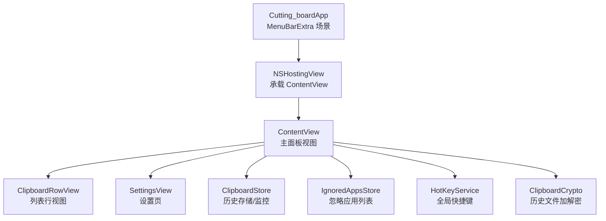
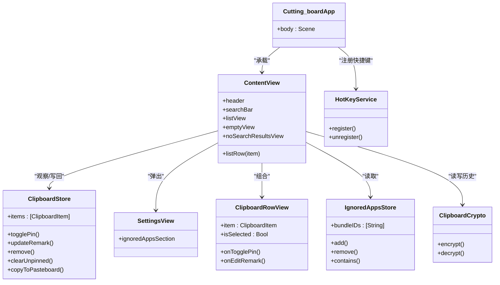
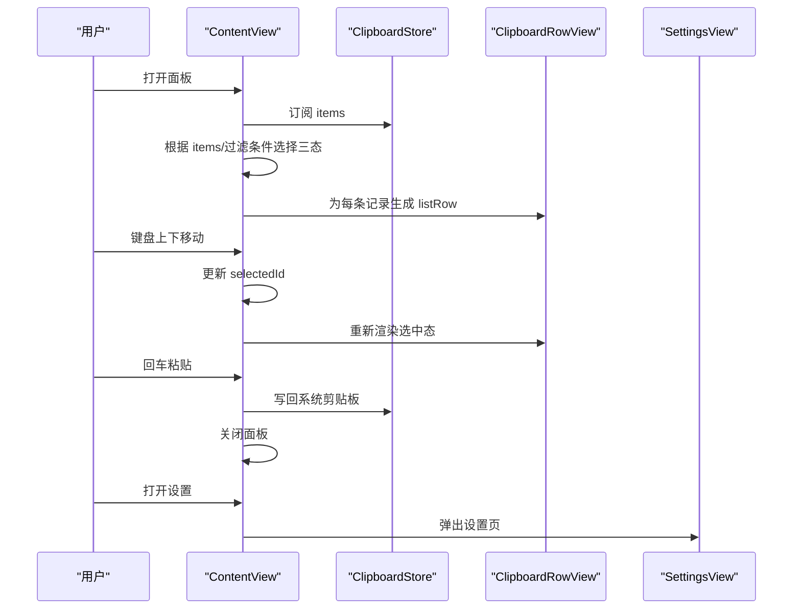
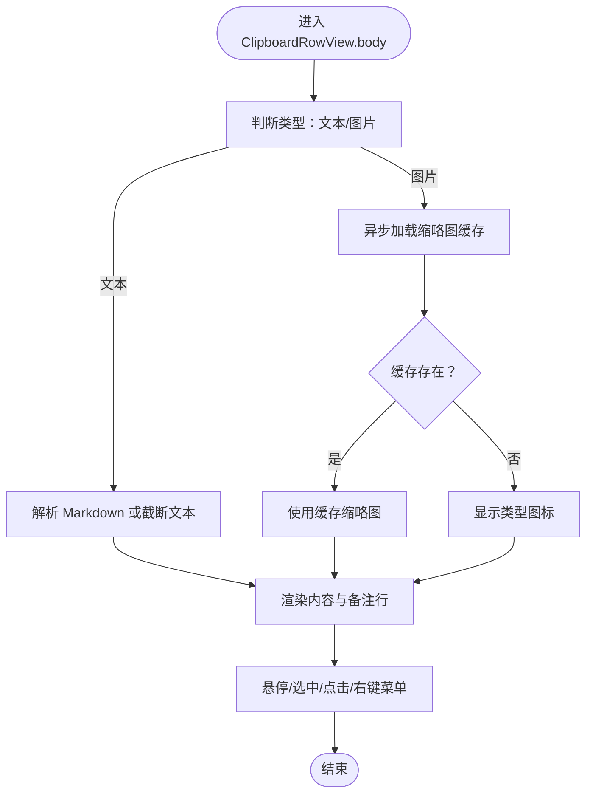
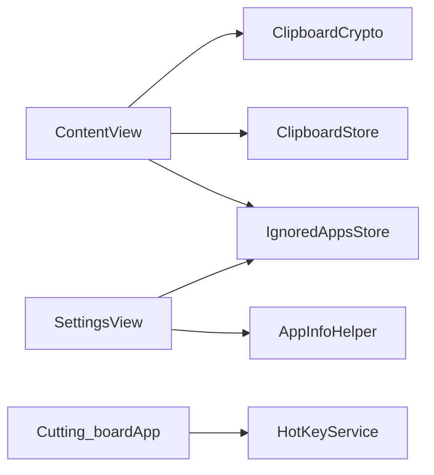

# 视图结构与组合模式

<cite>
**本文引用的文件**
- [ContentView.swift](file://Cutting_board/ContentView.swift)
- [Cutting_boardApp.swift](file://Cutting_board/Cutting_boardApp.swift)
- [SettingsView.swift](file://Cutting_board/SettingsView.swift)
- [ClipboardItem.swift](file://Cutting_board/Models/ClipboardItem.swift)
- [ClipboardStore.swift](file://Cutting_board/Services/ClipboardStore.swift)
- [IgnoredAppsStore.swift](file://Cutting_board/Services/IgnoredAppsStore.swift)
- [HotKeyService.swift](file://Cutting_board/Services/HotKeyService.swift)
- [ClipboardCrypto.swift](file://Cutting_board/Services/ClipboardCrypto.swift)
- [view-structure.md](file://.agents/skills/swiftui-expert-skill/references/view-structure.md)
- [performance-patterns.md](file://.agents/skills/swiftui-expert-skill/references/performance-patterns.md)
</cite>

## 目录
1. [引言](#引言)
2. [项目结构](#项目结构)
3. [核心组件](#核心组件)
4. [架构总览](#架构总览)
5. [详细组件分析](#详细组件分析)
6. [依赖关系分析](#依赖关系分析)
7. [性能考量](#性能考量)
8. [故障排查指南](#故障排查指南)
9. [结论](#结论)
10. [附录](#附录)

## 引言
本文件围绕 SwiftUI 视图结构与组合模式展开，结合项目中的实际实现，系统阐述：
- 视图提取原则与容器视图设计模式
- @ViewBuilder 的正确使用方式
- 视图组合最佳实践：何时提取子视图、如何保持视图轻量化、修饰符 vs 条件视图的选择策略
- 复杂视图的重构案例：层次优化、性能提升与可维护性改进
- 视图标识一致性与状态变化处理

## 项目结构
该项目采用“按职责分层”的组织方式：
- 应用入口与场景管理：Cutting_boardApp.swift
- 主界面与交互：ContentView.swift
- 设置页：SettingsView.swift
- 数据模型：ClipboardItem.swift
- 业务服务：ClipboardStore.swift、IgnoredAppsStore.swift、HotKeyService.swift、ClipboardCrypto.swift

图表来源
- [Cutting_boardApp.swift](file://Cutting_board/Cutting_boardApp.swift#L15-L31)
- [ContentView.swift](file://Cutting_board/ContentView.swift#L20-L95)
- [SettingsView.swift](file://Cutting_board/SettingsView.swift#L11-L39)
- [ClipboardStore.swift](file://Cutting_board/Services/ClipboardStore.swift#L14-L39)
- [IgnoredAppsStore.swift](file://Cutting_board/Services/IgnoredAppsStore.swift#L16-L40)
- [HotKeyService.swift](file://Cutting_board/Services/HotKeyService.swift#L30-L81)
- [ClipboardCrypto.swift](file://Cutting_board/Services/ClipboardCrypto.swift#L16-L46)

章节来源
- [Cutting_boardApp.swift](file://Cutting_board/Cutting_boardApp.swift#L15-L31)
- [ContentView.swift](file://Cutting_board/ContentView.swift#L20-L95)
- [SettingsView.swift](file://Cutting_board/SettingsView.swift#L11-L39)

## 核心组件
- 主面板视图 ContentView：负责头部、搜索、空态/无结果/列表三种状态的切换与动画过渡；通过 ScrollViewReader 实现键盘导航与滚动定位；通过 @ViewBuilder 提供列表行视图。
- 列表行视图 ClipboardRowView：单条历史记录的渲染与交互，包含悬停高亮、选中阴影、缩略图缓存、备注与钉住按钮等。
- 设置页 SettingsView：展示忽略的应用列表，支持增删与应用信息查询。
- 业务服务：
  - ClipboardStore：剪贴板监控、历史存储、排序与清理、写回系统剪贴板。
  - IgnoredAppsStore：忽略应用列表的持久化与查询。
  - HotKeyService：全局快捷键注册与事件转发。
  - ClipboardCrypto：历史文件加解密，Keychain 密钥管理。

章节来源
- [ContentView.swift](file://Cutting_board/ContentView.swift#L20-L305)
- [ClipboardRowView.swift](file://Cutting_board/ContentView.swift#L321-L471)
- [SettingsView.swift](file://Cutting_board/SettingsView.swift#L11-L89)
- [ClipboardStore.swift](file://Cutting_board/Services/ClipboardStore.swift#L14-L222)
- [IgnoredAppsStore.swift](file://Cutting_board/Services/IgnoredAppsStore.swift#L16-L40)
- [HotKeyService.swift](file://Cutting_board/Services/HotKeyService.swift#L30-L81)
- [ClipboardCrypto.swift](file://Cutting_board/Services/ClipboardCrypto.swift#L16-L72)

## 架构总览
整体采用“视图-服务”分层：
- 视图层：ContentView、SettingsView、ClipboardRowView
- 服务层：ClipboardStore、IgnoredAppsStore、HotKeyService、ClipboardCrypto
- 应用层：Cutting_boardApp 通过 NSHostingView 承载并管理窗口生命周期

图表来源
- [Cutting_boardApp.swift](file://Cutting_board/Cutting_boardApp.swift#L12-L31)
- [ContentView.swift](file://Cutting_board/ContentView.swift#L20-L305)
- [SettingsView.swift](file://Cutting_board/SettingsView.swift#L11-L89)
- [ClipboardStore.swift](file://Cutting_board/Services/ClipboardStore.swift#L14-L222)
- [IgnoredAppsStore.swift](file://Cutting_board/Services/IgnoredAppsStore.swift#L16-L40)
- [HotKeyService.swift](file://Cutting_board/Services/HotKeyService.swift#L30-L81)
- [ClipboardCrypto.swift](file://Cutting_board/Services/ClipboardCrypto.swift#L16-L72)

## 详细组件分析

### 组件一：主面板视图 ContentView
- 结构与职责
  - 顶部标题栏：显示数量、设置入口、清空按钮
  - 搜索栏：支持清空、无障碍提示
  - 内容区：根据 store.items 与过滤条件三态切换（空、无结果、列表）
  - 列表：LazyVStack + ScrollViewReader，支持键盘上下移动与回车粘贴
  - 弹窗：备注编辑与设置页
- 关键设计点
  - 使用 .id(...) 与 .animation(...) 保证三态切换时的过渡动画与标识一致性
  - 使用 .equatable() 与自定义等值比较避免行视图重绘
  - 使用 @ViewBuilder 提供 listRow，将复杂行逻辑封装为独立函数
  - 使用 .sheet(...) 与 .onChange(...) 管理状态与键盘事件
- 性能与可维护性
  - 通过 LazyVStack 降低列表渲染成本
  - 通过 .id(...) 与 .animation(...) 保证动画与标识稳定
  - 通过拆分子视图（如 emptyView/noSearchResultsView/listView）提升可读性

图表来源
- [ContentView.swift](file://Cutting_board/ContentView.swift#L37-L95)
- [ContentView.swift](file://Cutting_board/ContentView.swift#L184-L235)
- [ClipboardStore.swift](file://Cutting_board/Services/ClipboardStore.swift#L118-L179)

章节来源
- [ContentView.swift](file://Cutting_board/ContentView.swift#L20-L305)

### 组件二：列表行视图 ClipboardRowView
- 结构与职责
  - 左侧：缩略图缓存或类型图标
  - 中部：内容预览（文本支持 Markdown）、备注行、时间描述
  - 右侧：备注按钮、钉住按钮
  - 交互：悬停高亮、选中阴影、点击/双击、右键菜单
- 关键设计点
  - 自定义 Equatable，基于 id、isSelected、remark、isPinned 判断相等
  - 使用 .task(id: item.id) 进行缩略图异步缓存
  - 使用 @ViewBuilder 提供 rowBackground，根据选中/悬停状态动态装饰
  - 使用 .compositingGroup() 优化视觉合成
- 性能与可维护性
  - 通过 .equatable() 与 .task(id:) 控制重绘与异步任务
  - 将背景装饰逻辑拆分为独立视图，保持主体结构清晰

图表来源
- [ClipboardRowView.swift](file://Cutting_board/ContentView.swift#L321-L471)

章节来源
- [ClipboardRowView.swift](file://Cutting_board/ContentView.swift#L321-L471)

### 组件三：设置页 SettingsView
- 结构与职责
  - 顶部标题与完成按钮
  - 忽略应用列表：应用图标、名称、移除按钮
  - 添加应用：打开系统选择器并写入忽略列表
- 关键设计点
  - 使用 Glass 效果与圆角边框提升可读性
  - 通过 AppInfoHelper 查询应用图标与名称
  - 使用 .glassEffect(...) 与 .overlay(...) 实现装饰性边框

章节来源
- [SettingsView.swift](file://Cutting_board/SettingsView.swift#L11-L89)

### 组件四：业务服务层
- ClipboardStore
  - 监控系统剪贴板变化，去重与去空，按钉住优先排序
  - 支持更新备注、钉住/取消、删除、清空未钉住、写回系统剪贴板
  - 历史持久化与加密存储
- IgnoredAppsStore
  - 忽略应用列表的持久化与查询
- HotKeyService
  - 使用 Carbon API 注册全局快捷键，跨应用可用
- ClipboardCrypto
  - AES-GCM 加密与 Keychain 密钥管理，兼容旧版明文

章节来源
- [ClipboardStore.swift](file://Cutting_board/Services/ClipboardStore.swift#L14-L222)
- [IgnoredAppsStore.swift](file://Cutting_board/Services/IgnoredAppsStore.swift#L16-L40)
- [HotKeyService.swift](file://Cutting_board/Services/HotKeyService.swift#L30-L81)
- [ClipboardCrypto.swift](file://Cutting_board/Services/ClipboardCrypto.swift#L16-L72)

## 依赖关系分析
- 视图与服务
  - ContentView 依赖 ClipboardStore（观察 items）、IgnoredAppsStore（读取忽略列表）、HotKeyService（注册快捷键）、ClipboardCrypto（读写历史）
  - SettingsView 依赖 IgnoredAppsStore 与 AppInfoHelper
- 状态传播
  - ClipboardStore 通过 @Published 暴露 items，ContentView 作为观察者进行筛选与渲染
  - 状态变更通过通知中心驱动面板显示/隐藏/切换
- 循环依赖
  - 未发现循环依赖，各模块职责清晰

图表来源
- [ContentView.swift](file://Cutting_board/ContentView.swift#L20-L305)
- [SettingsView.swift](file://Cutting_board/SettingsView.swift#L11-L89)
- [ClipboardStore.swift](file://Cutting_board/Services/ClipboardStore.swift#L14-L222)
- [IgnoredAppsStore.swift](file://Cutting_board/Services/IgnoredAppsStore.swift#L16-L40)
- [HotKeyService.swift](file://Cutting_board/Services/HotKeyService.swift#L30-L81)
- [ClipboardCrypto.swift](file://Cutting_board/Services/ClipboardCrypto.swift#L16-L72)

章节来源
- [ContentView.swift](file://Cutting_board/ContentView.swift#L20-L305)
- [SettingsView.swift](file://Cutting_board/SettingsView.swift#L11-L89)

## 性能考量
- 视图拆分与等值比较
  - ClipboardRowView 实现 Equatable，减少不必要的重绘
  - 使用 @ViewBuilder 封装复杂行逻辑，避免在父视图中重复执行
- 容器与修饰符
  - 使用 overlay/background 装饰而非 ZStack，避免布局尺寸影响
  - 使用 opacity 修饰符替代条件视图，保持视图身份一致
- 列表优化
  - 使用 LazyVStack 与 .id(...) 优化滚动与重排
  - 通过 .animation(...) 与 .transition(...) 控制动画，避免过度重绘
- 异步与任务
  - 使用 .task(id:) 缓存缩略图，避免主线程阻塞
  - 通过队列与异步 I/O 降低磁盘读写对 UI 的影响
- 参考最佳实践
  - 避免在 body 中创建对象与执行重计算
  - 传递最小必要数据，缩小依赖范围
  - 使用 Self._printChanges() 调试更新来源

章节来源
- [view-structure.md](file://.agents/skills/swiftui-expert-skill/references/view-structure.md#L7-L42)
- [performance-patterns.md](file://.agents/skills/swiftui-expert-skill/references/performance-patterns.md#L82-L156)
- [performance-patterns.md](file://.agents/skills/swiftui-expert-skill/references/performance-patterns.md#L273-L378)

## 故障排查指南
- 动画与过渡异常
  - 确认三态切换使用 .id(...) 与 .animation(...) 显式绑定标识与动画
  - 检查 reduceMotion 环境变量是否禁用了动画
- 列表滚动与选中态错乱
  - 确保 selectedId 与 filteredItems 保持一致，onChange 中修正越界
  - 使用 ScrollViewReader 的 scrollTo 并配合 Transaction 控制动画
- 键盘事件无效
  - 确认面板已激活并获得第一响应者（通过 AppDelegate 查找 NSTableView）
  - 检查快捷键注册是否成功（HotKeyService）
- 历史无法读取或为空
  - 检查 ClipboardCrypto 的解密流程与 Keychain 密钥
  - 确认 IgnoredAppsStore 是否误判了前台应用
- 性能问题
  - 使用 Self._printChanges() 定位更新来源
  - 检查是否存在在 body 中创建对象或重计算的逻辑

章节来源
- [ContentView.swift](file://Cutting_board/ContentView.swift#L51-L95)
- [ContentView.swift](file://Cutting_board/ContentView.swift#L196-L207)
- [Cutting_boardApp.swift](file://Cutting_board/Cutting_boardApp.swift#L100-L142)
- [HotKeyService.swift](file://Cutting_board/Services/HotKeyService.swift#L36-L81)
- [ClipboardCrypto.swift](file://Cutting_board/Services/ClipboardCrypto.swift#L38-L46)
- [performance-patterns.md](file://.agents/skills/swiftui-expert-skill/references/performance-patterns.md#L201-L222)

## 结论
本项目在 SwiftUI 视图结构与组合方面体现了良好的工程实践：
- 通过 @ViewBuilder 与子视图拆分，实现了清晰的职责划分与可维护性
- 使用修饰符与容器装饰替代条件视图，提升了动画稳定性与性能
- 通过等值比较与懒加载，有效降低了重绘与渲染成本
- 服务层与视图层分离，状态流清晰，便于扩展与测试

建议持续关注：
- 进一步细化状态域，减少跨视图的宽依赖
- 在复杂列表中引入 POD 包装视图以加速 diff
- 使用更细粒度的任务与队列策略优化 I/O

## 附录
- 视图提取与容器模式参考
  - [view-structure.md](file://.agents/skills/swiftui-expert-skill/references/view-structure.md#L44-L113)
  - [view-structure.md](file://.agents/skills/swiftui-expert-skill/references/view-structure.md#L157-L201)
- 性能模式参考
  - [performance-patterns.md](file://.agents/skills/swiftui-expert-skill/references/performance-patterns.md#L1-L378)