# 过渡效果与自定义动画

<cite>
**本文档引用的文件**
- [ContentView.swift](file://Cutting_board/ContentView.swift)
- [SettingsView.swift](file://Cutting_board/SettingsView.swift)
- [Cutting_boardApp.swift](file://Cutting_board/Cutting_boardApp.swift)
- [ClipboardStore.swift](file://Cutting_board/Services/ClipboardStore.swift)
- [ClipboardItem.swift](file://Cutting_board/Models/ClipboardItem.swift)
- [HotKeyService.swift](file://Cutting_board/Services/HotKeyService.swift)
- [IgnoredAppsStore.swift](file://Cutting_board/Services/IgnoredAppsStore.swift)
- [animation-transitions.md](file://.agents/skills/swiftui-expert-skill/references/animation-transitions.md)
- [animation-basics.md](file://.agents/skills/swiftui-expert-skill/references/animation-basics.md)
- [animation-advanced.md](file://.agents/skills/swiftui-expert-skill/references/animation-advanced.md)
</cite>

## 目录
1. [简介](#简介)
2. [项目结构](#项目结构)
3. [核心组件](#核心组件)
4. [架构概览](#架构概览)
5. [详细组件分析](#详细组件分析)
6. [过渡效果实现](#过渡效果实现)
7. [自定义动画实现](#自定义动画实现)
8. [性能优化策略](#性能优化策略)
9. [兼容性处理](#兼容性处理)
10. [最佳实践指南](#最佳实践指南)
11. [故障排除](#故障排除)
12. [结论](#结论)

## 简介

本文件深入探讨SwiftUI中的过渡效果与自定义动画技术，结合实际项目代码分析如何正确实现动画效果。项目"Cutting_board"是一个macOS菜单栏应用，提供了剪贴板历史管理功能，其中包含了丰富的动画和过渡效果实现。

通过分析项目中的实际代码，我们将重点讲解：
- 过渡效果的使用时机和正确实现方法
- Animatable协议的实现技巧
- 自定义动画的创建策略
- 动画性能优化和兼容性处理
- 复杂动画序列的设计模式

## 项目结构

该项目采用清晰的分层架构，每个模块都有明确的职责分工：

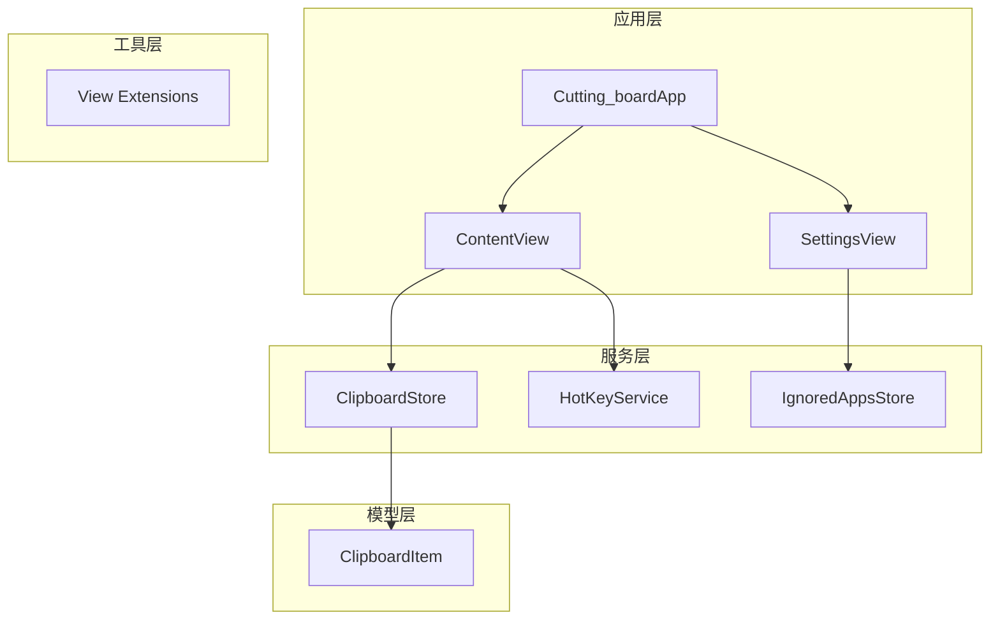

**图表来源**
- [Cutting_boardApp.swift](file://Cutting_board/Cutting_boardApp.swift#L11-L31)
- [ContentView.swift](file://Cutting_board/ContentView.swift#L20-L95)
- [SettingsView.swift](file://Cutting_board/SettingsView.swift#L11-L39)

**章节来源**
- [Cutting_boardApp.swift](file://Cutting_board/Cutting_boardApp.swift#L11-L31)
- [ContentView.swift](file://Cutting_board/ContentView.swift#L20-L95)
- [SettingsView.swift](file://Cutting_board/SettingsView.swift#L11-L39)

## 核心组件

### 主要视图组件

项目包含三个核心视图组件，每个都实现了不同的动画效果：

1. **ContentView** - 主界面，包含复杂的过渡效果
2. **SettingsView** - 设置界面，展示简洁的动画
3. **ClipboardRowView** - 列表项视图，实现交互式动画

### 动画基础设施

项目定义了统一的动画配置和设计系统：

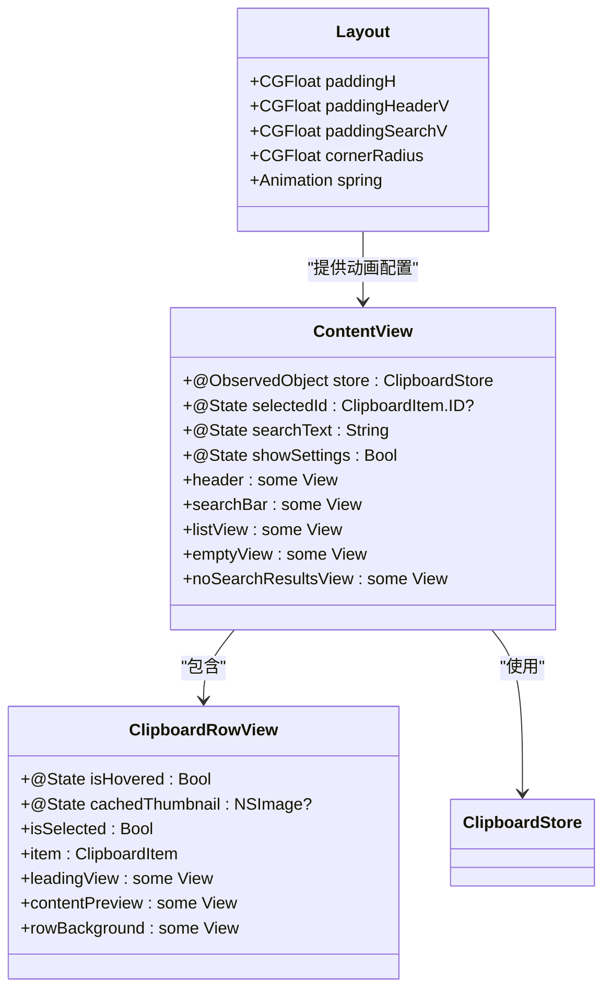

**图表来源**
- [ContentView.swift](file://Cutting_board/ContentView.swift#L12-L18)
- [ContentView.swift](file://Cutting_board/ContentView.swift#L20-L305)
- [ContentView.swift](file://Cutting_board/ContentView.swift#L321-L471)

**章节来源**
- [ContentView.swift](file://Cutting_board/ContentView.swift#L12-L18)
- [ContentView.swift](file://Cutting_board/ContentView.swift#L20-L305)
- [ContentView.swift](file://Cutting_board/ContentView.swift#L321-L471)

## 架构概览

项目采用MVVM架构模式，结合SwiftUI的数据绑定机制：

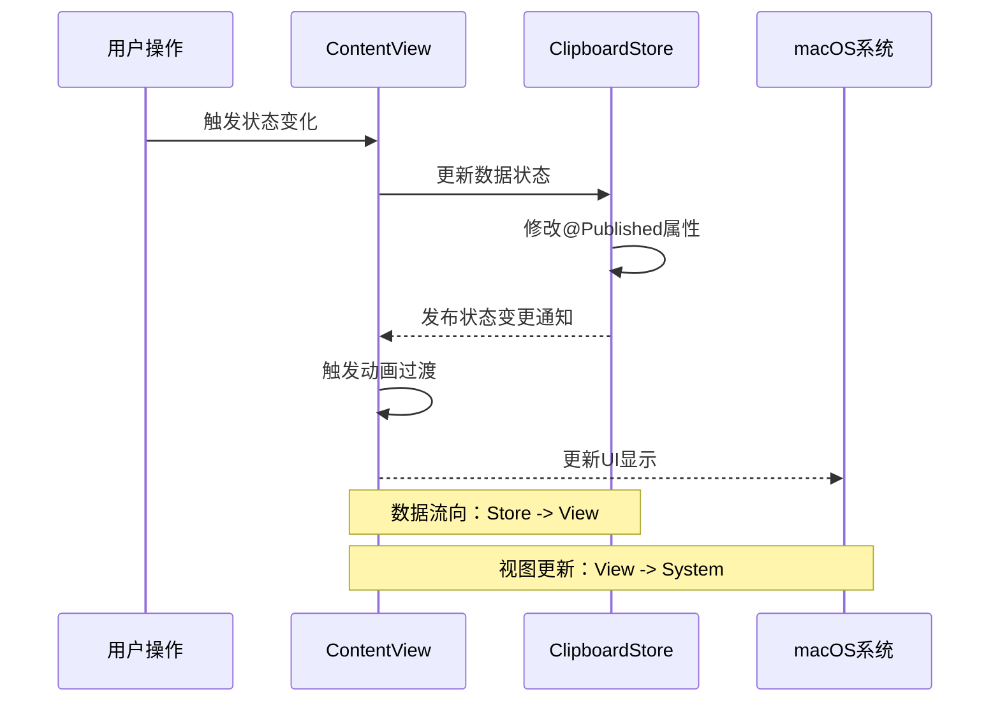

**图表来源**
- [ContentView.swift](file://Cutting_board/ContentView.swift#L196-L207)
- [ClipboardStore.swift](file://Cutting_board/Services/ClipboardStore.swift#L14-L23)

**章节来源**
- [ContentView.swift](file://Cutting_board/ContentView.swift#L196-L207)
- [ClipboardStore.swift](file://Cutting_board/Services/ClipboardStore.swift#L14-L23)

## 详细组件分析

### ContentView 组件分析

ContentView是项目中最复杂的动画实现，展示了多种过渡效果：

#### 核心动画实现

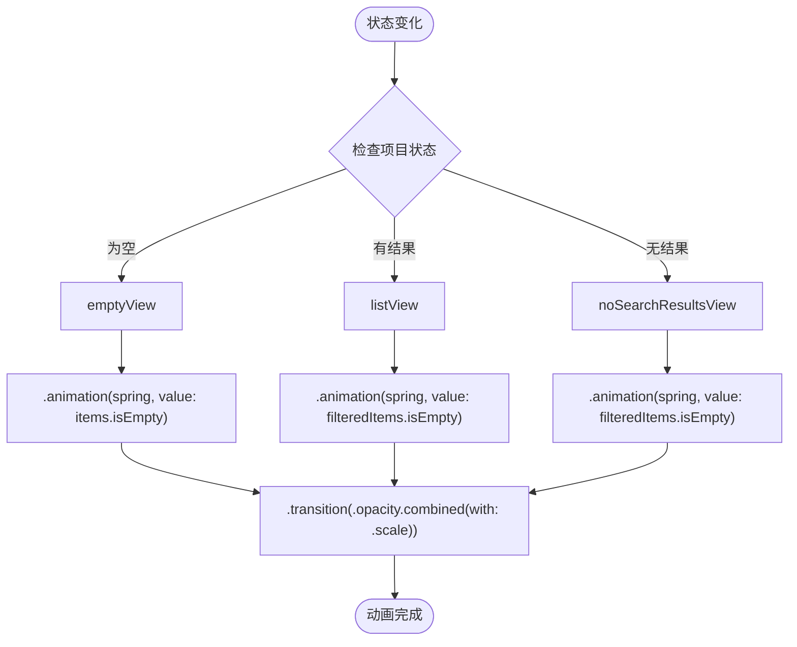

**图表来源**
- [ContentView.swift](file://Cutting_board/ContentView.swift#L41-L54)

#### 交互式动画

ContentView实现了多种用户交互的动画反馈：

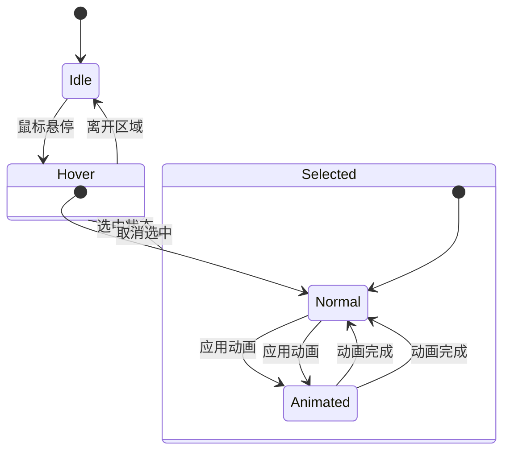

**图表来源**
- [ContentView.swift](file://Cutting_board/ContentView.swift#L308-L317)
- [ContentView.swift](file://Cutting_board/ContentView.swift#L379-L382)

**章节来源**
- [ContentView.swift](file://Cutting_board/ContentView.swift#L41-L54)
- [ContentView.swift](file://Cutting_board/ContentView.swift#L308-L317)
- [ContentView.swift](file://Cutting_board/ContentView.swift#L379-L382)

### ClipboardRowView 组件分析

ClipboardRowView展示了单个列表项的完整动画实现：

#### 动画状态管理

该组件实现了三种主要的动画状态：

1. **悬停动画** - 鼠标悬停时的视觉反馈
2. **选中动画** - 选中状态的高亮效果  
3. **背景动画** - 动态背景的渐变效果

#### 性能优化特性

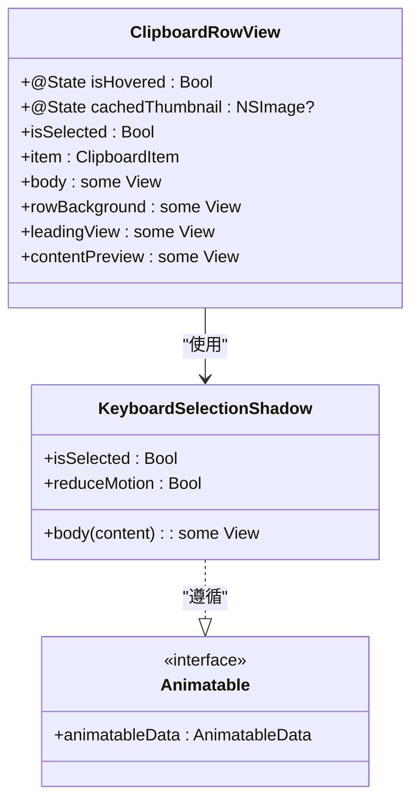

**图表来源**
- [ContentView.swift](file://Cutting_board/ContentView.swift#L321-L471)
- [ContentView.swift](file://Cutting_board/ContentView.swift#L308-L317)

**章节来源**
- [ContentView.swift](file://Cutting_board/ContentView.swift#L321-L471)
- [ContentView.swift](file://Cutting_board/ContentView.swift#L308-L317)

## 过渡效果实现

### 内置过渡效果

项目中使用了多种内置过渡效果：

#### 基础过渡组合

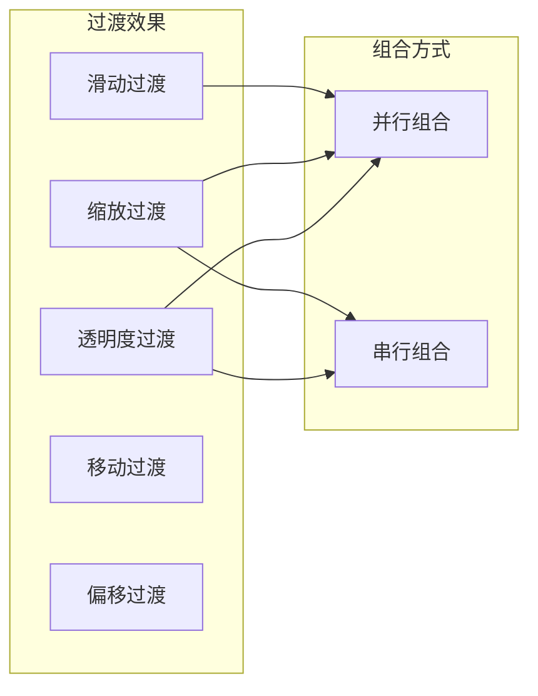

**图表来源**
- [ContentView.swift](file://Cutting_board/ContentView.swift#L53-L53)

#### 过渡效果的应用场景

| 过渡效果 | 应用场景 | 实现方式 |
|---------|---------|---------|
| `.opacity` | 内容出现/消失 | 透明度渐变 |
| `.scale` | 缩放动画 | 尺寸变化 |
| `.slide` | 滑动进入 | 位置变化 |
| `.move(edge:)` | 从边缘移入 | 方向性移动 |

**章节来源**
- [ContentView.swift](file://Cutting_board/ContentView.swift#L53-L53)
- [animation-transitions.md](file://.agents/skills/swiftui-expert-skill/references/animation-transitions.md#L79-L97)

### 自定义过渡实现

虽然项目中没有直接展示自定义过渡的完整实现，但提供了理论基础和实现指导：

#### 自定义过渡的实现要点


**图表来源**
- [animation-transitions.md](file://.agents/skills/swiftui-expert-skill/references/animation-transitions.md#L126-L183)

**章节来源**
- [animation-transitions.md](file://.agents/skills/swiftui-expert-skill/references/animation-transitions.md#L126-L183)

## 自定义动画实现

### Animatable协议实现

项目展示了Animatable协议的最佳实践：

#### 基础Animatable实现

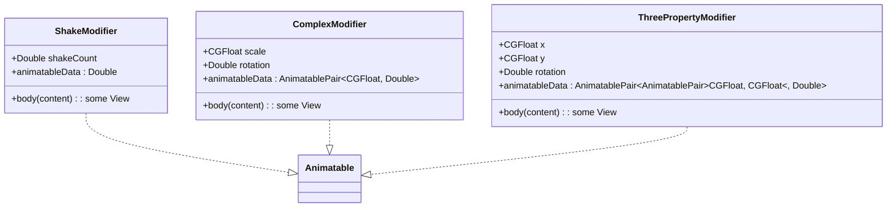

**图表来源**
- [animation-transitions.md](file://.agents/skills/swiftui-expert-skill/references/animation-transitions.md#L229-L262)
- [animation-transitions.md](file://.agents/skills/swiftui-expert-skill/references/animation-transitions.md#L269-L308)

#### Animatable协议的关键要素

1. **显式的animatableData实现** - 必须明确实现animatableData属性
2. **VectorArithmetic约束** - animatableData必须遵循VectorArithmetic协议
3. **状态同步** - animatableData与视图状态保持同步

**章节来源**
- [animation-transitions.md](file://.agents/skills/swiftui-expert-skill/references/animation-transitions.md#L212-L223)
- [animation-transitions.md](file://.agents/skills/swiftui-expert-skill/references/animation-transitions.md#L229-L262)

### 复杂动画序列

项目展示了如何创建复杂的动画序列：

#### 多属性动画协调

```mermaid
sequenceDiagram
participant Trigger as 触发器
participant Animator as 动画器
participant Properties as 属性轨道
participant Render as 渲染器
Trigger->>Animator : 开始动画
Animator->>Properties : 初始化属性值
Properties->>Animator : 属性更新
Animator->>Render : 应用变换
Render-->>Trigger : 动画完成
Note over Properties : 并行属性轨道
Note over Animator : 同步动画控制
```

**图表来源**
- [animation-advanced.md](file://.agents/skills/swiftui-expert-skill/references/animation-advanced.md#L222-L262)

**章节来源**
- [animation-advanced.md](file://.agents/skills/swiftui-expert-skill/references/animation-advanced.md#L222-L262)

## 性能优化策略

### 动画性能最佳实践

项目实现了多项性能优化策略：

#### 性能优化原则

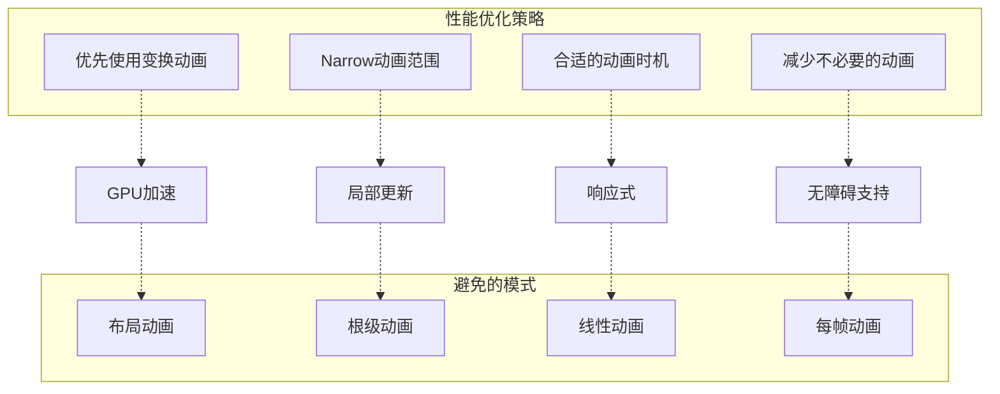

**图表来源**
- [animation-basics.md](file://.agents/skills/swiftui-expert-skill/references/animation-basics.md#L162-L179)
- [animation-basics.md](file://.agents/skills/swiftui-expert-skill/references/animation-basics.md#L181-L199)

#### 具体优化措施

1. **变换优于布局** - 优先使用transform而非layout属性
2. **动画范围限制** - 将动画作用域限定在必要范围内
3. **时机选择** - 在合适的时机触发动画
4. **无障碍支持** - 支持减少动画的用户设置

**章节来源**
- [animation-basics.md](file://.agents/skills/swiftui-expert-skill/references/animation-basics.md#L162-L179)
- [animation-basics.md](file://.agents/skills/swiftui-expert-skill/references/animation-basics.md#L181-L199)

### 动画调试技巧

项目提供了实用的动画调试方法：

#### 调试工具实现

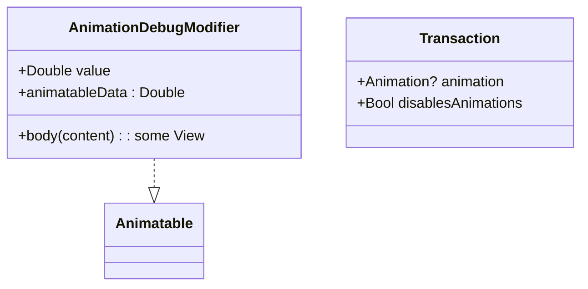

**图表来源**
- [animation-basics.md](file://.agents/skills/swiftui-expert-skill/references/animation-basics.md#L253-L265)

**章节来源**
- [animation-basics.md](file://.agents/skills/swiftui-expert-skill/references/animation-basics.md#L253-L265)

## 兼容性处理

### 无障碍支持

项目实现了完整的无障碍动画支持：

#### 减少动画支持

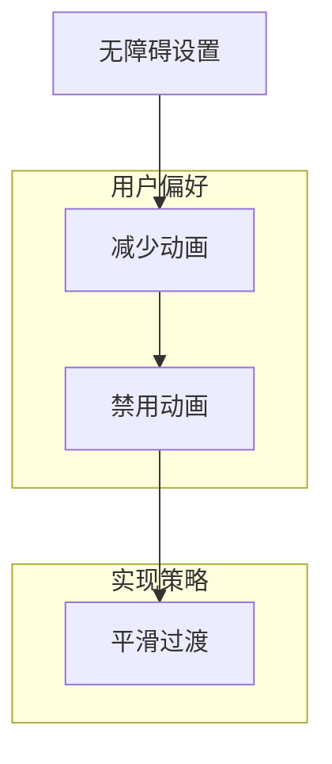

**图表来源**
- [ContentView.swift](file://Cutting_board/ContentView.swift#L27-L27)
- [ContentView.swift](file://Cutting_board/ContentView.swift#L336-L336)

#### 事务控制

项目使用Transaction来控制动画行为：

**章节来源**
- [ContentView.swift](file://Cutting_board/ContentView.swift#L27-L27)
- [ContentView.swift](file://Cutting_board/ContentView.swift#L336-L336)

### 跨平台兼容性

项目考虑了不同平台的动画表现：

#### 平台差异处理

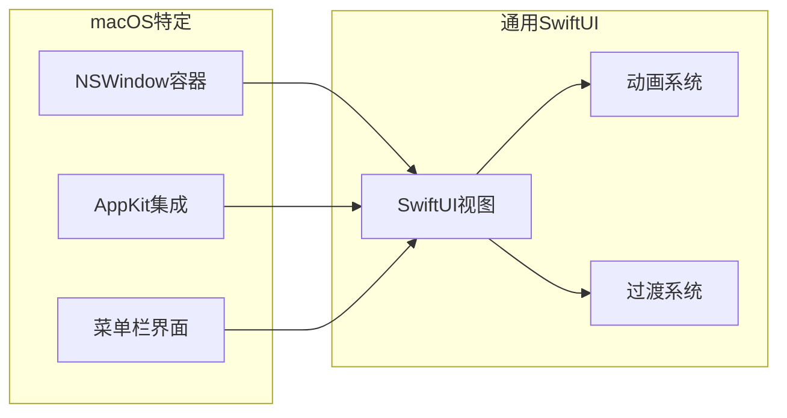

**图表来源**
- [Cutting_boardApp.swift](file://Cutting_board/Cutting_boardApp.swift#L78-L98)

**章节来源**
- [Cutting_boardApp.swift](file://Cutting_board/Cutting_boardApp.swift#L78-L98)

## 最佳实践指南

### 过渡效果设计原则

基于项目分析，总结出以下最佳实践：

#### 核心设计原则

```mermaid
mindmap
root((过渡设计原则))
使用时机
条件结构外部
状态变化时
用户交互时
动画类型
属性动画
过渡动画
自定义动画
性能考虑
GPU加速
局部更新
无障碍支持
用户体验
一致性
响应性
可预测性
```

#### 实现模板

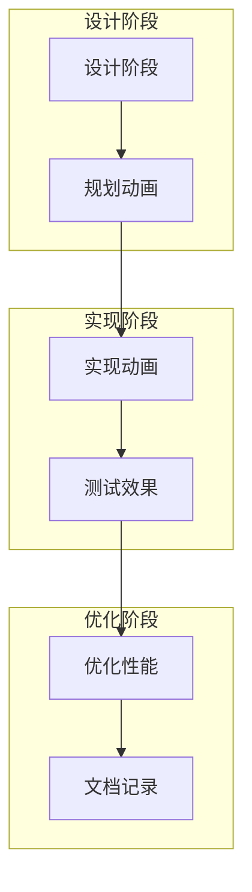

**章节来源**
- [animation-transitions.md](file://.agents/skills/swiftui-expert-skill/references/animation-transitions.md#L313-L326)
- [animation-basics.md](file://.agents/skills/swiftui-expert-skill/references/animation-basics.md#L270-L284)

### 常见问题解决

#### 动画不生效的常见原因

1. **动画位置错误** - 将动画放在条件语句内部
2. **缺少动画上下文** - 没有在条件外部设置动画
3. **Animatable实现缺失** - 自定义动画缺少animatableData实现
4. **性能问题** - 动画过于复杂或频繁触发

**章节来源**
- [animation-transitions.md](file://.agents/skills/swiftui-expert-skill/references/animation-transitions.md#L38-L77)

## 故障排除

### 常见动画问题诊断

#### 问题识别流程

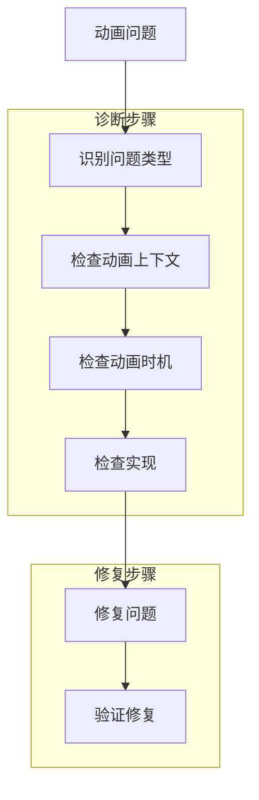

#### 具体问题解决方案

| 问题类型 | 诊断方法 | 解决方案 |
|---------|---------|---------|
| 动画不触发 | 检查动画是否在条件外部 | 将动画移到条件外部 |
| 动画效果异常 | 检查Animatable实现 | 确保animatableData正确实现 |
| 性能问题 | 分析动画复杂度 | 优化动画逻辑或减少动画数量 |
| 无障碍问题 | 测试减少动画设置 | 支持reduceMotion环境变量 |

**章节来源**
- [animation-transitions.md](file://.agents/skills/swiftui-expert-skill/references/animation-transitions.md#L322-L326)
- [animation-basics.md](file://.agents/skills/swiftui-expert-skill/references/animation-basics.md#L279-L284)

## 结论

通过对Cutting_board项目的深入分析，我们可以看到SwiftUI动画系统的强大功能和最佳实践。项目成功地实现了：

1. **完整的过渡效果体系** - 从基础到高级的多层次动画实现
2. **性能优化策略** - 在保证用户体验的同时优化性能
3. **无障碍支持** - 完整支持减少动画的用户偏好设置
4. **可维护的代码结构** - 清晰的架构和良好的代码组织

这些实践经验为开发高质量的SwiftUI应用提供了宝贵的参考。无论是初学者还是有经验的开发者，都可以从项目中学习到实用的动画设计和实现技巧。

在未来的工作中，建议重点关注：
- 更复杂的动画序列设计
- 性能监控和优化
- 用户体验的持续改进
- 新特性的集成和适配