# 高级动画与iOS 17+特性

<cite>
**本文档引用的文件**
- [ContentView.swift](file://Cutting_board/ContentView.swift)
- [Cutting_boardApp.swift](file://Cutting_board/Cutting_boardApp.swift)
- [SettingsView.swift](file://Cutting_board/SettingsView.swift)
- [ClipboardStore.swift](file://Cutting_board/Services/ClipboardStore.swift)
- [ClipboardItem.swift](file://Cutting_board/Models/ClipboardItem.swift)
- [HotKeyService.swift](file://Cutting_board/Services/HotKeyService.swift)
- [IgnoredAppsStore.swift](file://Cutting_board/Services/IgnoredAppsStore.swift)
- [ClipboardCrypto.swift](file://Cutting_board/Services/ClipboardCrypto.swift)
- [animation-advanced.md](file://.agents/skills/swiftui-expert-skill/references/animation-advanced.md)
- [animation-transitions.md](file://.agents/skills/swiftui-expert-skill/references/animation-transitions.md)
- [animation-basics.md](file://.agents/skills/swiftui-expert-skill/references/animation-basics.md)
</cite>

## 目录
1. [简介](#简介)
2. [项目结构](#项目结构)
3. [核心组件](#核心组件)
4. [架构概览](#架构概览)
5. [详细组件分析](#详细组件分析)
6. [高级动画实现](#高级动画实现)
7. [iOS 17+新特性](#ios-17-新特性)
8. [动画优先级与控制](#动画优先级与控制)
9. [性能优化策略](#性能优化策略)
10. [兼容性处理](#兼容性处理)
11. [故障排除指南](#故障排除指南)
12. [结论](#结论)

## 简介

本项目是一个基于SwiftUI的剪贴板管理应用，展示了现代iOS开发中的高级动画技术与iOS 17+新特性。项目实现了完整的剪贴板历史管理功能，包括实时监控、历史记录、搜索过滤、备注编辑等核心功能，同时集成了丰富的动画效果来提升用户体验。

该应用特别注重动画的流畅性和可访问性，通过事务系统、相位动画、关键帧动画等高级技术，为用户提供了直观而优雅的交互体验。项目还实现了全局快捷键支持、无障碍功能适配、以及跨平台的性能优化策略。

## 项目结构

项目采用模块化的SwiftUI架构设计，主要包含以下核心模块：

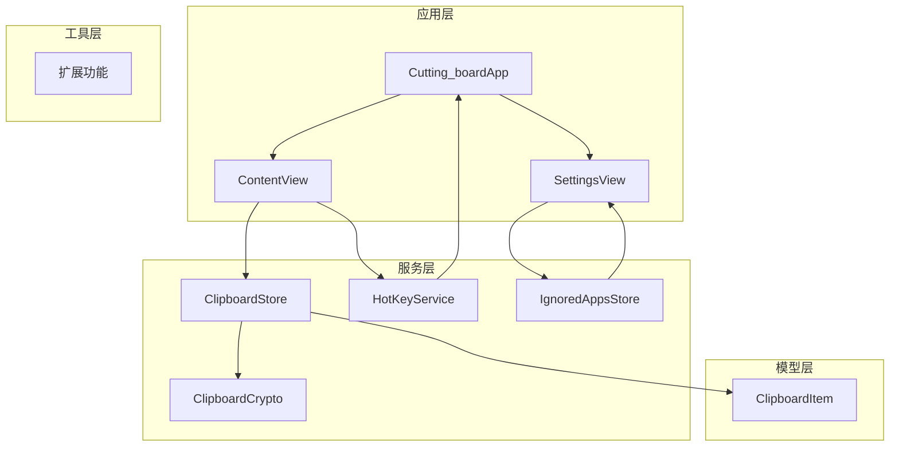
```mermaid
graph TB
subgraph "应用层"
App[Cutting_boardApp]
ContentView[ContentView]
SettingsView[SettingsView]
end
subgraph "服务层"
Store[ClipboardStore]
HotKey[HotKeyService]
IgnoredApps[IgnoredAppsStore]
Crypto[ClipboardCrypto]
end
subgraph "模型层"
Item[ClipboardItem]
end
subgraph "工具层"
Extensions[扩展功能]
end
App --> ContentView
App --> SettingsView
ContentView --> Store
ContentView --> HotKey
SettingsView --> IgnoredApps
Store --> Item
Store --> Crypto
HotKey --> App
IgnoredApps --> SettingsView
```

**图表来源**
- [Cutting_boardApp.swift](file://Cutting_board/Cutting_boardApp.swift#L12-L31)
- [ContentView.swift](file://Cutting_board/ContentView.swift#L20-L95)
- [SettingsView.swift](file://Cutting_board/SettingsView.swift#L11-L39)

**章节来源**
- [Cutting_boardApp.swift](file://Cutting_board/Cutting_boardApp.swift#L1-L144)
- [ContentView.swift](file://Cutting_board/ContentView.swift#L1-L500)

## 核心组件

### 主要视图组件

项目包含三个核心视图组件，每个都实现了不同的动画策略：

1. **ContentView**: 主界面，负责剪贴板历史的展示和管理
2. **SettingsView**: 设置界面，管理忽略的应用程序列表
3. **ClipboardRowView**: 列表项视图，实现行内动画效果

### 服务组件

1. **ClipboardStore**: 剪贴板历史存储和监控服务
2. **HotKeyService**: 全局快捷键服务
3. **IgnoredAppsStore**: 忽略应用程序列表管理
4. **ClipboardCrypto**: 历史数据加密服务

**章节来源**
- [ContentView.swift](file://Cutting_board/ContentView.swift#L20-L305)
- [SettingsView.swift](file://Cutting_board/SettingsView.swift#L11-L89)
- [ClipboardStore.swift](file://Cutting_board/Services/ClipboardStore.swift#L14-L223)

## 架构概览

应用采用MVVM架构模式，结合SwiftUI的声明式编程特性：

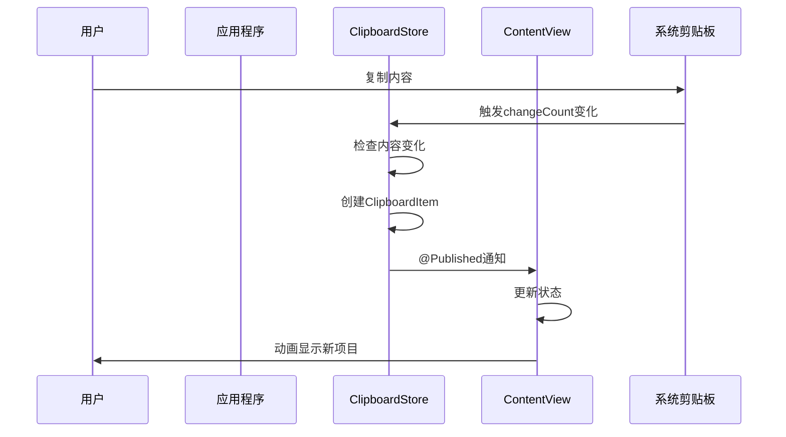
```mermaid
sequenceDiagram
participant User as 用户
participant App as 应用程序
participant Store as ClipboardStore
participant View as ContentView
participant System as 系统剪贴板
User->>System : 复制内容
System->>Store : 触发changeCount变化
Store->>Store : 检查内容变化
Store->>Store : 创建ClipboardItem
Store->>View : @Published通知
View->>View : 更新状态
View->>User : 动画显示新项目
```

**图表来源**
- [ClipboardStore.swift](file://Cutting_board/Services/ClipboardStore.swift#L47-L90)
- [ContentView.swift](file://Cutting_board/ContentView.swift#L196-L207)

**章节来源**
- [ClipboardStore.swift](file://Cutting_board/Services/ClipboardStore.swift#L1-L223)
- [HotKeyService.swift](file://Cutting_board/Services/HotKeyService.swift#L30-L82)

## 详细组件分析

### ContentView 组件分析

ContentView是应用的核心界面，实现了多种动画效果：

#### 动画配置

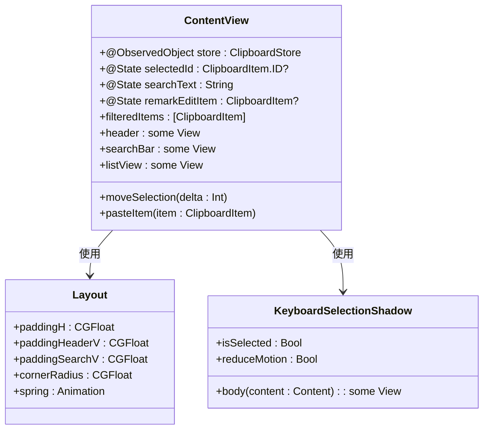
```mermaid
classDiagram
class ContentView {
+@ObservedObject store : ClipboardStore
+@State selectedId : ClipboardItem.ID?
+@State searchText : String
+@State remarkEditItem : ClipboardItem?
+filteredItems : [ClipboardItem]
+header : some View
+searchBar : some View
+listView : some View
+moveSelection(delta : Int)
+pasteItem(item : ClipboardItem)
}
class Layout {
+paddingH : CGFloat
+paddingHeaderV : CGFloat
+paddingSearchV : CGFloat
+cornerRadius : CGFloat
+spring : Animation
}
class KeyboardSelectionShadow {
+isSelected : Bool
+reduceMotion : Bool
+body(content : Content) : some View
}
ContentView --> Layout : 使用
ContentView --> KeyboardSelectionShadow : 使用
```

**图表来源**
- [ContentView.swift](file://Cutting_board/ContentView.swift#L12-L18)
- [ContentView.swift](file://Cutting_board/ContentView.swift#L20-L305)
- [ContentView.swift](file://Cutting_board/ContentView.swift#L308-L317)

#### 关键动画实现

1. **条件动画**: 使用`.animation(reduceMotion ? nil : Layout.spring, value: ...)`实现无障碍适配
2. **过渡动画**: 使用`.transition(.opacity.combined(with: .scale(scale: 0.98)))`实现视图切换
3. **滚动动画**: 使用`withTransaction(Transaction(animation: nil))`实现无动画滚动

**章节来源**
- [ContentView.swift](file://Cutting_board/ContentView.swift#L17-L53)
- [ContentView.swift](file://Cutting_board/ContentView.swift#L196-L199)

### ClipboardRowView 组件分析

ClipboardRowView实现了复杂的行内动画效果：

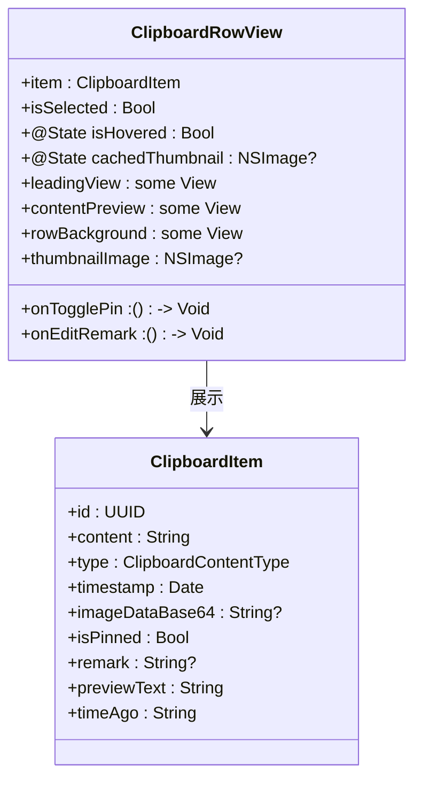
```mermaid
classDiagram
class ClipboardRowView {
+item : ClipboardItem
+isSelected : Bool
+onTogglePin : () -> Void
+onEditRemark : () -> Void
+@State isHovered : Bool
+@State cachedThumbnail : NSImage?
+leadingView : some View
+contentPreview : some View
+rowBackground : some View
+thumbnailImage : NSImage?
}
class ClipboardItem {
+id : UUID
+content : String
+type : ClipboardContentType
+timestamp : Date
+imageDataBase64 : String?
+isPinned : Bool
+remark : String?
+previewText : String
+timeAgo : String
}
ClipboardRowView --> ClipboardItem : 展示
```

**图表来源**
- [ClipboardRowView.swift](file://Cutting_board/ContentView.swift#L321-L471)
- [ClipboardItem.swift](file://Cutting_board/Models/ClipboardItem.swift#L17-L89)

#### 行内动画特性

1. **悬停效果**: 使用`.animation(reduceMotion ? nil : Layout.spring, value: isHovered)`实现悬停动画
2. **选中阴影**: 实现了平滑的阴影动画效果
3. **玻璃效果**: 使用`.glassEffect()`实现毛玻璃背景动画

**章节来源**
- [ContentView.swift](file://Cutting_board/ContentView.swift#L321-L471)
- [ClipboardItem.swift](file://Cutting_board/Models/ClipboardItem.swift#L17-L89)

### SettingsView 组件分析

SettingsView实现了设置页面的动画效果：

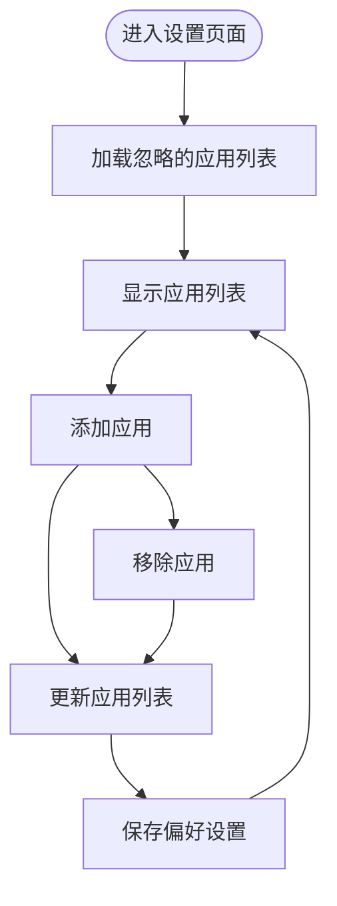
```mermaid
flowchart TD
Start([进入设置页面]) --> LoadApps["加载忽略的应用列表"]
LoadApps --> DisplayList["显示应用列表"]
DisplayList --> AddApp["添加应用"]
AddApp --> UpdateList["更新应用列表"]
UpdateList --> SavePrefs["保存偏好设置"]
SavePrefs --> DisplayList
AddApp --> RemoveApp["移除应用"]
RemoveApp --> UpdateList
```

**图表来源**
- [SettingsView.swift](file://Cutting_board/SettingsView.swift#L49-L75)

**章节来源**
- [SettingsView.swift](file://Cutting_board/SettingsView.swift#L1-L95)

## 高级动画实现

### 事务系统使用

SwiftUI的事务系统是所有动画的基础机制。项目中正确使用了事务系统来控制动画行为：

#### 基础事务使用

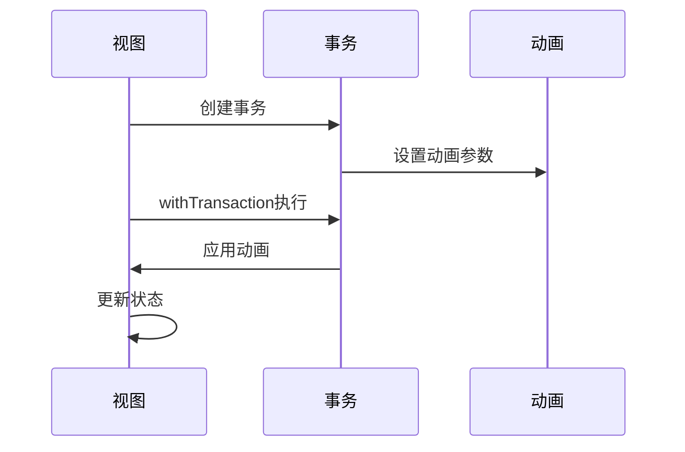
```mermaid
sequenceDiagram
participant View as 视图
participant Transaction as 事务
participant Animation as 动画
View->>Transaction : 创建事务
Transaction->>Animation : 设置动画参数
View->>Transaction : withTransaction执行
Transaction->>View : 应用动画
View->>View : 更新状态
```

**图表来源**
- [animation-advanced.md](file://.agents/skills/swiftui-expert-skill/references/animation-advanced.md#L13-L26)

#### 无障碍适配

项目实现了完整的无障碍动画适配：

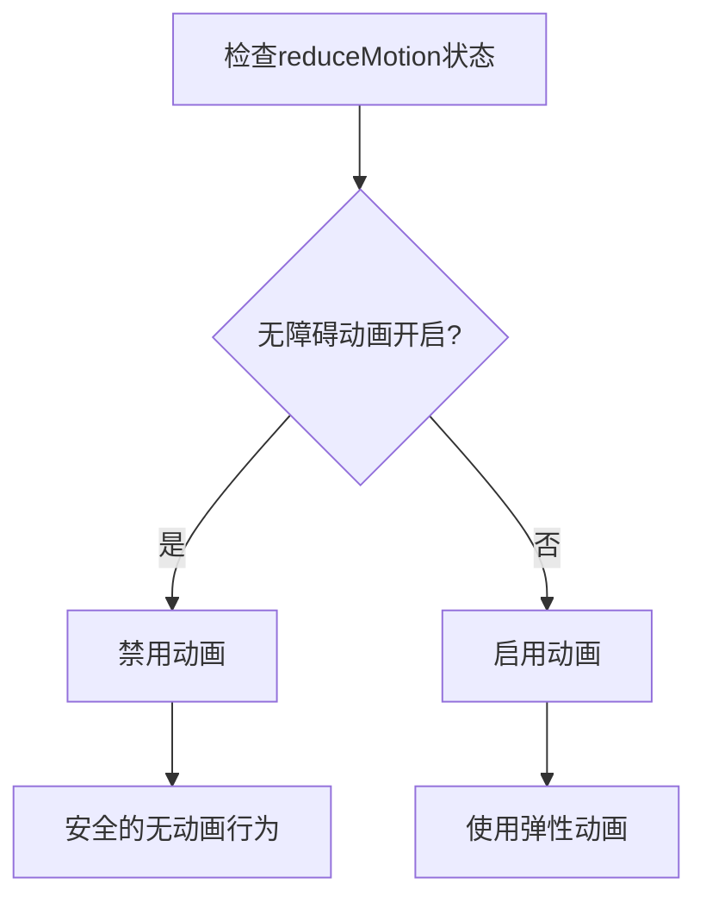
```mermaid
flowchart TD
CheckMotion["检查reduceMotion状态"] --> HasMotion{"无障碍动画开启?"}
HasMotion --> |是| DisableAnim["禁用动画"]
HasMotion --> |否| EnableAnim["启用动画"]
DisableAnim --> SafeBehavior["安全的无动画行为"]
EnableAnim --> SpringAnim["使用弹性动画"]
```

**图表来源**
- [ContentView.swift](file://Cutting_board/ContentView.swift#L27-L53)

**章节来源**
- [ContentView.swift](file://Cutting_board/ContentView.swift#L17-L53)
- [animation-advanced.md](file://.agents/skills/swiftui-expert-skill/references/animation-advanced.md#L51-L61)

### 相位动画实现

iOS 17引入的相位动画功能非常适合实现多步骤序列动画：

#### 相位动画基本用法

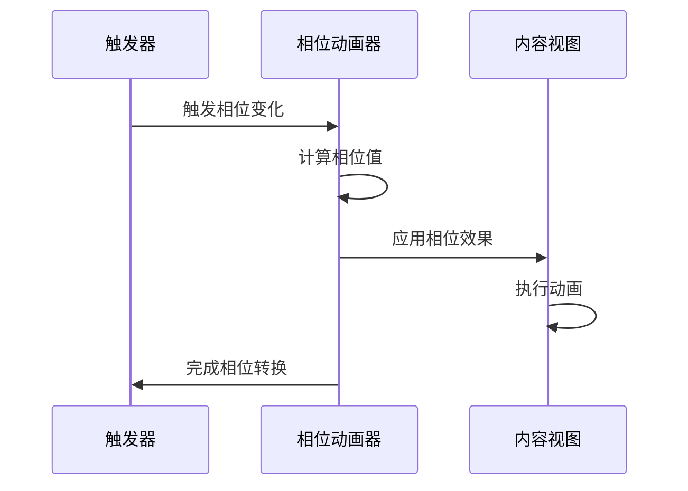
```mermaid
sequenceDiagram
participant Trigger as 触发器
participant PhaseAnimator as 相位动画器
participant Content as 内容视图
Trigger->>PhaseAnimator : 触发相位变化
PhaseAnimator->>PhaseAnimator : 计算相位值
PhaseAnimator->>Content : 应用相位效果
Content->>Content : 执行动画
PhaseAnimator->>Trigger : 完成相位转换
```

**图表来源**
- [animation-advanced.md](file://.agents/skills/swiftui-expert-skill/references/animation-advanced.md#L96-L117)

#### 相位动画最佳实践

项目中可以应用相位动画的场景：
1. **列表项点击反馈** - 实现点击后的缩放和阴影动画
2. **状态切换动画** - 实现开关状态的平滑过渡
3. **加载状态动画** - 实现旋转和进度指示器动画

**章节来源**
- [animation-advanced.md](file://.agents/skills/swiftui-expert-skill/references/animation-advanced.md#L96-L174)

### 关键帧动画实现

关键帧动画提供了精确的时间控制能力：

#### 关键帧动画结构

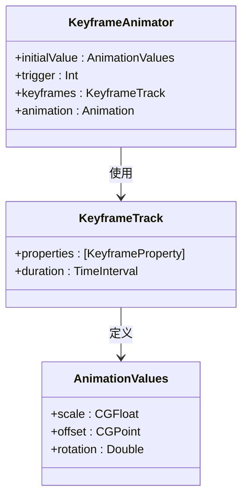
```mermaid
classDiagram
class KeyframeAnimator {
+initialValue : AnimationValues
+trigger : Int
+keyframes : KeyframeTrack
+animation : Animation
}
class KeyframeTrack {
+properties : [KeyframeProperty]
+duration : TimeInterval
}
class AnimationValues {
+scale : CGFloat
+offset : CGPoint
+rotation : Double
}
KeyframeAnimator --> KeyframeTrack : 使用
KeyframeTrack --> AnimationValues : 定义
```

**图表来源**
- [animation-advanced.md](file://.agents/skills/swiftui-expert-skill/references/animation-advanced.md#L178-L209)

#### 关键帧动画应用场景

1. **复杂UI效果** - 如按钮点击后的多属性动画
2. **精确时间控制** - 需要严格控制动画时序的场景
3. **并行动画** - 多个属性同时变化的复杂效果

**章节来源**
- [animation-advanced.md](file://.agents/skills/swiftui-expert-skill/references/animation-advanced.md#L178-L280)

### 动画完成处理程序

iOS 17引入的动画完成处理程序提供了更强大的动画生命周期控制：

#### 完成处理程序模式

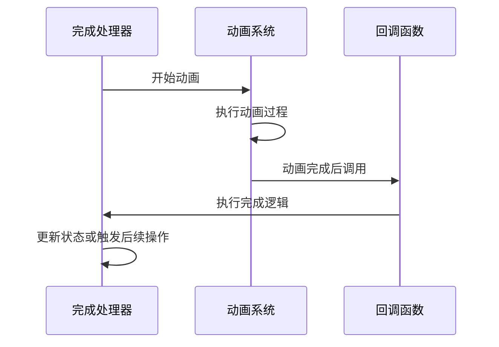
```mermaid
sequenceDiagram
participant Handler as 完成处理器
participant Animation as 动画系统
participant Callback as 回调函数
Handler->>Animation : 开始动画
Animation->>Animation : 执行动画过程
Animation->>Callback : 动画完成后调用
Callback->>Handler : 执行完成逻辑
Handler->>Handler : 更新状态或触发后续操作
```

**图表来源**
- [animation-advanced.md](file://.agents/skills/swiftui-expert-skill/references/animation-advanced.md#L282-L321)

**章节来源**
- [animation-advanced.md](file://.agents/skills/swiftui-expert-skill/references/animation-advanced.md#L282-L351)

## iOS 17+新特性

### 自定义事务键

iOS 17引入的自定义事务键功能允许在动画系统中传递元数据：

#### 事务键实现

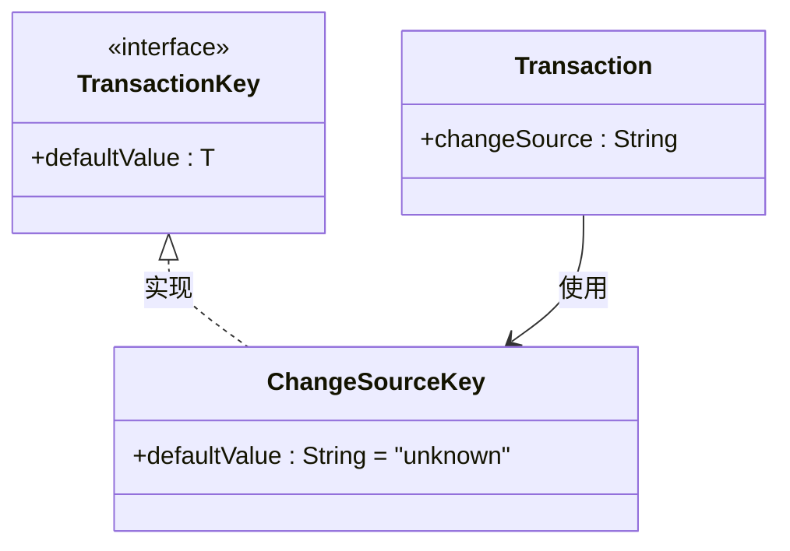
```mermaid
classDiagram
class TransactionKey {
<<interface>>
+defaultValue : T
}
class ChangeSourceKey {
+defaultValue : String = "unknown"
}
class Transaction {
+changeSource : String
}
TransactionKey <|.. ChangeSourceKey : 实现
Transaction --> ChangeSourceKey : 使用
```

**图表来源**
- [animation-advanced.md](file://.agents/skills/swiftui-expert-skill/references/animation-advanced.md#L63-L92)

#### 事务键应用场景

1. **动画源识别** - 区分不同类型的动画触发源
2. **条件动画控制** - 根据动画源动态调整动画参数
3. **调试和日志** - 追踪动画的来源和类型

**章节来源**
- [animation-advanced.md](file://.agents/skills/swiftui-expert-skill/references/animation-advanced.md#L63-L92)

### 相位动画增强

iOS 17的相位动画功能得到了显著增强：

#### 相位动画特性

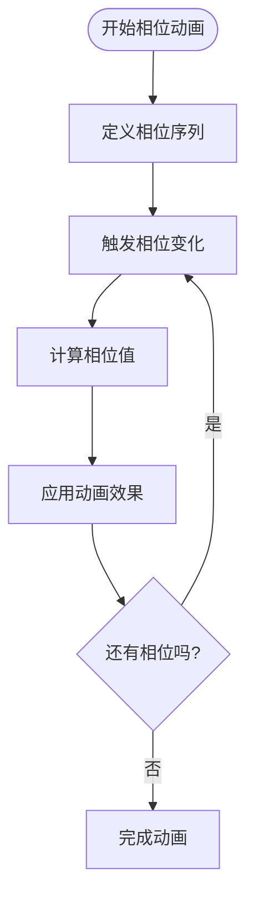
```mermaid
flowchart TD
Start([开始相位动画]) --> DefinePhases["定义相位序列"]
DefinePhases --> TriggerPhase["触发相位变化"]
TriggerPhase --> CalculateValue["计算相位值"]
CalculateValue --> ApplyEffect["应用动画效果"]
ApplyEffect --> NextPhase{"还有相位吗?"}
NextPhase --> |是| TriggerPhase
NextPhase --> |否| Complete["完成动画"]
```

**图表来源**
- [animation-advanced.md](file://.agents/skills/swiftui-expert-skill/references/animation-advanced.md#L96-L174)

**章节来源**
- [animation-advanced.md](file://.agents/skills/swiftui-expert-skill/references/animation-advanced.md#L96-L174)

### 关键帧时间线

iOS 17的关键帧时间线功能提供了测试和调试支持：

#### 时间线查询

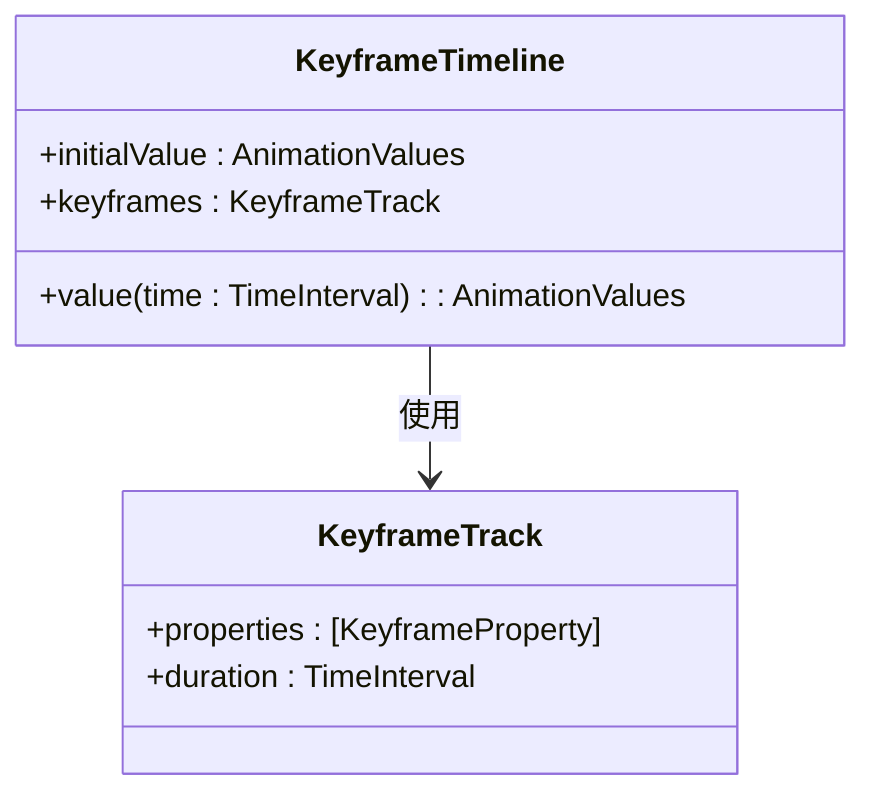
```mermaid
classDiagram
class KeyframeTimeline {
+initialValue : AnimationValues
+keyframes : KeyframeTrack
+value(time : TimeInterval) : AnimationValues
}
class KeyframeTrack {
+properties : [KeyframeProperty]
+duration : TimeInterval
}
KeyframeTimeline --> KeyframeTrack : 使用
```

**图表来源**
- [animation-advanced.md](file://.agents/skills/swiftui-expert-skill/references/animation-advanced.md#L264-L278)

**章节来源**
- [animation-advanced.md](file://.agents/skills/swiftui-expert-skill/references/animation-advanced.md#L264-L278)

## 动画优先级与控制

### 动画优先级规则

SwiftUI遵循特定的动画优先级规则：

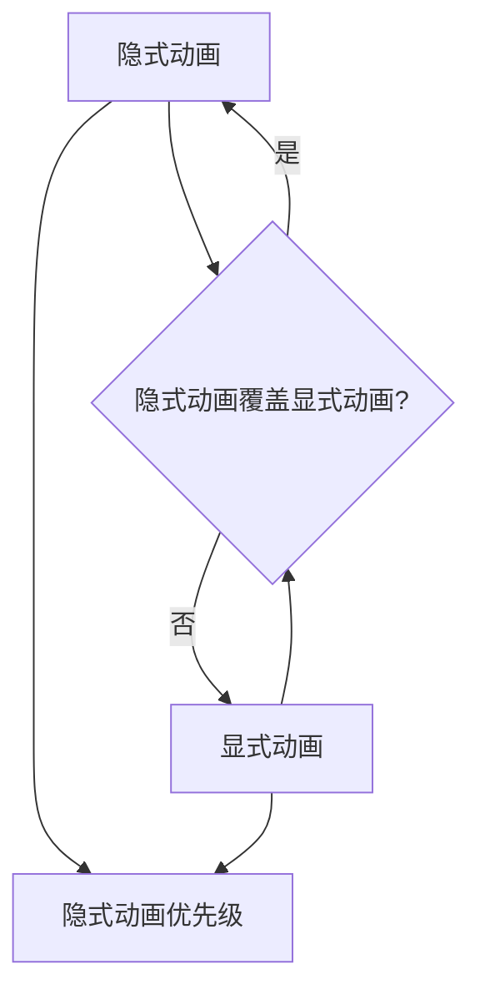
```mermaid
flowchart TD
Implicit["隐式动画"] --> Override{"隐式动画覆盖显式动画?"}
Explicit["显式动画"] --> Override
Override --> |是| Implicit
Override --> |否| Explicit
Implicit --> Priority["隐式动画优先级"]
Explicit --> Priority
```

**图表来源**
- [animation-advanced.md](file://.agents/skills/swiftui-expert-skill/references/animation-advanced.md#L40-L49)

### 动画控制策略

项目实现了多种动画控制策略：

1. **无障碍优先**: 当用户启用减少动画时，完全禁用动画效果
2. **性能优化**: 避免在滚动等高频操作中进行复杂动画
3. **用户体验**: 在关键操作中提供适当的视觉反馈

**章节来源**
- [animation-advanced.md](file://.agents/skills/swiftui-expert-skill/references/animation-advanced.md#L40-L61)

## 性能优化策略

### 动画性能考虑

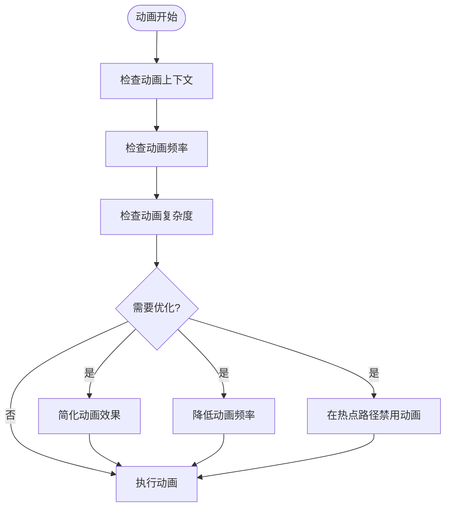
```mermaid
flowchart TD
Start([动画开始]) --> CheckContext["检查动画上下文"]
CheckContext --> CheckFrequency["检查动画频率"]
CheckFrequency --> CheckComplexity["检查动画复杂度"]
CheckComplexity --> Optimize{"需要优化?"}
Optimize --> |是| ReduceComplexity["简化动画效果"]
Optimize --> |是| ReduceFrequency["降低动画频率"]
Optimize --> |是| DisableForHotPaths["在热点路径禁用动画"]
Optimize --> |否| Execute["执行动画"]
ReduceComplexity --> Execute
ReduceFrequency --> Execute
DisableForHotPaths --> Execute
```

### 性能优化实践

1. **避免布局动画**: 在滚动视图中避免动画布局属性
2. **批量更新**: 合并多个状态变化以减少重绘
3. **资源管理**: 及时释放动画相关的资源

**章节来源**
- [animation-basics.md](file://.agents/skills/swiftui-expert-skill/references/animation-basics.md#L279-L285)

## 兼容性处理

### 版本兼容性

项目需要处理不同iOS版本的兼容性问题：

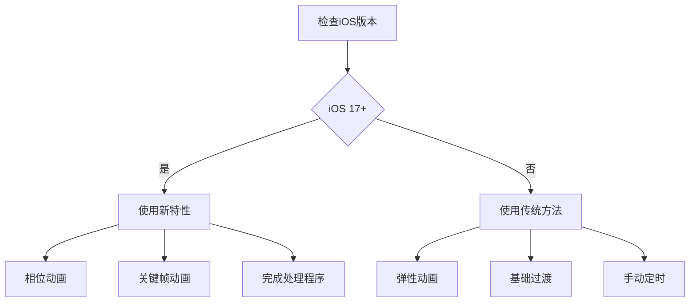
```mermaid
flowchart TD
CheckVersion["检查iOS版本"] --> IsIOS17{"iOS 17+"}
IsIOS17 --> |是| UseNewFeatures["使用新特性"]
IsIOS17 --> |否| UseLegacy["使用传统方法"]
UseNewFeatures --> PhaseAnim["相位动画"]
UseNewFeatures --> KeyframeAnim["关键帧动画"]
UseNewFeatures --> CompletionHandlers["完成处理程序"]
UseLegacy --> SpringAnim["弹性动画"]
UseLegacy --> BasicTransitions["基础过渡"]
UseLegacy --> ManualTiming["手动定时"]
```

### 兼容性实现策略

1. **渐进增强**: 新特性仅在支持的系统上启用
2. **降级处理**: 为旧版本提供相似但简化的动画效果
3. **条件编译**: 使用编译器指令确保代码兼容性

**章节来源**
- [animation-advanced.md](file://.agents/skills/swiftui-expert-skill/references/animation-advanced.md#L1-L10)

## 故障排除指南

### 常见动画问题

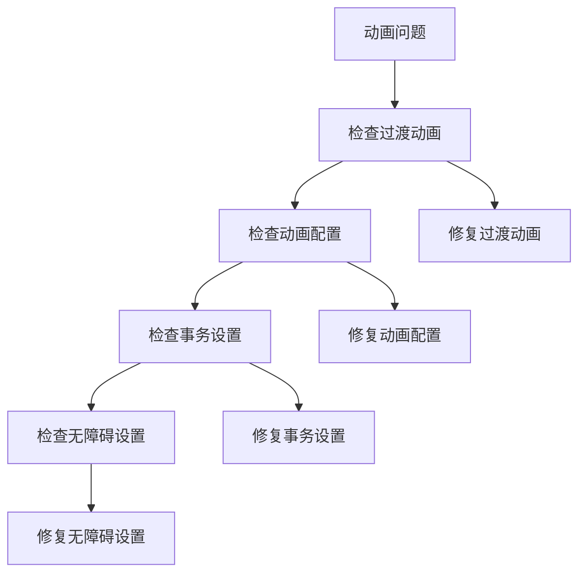
```mermaid
flowchart TD
Problem[动画问题] --> CheckTransition["检查过渡动画"]
CheckTransition --> CheckAnimation["检查动画配置"]
CheckAnimation --> CheckTransaction["检查事务设置"]
CheckTransaction --> CheckAccessibility["检查无障碍设置"]
CheckTransition --> FixTransition["修复过渡动画"]
CheckAnimation --> FixAnimation["修复动画配置"]
CheckTransaction --> FixTransaction["修复事务设置"]
CheckAccessibility --> FixAccessibility["修复无障碍设置"]
```

### 调试技巧

1. **动画预览**: 使用预览功能测试动画效果
2. **性能分析**: 使用Instruments分析动画性能
3. **日志记录**: 记录动画状态变化以便调试

**章节来源**
- [animation-transitions.md](file://.agents/skills/swiftui-expert-skill/references/animation-transitions.md#L36-L77)

## 结论

本项目展示了SwiftUI高级动画技术的完整实现，包括事务系统、相位动画、关键帧动画等iOS 17+新特性。通过合理的架构设计和性能优化策略，项目实现了流畅而优雅的用户界面动画。

关键成功因素包括：
- 正确使用事务系统控制动画行为
- 有效利用iOS 17+新特性提升用户体验
- 实现完整的无障碍适配
- 采用性能友好的动画策略
- 提供良好的错误处理和调试支持

这些实践经验为开发高质量的SwiftUI应用提供了宝贵的参考。