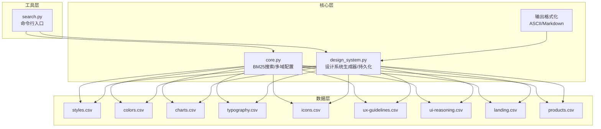
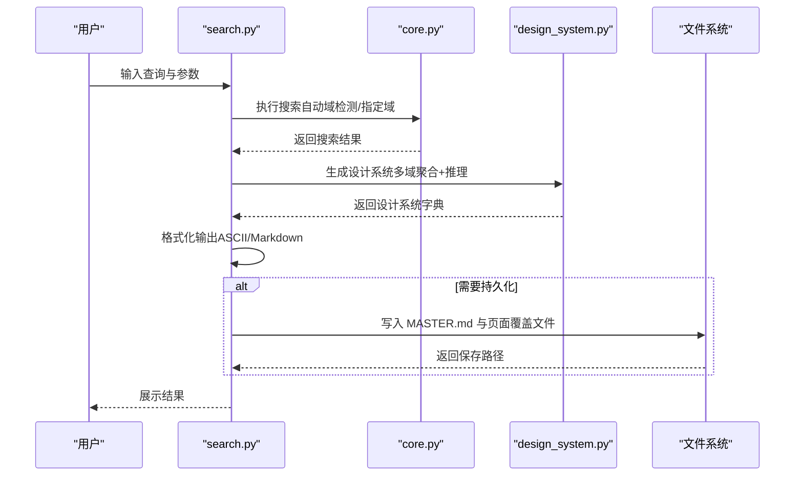
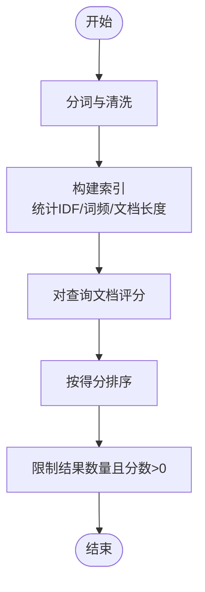
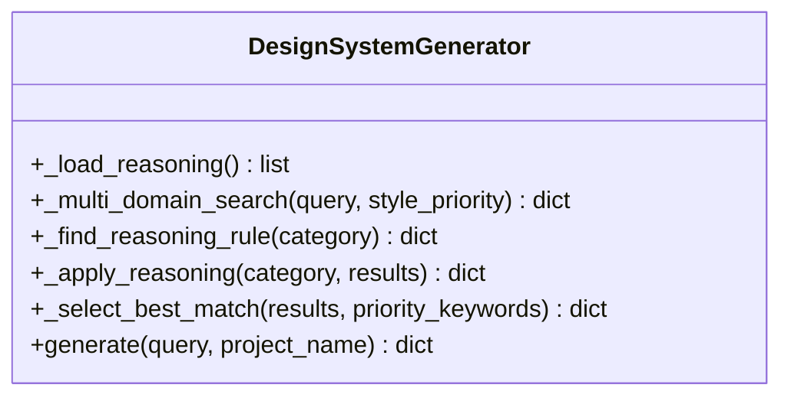
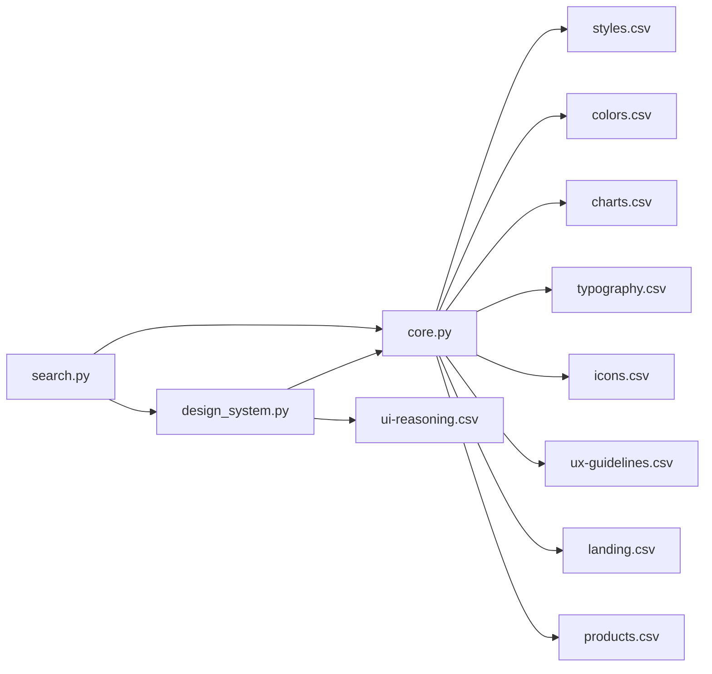

# UI/UX专业技能

<cite>
**本文档引用的文件**
- [SKILL.md](file://.cursor/skills/ui-ux-pro-max/SKILL.md)
- [core.py](file://.cursor/skills/ui-ux-pro-max/scripts/core.py)
- [design_system.py](file://.cursor/skills/ui-ux-pro-max/scripts/design_system.py)
- [search.py](file://.cursor/skills/ui-ux-pro-max/scripts/search.py)
- [charts.csv](file://.cursor/skills/ui-ux-pro-max/data/charts.csv)
- [colors.csv](file://.cursor/skills/ui-ux-pro-max/data/colors.csv)
- [icons.csv](file://.cursor/skills/ui-ux-pro-max/data/icons.csv)
- [styles.csv](file://.cursor/skills/ui-ux-pro-max/data/styles.csv)
- [typography.csv](file://.cursor/skills/ui-ux-pro-max/data/typography.csv)
- [ux-guidelines.csv](file://.cursor/skills/ui-ux-pro-max/data/ux-guidelines.csv)
- [ui-reasoning.csv](file://.cursor/skills/ui-ux-pro-max/data/ui-reasoning.csv)
- [landing.csv](file://.cursor/skills/ui-ux-pro-max/data/landing.csv)
- [products.csv](file://.cursor/skills/ui-ux-pro-max/data/products.csv)
</cite>

## 目录
1. [简介](#简介)
2. [项目结构](#项目结构)
3. [核心组件](#核心组件)
4. [架构总览](#架构总览)
5. [详细组件分析](#详细组件分析)
6. [依赖关系分析](#依赖关系分析)
7. [性能考虑](#性能考虑)
8. [故障排除指南](#故障排除指南)
9. [结论](#结论)
10. [附录](#附录)

## 简介
本文件为UI/UX专业技能模块的综合文档，围绕设计系统构建、样式指南制定与多平台实现策略展开。系统以CSV数据文件为核心，通过BM25检索引擎与推理规则，自动生成可落地的设计系统推荐，覆盖图表类型、颜色体系、图标管理、字体排印、UX规范与产品风格建议。同时提供Python脚本工具链，支持命令行搜索、设计系统生成与持久化（Master + Overrides模式），帮助在不同技术栈（Web、React、Vue、SwiftUI、Flutter等）中快速落地统一设计语言。

## 项目结构
该模块采用“数据驱动 + 脚本工具”的组织方式：
- 数据层：以CSV文件存储设计要素（样式、颜色、图表、字体、图标、UX规范、产品风格、落地页模式、UI推理规则等）
- 核心层：BM25检索与多域搜索、设计系统生成器、输出格式化
- 工具层：命令行入口脚本，支持搜索、设计系统生成、持久化与格式化输出

**图示来源**
- [core.py](file://.cursor/skills/ui-ux-pro-max/scripts/core.py#L17-L84)
- [design_system.py](file://.cursor/skills/ui-ux-pro-max/scripts/design_system.py#L24-L33)
- [search.py](file://.cursor/skills/ui-ux-pro-max/scripts/search.py#L17-L21)

**章节来源**
- [SKILL.md](file://.cursor/skills/ui-ux-pro-max/SKILL.md#L1-L289)

## 核心组件
- 搜索引擎（BM25）：基于词项分词、去重、IDF计算与文档长度归一化，实现跨域高相关度检索
- 多域配置：定义各CSV域的搜索列、输出列与默认结果数量
- 设计系统生成器：聚合产品、风格、颜色、落地页、字体等结果，应用UI推理规则，生成统一设计系统
- 输出格式化：ASCII盒装与Markdown两种输出，便于终端展示与文档沉淀
- 持久化机制：Master + Overrides层级化存储，支持按页面覆盖

**章节来源**
- [core.py](file://.cursor/skills/ui-ux-pro-max/scripts/core.py#L96-L156)
- [design_system.py](file://.cursor/skills/ui-ux-pro-max/scripts/design_system.py#L37-L236)

## 架构总览
系统工作流分为“搜索阶段”和“设计系统生成阶段”，最终输出统一设计语言与实现建议。

**图示来源**
- [search.py](file://.cursor/skills/ui-ux-pro-max/scripts/search.py#L56-L115)
- [core.py](file://.cursor/skills/ui-ux-pro-max/scripts/core.py#L212-L231)
- [design_system.py](file://.cursor/skills/ui-ux-pro-max/scripts/design_system.py#L462-L487)

## 详细组件分析

### 组件A：BM25搜索引擎
- 功能要点
  - 分词与清洗：小写化、去标点、过滤短词
  - 文档索引：统计词频、文档频率、平均文档长度
  - 排序：基于IDF与BM25公式计算得分
  - 结果截断：按最大结果数与正分数筛选
- 关键流程

**图示来源**
- [core.py](file://.cursor/skills/ui-ux-pro-max/scripts/core.py#L96-L156)

**章节来源**
- [core.py](file://.cursor/skills/ui-ux-pro-max/scripts/core.py#L96-L156)

### 组件B：设计系统生成器
- 多域搜索：产品、风格、颜色、落地页、字体，按配置限制结果数
- 推理应用：根据产品类别匹配UI推理规则，确定风格优先级、色彩情绪、字体气质、关键效果与反模式
- 最优匹配：对风格结果按关键词优先级打分选择；对颜色/字体/落地页取首条
- 输出整合：合并风格效果与推理效果，形成统一设计系统字典
- 持久化：生成MASTER.md与页面覆盖文件，遵循层级化覆盖逻辑

**图示来源**
- [design_system.py](file://.cursor/skills/ui-ux-pro-max/scripts/design_system.py#L37-L236)

**章节来源**
- [design_system.py](file://.cursor/skills/ui-ux-pro-max/scripts/design_system.py#L37-L236)

### 组件C：命令行工具（search.py）
- 支持域搜索、堆栈特定搜索、设计系统生成、持久化与格式化输出
- 自动编码处理，确保Emoji与中文显示正常
- 参数解析与路由到对应功能

**章节来源**
- [search.py](file://.cursor/skills/ui-ux-pro-max/scripts/search.py#L17-L115)

### 组件D：数据结构与CSV域说明
- 样式（styles.csv）：风格分类、类型、关键词、主次色、效果动画、适用场景、兼容性、复杂度等
- 颜色（colors.csv）：按产品类型提供主色、辅色、强调色、背景、文本、边框与备注
- 图表（charts.csv）：数据类型、关键词、最佳图表类型、配色指导、性能影响、可访问性、库推荐、交互等级
- 字体（typography.csv）：字体组合名称、类别、标题/正文字体、情绪关键词、适用场景、Google Fonts链接、CSS导入、Tailwind配置、备注
- 图标（icons.csv）：类别、图标名、关键词、库、导入代码、用法、适用场景、风格
- UX规范（ux-guidelines.csv）：导航、动画、布局、触摸、交互、可访问性、性能、表单、响应式、排版、反馈、内容、上新、搜索、数据录入、AI交互、空间UI、可持续性等维度的规则
- UI推理（ui-reasoning.csv）：针对不同产品类别的推荐模式、风格优先级、色彩情绪、字体气质、关键效果、决策规则、反模式与严重程度
- 落地页（landing.csv）：页面模式名称、关键词、段落顺序、主要CTA放置、配色策略、推荐效果、转化优化
- 产品（products.csv）：产品类型、关键词、首选风格、次要风格、落地页模式、仪表盘风格、色彩焦点、关键考虑

**章节来源**
- [styles.csv](file://.cursor/skills/ui-ux-pro-max/data/styles.csv#L1-L69)
- [colors.csv](file://.cursor/skills/ui-ux-pro-max/data/colors.csv#L1-L98)
- [charts.csv](file://.cursor/skills/ui-ux-pro-max/data/charts.csv#L1-L27)
- [typography.csv](file://.cursor/skills/ui-ux-pro-max/data/typography.csv#L1-L58)
- [icons.csv](file://.cursor/skills/ui-ux-pro-max/data/icons.csv#L1-L102)
- [ux-guidelines.csv](file://.cursor/skills/ui-ux-pro-max/data/ux-guidelines.csv#L1-L100)
- [ui-reasoning.csv](file://.cursor/skills/ui-ux-pro-max/data/ui-reasoning.csv#L1-L102)
- [landing.csv](file://.cursor/skills/ui-ux-pro-max/data/landing.csv#L1-L32)
- [products.csv](file://.cursor/skills/ui-ux-pro-max/data/products.csv#L1-L97)

## 依赖关系分析
- 脚本依赖
  - core.py：独立运行，负责CSV加载、BM25搜索与域配置
  - design_system.py：依赖core.py的search函数与DATA_DIR，读取UI推理与多域CSV
  - search.py：依赖core.py与design_system.py，提供命令行接口
- 数据依赖
  - 各CSV文件作为单一事实源，相互补充形成完整设计系统
  - UI推理规则决定风格优先级与关键效果，落地页模式决定页面结构，颜色与字体提供视觉基础

**图示来源**
- [core.py](file://.cursor/skills/ui-ux-pro-max/scripts/core.py#L17-L84)
- [design_system.py](file://.cursor/skills/ui-ux-pro-max/scripts/design_system.py#L24-L33)
- [search.py](file://.cursor/skills/ui-ux-pro-max/scripts/search.py#L17-L21)

**章节来源**
- [core.py](file://.cursor/skills/ui-ux-pro-max/scripts/core.py#L17-L84)
- [design_system.py](file://.cursor/skills/ui-ux-pro-max/scripts/design_system.py#L24-L33)
- [search.py](file://.cursor/skills/ui-ux-pro-max/scripts/search.py#L17-L21)

## 性能考虑
- 检索性能
  - BM25仅在文档集合上构建一次索引，查询时线性扫描文档向量并累加TF-IDF，适合中小规模CSV数据
  - 建议控制每域最大结果数，避免过多候选导致排序开销
- 输出性能
  - ASCII盒装与Markdown输出均为纯字符串拼接，开销极低
- 可扩展性
  - 当CSV规模增大时，可考虑将BM25索引持久化或迁移至轻量数据库
  - 多域并行搜索可通过进程池并发执行（当前实现为串行，便于调试与一致性）

[本节为通用指导，不直接分析具体文件]

## 故障排除指南
- 编码问题
  - 在Windows环境下强制UTF-8输出，避免控制台无法显示Emoji或中文乱码
- 文件缺失
  - 若某CSV文件不存在，搜索返回错误信息，需检查DATA_DIR路径与文件名
- 域配置
  - 未指定域时按关键词自动检测，若关键词不足，可显式传入--domain
- 堆栈搜索
  - 使用--stack选项时需确保对应CSV存在，否则返回错误信息
- 设计系统持久化
  - 使用--persist会在当前目录创建design-system/<项目名>/MASTER.md与pages子目录
  - 页面覆盖文件位于design-system/<项目名>/pages/<页面名>.md，遵循“页面覆盖优先于全局”的规则

**章节来源**
- [search.py](file://.cursor/skills/ui-ux-pro-max/scripts/search.py#L23-L28)
- [core.py](file://.cursor/skills/ui-ux-pro-max/scripts/core.py#L220-L223)
- [design_system.py](file://.cursor/skills/ui-ux-pro-max/scripts/design_system.py#L491-L539)

## 结论
本模块通过“数据驱动 + 规则推理 + 脚本工具”的方式，构建了可复用、可扩展、可持久化的UI/UX设计系统。CSV数据文件承载统一设计语言，BM25搜索与UI推理规则保证推荐质量，命令行工具链实现从查询到落地的全链路自动化。结合多平台堆栈指南，可在Web、React、Vue、SwiftUI、Flutter等环境中快速实现一致的视觉与交互体验。

[本节为总结性内容，不直接分析具体文件]

## 附录

### 脚本使用指南
- 安装与前置条件
  - 确保已安装Python（支持Python 3.12）
  - macOS：使用包管理器安装；Linux：apt安装；Windows：winget安装
- 基本搜索
  - 域搜索：python3 scripts/search.py "<关键词>" --domain <域>
  - 堆栈搜索：python3 scripts/search.py "<关键词>" --stack <堆栈>
- 设计系统生成
  - 生成设计系统：python3 scripts/search.py "<产品/行业/关键词>" --design-system -p "项目名"
  - 输出格式：--format ascii（默认）或 markdown
  - 持久化：添加--persist，生成MASTER.md与页面覆盖文件
  - 页面覆盖：--page "dashboard" 生成design-system/<项目>/pages/dashboard.md
- 常用域与堆栈
  - 域：product、style、color、chart、landing、typography、ux、react、web、prompt
  - 堆栈：html-tailwind、react、nextjs、vue、svelte、swiftui、react-native、flutter、shadcn、jetpack-compose

**章节来源**
- [SKILL.md](file://.cursor/skills/ui-ux-pro-max/SKILL.md#L32-L186)
- [search.py](file://.cursor/skills/ui-ux-pro-max/scripts/search.py#L56-L115)

### 设计系统数据结构与字段说明
- 产品域（product）
  - 关键字段：Product Type、Keywords、Primary Style Recommendation、Secondary Styles、Landing Page Pattern、Dashboard Style、Color Palette Focus、Key Considerations
- 风格域（style）
  - 关键字段：Style Category、Type、Keywords、Primary Colors、Secondary Colors、Effects & Animation、Best For、Do Not Use For、Light/Dark Mode支持、性能、可访问性、移动端友好度、转化导向、框架兼容性、时代/起源、复杂度、AI提示词、技术关键词、实施清单、设计系统变量
- 颜色域（color）
  - 关键字段：Product Type、Primary (Hex)、Secondary (Hex)、CTA (Hex)、Background (Hex)、Text (Hex)、Notes
- 图表域（chart）
  - 关键字段：Data Type、Keywords、Best Chart Type、Secondary Options、Color Guidance、Performance Impact、Accessibility Notes、Library Recommendation、Interactive Level
- 字体域（typography）
  - 关键字段：Font Pairing Name、Category、Heading Font、Body Font、Mood/Style Keywords、Best For、Google Fonts URL、CSS Import、Tailwind Config、Notes
- 图标域（icons）
  - 关键字段：Category、Icon Name、Keywords、Library、Import Code、Usage、Best For、Style
- UX规范（ux-guidelines）
  - 关键字段：Category、Issue、Platform、Description、Do、Don't、Code Example Good、Code Example Bad、Severity
- UI推理（ui-reasoning）
  - 关键字段：UI_Category、Recommended_Pattern、Style_Priority、Color_Mood、Typography_Mood、Key_Effects、Decision_Rules、Anti_Patterns、Severity
- 落地页（landing）
  - 关键字段：Pattern Name、Keywords、Section Order、Primary CTA Placement、Color Strategy、Recommended Effects、Conversion Optimization
- 产品（products）
  - 关键字段：Product Type、Keywords、Primary Style Recommendation、Secondary Styles、Landing Page Pattern、Dashboard Style、Color Palette Focus、Key Considerations

**章节来源**
- [products.csv](file://.cursor/skills/ui-ux-pro-max/data/products.csv#L1-L97)
- [styles.csv](file://.cursor/skills/ui-ux-pro-max/data/styles.csv#L1-L69)
- [colors.csv](file://.cursor/skills/ui-ux-pro-max/data/colors.csv#L1-L98)
- [charts.csv](file://.cursor/skills/ui-ux-pro-max/data/charts.csv#L1-L27)
- [typography.csv](file://.cursor/skills/ui-ux-pro-max/data/typography.csv#L1-L58)
- [icons.csv](file://.cursor/skills/ui-ux-pro-max/data/icons.csv#L1-L102)
- [ux-guidelines.csv](file://.cursor/skills/ui-ux-pro-max/data/ux-guidelines.csv#L1-L100)
- [ui-reasoning.csv](file://.cursor/skills/ui-ux-pro-max/data/ui-reasoning.csv#L1-L102)
- [landing.csv](file://.cursor/skills/ui-ux-pro-max/data/landing.csv#L1-L32)