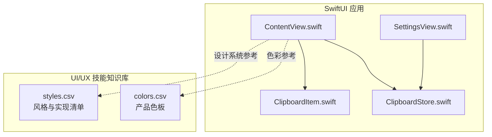
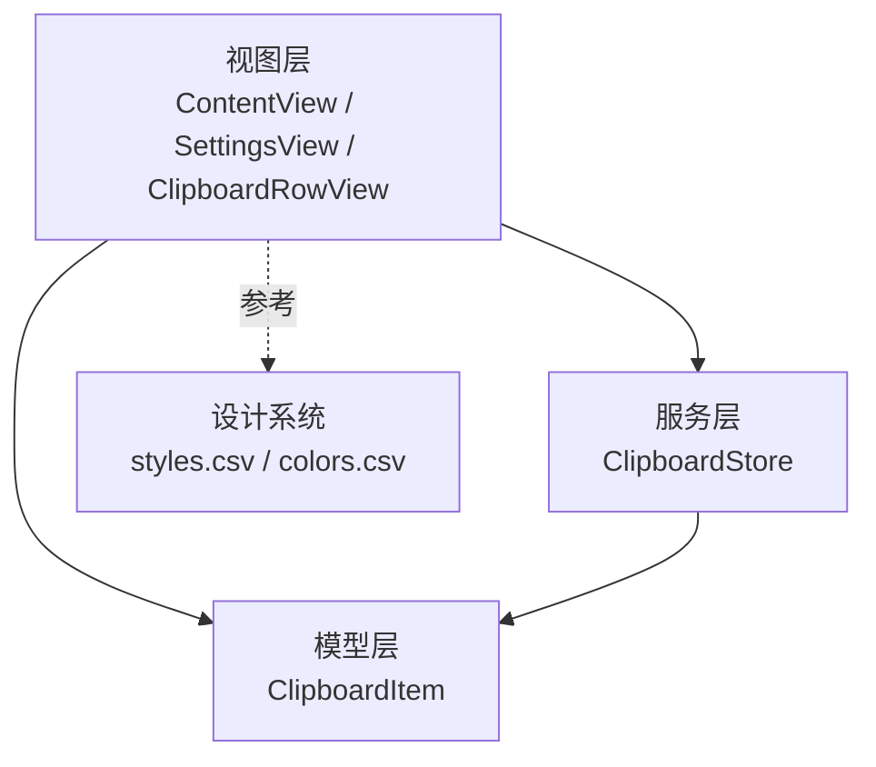
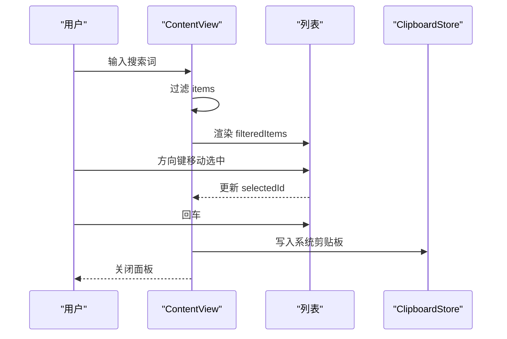
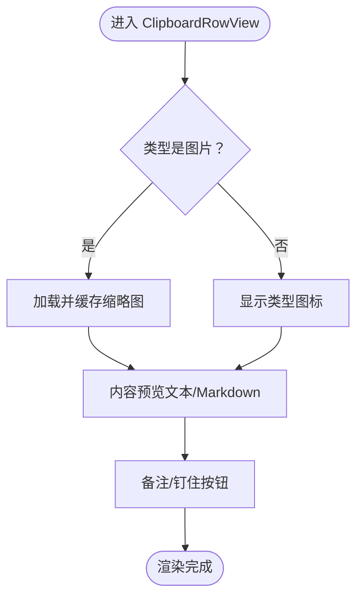
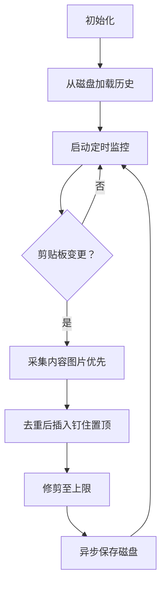
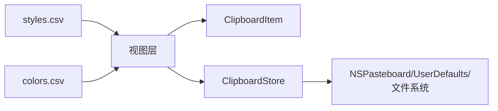

# 实现指南

<cite>
**本文档引用的文件**
- [SKILL.md](file://.agents/skills/swiftui-expert-skill/SKILL.md)
- [state-management.md](file://.agents/skills/swiftui-expert-skill/references/state-management.md)
- [modern-apis.md](file://.agents/skills/swiftui-expert-skill/references/modern-apis.md)
- [view-structure.md](file://.agents/skills/swiftui-expert-skill/references/view-structure.md)
- [performance-patterns.md](file://.agents/skills/swiftui-expert-skill/references/performance-patterns.md)
- [list-patterns.md](file://.agents/skills/swiftui-expert-skill/references/list-patterns.md)
- [layout-best-practices.md](file://.agents/skills/swiftui-expert-skill/references/layout-best-practices.md)
- [animation-basics.md](file://.agents/skills/swiftui-expert-skill/references/animation-basics.md)
- [animation-transitions.md](file://.agents/skills/swiftui-expert-skill/references/animation-transitions.md)
- [animation-advanced.md](file://.agents/skills/swiftui-expert-skill/references/animation-advanced.md)
- [sheet-navigation-patterns.md](file://.agents/skills/swiftui-expert-skill/references/sheet-navigation-patterns.md)
- [scroll-patterns.md](file://.agents/skills/swiftui-expert-skill/references/scroll-patterns.md)
- [text-formatting.md](file://.agents/skills/swiftui-expert-skill/references/text-formatting.md)
- [image-optimization.md](file://.agents/skills/swiftui-expert-skill/references/image-optimization.md)
- [liquid-glass.md](file://.agents/skills/swiftui-expert-skill/references/liquid-glass.md)
- [ContentView.swift](file://Cutting_board/ContentView.swift)
- [ClipboardItem.swift](file://Cutting_board/Models/ClipboardItem.swift)
- [ClipboardStore.swift](file://Cutting_board/Services/ClipboardStore.swift)
- [SettingsView.swift](file://Cutting_board/SettingsView.swift)
- [styles.csv](file://.cursor/skills/ui-ux-pro-max/data/styles.csv)
- [colors.csv](file://.cursor/skills/ui-ux-pro-max/data/colors.csv)
</cite>

## 目录
1. [引言](#引言)
2. [项目结构](#项目结构)
3. [核心组件](#核心组件)
4. [架构总览](#架构总览)
5. [详细组件分析](#详细组件分析)
6. [依赖分析](#依赖分析)
7. [性能考量](#性能考量)
8. [故障排查指南](#故障排查指南)
9. [结论](#结论)
10. [附录](#附录)

## 引言
本指南面向多平台实现，围绕13种技术栈（html-tailwind、react、nextjs、vue、svelte、swiftui、react-native、flutter、shadcn、jetpack-compose 等）提供从设计系统到具体实现的转换方法。文档强调：
- 适用场景与最佳实践：结合仓库中的 SwiftUI 实践与设计系统数据，给出各技术栈的落地策略与取舍。
- 组件映射与样式转换：提供从设计系统变量到各框架样式的映射思路。
- 无障碍、响应式、性能与跨平台兼容：总结通用原则与实现要点。
- 示例与问题解决：以仓库现有实现为参考，提炼可迁移的模式。

## 项目结构
本仓库包含一个 macOS/iOS 平台的 SwiftUI 应用主体与一套 UI/UX 技能知识库，后者提供了设计系统、风格与色彩的结构化数据，可作为多平台实现的设计基础。

图表来源
- [ContentView.swift](file://Cutting_board/ContentView.swift#L20-L305)
- [ClipboardItem.swift](file://Cutting_board/Models/ClipboardItem.swift#L17-L89)
- [ClipboardStore.swift](file://Cutting_board/Services/ClipboardStore.swift#L14-L222)
- [SettingsView.swift](file://Cutting_board/SettingsView.swift#L11-L89)
- [styles.csv](file://.cursor/skills/ui-ux-pro-max/data/styles.csv#L1-L69)
- [colors.csv](file://.cursor/skills/ui-ux-pro-max/data/colors.csv#L1-L98)

章节来源
- [ContentView.swift](file://Cutting_board/ContentView.swift#L20-L305)
- [ClipboardItem.swift](file://Cutting_board/Models/ClipboardItem.swift#L17-L89)
- [ClipboardStore.swift](file://Cutting_board/Services/ClipboardStore.swift#L14-L222)
- [SettingsView.swift](file://Cutting_board/SettingsView.swift#L11-L89)
- [styles.csv](file://.cursor/skills/ui-ux-pro-max/data/styles.csv#L1-L69)
- [colors.csv](file://.cursor/skills/ui-ux-pro-max/data/colors.csv#L1-L98)

## 核心组件
- 数据模型层：剪贴板条目模型，包含类型、时间戳、预览文本与备注等字段，支撑跨平台数据一致性。
- 服务层：剪贴板监控与持久化，负责历史采集、去重、排序、钉住、清理与磁盘读写。
- 视图层：主面板、设置页与行视图，体现布局、交互、动画与无障碍设计。
- 设计系统：风格与色彩数据，提供风格分类、实现清单、色板与可访问性约束，指导多平台样式映射。

章节来源
- [ClipboardItem.swift](file://Cutting_board/Models/ClipboardItem.swift#L17-L89)
- [ClipboardStore.swift](file://Cutting_board/Services/ClipboardStore.swift#L14-L222)
- [ContentView.swift](file://Cutting_board/ContentView.swift#L20-L305)
- [SettingsView.swift](file://Cutting_board/SettingsView.swift#L11-L89)
- [styles.csv](file://.cursor/skills/ui-ux-pro-max/data/styles.csv#L1-L69)
- [colors.csv](file://.cursor/skills/ui-ux-pro-max/data/colors.csv#L1-L98)

## 架构总览
SwiftUI 应用采用“视图-模型-服务”分层，视图负责 UI 表达与交互，模型承载数据与格式化，服务负责系统集成与持久化。设计系统数据为跨平台样式与交互提供统一参考。

图表来源
- [ContentView.swift](file://Cutting_board/ContentView.swift#L20-L305)
- [SettingsView.swift](file://Cutting_board/SettingsView.swift#L11-L89)
- [ClipboardItem.swift](file://Cutting_board/Models/ClipboardItem.swift#L17-L89)
- [ClipboardStore.swift](file://Cutting_board/Services/ClipboardStore.swift#L14-L222)
- [styles.csv](file://.cursor/skills/ui-ux-pro-max/data/styles.csv#L1-L69)
- [colors.csv](file://.cursor/skills/ui-ux-pro-max/data/colors.csv#L1-L98)

## 详细组件分析

### SwiftUI 主面板（ContentView）
- 结构与职责
  - 头部、搜索栏、内容区三段式布局，支持空态、无结果态与列表态切换。
  - 列表采用惰性堆叠与稳定 ID，结合滚动代理实现程序化滚动。
  - 支持键盘导航（方向键、回车、删除、ESC）、上下文菜单与备注编辑弹窗。
- 交互与动画
  - 使用弹簧动画与透明度/缩放过渡，尊重“减少动态”设置。
  - 行高亮与悬停态采用玻璃效果，增强空间层次。
- 无障碍
  - 为关键元素提供可访问性标签与提示，行项标注选中状态。
- 系统集成
  - 通过通知关闭面板，粘贴内容回写系统剪贴板。

图表来源
- [ContentView.swift](file://Cutting_board/ContentView.swift#L29-L95)
- [ClipboardStore.swift](file://Cutting_board/Services/ClipboardStore.swift#L167-L179)

章节来源
- [ContentView.swift](file://Cutting_board/ContentView.swift#L20-L305)

### 剪贴板行视图（ClipboardRowView）
- 结构与职责
  - 左侧缩略图/图标，中间内容预览与备注行，右侧操作按钮（备注、钉住）。
  - 选中态与悬停态使用玻璃效果背景，提升可识别性。
- 优化与性能
  - 使用等价比较与内容形状裁剪，减少重绘。
  - 图片缩略图延迟生成并缓存，降低主线程压力。
- 无障碍
  - 为按钮与行项提供可访问性标签与 trait。

图表来源
- [ContentView.swift](file://Cutting_board/ContentView.swift#L321-L471)

章节来源
- [ContentView.swift](file://Cutting_board/ContentView.swift#L321-L471)

### 剪贴板存储（ClipboardStore）
- 监控与采集
  - 定时轮询系统剪贴板变更，优先采集图片（PNG Base64），其次文本。
  - 忽略白名单应用，避免循环记录。
- 去重与排序
  - 相同内容去重，钉住项置顶，超出上限自动修剪。
- 持久化
  - JSON 编解码，ISO8601 时间格式，加密存储于应用支持目录。
- 系统交互
  - 将选中项写回系统剪贴板，同步 changeCount。

图表来源
- [ClipboardStore.swift](file://Cutting_board/Services/ClipboardStore.swift#L31-L222)

章节来源
- [ClipboardStore.swift](file://Cutting_board/Services/ClipboardStore.swift#L14-L222)

### 设置页（SettingsView）
- 功能
  - 展示与管理“忽略的应用”，支持添加与移除。
  - 使用玻璃效果卡片与清晰的层级结构。
- 交互
  - 通过应用信息助手获取图标与名称，支持选择应用 Bundle ID。

章节来源
- [SettingsView.swift](file://Cutting_board/SettingsView.swift#L11-L89)

### 设计系统与色彩参考
- 风格分类
  - 提供多种风格（极简、玻璃拟态、暗黑、运动驱动、无障碍等），并列出适用场景、性能与可访问性建议。
- 色彩体系
  - 按产品类型提供主色、辅色、行动按钮色、背景与文本色，便于跨平台映射。

章节来源
- [styles.csv](file://.cursor/skills/ui-ux-pro-max/data/styles.csv#L1-L69)
- [colors.csv](file://.cursor/skills/ui-ux-pro-max/data/colors.csv#L1-L98)

## 依赖分析
- 视图依赖模型与服务：ContentView 依赖 ClipboardStore 的发布属性与方法，行视图依赖 ClipboardItem 的格式化字段。
- 服务依赖系统：ClipboardStore 依赖 NSPasteboard、UserDefaults、文件系统与加密模块。
- 设计系统依赖：视图层参考 styles.csv 与 colors.csv 中的风格与色板，确保一致性。

图表来源
- [styles.csv](file://.cursor/skills/ui-ux-pro-max/data/styles.csv#L1-L69)
- [colors.csv](file://.cursor/skills/ui-ux-pro-max/data/colors.csv#L1-L98)
- [ContentView.swift](file://Cutting_board/ContentView.swift#L20-L305)
- [ClipboardItem.swift](file://Cutting_board/Models/ClipboardItem.swift#L17-L89)
- [ClipboardStore.swift](file://Cutting_board/Services/ClipboardStore.swift#L14-L222)

章节来源
- [ContentView.swift](file://Cutting_board/ContentView.swift#L20-L305)
- [ClipboardStore.swift](file://Cutting_board/Services/ClipboardStore.swift#L14-L222)
- [styles.csv](file://.cursor/skills/ui-ux-pro-max/data/styles.csv#L1-L69)
- [colors.csv](file://.cursor/skills/ui-ux-pro-max/data/colors.csv#L1-L98)

## 性能考量
- 视图与渲染
  - 使用惰性列表、稳定 ID 与内容形状裁剪，减少重绘与布局抖动。
  - 动画使用弹簧与阈值控制，尊重“减少动态”偏好。
- 数据与 IO
  - 异步磁盘读写与队列隔离，避免阻塞主线程。
  - 图片缩略图延迟生成与缓存，降低内存与 CPU 压力。
- 监控与优化
  - 使用现代 API（如 .task、.onChange 的现代变体）简化生命周期管理。
  - 避免在热路径中进行昂贵计算与状态更新。

章节来源
- [performance-patterns.md](file://.agents/skills/swiftui-expert-skill/references/performance-patterns.md)
- [ContentView.swift](file://Cutting_board/ContentView.swift#L196-L206)
- [ClipboardStore.swift](file://Cutting_board/Services/ClipboardStore.swift#L209-L221)
- [image-optimization.md](file://.agents/skills/swiftui-expert-skill/references/image-optimization.md)

## 故障排查指南
- 列表滚动与选中
  - 若滚动定位异常，检查 ScrollViewReader 与 selectedId 的绑定与稳定 ID。
- 粘贴行为
  - 若粘贴失败，确认 ClipboardStore 写回系统剪贴板的类型分支与数据完整性。
- 动画与可访问性
  - 若动画导致不适，启用“减少动态”偏好；确保按钮与行项具备可访问性标签与 trait。
- 玻璃效果与降级
  - 在不支持的系统版本上，使用降级方案（如 ultraThinMaterial）保证可用性。

章节来源
- [ContentView.swift](file://Cutting_board/ContentView.swift#L184-L207)
- [ClipboardStore.swift](file://Cutting_board/Services/ClipboardStore.swift#L167-L179)
- [liquid-glass.md](file://.agents/skills/swiftui-expert-skill/references/liquid-glass.md)

## 结论
本指南以 SwiftUI 实现为蓝本，结合设计系统与色彩数据，总结了多平台实现的关键路径：以模型为中心的数据层、以服务为核心的系统集成层、以视图为表现的交互层，并通过设计系统确保跨平台一致性与可维护性。建议在各技术栈中复用该分层思想与设计系统参考，逐步完成组件映射、样式转换与交互实现。

## 附录

### 多平台实现策略与最佳实践（概览）
- html-tailwind
  - 组件映射：将 SwiftUI 视图拆分为容器、列表、行、弹窗等模块，使用 Tailwind 类组织样式。
  - 样式转换：参考 styles.csv 的风格清单与 colors.csv 的色板，建立原子化样式变量。
  - 无障碍：为交互元素提供可访问性标签与键盘导航。
- react / nextjs
  - 组件映射：以函数组件与 Hooks 组织状态与副作用，列表使用虚拟化与稳定 key。
  - 样式转换：将设计系统变量映射为 CSS 变量或主题配置。
  - 性能：使用 React.memo、Suspense 与懒加载，避免不必要的重渲染。
- vue / svelte
  - 组件映射：单文件组件拆分与 props/event 通信，列表使用 track-by 或 stable keys。
  - 样式转换：CSS 变量与主题系统，结合框架的动态样式能力。
  - 响应式：利用框架响应式系统管理状态与派发。
- swiftui
  - 组件映射：视图组合与修饰符链，列表使用 ForEach 与 stable id。
  - 现代 API：优先使用 foregroundStyle、NavigationStack、Button 等现代 API。
  - 动画与玻璃：使用 .animation 与 .glassEffect，注意降级方案。
- react-native
  - 组件映射：将 SwiftUI 视图映射为 RN 组件树，使用 FlatList 与稳定 key。
  - 样式转换：RN 样式对象与主题变量，注意平台差异。
  - 性能：使用 FlatList 的 windowSize 与 removeClippedSubviews。
- flutter
  - 组件映射：Widget 树与状态管理（Riverpod/Provider），列表使用 ListView.builder。
  - 样式转换：ThemeData 与 Material 风格，参考 styles.csv 的风格清单。
  - 动画：使用 AnimatedBuilder 与自定义动画控制器。
- shadcn
  - 组件映射：基于 Radix UI 的可组合组件，与 Tailwind 样式结合。
  - 样式转换：通过主题变量与 CSS 自定义属性统一风格。
- jetpack-compose
  - 组件映射：以 composable 函数组织 UI，列表使用 LazyColumn。
  - 样式转换：Material3 主题与颜色系统，参考 colors.csv。
  - 性能：使用 remember 与 LazyListState 优化滚动。

### 从设计系统到具体实现的转换方法
- 风格映射
  - 依据 styles.csv 的“Best For”与“Do Not Use For”，确定风格适用范围与限制。
  - 将风格清单转化为组件级别的样式策略（如玻璃拟态卡片、极简布局）。
- 色彩映射
  - 依据 colors.csv 的产品类型色板，建立跨平台主题变量（如 CSS 变量、Tailwind 主题、Flutter Theme）。
- 无障碍与可访问性
  - 参考 styles.csv 的可访问性评分，确保标签、焦点顺序与对比度满足要求。
- 响应式与跨平台
  - 使用媒体查询或框架的响应式布局能力，结合设计系统变量实现一致体验。

章节来源
- [styles.csv](file://.cursor/skills/ui-ux-pro-max/data/styles.csv#L1-L69)
- [colors.csv](file://.cursor/skills/ui-ux-pro-max/data/colors.csv#L1-L98)