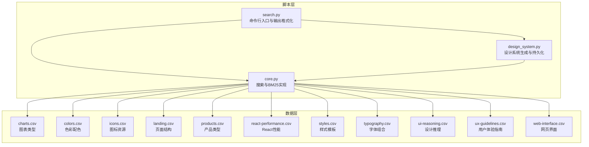
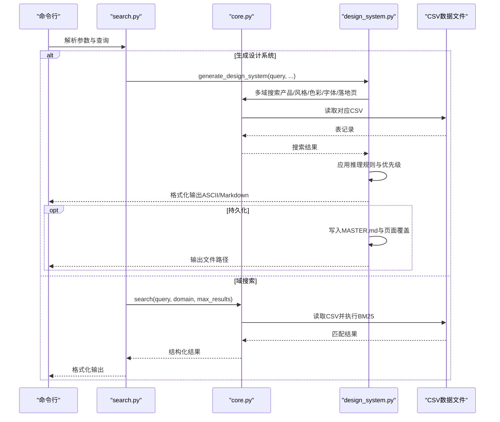
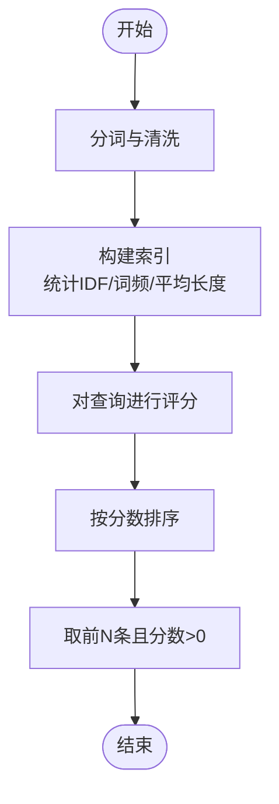
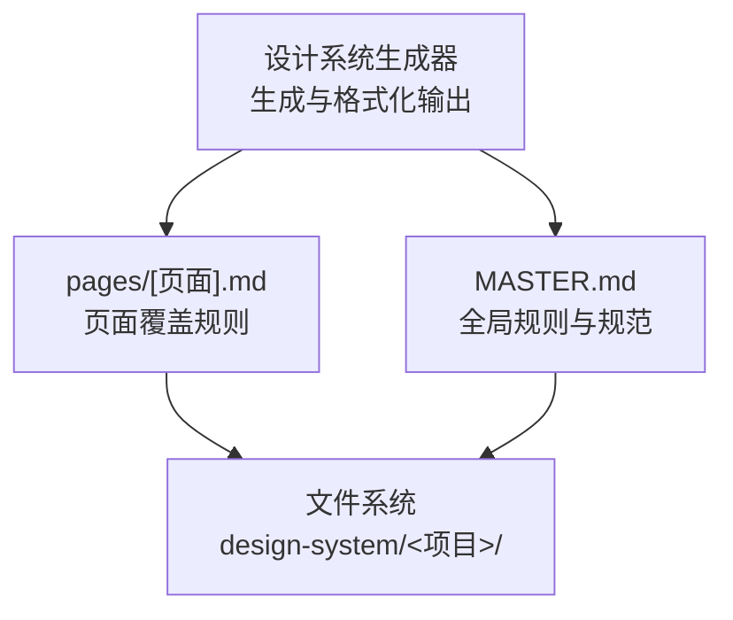
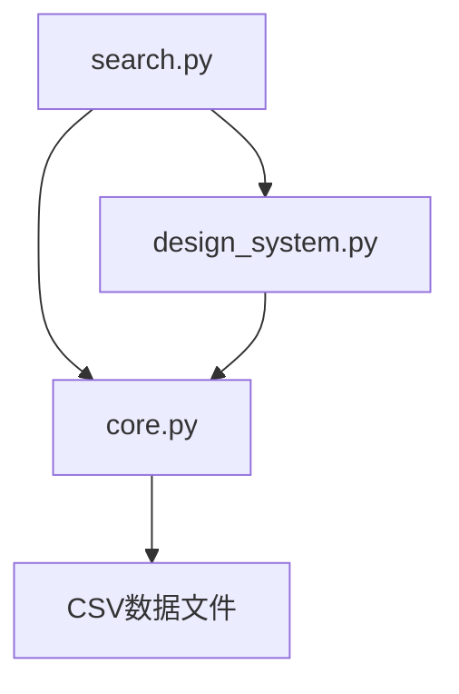

# 数据管理与存储

<cite>
**本文档引用的文件**
- [core.py](file://.cursor/skills/ui-ux-pro-max/scripts/core.py)
- [design_system.py](file://.cursor/skills/ui-ux-pro-max/scripts/design_system.py)
- [search.py](file://.cursor/skills/ui-ux-pro-max/scripts/search.py)
- [charts.csv](file://.cursor/skills/ui-ux-pro-max/data/charts.csv)
- [colors.csv](file://.cursor/skills/ui-ux-pro-max/data/colors.csv)
- [icons.csv](file://.cursor/skills/ui-ux-pro-max/data/icons.csv)
- [landing.csv](file://.cursor/skills/ui-ux-pro-max/data/landing.csv)
- [products.csv](file://.cursor/skills/ui-ux-pro-max/data/products.csv)
- [react-performance.csv](file://.cursor/skills/ui-ux-pro-max/data/react-performance.csv)
- [styles.csv](file://.cursor/skills/ui-ux-pro-max/data/styles.csv)
- [typography.csv](file://.cursor/skills/ui-ux-pro-max/data/typography.csv)
- [ui-reasoning.csv](file://.cursor/skills/ui-ux-pro-max/data/ui-reasoning.csv)
- [ux-guidelines.csv](file://.cursor/skills/ui-ux-pro-max/data/ux-guidelines.csv)
- [web-interface.csv](file://.cursor/skills/ui-ux-pro-max/data/web-interface.csv)
</cite>

## 目录
1. [简介](#简介)
2. [项目结构](#项目结构)
3. [核心组件](#核心组件)
4. [架构总览](#架构总览)
5. [详细组件分析](#详细组件分析)
6. [依赖关系分析](#依赖关系分析)
7. [性能考虑](#性能考虑)
8. [故障排除指南](#故障排除指南)
9. [结论](#结论)
10. [附录](#附录)

## 简介
本文件系统性梳理了数据管理与存储系统的设计与实现，覆盖以下方面：
- CSV数据文件的组织结构与字段定义：包含图表类型、色彩配色、图标资源、页面结构、产品类型、React性能、样式模板、字体组合、设计推理、用户体验指南、网页界面等11个数据表。
- 查询机制与搜索算法：基于BM25的文本相似度检索，支持多域搜索与自动域检测。
- 设计系统的持久化策略：采用MASTER.md主文件与pages子目录的层次化覆盖机制，确保全局规则与页面级定制的协同。

该系统既可作为内部知识库检索引擎，也可作为设计系统生成器，为不同技术栈提供一致的设计与实现建议。

## 项目结构
整体采用“脚本层 + 数据层”的分层架构：
- 脚本层：提供搜索、设计系统生成与持久化能力
- 数据层：以CSV形式组织各类UI/UX知识，便于版本控制与协作维护

**图示来源**
- [core.py](file://.cursor/skills/ui-ux-pro-max/scripts/core.py#L1-L254)
- [design_system.py](file://.cursor/skills/ui-ux-pro-max/scripts/design_system.py#L1-L1068)
- [search.py](file://.cursor/skills/ui-ux-pro-max/scripts/search.py#L1-L115)

**章节来源**
- [core.py](file://.cursor/skills/ui-ux-pro-max/scripts/core.py#L1-L254)
- [design_system.py](file://.cursor/skills/ui-ux-pro-max/scripts/design_system.py#L1-L1068)
- [search.py](file://.cursor/skills/ui-ux-pro-max/scripts/search.py#L1-L115)

## 核心组件
- 搜索引擎（BM25）
  - 实现文本分词、IDF计算与评分排序，支持跨列检索与结果裁剪
  - 自动域检测：根据关键词匹配推断最相关的数据域
- 多域搜索
  - 针对不同CSV配置执行搜索，统一输出结构化结果
- 设计系统生成器
  - 基于产品类别应用推理规则，聚合风格、色彩、字体、落地页模式等推荐
  - 支持持久化到MASTER.md与页面覆盖文件
- 命令行工具
  - 提供简洁CLI接口，支持JSON输出、Markdown/ASCII格式、持久化选项

**章节来源**
- [core.py](file://.cursor/skills/ui-ux-pro-max/scripts/core.py#L96-L231)
- [design_system.py](file://.cursor/skills/ui-ux-pro-max/scripts/design_system.py#L37-L236)
- [search.py](file://.cursor/skills/ui-ux-pro-max/scripts/search.py#L56-L115)

## 架构总览
下图展示从查询到输出的端到端流程，包括搜索、推理与持久化：

**图示来源**
- [search.py](file://.cursor/skills/ui-ux-pro-max/scripts/search.py#L56-L115)
- [core.py](file://.cursor/skills/ui-ux-pro-max/scripts/core.py#L158-L231)
- [design_system.py](file://.cursor/skills/ui-ux-pro-max/scripts/design_system.py#L163-L236)

## 详细组件分析

### CSV数据文件组织与字段定义
- charts.csv：描述25种图表类型，字段包括数据类型、关键词、最佳图表类型、颜色指导、交互等级、可访问性提示等
- colors.csv：提供96种产品类型的色彩方案，字段包括主色、次色、行动按钮色、背景、文字、边框及说明
- icons.csv：列举图标资源，字段包括分类、名称、关键词、库、导入代码、使用场景与风格
- landing.csv：定义32种落地页模式，字段包括模式名、关键词、节序、主要CTA位置、色彩策略、转化优化
- products.csv：覆盖97种产品类型，字段包括产品类型、关键词、主风格、次风格、落地页模式、仪表盘风格、色彩焦点与关键考虑
- react-performance.csv：涵盖React/Next.js性能优化清单，字段包括问题类别、关键词、平台、描述、做与不做、示例代码与严重程度
- styles.csv：包含69种设计风格，字段覆盖风格类别、类型、关键词、主次色彩、效果动画、适用场景、性能、可访问性、移动端友好度、转化导向、框架兼容性、时代起源、复杂度、AI提示关键词、CSS/技术关键词、实施清单与设计系统变量
- typography.csv：提供58组字体搭配，字段包括配对名称、类别、标题字体、正文字体、情绪/风格关键词、适用场景、Google Fonts链接、CSS导入、Tailwind配置与备注
- ui-reasoning.csv：包含102条设计推理规则，字段包括UI类别、推荐模式、风格优先级、色彩情绪、字体情绪、关键效果、决策规则、反模式与严重程度
- ux-guidelines.csv：提供100条UX指南，字段包括类别、问题、平台、描述、做与不做、代码示例好/坏与严重程度
- web-interface.csv：包含32条Web界面规范，字段包括类别、问题、关键词、平台、描述、做与不做、代码示例好/坏与严重程度

```mermaid
erDiagram
CHARTS {
int No
string Data_Type
string Keywords
string Best_Chart_Type
string Secondary_Options
string Color_Guidance
string Performance_Impact
string Accessibility_Notes
string Library_Recommendation
string Interactive_Level
}
COLORS {
int No
string Product_Type
string Primary_Hex
string Secondary_Hex
string CTA_Hex
string Background_Hex
string Text_Hex
string Border_Hex
string Notes
}
ICONS {
int No
string Category
string Icon_Name
string Keywords
string Library
string Import_Code
string Usage
string Best_For
string Style
}
LANDING {
int No
string Pattern_Name
string Keywords
string Section_Order
string Primary_CTA_Placement
string Color_Strategy
string Recommended_Effects
string Conversion_Optimization
}
PRODUCTS {
int No
string Product_Type
string Keywords
string Primary_Style_Recommendation
string Secondary_Styles
string Landing_Page_Pattern
string Dashboard_Style
string Color_Palette_Focus
string Key_Considerations
}
REACT {
int No
string Category
string Issue
string Keywords
string Platform
string Description
string Do
string Dont
string Code_Example_Good
string Code_Example_Bad
string Severity
}
STYLES {
int No
string Style_Category
string Type
string Keywords
string Primary_Colors
string Secondary_Colors
string Effects_Animation
string Best_For
string Do_Not_Use_For
string Light_Mode
string Dark_Mode
string Performance
string Accessibility
string Mobile_Friendly
string Conversion_Focused
string Framework_Compatibility
string Era_Origin
string Complexity
string AI_Prompt_Keywords
string CSS_Technical_Keywords
string Implementation_Checklist
string Design_System_Variables
}
TYPOGRAPHY {
int No
string Font_Pairing_Name
string Category
string Heading_Font
string Body_Font
string Mood_Style_Keywords
string Best_For
string Google_Fonts_URL
string CSS_Import
string Tailwind_Config
string Notes
}
UI_REASONING {
int No
string UI_Category
string Recommended_Pattern
string Style_Priority
string Color_Mood
string Typography_Mood
string Key_Effects
string Decision_Rules
string Anti_Patterns
string Severity
}
UX_GUIDELINES {
int No
string Category
string Issue
string Platform
string Description
string Do
string Dont
string Code_Example_Good
string Code_Example_Bad
string Severity
}
WEB_INTERFACE {
int No
string Category
string Issue
string Keywords
string Platform
string Description
string Do
string Dont
string Code_Example_Good
string Code_Example_Bad
string Severity
}
```

**图示来源**
- [charts.csv](file://.cursor/skills/ui-ux-pro-max/data/charts.csv#L1-L27)
- [colors.csv](file://.cursor/skills/ui-ux-pro-max/data/colors.csv#L1-L98)
- [icons.csv](file://.cursor/skills/ui-ux-pro-max/data/icons.csv#L1-L102)
- [landing.csv](file://.cursor/skills/ui-ux-pro-max/data/landing.csv#L1-L32)
- [products.csv](file://.cursor/skills/ui-ux-pro-max/data/products.csv#L1-L97)
- [react-performance.csv](file://.cursor/skills/ui-ux-pro-max/data/react-performance.csv#L1-L46)
- [styles.csv](file://.cursor/skills/ui-ux-pro-max/data/styles.csv#L1-L69)
- [typography.csv](file://.cursor/skills/ui-ux-pro-max/data/typography.csv#L1-L58)
- [ui-reasoning.csv](file://.cursor/skills/ui-ux-pro-max/data/ui-reasoning.csv#L1-L102)
- [ux-guidelines.csv](file://.cursor/skills/ui-ux-pro-max/data/ux-guidelines.csv#L1-L100)
- [web-interface.csv](file://.cursor/skills/ui-ux-pro-max/data/web-interface.csv#L1-L32)

**章节来源**
- [charts.csv](file://.cursor/skills/ui-ux-pro-max/data/charts.csv#L1-L27)
- [colors.csv](file://.cursor/skills/ui-ux-pro-max/data/colors.csv#L1-L98)
- [icons.csv](file://.cursor/skills/ui-ux-pro-max/data/icons.csv#L1-L102)
- [landing.csv](file://.cursor/skills/ui-ux-pro-max/data/landing.csv#L1-L32)
- [products.csv](file://.cursor/skills/ui-ux-pro-max/data/products.csv#L1-L97)
- [react-performance.csv](file://.cursor/skills/ui-ux-pro-max/data/react-performance.csv#L1-L46)
- [styles.csv](file://.cursor/skills/ui-ux-pro-max/data/styles.csv#L1-L69)
- [typography.csv](file://.cursor/skills/ui-ux-pro-max/data/typography.csv#L1-L58)
- [ui-reasoning.csv](file://.cursor/skills/ui-ux-pro-max/data/ui-reasoning.csv#L1-L102)
- [ux-guidelines.csv](file://.cursor/skills/ui-ux-pro-max/data/ux-guidelines.csv#L1-L100)
- [web-interface.csv](file://.cursor/skills/ui-ux-pro-max/data/web-interface.csv#L1-L32)

### 查询机制与BM25算法
- 文本预处理：小写化、去标点、过滤短词
- 索引构建：统计词频、计算IDF、求平均文档长度
- 评分公式：基于BM25标准公式，结合词频与长度归一化
- 结果筛选：按分数降序取前N条，仅返回正分值

**图示来源**
- [core.py](file://.cursor/skills/ui-ux-pro-max/scripts/core.py#L96-L156)

**章节来源**
- [core.py](file://.cursor/skills/ui-ux-pro-max/scripts/core.py#L96-L156)

### 设计系统持久化策略（MASTER.md + pages）
- 主文件（MASTER.md）：集中定义全局色彩、字体、间距、阴影、组件规范与风格指南
- 页面覆盖（pages/*.md）：针对特定页面提供覆盖规则，遵循“先查页面覆盖，再回退到MASTER”的层次化检索机制
- 自动生成：通过设计系统生成器输出ASCII或Markdown格式，并可选择持久化到指定目录

**图示来源**
- [design_system.py](file://.cursor/skills/ui-ux-pro-max/scripts/design_system.py#L491-L539)

**章节来源**
- [design_system.py](file://.cursor/skills/ui-ux-pro-max/scripts/design_system.py#L491-L539)

## 依赖关系分析
- 模块耦合
  - core.py独立负责CSV加载与BM25搜索，低耦合高内聚
  - design_system.py依赖core.py的搜索结果，并引入推理规则
  - search.py作为CLI入口，协调core与design_system
- 外部依赖
  - Python标准库（csv、pathlib、collections、math、argparse等）
  - 无第三方外部包，便于部署与维护

**图示来源**
- [search.py](file://.cursor/skills/ui-ux-pro-max/scripts/search.py#L17-L21)
- [core.py](file://.cursor/skills/ui-ux-pro-max/scripts/core.py#L14-L15)

**章节来源**
- [search.py](file://.cursor/skills/ui-ux-pro-max/scripts/search.py#L17-L21)
- [core.py](file://.cursor/skills/ui-ux-pro-max/scripts/core.py#L14-L15)

## 性能考虑
- 搜索性能
  - BM25适合中等规模CSV数据；若数据量增长，建议分片或引入倒排索引
  - 限制最大结果数（默认3），避免过度渲染
- I/O优化
  - CSV逐文件读取，建议在生产环境启用缓存或内存映射
- 输出优化
  - CLI输出截断长字段，减少Token占用
  - Markdown/ASCII两种格式，按需选择

[本节为通用指导，不直接分析具体文件]

## 故障排除指南
- 文件缺失
  - 若某CSV文件不存在，搜索会返回错误信息，检查DATA_DIR路径与文件名
- 结果为空
  - 调整查询关键词或指定域；确认CSV字段是否包含目标内容
- 域检测偏差
  - 使用--domain显式指定域，或在查询中加入更明确的关键词
- 持久化失败
  - 确认输出目录权限；检查项目名与页面名的命名规范（小写、连字符）

**章节来源**
- [core.py](file://.cursor/skills/ui-ux-pro-max/scripts/core.py#L212-L231)
- [search.py](file://.cursor/skills/ui-ux-pro-max/scripts/search.py#L108-L115)
- [design_system.py](file://.cursor/skills/ui-ux-pro-max/scripts/design_system.py#L528-L539)

## 结论
该数据管理与存储系统以CSV为核心载体，结合BM25检索与设计推理，实现了从知识检索到设计系统生成的完整闭环。通过MASTER.md与pages的层次化覆盖，既能保证全局一致性，又能灵活适配页面差异。建议在团队内推广此体系，持续完善各CSV数据表，提升搜索质量与设计产出效率。

[本节为总结性内容，不直接分析具体文件]

## 附录
- 常用命令
  - 域搜索：python search.py "关键词" --domain style
  - 设计系统：python search.py "SaaS仪表盘" --design-system -p "MyProject" --persist --page "dashboard"
  - 栈指南：python search.py "React性能" --stack react
- 输出格式
  - ASCII盒装格式（默认）：适合终端阅读
  - Markdown格式：适合文档导出与分享

[本节为操作指引，不直接分析具体文件]