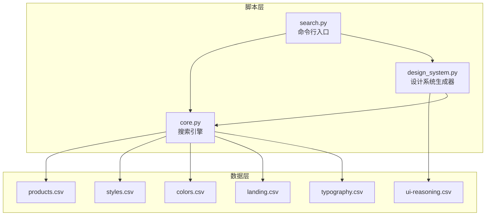
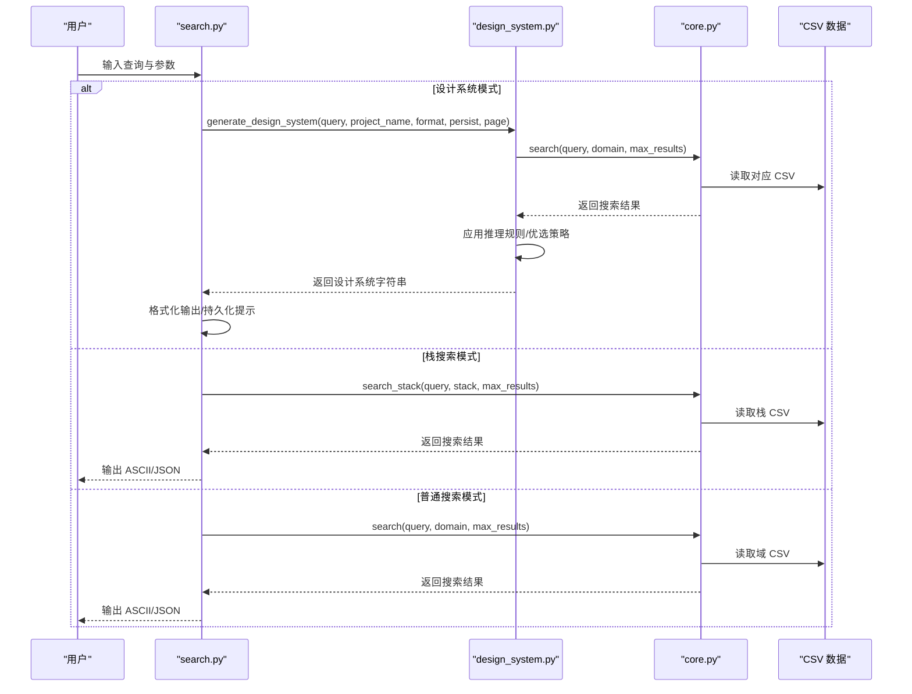
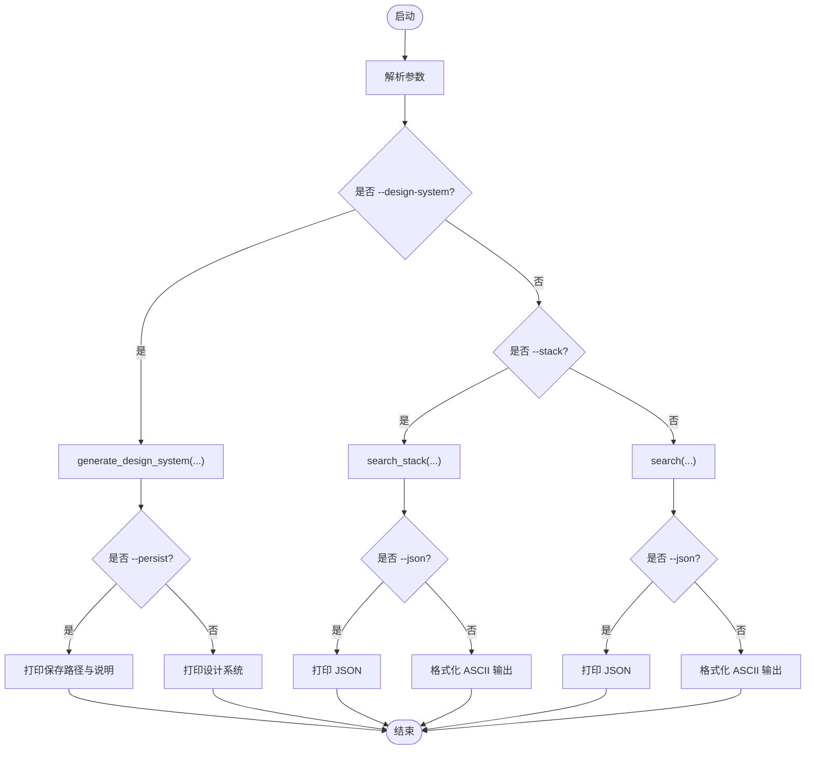
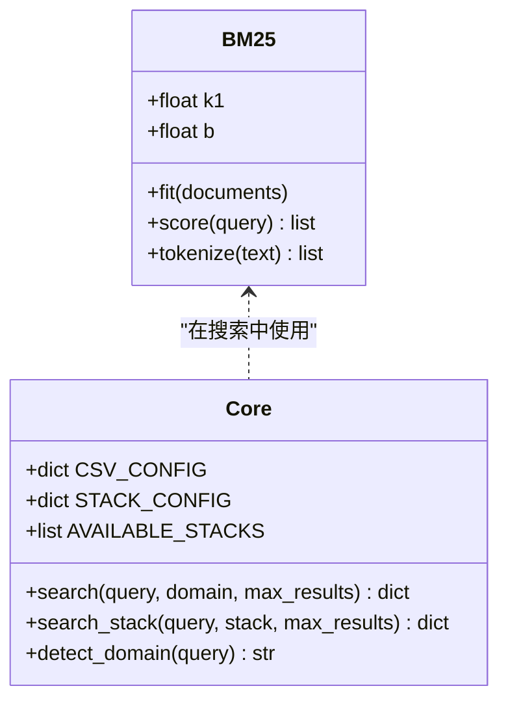
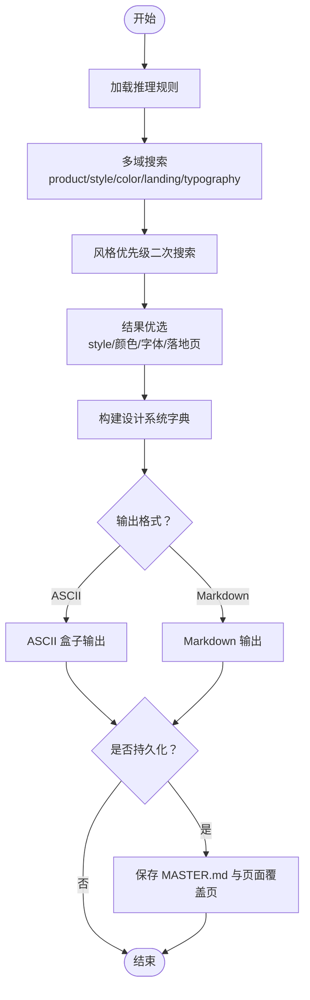
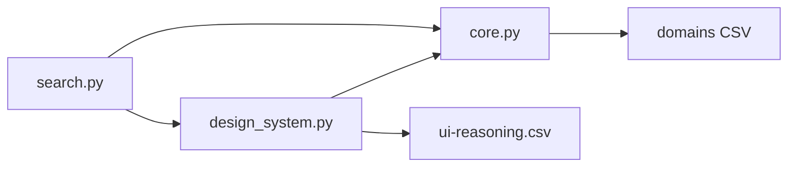

# 脚本工具集

<cite>
**本文档引用的文件**
- [search.py](file://.cursor/skills/ui-ux-pro-max/scripts/search.py)
- [core.py](file://.cursor/skills/ui-ux-pro-max/scripts/core.py)
- [design_system.py](file://.cursor/skills/ui-ux-pro-max/scripts/design_system.py)
- [products.csv](file://.cursor/skills/ui-ux-pro-max/data/products.csv)
- [styles.csv](file://.cursor/skills/ui-ux-pro-max/data/styles.csv)
- [colors.csv](file://.cursor/skills/ui-ux-pro-max/data/colors.csv)
- [ui-reasoning.csv](file://.cursor/skills/ui-ux-pro-max/data/ui-reasoning.csv)
- [landing.csv](file://.cursor/skills/ui-ux-pro-max/data/landing.csv)
- [typography.csv](file://.cursor/skills/ui-ux-pro-max/data/typography.csv)
</cite>

## 目录
1. [简介](#简介)
2. [项目结构](#项目结构)
3. [核心组件](#核心组件)
4. [架构总览](#架构总览)
5. [详细组件分析](#详细组件分析)
6. [依赖关系分析](#依赖关系分析)
7. [性能考虑](#性能考虑)
8. [故障排除指南](#故障排除指南)
9. [结论](#结论)
10. [附录：命令行使用示例与最佳实践](#附录命令行使用示例与最佳实践)

## 简介
本工具集为 UI/UX 设计与前端工程团队提供智能化搜索与设计系统生成能力，支持：
- 多域并行搜索：style、color、chart、landing、product、ux、typography、icons、react、web 等领域
- 栈特定搜索：html-tailwind、react、nextjs、astro、vue、nuxtjs、nuxt-ui、svelte、swiftui、react-native、flutter、shadcn、jetpack-compose
- 智能设计系统生成：基于产品类型自动推理页面模式、风格优先级、配色与字体建议，并支持 Master + Overrides 层次化持久化

工具通过 BM25 排序算法实现高质量文本检索，结合“推理规则”对结果进行优先级与排序优化，最终输出 ASCII 或 Markdown 格式的可交付设计系统。

## 项目结构
脚本工具集位于 `.cursor/skills/ui-ux-pro-max/scripts`，数据资源位于 `.cursor/skills/ui-ux-pro-max/data`。核心文件如下：
- scripts/search.py：命令行入口，负责参数解析、调用搜索与设计系统生成、输出格式化与持久化提示
- scripts/core.py：核心搜索引擎，定义 CSV 配置、栈配置、BM25 实现、自动域检测与搜索函数
- scripts/design_system.py：设计系统生成器，负责多域聚合搜索、推理规则应用、结果优选与输出格式化，以及 Master + Overrides 模式持久化
- data/*.csv：各领域的知识库数据，驱动搜索与设计系统生成

**图表来源**
- [search.py](file://.cursor/skills/ui-ux-pro-max/scripts/search.py#L1-L115)
- [core.py](file://.cursor/skills/ui-ux-pro-max/scripts/core.py#L1-L254)
- [design_system.py](file://.cursor/skills/ui-ux-pro-max/scripts/design_system.py#L1-L1068)
- [products.csv](file://.cursor/skills/ui-ux-pro-max/data/products.csv#L1-L97)
- [styles.csv](file://.cursor/skills/ui-ux-pro-max/data/styles.csv#L1-L69)
- [colors.csv](file://.cursor/skills/ui-ux-pro-max/data/colors.csv#L1-L98)
- [ui-reasoning.csv](file://.cursor/skills/ui-ux-pro-max/data/ui-reasoning.csv#L1-L102)
- [landing.csv](file://.cursor/skills/ui-ux-pro-max/data/landing.csv#L1-L32)
- [typography.csv](file://.cursor/skills/ui-ux-pro-max/data/typography.csv#L1-L58)

**章节来源**
- [search.py](file://.cursor/skills/ui-ux-pro-max/scripts/search.py#L1-L115)
- [core.py](file://.cursor/skills/ui-ux-pro-max/scripts/core.py#L1-L254)
- [design_system.py](file://.cursor/skills/ui-ux-pro-max/scripts/design_system.py#L1-L1068)

## 核心组件
- 命令行入口 search.py
  - 支持普通搜索、栈特定搜索、设计系统生成三种模式
  - 输出格式：ASCII 或 JSON；设计系统输出：ASCII 或 Markdown
  - 支持持久化：Master + Overrides 模式，按项目名分目录存储
- 核心引擎 core.py
  - CSV 配置：定义每个域的搜索列与输出列
  - 栈配置：定义各前端技术栈的指南文件
  - BM25 搜索：对文档向量进行词元化、IDF 计算与打分排序
  - 自动域检测：根据关键词统计匹配度，自动推断最相关域
  - 多域搜索与栈搜索：统一返回结构便于上层消费
- 设计系统 design_system.py
  - 多域聚合搜索：product、style、color、landing、typography，按域权重与优先级组合
  - 推理规则：从 ui-reasoning.csv 加载决策规则，生成页面模式、风格优先级、色彩情绪、字体情绪、关键效果与反模式
  - 结果优选：针对 style 结果使用优先关键词进行二次筛选
  - 输出格式：ASCII（MCP 风格盒子）与 Markdown
  - 持久化：生成 MASTER.md 与页面覆盖页，遵循“先查页面覆盖，再回退到 Master”的层次化逻辑

**章节来源**
- [search.py](file://.cursor/skills/ui-ux-pro-max/scripts/search.py#L56-L115)
- [core.py](file://.cursor/skills/ui-ux-pro-max/scripts/core.py#L158-L254)
- [design_system.py](file://.cursor/skills/ui-ux-pro-max/scripts/design_system.py#L36-L237)

## 架构总览
下图展示从命令行到数据层的整体调用链路与数据流向：

**图表来源**
- [search.py](file://.cursor/skills/ui-ux-pro-max/scripts/search.py#L56-L115)
- [core.py](file://.cursor/skills/ui-ux-pro-max/scripts/core.py#L158-L254)
- [design_system.py](file://.cursor/skills/ui-ux-pro-max/scripts/design_system.py#L461-L488)

## 详细组件分析

### 组件一：search.py 命令行入口
- 功能要点
  - 参数解析：支持 --domain、--stack、--max-results、--json、--design-system、--project-name、--format、--persist、--page、--output-dir
  - 输出格式：默认 ASCII，支持 --json 与 --format ascii/markdown
  - 设计系统持久化：当启用 --persist 时，打印保存路径与使用说明
- 控制流
  - 若传入 --design-system：调用 generate_design_system 并按需持久化
  - 否则若传入 --stack：调用 search_stack
  - 否则调用 search 并格式化输出

**图表来源**
- [search.py](file://.cursor/skills/ui-ux-pro-max/scripts/search.py#L56-L115)

**章节来源**
- [search.py](file://.cursor/skills/ui-ux-pro-max/scripts/search.py#L56-L115)

### 组件二：core.py 搜索引擎
- 数据配置
  - CSV_CONFIG：定义每个域的文件名、搜索列与输出列
  - STACK_CONFIG：定义各前端技术栈的 CSV 文件
  - 可用栈列表：AVAILABLE_STACKS
- BM25 实现
  - 词元化：小写、去标点、过滤短词
  - IDF 计算：基于文档频率
  - 打分：TF-IDF 与长度归一化
  - 排序：按分数降序，取前 N 且分数 > 0 的结果
- 自动域检测
  - 基于关键词集合统计命中数，返回最高分域；若无命中，默认 style
- 搜索函数
  - search：支持自动域检测或指定域
  - search_stack：支持指定栈的搜索

**图表来源**
- [core.py](file://.cursor/skills/ui-ux-pro-max/scripts/core.py#L95-L156)
- [core.py](file://.cursor/skills/ui-ux-pro-max/scripts/core.py#L158-L254)

**章节来源**
- [core.py](file://.cursor/skills/ui-ux-pro-max/scripts/core.py#L14-L254)

### 组件三：design_system.py 设计系统生成器
- 多域搜索配置
  - product/max_results=1
  - style/max_results=3
  - color/max_results=2
  - landing/max_results=2
  - typography/max_results=2
- 推理规则加载
  - 从 ui-reasoning.csv 读取规则，支持精确匹配、部分匹配与关键词匹配
  - 规则字段：推荐模式、风格优先级、色彩情绪、字体情绪、关键效果、决策规则、反模式、严重性
- 结果优选策略
  - style：使用风格优先级关键词进行二次检索，然后按关键词匹配得分优选
  - 其他域：直接取第一条或前若干条
- 输出格式
  - ASCII：MCP 风格盒子，包含目标项目、页面模式、风格、配色、字体、关键效果、反模式与交付清单
  - Markdown：结构化章节，含表格、代码块与清单
- 持久化（Master + Overrides）
  - MASTER.md：全局规则、颜色变量、字体、间距变量、阴影深度、组件规范、风格指南、页面模式、反模式与交付清单
  - 页面覆盖页：仅记录与 Master 不同的规则，遵循“先查页面覆盖，再回退 Master”的原则

**图表来源**
- [design_system.py](file://.cursor/skills/ui-ux-pro-max/scripts/design_system.py#L36-L237)
- [design_system.py](file://.cursor/skills/ui-ux-pro-max/scripts/design_system.py#L490-L540)

**章节来源**
- [design_system.py](file://.cursor/skills/ui-ux-pro-max/scripts/design_system.py#L24-L237)
- [design_system.py](file://.cursor/skills/ui-ux-pro-max/scripts/design_system.py#L490-L803)
- [design_system.py](file://.cursor/skills/ui-ux-pro-max/scripts/design_system.py#L805-L1068)

## 依赖关系分析
- 组件耦合
  - search.py 依赖 core.py 的搜索函数与常量，依赖 design_system.py 的设计系统生成与持久化
  - design_system.py 依赖 core.py 的 search 函数与数据目录，依赖 ui-reasoning.csv 的推理规则
- 外部依赖
  - CSV 文件作为只读知识库，驱动搜索与设计系统生成
  - 命令行输出编码强制 UTF-8，确保跨平台显示表情符号

**图表来源**
- [search.py](file://.cursor/skills/ui-ux-pro-max/scripts/search.py#L17-L21)
- [core.py](file://.cursor/skills/ui-ux-pro-max/scripts/core.py#L14-L15)
- [design_system.py](file://.cursor/skills/ui-ux-pro-max/scripts/design_system.py#L21-L25)

**章节来源**
- [search.py](file://.cursor/skills/ui-ux-pro-max/scripts/search.py#L17-L21)
- [core.py](file://.cursor/skills/ui-ux-pro-max/scripts/core.py#L14-L15)
- [design_system.py](file://.cursor/skills/ui-ux-pro-max/scripts/design_system.py#L21-L25)

## 性能考虑
- BM25 打分复杂度
  - fit 文档阶段：O(N×L)，N 为文档数，L 为平均词数
  - score 查询阶段：O(Q×L_avg)，Q 为查询词数，L_avg 为平均文档长度
  - 整体适合中小规模 CSV 数据，建议控制 max_results 与搜索列数量
- I/O 优化
  - CSV 文件按需读取，避免重复加载
  - UTF-8 强制输出减少编码转换开销
- 内存占用
  - BM25 存储词频与 IDF，内存与词汇表大小相关
  - 建议在大规模数据场景下采用外部索引或分片策略

[本节为通用指导，不直接分析具体文件]

## 故障排除指南
- 编码问题（Windows 默认 cp1252）
  - 工具强制将 stdout/stderr 编码设置为 UTF-8，确保表情符号与中文正常显示
- 文件缺失
  - 当某域或栈对应的 CSV 文件不存在时，返回错误信息，包含文件路径与可用域/栈列表
- 未知栈
  - 当 --stack 传入未注册的栈名称时，返回可用栈列表
- 输出格式
  - --json 与 --format ascii/markdown 互斥使用时以 --json 为准（当前实现中，--json 会覆盖 ASCII 格式）

**章节来源**
- [search.py](file://.cursor/skills/ui-ux-pro-max/scripts/search.py#L23-L27)
- [core.py](file://.cursor/skills/ui-ux-pro-max/scripts/core.py#L234-L253)

## 结论
该脚本工具集通过“搜索 + 推理 + 优选 + 持久化”的闭环，为 UI/UX 设计与前端开发提供了高效率的设计系统生成与知识检索能力。其优势在于：
- 多域并行搜索与 BM25 排序保证了检索质量
- 推理规则驱动的优先级与结果优选提升了实用性
- Master + Overrides 的层次化持久化保障了团队协作的一致性与灵活性
建议在实际项目中结合 CI/CD 将设计系统生成流程自动化，并将生成物纳入版本管理，以便快速迭代与复用。

[本节为总结性内容，不直接分析具体文件]

## 附录：命令行使用示例与最佳实践

### 命令行使用示例
- 普通搜索（按域）
  - 示例：python search.py "SaaS 仪表盘配色方案" -d color -n 2
  - 输出：ASCII 格式，包含来源、结果数量与每条结果的关键字段摘要
- 栈特定搜索
  - 示例：python search.py "Next.js 性能优化" -s nextjs -n 3 --json
  - 输出：JSON 格式，便于程序化处理
- 设计系统生成（ASCII）
  - 示例：python search.py "SaaS 仪表盘" --design-system -p "MyProject" -f ascii
  - 输出：ASCII 盒子样式的设计系统，包含页面模式、风格、配色、字体、关键效果与反模式
- 设计系统生成（Markdown）
  - 示例：python search.py "电商奢侈品 landing" --design-system -p "LuxuryShop" -f markdown
  - 输出：Markdown 格式，便于嵌入文档或知识库
- 设计系统持久化（Master + Overrides）
  - 示例：python search.py "微 SAAS 登录页" --design-system -p "MiniSaaS" --persist --page "login"
  - 输出：打印保存路径与使用说明，生成 design-system/my-project/Master.md 与 pages/login.md

### 参数说明
- 位置参数
  - query：搜索关键词或产品描述
- 可选参数
  - --domain, -d：指定搜索域（style、color、chart、landing、product、ux、typography、icons、react、web）
  - --stack, -s：指定栈（html-tailwind、react、nextjs、astro、vue、nuxtjs、nuxt-ui、svelte、swiftui、react-native、flutter、shadcn、jetpack-compose）
  - --max-results, -n：最大返回结果数（默认 3）
  - --json：以 JSON 格式输出
  - --design-system, -ds：生成完整设计系统
  - --project-name, -p：项目名称（用于输出标题与持久化目录）
  - --format, -f：设计系统输出格式（ascii、markdown，默认 ascii）
  - --persist：持久化设计系统至 design-system/<project>/MASTER.md
  - --page：生成页面覆盖文件 design-system/<project>/pages/[page].md
  - --output-dir, -o：持久化输出目录（默认当前工作目录）

### 输出格式选择
- ASCII：适合终端阅读与快速审阅，包含 MCP 风格盒子与预交付清单
- Markdown：适合文档化与知识沉淀，包含结构化章节与代码片段

### 错误处理
- 文件缺失：返回包含文件路径的错误信息
- 未知栈：返回可用栈列表
- 编码问题：自动切换 UTF-8 输出

### 开发工作流最佳实践
- 在需求评审阶段使用普通搜索快速验证设计方向
- 使用设计系统生成器产出初版设计系统，随后在页面级别使用 --page 生成覆盖项
- 将 --persist 产物纳入版本控制，配合分支策略管理不同项目的覆盖项
- 在 CI 中集成设计系统生成步骤，确保每次变更都能自动生成并校验一致性
- 对于多语言或多地区项目，结合 typography 与 color 数据库选择合适的字体与配色方案

**章节来源**
- [search.py](file://.cursor/skills/ui-ux-pro-max/scripts/search.py#L5-L15)
- [search.py](file://.cursor/skills/ui-ux-pro-max/scripts/search.py#L56-L115)
- [design_system.py](file://.cursor/skills/ui-ux-pro-max/scripts/design_system.py#L461-L488)