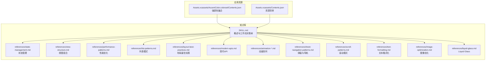
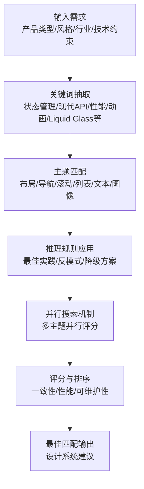
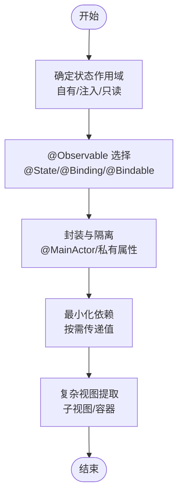
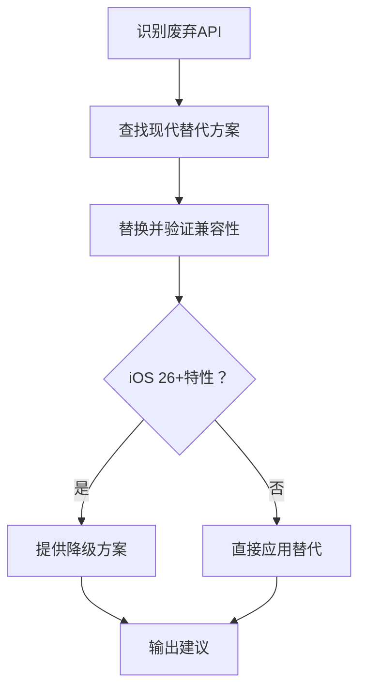
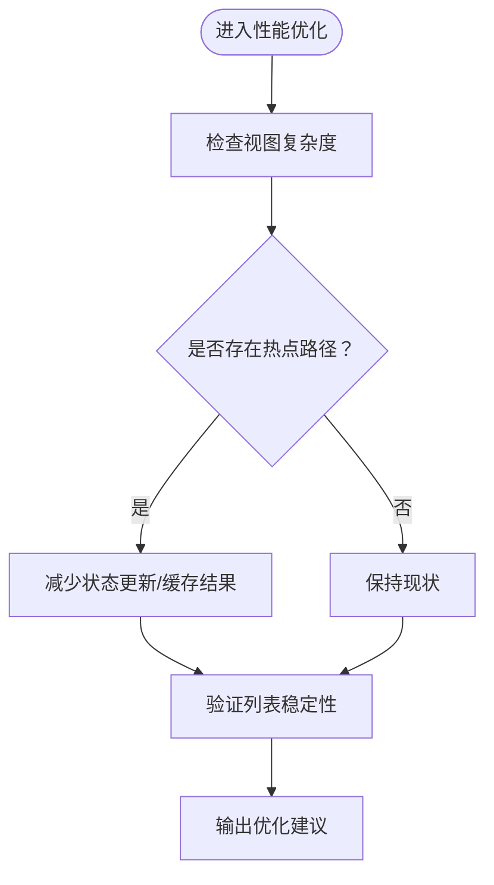
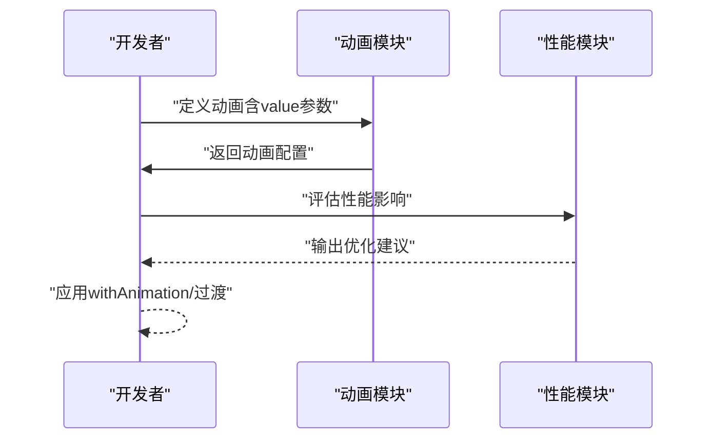
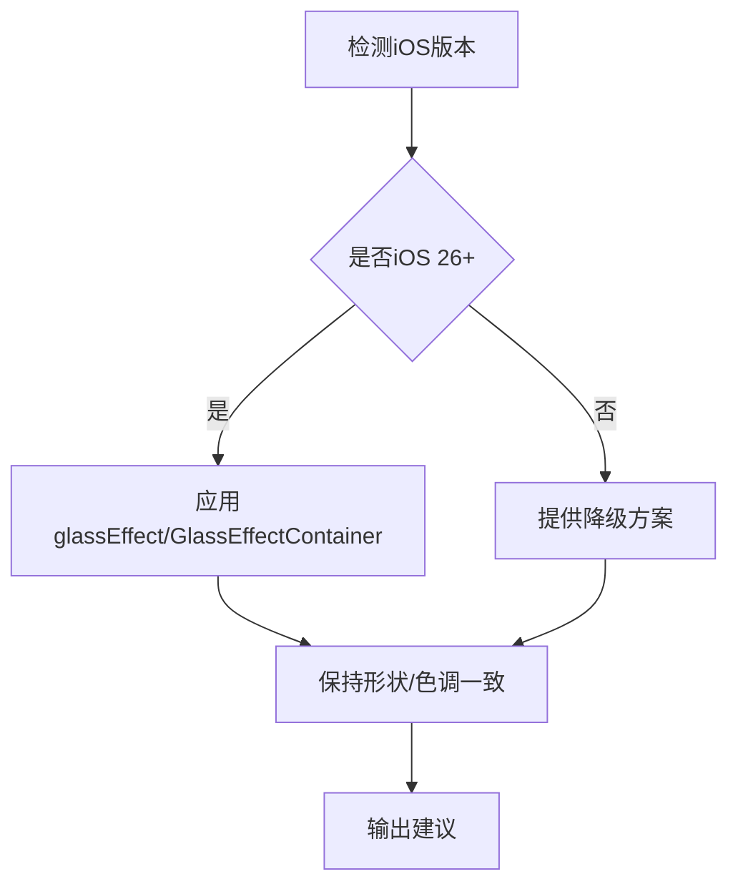
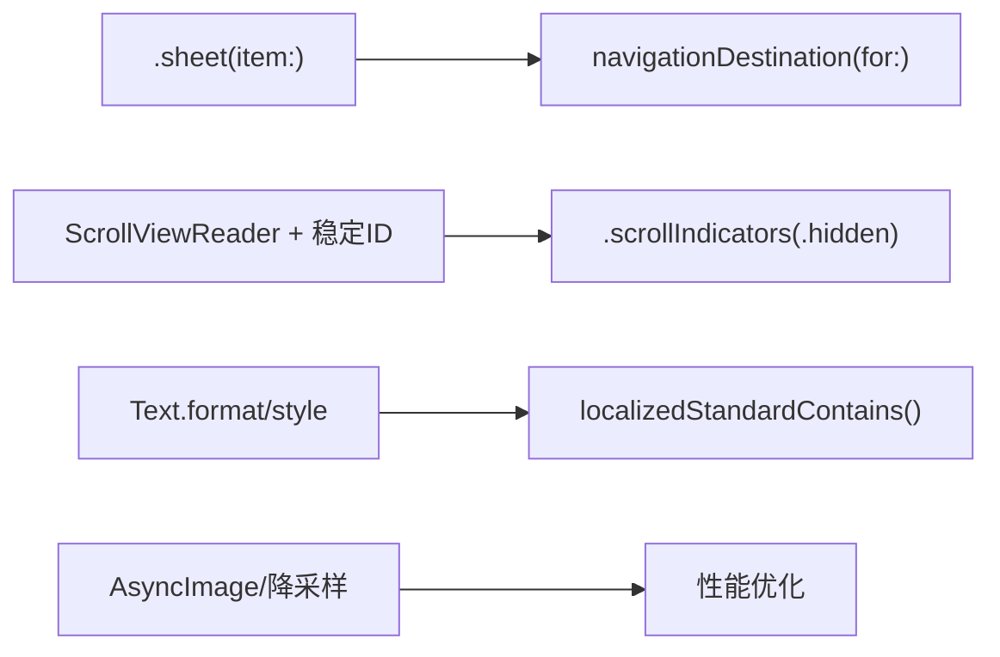
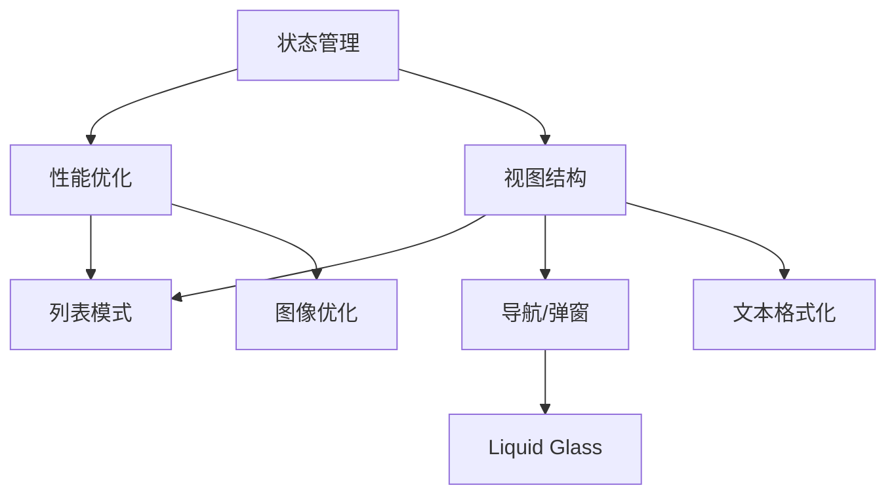
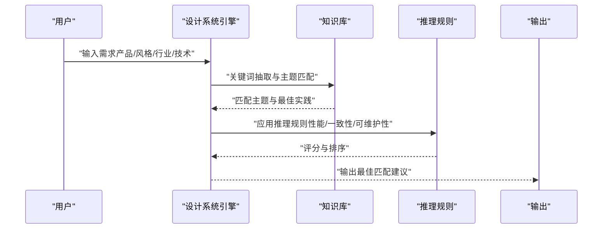

# 设计系统基础

<cite>
**本文档引用的文件**
- [.agents/skills/swiftui-expert-skill/SKILL.md](file://.agents/skills/swiftui-expert-skill/SKILL.md)
- [.agents/skills/swiftui-expert-skill/SKILL.en.md](file://.agents/skills/swiftui-expert-skill/SKILL.en.md)
- [.agents/skills/swiftui-expert-skill/references/state-management.md](file://.agents/skills/swiftui-expert-skill/references/state-management.md)
- [.agents/skills/swiftui-expert-skill/references/view-structure.md](file://.agents/skills/swiftui-expert-skill/references/view-structure.md)
- [.agents/skills/swiftui-expert-skill/references/performance-patterns.md](file://.agents/skills/swiftui-expert-skill/references/performance-patterns.md)
- [.agents/skills/swiftui-expert-skill/references/list-patterns.md](file://.agents/skills/swiftui-expert-skill/references/list-patterns.md)
- [.agents/skills/swiftui-expert-skill/references/layout-best-practices.md](file://.agents/skills/swiftui-expert-skill/references/layout-best-practices.md)
- [.agents/skills/swiftui-expert-skill/references/modern-apis.md](file://.agents/skills/swiftui-expert-skill/references/modern-apis.md)
- [.agents/skills/swiftui-expert-skill/references/animation-basics.md](file://.agents/skills/swiftui-expert-skill/references/animation-basics.md)
- [.agents/skills/swiftui-expert-skill/references/animation-transitions.md](file://.agents/skills/swiftui-expert-skill/references/animation-transitions.md)
- [.agents/skills/swiftui-expert-skill/references/animation-advanced.md](file://.agents/skills/swiftui-expert-skill/references/animation-advanced.md)
- [.agents/skills/swiftui-expert-skill/references/sheet-navigation-patterns.md](file://.agents/skills/swiftui-expert-skill/references/sheet-navigation-patterns.md)
- [.agents/skills/swiftui-expert-skill/references/scroll-patterns.md](file://.agents/skills/swiftui-expert-skill/references/scroll-patterns.md)
- [.agents/skills/swiftui-expert-skill/references/text-formatting.md](file://.agents/skills/swiftui-expert-skill/references/text-formatting.md)
- [.agents/skills/swiftui-expert-skill/references/image-optimization.md](file://.agents/skills/swiftui-expert-skill/references/image-optimization.md)
- [.agents/skills/swiftui-expert-skill/references/liquid-glass.md](file://.agents/skills/swiftui-expert-skill/references/liquid-glass.md)
- [Cutting_board/Assets.xcassets/AccentColor.colorset/Contents.json](file://Cutting_board/Assets.xcassets/AccentColor.colorset/Contents.json)
- [Cutting_board/Assets.xcassets/Contents.json](file://Cutting_board/Assets.xcassets/Contents.json)
</cite>

## 目录
1. [引言](#引言)
2. [项目结构](#项目结构)
3. [核心组件](#核心组件)
4. [架构总览](#架构总览)
5. [详细组件分析](#详细组件分析)
6. [依赖分析](#依赖分析)
7. [性能考虑](#性能考虑)
8. [故障排查指南](#故障排查指南)
9. [结论](#结论)
10. [附录](#附录)

## 引言
本文件面向“设计系统基础”的目标，系统化阐述设计系统的概念、构成要素与构建原则，并结合仓库中现有的 SwiftUI 最佳实践知识库，给出可落地的设计系统生成工作流程与输出格式建议。由于仓库当前未包含设计系统生成的 Python 脚本与 CSV 数据集，本文在“设计系统生成”部分以“概念性流程”呈现，帮助读者在已有知识库基础上扩展实现。

## 项目结构
仓库包含一个 SwiftUI 专家技能知识库与一个 Xcode 应用工程资源。知识库以 Markdown 形式组织，涵盖状态管理、视图结构、性能优化、列表模式、布局最佳实践、现代 API、动画、弹窗与导航、滚动、文本格式化、图像优化、Liquid Glass 等主题；Xcode 工程包含应用图标与颜色集合等资源。

**图表来源**
- [.agents/skills/swiftui-expert-skill/SKILL.md](file://.agents/skills/swiftui-expert-skill/SKILL.md#L1-L293)
- [.agents/skills/swiftui-expert-skill/references/state-management.md](file://.agents/skills/swiftui-expert-skill/references/state-management.md)
- [.agents/skills/swiftui-expert-skill/references/view-structure.md](file://.agents/skills/swiftui-expert-skill/references/view-structure.md)
- [.agents/skills/swiftui-expert-skill/references/performance-patterns.md](file://.agents/skills/swiftui-expert-skill/references/performance-patterns.md)
- [.agents/skills/swiftui-expert-skill/references/list-patterns.md](file://.agents/skills/swiftui-expert-skill/references/list-patterns.md)
- [.agents/skills/swiftui-expert-skill/references/layout-best-practices.md](file://.agents/skills/swiftui-expert-skill/references/layout-best-practices.md)
- [.agents/skills/swiftui-expert-skill/references/modern-apis.md](file://.agents/skills/swiftui-expert-skill/references/modern-apis.md)
- [.agents/skills/swiftui-expert-skill/references/animation-basics.md](file://.agents/skills/swiftui-expert-skill/references/animation-basics.md)
- [.agents/skills/swiftui-expert-skill/references/animation-transitions.md](file://.agents/skills/swiftui-expert-skill/references/animation-transitions.md)
- [.agents/skills/swiftui-expert-skill/references/animation-advanced.md](file://.agents/skills/swiftui-expert-skill/references/animation-advanced.md)
- [.agents/skills/swiftui-expert-skill/references/sheet-navigation-patterns.md](file://.agents/skills/swiftui-expert-skill/references/sheet-navigation-patterns.md)
- [.agents/skills/swiftui-expert-skill/references/scroll-patterns.md](file://.agents/skills/swiftui-expert-skill/references/scroll-patterns.md)
- [.agents/skills/swiftui-expert-skill/references/text-formatting.md](file://.agents/skills/swiftui-expert-skill/references/text-formatting.md)
- [.agents/skills/swiftui-expert-skill/references/image-optimization.md](file://.agents/skills/swiftui-expert-skill/references/image-optimization.md)
- [.agents/skills/swiftui-expert-skill/references/liquid-glass.md](file://.agents/skills/swiftui-expert-skill/references/liquid-glass.md)
- [Cutting_board/Assets.xcassets/AccentColor.colorset/Contents.json](file://Cutting_board/Assets.xcassets/AccentColor.colorset/Contents.json#L1-L11)
- [Cutting_board/Assets.xcassets/Contents.json](file://Cutting_board/Assets.xcassets/Contents.json#L1-L6)

**章节来源**
- [.agents/skills/swiftui-expert-skill/SKILL.md](file://.agents/skills/swiftui-expert-skill/SKILL.md#L1-L293)
- [Cutting_board/Assets.xcassets/AccentColor.colorset/Contents.json](file://Cutting_board/Assets.xcassets/AccentColor.colorset/Contents.json#L1-L11)
- [Cutting_board/Assets.xcassets/Contents.json](file://Cutting_board/Assets.xcassets/Contents.json#L1-L6)

## 核心组件
设计系统由以下核心组件构成，对应仓库知识库的主题域与最佳实践：

- 产品类型识别：通过“工作流决策树”与“审核/改进建议”识别需求场景（如审核现有代码、改进现有代码、实现新功能）。
- 风格关键词提取：从“核心准则”中抽取状态管理、现代 API、Swift 最佳实践、视图组合、性能优化、动画、Liquid Glass 等关键词。
- 行业属性匹配：依据布局最佳实践、滚动模式、文本格式化、图像优化等主题，映射到不同行业（如金融、电商、工具类）的通用设计语言。
- 技术栈选择：基于现代 API、动画、导航、滚动、列表等主题，形成技术栈建议（如 NavigationStack、ForEach 稳定标识、动画 API 等）。

上述组件与知识库主题一一对应，形成“从主题到实践”的映射链条。

**章节来源**
- [.agents/skills/swiftui-expert-skill/SKILL.md](file://.agents/skills/swiftui-expert-skill/SKILL.md#L11-L45)
- [.agents/skills/swiftui-expert-skill/SKILL.md](file://.agents/skills/swiftui-expert-skill/SKILL.md#L46-L129)

## 架构总览
下图展示了设计系统生成的概念性架构：输入需求 → 关键词抽取 → 主题匹配 → 推理规则应用 → 并行搜索与评分 → 最佳匹配输出。

（该图为概念性架构示意，不直接映射到具体源码文件）

## 详细组件分析

### 组件一：状态管理与数据流
- 关键点：优先使用 @Observable 与 @MainActor；状态封装与依赖最小化；避免嵌套 ObservableObject。
- 实践要点：状态变化优先使用修饰符而非条件视图；复杂视图拆分为子视图；避免在 body 中创建对象与重计算。
- 适用场景：产品类型识别中的“实现新功能”“改进现有代码”。

**章节来源**
- [.agents/skills/swiftui-expert-skill/SKILL.md](file://.agents/skills/swiftui-expert-skill/SKILL.md#L48-L58)
- [.agents/skills/swiftui-expert-skill/SKILL.md](file://.agents/skills/swiftui-expert-skill/SKILL.md#L82-L92)
- [.agents/skills/swiftui-expert-skill/references/state-management.md](file://.agents/skills/swiftui-expert-skill/references/state-management.md)
- [.agents/skills/swiftui-expert-skill/references/performance-patterns.md](file://.agents/skills/swiftui-expert-skill/references/performance-patterns.md#L223-L271)

### 组件二：现代 API 与 API 替代
- 关键点：使用 foregroundStyle 替代 foregroundColor；使用 Tab API 替代 tabItem；使用 NavigationStack 替代 NavigationView。
- 实践要点：避免 UIKit 颜色；优先静态成员查找；使用 .task 控制异步任务。
- 适用场景：产品类型识别中的“审核现有代码”“实现新功能”。

**章节来源**
- [.agents/skills/swiftui-expert-skill/SKILL.md](file://.agents/skills/swiftui-expert-skill/SKILL.md#L60-L79)
- [.agents/skills/swiftui-expert-skill/references/modern-apis.md](file://.agents/skills/swiftui-expert-skill/references/modern-apis.md#L350-L401)

### 组件三：视图组合与性能优化
- 关键点：修饰符优先于条件视图；保持视图轻量化；热点路径减少状态更新。
- 实践要点：大型列表使用 LazyVStack/LazyHStack；ForEach 使用稳定标识；避免 AnyView 在列表行中使用。
- 适用场景：产品类型识别中的“改进现有代码”“实现新功能”。

**章节来源**
- [.agents/skills/swiftui-expert-skill/SKILL.md](file://.agents/skills/swiftui-expert-skill/SKILL.md#L82-L110)
- [.agents/skills/swiftui-expert-skill/references/list-patterns.md](file://.agents/skills/swiftui-expert-skill/references/list-patterns.md#L1-L154)
- [.agents/skills/swiftui-expert-skill/references/performance-patterns.md](file://.agents/skills/swiftui-expert-skill/references/performance-patterns.md#L223-L271)

### 组件四：动画与过渡
- 关键点：使用带 value 参数的 .animation；事件驱动动画使用 withAnimation；过渡效果在条件结构外添加动画。
- 实践要点：优先使用变换而非布局变更；iOS 17+ 使用 phaseAnimator/keyframeAnimator；完成处理使用 .transaction。
- 适用场景：产品类型识别中的“实现新功能”“改进现有代码”。

**章节来源**
- [.agents/skills/swiftui-expert-skill/SKILL.md](file://.agents/skills/swiftui-expert-skill/SKILL.md#L111-L121)
- [.agents/skills/swiftui-expert-skill/references/animation-basics.md](file://.agents/skills/swiftui-expert-skill/references/animation-basics.md)
- [.agents/skills/swiftui-expert-skill/references/animation-transitions.md](file://.agents/skills/swiftui-expert-skill/references/animation-transitions.md)
- [.agents/skills/swiftui-expert-skill/references/animation-advanced.md](file://.agents/skills/swiftui-expert-skill/references/animation-advanced.md)

### 组件五：Liquid Glass（iOS 26+）
- 关键点：仅在用户明确要求时适配；使用 glassEffect/GlassEffectContainer；在布局/外观修饰符之后应用；为可交互元素添加 .interactive()。
- 实践要点：提供降级方案；保持形状与色调一致；使用 glassEffectID 结合 @Namespace 实现变形过渡。
- 适用场景：产品类型识别中的“实现新功能”（iOS 26+）。

**章节来源**
- [.agents/skills/swiftui-expert-skill/SKILL.md](file://.agents/skills/swiftui-expert-skill/SKILL.md#L122-L129)
- [.agents/skills/swiftui-expert-skill/references/liquid-glass.md](file://.agents/skills/swiftui-expert-skill/references/liquid-glass.md)

### 组件六：弹窗与导航、滚动、文本格式化、图像优化
- 弹窗与导航：使用 .sheet(item:) 实现基于模型的弹窗；Sheet 自行管理操作并在内部关闭；使用 navigationDestination(for:) 实现类型安全导航。
- 滚动：使用 ScrollViewReader 结合稳定 ID 实现程序化滚动；使用 .scrollIndicators(.hidden) 替代初始化参数。
- 文本格式化：使用 Text 的 format/style；使用 localizedStandardContains() 进行用户输入过滤。
- 图像优化：检测 UIImage(data:) 时建议图像降采样；使用 AsyncImage 与合适的渲染器。

**章节来源**
- [.agents/skills/swiftui-expert-skill/SKILL.md](file://.agents/skills/swiftui-expert-skill/SKILL.md#L210-L214)
- [.agents/skills/swiftui-expert-skill/SKILL.md](file://.agents/skills/swiftui-expert-skill/SKILL.md#L215-L217)
- [.agents/skills/swiftui-expert-skill/SKILL.md](file://.agents/skills/swiftui-expert-skill/SKILL.md#L219-L221)
- [.agents/skills/swiftui-expert-skill/SKILL.md](file://.agents/skills/swiftui-expert-skill/SKILL.md#L262-L267)
- [.agents/skills/swiftui-expert-skill/references/sheet-navigation-patterns.md](file://.agents/skills/swiftui-expert-skill/references/sheet-navigation-patterns.md)
- [.agents/skills/swiftui-expert-skill/references/scroll-patterns.md](file://.agents/skills/swiftui-expert-skill/references/scroll-patterns.md)
- [.agents/skills/swiftui-expert-skill/references/text-formatting.md](file://.agents/skills/swiftui-expert-skill/references/text-formatting.md)
- [.agents/skills/swiftui-expert-skill/references/image-optimization.md](file://.agents/skills/swiftui-expert-skill/references/image-optimization.md)

## 依赖分析
- 内聚性：各主题（状态管理、现代 API、性能、动画、Liquid Glass 等）围绕 SwiftUI 最佳实践形成高内聚的知识单元。
- 耦合性：主题之间存在交叉依赖（如性能优化依赖状态管理与视图结构；动画依赖现代 API 与布局）。
- 外部依赖：iOS 版本特性（如 iOS 26+ Liquid Glass）与 Apple 设计指南。

（该图为概念性依赖示意，不直接映射到具体源码文件）

## 性能考虑
- 减少状态更新扩散：缩小状态作用域，避免在 body 中创建对象与重计算。
- 列表稳定性：ForEach 使用稳定标识；避免内联过滤；保持每元素视图数量恒定。
- 动画性能：优先使用变换而非布局变更；合理使用事务与阶段/关键帧动画。
- 资源优化：图像降采样与 AsyncImage；避免过度使用 GeometryReader。

**章节来源**
- [.agents/skills/swiftui-expert-skill/references/performance-patterns.md](file://.agents/skills/swiftui-expert-skill/references/performance-patterns.md#L223-L271)
- [.agents/skills/swiftui-expert-skill/references/list-patterns.md](file://.agents/skills/swiftui-expert-skill/references/list-patterns.md#L1-L154)
- [.agents/skills/swiftui-expert-skill/references/animation-basics.md](file://.agents/skills/swiftui-expert-skill/references/animation-basics.md)
- [.agents/skills/swiftui-expert-skill/references/image-optimization.md](file://.agents/skills/swiftui-expert-skill/references/image-optimization.md)

## 故障排查指南
- 审核清单：对照“审核检查清单”逐项检查状态管理、现代 API、弹窗与导航、滚动、文本与格式化、视图结构、性能、列表模式、布局、动画、Liquid Glass。
- 常见问题：状态更新风暴、列表不稳定导致的过度 diff、body 中重计算、深层布局链路引发的布局抖动。
- 工具建议：使用 Instruments（SwiftUI 模板）定位瓶颈。

**章节来源**
- [.agents/skills/swiftui-expert-skill/SKILL.md](file://.agents/skills/swiftui-expert-skill/SKILL.md#L188-L267)
- [.agents/skills/swiftui-expert-skill/SKILL.en.md](file://.agents/skills/swiftui-expert-skill/SKILL.en.md#L185-L247)

## 结论
本仓库以 SwiftUI 最佳实践为核心，提供了设计系统构建所需的关键主题与规则。通过“产品类型识别—风格关键词提取—行业属性匹配—技术栈选择”的路径，可将知识库转化为可执行的设计系统建议。对于尚未实现的“设计系统生成”功能，建议以本文件提供的概念性流程为基础，逐步扩展为可运行的脚本与数据集。

## 附录

### 设计系统生成工作流程（概念性）
- 输入：产品类型、风格关键词、行业属性、技术约束
- 关键词抽取：从知识库主题中提取状态管理、现代 API、性能、动画、Liquid Glass 等关键词
- 主题匹配：将关键词映射到布局、导航、滚动、列表、文本、图像等主题
- 推理规则：应用最佳实践与反模式规则，生成建议与降级方案
- 并行搜索：对多主题并行评分，综合一致性、性能与可维护性
- 输出：最佳匹配的设计系统建议（含样式、色彩、字体、UX 指南）

（该图为概念性流程示意，不直接映射到具体源码文件）