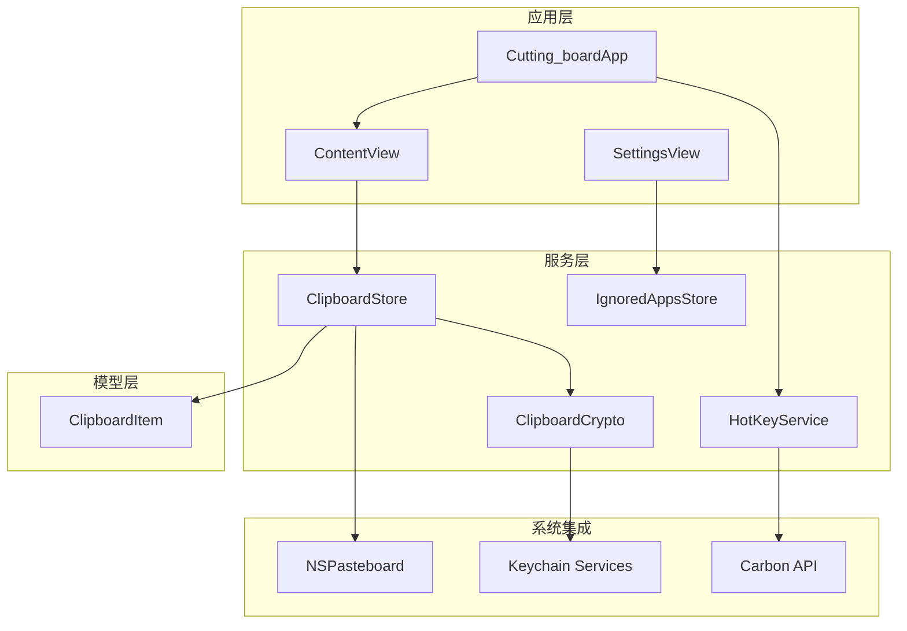
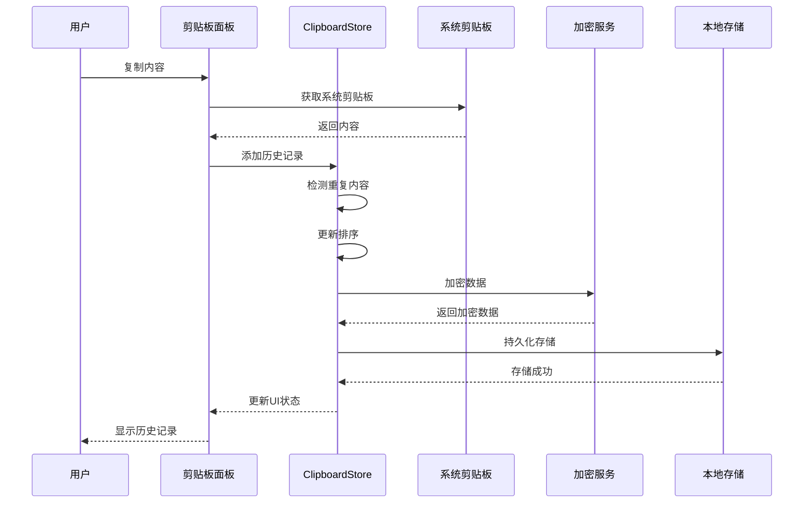
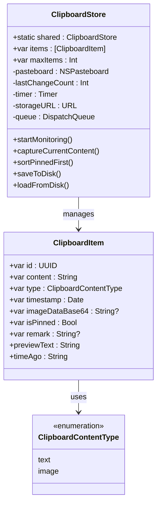
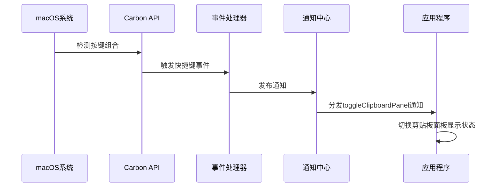
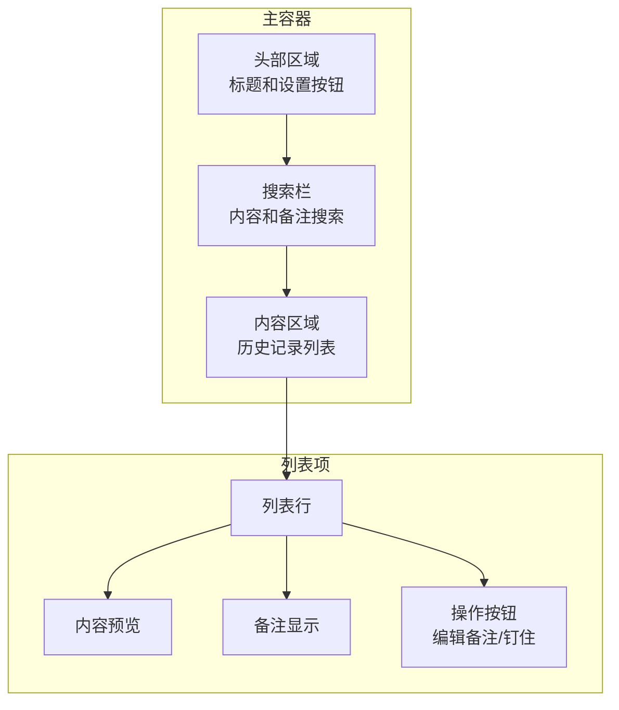
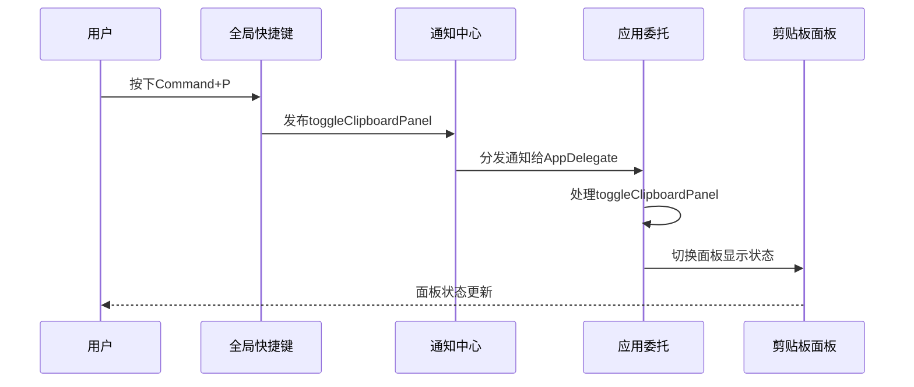

# API参考

<cite>
**本文档引用的文件**
- [ClipboardStore.swift](file://Cutting_board/Services/ClipboardStore.swift)
- [HotKeyService.swift](file://Cutting_board/Services/HotKeyService.swift)
- [ClipboardItem.swift](file://Cutting_board/Models/ClipboardItem.swift)
- [ClipboardCrypto.swift](file://Cutting_board/Services/ClipboardCrypto.swift)
- [IgnoredAppsStore.swift](file://Cutting_board/Services/IgnoredAppsStore.swift)
- [ContentView.swift](file://Cutting_board/ContentView.swift)
- [Cutting_boardApp.swift](file://Cutting_board/Cutting_boardApp.swift)
- [SettingsView.swift](file://Cutting_board/SettingsView.swift)
</cite>

## 目录
1. [简介](#简介)
2. [项目结构](#项目结构)
3. [核心组件](#核心组件)
4. [架构概览](#架构概览)
5. [详细组件分析](#详细组件分析)
6. [数据模型规范](#数据模型规范)
7. [事件与通知机制](#事件与通知机制)
8. [错误处理指南](#错误处理指南)
9. [性能考虑](#性能考虑)
10. [故障排除指南](#故障排除指南)
11. [结论](#结论)

## 简介

Cutting_board是一个macOS平台的剪贴板历史管理应用，提供了现代化的剪贴板历史记录、搜索和管理功能。该应用采用SwiftUI构建，支持全局快捷键、图片和文本的混合存储，并具备数据加密保护功能。

## 项目结构

应用采用模块化的架构设计，主要分为以下几个核心模块：



**图表来源**
- [Cutting_boardApp.swift](file://Cutting_board/Cutting_boardApp.swift#L12-L31)
- [ContentView.swift](file://Cutting_board/ContentView.swift#L20-L95)
- [ClipboardStore.swift](file://Cutting_board/Services/ClipboardStore.swift#L14-L39)

**章节来源**
- [Cutting_boardApp.swift](file://Cutting_board/Cutting_boardApp.swift#L1-L144)
- [ContentView.swift](file://Cutting_board/ContentView.swift#L1-L500)

## 核心组件

### ClipboardStore - 剪贴板存储管理器

ClipboardStore是应用的核心数据管理组件，负责剪贴板历史的监控、存储和管理。

**主要职责：**
- 实时监控系统剪贴板变化
- 存储和管理剪贴板历史记录
- 提供历史记录的增删改查操作
- 支持数据持久化和加密存储
- 管理历史记录的排序和筛选

**关键特性：**
- 单例模式设计，全局唯一实例
- 基于Combine框架的响应式数据流
- 支持文本和图片两种内容类型
- 自动去重和智能排序机制
- 支持钉住重要记录功能

**章节来源**
- [ClipboardStore.swift](file://Cutting_board/Services/ClipboardStore.swift#L14-L223)

### HotKeyService - 全局快捷键服务

HotKeyService提供全局快捷键功能，允许用户通过Command+P快速调起剪贴板面板。

**主要功能：**
- 注册全局快捷键Command+P
- 使用Carbon API实现跨应用快捷键
- 无需辅助功能权限即可工作
- 通过通知中心分发快捷键事件

**技术实现：**
- 基于Carbon Event HotKey API
- 事件处理器回调机制
- 应用生命周期管理

**章节来源**
- [HotKeyService.swift](file://Cutting_board/Services/HotKeyService.swift#L30-L82)

### ClipboardItem - 剪贴板数据模型

ClipboardItem是剪贴板历史记录的数据模型，定义了历史记录的完整结构。

**核心属性：**
- `id`: 唯一标识符（UUID）
- `content`: 内容文本
- `type`: 内容类型（文本/图片）
- `timestamp`: 时间戳
- `imageDataBase64`: 图片Base64编码数据
- `isPinned`: 是否钉住
- `remark`: 用户备注

**章节来源**
- [ClipboardItem.swift](file://Cutting_board/Models/ClipboardItem.swift#L17-L90)

### ClipboardCrypto - 数据加密服务

ClipboardCrypto提供剪贴板历史数据的加密保护功能。

**安全特性：**
- AES-GCM对称加密算法
- Keychain安全存储密钥
- 自动密钥生成和管理
- 向后兼容的明文支持

**章节来源**
- [ClipboardCrypto.swift](file://Cutting_board/Services/ClipboardCrypto.swift#L16-L73)

### IgnoredAppsStore - 忽略应用管理

IgnoredAppsStore管理用户配置的忽略应用列表，防止特定应用的剪贴板内容被记录。

**功能特性：**
- 基于Bundle ID的应用识别
- 图标和名称的动态获取
- 用户友好的应用选择界面
- 持久化的配置存储

**章节来源**
- [IgnoredAppsStore.swift](file://Cutting_board/Services/IgnoredAppsStore.swift#L16-L69)

## 架构概览

应用采用MVVM架构模式，结合响应式编程和现代SwiftUI设计：



**图表来源**
- [ClipboardStore.swift](file://Cutting_board/Services/ClipboardStore.swift#L65-L90)
- [ClipboardStore.swift](file://Cutting_board/Services/ClipboardStore.swift#L183-L221)

**章节来源**
- [ContentView.swift](file://Cutting_board/ContentView.swift#L20-L95)
- [Cutting_boardApp.swift](file://Cutting_board/Cutting_boardApp.swift#L35-L143)

## 详细组件分析

### ClipboardStore 类详细分析

ClipboardStore实现了完整的剪贴板历史管理功能，采用单例模式确保全局一致性。

#### 核心方法接口

**历史记录管理**
- `addItem(_:)`: 添加新的历史记录
- `remove(_:)`: 删除指定历史记录
- `clearAll()`: 清空所有历史记录
- `clearUnpinned()`: 清空未钉住的历史记录

**状态管理**
- `togglePin(_:)`: 切换记录的钉住状态
- `updateRemark(_:remark:)`: 更新记录备注

**数据操作**
- `copyToPasteboard(_:)`: 将历史记录复制回系统剪贴板

#### 数据结构设计



**图表来源**
- [ClipboardStore.swift](file://Cutting_board/Services/ClipboardStore.swift#L14-L223)
- [ClipboardItem.swift](file://Cutting_board/Models/ClipboardItem.swift#L17-L90)

#### 性能优化策略

- **异步存储**: 使用专用队列进行磁盘读写操作
- **智能去重**: 避免重复内容的多次存储
- **内存管理**: 定期清理未使用的图片缓存
- **增量更新**: 仅更新变化的数据部分

**章节来源**
- [ClipboardStore.swift](file://Cutting_board/Services/ClipboardStore.swift#L94-L165)

### HotKeyService 类详细分析

HotKeyService提供全局快捷键功能，使用Carbon API实现跨应用的键盘快捷键监听。

#### 事件处理流程



**图表来源**
- [HotKeyService.swift](file://Cutting_board/Services/HotKeyService.swift#L22-L27)
- [HotKeyService.swift](file://Cutting_board/Services/HotKeyService.swift#L36-L69)

#### 注册与注销流程

**注册过程:**
1. 安装事件处理器
2. 注册Event HotKey
3. 验证注册状态
4. 设置全局监听

**注销过程:**
1. 注销Event HotKey
2. 移除事件处理器
3. 清理资源

**章节来源**
- [HotKeyService.swift](file://Cutting_board/Services/HotKeyService.swift#L36-L81)

### ContentView 组件详细分析

ContentView是应用的主要用户界面，采用现代化的SwiftUI设计。

#### 用户交互功能

**键盘导航:**
- 上下箭头键：移动选中项
- 回车键：粘贴选中内容
- 删除键：删除选中项
- Escape键：关闭面板

**鼠标交互:**
- 单击：选择历史记录
- 双击：粘贴到当前应用
- 右键菜单：编辑备注、删除记录

#### 界面布局结构



**图表来源**
- [ContentView.swift](file://Cutting_board/ContentView.swift#L37-L95)
- [ContentView.swift](file://Cutting_board/ContentView.swift#L184-L207)

**章节来源**
- [ContentView.swift](file://Cutting_board/ContentView.swift#L20-L305)

## 数据模型规范

### ClipboardItem 数据模型

ClipboardItem是应用的核心数据模型，定义了剪贴板历史记录的完整结构。

#### 字段定义

| 字段名 | 类型 | 必填 | 描述 | 默认值 |
|--------|------|------|------|--------|
| id | UUID | 是 | 唯一标识符 | 自动生成 |
| content | String | 是 | 历史内容文本 | 空字符串 |
| type | ClipboardContentType | 是 | 内容类型 | 无默认值 |
| timestamp | Date | 是 | 创建时间戳 | 当前时间 |
| imageDataBase64 | String? | 否 | 图片Base64编码数据 | nil |
| isPinned | Bool | 否 | 是否钉住 | false |
| remark | String? | 否 | 用户备注 | nil |

#### 序列化格式

**JSON序列化结构:**
```json
{
  "id": "string",
  "content": "string",
  "type": "text|image",
  "timestamp": "ISO8601日期字符串",
  "imageDataBase64": "base64编码字符串",
  "isPinned": true|false,
  "remark": "string"
}
```

#### 验证规则

**必填字段验证:**
- 所有字段在初始化时都必须提供有效值
- `id` 和 `timestamp` 由系统自动生成
- `content` 必须非空（去除空白字符后）

**类型约束:**
- `type` 必须是枚举值之一
- `imageDataBase64` 仅在图片类型时存在
- `isPinned` 和 `remark` 支持nil值

**章节来源**
- [ClipboardItem.swift](file://Cutting_board/Models/ClipboardItem.swift#L17-L90)

### ClipboardContentType 枚举

内容类型的枚举定义，用于区分文本和图片内容。

**可用值:**
- `text`: 文本内容
- `image`: 图片内容

**使用场景:**
- 决定历史记录的显示方式
- 控制数据的序列化格式
- 影响用户界面的渲染逻辑

**章节来源**
- [ClipboardItem.swift](file://Cutting_board/Models/ClipboardItem.swift#L11-L14)

## 事件与通知机制

### 通知中心集成

应用使用Notification Center实现组件间的松耦合通信。

#### 预定义通知

| 通知名称 | 用途 | 参数 | 触发时机 |
|----------|------|------|----------|
| showClipboardPanel | 显示剪贴板面板 | nil | 用户请求显示面板 |
| closeClipboardPanel | 关闭剪贴板面板 | nil | 用户请求关闭面板 |
| toggleClipboardPanel | 切换面板显示状态 | nil | 全局快捷键触发 |

#### 通知处理流程



**图表来源**
- [HotKeyService.swift](file://Cutting_board/Services/HotKeyService.swift#L12-L16)
- [Cutting_boardApp.swift](file://Cutting_board/Cutting_boardApp.swift#L49-L66)

#### 生命周期管理

**注册通知:**
- 应用启动时注册所有需要的通知
- 使用弱引用避免循环引用
- 确保通知处理方法的正确性

**注销通知:**
- 应用终止时移除所有通知观察者
- 清理临时的回调闭包
- 避免内存泄漏

**章节来源**
- [Cutting_boardApp.swift](file://Cutting_board/Cutting_boardApp.swift#L49-L72)

## 错误处理指南

### 异常情况处理

#### 剪贴板访问异常

**可能的错误:**
- 系统剪贴板不可用
- 权限不足导致访问失败
- 内容格式不支持

**处理策略:**
- 使用try-catch包装剪贴板操作
- 提供降级方案（如跳过无效内容）
- 记录错误日志但不影响应用正常运行

#### 文件存储异常

**可能的错误:**
- 磁盘空间不足
- 文件权限问题
- 加密/解密失败

**处理策略:**
- 异步存储操作，避免阻塞主线程
- 失败时回滚到上一个有效状态
- 提供用户友好的错误提示

#### 加密服务异常

**可能的错误:**
- Keychain访问失败
- 密钥生成失败
- AES-GCM加密错误

**处理策略:**
- 自动重新生成密钥
- 降级到明文存储（不推荐）
- 清理损坏的加密数据

### 最佳实践建议

**错误恢复:**
- 实现优雅降级机制
- 保持数据完整性
- 提供用户反馈

**性能优化:**
- 异步处理耗时操作
- 合理使用缓存
- 避免频繁的UI更新

**安全性考虑:**
- 加密敏感数据
- 定期清理临时文件
- 遵循最小权限原则

**章节来源**
- [ClipboardStore.swift](file://Cutting_board/Services/ClipboardStore.swift#L192-L207)
- [ClipboardCrypto.swift](file://Cutting_board/Services/ClipboardCrypto.swift#L32-L46)

## 性能考虑

### 内存管理

**对象生命周期:**
- 使用弱引用避免循环引用
- 及时释放不需要的图片缓存
- 合理使用@Published属性

**内存优化:**
- 图片缩略图缓存限制
- 历史记录数量控制
- 定期清理过期数据

### 磁盘I/O优化

**存储策略:**
- 异步文件写入操作
- 批量数据合并写入
- 增量更新机制

**压缩与加密:**
- JSON数据格式化输出
- Base64数据高效处理
- 加密数据的魔数标识

### 网络与系统集成

**系统API调用:**
- Carbon API的线程安全
- Keychain访问的异步处理
- NSPasteboard的高效使用

**性能监控:**
- 定时器频率优化（0.5秒间隔）
- UI更新的节流处理
- 计算密集型操作的延迟执行

## 故障排除指南

### 常见问题诊断

**快捷键无法使用:**
1. 检查系统偏好设置中的快捷键冲突
2. 验证应用是否具有必要的系统权限
3. 重启应用以重新注册快捷键

**历史记录不显示:**
1. 检查忽略应用列表配置
2. 验证磁盘存储权限
3. 查看应用日志了解具体错误

**图片内容显示异常:**
1. 检查图片格式支持情况
2. 验证Base64数据完整性
3. 确认内存充足

### 调试技巧

**开发环境调试:**
- 使用Xcode调试器跟踪状态变化
- 监控内存使用情况
- 分析网络和文件I/O性能

**生产环境监控:**
- 收集用户反馈和错误报告
- 分析崩溃日志
- 监控系统资源使用情况

**章节来源**
- [HotKeyService.swift](file://Cutting_board/Services/HotKeyService.swift#L62-L68)
- [ClipboardStore.swift](file://Cutting_board/Services/ClipboardStore.swift#L183-L207)

## 结论

Cutting_board应用展现了现代macOS应用开发的最佳实践，通过清晰的架构设计、完善的错误处理机制和优秀的用户体验设计，为用户提供了一个强大而易用的剪贴板历史管理工具。

**核心优势:**
- 响应式数据流设计
- 安全的数据存储机制
- 优雅的用户界面交互
- 跨应用的快捷键支持

**技术亮点:**
- 基于SwiftUI的现代化界面
- Combine框架的响应式编程
- CryptoKit的安全加密
- Carbon API的系统级集成

该应用为开发者提供了良好的学习范例，展示了如何在实际项目中有效运用Swift和macOS生态系统的核心技术。