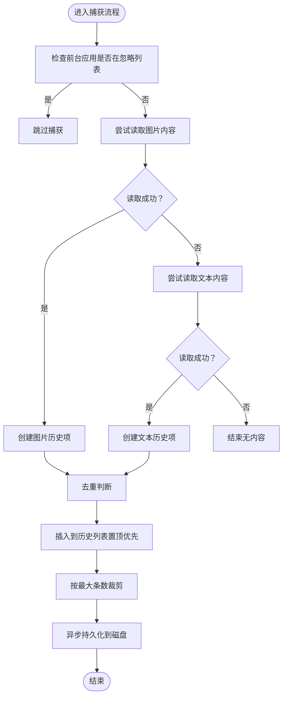

# 事件与通知API

<cite>
**本文引用的文件**
- [Cutting_boardApp.swift](file://Cutting_board/Cutting_boardApp.swift)
- [ContentView.swift](file://Cutting_board/ContentView.swift)
- [HotKeyService.swift](file://Cutting_board/Services/HotKeyService.swift)
- [ClipboardStore.swift](file://Cutting_board/Services/ClipboardStore.swift)
- [ClipboardItem.swift](file://Cutting_board/Models/ClipboardItem.swift)
- [IgnoredAppsStore.swift](file://Cutting_board/Services/IgnoredAppsStore.swift)
- [ClipboardCrypto.swift](file://Cutting_board/Services/ClipboardCrypto.swift)
- [SettingsView.swift](file://Cutting_board/SettingsView.swift)
</cite>

## 目录
1. [简介](#简介)
2. [项目结构](#项目结构)
3. [核心组件](#核心组件)
4. [架构总览](#架构总览)
5. [详细组件分析](#详细组件分析)
6. [依赖关系分析](#依赖关系分析)
7. [性能考虑](#性能考虑)
8. [故障排查指南](#故障排查指南)
9. [结论](#结论)
10. [附录](#附录)

## 简介
本文件面向Cutting_board应用的事件与通知机制，系统性梳理应用内使用的事件类型、通知中心的使用方式、事件监听器的注册与注销方法，并覆盖剪贴板变化事件、快捷键事件、应用生命周期事件等的触发时机与回调机制。文档同时提供事件处理器的实现示例路径、事件数据结构定义、事件传播流程、订阅/取消订阅方法、事件优先级与处理顺序说明，以及异步事件处理的最佳实践与性能优化建议。

## 项目结构
Cutting_board采用“应用入口 + 视图层 + 服务层 + 模型层”的分层组织方式：
- 应用入口负责菜单栏交互、全局快捷键注册、应用生命周期管理与通知转发
- 视图层负责用户交互、键盘事件处理与通知发送
- 服务层负责剪贴板监控、历史持久化、加密、忽略应用列表等
- 模型层定义剪贴板历史条目的数据结构

图表来源
- [Cutting_boardApp.swift](file://Cutting_board/Cutting_boardApp.swift#L35-L143)
- [ContentView.swift](file://Cutting_board/ContentView.swift#L20-L305)
- [HotKeyService.swift](file://Cutting_board/Services/HotKeyService.swift#L30-L81)
- [ClipboardStore.swift](file://Cutting_board/Services/ClipboardStore.swift#L14-L222)
- [ClipboardItem.swift](file://Cutting_board/Models/ClipboardItem.swift#L16-L89)
- [IgnoredAppsStore.swift](file://Cutting_board/Services/IgnoredAppsStore.swift#L16-L40)
- [ClipboardCrypto.swift](file://Cutting_board/Services/ClipboardCrypto.swift#L16-L72)
- [SettingsView.swift](file://Cutting_board/SettingsView.swift#L11-L89)

章节来源
- [Cutting_boardApp.swift](file://Cutting_board/Cutting_boardApp.swift#L11-L31)
- [ContentView.swift](file://Cutting_board/ContentView.swift#L20-L95)
- [HotKeyService.swift](file://Cutting_board/Services/HotKeyService.swift#L30-L81)
- [ClipboardStore.swift](file://Cutting_board/Services/ClipboardStore.swift#L14-L39)
- [ClipboardItem.swift](file://Cutting_board/Models/ClipboardItem.swift#L16-L45)
- [IgnoredAppsStore.swift](file://Cutting_board/Services/IgnoredAppsStore.swift#L16-L25)
- [ClipboardCrypto.swift](file://Cutting_board/Services/ClipboardCrypto.swift#L16-L29)
- [SettingsView.swift](file://Cutting_board/SettingsView.swift#L11-L37)

## 核心组件
- 通知中心与事件名称
  - 通过扩展Notification.Name定义了三个面板控制事件：显示、关闭、切换
  - 事件名称定义位置：[通知名称扩展](file://Cutting_board/Services/HotKeyService.swift#L12-L16)
- 全局快捷键服务
  - 使用Carbon API注册Command+P为全局快捷键，回调中向通知中心发布“切换”事件
  - 注册/注销逻辑：[注册与注销](file://Cutting_board/Services/HotKeyService.swift#L36-L80)
- 应用委托与生命周期
  - 应用启动时创建面板窗口、注册快捷键、订阅面板控制通知
  - 应用退出时注销快捷键、移除通知观察者
  - 生命周期与通知订阅：[应用委托实现](file://Cutting_board/Cutting_boardApp.swift#L46-L72)
- 视图层事件
  - 菜单栏快捷键、键盘事件（方向键、回车、ESC、删除）、面板关闭时发送“关闭”通知
  - 键盘事件与通知发送：[视图层事件处理](file://Cutting_board/ContentView.swift#L68-L95), [关闭面板通知](file://Cutting_board/ContentView.swift#L294-L296)
- 剪贴板监控与历史存储
  - 定时轮询系统剪贴板变更，检测到变化后捕获内容并更新历史列表
  - 历史存储与持久化：[监控与捕获](file://Cutting_board/Services/ClipboardStore.swift#L47-L90), [持久化](file://Cutting_board/Services/ClipboardStore.swift#L183-L221)
- 数据模型
  - 剪贴板历史条目结构：ID、内容、类型、时间戳、图片Base64、是否置顶、备注
  - 数据模型定义：[模型定义](file://Cutting_board/Models/ClipboardItem.swift#L16-L45)

章节来源
- [HotKeyService.swift](file://Cutting_board/Services/HotKeyService.swift#L12-L16)
- [HotKeyService.swift](file://Cutting_board/Services/HotKeyService.swift#L36-L80)
- [Cutting_boardApp.swift](file://Cutting_board/Cutting_boardApp.swift#L46-L72)
- [ContentView.swift](file://Cutting_board/ContentView.swift#L68-L95)
- [ContentView.swift](file://Cutting_board/ContentView.swift#L294-L296)
- [ClipboardStore.swift](file://Cutting_board/Services/ClipboardStore.swift#L47-L90)
- [ClipboardStore.swift](file://Cutting_board/Services/ClipboardStore.swift#L183-L221)
- [ClipboardItem.swift](file://Cutting_board/Models/ClipboardItem.swift#L16-L45)

## 架构总览
下图展示了事件与通知在应用中的传播路径：全局快捷键触发 → 通知中心 → 应用委托接收并展示/隐藏面板；视图层在用户操作时发送“关闭”通知；剪贴板服务定时检测变化并更新历史。

图表来源
- [HotKeyService.swift](file://Cutting_board/Services/HotKeyService.swift#L22-L27)
- [HotKeyService.swift](file://Cutting_board/Services/HotKeyService.swift#L12-L16)
- [Cutting_boardApp.swift](file://Cutting_board/Cutting_boardApp.swift#L123-L133)
- [Cutting_boardApp.swift](file://Cutting_board/Cutting_boardApp.swift#L127-L129)
- [ContentView.swift](file://Cutting_board/ContentView.swift#L294-L296)

## 详细组件分析

### 事件类型与通知中心
- 事件名称
  - 显示面板：.showClipboardPanel
  - 关闭面板：.closeClipboardPanel
  - 切换面板：.toggleClipboardPanel
  - 定义位置：[通知名称扩展](file://Cutting_board/Services/HotKeyService.swift#L12-L16)
- 订阅与注销
  - 订阅：在应用启动时注册观察者，监听上述三个事件
    - 订阅位置：[订阅面板控制事件](file://Cutting_board/Cutting_boardApp.swift#L49-L66)
  - 注销：应用退出时移除观察者，避免内存泄漏
    - 注销位置：[注销观察者](file://Cutting_board/Cutting_boardApp.swift#L69-L72)
- 事件传播
  - 全局快捷键触发后，通过通知中心发布“切换”事件；AppDelegate根据面板状态决定显示或隐藏
  - 视图层在用户执行关闭动作时发布“关闭”事件，AppDelegate负责隐藏面板
  - 传播路径参考“架构总览”图

章节来源
- [HotKeyService.swift](file://Cutting_board/Services/HotKeyService.swift#L12-L16)
- [Cutting_boardApp.swift](file://Cutting_board/Cutting_boardApp.swift#L49-L66)
- [Cutting_boardApp.swift](file://Cutting_board/Cutting_boardApp.swift#L69-L72)
- [Cutting_boardApp.swift](file://Cutting_board/Cutting_boardApp.swift#L123-L133)
- [ContentView.swift](file://Cutting_board/ContentView.swift#L294-L296)

### 剪贴板变化事件
- 触发时机
  - 应用启动后，服务内部以固定周期轮询系统剪贴板变更
  - 检测到变更后，捕获当前内容（优先图片，其次文本），去重后插入历史列表
  - 触发时机与实现：[定时监控](file://Cutting_board/Services/ClipboardStore.swift#L47-L60), [捕获内容](file://Cutting_board/Services/ClipboardStore.swift#L65-L90)
- 事件数据结构
  - 历史条目模型包含：唯一ID、内容、类型（文本/图片）、时间戳、图片Base64、是否置顶、备注
  - 结构定义：[模型定义](file://Cutting_board/Models/ClipboardItem.swift#L16-L45)
- 处理流程
  - 去重策略：若与第一条内容相同则忽略（图片需比较Base64）
  - 插入规则：置顶项优先，新项插入到置顶项之后
  - 持久化：异步写入磁盘，使用加密模块保护历史文件
  - 流程图如下：

图表来源
- [ClipboardStore.swift](file://Cutting_board/Services/ClipboardStore.swift#L65-L90)
- [ClipboardStore.swift](file://Cutting_board/Services/ClipboardStore.swift#L94-L115)
- [ClipboardStore.swift](file://Cutting_board/Services/ClipboardStore.swift#L210-L221)
- [ClipboardItem.swift](file://Cutting_board/Models/ClipboardItem.swift#L16-L45)

章节来源
- [ClipboardStore.swift](file://Cutting_board/Services/ClipboardStore.swift#L47-L90)
- [ClipboardStore.swift](file://Cutting_board/Services/ClipboardStore.swift#L94-L115)
- [ClipboardStore.swift](file://Cutting_board/Services/ClipboardStore.swift#L210-L221)
- [ClipboardItem.swift](file://Cutting_board/Models/ClipboardItem.swift#L16-L45)

### 快捷键事件
- 全局快捷键
  - 注册：使用Carbon API在应用事件目标上安装热键处理器，注册Command+P为热键
  - 回调：热键触发时在主线程发布“切换”事件
  - 实现位置：[注册与回调](file://Cutting_board/Services/HotKeyService.swift#L36-L69), [发布事件](file://Cutting_board/Services/HotKeyService.swift#L22-L27)
- 视图内快捷键
  - 方向键、回车、ESC、删除等按键在视图层处理，支持键盘导航与操作
  - 实现位置：[键盘事件处理](file://Cutting_board/ContentView.swift#L68-L95), [关闭面板](file://Cutting_board/ContentView.swift#L294-L296)
- 菜单栏快捷键
  - 菜单项提供Command+P打开/关闭面板的快捷键绑定
  - 实现位置：[菜单快捷键](file://Cutting_board/Cutting_boardApp.swift#L17-L20)

章节来源
- [HotKeyService.swift](file://Cutting_board/Services/HotKeyService.swift#L36-L69)
- [HotKeyService.swift](file://Cutting_board/Services/HotKeyService.swift#L22-L27)
- [ContentView.swift](file://Cutting_board/ContentView.swift#L68-L95)
- [ContentView.swift](file://Cutting_board/ContentView.swift#L294-L296)
- [Cutting_boardApp.swift](file://Cutting_board/Cutting_boardApp.swift#L17-L20)

### 应用生命周期事件
- 启动阶段
  - 创建面板窗口（LSUIElement场景下需手动创建）
  - 注册全局快捷键
  - 订阅面板控制通知
  - 初始化剪贴板监控与历史加载
  - 实现位置：[启动处理](file://Cutting_board/Cutting_boardApp.swift#L46-L48), [创建窗口](file://Cutting_board/Cutting_boardApp.swift#L78-L98), [订阅通知](file://Cutting_board/Cutting_boardApp.swift#L49-L66), [初始化存储](file://Cutting_board/Services/ClipboardStore.swift#L31-L39)
- 退出阶段
  - 注销全局快捷键
  - 移除通知观察者
  - 实现位置：[退出处理](file://Cutting_board/Cutting_boardApp.swift#L69-L72), [注销快捷键](file://Cutting_board/Services/HotKeyService.swift#L71-L79)

章节来源
- [Cutting_boardApp.swift](file://Cutting_board/Cutting_boardApp.swift#L46-L72)
- [Cutting_boardApp.swift](file://Cutting_board/Cutting_boardApp.swift#L78-L98)
- [ClipboardStore.swift](file://Cutting_board/Services/ClipboardStore.swift#L31-L39)
- [HotKeyService.swift](file://Cutting_board/Services/HotKeyService.swift#L71-L79)

### 事件监听器注册与取消订阅
- 注册
  - AppDelegate在启动时注册三个通知观察者，分别处理显示、关闭、切换面板事件
  - 注册位置：[注册观察者](file://Cutting_board/Cutting_boardApp.swift#L49-L66)
- 取消订阅
  - AppDelegate在应用退出时移除所有观察者
  - 注销位置：[移除观察者](file://Cutting_board/Cutting_boardApp.swift#L69-L72)
- 注意事项
  - 观察者需与注册对象保持一致，避免重复注册导致多次回调
  - 在视图层发送通知时应确保对象参数可为nil（如关闭面板）

章节来源
- [Cutting_boardApp.swift](file://Cutting_board/Cutting_boardApp.swift#L49-L72)

### 事件优先级与处理顺序
- 通知中心默认按注册顺序进行分发，未提供显式优先级设置
- 处理顺序
  - 全局快捷键 → 通知中心 → AppDelegate观察者 → 面板显示/隐藏
  - 视图层操作 → 通知中心 → AppDelegate观察者 → 面板隐藏
- 建议
  - 如需严格顺序，可在观察者内部引入队列或状态机协调多个事件源

章节来源
- [HotKeyService.swift](file://Cutting_board/Services/HotKeyService.swift#L12-L16)
- [Cutting_boardApp.swift](file://Cutting_board/Cutting_boardApp.swift#L49-L66)

### 异步事件处理最佳实践
- 主线程与后台线程分离
  - 快捷键回调在主线程发布通知，确保UI响应
  - 剪贴板捕获与历史更新在主线程异步更新，持久化在后台队列执行
  - 参考：[主线程异步更新](file://Cutting_board/Services/ClipboardStore.swift#L101-L107), [后台持久化](file://Cutting_board/Services/ClipboardStore.swift#L210-L221)
- 去抖与节流
  - 剪贴板轮询间隔为0.5秒，避免频繁IO与CPU占用
  - 参考：[定时器配置](file://Cutting_board/Services/ClipboardStore.swift#L47-L53)
- 去重与幂等
  - 历史插入前进行内容与类型比对，避免重复项
  - 参考：[去重逻辑](file://Cutting_board/Services/ClipboardStore.swift#L94-L99)
- 加密与安全
  - 历史文件使用AES-GCM加密，密钥存储于Keychain
  - 参考：[加密模块](file://Cutting_board/Services/ClipboardCrypto.swift#L32-L46)

章节来源
- [ClipboardStore.swift](file://Cutting_board/Services/ClipboardStore.swift#L47-L53)
- [ClipboardStore.swift](file://Cutting_board/Services/ClipboardStore.swift#L94-L99)
- [ClipboardStore.swift](file://Cutting_board/Services/ClipboardStore.swift#L101-L107)
- [ClipboardStore.swift](file://Cutting_board/Services/ClipboardStore.swift#L210-L221)
- [ClipboardCrypto.swift](file://Cutting_board/Services/ClipboardCrypto.swift#L32-L46)

## 依赖关系分析
- 组件耦合
  - AppDelegate依赖HotKeyService与通知中心，负责面板生命周期与UI交互
  - ContentView依赖ClipboardStore与通知中心，负责用户交互与面板关闭
  - ClipboardStore依赖NSPasteboard、定时器、后台队列与加密模块
- 外部依赖
  - AppKit、Foundation、Carbon（全局快捷键）
- 循环依赖
  - 未发现循环依赖，事件通过通知中心单向传播

图表来源
- [HotKeyService.swift](file://Cutting_board/Services/HotKeyService.swift#L30-L81)
- [Cutting_boardApp.swift](file://Cutting_board/Cutting_boardApp.swift#L35-L143)
- [ContentView.swift](file://Cutting_board/ContentView.swift#L20-L305)
- [ClipboardStore.swift](file://Cutting_board/Services/ClipboardStore.swift#L14-L222)
- [ClipboardItem.swift](file://Cutting_board/Models/ClipboardItem.swift#L16-L89)
- [ClipboardCrypto.swift](file://Cutting_board/Services/ClipboardCrypto.swift#L16-L72)
- [IgnoredAppsStore.swift](file://Cutting_board/Services/IgnoredAppsStore.swift#L16-L40)

章节来源
- [HotKeyService.swift](file://Cutting_board/Services/HotKeyService.swift#L30-L81)
- [Cutting_boardApp.swift](file://Cutting_board/Cutting_boardApp.swift#L35-L143)
- [ContentView.swift](file://Cutting_board/ContentView.swift#L20-L305)
- [ClipboardStore.swift](file://Cutting_board/Services/ClipboardStore.swift#L14-L222)
- [ClipboardItem.swift](file://Cutting_board/Models/ClipboardItem.swift#L16-L89)
- [ClipboardCrypto.swift](file://Cutting_board/Services/ClipboardCrypto.swift#L16-L72)
- [IgnoredAppsStore.swift](file://Cutting_board/Services/IgnoredAppsStore.swift#L16-L40)

## 性能考虑
- 剪贴板轮询
  - 0.5秒间隔平衡了实时性与性能，建议根据实际需求调整
- 历史数量限制
  - 默认最多保留200条，置顶项不受限，避免无限增长
- 异步持久化
  - 使用后台队列进行序列化与写盘，避免阻塞主线程
- 图片缩略图缓存
  - 视图层对图片预览进行缩略图缓存，减少重复计算
- 建议
  - 在低性能设备上可适当增加轮询间隔
  - 对大量历史数据场景，可考虑分页加载或延迟解码

章节来源
- [ClipboardStore.swift](file://Cutting_board/Services/ClipboardStore.swift#L21-L23)
- [ClipboardStore.swift](file://Cutting_board/Services/ClipboardStore.swift#L47-L53)
- [ClipboardStore.swift](file://Cutting_board/Services/ClipboardStore.swift#L210-L221)
- [ContentView.swift](file://Cutting_board/ContentView.swift#L383-L387)

## 故障排查指南
- 全局快捷键无效
  - 检查是否正确注册与注销：[注册/注销](file://Cutting_board/Services/HotKeyService.swift#L36-L80)
  - 确认应用事件目标是否正确安装处理器
- 面板无法显示/隐藏
  - 检查通知订阅与注销是否匹配：[订阅/注销](file://Cutting_board/Cutting_boardApp.swift#L49-L72)
  - 确认菜单栏快捷键绑定与Command+P冲突情况
- 剪贴板历史为空
  - 检查前台应用是否在忽略列表：[忽略列表](file://Cutting_board/Services/IgnoredAppsStore.swift#L16-L40)
  - 确认历史文件是否被加密模块正确解密：[解密逻辑](file://Cutting_board/Services/ClipboardCrypto.swift#L38-L46)
- 性能问题
  - 调整轮询间隔与最大历史条数
  - 检查后台队列任务是否过多

章节来源
- [HotKeyService.swift](file://Cutting_board/Services/HotKeyService.swift#L36-L80)
- [Cutting_boardApp.swift](file://Cutting_board/Cutting_boardApp.swift#L49-L72)
- [IgnoredAppsStore.swift](file://Cutting_board/Services/IgnoredAppsStore.swift#L16-L40)
- [ClipboardCrypto.swift](file://Cutting_board/Services/ClipboardCrypto.swift#L38-L46)
- [ClipboardStore.swift](file://Cutting_board/Services/ClipboardStore.swift#L21-L23)
- [ClipboardStore.swift](file://Cutting_board/Services/ClipboardStore.swift#L47-L53)

## 结论
Cutting_board通过通知中心与全局快捷键实现了简洁高效的事件驱动架构：全局快捷键触发切换面板，视图层在用户操作时发送关闭通知，应用委托统一协调面板显示与隐藏。剪贴板监控采用定时轮询与异步持久化策略，在保证实时性的同时兼顾性能与安全性。建议在复杂场景下引入显式优先级或状态机以增强事件处理的确定性。

## 附录
- 事件名称一览
  - 显示面板：.showClipboardPanel
  - 关闭面板：.closeClipboardPanel
  - 切换面板：.toggleClipboardPanel
  - 定义位置：[通知名称扩展](file://Cutting_board/Services/HotKeyService.swift#L12-L16)
- 订阅/取消订阅方法
  - 订阅：NotificationCenter.default.addObserver(...)
  - 取消订阅：NotificationCenter.default.removeObserver(self)
  - 实现位置：[订阅](file://Cutting_board/Cutting_boardApp.swift#L49-L66), [注销](file://Cutting_board/Cutting_boardApp.swift#L69-L72)
- 事件数据结构
  - 剪贴板历史条目：ID、内容、类型、时间戳、图片Base64、是否置顶、备注
  - 定义位置：[模型定义](file://Cutting_board/Models/ClipboardItem.swift#L16-L45)

章节来源
- [HotKeyService.swift](file://Cutting_board/Services/HotKeyService.swift#L12-L16)
- [Cutting_boardApp.swift](file://Cutting_board/Cutting_boardApp.swift#L49-L72)
- [ClipboardItem.swift](file://Cutting_board/Models/ClipboardItem.swift#L16-L45)