# 数据模型API

<cite>
**本文档引用的文件**
- [ClipboardItem.swift](file://Cutting_board/Models/ClipboardItem.swift)
- [ClipboardStore.swift](file://Cutting_board/Services/ClipboardStore.swift)
- [ClipboardCrypto.swift](file://Cutting_board/Services/ClipboardCrypto.swift)
- [IgnoredAppsStore.swift](file://Cutting_board/Services/IgnoredAppsStore.swift)
- [HotKeyService.swift](file://Cutting_board/Services/HotKeyService.swift)
- [ContentView.swift](file://Cutting_board/ContentView.swift)
- [Cutting_boardApp.swift](file://Cutting_board/Cutting_boardApp.swift)
</cite>

## 目录
1. [简介](#简介)
2. [项目结构](#项目结构)
3. [核心组件](#核心组件)
4. [架构概览](#架构概览)
5. [详细组件分析](#详细组件分析)
6. [依赖关系分析](#依赖关系分析)
7. [性能考虑](#性能考虑)
8. [故障排除指南](#故障排除指南)
9. [结论](#结论)

## 简介

本文档为Cutting_board项目的数据模型API参考文档，重点介绍ClipboardItem等核心数据模型的完整API规范。该应用是一个macOS剪贴板历史管理工具，提供了剪贴板内容的监控、存储、检索和管理功能。

项目采用SwiftUI框架构建，实现了现代化的桌面应用体验，支持全局快捷键、图片和文本内容的混合存储，并具备数据加密保护功能。

## 项目结构

Cutting_board项目采用清晰的分层架构设计，主要包含以下核心模块：

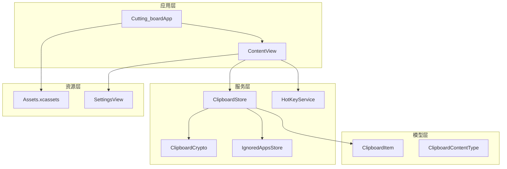

**图表来源**
- [Cutting_boardApp.swift](file://Cutting_board/Cutting_boardApp.swift#L11-L31)
- [ContentView.swift](file://Cutting_board/ContentView.swift#L20-L95)
- [ClipboardStore.swift](file://Cutting_board/Services/ClipboardStore.swift#L14-L39)

**章节来源**
- [Cutting_boardApp.swift](file://Cutting_board/Cutting_boardApp.swift#L1-L144)
- [ContentView.swift](file://Cutting_board/ContentView.swift#L1-L500)

## 核心组件

### ClipboardItem 数据模型

ClipboardItem是剪贴板历史记录的核心数据模型，实现了多种Swift协议以支持序列化、比较和标识功能。

#### 核心属性定义

| 属性名 | 类型 | 描述 | 默认值 |
|--------|------|------|--------|
| id | UUID | 唯一标识符 | 自动生成 |
| content | String | 剪贴板内容主体 | 必填 |
| type | ClipboardContentType | 内容类型（文本/图片） | 必填 |
| timestamp | Date | 时间戳 | 当前时间 |
| imageDataBase64 | String? | 图片Base64编码数据 | nil |
| isPinned | Bool | 是否置顶标记 | false |
| remark | String? | 用户备注，支持搜索 | nil |

#### 初始化方法

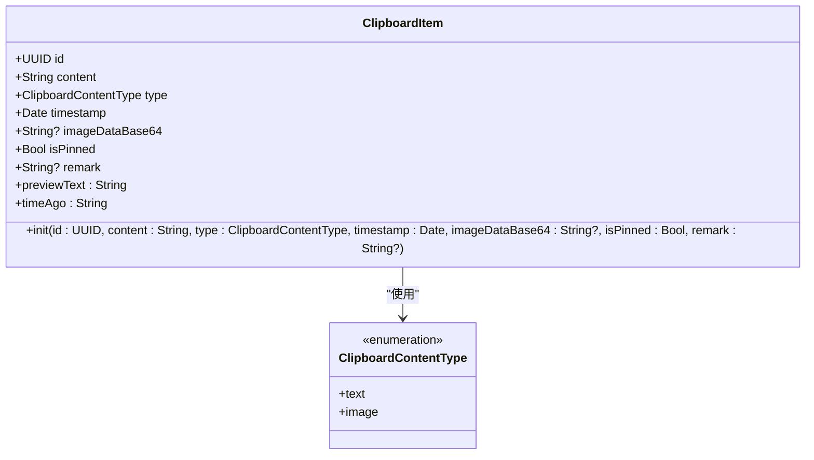

**图表来源**
- [ClipboardItem.swift](file://Cutting_board/Models/ClipboardItem.swift#L17-L45)
- [ClipboardItem.swift](file://Cutting_board/Models/ClipboardItem.swift#L11-L14)

#### 编码解码协议实现

ClipboardItem实现了Codable协议，支持JSON序列化和反序列化：

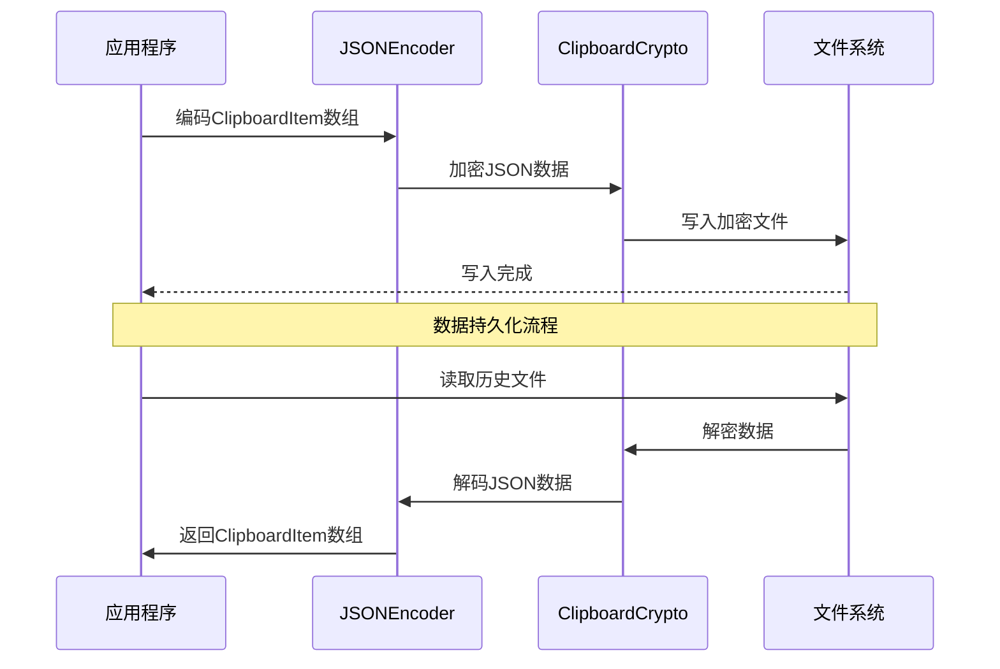

**图表来源**
- [ClipboardStore.swift](file://Cutting_board/Services/ClipboardStore.swift#L210-L221)
- [ClipboardCrypto.swift](file://Cutting_board/Services/ClipboardCrypto.swift#L32-L46)

**章节来源**
- [ClipboardItem.swift](file://Cutting_board/Models/ClipboardItem.swift#L17-L89)

### ClipboardStore 存储服务

ClipboardStore是剪贴板历史管理的核心服务类，负责监控系统剪贴板变化、存储历史记录和提供查询功能。

#### 主要功能特性

- **实时监控**：通过定时器每0.5秒检查系统剪贴板变化
- **智能过滤**：忽略指定应用程序的剪贴板内容
- **自动去重**：避免重复内容的多次存储
- **智能排序**：置顶项目优先显示，未置顶项目按时间倒序
- **内存优化**：使用异步队列处理磁盘I/O操作

#### 生命周期管理

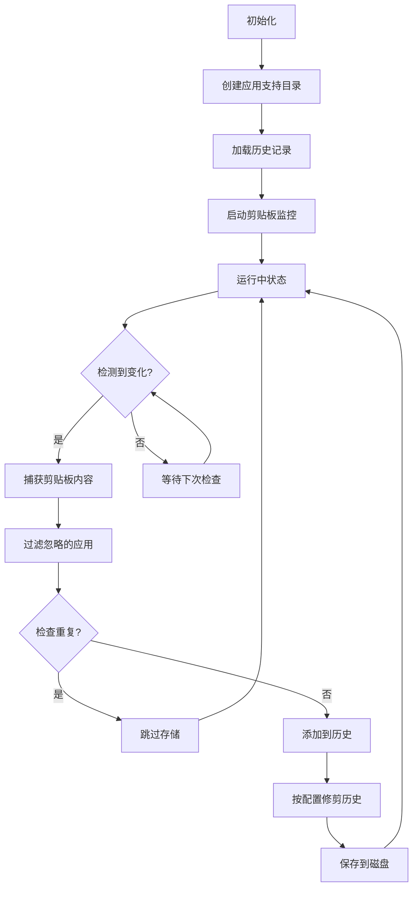

**图表来源**
- [ClipboardStore.swift](file://Cutting_board/Services/ClipboardStore.swift#L31-L90)
- [ClipboardStore.swift](file://Cutting_board/Services/ClipboardStore.swift#L110-L115)

**章节来源**
- [ClipboardStore.swift](file://Cutting_board/Services/ClipboardStore.swift#L14-L223)

## 架构概览

### 数据流架构

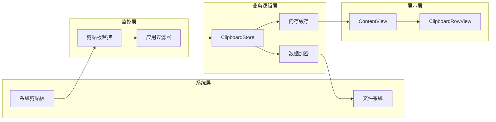

**图表来源**
- [ClipboardStore.swift](file://Cutting_board/Services/ClipboardStore.swift#L47-L90)
- [ContentView.swift](file://Cutting_board/ContentView.swift#L20-L95)

### 组件交互时序

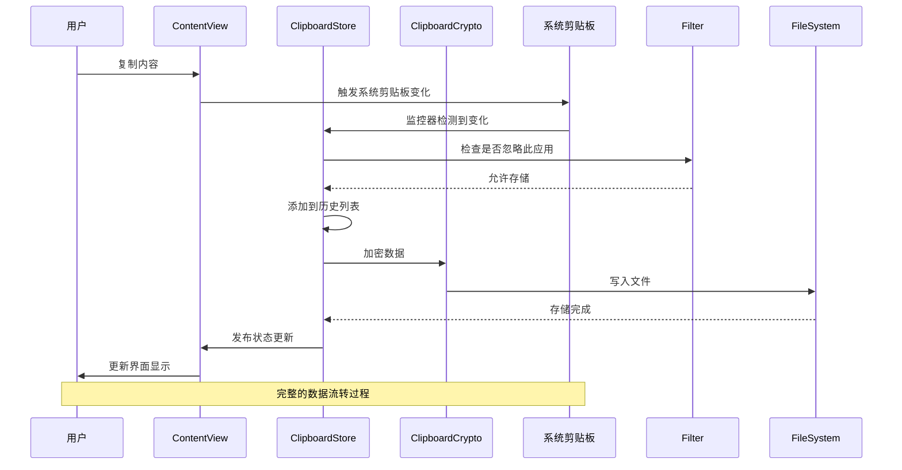

**图表来源**
- [ClipboardStore.swift](file://Cutting_board/Services/ClipboardStore.swift#L65-L90)
- [ClipboardStore.swift](file://Cutting_board/Services/ClipboardStore.swift#L183-L221)

## 详细组件分析

### ClipboardItem 数据模型详解

#### 结构定义与属性说明

ClipboardItem采用结构体设计，具有以下核心属性：

**标识属性**
- `id`: 使用UUID确保每个历史记录的唯一性
- `timestamp`: 记录内容添加到历史的时间

**内容属性**
- `content`: 存储实际的剪贴板内容
- `type`: 通过枚举区分文本和图片类型

**媒体属性**
- `imageDataBase64`: 图片内容的Base64编码存储
- `previewText`: 预览文本，限制最大长度80字符

**用户交互属性**
- `isPinned`: 置顶标记，置顶项目不会被自动清理
- `remark`: 用户备注，支持搜索功能

#### 编码解码实现

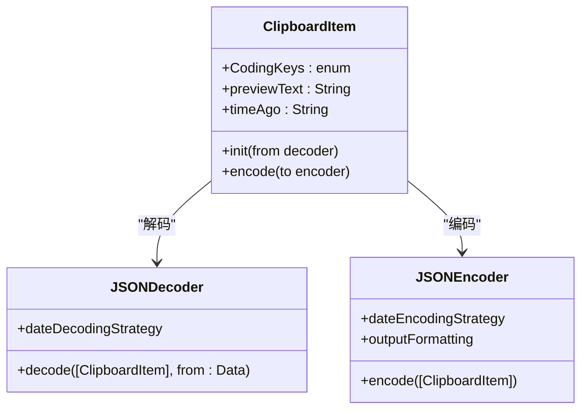

**图表来源**
- [ClipboardItem.swift](file://Cutting_board/Models/ClipboardItem.swift#L47-L71)

#### 验证规则与约束条件

| 属性 | 验证规则 | 错误处理 |
|------|----------|----------|
| content | 非空字符串 | 抛出解码异常 |
| type | 枚举值 | 使用默认值fallback |
| timestamp | ISO8601格式 | 使用当前时间fallback |
| imageDataBase64 | Base64格式 | 可选字段，允许nil |
| isPinned | 布尔值 | 默认false |
| remark | 字符串 | 可选字段，允许nil |

**章节来源**
- [ClipboardItem.swift](file://Cutting_board/Models/ClipboardItem.swift#L17-L89)

### ClipboardStore 服务组件

#### 监控机制

ClipboardStore使用定时器实现剪贴板监控：

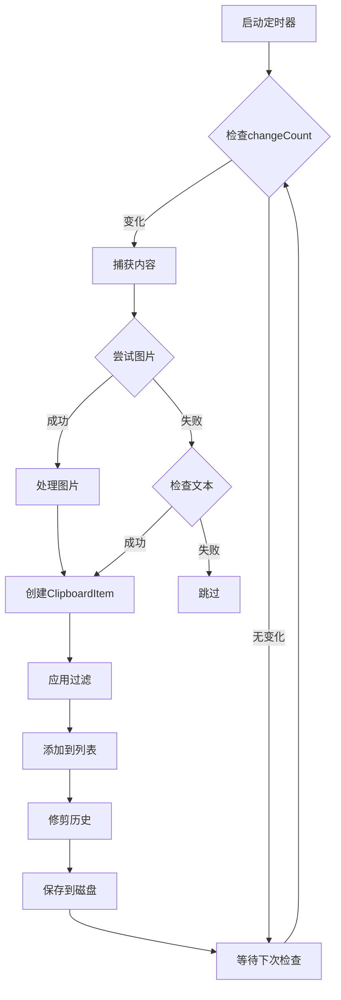

**图表来源**
- [ClipboardStore.swift](file://Cutting_board/Services/ClipboardStore.swift#L47-L90)

#### 数据持久化策略

ClipboardStore采用异步磁盘I/O操作，避免阻塞主线程：

**写入流程**
1. 使用专用队列处理磁盘写入
2. JSON序列化历史数据
3. 通过ClipboardCrypto进行AES-GCM加密
4. 写入到应用支持目录

**读取流程**
1. 异步读取文件数据
2. 尝试解密历史数据
3. JSON反序列化为ClipboardItem数组
4. 恢复置顶状态和修剪逻辑

**章节来源**
- [ClipboardStore.swift](file://Cutting_board/Services/ClipboardStore.swift#L183-L221)

### ClipboardCrypto 加密服务

#### 加密算法与密钥管理

ClipboardCrypto实现了基于AES-GCM的端到端加密：

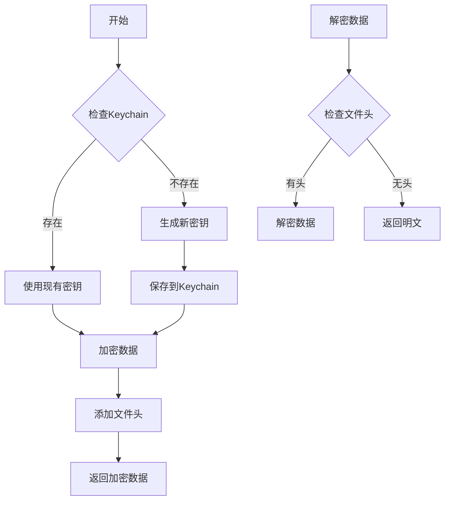

**图表来源**
- [ClipboardCrypto.swift](file://Cutting_board/Services/ClipboardCrypto.swift#L21-L46)

#### 版本兼容性处理

为了保持向后兼容性，ClipboardCrypto采用了智能的版本检测机制：

- **文件头标识**: 使用"CB1"作为加密文件头标识
- **自动降级**: 如果检测到明文文件，直接返回原数据
- **无缝升级**: 新生成的文件自动使用加密格式

**章节来源**
- [ClipboardCrypto.swift](file://Cutting_board/Services/ClipboardCrypto.swift#L16-L73)

### 辅助组件

#### IgnoredAppsStore 应用过滤器

IgnoredAppsStore管理需要忽略的应用程序列表：

**功能特性**
- 支持动态添加和移除应用程序
- 自动从Bundle ID解析应用名称和图标
- 提供便捷的应用程序选择界面

**数据存储**
- 使用UserDefaults存储Bundle ID列表
- 支持字符串数组格式
- 自动同步到磁盘

**章节来源**
- [IgnoredAppsStore.swift](file://Cutting_board/Services/IgnoredAppsStore.swift#L16-L69)

#### HotKeyService 全局快捷键

HotKeyService实现Command+P全局快捷键功能：

**技术实现**
- 使用Carbon API注册系统级热键
- 支持任意应用焦点状态下的响应
- 无需辅助功能权限即可工作

**通知机制**
- 通过NotificationCenter发布显示/隐藏面板的通知
- 支持多场景的快捷键响应

**章节来源**
- [HotKeyService.swift](file://Cutting_board/Services/HotKeyService.swift#L30-L82)

## 依赖关系分析

### 组件依赖图

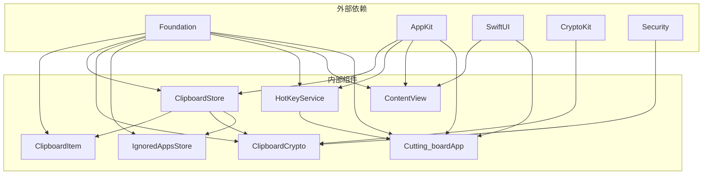

**图表来源**
- [ClipboardItem.swift](file://Cutting_board/Models/ClipboardItem.swift#L8)
- [ClipboardStore.swift](file://Cutting_board/Services/ClipboardStore.swift#L8-L11)
- [ClipboardCrypto.swift](file://Cutting_board/Services/ClipboardCrypto.swift#L8-L10)

### 数据流向分析

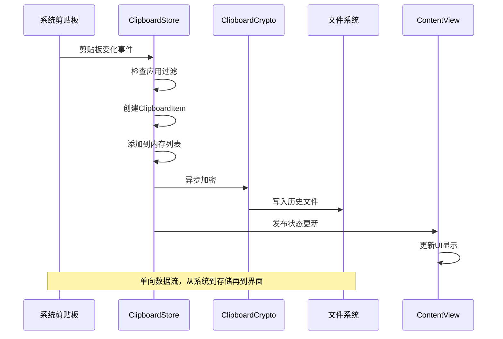

**图表来源**
- [ClipboardStore.swift](file://Cutting_board/Services/ClipboardStore.swift#L55-L108)
- [ContentView.swift](file://Cutting_board/ContentView.swift#L20-L35)

**章节来源**
- [Cutting_boardApp.swift](file://Cutting_board/Cutting_boardApp.swift#L35-L143)

## 性能考虑

### 内存优化策略

#### 异步处理架构

项目采用了多层次的异步处理机制来优化性能：

**磁盘I/O优化**
- 使用专用队列处理文件读写操作
- 避免阻塞主线程，保持界面流畅
- 批量处理数据更新

**图像处理优化**
- 延迟加载缩略图，减少内存占用
- 使用缓存机制避免重复计算
- 智能缩放算法优化图片质量

**数据结构优化**
- 使用结构体而非类减少内存开销
- 采用lazy加载策略
- 合理的集合容量预估

#### 性能监控建议

根据SwiftUI最佳实践，建议关注以下性能指标：

- **视图更新频率**：避免不必要的状态变更
- **列表渲染效率**：使用LazyVStack处理大量数据
- **图像解码成本**：合理控制缩略图尺寸
- **内存泄漏防护**：正确管理定时器和观察者

### 内存使用模式

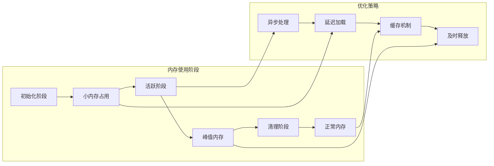

**章节来源**
- [ClipboardStore.swift](file://Cutting_board/Services/ClipboardStore.swift#L28-L29)
- [ContentView.swift](file://Cutting_board/ContentView.swift#L383-L386)

## 故障排除指南

### 常见问题与解决方案

#### 数据丢失问题

**问题描述**: 历史记录无法恢复或丢失

**可能原因**:
1. 文件权限问题导致无法写入
2. Keychain访问失败导致加密密钥丢失
3. 应用崩溃导致内存数据丢失

**解决方案**:
1. 检查应用权限设置
2. 重新启动应用以重建Keychain密钥
3. 查看应用日志了解具体错误信息

#### 剪贴板监控失效

**问题描述**: 复制内容无法被记录

**可能原因**:
1. 监控定时器停止工作
2. 应用被系统终止
3. 忽略的应用列表配置错误

**解决方案**:
1. 重启应用重新启动监控
2. 检查应用的后台运行权限
3. 清空忽略的应用列表

#### 图片显示异常

**问题描述**: 图片历史无法正确显示

**可能原因**:
1. Base64数据损坏
2. 图片格式不支持
3. 缩略图生成失败

**解决方案**:
1. 重新复制原始图片内容
2. 检查图片文件完整性
3. 清理应用缓存后重试

### 错误处理机制

项目实现了多层次的错误处理机制：

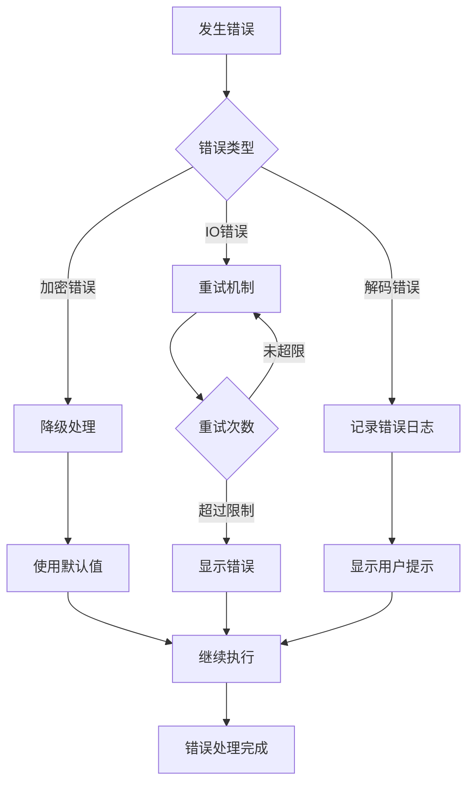

**章节来源**
- [ClipboardStore.swift](file://Cutting_board/Services/ClipboardStore.swift#L192-L207)
- [ClipboardCrypto.swift](file://Cutting_board/Services/ClipboardCrypto.swift#L38-L46)

## 结论

Cutting_board项目的数据模型设计体现了现代Swift开发的最佳实践：

### 设计优势

1. **清晰的职责分离**: 每个组件都有明确的功能边界
2. **强类型安全**: 使用枚举和可选类型确保数据完整性
3. **性能优化**: 异步处理和内存管理策略有效
4. **用户体验**: 提供流畅的界面交互和快速响应

### 扩展建议

对于未来的功能扩展，建议重点关注：

1. **数据迁移**: 实现版本化的数据模型以支持向后兼容
2. **搜索增强**: 实现更复杂的全文搜索和索引机制
3. **云同步**: 添加跨设备的数据同步功能
4. **主题定制**: 支持用户界面的主题和布局定制

该项目的数据模型为类似的应用程序提供了优秀的参考范例，其设计理念和实现细节值得深入学习和借鉴。