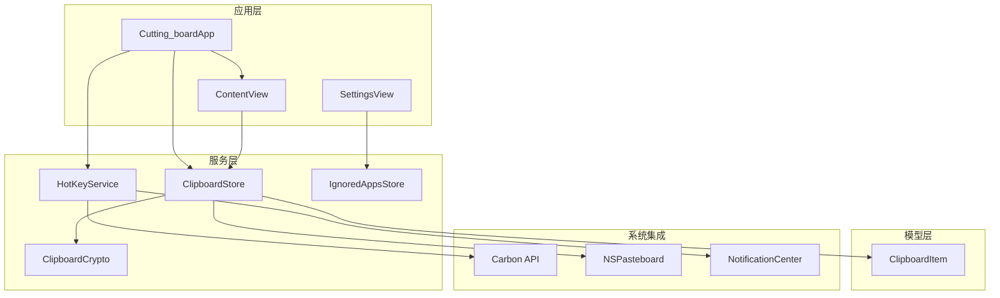
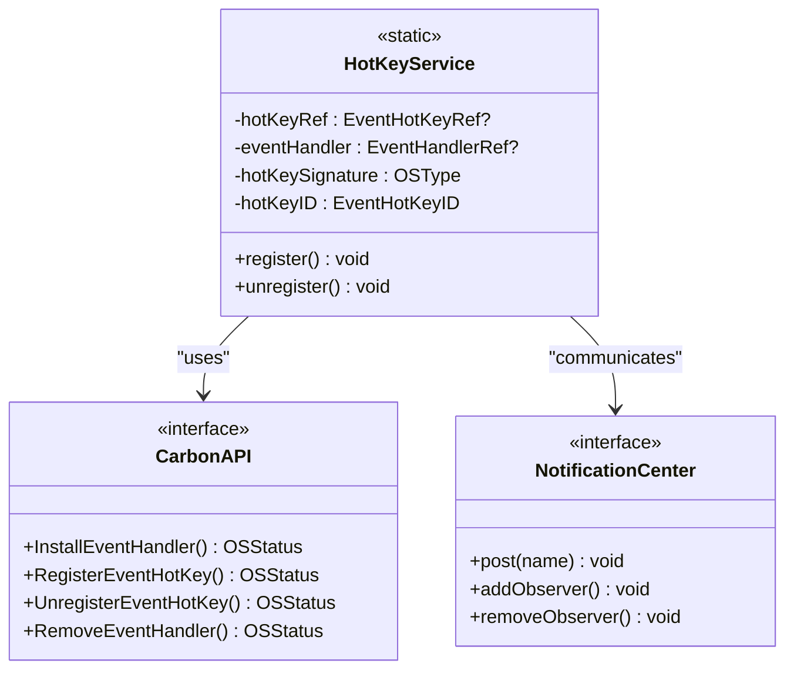
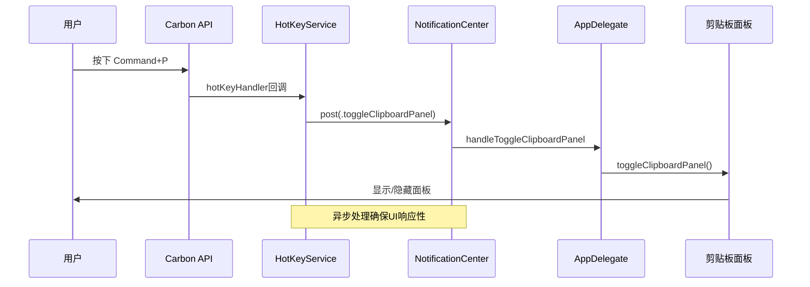
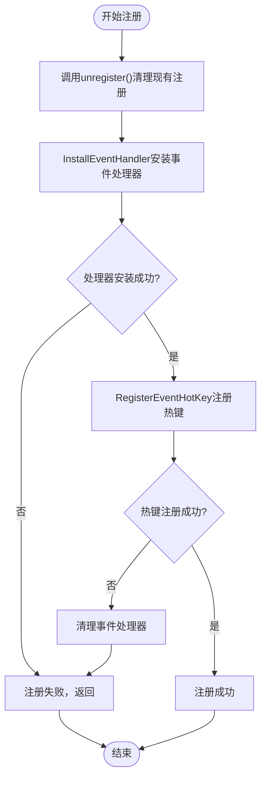
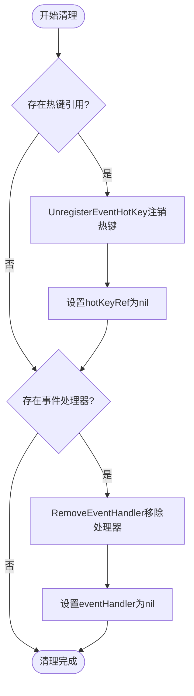
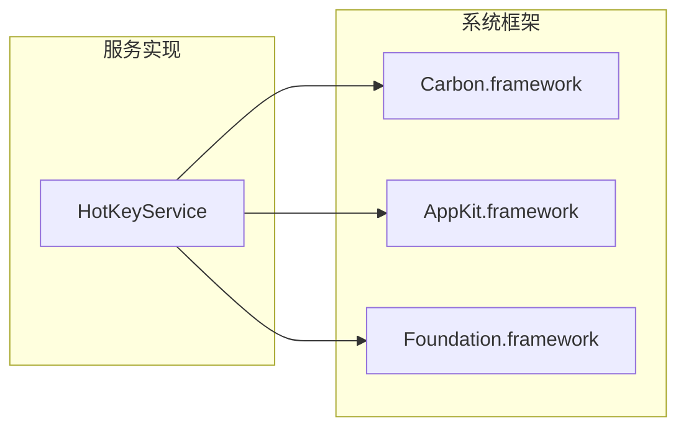
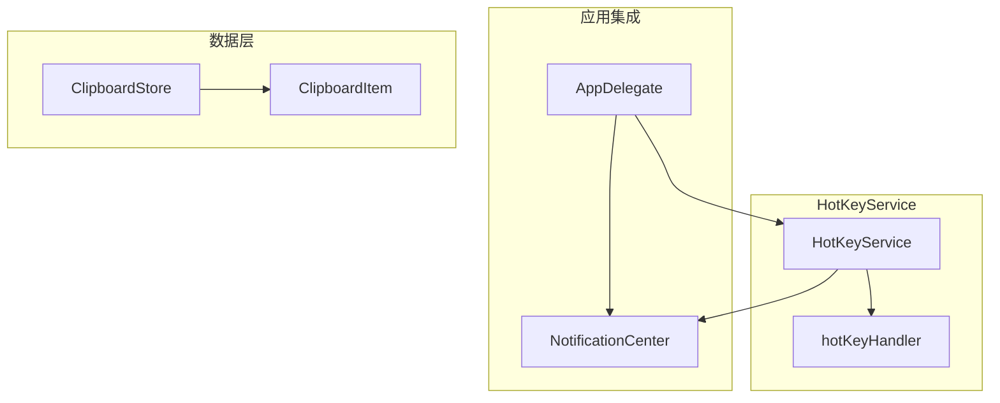

# 全局快捷键服务API

<cite>
**本文档引用的文件**
- [HotKeyService.swift](file://Cutting_board/Services/HotKeyService.swift)
- [Cutting_boardApp.swift](file://Cutting_board/Cutting_boardApp.swift)
- [ContentView.swift](file://Cutting_board/ContentView.swift)
- [ClipboardStore.swift](file://Cutting_board/Services/ClipboardStore.swift)
- [IgnoredAppsStore.swift](file://Cutting_board/Services/IgnoredAppsStore.swift)
- [ClipboardItem.swift](file://Cutting_board/Models/ClipboardItem.swift)
- [ClipboardCrypto.swift](file://Cutting_board/Services/ClipboardCrypto.swift)
- [SettingsView.swift](file://Cutting_board/SettingsView.swift)
</cite>

## 目录
1. [简介](#简介)
2. [项目结构](#项目结构)
3. [核心组件](#核心组件)
4. [架构概览](#架构概览)
5. [详细组件分析](#详细组件分析)
6. [依赖关系分析](#依赖关系分析)
7. [性能考虑](#性能考虑)
8. [故障排除指南](#故障排除指南)
9. [结论](#结论)

## 简介

HotKeyService是一个基于Apple Carbon API的全局快捷键服务，为macOS应用程序提供系统级的快捷键支持。该服务允许应用程序在任何应用获得焦点时响应特定的键盘组合，无需辅助功能权限即可实现全局快捷键功能。

该服务的核心功能包括：
- 使用Carbon API注册全局热键
- 支持Command+P组合键触发剪贴板面板
- 无需辅助功能权限的系统级快捷键
- 与NotificationCenter的通知机制集成
- 完整的错误处理和资源清理机制

## 项目结构

该项目采用模块化的SwiftUI架构设计，HotKeyService作为独立的服务模块位于Services目录下，与其他核心组件协同工作。



**图表来源**
- [HotKeyService.swift](file://Cutting_board/Services/HotKeyService.swift#L30-L81)
- [Cutting_boardApp.swift](file://Cutting_board/Cutting_boardApp.swift#L35-L143)
- [ContentView.swift](file://Cutting_board/ContentView.swift#L20-L305)

**章节来源**
- [HotKeyService.swift](file://Cutting_board/Services/HotKeyService.swift#L1-L82)
- [Cutting_boardApp.swift](file://Cutting_board/Cutting_boardApp.swift#L1-L144)

## 核心组件

### HotKeyService类结构

HotKeyService是一个静态类，提供了全局快捷键的完整生命周期管理。它封装了Carbon API的复杂性，并通过简单的接口暴露给应用程序。



**图表来源**
- [HotKeyService.swift](file://Cutting_board/Services/HotKeyService.swift#L30-L81)

### 关键常量和配置

服务使用固定的快捷键配置：
- 快捷键：Command + P (keyCodeP = 35)
- 热键签名：0x44494E47 ("DING")
- 热键ID：EventHotKeyID(signature: 0x44494E47, id: 1)

**章节来源**
- [HotKeyService.swift](file://Cutting_board/Services/HotKeyService.swift#L18-L35)

## 架构概览

HotKeyService采用事件驱动的架构模式，通过Carbon API监听系统级别的热键事件，并通过NotificationCenter分发到应用程序的其他组件。



**图表来源**
- [HotKeyService.swift](file://Cutting_board/Services/HotKeyService.swift#L21-L27)
- [Cutting_boardApp.swift](file://Cutting_board/Cutting_boardApp.swift#L131-L142)

## 详细组件分析

### register() 方法详解

register()方法实现了完整的全局快捷键注册流程，包括事件处理器安装和热键注册两个主要步骤。

#### 注册流程



**图表来源**
- [HotKeyService.swift](file://Cutting_board/Services/HotKeyService.swift#L36-L69)

#### 参数配置说明

- **keyCodeP**: 35 (字母P的虚拟键码)
- **modifiers**: cmdKey (Command键修饰符)
- **signature**: 0x44494E47 ("DING"四字符码)
- **hotKeyID**: 1 (热键ID)

#### 错误处理机制

注册过程中实现了完整的错误处理：
- 检查InstallEventHandler的返回状态
- 如果注册失败，自动清理已安装的事件处理器
- 设置hotKeyRef为nil以避免悬挂引用

**章节来源**
- [HotKeyService.swift](file://Cutting_board/Services/HotKeyService.swift#L36-L69)

### unregister() 方法详解

unregister()方法负责清理所有注册的全局快捷键资源，确保应用程序正常退出时不会留下悬挂的系统资源。

#### 清理流程



**图表来源**
- [HotKeyService.swift](file://Cutting_board/Services/HotKeyService.swift#L71-L80)

**章节来源**
- [HotKeyService.swift](file://Cutting_board/Services/HotKeyService.swift#L71-L80)

### carbonEventCallback() 事件处理逻辑

hotKeyHandler函数是Carbon API的回调函数，负责处理系统级的热键事件。

#### 事件处理流程

```mermaid
flowchart TD
Event([热键事件触发]) --> AsyncDispatch["DispatchQueue.main.async异步调度"]
AsyncDispatch --> PostNotification["post(.toggleClipboardPanel)"]
PostNotification --> ReturnOK["返回noErr"]
ReturnOK --> End([事件处理完成])
Note over AsyncDispatch,PostNotification: 确保主线程安全和响应性
```

**图表来源**
- [HotKeyService.swift](file://Cutting_board/Services/HotKeyService.swift#L22-L27)

#### 设计考虑

- **异步处理**: 使用DispatchQueue.main.async确保UI操作在主线程执行
- **无捕获上下文**: 函数声明为C可调用，不捕获任何上下文变量
- **快速返回**: 立即返回noErr，避免阻塞系统事件循环

**章节来源**
- [HotKeyService.swift](file://Cutting_board/Services/HotKeyService.swift#L21-L27)

### 通知中心集成

HotKeyService通过NotificationCenter与应用程序的其他组件进行松耦合通信。

#### 通知定义

服务定义了三个专用的通知名称：
- `.showClipboardPanel`: 显示剪贴板面板
- `.closeClipboardPanel`: 关闭剪贴板面板  
- `.toggleClipboardPanel`: 切换剪贴板面板显示状态

#### AppDelegate中的通知处理

AppDelegate订阅了这些通知并在主线程中处理相应的UI操作。

**章节来源**
- [HotKeyService.swift](file://Cutting_board/Services/HotKeyService.swift#L12-L16)
- [Cutting_boardApp.swift](file://Cutting_board/Cutting_boardApp.swift#L49-L66)

## 依赖关系分析

### 外部依赖

HotKeyService依赖于以下系统框架：



**图表来源**
- [HotKeyService.swift](file://Cutting_board/Services/HotKeyService.swift#L8-L10)

### 内部依赖关系



**图表来源**
- [Cutting_boardApp.swift](file://Cutting_board/Cutting_boardApp.swift#L46-L72)
- [HotKeyService.swift](file://Cutting_board/Services/HotKeyService.swift#L30-L81)

**章节来源**
- [HotKeyService.swift](file://Cutting_board/Services/HotKeyService.swift#L8-L10)
- [Cutting_boardApp.swift](file://Cutting_board/Cutting_boardApp.swift#L35-L72)

## 性能考虑

### 资源管理

HotKeyService实现了严格的资源管理策略：
- **内存安全**: 所有注册的引用都会在unregister()中清理
- **线程安全**: 所有UI操作都在主线程执行
- **异常安全**: 注册失败时自动回滚所有已建立的连接

### 系统集成优化

- **低开销**: Carbon API直接在内核级别处理热键事件
- **即时响应**: 事件处理完成后立即返回，不影响系统性能
- **无权限要求**: 相比辅助功能权限，Carbon API提供更轻量级的解决方案

## 故障排除指南

### 常见问题及解决方案

#### 快捷键无法响应

**可能原因**:
1. 应用程序未正确调用register()
2. 系统权限不足
3. 快捷键已被其他应用程序占用

**解决方案**:
- 确认HotKeyService.register()在应用启动时被调用
- 检查应用程序是否正确处理unregister()清理
- 尝试使用不同的快捷键组合

#### 注册失败

**可能原因**:
- Carbon API调用失败
- 热键ID已被占用
- 应用程序处于后台状态

**调试步骤**:
1. 检查InstallEventHandler的返回状态
2. 验证RegisterEventHotKey的返回值
3. 确认事件处理器正确安装

#### 资源泄漏

**症状**: 应用程序退出后仍有快捷键响应

**预防措施**:
- 确保在applicationWillTerminate中调用unregister()
- 检查所有条件分支中的资源清理
- 使用弱引用避免循环引用

**章节来源**
- [HotKeyService.swift](file://Cutting_board/Services/HotKeyService.swift#L62-L68)
- [Cutting_boardApp.swift](file://Cutting_board/Cutting_boardApp.swift#L69-L72)

## 结论

HotKeyService提供了一个简洁而强大的全局快捷键解决方案，具有以下优势：

### 技术优势
- **系统级集成**: 直接使用Carbon API，性能优异
- **简单易用**: 提供静态接口，易于集成
- **资源安全**: 完善的生命周期管理和错误处理
- **无权限要求**: 避免复杂的权限配置

### 架构特点
- **模块化设计**: 独立的服务模块，便于测试和维护
- **松耦合通信**: 通过NotificationCenter实现组件间解耦
- **线程安全**: 正确的异步处理和主线程调度

### 最佳实践建议
1. 在应用启动时注册快捷键，在退出时清理资源
2. 选择不常用的快捷键组合，避免与系统或其他应用冲突
3. 提供用户可配置的快捷键选项
4. 实现适当的错误处理和用户反馈机制

该服务为macOS应用程序提供了可靠的全局快捷键基础，是构建高效用户体验的重要组件。