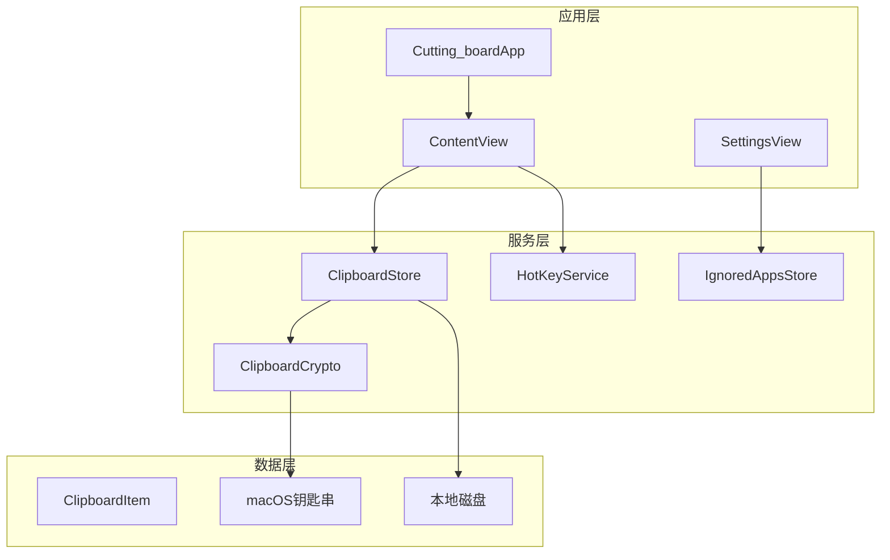
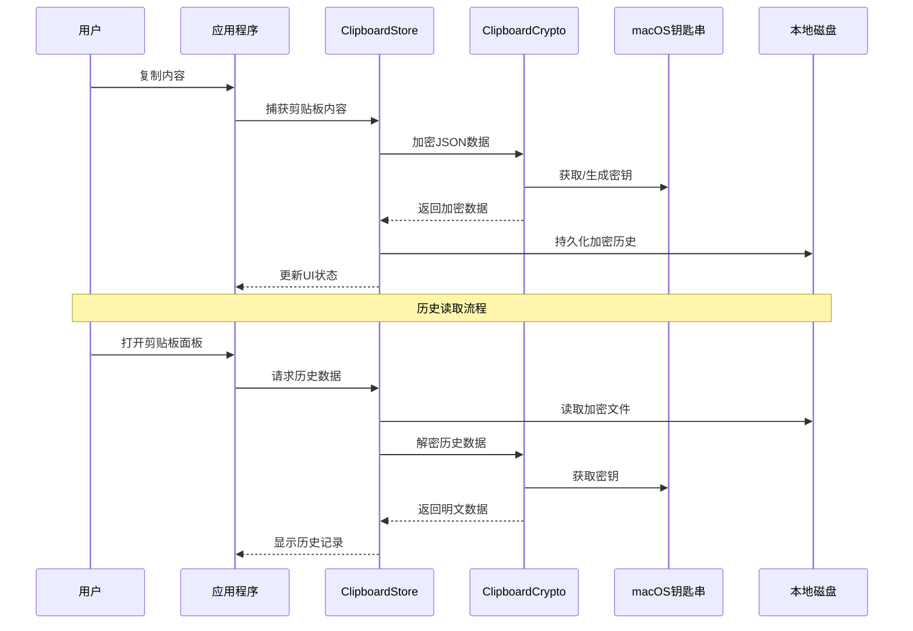
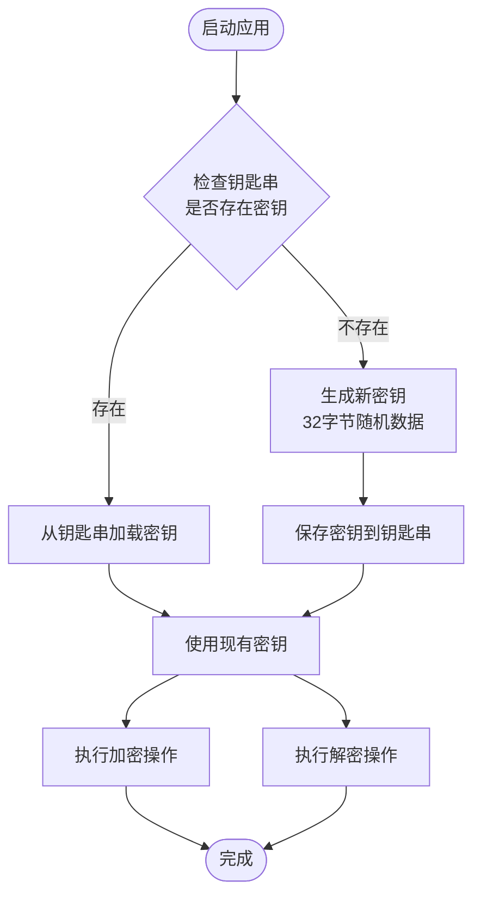
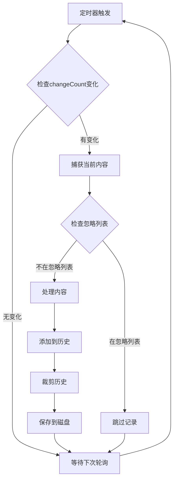
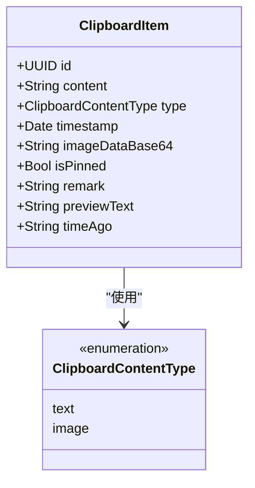
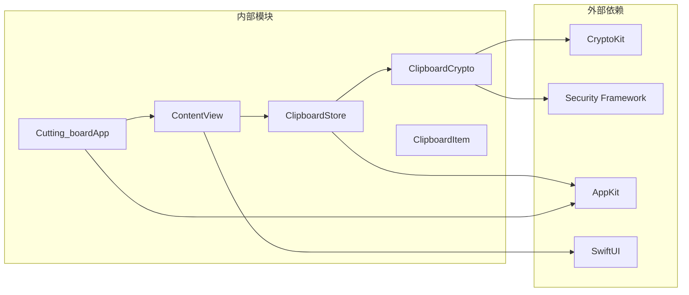
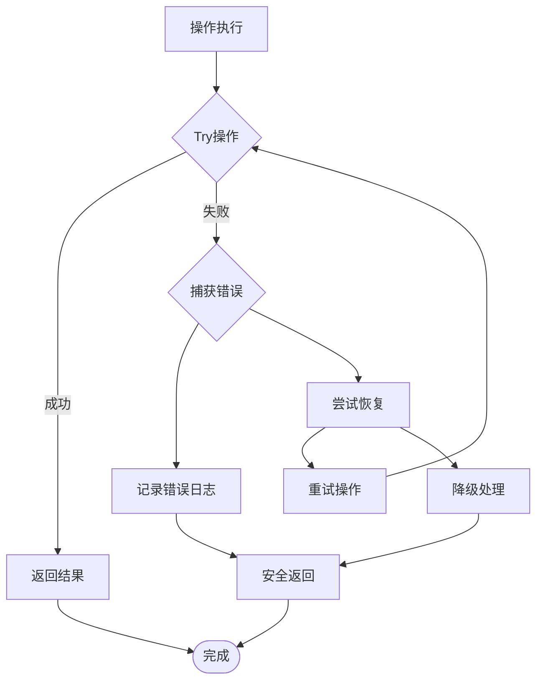

# 剪贴板加密服务API

<cite>
**本文档引用的文件**
- [ClipboardCrypto.swift](file://Cutting_board/Services/ClipboardCrypto.swift)
- [ClipboardStore.swift](file://Cutting_board/Services/ClipboardStore.swift)
- [ClipboardItem.swift](file://Cutting_board/Models/ClipboardItem.swift)
- [HotKeyService.swift](file://Cutting_board/Services/HotKeyService.swift)
- [IgnoredAppsStore.swift](file://Cutting_board/Services/IgnoredAppsStore.swift)
- [ContentView.swift](file://Cutting_board/ContentView.swift)
- [Cutting_boardApp.swift](file://Cutting_board/Cutting_boardApp.swift)
- [SettingsView.swift](file://Cutting_board/SettingsView.swift)
</cite>

## 目录
1. [简介](#简介)
2. [项目结构](#项目结构)
3. [核心组件](#核心组件)
4. [架构概览](#架构概览)
5. [详细组件分析](#详细组件分析)
6. [依赖关系分析](#依赖关系分析)
7. [性能考虑](#性能考虑)
8. [故障排除指南](#故障排除指南)
9. [结论](#结论)

## 简介

ClipboardCrypto是一个基于macOS的剪贴板加密服务，采用AES-GCM加密算法和macOS钥匙串进行密钥管理，为剪贴板历史记录提供端到端加密保护。该服务通过全局快捷键Command+P快速调起剪贴板面板，支持文本和图片内容的自动捕获与历史管理。

## 项目结构

项目采用模块化设计，主要分为以下几个核心模块：

**图表来源**
- [Cutting_boardApp.swift](file://Cutting_board/Cutting_boardApp.swift#L11-L31)
- [ContentView.swift](file://Cutting_board/ContentView.swift#L20-L95)
- [ClipboardStore.swift](file://Cutting_board/Services/ClipboardStore.swift#L14-L39)

**章节来源**
- [Cutting_boardApp.swift](file://Cutting_board/Cutting_boardApp.swift#L11-L31)
- [ContentView.swift](file://Cutting_board/ContentView.swift#L20-L95)
- [ClipboardStore.swift](file://Cutting_board/Services/ClipboardStore.swift#L14-L39)

## 核心组件

### ClipboardCrypto - 加密服务

ClipboardCrypto是整个系统的加密核心，负责密钥管理和数据加解密操作。

**主要特性：**
- AES-GCM对称加密算法
- macOS钥匙串密钥管理
- 自动密钥生成与持久化
- 兼容性处理（支持明文历史）

**章节来源**
- [ClipboardCrypto.swift](file://Cutting_board/Services/ClipboardCrypto.swift#L16-L72)

### ClipboardStore - 历史存储

ClipboardStore负责剪贴板内容的监控、存储和管理，实现了完整的生命周期管理。

**主要特性：**
- 实时剪贴板监控（0.5秒轮询）
- 历史记录持久化
- 内容去重与排序
- 异步I/O操作

**章节来源**
- [ClipboardStore.swift](file://Cutting_board/Services/ClipboardStore.swift#L14-L222)

### 数据模型

系统定义了完整的数据模型体系，确保数据的一致性和可扩展性。

**章节来源**
- [ClipboardItem.swift](file://Cutting_board/Models/ClipboardItem.swift#L17-L89)

## 架构概览

系统采用分层架构设计，各层职责清晰分离：

**图表来源**
- [ClipboardStore.swift](file://Cutting_board/Services/ClipboardStore.swift#L183-L221)
- [ClipboardCrypto.swift](file://Cutting_board/Services/ClipboardCrypto.swift#L32-L46)

## 详细组件分析

### ClipboardCrypto API详解

#### 密钥管理机制

ClipboardCrypto实现了完整的密钥生命周期管理：

**图表来源**
- [ClipboardCrypto.swift](file://Cutting_board/Services/ClipboardCrypto.swift#L21-L29)
- [ClipboardCrypto.swift](file://Cutting_board/Services/ClipboardCrypto.swift#L48-L71)

#### AES-GCM加密实现

系统采用AES-GCM模式进行加密，提供机密性和完整性保护：

**加密格式规范：**
- 魔法头标识符：3字节（"CB1"）
- 加密载荷：AES-GCM密封盒的combined字段
- 完整格式：魔法头 + 密封盒组合数据

**章节来源**
- [ClipboardCrypto.swift](file://Cutting_board/Services/ClipboardCrypto.swift#L12-L14)
- [ClipboardCrypto.swift](file://Cutting_board/Services/ClipboardCrypto.swift#L31-L36)

#### API方法详解

##### encrypt() 方法

**方法签名：** `func encrypt(_ data: Data) throws -> Data`

**参数说明：**
- `data`: 待加密的原始数据（通常是JSON编码的剪贴板历史）

**返回值：**
- `Data`: 加密后的数据，格式为"CB1" + AES-GCM密封盒

**异常处理：**
- `CocoaError(.coderInvalidValue)`: 当AES-GCM密封盒无法生成时抛出

**章节来源**
- [ClipboardCrypto.swift](file://Cutting_board/Services/ClipboardCrypto.swift#L32-L36)

##### decrypt() 方法

**方法签名：** `func decrypt(_ data: Data) throws -> Data`

**参数说明：**
- `data`: 待解密的数据

**返回值：**
- `Data`: 解密后的明文数据
- 如果数据不是加密格式，直接返回原始数据（兼容性处理）

**兼容性逻辑：**
- 检查数据前缀是否为"CB1"魔法头
- 如果没有魔法头，认为是明文历史，直接返回
- 如果有魔法头，执行AES-GCM解密

**章节来源**
- [ClipboardCrypto.swift](file://Cutting_board/Services/ClipboardCrypto.swift#L38-L46)

#### 钥匙串集成

系统通过Security框架与macOS钥匙串深度集成：

**钥匙串配置：**
- 服务名称：`"WJIAEN.Cutting-board.clipboard"`
- 账户名称：`"history-key"`
- 数据格式：32字节二进制数据

**安全特性：**
- 密钥自动加密存储
- 系统级访问控制
- 隐私保护机制

**章节来源**
- [ClipboardCrypto.swift](file://Cutting_board/Services/ClipboardCrypto.swift#L12-L13)
- [ClipboardCrypto.swift](file://Cutting_board/Services/ClipboardCrypto.swift#L48-L71)

### ClipboardStore 组件分析

#### 剪贴板监控机制

ClipboardStore实现了高效的剪贴板监控系统：

**图表来源**
- [ClipboardStore.swift](file://Cutting_board/Services/ClipboardStore.swift#L47-L60)
- [ClipboardStore.swift](file://Cutting_board/Services/ClipboardStore.swift#L65-L90)

#### 内容捕获策略

系统支持多种内容类型的智能捕获：

**图片内容处理：**
- 优先检测图片格式
- 转换为PNG格式
- Base64编码存储
- 生成缩略图预览

**文本内容处理：**
- 过滤空白内容
- 保持原始格式
- 支持Markdown预览

**章节来源**
- [ClipboardStore.swift](file://Cutting_board/Services/ClipboardStore.swift#L70-L90)

#### 持久化策略

采用异步队列和加密存储的双重保障：

**存储流程：**
1. JSON序列化剪贴板项目
2. 异步加密处理
3. 文件系统持久化
4. 错误恢复机制

**线程安全：**
- 主线程更新UI
- 后台队列处理I/O
- 弱引用避免循环引用

**章节来源**
- [ClipboardStore.swift](file://Cutting_board/Services/ClipboardStore.swift#L209-L221)
- [ClipboardStore.swift](file://Cutting_board/Services/ClipboardStore.swift#L183-L208)

### 数据模型设计

#### ClipboardItem 结构

**图表来源**
- [ClipboardItem.swift](file://Cutting_board/Models/ClipboardItem.swift#L17-L45)
- [ClipboardItem.swift](file://Cutting_board/Models/ClipboardItem.swift#L11-L14)

**章节来源**
- [ClipboardItem.swift](file://Cutting_board/Models/ClipboardItem.swift#L17-L89)

## 依赖关系分析

系统依赖关系清晰，遵循单一职责原则：

**图表来源**
- [ClipboardCrypto.swift](file://Cutting_board/Services/ClipboardCrypto.swift#L8-L10)
- [ClipboardStore.swift](file://Cutting_board/Services/ClipboardStore.swift#L8-L11)

**章节来源**
- [ClipboardCrypto.swift](file://Cutting_board/Services/ClipboardCrypto.swift#L8-L10)
- [ClipboardStore.swift](file://Cutting_board/Services/ClipboardStore.swift#L8-L11)

## 性能考虑

### 内存管理最佳实践

1. **弱引用使用**：所有定时器和观察者都使用弱引用避免循环引用
2. **异步处理**：I/O操作在后台队列执行，避免阻塞主线程
3. **数据缓存**：图片内容使用Base64缓存，减少重复计算
4. **内存限制**：历史记录数量动态调整，防止内存溢出

### 加密性能优化

1. **密钥复用**：密钥在内存中缓存，避免频繁钥匙串访问
2. **批量处理**：历史记录批量加密，减少系统调用次数
3. **零拷贝优化**：使用Data的withUnsafeMutableBytes进行高效内存操作

### I/O性能优化

1. **延迟保存**：内容变更后延迟保存，合并多次写入
2. **增量更新**：只更新变化的部分，减少磁盘写入
3. **压缩策略**：Base64编码减少存储空间占用

## 故障排除指南

### 常见问题及解决方案

#### 钥匙串访问失败

**症状：** 无法生成或加载加密密钥
**原因：** 钥匙串权限问题或系统错误
**解决方案：** 
1. 检查应用权限设置
2. 重启钥匙串服务
3. 重新启动应用程序

#### 加密数据损坏

**症状：** 历史记录无法读取
**原因：** 数据损坏或密钥丢失
**解决方案：**
1. 检查文件完整性
2. 重新生成密钥（将丢失现有历史）
3. 恢复备份文件

#### 性能问题

**症状：** 应用响应缓慢
**原因：** 过多的历史记录或频繁的I/O操作
**解决方案：**
1. 调整最大历史记录数量
2. 检查磁盘空间
3. 关闭不必要的应用

### 错误处理机制

系统实现了多层次的错误处理：

**章节来源**
- [ClipboardStore.swift](file://Cutting_board/Services/ClipboardStore.swift#L192-L206)

## 结论

ClipboardCrypto提供了一个完整、安全、高效的剪贴板加密解决方案。通过AES-GCM加密算法和macOS钥匙串的安全存储，有效保护了用户的隐私数据。系统的模块化设计和完善的错误处理机制确保了良好的用户体验和可靠性。

主要优势：
- **安全性**：端到端加密，密钥安全存储
- **易用性**：自动监控，无缝集成
- **性能**：异步处理，内存优化
- **兼容性**：向前兼容，平滑升级

未来改进建议：
- 增加密钥轮换机制
- 实现跨设备同步
- 添加更多内容类型支持
- 优化存储效率