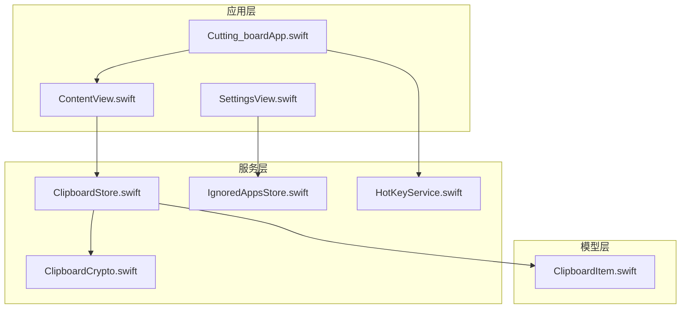
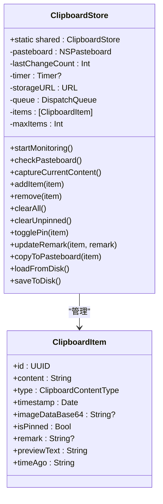
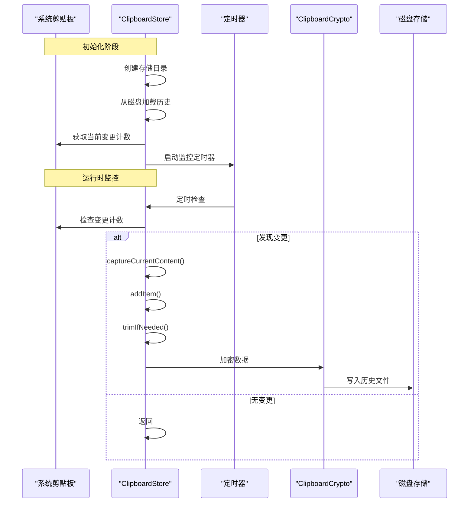
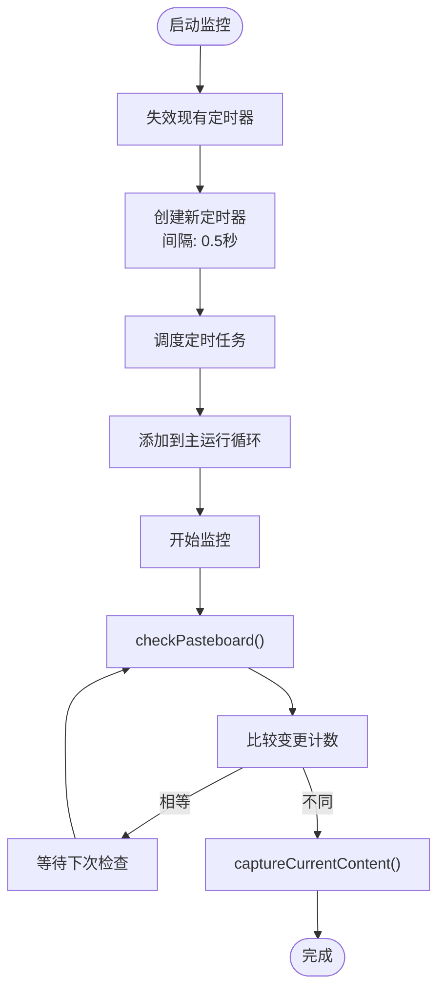
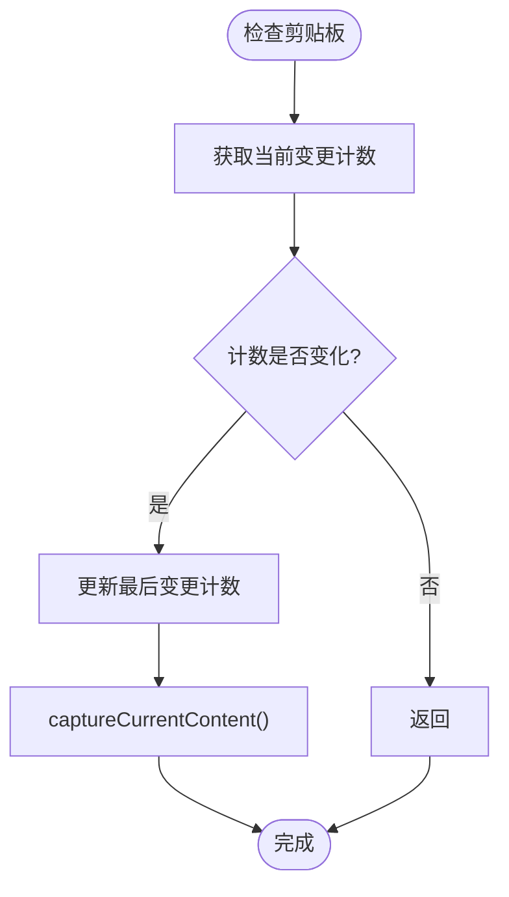
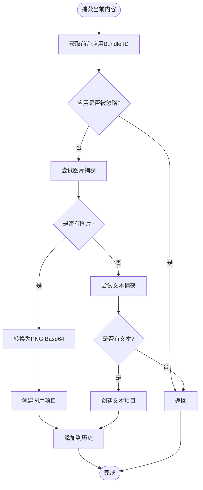
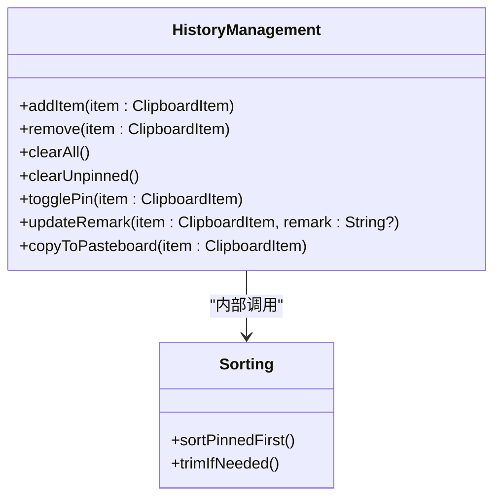
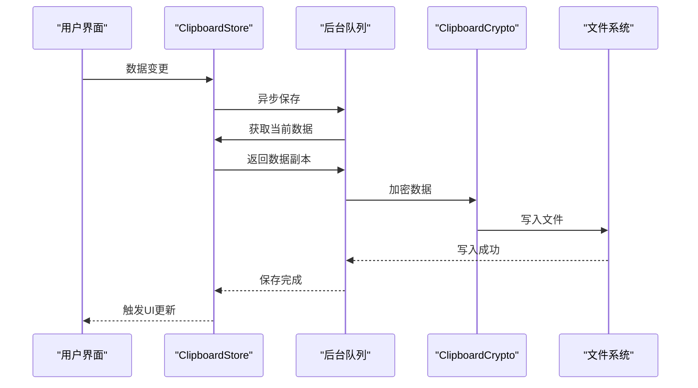
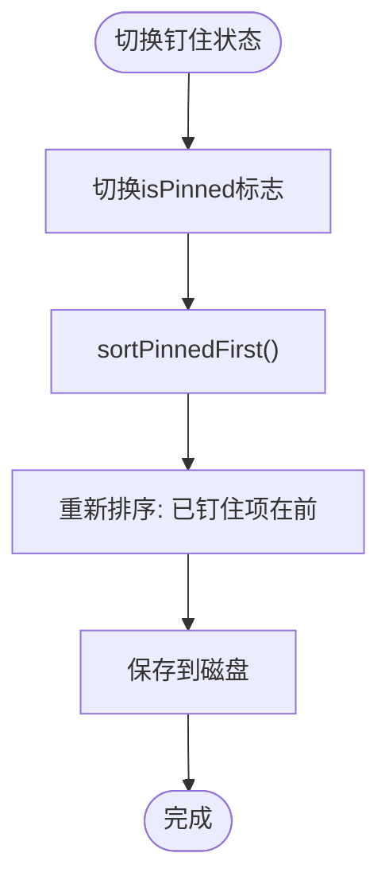
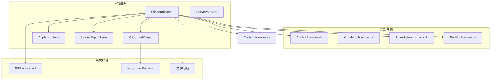

# 剪贴板存储服务API

<cite>
**本文档引用的文件**
- [ClipboardStore.swift](file://Cutting_board/Services/ClipboardStore.swift)
- [ClipboardItem.swift](file://Cutting_board/Models/ClipboardItem.swift)
- [ClipboardCrypto.swift](file://Cutting_board/Services/ClipboardCrypto.swift)
- [ContentView.swift](file://Cutting_board/ContentView.swift)
- [SettingsView.swift](file://Cutting_board/SettingsView.swift)
- [IgnoredAppsStore.swift](file://Cutting_board/Services/IgnoredAppsStore.swift)
- [HotKeyService.swift](file://Cutting_board/Services/HotKeyService.swift)
- [Cutting_boardApp.swift](file://Cutting_board/Cutting_boardApp.swift)
</cite>

## 目录
1. [简介](#简介)
2. [项目结构](#项目结构)
3. [核心组件](#核心组件)
4. [架构概览](#架构概览)
5. [详细组件分析](#详细组件分析)
6. [依赖关系分析](#依赖关系分析)
7. [性能考虑](#性能考虑)
8. [故障排除指南](#故障排除指南)
9. [结论](#结论)

## 简介

ClipboardStore是Cutting_board应用中的核心剪贴板存储服务，负责监控系统剪贴板变化、管理历史记录、处理数据持久化以及提供用户交互功能。该服务采用单例模式设计，通过观察者模式与UI层进行数据绑定，并实现了完整的数据加密存储机制。

## 项目结构

该项目采用基于功能模块的组织方式，主要包含以下核心目录：



**图表来源**
- [Cutting_boardApp.swift](file://Cutting_board/Cutting_boardApp.swift#L1-L144)
- [ContentView.swift](file://Cutting_board/ContentView.swift#L1-L500)
- [ClipboardStore.swift](file://Cutting_board/Services/ClipboardStore.swift#L1-L223)

**章节来源**
- [Cutting_boardApp.swift](file://Cutting_board/Cutting_boardApp.swift#L1-L144)
- [ContentView.swift](file://Cutting_board/ContentView.swift#L1-L500)

## 核心组件

### 单例模式初始化

ClipboardStore采用标准的单例模式实现，确保在整个应用生命周期内只有一个实例存在：



**图表来源**
- [ClipboardStore.swift](file://Cutting_board/Services/ClipboardStore.swift#L14-L39)
- [ClipboardItem.swift](file://Cutting_board/Models/ClipboardItem.swift#L17-L45)

### @Published属性系统

服务使用SwiftUI的@Published属性实现响应式数据绑定：

- `items`: 历史记录数组，支持实时UI更新
- `maxItems`: 最大历史条目数量配置
- `lastChangeCount`: 系统剪贴板变更计数器

**章节来源**
- [ClipboardStore.swift](file://Cutting_board/Services/ClipboardStore.swift#L17-L23)

## 架构概览



**图表来源**
- [ClipboardStore.swift](file://Cutting_board/Services/ClipboardStore.swift#L31-L60)
- [ClipboardStore.swift](file://Cutting_board/Services/ClipboardStore.swift#L183-L221)

## 详细组件分析

### 剪贴板监控机制

#### startMonitoring()方法

监控系统通过定时器实现，每0.5秒检查一次系统剪贴板状态：



**图表来源**
- [ClipboardStore.swift](file://Cutting_board/Services/ClipboardStore.swift#L47-L53)

#### checkPasteboard()方法

实现智能的变更检测机制：



**图表来源**
- [ClipboardStore.swift](file://Cutting_board/Services/ClipboardStore.swift#L55-L60)

#### captureCurrentContent()方法

智能内容捕获逻辑，支持文本和图片两种类型：



**图表来源**
- [ClipboardStore.swift](file://Cutting_board/Services/ClipboardStore.swift#L65-L90)

### 历史记录管理API

#### 数据增删改查方法



**图表来源**
- [ClipboardStore.swift](file://Cutting_board/Services/ClipboardStore.swift#L94-L165)

#### addItem()方法工作原理

去重和智能排序机制：

1. **去重检查**: 比较新项目与历史记录的content、type和imageDataBase64
2. **智能插入**: 将新项目插入到已钉住项目的末尾位置
3. **自动修剪**: 调用trimIfNeeded()确保不超过maxItems限制

**章节来源**
- [ClipboardStore.swift](file://Cutting_board/Services/ClipboardStore.swift#L94-L108)

#### 数据持久化接口



**图表来源**
- [ClipboardStore.swift](file://Cutting_board/Services/ClipboardStore.swift#L210-L221)

**章节来源**
- [ClipboardStore.swift](file://Cutting_board/Services/ClipboardStore.swift#L183-L221)

### 用户操作方法

#### togglePin()方法

实现项目钉住/取消钉住功能：



**图表来源**
- [ClipboardStore.swift](file://Cutting_board/Services/ClipboardStore.swift#L118-L122)

#### updateRemark()方法

提供备注编辑功能：

1. **数据清理**: 移除前后空白字符
2. **空值处理**: 空字符串转换为nil
3. **持久化**: 自动保存到磁盘

**章节来源**
- [ClipboardStore.swift](file://Cutting_board/Services/ClipboardStore.swift#L125-L129)

## 依赖关系分析



**图表来源**
- [ClipboardStore.swift](file://Cutting_board/Services/ClipboardStore.swift#L8-L11)
- [ClipboardCrypto.swift](file://Cutting_board/Services/ClipboardCrypto.swift#L8-L10)

### 组件耦合度分析

- **高内聚**: ClipboardStore集中管理所有剪贴板相关功能
- **低耦合**: 通过协议和委托模式减少直接依赖
- **清晰边界**: 每个组件职责明确，接口简单

**章节来源**
- [ClipboardStore.swift](file://Cutting_board/Services/ClipboardStore.swift#L1-L223)

## 性能考虑

### 线程安全设计

1. **串行队列**: 所有磁盘操作在专用队列中执行
2. **弱引用**: 定时器和回调使用弱引用避免循环引用
3. **主线程更新**: UI更新始终在主线程执行

### 性能优化建议

1. **内存管理**: 
   - 图片数据使用Base64编码存储
   - 支持图片缩略图缓存

2. **I/O优化**:
   - 异步文件读写操作
   - 批量保存策略

3. **监控效率**:
   - 0.5秒检查间隔平衡响应性和性能
   - 变更计数器避免不必要的处理

4. **存储优化**:
   - AES-GCM加密确保数据安全
   - ISO8601日期格式提高可读性

**章节来源**
- [ClipboardStore.swift](file://Cutting_board/Services/ClipboardStore.swift#L29-L39)
- [ClipboardStore.swift](file://Cutting_board/Services/ClipboardStore.swift#L210-L221)

## 故障排除指南

### 常见问题及解决方案

#### 剪贴板监控失效

**症状**: 新复制的内容不显示在历史中

**排查步骤**:
1. 检查定时器是否正常运行
2. 验证变更计数器是否正确更新
3. 确认应用是否在前台被忽略列表中

**解决方案**:
```swift
// 重启监控服务
clipboardStore.deinit()
let newStore = ClipboardStore.shared
newStore.startMonitoring()
```

#### 数据持久化失败

**症状**: 应用重启后历史记录丢失

**排查步骤**:
1. 检查存储目录权限
2. 验证Keychain访问权限
3. 确认文件格式正确性

**解决方案**:
```swift
// 手动触发保存
clipboardStore.saveToDisk()

// 检查存储路径
print(clipboardStore.storageURL.path)
```

#### 性能问题

**症状**: 应用响应缓慢或CPU占用过高

**优化措施**:
1. 调整监控频率
2. 减少历史记录数量
3. 清理未使用的图片缓存

**章节来源**
- [ClipboardStore.swift](file://Cutting_board/Services/ClipboardStore.swift#L41-L43)
- [ClipboardStore.swift](file://Cutting_board/Services/ClipboardStore.swift#L183-L208)

## 结论

ClipboardStore作为剪贴板管理的核心组件，展现了优秀的架构设计和实现质量。其特点包括：

1. **完整功能**: 覆盖剪贴板监控、历史管理、数据持久化等核心功能
2. **优雅设计**: 采用单例模式和观察者模式，代码结构清晰
3. **性能优化**: 多线程处理、异步I/O、智能缓存策略
4. **安全保障**: AES-GCM加密和Keychain集成确保数据安全
5. **用户体验**: 响应式UI、便捷的用户操作和良好的错误处理

该组件为类似的应用开发提供了优秀的参考实现，特别是在系统级API集成、数据持久化和用户体验优化方面。