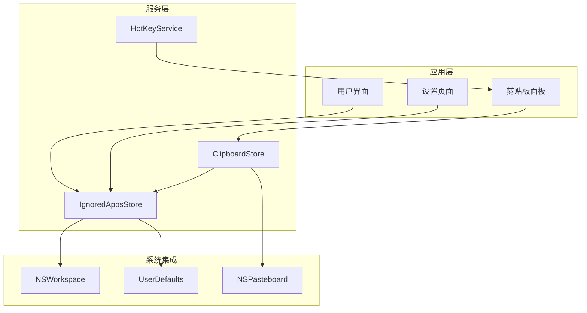
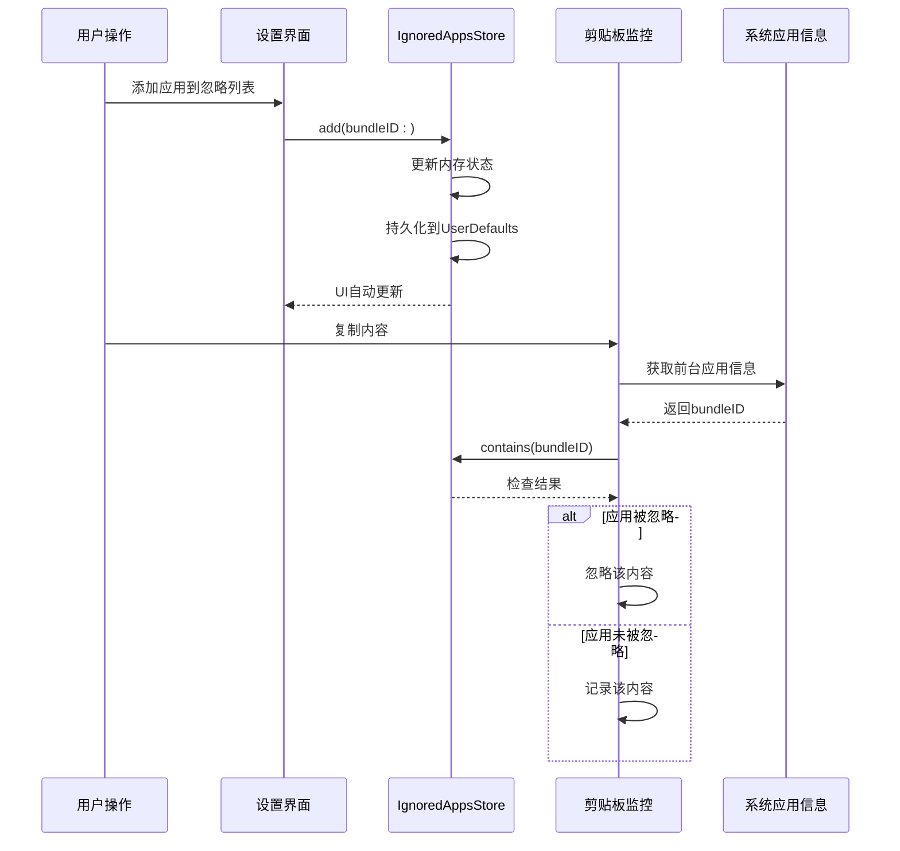
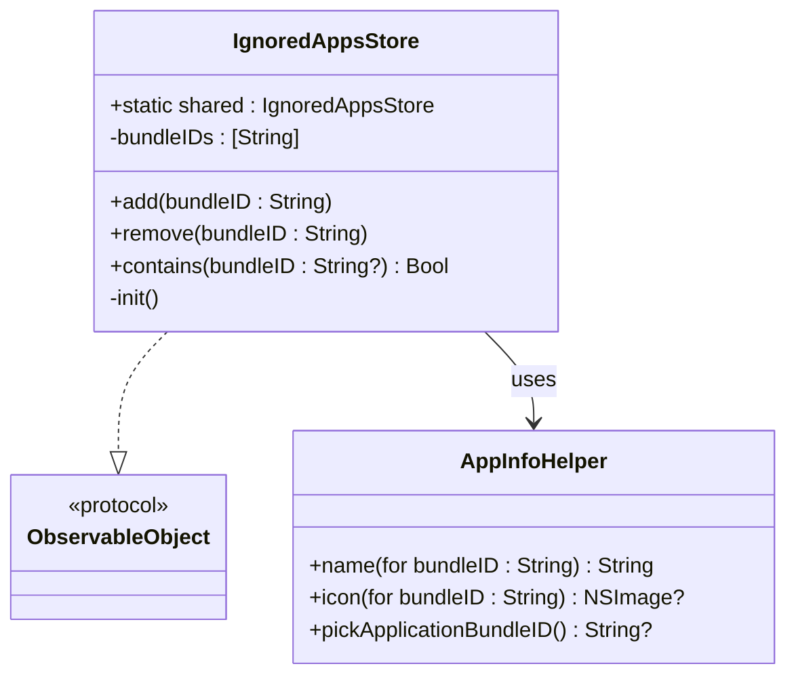
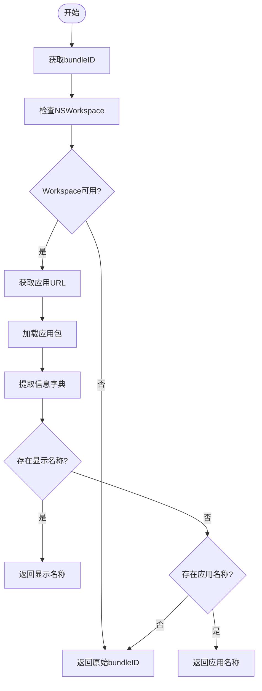
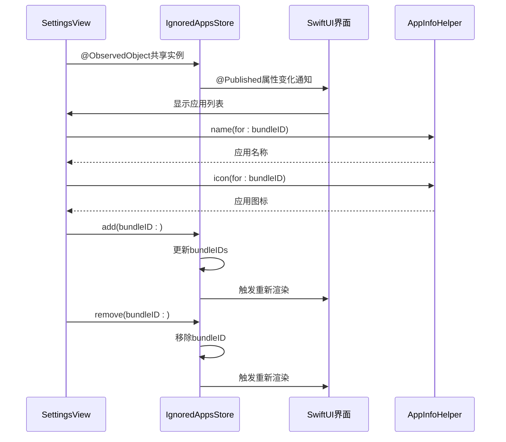
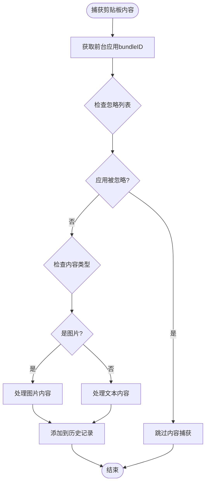
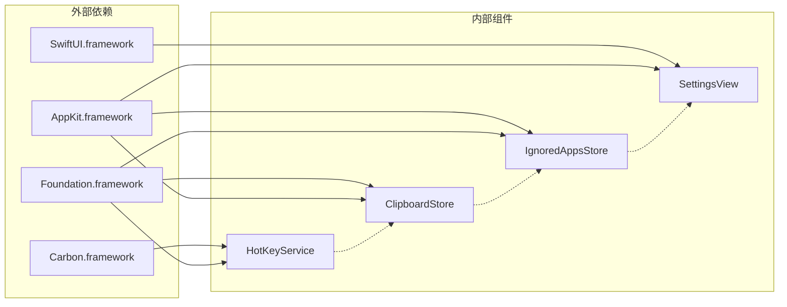

# 忽略应用存储服务API

<cite>
**本文档引用的文件**
- [IgnoredAppsStore.swift](file://Cutting_board/Services/IgnoredAppsStore.swift)
- [SettingsView.swift](file://Cutting_board/SettingsView.swift)
- [ClipboardStore.swift](file://Cutting_board/Services/ClipboardStore.swift)
- [ContentView.swift](file://Cutting_board/ContentView.swift)
- [HotKeyService.swift](file://Cutting_board/Services/HotKeyService.swift)
- [Cutting_boardApp.swift](file://Cutting_board/Cutting_boardApp.swift)
- [ClipboardItem.swift](file://Cutting_board/Models/ClipboardItem.swift)
</cite>

## 目录
1. [简介](#简介)
2. [项目结构](#项目结构)
3. [核心组件](#核心组件)
4. [架构概览](#架构概览)
5. [详细组件分析](#详细组件分析)
6. [依赖关系分析](#依赖关系分析)
7. [性能考虑](#性能考虑)
8. [故障排除指南](#故障排除指南)
9. [结论](#结论)

## 简介

IgnoredAppsStore是Cutting_board应用中的关键组件，负责管理被忽略的应用程序列表。该服务通过统一的API接口提供应用程序忽略功能，与剪贴板监控系统深度集成，实现了智能的内容过滤机制。本文档详细记录了该服务的设计理念、API规范、集成方式以及最佳实践。

## 项目结构

Cutting_board项目采用模块化架构设计，IgnoredAppsStore作为独立的服务模块，与其他核心组件协同工作：

**图表来源**
- [IgnoredAppsStore.swift](file://Cutting_board/Services/IgnoredAppsStore.swift#L16-L40)
- [ClipboardStore.swift](file://Cutting_board/Services/ClipboardStore.swift#L14-L39)

**章节来源**
- [Cutting_boardApp.swift](file://Cutting_board/Cutting_boardApp.swift#L11-L31)
- [HotKeyService.swift](file://Cutting_board/Services/HotKeyService.swift#L30-L81)

## 核心组件

IgnoredAppsStore是一个单例设计模式的可观察对象，提供了简洁而强大的API接口：

### 主要特性
- **单例模式**: 提供全局唯一实例访问
- **响应式更新**: 自动同步到UI界面
- **持久化存储**: 基于UserDefaults的配置持久化
- **系统集成**: 与NSWorkspace深度集成获取应用信息

### 核心API概览

| 方法名 | 参数 | 返回值 | 描述 |
|--------|------|--------|------|
| `shared` | - | IgnoredAppsStore | 获取单例实例 |
| `add(bundleID:)` | String | Void | 添加被忽略的应用程序 |
| `remove(bundleID:)` | String | Void | 移除被忽略的应用程序 |
| `contains(_:)` | String? | Bool | 检查应用程序是否被忽略 |

**章节来源**
- [IgnoredAppsStore.swift](file://Cutting_board/Services/IgnoredAppsStore.swift#L16-L40)

## 架构概览

IgnoredAppsStore在整个应用架构中扮演着关键的过滤器角色，与多个组件形成松耦合的协作关系：

**图表来源**
- [SettingsView.swift](file://Cutting_board/SettingsView.swift#L78-L81)
- [ClipboardStore.swift](file://Cutting_board/Services/ClipboardStore.swift#L65-L69)
- [IgnoredAppsStore.swift](file://Cutting_board/Services/IgnoredAppsStore.swift#L27-L39)

## 详细组件分析

### IgnoredAppsStore类设计

IgnoredAppsStore采用了现代Swift设计模式，结合了单例模式、观察者模式和数据持久化技术：

**图表来源**
- [IgnoredAppsStore.swift](file://Cutting_board/Services/IgnoredAppsStore.swift#L16-L68)

#### 核心方法实现

**add(bundleID:)方法**
- 输入验证：检查bundleID非空且不在现有列表中
- 去重机制：避免重复添加相同的应用程序
- 状态更新：自动触发UI更新和持久化

**remove(bundleID:)方法**
- 精确匹配：移除指定的bundleID
- 批量处理：支持一次性移除多个实例
- 内存优化：及时释放不再使用的资源

**contains(_:)方法**
- 安全检查：处理nil输入参数
- 快速查找：基于集合的O(1)查找复杂度
- 类型安全：明确的可选类型处理

**章节来源**
- [IgnoredAppsStore.swift](file://Cutting_board/Services/IgnoredAppsStore.swift#L27-L39)

### 应用信息集成

AppInfoHelper提供了完整的应用信息获取能力：

#### 应用名称解析流程

**图表来源**
- [IgnoredAppsStore.swift](file://Cutting_board/Services/IgnoredAppsStore.swift#L44-L50)

#### 应用图标获取
- **缓存机制**：利用NSWorkspace的内置缓存
- **路径解析**：通过bundleID定位应用位置
- **格式转换**：自动转换为NSImage格式

**章节来源**
- [IgnoredAppsStore.swift](file://Cutting_board/Services/IgnoredAppsStore.swift#L52-L55)

### 用户界面集成

SettingsView实现了与IgnoredAppsStore的双向绑定：

**图表来源**
- [SettingsView.swift](file://Cutting_board/SettingsView.swift#L12-L81)
- [IgnoredAppsStore.swift](file://Cutting_board/Services/IgnoredAppsStore.swift#L19-L21)

#### 界面交互特性
- **实时更新**：UI自动响应数据变化
- **图标显示**：每个应用项显示对应图标
- **名称解析**：智能应用名称显示
- **操作反馈**：添加和移除操作的即时反馈

**章节来源**
- [SettingsView.swift](file://Cutting_board/SettingsView.swift#L41-L88)

### 剪贴板监控集成

IgnoredAppsStore与ClipboardStore形成了紧密的协作关系：

#### 过滤逻辑实现

**图表来源**
- [ClipboardStore.swift](file://Cutting_board/Services/ClipboardStore.swift#L65-L90)

#### 监控机制
- **定时检查**：每500毫秒检查一次剪贴板变化
- **去重处理**：避免重复内容的多次记录
- **类型识别**：智能区分文本和图片内容
- **性能优化**：使用异步队列处理存储操作

**章节来源**
- [ClipboardStore.swift](file://Cutting_board/Services/ClipboardStore.swift#L47-L90)

### 配置数据持久化

IgnoredAppsStore实现了完整的配置持久化机制：

#### 存储策略
- **UserDefaults集成**：使用标准的用户偏好存储
- **键值管理**：统一的存储键名管理
- **类型安全**：强类型的数组存储
- **初始化处理**：应用启动时自动加载配置

#### 同步机制
- **自动保存**：每次状态变更自动持久化
- **线程安全**：确保多线程环境下的数据一致性
- **错误处理**：优雅处理存储异常情况

**章节来源**
- [IgnoredAppsStore.swift](file://Cutting_board/Services/IgnoredAppsStore.swift#L14-L25)

## 依赖关系分析

IgnoredAppsStore的依赖关系相对简单但功能完整：

**图表来源**
- [IgnoredAppsStore.swift](file://Cutting_board/Services/IgnoredAppsStore.swift#L8-L12)
- [HotKeyService.swift](file://Cutting_board/Services/HotKeyService.swift#L8-L11)

### 关键依赖说明

**AppKit框架**
- NSWorkspace：获取前台应用信息
- NSPasteboard：系统剪贴板访问
- NSImage：图像处理和缩略图生成

**Foundation框架**
- UserDefaults：配置持久化存储
- Bundle：应用程序包信息获取
- NSRegularExpression：正则表达式支持

**SwiftUI框架**
- ObservableObject：响应式数据绑定
- @Published：属性变化通知
- @ObservedObject：外部状态观察

**Carbon框架**
- 全局快捷键注册
- 系统事件处理

**章节来源**
- [HotKeyService.swift](file://Cutting_board/Services/HotKeyService.swift#L8-L11)

## 性能考虑

IgnoredAppsStore在设计时充分考虑了性能优化：

### 内存管理
- **单例模式**：避免重复实例创建
- **弱引用**：在回调中使用弱引用防止循环引用
- **延迟加载**：应用信息按需获取和缓存

### 线程安全
- **主线程更新**：UI更新在主线程执行
- **后台处理**：耗时操作在后台队列执行
- **异步存储**：持久化操作异步进行

### 性能优化策略
- **集合操作**：使用Set进行快速查找
- **懒加载**：应用图标和名称按需解析
- **批量更新**：减少不必要的UI刷新

## 故障排除指南

### 常见问题及解决方案

**问题1：应用无法添加到忽略列表**
- 检查bundleID格式是否正确
- 确认应用确实存在于系统中
- 验证用户是否有足够的权限

**问题2：忽略功能不生效**
- 检查剪贴板监控服务是否正常运行
- 确认忽略列表中的bundleID与实际应用匹配
- 验证系统版本兼容性

**问题3：UI不更新**
- 确认SettingsView正确观察IgnoredAppsStore
- 检查@Published属性是否正常触发
- 验证SwiftUI状态绑定是否正确

**章节来源**
- [SettingsView.swift](file://Cutting_board/SettingsView.swift#L12-L13)
- [IgnoredAppsStore.swift](file://Cutting_board/Services/IgnoredAppsStore.swift#L19-L21)

### 错误处理策略

IgnoredAppsStore采用了渐进式的错误处理机制：

1. **输入验证**：在方法入口处进行参数验证
2. **空值处理**：优雅处理nil和空字符串输入
3. **降级策略**：当系统API不可用时返回默认值
4. **日志记录**：记录关键操作和错误信息

## 结论

IgnoredAppsStore作为Cutting_board应用的核心组件，展现了优秀的软件工程实践：

### 设计优势
- **简洁性**：API设计直观易用
- **可靠性**：完善的错误处理和边界条件检查
- **可维护性**：清晰的代码结构和文档
- **扩展性**：模块化设计便于功能扩展

### 技术亮点
- **响应式编程**：充分利用SwiftUI的响应式特性
- **系统集成**：深度整合macOS系统功能
- **性能优化**：合理的内存管理和异步处理
- **用户体验**：流畅的界面交互和即时反馈

该服务为开发者提供了一个优秀的参考实现，展示了如何在实际项目中平衡功能完整性、性能要求和用户体验。