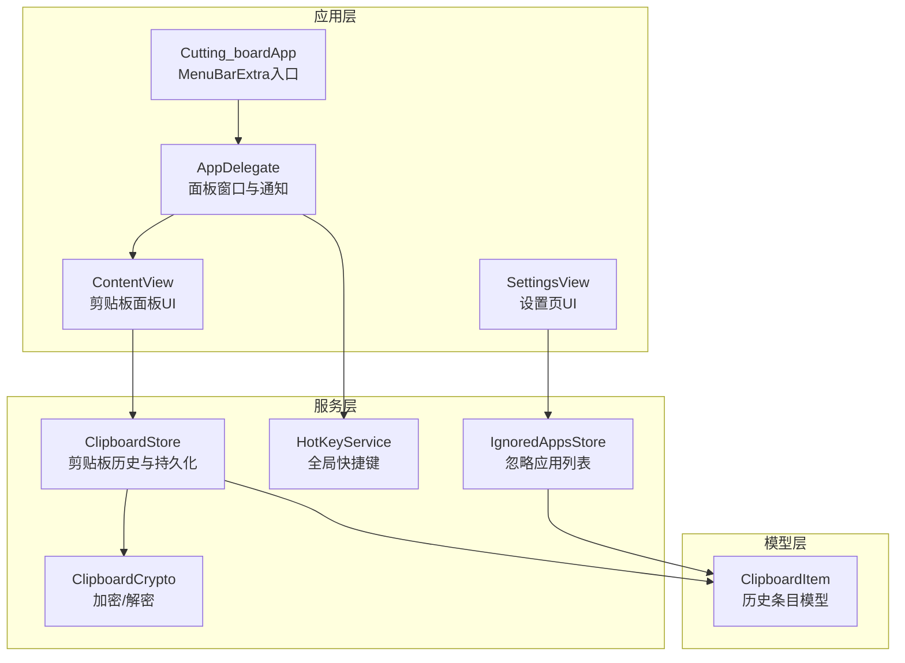
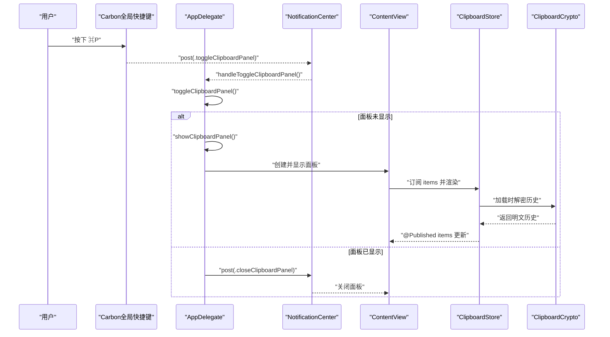
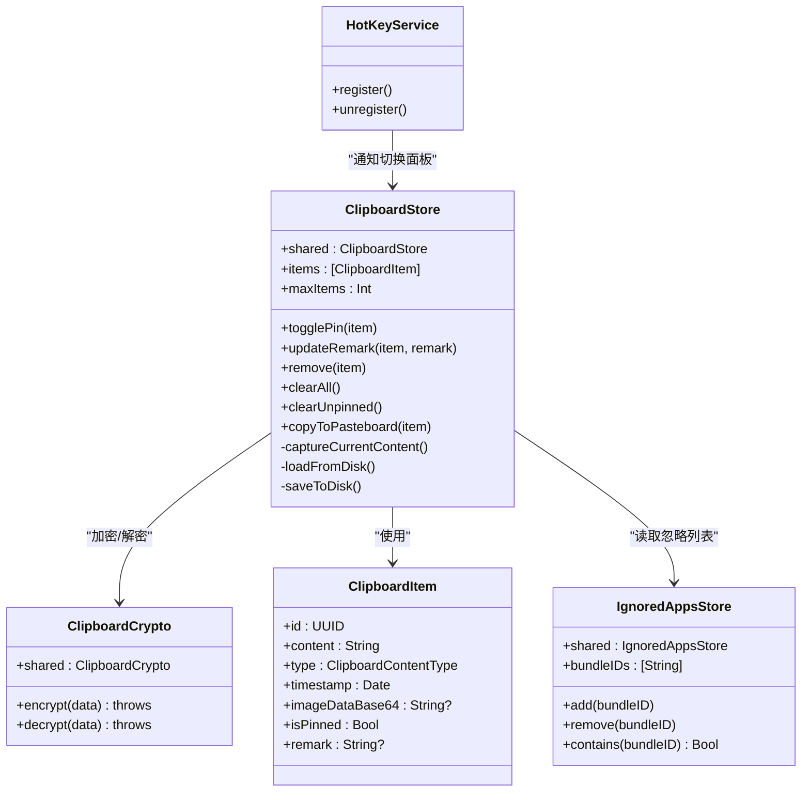

# 核心服务API

<cite>
**本文档引用的文件**
- [ClipboardStore.swift](file://Cutting_board/Services/ClipboardStore.swift)
- [HotKeyService.swift](file://Cutting_board/Services/HotKeyService.swift)
- [ClipboardCrypto.swift](file://Cutting_board/Services/ClipboardCrypto.swift)
- [IgnoredAppsStore.swift](file://Cutting_board/Services/IgnoredAppsStore.swift)
- [ClipboardItem.swift](file://Cutting_board/Models/ClipboardItem.swift)
- [ContentView.swift](file://Cutting_board/ContentView.swift)
- [Cutting_boardApp.swift](file://Cutting_board/Cutting_boardApp.swift)
- [SettingsView.swift](file://Cutting_board/SettingsView.swift)
</cite>

## 目录
1. [简介](#简介)
2. [项目结构](#项目结构)
3. [核心组件](#核心组件)
4. [架构总览](#架构总览)
5. [详细组件分析](#详细组件分析)
6. [依赖关系分析](#依赖关系分析)
7. [性能考量](#性能考量)
8. [故障排查指南](#故障排查指南)
9. [结论](#结论)

## 简介
本文件为 Cutting_board 的核心服务类提供详细的 API 文档，重点覆盖以下服务类：
- ClipboardStore：剪贴板监控与历史本地存储
- HotKeyService：全局快捷键注册与面板控制
- ClipboardCrypto：历史文件加密/解密
- IgnoredAppsStore：忽略应用列表管理

文档将说明各服务类的初始化方式、公共属性、核心方法、参数与返回值类型，并给出使用示例、错误处理机制、性能考虑、线程安全与并发注意事项，以及服务间的依赖关系与调用顺序。

## 项目结构
Cutting_board 采用基于功能模块的服务组织方式，核心服务位于 Services 目录，数据模型位于 Models 目录，UI 层通过 SwiftUI 组织，AppDelegate 负责应用生命周期与全局快捷键的桥接。

图表来源
- [Cutting_boardApp.swift](file://Cutting_board/Cutting_boardApp.swift#L35-L143)
- [ContentView.swift](file://Cutting_board/ContentView.swift#L20-L305)
- [SettingsView.swift](file://Cutting_board/SettingsView.swift#L11-L88)
- [ClipboardStore.swift](file://Cutting_board/Services/ClipboardStore.swift#L14-L222)
- [HotKeyService.swift](file://Cutting_board/Services/HotKeyService.swift#L30-L81)
- [ClipboardCrypto.swift](file://Cutting_board/Services/ClipboardCrypto.swift#L16-L72)
- [IgnoredAppsStore.swift](file://Cutting_board/Services/IgnoredAppsStore.swift#L16-L40)
- [ClipboardItem.swift](file://Cutting_board/Models/ClipboardItem.swift#L17-L89)

章节来源
- [Cutting_boardApp.swift](file://Cutting_board/Cutting_boardApp.swift#L11-L31)
- [ContentView.swift](file://Cutting_board/ContentView.swift#L20-L95)
- [SettingsView.swift](file://Cutting_board/SettingsView.swift#L11-L39)

## 核心组件
本节概述四个核心服务类的职责与对外接口要点：
- ClipboardStore：负责监听系统剪贴板变化、去重、排序、持久化、读取与写回系统剪贴板；提供增删改查与清空操作。
- HotKeyService：使用 Carbon API 注册全局快捷键，向应用发送显示/隐藏/切换面板的通知。
- ClipboardCrypto：提供 AES-GCM 加密与解密，支持带魔数的兼容性处理；密钥通过 Keychain 安全存储。
- IgnoredAppsStore：维护忽略的应用 Bundle ID 列表，提供添加、移除、查询与持久化。

章节来源
- [ClipboardStore.swift](file://Cutting_board/Services/ClipboardStore.swift#L14-L222)
- [HotKeyService.swift](file://Cutting_board/Services/HotKeyService.swift#L30-L81)
- [ClipboardCrypto.swift](file://Cutting_board/Services/ClipboardCrypto.swift#L16-L72)
- [IgnoredAppsStore.swift](file://Cutting_board/Services/IgnoredAppsStore.swift#L16-L40)

## 架构总览
下图展示从用户触发快捷键到剪贴板面板显示与历史读取的整体流程。

图表来源
- [HotKeyService.swift](file://Cutting_board/Services/HotKeyService.swift#L22-L27)
- [Cutting_boardApp.swift](file://Cutting_board/Cutting_boardApp.swift#L135-L142)
- [ContentView.swift](file://Cutting_board/ContentView.swift#L37-L95)
- [ClipboardStore.swift](file://Cutting_board/Services/ClipboardStore.swift#L183-L221)
- [ClipboardCrypto.swift](file://Cutting_board/Services/ClipboardCrypto.swift#L39-L46)

## 详细组件分析

### ClipboardStore API 规范
- 类型与实例
  - 类型：final class ClipboardStore
  - 单例：shared
- 初始化
  - 单例初始化内部完成：创建应用支持目录、历史文件路径、加载磁盘历史、初始化 changeCount、启动定时监控。
- 关键属性
  - items: [ClipboardItem]，@Published，最新在前
  - maxItems: Int，默认 200，超过时会自动裁剪未钉住项
- 核心方法
  - togglePin(item: ClipboardItem) -> Void
    - 功能：切换钉住状态，保持钉住项置顶，触发持久化
    - 参数：item
    - 返回：无
  - updateRemark(item: ClipboardItem, remark: String?) -> Void
    - 功能：更新备注，空字符串视为 nil，触发持久化
    - 参数：item、remark
    - 返回：无
  - remove(item: ClipboardItem) -> Void
    - 功能：删除指定历史项，触发持久化
    - 参数：item
    - 返回：无
  - clearAll() -> Void
    - 功能：清空全部历史
    - 返回：无
  - clearUnpinned() -> Void
    - 功能：清空未钉住历史，保留钉住项
    - 返回：无
  - copyToPasteboard(item: ClipboardItem) -> Void
    - 功能：将选中项写回系统剪贴板，更新 lastChangeCount
    - 参数：item
    - 返回：无
- 内部方法与行为
  - startMonitoring()/checkPasteboard()：定时轮询 NSPasteboard.changeCount，检测变化后抓取当前内容
  - captureCurrentContent()：优先识别图片（PNG Base64），其次识别文本，去重后插入到已钉住项之后
  - trimIfNeeded()：按 maxItems 限制未钉住项数量
  - loadFromDisk()/saveToDisk()：JSON 编码，ISO8601 时间戳，AES-GCM 加密；加载时若非加密格式则回退为明文
- 线程安全与并发
  - 读写队列：内部使用串行队列进行磁盘读写，避免竞态
  - 发布更新：对 items 的整体替换通过主线程异步发布，保证 SwiftUI 订阅正确刷新
  - 监控定时器：RunLoop.main 中调度，回调在主线程分发通知
- 错误处理
  - 加载历史失败：初始化为空列表
  - 解密失败：回退为明文数据
  - 写盘失败：静默忽略（try?）
- 性能考虑
  - 0.5 秒轮询间隔平衡灵敏度与 CPU 占用
  - 去重策略避免重复项进入历史
  - 钉住项不参与裁剪，减少频繁 IO
  - 图片缩略图缓存与懒加载
- 使用示例
  - 获取单例并订阅 items：参考 [ContentView.swift](file://Cutting_board/ContentView.swift#L20-L35)
  - 切换钉住：参考 [ContentView.swift](file://Cutting_board/ContentView.swift#L215-L217)
  - 更新备注：参考 [ContentView.swift](file://Cutting_board/ContentView.swift#L264-L267)
  - 清空未钉住：参考 [ContentView.swift](file://Cutting_board/ContentView.swift#L122-L128)
  - 写回剪贴板：参考 [ContentView.swift](file://Cutting_board/ContentView.swift#L289-L292)

章节来源
- [ClipboardStore.swift](file://Cutting_board/Services/ClipboardStore.swift#L14-L222)
- [ClipboardItem.swift](file://Cutting_board/Models/ClipboardItem.swift#L17-L89)
- [ContentView.swift](file://Cutting_board/ContentView.swift#L20-L305)

### HotKeyService API 规范
- 类型与命名空间
  - 类型：enum HotKeyService（静态方法）
  - 通知名称：Notification.Name.showClipboardPanel、.closeClipboardPanel、.toggleClipboardPanel
- 初始化与注册
  - register()：安装 Carbon 事件处理器，注册 Command+P 为全局热键；失败时清理资源
  - unregister()：注销热键与处理器
- 行为细节
  - 使用 Carbon API，无需辅助功能权限
  - 回调在主线程分发 .toggleClipboardPanel 通知
- 错误处理
  - 注册失败：设置内部状态为未注册，移除处理器
- 使用示例
  - 应用启动时注册：参考 [Cutting_boardApp.swift](file://Cutting_board/Cutting_boardApp.swift#L48-L48)
  - 应用退出时注销：参考 [Cutting_boardApp.swift](file://Cutting_board/Cutting_boardApp.swift#L70-L71)
  - AppDelegate 接收通知并切换面板：参考 [Cutting_boardApp.swift](file://Cutting_board/Cutting_boardApp.swift#L131-L133)

章节来源
- [HotKeyService.swift](file://Cutting_board/Services/HotKeyService.swift#L30-L81)
- [Cutting_boardApp.swift](file://Cutting_board/Cutting_boardApp.swift#L46-L72)

### ClipboardCrypto API 规范
- 类型与实例
  - 类型：struct ClipboardCrypto
  - 单例：shared
- 初始化
  - 私有初始化，内部生成或加载对称密钥
- 核心方法
  - encrypt(data: Data) throws -> Data
    - 功能：AES-GCM 加密封装，返回带魔数的组合数据
    - 参数：待加密数据
    - 返回：加密后的数据
    - 异常：当无法生成 sealedBox.combined 时抛出错误
  - decrypt(data: Data) throws -> Data
    - 功能：若数据带魔数则解密，否则直接返回原数据（兼容旧版明文）
    - 参数：待解密数据
    - 返回：明文数据
    - 异常：解密失败时抛出错误
- 密钥管理
  - key：私有计算属性，优先从 Keychain 加载 32 字节密钥；不存在则随机生成并保存
  - Keychain 查询/新增：使用通用密码类，账户名为 history-key
- 线程安全与并发
  - 密钥生成与 Keychain 访问为同步操作，建议在后台队列调用加密/解密
- 错误处理
  - 密钥加载失败：重新生成并保存
  - 解密失败：回退为明文（兼容）
- 使用示例
  - 历史加载时解密：参考 [ClipboardStore.swift](file://Cutting_board/Services/ClipboardStore.swift#L193-L196)
  - 历史保存时加密：参考 [ClipboardStore.swift](file://Cutting_board/Services/ClipboardStore.swift#L218-L218)

章节来源
- [ClipboardCrypto.swift](file://Cutting_board/Services/ClipboardCrypto.swift#L16-L72)
- [ClipboardStore.swift](file://Cutting_board/Services/ClipboardStore.swift#L183-L221)

### IgnoredAppsStore API 规范
- 类型与实例
  - 类型：final class IgnoredAppsStore
  - 单例：shared
- 初始化
  - 从 UserDefaults 读取忽略的应用 Bundle ID 数组
- 关键属性
  - bundleIDs: [String]，@Published，变更时自动写回 UserDefaults
- 核心方法
  - add(bundleID: String) -> Void
    - 功能：添加非空且不在列表中的 Bundle ID
    - 参数：bundleID
    - 返回：无
  - remove(bundleID: String) -> Void
    - 功能：移除指定 Bundle ID
    - 参数：bundleID
    - 返回：无
  - contains(bundleID: String?) -> Bool
    - 功能：判断是否在忽略列表中
    - 参数：bundleID
    - 返回：布尔值
- 辅助工具
  - AppInfoHelper：根据 Bundle ID 获取应用名、图标；提供选择 .app 的交互式方法
- 线程安全与并发
  - @Published 属性变更通过主线程发布，适合 SwiftUI 订阅
- 错误处理
  - 无效 Bundle ID：直接忽略
- 使用示例
  - 设置页添加/移除应用：参考 [SettingsView.swift](file://Cutting_board/SettingsView.swift#L50-L87)
  - 剪贴板抓取前检查忽略列表：参考 [ClipboardStore.swift](file://Cutting_board/Services/ClipboardStore.swift#L66-L69)

章节来源
- [IgnoredAppsStore.swift](file://Cutting_board/Services/IgnoredAppsStore.swift#L16-L68)
- [SettingsView.swift](file://Cutting_board/SettingsView.swift#L41-L88)
- [ClipboardStore.swift](file://Cutting_board/Services/ClipboardStore.swift#L62-L90)

## 依赖关系分析
- ClipboardStore 依赖
  - ClipboardCrypto：历史文件的加/解密
  - ClipboardItem：历史条目模型
  - IgnoredAppsStore：忽略应用列表（通过 UserDefaults 键）
  - NSPasteboard：系统剪贴板读写
  - UserDefaults：忽略应用列表持久化
  - JSONEncoder/Decoder：历史序列化
- HotKeyService 依赖
  - Carbon：全局快捷键注册
  - NotificationCenter：跨组件通知
- IgnoredAppsStore 依赖
  - NSWorkspace：解析应用信息
  - UserDefaults：持久化
- 应用层依赖
  - AppDelegate：创建面板窗口、接收通知、切换面板
  - ContentView：订阅 ClipboardStore，提供 UI 交互
  - SettingsView：订阅 IgnoredAppsStore，提供设置界面

图表来源
- [ClipboardStore.swift](file://Cutting_board/Services/ClipboardStore.swift#L14-L222)
- [ClipboardCrypto.swift](file://Cutting_board/Services/ClipboardCrypto.swift#L16-L72)
- [IgnoredAppsStore.swift](file://Cutting_board/Services/IgnoredAppsStore.swift#L16-L40)
- [ClipboardItem.swift](file://Cutting_board/Models/ClipboardItem.swift#L17-L89)
- [HotKeyService.swift](file://Cutting_board/Services/HotKeyService.swift#L30-L81)

## 性能考量
- 监控轮询
  - 0.5 秒间隔在灵敏度与 CPU 占用间取得平衡；可按需调整定时器间隔
- 历史容量
  - maxItems 默认 200，钉住项不参与裁剪，避免频繁 IO
- 磁盘读写
  - 使用串行队列进行编码/加密与写盘，避免竞争条件
  - JSON 编码启用 ISO8601 时间戳与排序键，提升一致性
- 图片处理
  - 图片转 PNG Base64 存储，缩略图懒加载并缓存，降低 UI 渲染开销
- 加密成本
  - AES-GCM 加密/解密在后台队列执行，避免阻塞主线程
- SwiftUI 订阅
  - 通过整体替换 items 并在主线程发布，确保 UI 正确响应

[本节为通用性能讨论，不直接分析具体文件]

## 故障排查指南
- 快捷键无效
  - 检查是否成功注册：查看注册返回状态；确认未被其他应用占用
  - 确认 Carbon API 可用且无辅助功能权限要求
  - 参考：[HotKeyService.swift](file://Cutting_board/Services/HotKeyService.swift#L36-L69)
- 面板无法显示
  - 确认 AppDelegate 已创建面板窗口并激活应用
  - 检查通知转发逻辑与窗口可见性
  - 参考：[Cutting_boardApp.swift](file://Cutting_board/Cutting_boardApp.swift#L79-L98), [Cutting_boardApp.swift](file://Cutting_board/Cutting_boardApp.swift#L101-L142)
- 历史为空
  - 检查磁盘历史文件是否存在与可读
  - 若为明文历史，解密兼容逻辑会回退为明文
  - 参考：[ClipboardStore.swift](file://Cutting_board/Services/ClipboardStore.swift#L183-L207)
- 加密异常
  - 检查密钥是否成功从 Keychain 加载
  - 确保 AES-GCM sealedBox.combined 可用
  - 参考：[ClipboardCrypto.swift](file://Cutting_board/Services/ClipboardCrypto.swift#L21-L46), [ClipboardCrypto.swift](file://Cutting_board/Services/ClipboardCrypto.swift#L48-L71)
- 忽略应用列表无效
  - 确认 Bundle ID 非空且存在于系统
  - 检查 UserDefaults 写入是否成功
  - 参考：[IgnoredAppsStore.swift](file://Cutting_board/Services/IgnoredAppsStore.swift#L23-L40)

章节来源
- [HotKeyService.swift](file://Cutting_board/Services/HotKeyService.swift#L36-L69)
- [Cutting_boardApp.swift](file://Cutting_board/Cutting_boardApp.swift#L79-L142)
- [ClipboardStore.swift](file://Cutting_board/Services/ClipboardStore.swift#L183-L207)
- [ClipboardCrypto.swift](file://Cutting_board/Services/ClipboardCrypto.swift#L21-L71)
- [IgnoredAppsStore.swift](file://Cutting_board/Services/IgnoredAppsStore.swift#L23-L40)

## 结论
本文档系统梳理了 Cutting_board 的核心服务类接口与实现细节，明确了初始化方式、公共属性、核心方法、参数与返回值类型，并提供了使用示例、错误处理机制、性能考虑与线程安全说明。结合服务间的依赖关系与调用顺序，开发者可以更高效地理解与集成这些服务，构建稳定可靠的剪贴板历史管理功能。