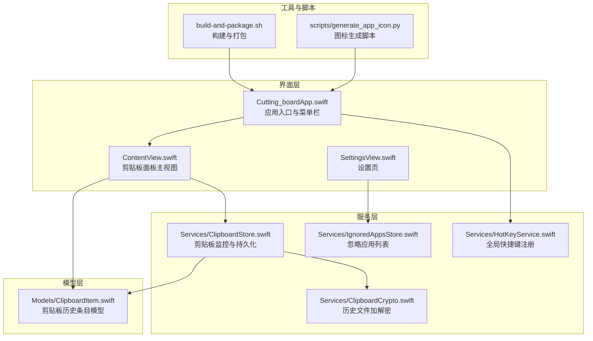
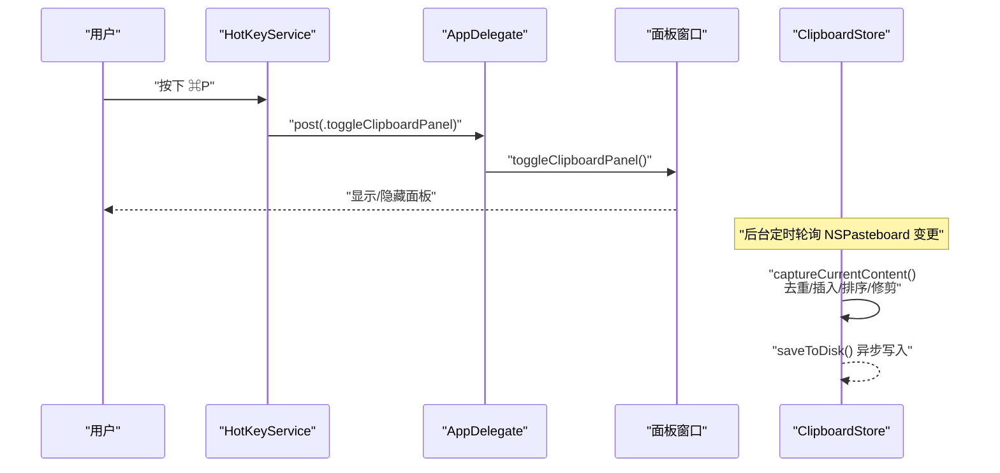
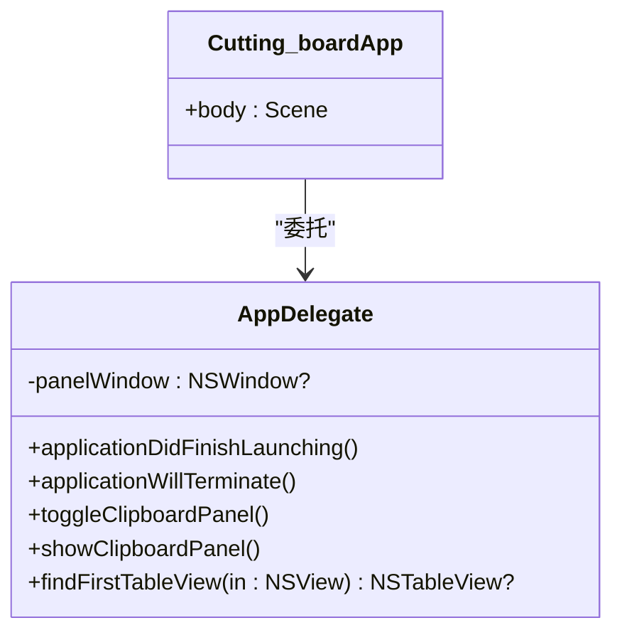
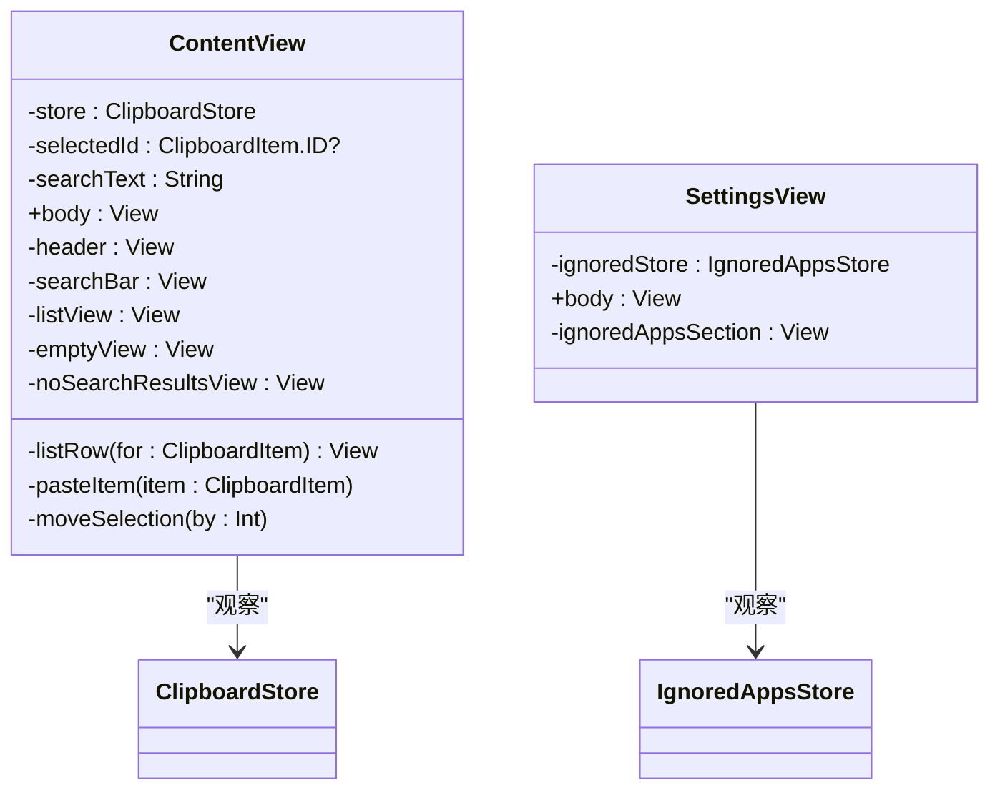
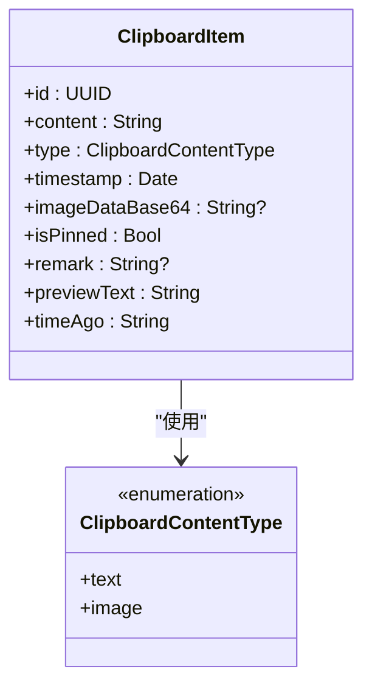
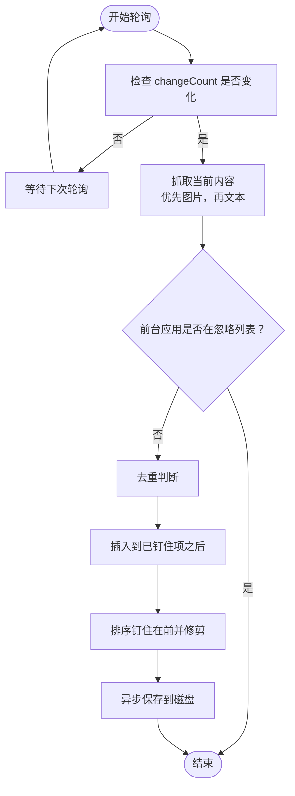
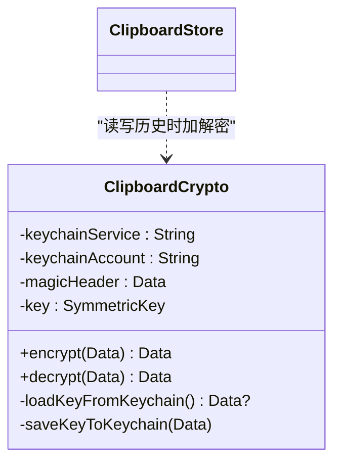
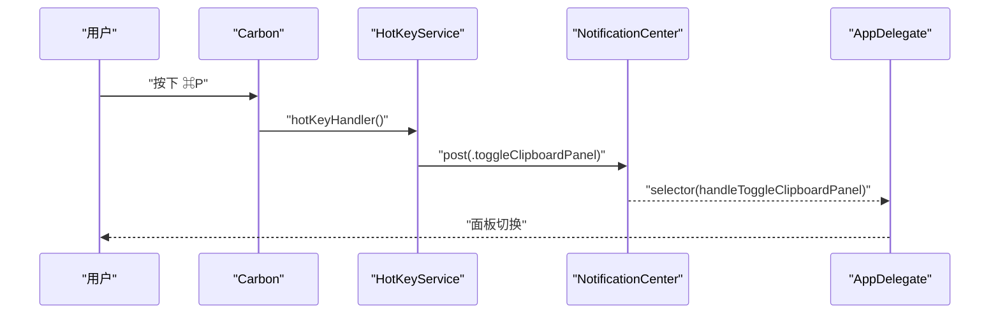
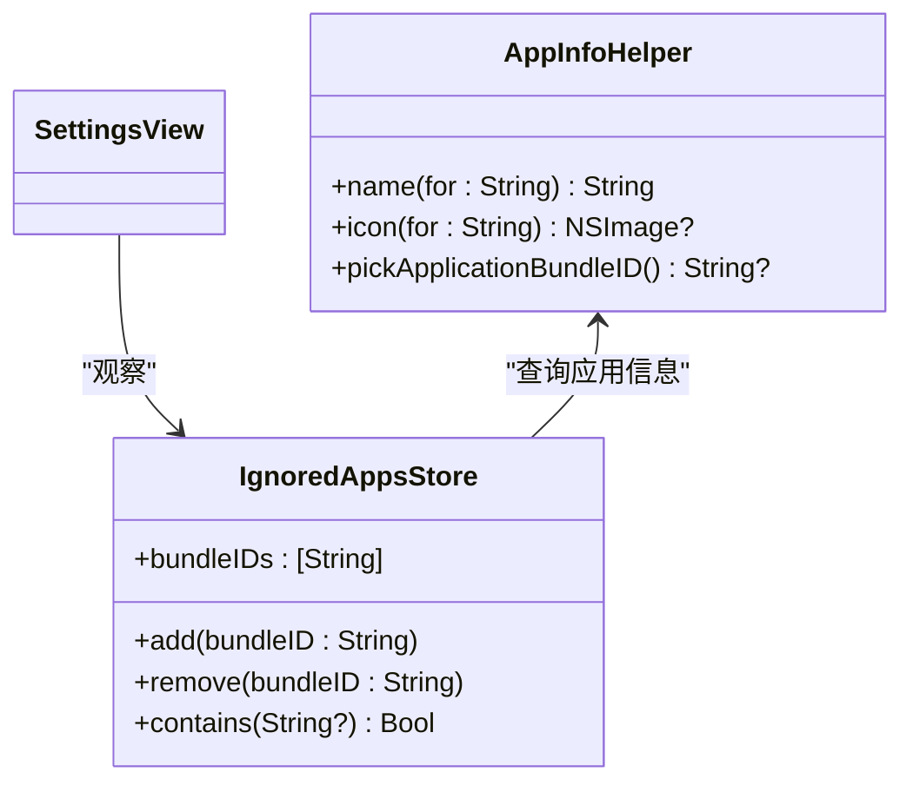
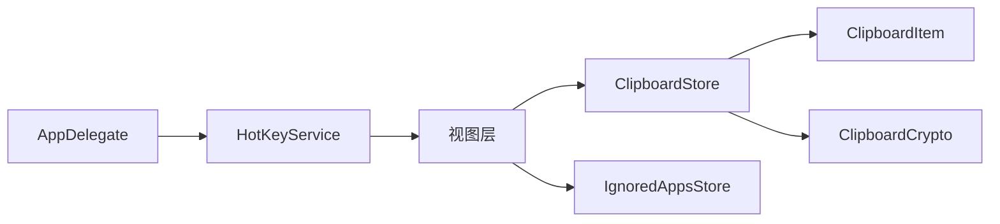

# 代码组织结构

<cite>
**本文引用的文件**
- [Cutting_boardApp.swift](file://Cutting_board/Cutting_boardApp.swift)
- [ContentView.swift](file://Cutting_board/ContentView.swift)
- [SettingsView.swift](file://Cutting_board/SettingsView.swift)
- [ClipboardItem.swift](file://Cutting_board/Models/ClipboardItem.swift)
- [ClipboardStore.swift](file://Cutting_board/Services/ClipboardStore.swift)
- [ClipboardCrypto.swift](file://Cutting_board/Services/ClipboardCrypto.swift)
- [HotKeyService.swift](file://Cutting_board/Services/HotKeyService.swift)
- [IgnoredAppsStore.swift](file://Cutting_board/Services/IgnoredAppsStore.swift)
- [build-and-package.sh](file://build-and-package.sh)
- [generate_app_icon.py](file://scripts/generate_app_icon.py)
</cite>

## 目录
1. [简介](#简介)
2. [项目结构](#项目结构)
3. [核心组件](#核心组件)
4. [架构总览](#架构总览)
5. [详细组件分析](#详细组件分析)
6. [依赖分析](#依赖分析)
7. [性能考虑](#性能考虑)
8. [故障排查指南](#故障排查指南)
9. [结论](#结论)
10. [附录](#附录)

## 简介
本文件面向开发者，系统性梳理 Cutting_board 项目的代码组织结构与模块化设计，覆盖目录与命名规范、源代码分类（Models、Services、Utilities）、模块划分原则、注释与文档规范、接口设计与依赖管理、重构指导与架构演进策略。目标是帮助新成员快速理解项目整体结构与扩展方式。

## 项目结构
项目采用基于职责的分层组织方式，遵循“界面层-模型层-服务层”的清晰边界，配合脚本工具保障构建与打包流程稳定。

图表来源
- [Cutting_boardApp.swift](file://Cutting_board/Cutting_boardApp.swift#L1-L144)
- [ContentView.swift](file://Cutting_board/ContentView.swift#L1-L500)
- [SettingsView.swift](file://Cutting_board/SettingsView.swift#L1-L95)
- [ClipboardItem.swift](file://Cutting_board/Models/ClipboardItem.swift#L1-L90)
- [ClipboardStore.swift](file://Cutting_board/Services/ClipboardStore.swift#L1-L223)
- [ClipboardCrypto.swift](file://Cutting_board/Services/ClipboardCrypto.swift#L1-L73)
- [HotKeyService.swift](file://Cutting_board/Services/HotKeyService.swift#L1-L82)
- [IgnoredAppsStore.swift](file://Cutting_board/Services/IgnoredAppsStore.swift#L1-L69)
- [build-and-package.sh](file://build-and-package.sh#L1-L28)
- [generate_app_icon.py](file://scripts/generate_app_icon.py#L1-L71)

章节来源
- [Cutting_boardApp.swift](file://Cutting_board/Cutting_boardApp.swift#L1-L144)
- [ContentView.swift](file://Cutting_board/ContentView.swift#L1-L500)
- [SettingsView.swift](file://Cutting_board/SettingsView.swift#L1-L95)
- [ClipboardItem.swift](file://Cutting_board/Models/ClipboardItem.swift#L1-L90)
- [ClipboardStore.swift](file://Cutting_board/Services/ClipboardStore.swift#L1-L223)
- [ClipboardCrypto.swift](file://Cutting_board/Services/ClipboardCrypto.swift#L1-L73)
- [HotKeyService.swift](file://Cutting_board/Services/HotKeyService.swift#L1-L82)
- [IgnoredAppsStore.swift](file://Cutting_board/Services/IgnoredAppsStore.swift#L1-L69)
- [build-and-package.sh](file://build-and-package.sh#L1-L28)
- [generate_app_icon.py](file://scripts/generate_app_icon.py#L1-L71)

## 核心组件
- 应用入口与生命周期：通过菜单栏入口提供面板开关与退出；AppDelegate 负责后台运行、自建面板窗口与快捷键交互。
- 视图层：主面板包含头部、搜索、列表与设置；设置页管理忽略应用列表。
- 数据模型：ClipboardItem 描述单条历史记录，包含类型、内容、时间戳、图片 Base64、钉住状态与备注。
- 服务层：
  - ClipboardStore：监控系统剪贴板变化、去重、排序、持久化与读取。
  - ClipboardCrypto：基于 Keychain 的密钥管理与 AES-GCM 加密，兼容明文历史。
  - HotKeyService：使用 Carbon API 注册全局快捷键，无需辅助功能权限。
  - IgnoredAppsStore：维护忽略的应用 Bundle ID 列表，提供名称与图标查询。

章节来源
- [Cutting_boardApp.swift](file://Cutting_board/Cutting_boardApp.swift#L11-L144)
- [ContentView.swift](file://Cutting_board/ContentView.swift#L20-L305)
- [SettingsView.swift](file://Cutting_board/SettingsView.swift#L11-L89)
- [ClipboardItem.swift](file://Cutting_board/Models/ClipboardItem.swift#L10-L89)
- [ClipboardStore.swift](file://Cutting_board/Services/ClipboardStore.swift#L14-L222)
- [ClipboardCrypto.swift](file://Cutting_board/Services/ClipboardCrypto.swift#L16-L72)
- [HotKeyService.swift](file://Cutting_board/Services/HotKeyService.swift#L30-L81)
- [IgnoredAppsStore.swift](file://Cutting_board/Services/IgnoredAppsStore.swift#L16-L68)

## 架构总览
系统采用“事件驱动 + 观察者模式”实现低耦合交互：全局快捷键通过通知中心触发面板显示/隐藏；剪贴板监控通过定时轮询检测变更；存储层负责异步读写与加解密；视图层通过 @Published 数据流驱动 UI 更新。

图表来源
- [HotKeyService.swift](file://Cutting_board/Services/HotKeyService.swift#L30-L81)
- [Cutting_boardApp.swift](file://Cutting_board/Cutting_boardApp.swift#L35-L143)
- [ClipboardStore.swift](file://Cutting_board/Services/ClipboardStore.swift#L47-L108)

## 详细组件分析

### 应用入口与生命周期（Cutting_boardApp.swift）
- 职责分离：App 主体负责菜单栏入口与快捷键注册；AppDelegate 负责窗口生命周期与通知处理。
- 关键点：
  - 使用 NSApplicationDelegateAdaptor 暴露 AppDelegate。
  - 自建 NSWindow 承载 SwiftUI 视图，避免 LSUIElement 下的 WindowGroup 限制。
  - 注册/注销全局快捷键与通知观察者，确保进程终止时资源回收。

图表来源
- [Cutting_boardApp.swift](file://Cutting_board/Cutting_boardApp.swift#L11-L143)

章节来源
- [Cutting_boardApp.swift](file://Cutting_board/Cutting_boardApp.swift#L11-L144)

### 视图层（ContentView.swift 与 SettingsView.swift）
- ContentView：包含头部、搜索、列表与空态/无结果态；支持键盘导航、双击粘贴、上下文菜单、备注编辑与设置弹窗。
- SettingsView：展示忽略应用列表，支持添加/移除应用与图标名称显示。
- 设计要点：
  - 使用 Glass 效果与动量动画提升可用性。
  - Accessibility 标签与提示增强无障碍体验。
  - 使用 ScrollViewReader 与 Equatable 优化滚动与渲染性能。

图表来源
- [ContentView.swift](file://Cutting_board/ContentView.swift#L20-L305)
- [SettingsView.swift](file://Cutting_board/SettingsView.swift#L11-L89)

章节来源
- [ContentView.swift](file://Cutting_board/ContentView.swift#L20-L305)
- [SettingsView.swift](file://Cutting_board/SettingsView.swift#L11-L89)

### 数据模型（Models/ClipboardItem.swift）
- 结构定义：UUID、内容、类型、时间戳、图片 Base64、钉住标记、备注。
- 编解码：实现 Codable，支持 JSON 序列化与 ISO8601 时间格式。
- 辅助属性：previewText 截断预览；timeAgo 相对时间描述。

图表来源
- [ClipboardItem.swift](file://Cutting_board/Models/ClipboardItem.swift#L10-L89)

章节来源
- [ClipboardItem.swift](file://Cutting_board/Models/ClipboardItem.swift#L10-L89)

### 服务层

#### 剪贴板存储与监控（ClipboardStore.swift）
- 职责：监控系统剪贴板变化、去重、排序（钉住项置顶）、修剪、持久化与读取。
- 关键流程：
  - 定时器轮询 changeCount，检测变更后抓取当前内容（优先图片，其次文本）。
  - 去重策略：内容相同且类型匹配（图片需 Base64 一致）则忽略。
  - 排序与修剪：保持钉住项在前，按最大容量修剪未钉住项。
  - 持久化：异步队列写入 JSON，使用 ClipboardCrypto 加密。

图表来源
- [ClipboardStore.swift](file://Cutting_board/Services/ClipboardStore.swift#L47-L115)

章节来源
- [ClipboardStore.swift](file://Cutting_board/Services/ClipboardStore.swift#L14-L222)

#### 历史文件加解密（ClipboardCrypto.swift）
- 密钥管理：Keychain 中存储 32 字节对称密钥，不存在时随机生成并保存。
- 加密格式：魔数头 + AES-GCM sealedBox，兼容旧版明文历史。
- 使用场景：读取时若含魔数头则解密，否则直接使用；写入时统一加密。

图表来源
- [ClipboardCrypto.swift](file://Cutting_board/Services/ClipboardCrypto.swift#L16-L72)

章节来源
- [ClipboardCrypto.swift](file://Cutting_board/Services/ClipboardCrypto.swift#L16-L72)

#### 全局快捷键（HotKeyService.swift）
- 使用 Carbon API 注册全局快捷键 Command+P，无需辅助功能权限。
- 通过通知中心派发显示/隐藏/切换面板事件，交由 AppDelegate 处理。

图表来源
- [HotKeyService.swift](file://Cutting_board/Services/HotKeyService.swift#L22-L69)
- [Cutting_boardApp.swift](file://Cutting_board/Cutting_boardApp.swift#L123-L133)

章节来源
- [HotKeyService.swift](file://Cutting_board/Services/HotKeyService.swift#L30-L81)

#### 忽略应用列表（IgnoredAppsStore.swift）
- 维护忽略应用的 Bundle ID 列表，使用 UserDefaults 持久化。
- 提供名称与图标查询，支持通过 NSOpenPanel 选择应用并返回 Bundle ID。

图表来源
- [IgnoredAppsStore.swift](file://Cutting_board/Services/IgnoredAppsStore.swift#L16-L68)

章节来源
- [IgnoredAppsStore.swift](file://Cutting_board/Services/IgnoredAppsStore.swift#L16-L68)

## 依赖分析
- 组件内聚与耦合：
  - 视图层仅依赖服务层提供的单一数据源（ClipboardStore、IgnoredAppsStore），降低耦合。
  - 服务层内部职责清晰：ClipboardStore 负责业务逻辑与持久化；ClipboardCrypto 专注安全；HotKeyService 专注系统交互；IgnoredAppsStore 专注配置。
- 外部依赖：
  - AppKit、SwiftUI、Combine、Foundation、CryptoKit、Security。
- 循环依赖：未发现循环导入或调用链。

图表来源
- [ContentView.swift](file://Cutting_board/ContentView.swift#L20-L305)
- [SettingsView.swift](file://Cutting_board/SettingsView.swift#L11-L89)
- [ClipboardStore.swift](file://Cutting_board/Services/ClipboardStore.swift#L14-L222)
- [ClipboardCrypto.swift](file://Cutting_board/Services/ClipboardCrypto.swift#L16-L72)
- [HotKeyService.swift](file://Cutting_board/Services/HotKeyService.swift#L30-L81)
- [IgnoredAppsStore.swift](file://Cutting_board/Services/IgnoredAppsStore.swift#L16-L68)
- [ClipboardItem.swift](file://Cutting_board/Models/ClipboardItem.swift#L10-L89)

章节来源
- [ContentView.swift](file://Cutting_board/ContentView.swift#L20-L305)
- [SettingsView.swift](file://Cutting_board/SettingsView.swift#L11-L89)
- [ClipboardStore.swift](file://Cutting_board/Services/ClipboardStore.swift#L14-L222)
- [ClipboardCrypto.swift](file://Cutting_board/Services/ClipboardCrypto.swift#L16-L72)
- [HotKeyService.swift](file://Cutting_board/Services/HotKeyService.swift#L30-L81)
- [IgnoredAppsStore.swift](file://Cutting_board/Services/IgnoredAppsStore.swift#L16-L68)
- [ClipboardItem.swift](file://Cutting_board/Models/ClipboardItem.swift#L10-L89)

## 性能考虑
- 异步持久化：存储写入使用独立队列，避免阻塞主线程。
- 去重与排序：插入时进行 O(n) 去重与局部排序，建议在批量更新时合并操作减少重复计算。
- 图片缩略图缓存：对图片项进行缩略图缓存，减少重复解码与绘制开销。
- 动画与可访问性：根据用户“减少动态效果”偏好禁用动画，平衡体验与性能。
- 定时轮询：0.5 秒间隔兼顾实时性与 CPU 占用，可根据系统负载调整。

## 故障排查指南
- 面板无法显示/隐藏
  - 检查全局快捷键是否注册成功，确认 Carbon 回调是否触发通知。
  - 确认 AppDelegate 的面板窗口创建与显示逻辑。
- 剪贴板历史不更新
  - 检查 ClipboardStore 的定时器与 changeCount 检测是否正常。
  - 确认前台应用是否在忽略列表中。
- 历史文件读取失败
  - 检查 ClipboardCrypto 的魔数头识别与 Keychain 密钥加载。
  - 若为旧版明文，确保降级路径可用。
- 构建与打包问题
  - 使用脚本清理扩展属性、签名并打包，确保产物完整性。

章节来源
- [HotKeyService.swift](file://Cutting_board/Services/HotKeyService.swift#L36-L81)
- [Cutting_boardApp.swift](file://Cutting_board/Cutting_boardApp.swift#L78-L143)
- [ClipboardStore.swift](file://Cutting_board/Services/ClipboardStore.swift#L47-L108)
- [ClipboardCrypto.swift](file://Cutting_board/Services/ClipboardCrypto.swift#L32-L46)
- [build-and-package.sh](file://build-and-package.sh#L11-L27)

## 结论
项目采用清晰的分层与职责分离，结合事件驱动与异步持久化，实现了稳定的剪贴板历史管理与便捷的用户交互。建议在后续迭代中进一步抽象通用工具、完善单元测试与集成测试，并持续优化性能与可维护性。

## 附录

### 文件目录与命名规范
- 目录结构
  - Models：存放数据模型与枚举，如 ClipboardItem.swift。
  - Services：存放业务服务与系统交互，如 ClipboardStore.swift、ClipboardCrypto.swift、HotKeyService.swift、IgnoredAppsStore.swift。
  - Utilities：预留工具模块（当前为空，建议存放通用扩展与工具函数）。
  - Assets.xcassets：资源与图标集。
- 命名约定
  - 类型：大驼峰（如 ClipboardStore、ClipboardItem）。
  - 单例：shared 属性统一暴露实例。
  - 通知：Notification.Name 扩展集中定义。
  - 文件：每个类/结构体/枚举对应独立文件，文件名与公开类型一致。

章节来源
- [ClipboardItem.swift](file://Cutting_board/Models/ClipboardItem.swift#L10-L89)
- [ClipboardStore.swift](file://Cutting_board/Services/ClipboardStore.swift#L14-L222)
- [ClipboardCrypto.swift](file://Cutting_board/Services/ClipboardCrypto.swift#L16-L72)
- [HotKeyService.swift](file://Cutting_board/Services/HotKeyService.swift#L12-L16)
- [IgnoredAppsStore.swift](file://Cutting_board/Services/IgnoredAppsStore.swift#L14-L40)

### 代码注释与文档规范
- SwiftDoc 注释
  - 类型与公共方法应提供简要说明与参数/返回值说明。
  - 关键算法与复杂逻辑需补充“为什么这样设计”的背景说明。
- API 文档生成
  - 使用 Xcode 的 DocC 或外部工具（如 jazzy）生成 API 文档，确保注释完整。
- 代码示例
  - 在注释中提供最小可运行示例路径，避免直接粘贴代码内容。
  - 示例应覆盖常见使用场景与边界条件。

### 模块化设计原则
- 职责分离：视图层只负责展示与交互；服务层封装业务与系统交互；模型层专注数据结构。
- 依赖方向：上层依赖下层接口，避免反向依赖。
- 接口设计：使用协议抽象可替换组件（如未来可替换存储实现）。
- 可测试性：将副作用（系统调用、文件 IO）隔离在服务层，便于注入替身。

### 重构指导与架构演进策略
- 抽象与解耦
  - 将 ClipboardStore 的持久化策略抽象为协议，支持内存/文件/加密多种实现。
  - 将系统交互（剪贴板、快捷键、通知）抽象为独立服务，便于替换与测试。
- 性能优化
  - 批量更新时合并 @Published 触发，减少 UI 重绘。
  - 对图片缩略图与 Markdown 预览增加缓存层。
- 可靠性
  - 增加失败重试与降级策略（如网络/Keychain 不可用时的明文模式）。
  - 完善日志与遥测，定位异常场景。
- 可扩展性
  - 支持多平台（macOS/iOS）时，将平台差异封装在适配层。
  - 引入插件机制支持第三方扩展（如自定义历史来源）。