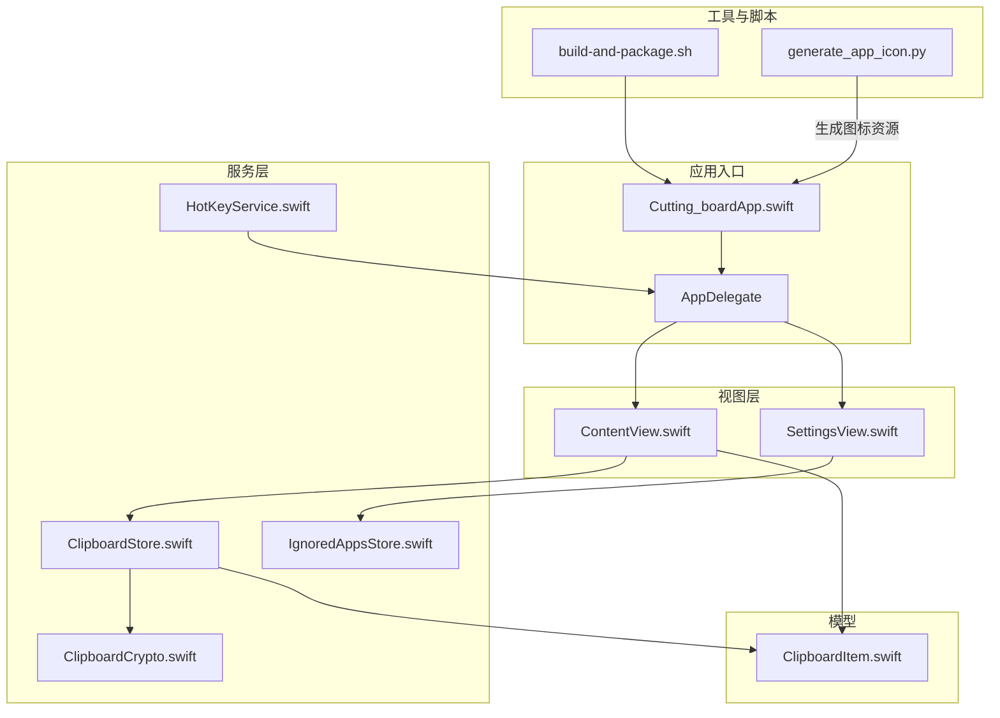
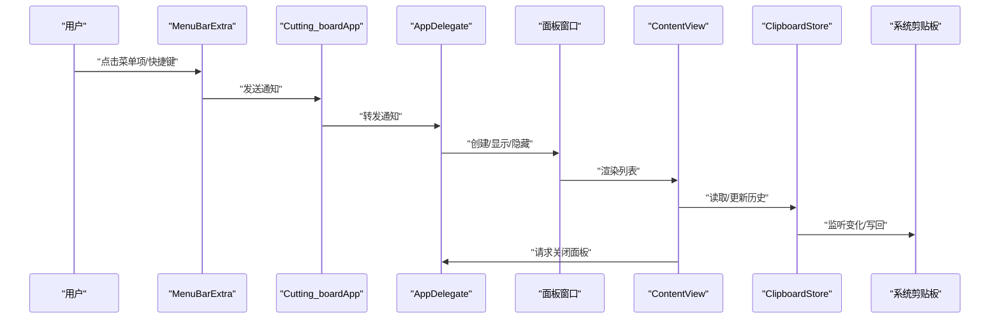
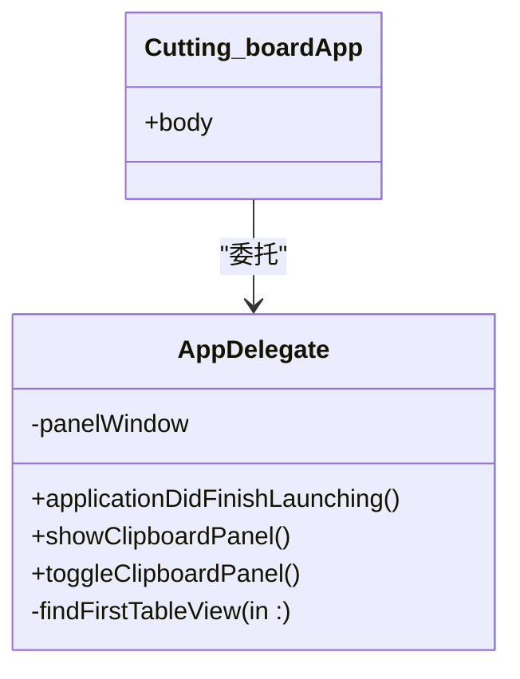
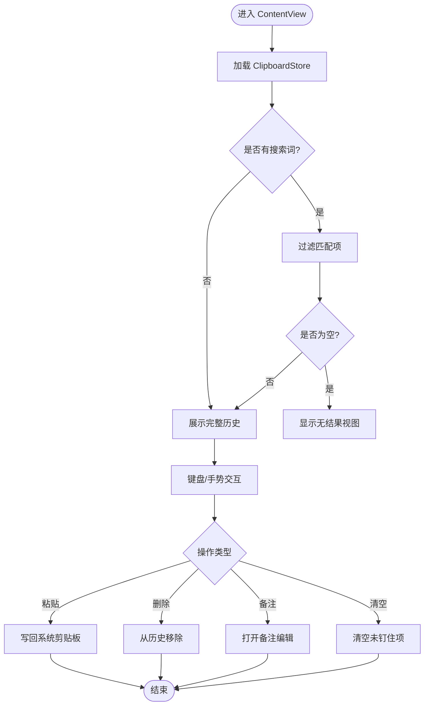
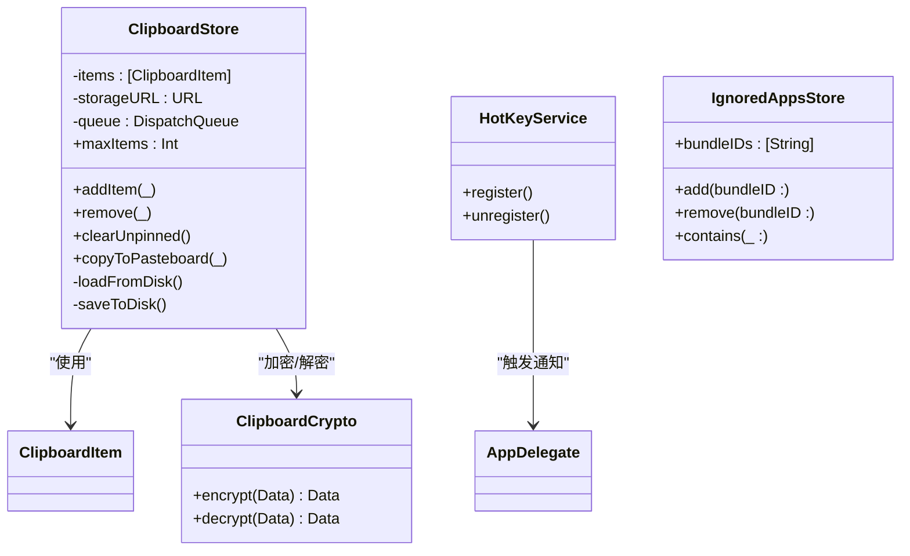
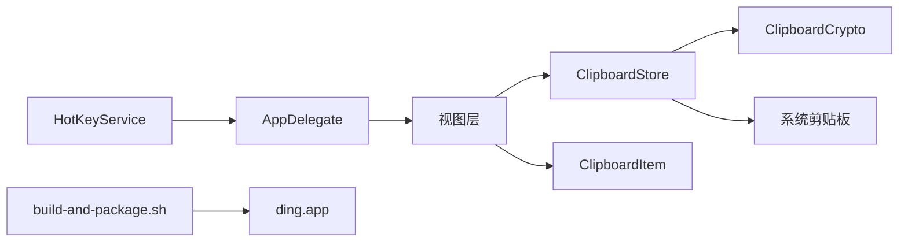
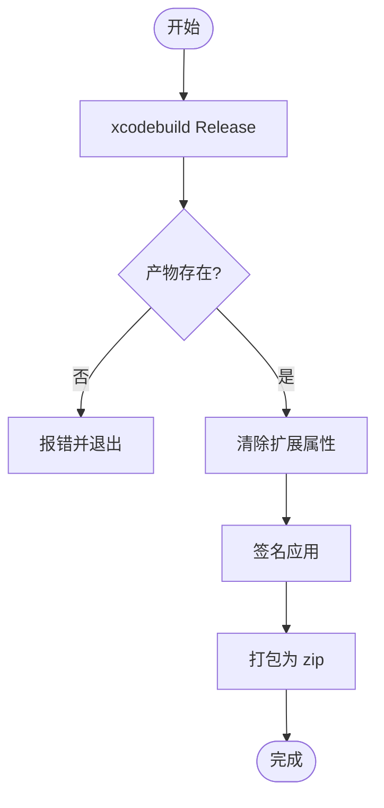

# 开发指南

<cite>
**本文引用的文件**
- [Cutting_boardApp.swift](file://Cutting_board/Cutting_boardApp.swift)
- [ContentView.swift](file://Cutting_board/ContentView.swift)
- [SettingsView.swift](file://Cutting_board/SettingsView.swift)
- [ClipboardItem.swift](file://Cutting_board/Models/ClipboardItem.swift)
- [ClipboardStore.swift](file://Cutting_board/Services/ClipboardStore.swift)
- [HotKeyService.swift](file://Cutting_board/Services/HotKeyService.swift)
- [ClipboardCrypto.swift](file://Cutting_board/Services/ClipboardCrypto.swift)
- [IgnoredAppsStore.swift](file://Cutting_board/Services/IgnoredAppsStore.swift)
- [build-and-package.sh](file://build-and-package.sh)
- [generate_app_icon.py](file://scripts/generate_app_icon.py)
</cite>

## 目录
1. [简介](#简介)
2. [项目结构](#项目结构)
3. [核心组件](#核心组件)
4. [架构总览](#架构总览)
5. [详细组件分析](#详细组件分析)
6. [依赖关系分析](#依赖关系分析)
7. [性能考虑](#性能考虑)
8. [调试与测试](#调试与测试)
9. [构建与打包](#构建与打包)
10. [代码规范与命名约定](#代码规范与命名约定)
11. [贡献与发布流程](#贡献与发布流程)
12. [故障排查](#故障排查)
13. [结语](#结语)

## 简介
本指南面向贡献者与维护者，系统性介绍 Cutting_board 项目的开发环境配置、代码组织、调试测试、构建打包、性能优化、并发与内存管理、代码审查与发布流程。项目采用 SwiftUI + AppKit 实现 macOS 菜单栏常驻应用，具备全局快捷键、剪贴板历史记录、图片预览、备注搜索、自动清理与加密存储等功能。

## 项目结构
项目采用“按职责分层 + 功能模块”的组织方式：
- 应用入口与生命周期：Cutting_boardApp.swift、AppDelegate
- 视图层：ContentView.swift、SettingsView.swift
- 数据模型：Models/ClipboardItem.swift
- 业务服务：Services/ClipboardStore.swift、HotKeyService.swift、ClipboardCrypto.swift、IgnoredAppsStore.swift
- 工具与脚本：build-and-package.sh、scripts/generate_app_icon.py
- 资源：Assets.xcassets（图标、颜色）

图表来源
- [Cutting_boardApp.swift](file://Cutting_board/Cutting_boardApp.swift#L11-L31)
- [ContentView.swift](file://Cutting_board/ContentView.swift#L20-L95)
- [SettingsView.swift](file://Cutting_board/SettingsView.swift#L11-L39)
- [ClipboardItem.swift](file://Cutting_board/Models/ClipboardItem.swift#L16-L45)
- [ClipboardStore.swift](file://Cutting_board/Services/ClipboardStore.swift#L14-L39)
- [HotKeyService.swift](file://Cutting_board/Services/HotKeyService.swift#L30-L69)
- [ClipboardCrypto.swift](file://Cutting_board/Services/ClipboardCrypto.swift#L16-L46)
- [IgnoredAppsStore.swift](file://Cutting_board/Services/IgnoredAppsStore.swift#L16-L39)
- [build-and-package.sh](file://build-and-package.sh#L1-L28)
- [generate_app_icon.py](file://scripts/generate_app_icon.py#L53-L70)

章节来源
- [Cutting_boardApp.swift](file://Cutting_board/Cutting_boardApp.swift#L11-L31)
- [ContentView.swift](file://Cutting_board/ContentView.swift#L20-L95)
- [SettingsView.swift](file://Cutting_board/SettingsView.swift#L11-L39)
- [ClipboardItem.swift](file://Cutting_board/Models/ClipboardItem.swift#L16-L45)
- [ClipboardStore.swift](file://Cutting_board/Services/ClipboardStore.swift#L14-L39)
- [HotKeyService.swift](file://Cutting_board/Services/HotKeyService.swift#L30-L69)
- [ClipboardCrypto.swift](file://Cutting_board/Services/ClipboardCrypto.swift#L16-L46)
- [IgnoredAppsStore.swift](file://Cutting_board/Services/IgnoredAppsStore.swift#L16-L39)
- [build-and-package.sh](file://build-and-package.sh#L1-L28)
- [generate_app_icon.py](file://scripts/generate_app_icon.py#L53-L70)

## 核心组件
- 应用入口与菜单栏：通过 Cutting_boardApp 的 MenuBarExtra 提供“打开/关闭剪贴板”和“退出”，并注册全局快捷键。
- AppDelegate：负责创建独立的面板窗口（非 SwiftUI WindowGroup）、处理快捷键与通知、控制面板显示/隐藏。
- 视图层：ContentView 展示剪贴板历史、支持搜索、键盘导航、双击粘贴、备注编辑、清空未钉住项；SettingsView 管理忽略的应用列表。
- 业务服务：
  - ClipboardStore：监控系统剪贴板变化、去重、排序、持久化、清理、写回系统剪贴板。
  - HotKeyService：基于 Carbon API 注册全局快捷键，无需辅助功能权限。
  - ClipboardCrypto：Keychain + AES-GCM 加密/解密，兼容旧版明文历史。
  - IgnoredAppsStore：维护忽略的应用 Bundle ID 列表，提供应用名与图标查询。
- 数据模型：ClipboardItem 表示一条历史记录，包含类型、内容、时间戳、Base64 图片、钉住状态与备注。

章节来源
- [Cutting_boardApp.swift](file://Cutting_board/Cutting_boardApp.swift#L11-L31)
- [Cutting_boardApp.swift](file://Cutting_board/Cutting_boardApp.swift#L35-L143)
- [ContentView.swift](file://Cutting_board/ContentView.swift#L20-L95)
- [SettingsView.swift](file://Cutting_board/SettingsView.swift#L11-L39)
- [ClipboardStore.swift](file://Cutting_board/Services/ClipboardStore.swift#L14-L222)
- [HotKeyService.swift](file://Cutting_board/Services/HotKeyService.swift#L30-L81)
- [ClipboardCrypto.swift](file://Cutting_board/Services/ClipboardCrypto.swift#L16-L72)
- [IgnoredAppsStore.swift](file://Cutting_board/Services/IgnoredAppsStore.swift#L16-L68)
- [ClipboardItem.swift](file://Cutting_board/Models/ClipboardItem.swift#L16-L89)

## 架构总览
应用采用“视图-服务-模型”分层，事件流如下：

图表来源
- [Cutting_boardApp.swift](file://Cutting_board/Cutting_boardApp.swift#L15-L30)
- [Cutting_boardApp.swift](file://Cutting_board/Cutting_boardApp.swift#L35-L143)
- [ContentView.swift](file://Cutting_board/ContentView.swift#L20-L95)
- [ClipboardStore.swift](file://Cutting_board/Services/ClipboardStore.swift#L47-L90)

## 详细组件分析

### 应用入口与生命周期（Cutting_boardApp + AppDelegate）
- 利用 @main 与 App 协议定义菜单栏入口，提供“打开/关闭剪贴板”和“退出”按钮，并绑定快捷键。
- AppDelegate 负责：
  - 创建独立面板窗口（非 SwiftUI WindowGroup），设置标题、尺寸、背景材质、居中显示。
  - 注册全局快捷键、监听显示/隐藏/切换通知。
  - 控制面板显示/隐藏与键盘焦点转移至列表。
- 关键注意：
  - LSUIElement 场景下 SwiftUI 不会自动创建 WindowGroup 窗口，需手动创建 NSWindow 并注入 HostingView。
  - 通过通知中心解耦菜单、快捷键与窗口控制。

图表来源
- [Cutting_boardApp.swift](file://Cutting_board/Cutting_boardApp.swift#L11-L31)
- [Cutting_boardApp.swift](file://Cutting_board/Cutting_boardApp.swift#L35-L143)

章节来源
- [Cutting_boardApp.swift](file://Cutting_board/Cutting_boardApp.swift#L11-L31)
- [Cutting_boardApp.swift](file://Cutting_board/Cutting_boardApp.swift#L35-L143)

### 视图层（ContentView + SettingsView）
- ContentView：
  - 维护搜索词、选中项、备注编辑弹窗、设置页弹窗。
  - 支持键盘方向键导航、回车粘贴、ESC 关闭、Delete 删除。
  - 列表懒加载、滚动定位、无障碍标签与提示。
- SettingsView：
  - 展示忽略的应用列表，支持添加/移除，使用 AppInfoHelper 获取应用名与图标。
- 性能要点：
  - 使用 LazyVStack 与 .id 切换动画，减少不必要的重绘。
  - 通过 Accessibility API 提升可用性。

图表来源
- [ContentView.swift](file://Cutting_board/ContentView.swift#L20-L95)
- [ContentView.swift](file://Cutting_board/ContentView.swift#L184-L207)
- [ContentView.swift](file://Cutting_board/ContentView.swift#L289-L296)

章节来源
- [ContentView.swift](file://Cutting_board/ContentView.swift#L20-L95)
- [ContentView.swift](file://Cutting_board/ContentView.swift#L184-L207)
- [ContentView.swift](file://Cutting_board/ContentView.swift#L289-L296)
- [SettingsView.swift](file://Cutting_board/SettingsView.swift#L11-L39)
- [SettingsView.swift](file://Cutting_board/SettingsView.swift#L41-L88)

### 业务服务（ClipboardStore + HotKeyService + ClipboardCrypto + IgnoredAppsStore）
- ClipboardStore：
  - 定时轮询系统剪贴板 changeCount，检测变化后抓取内容。
  - 优先识别图片（PNG Base64），再识别文本；去重策略避免重复历史。
  - 钉住项置顶，未钉住项按最大容量裁剪；支持更新备注、清空、写回剪贴板。
  - 异步磁盘读写，JSON 编解码，ISO8601 时间格式。
- HotKeyService：
  - 使用 Carbon API 注册 Command+P 全局快捷键，回调通过通知中心触发。
- ClipboardCrypto：
  - Keychain 中存储 32 字节对称密钥，AES-GCM 加密封装；文件头标识加密格式，兼容旧版明文。
- IgnoredAppsStore：
  - 维护忽略的应用 Bundle ID 列表，提供名称/图标查询与选择器。

图表来源
- [ClipboardStore.swift](file://Cutting_board/Services/ClipboardStore.swift#L14-L222)
- [HotKeyService.swift](file://Cutting_board/Services/HotKeyService.swift#L30-L81)
- [ClipboardCrypto.swift](file://Cutting_board/Services/ClipboardCrypto.swift#L16-L72)
- [IgnoredAppsStore.swift](file://Cutting_board/Services/IgnoredAppsStore.swift#L16-L68)
- [ClipboardItem.swift](file://Cutting_board/Models/ClipboardItem.swift#L16-L45)

章节来源
- [ClipboardStore.swift](file://Cutting_board/Services/ClipboardStore.swift#L14-L222)
- [HotKeyService.swift](file://Cutting_board/Services/HotKeyService.swift#L30-L81)
- [ClipboardCrypto.swift](file://Cutting_board/Services/ClipboardCrypto.swift#L16-L72)
- [IgnoredAppsStore.swift](file://Cutting_board/Services/IgnoredAppsStore.swift#L16-L68)
- [ClipboardItem.swift](file://Cutting_board/Models/ClipboardItem.swift#L16-L45)

### 数据模型（ClipboardItem）
- 字段：UUID、内容、类型（文本/图片）、时间戳、Base64 图片、是否钉住、备注。
- 编解码：遵循 CodingKeys，支持可选字段与默认值。
- 辅助：预览文本截断、相对时间字符串。

章节来源
- [ClipboardItem.swift](file://Cutting_board/Models/ClipboardItem.swift#L16-L89)

## 依赖关系分析
- 视图层依赖服务层与模型，服务层之间存在弱耦合（ClipboardStore 依赖 ClipboardCrypto 进行持久化安全，IgnoredAppsStore 独立管理忽略列表）。
- AppDelegate 作为窗口与快捷键的协调者，通过通知中心与视图层解耦。
- 脚本与构建流程独立于 Swift 源码，但影响最终产物。

图表来源
- [ContentView.swift](file://Cutting_board/ContentView.swift#L20-L95)
- [ClipboardStore.swift](file://Cutting_board/Services/ClipboardStore.swift#L14-L39)
- [ClipboardCrypto.swift](file://Cutting_board/Services/ClipboardCrypto.swift#L16-L46)
- [HotKeyService.swift](file://Cutting_board/Services/HotKeyService.swift#L30-L69)
- [Cutting_boardApp.swift](file://Cutting_board/Cutting_boardApp.swift#L35-L143)
- [build-and-package.sh](file://build-and-package.sh#L1-L28)

章节来源
- [ContentView.swift](file://Cutting_board/ContentView.swift#L20-L95)
- [ClipboardStore.swift](file://Cutting_board/Services/ClipboardStore.swift#L14-L39)
- [ClipboardCrypto.swift](file://Cutting_board/Services/ClipboardCrypto.swift#L16-L46)
- [HotKeyService.swift](file://Cutting_board/Services/HotKeyService.swift#L30-L69)
- [Cutting_boardApp.swift](file://Cutting_board/Cutting_boardApp.swift#L35-L143)
- [build-and-package.sh](file://build-and-package.sh#L1-L28)

## 性能考虑
- 视图渲染
  - 使用 LazyVStack 与 .id 切换动画，避免全量重建。
  - 通过 Accessibility API 减少冗余布局计算。
- 数据访问
  - ClipboardStore 使用异步队列进行磁盘读写，避免主线程阻塞。
  - JSON 编解码使用 ISO8601 时间策略，保证稳定解析。
- 图像处理
  - 图片缩略图在任务中生成并缓存，避免主线程绘制开销。
- 剪贴板监控
  - 0.5 秒轮询间隔平衡实时性与 CPU 占用；去重策略避免重复历史。
- 内存管理
  - 使用弱引用（如定时器、窗口）防止循环引用。
  - 通过 sorted/insert/remove 等操作保持数组有序，避免 O(n) 查找放大。
- 并发最佳实践
  - 所有 UI 更新统一回到主线程（DispatchQueue.main.async）。
  - 磁盘 I/O 使用专用队列，避免阻塞 UI。

章节来源
- [ContentView.swift](file://Cutting_board/ContentView.swift#L184-L207)
- [ContentView.swift](file://Cutting_board/ContentView.swift#L383-L386)
- [ClipboardStore.swift](file://Cutting_board/Services/ClipboardStore.swift#L29-L39)
- [ClipboardStore.swift](file://Cutting_board/Services/ClipboardStore.swift#L183-L221)

## 调试与测试
- 断点调试
  - 在 AppDelegate 的面板创建与显示逻辑处设置断点，验证窗口生命周期。
  - 在 ClipboardStore 的 captureCurrentContent 与 copyToPasteboard 处断点，观察剪贴板读写。
- 日志记录
  - 建议在关键路径（如定时器回调、磁盘读写、加密/解密）增加轻量日志，便于定位问题。
- 单元测试策略
  - ClipboardItem：验证编码/解码、预览文本与时间字符串。
  - ClipboardStore：模拟 NSPasteboard 内容，验证去重、排序、裁剪、清空逻辑。
  - ClipboardCrypto：覆盖加密/解密与 Keychain 存取。
  - IgnoredAppsStore：验证添加/移除/查询。
  - HotKeyService：验证注册/注销与通知派发（可通过测试框架模拟通知中心）。
- 可视化调试
  - 使用 Xcode Canvas 预览视图，快速验证布局与交互。

章节来源
- [Cutting_boardApp.swift](file://Cutting_board/Cutting_boardApp.swift#L78-L98)
- [ClipboardStore.swift](file://Cutting_board/Services/ClipboardStore.swift#L65-L90)
- [ClipboardStore.swift](file://Cutting_board/Services/ClipboardStore.swift#L167-L179)
- [ClipboardItem.swift](file://Cutting_board/Models/ClipboardItem.swift#L62-L71)
- [ClipboardCrypto.swift](file://Cutting_board/Services/ClipboardCrypto.swift#L32-L46)
- [IgnoredAppsStore.swift](file://Cutting_board/Services/IgnoredAppsStore.swift#L27-L39)
- [HotKeyService.swift](file://Cutting_board/Services/HotKeyService.swift#L36-L69)

## 构建与打包
- 构建脚本
  - 自动执行 xcodebuild 生成 Release 产物，随后清除扩展属性、签名并打包为 zip。
  - 注意：Xcode 签名对扩展属性敏感，需先清理再签名。
- 打包产物
  - 输出 ding-mac.zip，包含签名后的 ding.app。
- 图标生成
  - Python 脚本根据设计稿生成多尺寸 PNG，写入 Assets.xcassets/AppIcon.appiconset。

图表来源
- [build-and-package.sh](file://build-and-package.sh#L11-L27)

章节来源
- [build-and-package.sh](file://build-and-package.sh#L1-L28)
- [generate_app_icon.py](file://scripts/generate_app_icon.py#L53-L70)

## 代码规范与命名约定
- 文件分类
  - Models：数据模型与编解码。
  - Services：业务服务与工具。
  - Views：视图与预览。
- 命名规范
  - 类型：UpperCamelCase（如 ClipboardStore、ClipboardItem）。
  - 方法/属性：lowerCamelCase（如 copyToPasteboard、maxItems）。
  - 单例：shared 静态属性。
  - 通知：Notification.Name 扩展中的静态属性。
- 注释与可访问性
  - 使用多行注释说明模块职责与关键算法。
  - 为交互元素提供 accessibilityLabel/accessibilityHint。
- 结构组织
  - 使用 MARK 区分功能模块（如“设计系统”、“单行视图”、“NSImage 缩略图”）。
  - 将视图内部结构拆分为私有方法，提升可读性。

章节来源
- [ClipboardStore.swift](file://Cutting_board/Services/ClipboardStore.swift#L14-L39)
- [HotKeyService.swift](file://Cutting_board/Services/HotKeyService.swift#L12-L16)
- [ContentView.swift](file://Cutting_board/ContentView.swift#L11-L18)
- [ContentView.swift](file://Cutting_board/ContentView.swift#L321-L332)

## 贡献与发布流程
- 代码审查标准
  - 新增/变更功能需附带单元测试。
  - 重要路径（剪贴板读写、加密/解密、磁盘 I/O）需清晰注释与边界条件处理。
  - 避免强耦合，优先使用通知中心或单一职责的服务。
- 发布流程
  - 在本地执行构建脚本，确认产物签名与打包成功。
  - 上传 ding-mac.zip 至发布渠道，附带版本说明与变更摘要。

章节来源
- [build-and-package.sh](file://build-and-package.sh#L1-L28)

## 故障排查
- 面板无法显示/关闭
  - 检查 AppDelegate 的面板创建与显示逻辑，确认窗口未被释放。
  - 确认通知中心订阅与派发正常。
- 快捷键无效
  - 检查 Carbon 注册是否成功，确认 Command+P 未被系统占用。
- 历史不更新
  - 检查 ClipboardStore 的定时器与 changeCount 检测，确认未被忽略的应用列表匹配当前前台应用。
- 图片预览异常
  - 检查 Base64 数据与缩略图生成逻辑。
- 打包失败
  - 确认扩展属性已清理、签名证书有效、zip 打包命令正确。

章节来源
- [Cutting_boardApp.swift](file://Cutting_board/Cutting_boardApp.swift#L78-L98)
- [HotKeyService.swift](file://Cutting_board/Services/HotKeyService.swift#L36-L69)
- [ClipboardStore.swift](file://Cutting_board/Services/ClipboardStore.swift#L47-L60)
- [ClipboardStore.swift](file://Cutting_board/Services/ClipboardStore.swift#L167-L179)
- [build-and-package.sh](file://build-and-package.sh#L19-L27)

## 结语
本指南提供了从开发环境到发布上线的全流程说明。建议在本地先行验证构建与打包脚本，确保快捷键与剪贴板监控正常工作，再进行功能迭代与性能优化。欢迎贡献者遵循规范与审查标准，共同完善项目质量与用户体验。