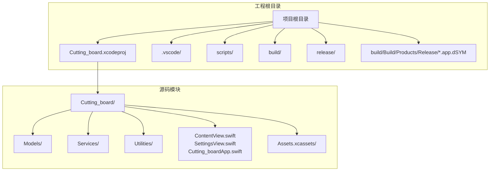
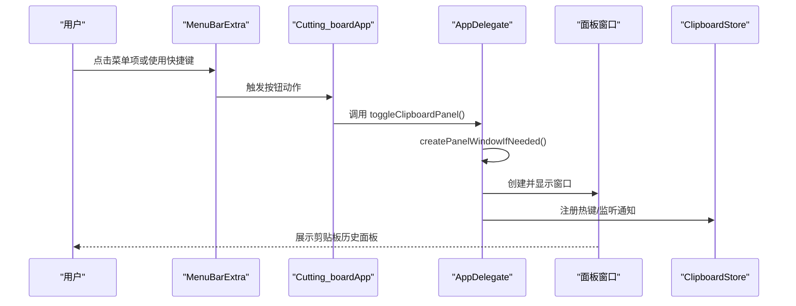
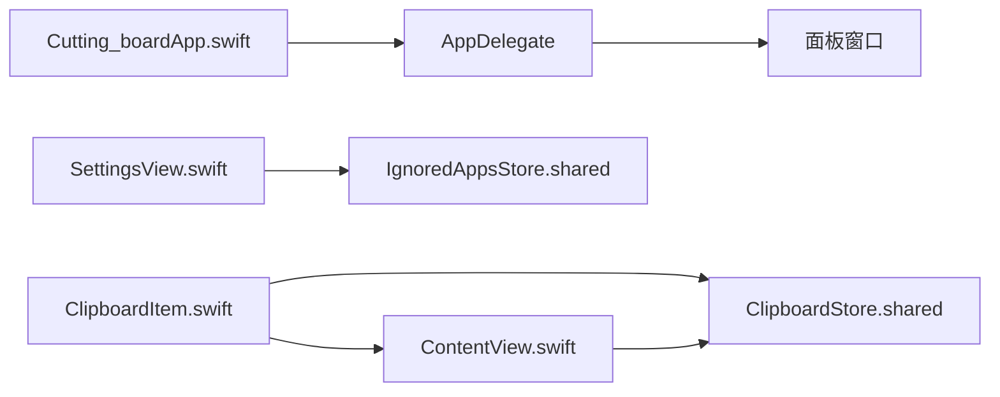

# 开发环境配置

<cite>
**本文引用的文件**
- [Cutting_board.xcodeproj/project.pbxproj](file://Cutting_board.xcodeproj/project.pbxproj)
- [build-and-package.sh](file://build-and-package.sh)
- [scripts/generate_app_icon.py](file://scripts/generate_app_icon.py)
- [.vscode/settings.json](file://.vscode/settings.json)
- [Cutting_board/Cutting_boardApp.swift](file://Cutting_board/Cutting_boardApp.swift)
- [Cutting_board/ContentView.swift](file://Cutting_board/ContentView.swift)
- [Cutting_board/SettingsView.swift](file://Cutting_board/SettingsView.swift)
- [Cutting_board/Models/ClipboardItem.swift](file://Cutting_board/Models/ClipboardItem.swift)
- [Cutting_board/Assets.xcassets/AppIcon.appiconset/Contents.json](file://Cutting_board/Assets.xcassets/AppIcon.appiconset/Contents.json)
- [Cutting_board/Assets.xcassets/AccentColor.colorset/Contents.json](file://Cutting_board/Assets.xcassets/AccentColor.colorset/Contents.json)
- [Cutting_board/Assets.xcassets/Contents.json](file://Cutting_board/Assets.xcassets/Contents.json)
</cite>

## 目录
1. [简介](#简介)
2. [项目结构](#项目结构)
3. [核心组件](#核心组件)
4. [架构总览](#架构总览)
5. [详细组件分析](#详细组件分析)
6. [依赖关系分析](#依赖关系分析)
7. [性能考虑](#性能考虑)
8. [故障排查指南](#故障排查指南)
9. [结论](#结论)
10. [附录](#附录)

## 简介
本指南面向参与 Cutting_board 项目的开发者，提供从 macOS 系统要求、Xcode 项目配置、VS Code 开发环境、SwiftLint 规则与静态分析、到 Git 工作流与常见问题的完整落地配置说明。项目采用 SwiftUI + AppKit 实现菜单栏常驻应用，支持全局快捷键、剪贴板历史展示与管理。

## 项目结构
项目采用“Xcode Workspace + Swift 包管理器工作区”的混合组织方式，核心源码位于 Cutting_board 子目录，Xcode 工程位于 Cutting_board.xcodeproj。资源与图标位于 Assets.xcassets，构建与打包通过 shell 脚本完成。

图表来源
- [Cutting_board.xcodeproj/project.pbxproj](file://Cutting_board.xcodeproj/project.pbxproj#L1-L335)
- [Cutting_board/Cutting_boardApp.swift](file://Cutting_board/Cutting_boardApp.swift#L1-L144)
- [Cutting_board/ContentView.swift](file://Cutting_board/ContentView.swift#L1-L500)
- [Cutting_board/SettingsView.swift](file://Cutting_board/SettingsView.swift#L1-L95)
- [Cutting_board/Models/ClipboardItem.swift](file://Cutting_board/Models/ClipboardItem.swift#L1-L90)
- [Cutting_board/Assets.xcassets/AppIcon.appiconset/Contents.json](file://Cutting_board/Assets.xcassets/AppIcon.appiconset/Contents.json#L1-L68)

章节来源
- [Cutting_board.xcodeproj/project.pbxproj](file://Cutting_board.xcodeproj/project.pbxproj#L1-L335)

## 核心组件
- 应用入口与生命周期：通过 Cutting_boardApp.swift 定义菜单栏入口与快捷键绑定；AppDelegate 负责创建面板窗口、注册全局快捷键、处理通知与应用终止。
- 视图层：ContentView.swift 提供剪贴板历史列表、搜索、备注编辑、清空未钉住项等功能；SettingsView.swift 提供忽略应用列表管理。
- 数据模型：ClipboardItem.swift 定义剪贴板条目的结构、编码解码与预览文本、相对时间等。
- 资源与图标：Assets.xcassets 提供 AppIcon 与 AccentColor，脚本 generate_app_icon.py 可自动生成多尺寸 PNG 并写入 Assets。

章节来源
- [Cutting_board/Cutting_boardApp.swift](file://Cutting_board/Cutting_boardApp.swift#L1-L144)
- [Cutting_board/ContentView.swift](file://Cutting_board/ContentView.swift#L1-L500)
- [Cutting_board/SettingsView.swift](file://Cutting_board/SettingsView.swift#L1-L95)
- [Cutting_board/Models/ClipboardItem.swift](file://Cutting_board/Models/ClipboardItem.swift#L1-L90)
- [Cutting_board/Assets.xcassets/AppIcon.appiconset/Contents.json](file://Cutting_board/Assets.xcassets/AppIcon.appiconset/Contents.json#L1-L68)
- [Cutting_board/Assets.xcassets/AccentColor.colorset/Contents.json](file://Cutting_board/Assets.xcassets/AccentColor.colorset/Contents.json#L1-L11)
- [Cutting_board/Assets.xcassets/Contents.json](file://Cutting_board/Assets.xcassets/Contents.json#L1-L6)

## 架构总览
下图展示了应用启动、快捷键触发、通知分发与窗口呈现的整体流程。

图表来源
- [Cutting_board/Cutting_boardApp.swift](file://Cutting_board/Cutting_boardApp.swift#L15-L31)
- [Cutting_board/Cutting_boardApp.swift](file://Cutting_board/Cutting_boardApp.swift#L35-L143)

## 详细组件分析

### Xcode 项目设置与构建配置
- 工程与目标
  - 工程对象包含一个原生目标 Cutting_board，产品类型为应用程序，使用 macOS 平台。
  - 目标包含 Sources、Frameworks、Resources 三类构建阶段，未见自定义脚本或外部依赖集成。
- 构建设置
  - Debug/Release 两套 XCBuildConfiguration，分别对应 Debug 与 Release。
  - Debug 配置启用严格静态分析、DWARF 调试信息、Swift 优化级别 -Onone、仅活动架构等。
  - Release 配置启用优化模块编译模式、strip 调试符号、禁用断言等。
  - SDK 与部署目标：SDKROOT 为 macosx，MACOSX_DEPLOYMENT_TARGET 为 26.1（对应 macOS 15）。
  - Swift 版本：SWIFT_VERSION 为 5.0。
- 产品与签名
  - 产品名称与 Bundle Identifier、版本号、沙箱开关、预览开关等在 Debug/Release 配置中统一设置。
  - 使用 Automatic Code Sign Style，构建产物路径与打包脚本配合使用。
- Scheme 与构建产物
  - 脚本 build-and-package.sh 指定 scheme 为 Cutting_board，配置为 Release，构建后清理扩展属性、重签名并打包为 zip。

章节来源
- [Cutting_board.xcodeproj/project.pbxproj](file://Cutting_board.xcodeproj/project.pbxproj#L50-L104)
- [Cutting_board.xcodeproj/project.pbxproj](file://Cutting_board.xcodeproj/project.pbxproj#L127-L245)
- [Cutting_board.xcodeproj/project.pbxproj](file://Cutting_board.xcodeproj/project.pbxproj#L246-L330)
- [build-and-package.sh](file://build-and-package.sh#L1-L28)

### VS Code 开发环境配置
- 工作区设置
  - 当前仓库提供 .vscode/settings.json，其中包含 kiroAgent.configureMCP 的禁用配置，确保在该工作区内不加载相关 MCP 插件。
- 推荐插件与实践
  - Swift 开发建议安装官方 Swift 插件以获得语法高亮、格式化与诊断能力。
  - 若使用 AI 辅助工具，可按需启用相应插件，但需注意与仓库内 settings.json 的冲突项。
  - 建议开启“格式化时自动保存”，并配置 Swift 文件的缩进与换行规则，保持团队一致性。
- 调试配置
  - 由于项目为菜单栏应用，VS Code 无法直接调试 AppKit/SwiftUI 进程。建议通过 Xcode 进行断点调试与日志输出。
  - 如需在 VS Code 中执行构建/打包脚本，可在任务中调用 build-and-package.sh。

章节来源
- [.vscode/settings.json](file://.vscode/settings.json#L1-L3)

### SwiftLint 配置与静态分析
- SwiftLint 配置建议
  - 规则集：启用强制性规则（如严格空值检查、未使用变量/函数警告、文档注释要求等），结合团队风格偏好定制。
  - 自动格式化：在 CI 或本地 pre-commit 中集成 SwiftFormat/SwiftLint，确保提交前统一格式。
  - 静态分析：结合 Xcode 构建设置中的 Clang Analyzer 选项，持续扫描潜在问题。
- 与现有构建设置的协同
  - 项目已启用多项 Clang 警告与严格检查，建议在 SwiftLint 中补充 Swift 层面的风格约束，形成“编译期 + Lint”的双重保障。

[本节为通用实践建议，无需特定文件引用]

### Git 工作流程
- 分支策略
  - 主分支：main（受保护），仅允许通过评审合并。
  - 功能分支：feature/*，修复分支：fix/*，发布分支：release/*。
- 提交规范
  - 类型：feat、fix、docs、style、refactor、perf、test、chore、revert。
  - 格式：type(scope): subject，正文简述变更动机与影响，引用 Issue。
- 代码评审
  - PR 必须包含测试更新、变更说明与风险评估；至少一名维护者批准后方可合并。
- 发布与打包
  - 使用 build-and-package.sh 生成 dSYM 与 zip 包，上传至发布页面或内部制品库。

[本节为通用流程建议，无需特定文件引用]

## 依赖关系分析
- 组件耦合
  - Cutting_boardApp 通过 @NSApplicationDelegateAdaptor 与 AppDelegate 协作，AppDelegate 负责窗口与快捷键。
  - ContentView 依赖 ClipboardStore 获取数据，SettingsView 依赖 IgnoredAppsStore 管理忽略应用。
  - ClipboardItem 作为数据模型，被存储与视图层广泛使用。
- 外部依赖
  - 项目未显式声明 Swift Package 依赖；构建设置中未见第三方框架链接。
- 潜在循环依赖
  - 当前结构清晰，未发现循环导入或目标间循环依赖。

图表来源
- [Cutting_board/Cutting_boardApp.swift](file://Cutting_board/Cutting_boardApp.swift#L11-L31)
- [Cutting_board/Cutting_boardApp.swift](file://Cutting_board/Cutting_boardApp.swift#L35-L143)
- [Cutting_board/ContentView.swift](file://Cutting_board/ContentView.swift#L20-L35)
- [Cutting_board/SettingsView.swift](file://Cutting_board/SettingsView.swift#L11-L13)
- [Cutting_board/Models/ClipboardItem.swift](file://Cutting_board/Models/ClipboardItem.swift#L16-L45)

## 性能考虑
- 视图渲染
  - ContentView 使用 LazyVStack 渲染长列表，减少一次性布局开销。
  - 列表项实现 Equatable 与 .equatable()，避免不必要的重绘。
- 动画与交互
  - 通过 accessibilityReduceMotion 控制动画，兼顾无障碍与性能。
  - 键盘导航与滚动锚定使用 Transaction 与 ScrollViewReader，保证平滑体验。
- 资源与图标
  - 图片缩略图按需生成并缓存，避免重复解码与绘制。
- 构建与打包
  - Release 构建启用优化模块编译与 strip 调试信息，减小体积并提升运行效率。

章节来源
- [Cutting_board/ContentView.swift](file://Cutting_board/ContentView.swift#L184-L207)
- [Cutting_board/ContentView.swift](file://Cutting_board/ContentView.swift#L321-L332)
- [Cutting_board/ContentView.swift](file://Cutting_board/ContentView.swift#L383-L386)
- [Cutting_board/ContentView.swift](file://Cutting_board/ContentView.swift#L475-L494)

## 故障排查指南
- 构建失败或找不到产物
  - 确认使用正确的 scheme 与配置（Release），并检查 build-and-package.sh 中的路径与权限。
  - 若 dSYM 不存在，确认 Release 构建已生成并包含调试信息。
- 扩展属性导致签名失败
  - 打包前需清理扩展属性并重新签名，脚本已内置此流程。
- 图标未更新
  - 使用 generate_app_icon.py 生成多尺寸 PNG 并放入 AppIcon.appiconset，确保 Contents.json 包含所有尺寸。
- VS Code 插件冲突
  - 检查 .vscode/settings.json 中的配置项，必要时临时禁用冲突插件或调整工作区设置。

章节来源
- [build-and-package.sh](file://build-and-package.sh#L11-L27)
- [scripts/generate_app_icon.py](file://scripts/generate_app_icon.py#L53-L66)
- [.vscode/settings.json](file://.vscode/settings.json#L1-L3)

## 结论
本指南提供了 Cutting_board 项目从系统要求、Xcode 工程配置、VS Code 开发环境、SwiftLint 规范到 Git 工作流与打包发布的完整落地指引。建议团队在 CI 中集成 SwiftLint 与构建脚本，确保代码质量与交付一致性。

## 附录

### 系统要求与版本兼容性
- macOS：部署目标 26.1（对应 macOS 15），建议在相同或更高版本上进行开发与测试。
- Xcode：基于 project.pbxproj 的 TargetAttributes.CreatedOnToolsVersion 为 26.2，建议使用 Xcode 16+。
- Swift：SWIFT_VERSION 为 5.0，建议使用 Swift 5.9+ 以获得更佳的编译与诊断体验。

章节来源
- [Cutting_board.xcodeproj/project.pbxproj](file://Cutting_board.xcodeproj/project.pbxproj#L82-L86)
- [Cutting_board.xcodeproj/project.pbxproj](file://Cutting_board.xcodeproj/project.pbxproj#L181-L181)
- [Cutting_board.xcodeproj/project.pbxproj](file://Cutting_board.xcodeproj/project.pbxproj#L264-L264)
- [Cutting_board.xcodeproj/project.pbxproj](file://Cutting_board.xcodeproj/project.pbxproj#L274-L274)