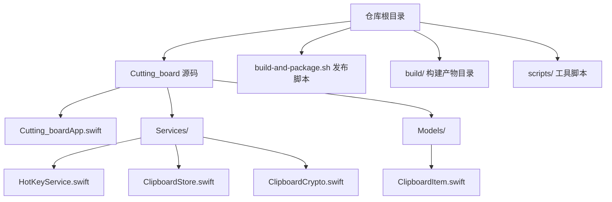
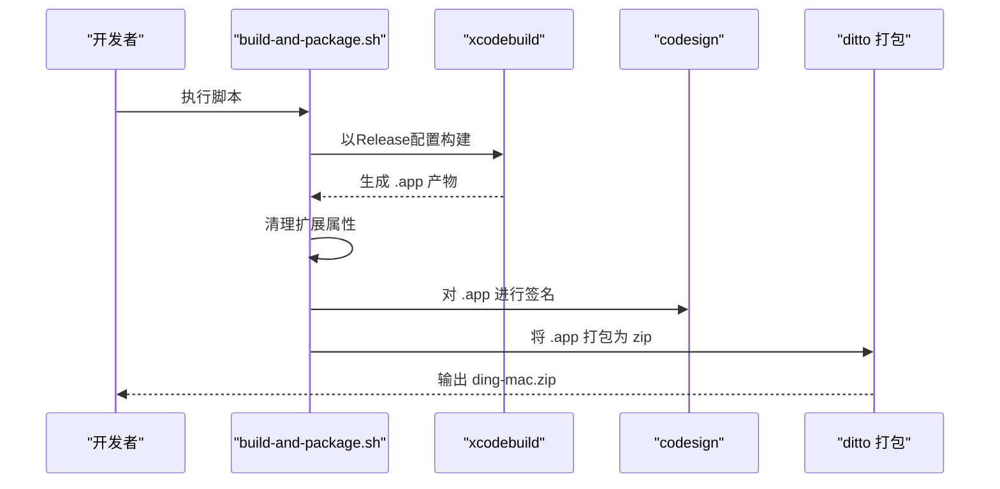
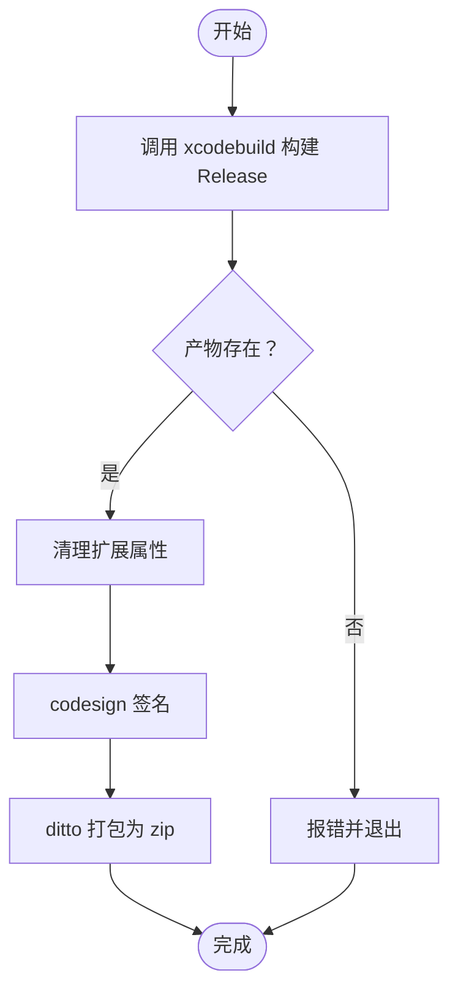
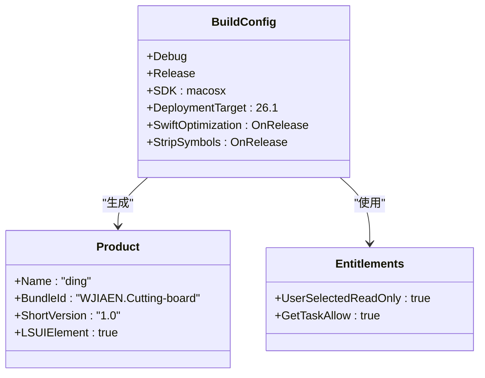
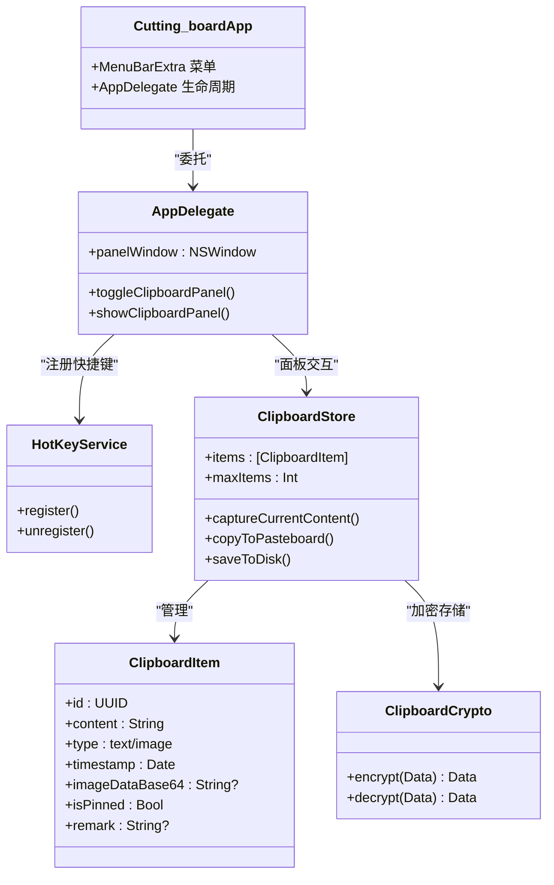
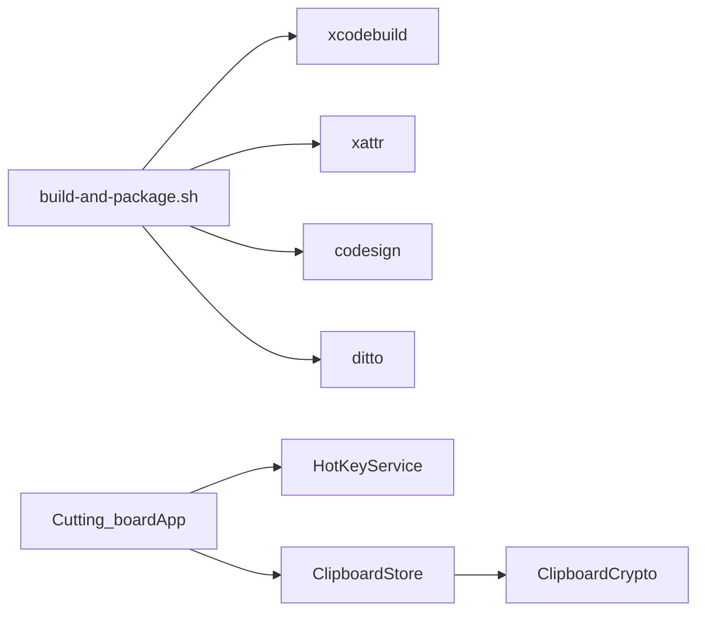

# 构建与发布

<cite>
**本文引用的文件**
- [build-and-package.sh](file://build-and-package.sh)
- [project.pbxproj](file://Cutting_board.xcodeproj/project.pbxproj)
- [xcschememanagement.plist](file://Cutting_board.xcodeproj/xcuserdata/wjiaen.xcuserdatad/xcschemes/xcschememanagement.plist)
- [Info.plist（Release）](file://build/Build/Products/Release/ding.app/Contents/Info.plist)
- [Info.plist（Debug）](file://build/Build/Products/Debug/ding.app/Contents/Info.plist)
- [Entitlements.plist（Release）](file://build/Build/Intermediates.noindex/Cutting_board.build/Release/Cutting_board.build/DerivedSources/Entitlements.plist)
- [Entitlements.plist（Debug）](file://build/Build/Intermediates.noindex/Cutting_board.build/Debug/Cutting_board.build/DerivedSources/Entitlements.plist)
- [generate_app_icon.py](file://scripts/generate_app_icon.py)
- [Cutting_boardApp.swift](file://Cutting_board/Cutting_boardApp.swift)
- [HotKeyService.swift](file://Cutting_board/Services/HotKeyService.swift)
- [ClipboardStore.swift](file://Cutting_board/Services/ClipboardStore.swift)
- [ClipboardCrypto.swift](file://Cutting_board/Services/ClipboardCrypto.swift)
- [ClipboardItem.swift](file://Cutting_board/Models/ClipboardItem.swift)
</cite>

## 目录
1. [简介](#简介)
2. [项目结构](#项目结构)
3. [核心组件](#核心组件)
4. [架构总览](#架构总览)
5. [详细组件分析](#详细组件分析)
6. [依赖关系分析](#依赖关系分析)
7. [性能考虑](#性能考虑)
8. [故障排查指南](#故障排查指南)
9. [结论](#结论)
10. [附录](#附录)

## 简介
本指南面向Cutting_board项目的构建与发布流程，覆盖以下主题：
- Xcode构建配置与编译选项
- 自动化构建脚本build-and-package.sh的工作原理、参数与执行流程
- 应用签名与打包（含扩展属性清理、签名、zip打包）
- 发布准备（版本管理、变更日志、发布检查清单）
- CI/CD集成与自动化部署建议

## 项目结构
该项目为一个基于SwiftUI与AppKit的菜单栏工具应用，采用Xcode工程组织，核心源码位于Cutting_board目录，构建产物默认输出至build目录，发布脚本位于仓库根目录。

图表来源
- [project.pbxproj](file://Cutting_board.xcodeproj/project.pbxproj#L1-L335)
- [Cutting_boardApp.swift](file://Cutting_board/Cutting_boardApp.swift#L1-L144)
- [HotKeyService.swift](file://Cutting_board/Services/HotKeyService.swift#L1-L82)
- [ClipboardStore.swift](file://Cutting_board/Services/ClipboardStore.swift#L1-L223)
- [ClipboardCrypto.swift](file://Cutting_board/Services/ClipboardCrypto.swift#L1-L73)
- [ClipboardItem.swift](file://Cutting_board/Models/ClipboardItem.swift#L1-L90)

章节来源
- [project.pbxproj](file://Cutting_board.xcodeproj/project.pbxproj#L1-L335)
- [xcschememanagement.plist](file://Cutting_board.xcodeproj/xcuserdata/wjiaen.xcuserdatad/xcschemes/xcschememanagement.plist#L1-L15)

## 核心组件
- 构建与发布脚本：负责调用xcodebuild构建Release、清理扩展属性、签名、打包zip。
- Xcode工程配置：定义Debug/Release构建设置、产品名称、Bundle标识符、沙箱与权限等。
- 运行时组件：应用入口、全局快捷键、剪贴板监控与持久化、历史项模型与加密。

章节来源
- [build-and-package.sh](file://build-and-package.sh#L1-L28)
- [project.pbxproj](file://Cutting_board.xcodeproj/project.pbxproj#L127-L330)
- [Cutting_boardApp.swift](file://Cutting_board/Cutting_boardApp.swift#L1-L144)
- [HotKeyService.swift](file://Cutting_board/Services/HotKeyService.swift#L1-L82)
- [ClipboardStore.swift](file://Cutting_board/Services/ClipboardStore.swift#L1-L223)
- [ClipboardCrypto.swift](file://Cutting_board/Services/ClipboardCrypto.swift#L1-L73)
- [ClipboardItem.swift](file://Cutting_board/Models/ClipboardItem.swift#L1-L90)

## 架构总览
下图展示从命令行到最终zip产物的端到端流程，以及关键配置与产物位置。

图表来源
- [build-and-package.sh](file://build-and-package.sh#L11-L27)
- [Info.plist（Release）](file://build/Build/Products/Release/ding.app/Contents/Info.plist#L1-L53)

## 详细组件分析

### 构建与发布脚本：build-and-package.sh
- 功能概述
  - 以Release配置构建目标应用
  - 校验产物存在性
  - 清理扩展属性，避免签名失败
  - 使用临时签名对应用进行签名
  - 将应用打包为zip
- 关键步骤与说明
  - 构建：通过xcodebuild指定方案与配置，并指定DerivedData路径
  - 校验：检查Release产物是否存在
  - 清理扩展属性：使用xattr清理扩展属性
  - 签名：使用codesign对应用签名
  - 打包：使用ditto将应用目录压缩为zip
- 参数与产物
  - 产物目录与命名：脚本内固定产物路径与zip文件名
  - 版本信息：zip大小作为发布产物体积提示

图表来源
- [build-and-package.sh](file://build-and-package.sh#L11-L27)

章节来源
- [build-and-package.sh](file://build-and-package.sh#L1-L28)

### Xcode构建配置与编译选项
- 方案与目标
  - 方案名称：Cutting_board
  - 目标类型：应用程序
  - 产品名称：ding（与Info.plist中的CFBundleName一致）
- 构建设置要点
  - Debug/Release均启用模块化编译、Swift严格模式、安全警告等
  - Release开启WholeModule优化，关闭调试符号，便于发布
  - SDK与最低系统版本：macOS 26.1及以上
- 产品与标识
  - Bundle标识符：WJIAEN.Cutting-board
  - Info.plist中MarketingVersion与CFBundleShortVersionString为1.0
  - CFBundleExecutable与CFBundleName均为ding
- 权限与沙箱
  - 未启用沙箱（ENABLE_APP_SANDBOX=NO）
  - 允许用户选择文件只读访问与任务查询能力（Entitlements）

图表来源
- [project.pbxproj](file://Cutting_board.xcodeproj/project.pbxproj#L127-L330)
- [Entitlements.plist（Release）](file://build/Build/Intermediates.noindex/Cutting_board.build/Release/Cutting_board.build/DerivedSources/Entitlements.plist#L1-L11)
- [Info.plist（Release）](file://build/Build/Products/Release/ding.app/Contents/Info.plist#L1-L53)

章节来源
- [project.pbxproj](file://Cutting_board.xcodeproj/project.pbxproj#L127-L330)
- [Entitlements.plist（Release）](file://build/Build/Intermediates.noindex/Cutting_board.build/Release/Cutting_board.build/DerivedSources/Entitlements.plist#L1-L11)
- [Entitlements.plist（Debug）](file://build/Build/Intermediates.noindex/Cutting_board.build/Debug/Cutting_board.build/DerivedSources/Entitlements.plist#L1-L11)
- [Info.plist（Release）](file://build/Build/Products/Release/ding.app/Contents/Info.plist#L1-L53)
- [Info.plist（Debug）](file://build/Build/Products/Debug/ding.app/Contents/Info.plist#L1-L53)

### 应用签名与打包
- 签名流程
  - 清理扩展属性：避免扩展属性导致签名失败
  - 临时签名：使用codesign对应用进行签名
- 打包流程
  - 使用ditto将应用目录压缩为zip，保留资源但不保留硬链接元数据
- 产物
  - 输出文件：ding-mac.zip
  - 文件大小：脚本打印zip大小作为体积提示

章节来源
- [build-and-package.sh](file://build-and-package.sh#L19-L27)

### 运行时组件与权限
- 应用入口与菜单栏
  - 应用主类通过MenuBarExtra提供菜单入口
  - LSUIElement为true，符合菜单栏工具特性
- 全局快捷键
  - 使用Carbon注册Command+P全局快捷键，无需辅助功能权限
- 剪贴板监控与持久化
  - 定时轮询系统剪贴板变化，支持文本与图片
  - 历史项持久化至应用支持目录，采用AES-GCM加密
- 数据模型
  - ClipboardItem包含类型、时间戳、Base64图片数据、钉住状态与备注

图表来源
- [Cutting_boardApp.swift](file://Cutting_board/Cutting_boardApp.swift#L1-L144)
- [HotKeyService.swift](file://Cutting_board/Services/HotKeyService.swift#L1-L82)
- [ClipboardStore.swift](file://Cutting_board/Services/ClipboardStore.swift#L1-L223)
- [ClipboardCrypto.swift](file://Cutting_board/Services/ClipboardCrypto.swift#L1-L73)
- [ClipboardItem.swift](file://Cutting_board/Models/ClipboardItem.swift#L1-L90)

章节来源
- [Cutting_boardApp.swift](file://Cutting_board/Cutting_boardApp.swift#L1-L144)
- [HotKeyService.swift](file://Cutting_board/Services/HotKeyService.swift#L1-L82)
- [ClipboardStore.swift](file://Cutting_board/Services/ClipboardStore.swift#L1-L223)
- [ClipboardCrypto.swift](file://Cutting_board/Services/ClipboardCrypto.swift#L1-L73)
- [ClipboardItem.swift](file://Cutting_board/Models/ClipboardItem.swift#L1-L90)

## 依赖关系分析
- 构建脚本依赖
  - xcodebuild：生成Release产物
  - xattr：清理扩展属性
  - codesign：应用签名
  - ditto：打包zip
- 运行时依赖
  - Carbon：全局快捷键
  - CryptoKit：历史数据加密
  - AppKit/SwiftUI：界面与生命周期

图表来源
- [build-and-package.sh](file://build-and-package.sh#L11-L27)
- [HotKeyService.swift](file://Cutting_board/Services/HotKeyService.swift#L1-L82)
- [ClipboardStore.swift](file://Cutting_board/Services/ClipboardStore.swift#L1-L223)
- [ClipboardCrypto.swift](file://Cutting_board/Services/ClipboardCrypto.swift#L1-L73)

章节来源
- [build-and-package.sh](file://build-and-package.sh#L1-L28)
- [HotKeyService.swift](file://Cutting_board/Services/HotKeyService.swift#L1-L82)
- [ClipboardStore.swift](file://Cutting_board/Services/ClipboardStore.swift#L1-L223)
- [ClipboardCrypto.swift](file://Cutting_board/Services/ClipboardCrypto.swift#L1-L73)

## 性能考虑
- 编译优化
  - Release使用WholeModule优化，提升运行时性能
  - 关闭调试符号与strip策略，减小产物体积
- 运行时优化
  - 剪贴板监控周期0.5秒，平衡实时性与CPU占用
  - 历史最大条目可配置，避免内存与磁盘膨胀
- 打包与分发
  - 使用ditto进行高效压缩，避免冗余资源

## 故障排查指南
- 构建失败或产物缺失
  - 确认脚本工作目录正确，产物路径与名称与脚本一致
  - 检查Xcode工程方案名称与目标是否匹配
- 签名失败
  - 确保扩展属性已清理（xattr -cr）
  - 使用临时签名验证签名流程
- 权限问题
  - 如需沙箱，请在Xcode中启用沙箱并补充对应Entitlements
  - 确认用户选择文件权限与任务查询权限满足需求
- 快捷键无效
  - 确认Carbon事件处理器注册成功
  - 检查系统权限与快捷键组合冲突

章节来源
- [build-and-package.sh](file://build-and-package.sh#L14-L17)
- [Entitlements.plist（Release）](file://build/Build/Intermediates.noindex/Cutting_board.build/Release/Cutting_board.build/DerivedSources/Entitlements.plist#L1-L11)
- [HotKeyService.swift](file://Cutting_board/Services/HotKeyService.swift#L36-L69)

## 结论
本指南提供了Cutting_board项目的完整构建与发布流程，涵盖Xcode配置、自动化脚本、签名与打包、运行时组件与权限、以及发布准备与CI/CD建议。遵循本文档可帮助团队建立稳定高效的发布流程。

## 附录

### 发布准备清单
- 版本管理
  - 更新CFBundleShortVersionString与CURRENT_PROJECT_VERSION
  - 确认Info.plist与工程设置一致
- 变更日志
  - 记录新增功能、修复与破坏性变更
- 权限与签名
  - 确认Entitlements与签名策略
  - 测试应用在目标系统版本上的运行
- 打包与校验
  - 使用脚本生成zip并核对大小
  - 校验扩展属性清理与签名有效性

### CI/CD集成与自动化部署建议
- 触发条件
  - 推送标签或合并到主分支触发流水线
- 步骤建议
  - 依赖安装（如需要额外Python依赖）
  - 调用构建脚本生成Release产物
  - 上传制品（zip与dSYM）
  - 可选：自动发布到分发平台或内部渠道
- 安全与缓存
  - 保护签名证书与私钥
  - 缓存Xcode DerivedData以加速构建