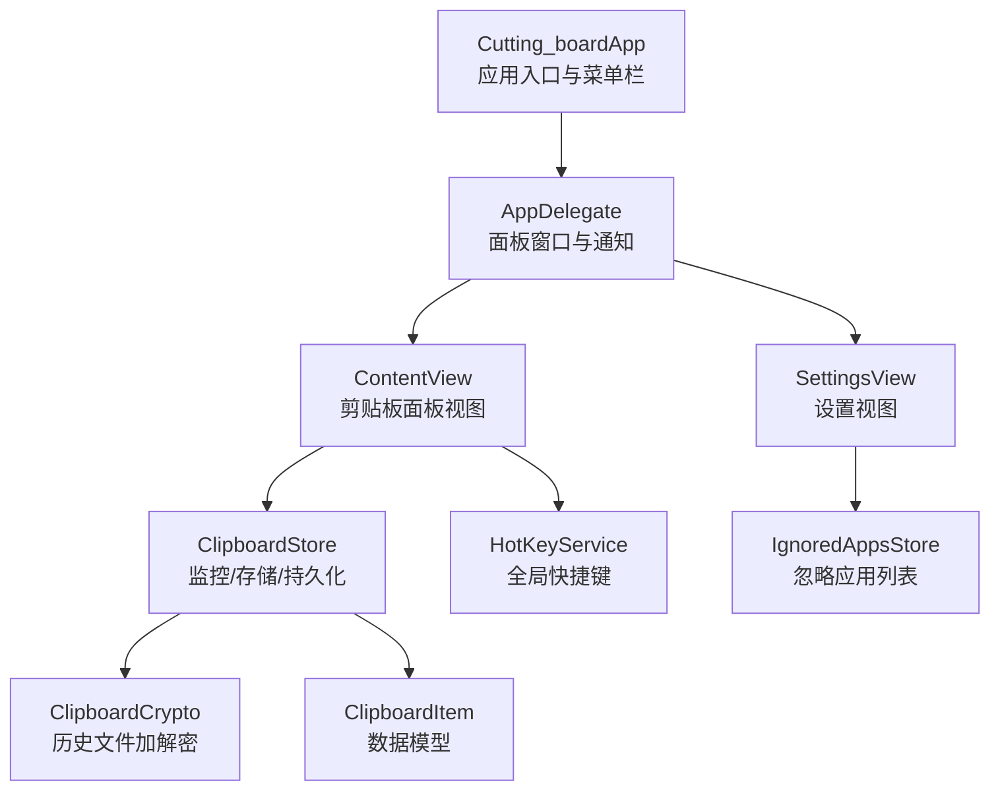
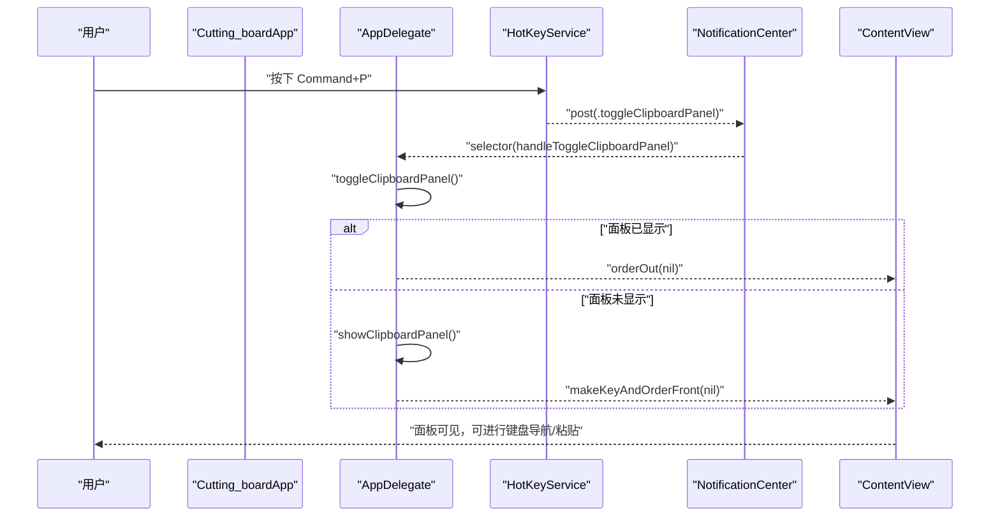
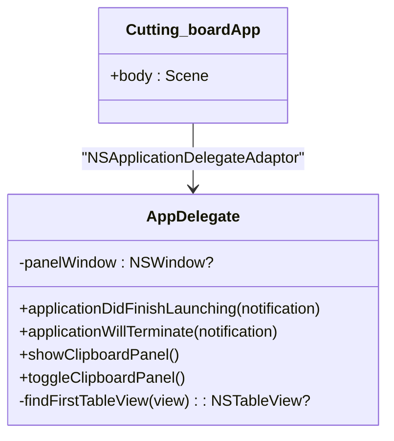
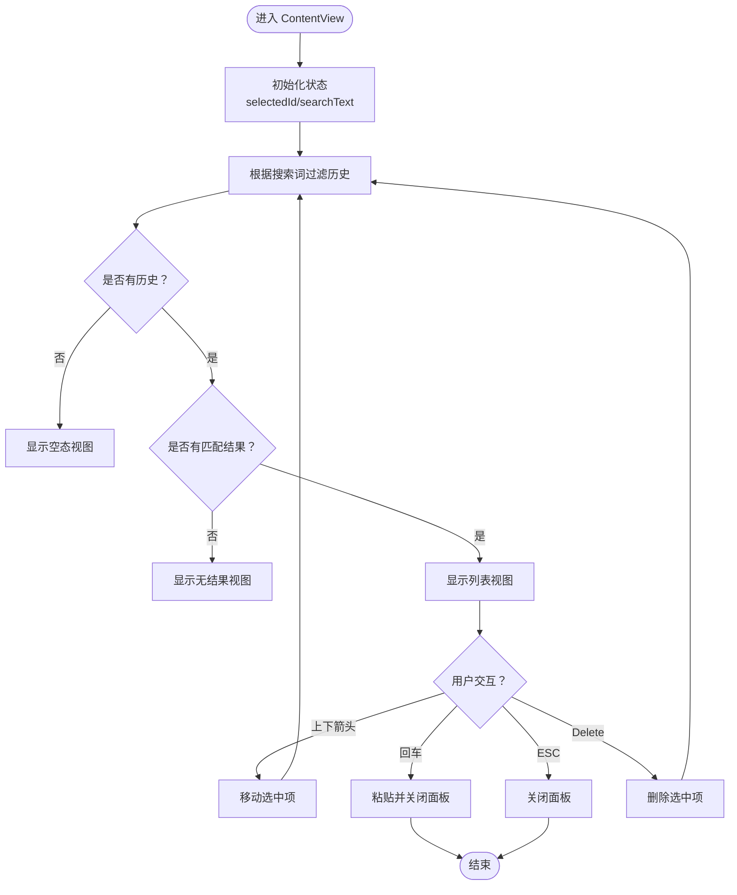
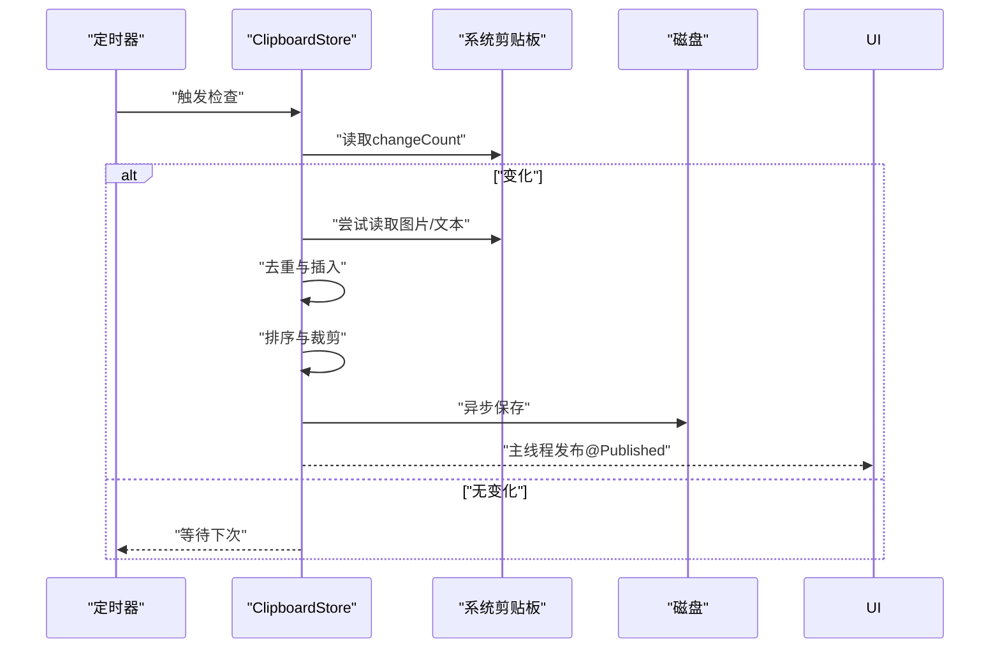
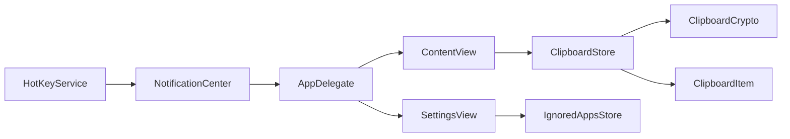

# 调试与测试

<cite>
**本文引用的文件**
- [Cutting_boardApp.swift](file://Cutting_board/Cutting_boardApp.swift)
- [ContentView.swift](file://Cutting_board/ContentView.swift)
- [SettingsView.swift](file://Cutting_board/SettingsView.swift)
- [ClipboardItem.swift](file://Cutting_board/Models/ClipboardItem.swift)
- [ClipboardStore.swift](file://Cutting_board/Services/ClipboardStore.swift)
- [HotKeyService.swift](file://Cutting_board/Services/HotKeyService.swift)
- [IgnoredAppsStore.swift](file://Cutting_board/Services/IgnoredAppsStore.swift)
- [ClipboardCrypto.swift](file://Cutting_board/Services/ClipboardCrypto.swift)
</cite>

## 目录
1. [简介](#简介)
2. [项目结构](#项目结构)
3. [核心组件](#核心组件)
4. [架构总览](#架构总览)
5. [详细组件分析](#详细组件分析)
6. [依赖关系分析](#依赖关系分析)
7. [性能考虑](#性能考虑)
8. [故障排查指南](#故障排查指南)
9. [结论](#结论)
10. [附录](#附录)

## 简介
本指南面向Cutting_board项目的开发者，提供系统化的调试与测试方法，覆盖断点与变量监视、控制台输出与日志策略、SwiftUI调试技巧（预览调试、状态跟踪、视图层次分析）、单元测试设计与Mock、异步测试处理、性能分析工具（Instruments、内存泄漏检测、CPU分析）以及常见问题排查与最佳实践。文档结合项目实际代码结构，给出可操作的步骤与可视化图示，帮助快速定位与解决问题。

## 项目结构
Cutting_board采用“应用入口 + 视图层 + 业务服务 + 数据模型”的分层组织方式：
- 应用入口与生命周期：通过应用主类与委托管理菜单栏入口、全局快捷键注册、面板窗口创建与显示控制。
- 视图层：包含剪贴板面板视图与设置视图，负责用户交互、状态展示与键盘导航。
- 业务服务：剪贴板监控与持久化、全局快捷键、忽略应用列表、历史数据加解密。
- 数据模型：剪贴板条目结构及序列化。

图表来源
- [Cutting_boardApp.swift](file://Cutting_board/Cutting_boardApp.swift#L11-L31)
- [ContentView.swift](file://Cutting_board/ContentView.swift#L20-L95)
- [SettingsView.swift](file://Cutting_board/SettingsView.swift#L11-L39)
- [ClipboardStore.swift](file://Cutting_board/Services/ClipboardStore.swift#L14-L39)
- [HotKeyService.swift](file://Cutting_board/Services/HotKeyService.swift#L30-L69)
- [IgnoredAppsStore.swift](file://Cutting_board/Services/IgnoredAppsStore.swift#L16-L40)
- [ClipboardItem.swift](file://Cutting_board/Models/ClipboardItem.swift#L17-L45)
- [ClipboardCrypto.swift](file://Cutting_board/Services/ClipboardCrypto.swift#L16-L46)

章节来源
- [Cutting_boardApp.swift](file://Cutting_board/Cutting_boardApp.swift#L11-L31)
- [ContentView.swift](file://Cutting_board/ContentView.swift#L20-L95)
- [SettingsView.swift](file://Cutting_board/SettingsView.swift#L11-L39)
- [ClipboardStore.swift](file://Cutting_board/Services/ClipboardStore.swift#L14-L39)
- [HotKeyService.swift](file://Cutting_board/Services/HotKeyService.swift#L30-L69)
- [IgnoredAppsStore.swift](file://Cutting_board/Services/IgnoredAppsStore.swift#L16-L40)
- [ClipboardItem.swift](file://Cutting_board/Models/ClipboardItem.swift#L17-L45)
- [ClipboardCrypto.swift](file://Cutting_board/Services/ClipboardCrypto.swift#L16-L46)

## 核心组件
- 应用入口与委托
  - 应用主类负责菜单栏入口与快捷键绑定；委托负责创建面板窗口、注册全局快捷键、监听通知并控制面板显示/隐藏。
- 视图层
  - 剪贴板面板视图：包含头部、搜索框、列表与空态/无结果提示；支持键盘上下移动、回车粘贴、ESC关闭、删除按键移除等。
  - 设置视图：管理忽略应用列表，支持添加/移除与应用信息展示。
- 业务服务
  - 剪贴板存储：定时轮询系统剪贴板变化，去重后插入历史，支持钉住、备注、排序、清理与持久化。
  - 全局快捷键：基于Carbon API注册Command+P，跨应用可用。
  - 忽略应用：基于Bundle ID列表，避免从指定应用复制的内容进入历史。
  - 历史加解密：Keychain保存密钥，AES-GCM加密历史文件，兼容旧版明文。
- 数据模型
  - 剪贴板条目：包含类型、内容、时间戳、Base64图片数据、是否钉住、备注等字段，并提供预览文本与相对时间描述。

章节来源
- [Cutting_boardApp.swift](file://Cutting_board/Cutting_boardApp.swift#L35-L143)
- [ContentView.swift](file://Cutting_board/ContentView.swift#L20-L305)
- [SettingsView.swift](file://Cutting_board/SettingsView.swift#L11-L89)
- [ClipboardStore.swift](file://Cutting_board/Services/ClipboardStore.swift#L14-L222)
- [HotKeyService.swift](file://Cutting_board/Services/HotKeyService.swift#L30-L81)
- [IgnoredAppsStore.swift](file://Cutting_board/Services/IgnoredAppsStore.swift#L16-L68)
- [ClipboardItem.swift](file://Cutting_board/Models/ClipboardItem.swift#L17-L89)
- [ClipboardCrypto.swift](file://Cutting_board/Services/ClipboardCrypto.swift#L16-L72)

## 架构总览
下图展示了应用启动、快捷键触发、通知分发与视图更新的端到端流程：

图表来源
- [HotKeyService.swift](file://Cutting_board/Services/HotKeyService.swift#L22-L27)
- [HotKeyService.swift](file://Cutting_board/Services/HotKeyService.swift#L36-L69)
- [Cutting_boardApp.swift](file://Cutting_board/Cutting_boardApp.swift#L46-L66)
- [Cutting_boardApp.swift](file://Cutting_board/Cutting_boardApp.swift#L131-L142)
- [ContentView.swift](file://Cutting_board/ContentView.swift#L61-L95)

## 详细组件分析

### 组件一：应用入口与委托（AppDelegate）
职责
- 创建并管理剪贴板面板窗口（非SwiftUI WindowGroup，需手动创建）。
- 注册全局快捷键，监听显示/隐藏/切换通知。
- 控制面板显示/隐藏与键盘焦点转移至列表。

调试要点
- 断点建议：在应用启动回调、快捷键回调、通知回调与面板显示逻辑处设置断点，验证路径是否命中。
- 变量监视：panelWindow状态、frontmost应用Bundle ID、通知中心观察者数量。
- 日志策略：在关键分支打印状态变化（如窗口创建、面板显示/隐藏、快捷键注册成功/失败）。

图表来源
- [Cutting_boardApp.swift](file://Cutting_board/Cutting_boardApp.swift#L11-L31)
- [Cutting_boardApp.swift](file://Cutting_board/Cutting_boardApp.swift#L35-L143)

章节来源
- [Cutting_boardApp.swift](file://Cutting_board/Cutting_boardApp.swift#L35-L143)

### 组件二：剪贴板面板视图（ContentView）
职责
- 展示历史列表，支持搜索、空态、无结果提示。
- 支持键盘导航（上下箭头）、回车粘贴、ESC关闭、Delete删除。
- 提供备注编辑与设置入口。

调试要点
- 预览调试：使用#Preview预览不同状态（空列表、有结果、无结果）。
- 状态跟踪：监视selectedId、searchText、filteredItems、store.items变化。
- 视图层次分析：利用SwiftUI调试工具查看视图树，确认列表滚动、动画与可访问性标签。

图表来源
- [ContentView.swift](file://Cutting_board/ContentView.swift#L20-L95)
- [ContentView.swift](file://Cutting_board/ContentView.swift#L276-L296)

章节来源
- [ContentView.swift](file://Cutting_board/ContentView.swift#L20-L305)

### 组件三：设置视图（SettingsView）
职责
- 展示忽略应用列表，支持添加/移除应用图标与名称。
- 使用应用信息助手查询应用图标与名称。

调试要点
- 预览调试：使用#Preview展示列表与按钮交互。
- 状态跟踪：监视ignoredStore.bundleIDs变化与UserDefaults同步。

章节来源
- [SettingsView.swift](file://Cutting_board/SettingsView.swift#L11-L89)
- [IgnoredAppsStore.swift](file://Cutting_board/Services/IgnoredAppsStore.swift#L16-L40)

### 组件四：剪贴板存储（ClipboardStore）
职责
- 定时轮询系统剪贴板变化，去重后插入历史。
- 支持钉住、备注、排序、清理与持久化。
- 异步磁盘读写与主线程发布变更。

调试要点
- 断点建议：在定时器回调、去重逻辑、插入/排序/清理、保存磁盘处设置断点。
- 变量监视：items、lastChangeCount、maxItems、队列执行状态。
- 日志策略：记录轮询间隔、新增条目、去重命中、磁盘读写成功/失败。

图表来源
- [ClipboardStore.swift](file://Cutting_board/Services/ClipboardStore.swift#L47-L60)
- [ClipboardStore.swift](file://Cutting_board/Services/ClipboardStore.swift#L65-L90)
- [ClipboardStore.swift](file://Cutting_board/Services/ClipboardStore.swift#L94-L108)
- [ClipboardStore.swift](file://Cutting_board/Services/ClipboardStore.swift#L110-L115)
- [ClipboardStore.swift](file://Cutting_board/Services/ClipboardStore.swift#L210-L221)

章节来源
- [ClipboardStore.swift](file://Cutting_board/Services/ClipboardStore.swift#L14-L222)

### 组件五：全局快捷键（HotKeyService）
职责
- 使用Carbon API注册Command+P，跨应用可用，无需辅助功能权限。
- 通过通知中心广播显示/隐藏/切换事件。

调试要点
- 断点建议：在注册/注销流程、回调函数、通知发送处设置断点。
- 变量监视：hotKeyRef、eventHandler、注册状态。
- 日志策略：注册成功/失败、回调触发次数。

章节来源
- [HotKeyService.swift](file://Cutting_board/Services/HotKeyService.swift#L30-L81)

### 组件六：忽略应用列表（IgnoredAppsStore）
职责
- 基于UserDefaults维护忽略应用Bundle ID列表。
- 提供添加/移除/查询方法与应用信息助手。

调试要点
- 断点建议：在添加/移除/查询处设置断点。
- 变量监视：bundleIDs、UserDefaults同步。
- 日志策略：添加/移除的Bundle ID、查询命中。

章节来源
- [IgnoredAppsStore.swift](file://Cutting_board/Services/IgnoredAppsStore.swift#L16-L40)
- [IgnoredAppsStore.swift](file://Cutting_board/Services/IgnoredAppsStore.swift#L44-L68)

### 组件七：历史加解密（ClipboardCrypto）
职责
- Keychain保存32字节对称密钥，首次生成随机密钥并缓存。
- 历史文件采用AES-GCM加密，带魔数头以便识别明文/密文。

调试要点
- 断点建议：在密钥加载/保存、加密/解密路径设置断点。
- 变量监视：keychain读取状态、密钥长度、加密输出长度。
- 日志策略：密钥生成/加载、加密/解密成功/失败、魔数校验。

章节来源
- [ClipboardCrypto.swift](file://Cutting_board/Services/ClipboardCrypto.swift#L16-L72)

## 依赖关系分析
组件间耦合与协作
- AppDelegate依赖HotKeyService与通知中心，控制面板显示。
- ContentView依赖ClipboardStore与IgnoredAppsStore（通过设置视图间接）。
- ClipboardStore依赖Pasteboard、定时器、磁盘队列与ClipboardCrypto。
- IgnoredAppsStore依赖UserDefaults与应用信息助手。
- ClipboardItem为纯数据模型，被ClipboardStore读写。

图表来源
- [HotKeyService.swift](file://Cutting_board/Services/HotKeyService.swift#L12-L16)
- [Cutting_boardApp.swift](file://Cutting_board/Cutting_boardApp.swift#L46-L66)
- [ContentView.swift](file://Cutting_board/ContentView.swift#L20-L21)
- [SettingsView.swift](file://Cutting_board/SettingsView.swift#L11-L12)
- [ClipboardStore.swift](file://Cutting_board/Services/ClipboardStore.swift#L14-L29)
- [ClipboardCrypto.swift](file://Cutting_board/Services/ClipboardCrypto.swift#L16-L29)
- [ClipboardItem.swift](file://Cutting_board/Models/ClipboardItem.swift#L17-L45)
- [IgnoredAppsStore.swift](file://Cutting_board/Services/IgnoredAppsStore.swift#L16-L21)

章节来源
- [HotKeyService.swift](file://Cutting_board/Services/HotKeyService.swift#L12-L16)
- [Cutting_boardApp.swift](file://Cutting_board/Cutting_boardApp.swift#L46-L66)
- [ContentView.swift](file://Cutting_board/ContentView.swift#L20-L21)
- [SettingsView.swift](file://Cutting_board/SettingsView.swift#L11-L12)
- [ClipboardStore.swift](file://Cutting_board/Services/ClipboardStore.swift#L14-L29)
- [ClipboardCrypto.swift](file://Cutting_board/Services/ClipboardCrypto.swift#L16-L29)
- [ClipboardItem.swift](file://Cutting_board/Models/ClipboardItem.swift#L17-L45)
- [IgnoredAppsStore.swift](file://Cutting_board/Services/IgnoredAppsStore.swift#L16-L21)

## 性能考虑
- 视图渲染
  - 使用惰性列表与Equatable优化减少重绘；在无障碍启用时禁用动画以降低开销。
  - 使用任务加载缩略图，避免主线程阻塞。
- 剪贴板监控
  - 定时器周期适中，避免过于频繁导致CPU占用；在主线程只做必要更新。
- 磁盘IO
  - 使用串行队列异步读写，JSON编码策略开启排序与美化以提升可读性但注意I/O成本。
- 加密
  - AES-GCM加解密在后台线程执行，避免影响UI流畅度。

[本节为通用指导，无需列出章节来源]

## 故障排查指南
- 快捷键无效
  - 检查注册流程与回调是否触发；确认通知名称与观察者是否正确添加。
  - 参考路径：[HotKeyService.swift](file://Cutting_board/Services/HotKeyService.swift#L36-L69)
- 面板无法显示/焦点异常
  - 检查窗口创建与makeKeyAndOrderFront调用；确认递归查找列表视图是否成功。
  - 参考路径：[Cutting_boardApp.swift](file://Cutting_board/Cutting_boardApp.swift#L78-L121)
- 历史不更新
  - 检查定时器是否运行、changeCount是否变化、忽略应用列表是否命中。
  - 参考路径：[ClipboardStore.swift](file://Cutting_board/Services/ClipboardStore.swift#L47-L60)，[ClipboardStore.swift](file://Cutting_board/Services/ClipboardStore.swift#L65-L69)
- 粘贴内容错误
  - 检查类型判断与Base64转码；确保写入剪贴板后更新changeCount。
  - 参考路径：[ClipboardStore.swift](file://Cutting_board/Services/ClipboardStore.swift#L168-L179)
- 设置无法保存
  - 检查UserDefaults同步与bundleID列表变更。
  - 参考路径：[IgnoredAppsStore.swift](file://Cutting_board/Services/IgnoredAppsStore.swift#L19-L21)
- 历史文件损坏/无法读取
  - 检查魔数头与解密流程，必要时降级为明文读取。
  - 参考路径：[ClipboardCrypto.swift](file://Cutting_board/Services/ClipboardCrypto.swift#L38-L46)

章节来源
- [HotKeyService.swift](file://Cutting_board/Services/HotKeyService.swift#L36-L69)
- [Cutting_boardApp.swift](file://Cutting_board/Cutting_boardApp.swift#L78-L121)
- [ClipboardStore.swift](file://Cutting_board/Services/ClipboardStore.swift#L47-L60)
- [ClipboardStore.swift](file://Cutting_board/Services/ClipboardStore.swift#L168-L179)
- [IgnoredAppsStore.swift](file://Cutting_board/Services/IgnoredAppsStore.swift#L19-L21)
- [ClipboardCrypto.swift](file://Cutting_board/Services/ClipboardCrypto.swift#L38-L46)

## 结论
通过在关键路径设置断点、结合变量监视与日志策略，配合SwiftUI预览与状态跟踪，可以高效定位Cutting_board中的问题。对剪贴板监控、全局快捷键、历史持久化与加解密等模块进行针对性调试，能够显著提升开发效率与稳定性。建议在日常开发中持续完善单元测试与异步测试，配合Instruments进行性能与内存分析，形成闭环的质量保障体系。

[本节为总结性内容，无需列出章节来源]

## 附录

### 调试方法速查
- 断点设置
  - 应用生命周期回调、通知回调、定时器回调、磁盘读写、加解密路径。
- 变量监视
  - 关键状态：items、selectedId、searchText、panelWindow、hotKeyRef、UserDefaults。
- 控制台输出与日志
  - 在注册/反注册、面板显示/隐藏、历史增删改、磁盘读写、加解密处输出关键信息。
- SwiftUI调试技巧
  - 使用#Preview覆盖空/有结果/无结果场景；利用_self._printChanges()定位意外更新；通过可访问性标签与Hint辅助定位交互问题。

[本节为通用指导，无需列出章节来源]

### 单元测试与异步测试建议
- 测试用例设计
  - 覆盖历史去重、插入顺序、钉住排序、清理逻辑、备注更新、磁盘读写、加解密兼容性。
- Mock对象
  - Mock Pasteboard、UserDefaults、Keychain与磁盘文件，隔离外部依赖。
- 异步测试
  - 使用XCTestExpectation与RunLoop模拟定时器触发；对磁盘读写使用临时目录与断言完成时机。

[本节为通用指导，无需列出章节来源]

### 性能分析工具使用
- Instruments
  - 使用Time Profiler定位CPU热点；使用Allocations/Leaks检测内存增长与泄漏；使用SwiftUI Profiler观察视图更新频率。
- 内存泄漏检测
  - 关注ClipboardStore与视图闭包捕获的强引用；确保弱引用与及时释放。
- CPU性能分析
  - 关注定时器回调频率、JSON编解码、AES-GCM计算与缩略图生成。

[本节为通用指导，无需列出章节来源]