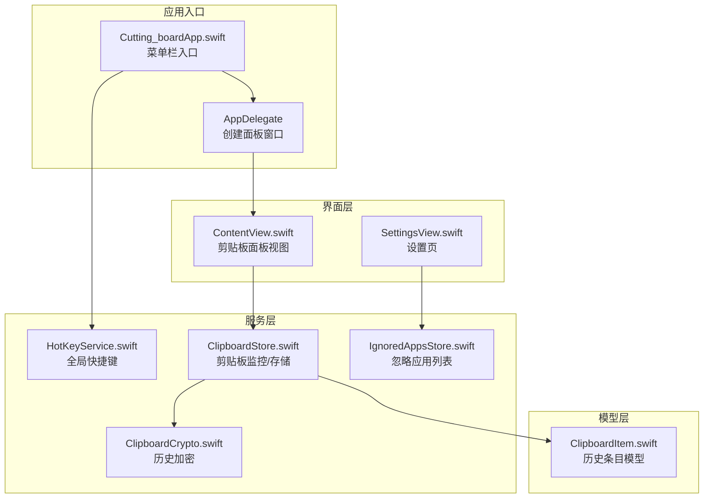
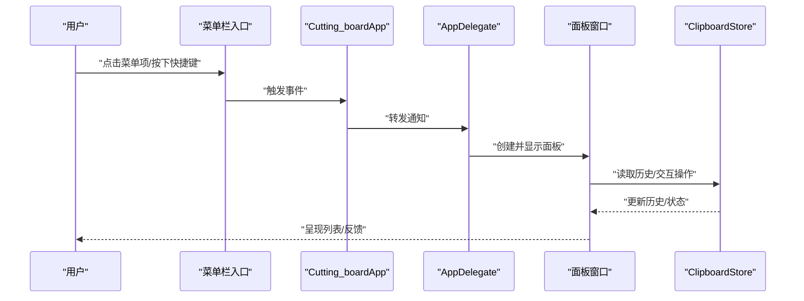
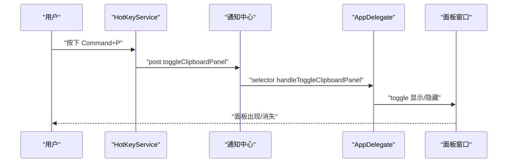
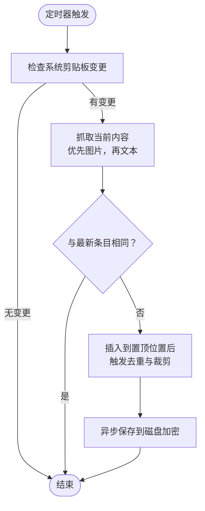
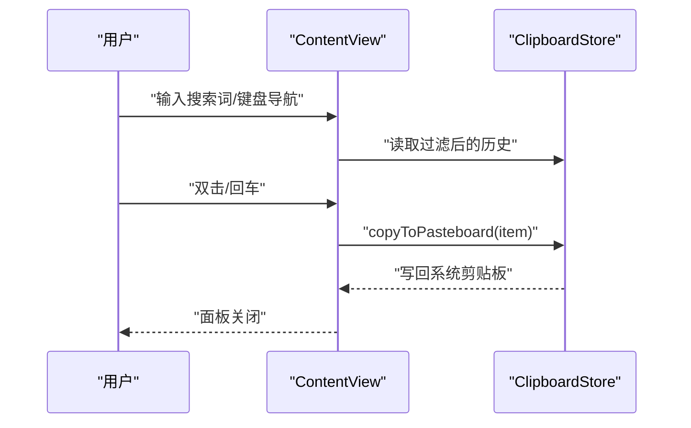
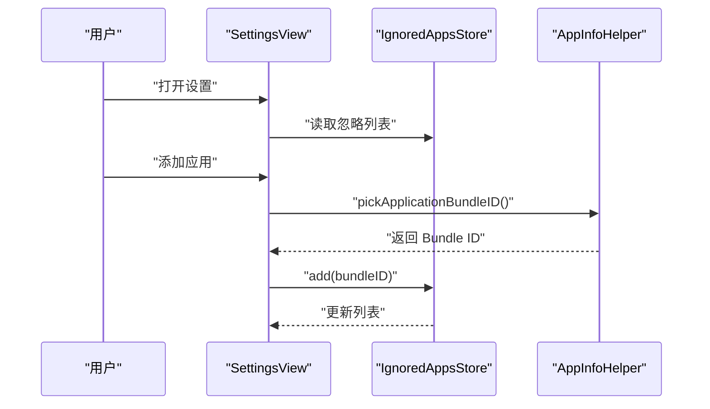
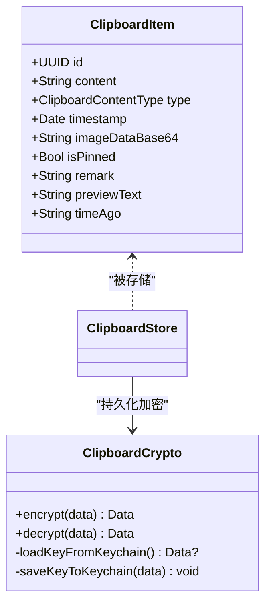
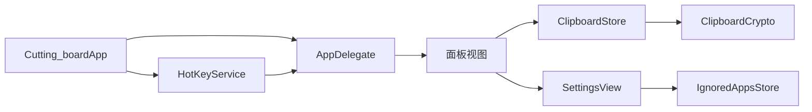

# 快速开始

<cite>
**本文引用的文件**
- [Cutting_boardApp.swift](file://Cutting_board/Cutting_boardApp.swift)
- [ContentView.swift](file://Cutting_board/ContentView.swift)
- [SettingsView.swift](file://Cutting_board/SettingsView.swift)
- [HotKeyService.swift](file://Cutting_board/Services/HotKeyService.swift)
- [ClipboardStore.swift](file://Cutting_board/Services/ClipboardStore.swift)
- [IgnoredAppsStore.swift](file://Cutting_board/Services/IgnoredAppsStore.swift)
- [ClipboardItem.swift](file://Cutting_board/Models/ClipboardItem.swift)
- [ClipboardCrypto.swift](file://Cutting_board/Services/ClipboardCrypto.swift)
- [build-and-package.sh](file://build-and-package.sh)
- [Info.plist（发布版）](file://build/Build/Products/Release/ding.app/Contents/Info.plist)
- [Info.plist（调试版）](file://build/Build/Products/Debug/ding.app/Contents/Info.plist)
</cite>

## 目录
1. [简介](#简介)
2. [项目结构](#项目结构)
3. [核心组件](#核心组件)
4. [架构总览](#架构总览)
5. [详细组件解析](#详细组件解析)
6. [依赖关系分析](#依赖关系分析)
7. [性能与行为特性](#性能与行为特性)
8. [故障排查指南](#故障排查指南)
9. [结论](#结论)
10. [附录：环境要求与安装步骤](#附录环境要求与安装步骤)

## 简介
Cutting_board 是一款 macOS 菜单栏剪贴板增强工具，支持：
- 全局快捷键唤出剪贴板面板（Command+P）
- 实时监控系统剪贴板并保存历史
- 支持文本与图片历史
- 剪贴板历史搜索、备注、置顶（钉住）、清空
- 忽略特定应用的复制内容
- 历史本地持久化与加密存储

## 项目结构
该工程采用 SwiftUI + AppKit 架构，核心入口为菜单栏应用，通过 App Delegate 创建独立的剪贴板面板窗口；业务逻辑集中在服务层（剪贴板监控、热键、忽略应用、加密存储）与模型层（剪贴板条目）。

图表来源
- [Cutting_boardApp.swift](file://Cutting_board/Cutting_boardApp.swift#L11-L31)
- [ContentView.swift](file://Cutting_board/ContentView.swift#L20-L95)
- [SettingsView.swift](file://Cutting_board/SettingsView.swift#L11-L39)
- [HotKeyService.swift](file://Cutting_board/Services/HotKeyService.swift#L30-L81)
- [ClipboardStore.swift](file://Cutting_board/Services/ClipboardStore.swift#L14-L39)
- [IgnoredAppsStore.swift](file://Cutting_board/Services/IgnoredAppsStore.swift#L16-L40)
- [ClipboardItem.swift](file://Cutting_board/Models/ClipboardItem.swift#L17-L45)
- [ClipboardCrypto.swift](file://Cutting_board/Services/ClipboardCrypto.swift#L16-L46)

章节来源
- [Cutting_boardApp.swift](file://Cutting_board/Cutting_boardApp.swift#L11-L31)
- [ContentView.swift](file://Cutting_board/ContentView.swift#L20-L95)
- [SettingsView.swift](file://Cutting_board/SettingsView.swift#L11-L39)
- [HotKeyService.swift](file://Cutting_board/Services/HotKeyService.swift#L30-L81)
- [ClipboardStore.swift](file://Cutting_board/Services/ClipboardStore.swift#L14-L39)
- [IgnoredAppsStore.swift](file://Cutting_board/Services/IgnoredAppsStore.swift#L16-L40)
- [ClipboardItem.swift](file://Cutting_board/Models/ClipboardItem.swift#L17-L45)
- [ClipboardCrypto.swift](file://Cutting_board/Services/ClipboardCrypto.swift#L16-L46)

## 核心组件
- 应用入口与菜单栏：定义菜单栏入口、全局快捷键绑定、以及通过通知控制面板显示/隐藏。
- 面板视图：展示历史列表、搜索、备注、置顶、清空、设置入口。
- 服务层：
  - 热键服务：使用 Carbon API 注册全局快捷键，无需辅助功能权限。
  - 剪贴板存储：定时轮询系统剪贴板，识别文本/图片，去重、排序、持久化与加密。
  - 忽略应用：基于 Bundle ID 记录忽略的应用列表。
  - 加密存储：Keychain 生成/保存密钥，AES-GCM 加密封装历史文件。
- 模型层：剪贴板条目模型，含类型、时间戳、Base64 图片、备注、置顶标记等。

章节来源
- [Cutting_boardApp.swift](file://Cutting_board/Cutting_boardApp.swift#L11-L31)
- [ContentView.swift](file://Cutting_board/ContentView.swift#L20-L95)
- [HotKeyService.swift](file://Cutting_board/Services/HotKeyService.swift#L30-L81)
- [ClipboardStore.swift](file://Cutting_board/Services/ClipboardStore.swift#L14-L39)
- [IgnoredAppsStore.swift](file://Cutting_board/Services/IgnoredAppsStore.swift#L16-L40)
- [ClipboardItem.swift](file://Cutting_board/Models/ClipboardItem.swift#L17-L45)
- [ClipboardCrypto.swift](file://Cutting_board/Services/ClipboardCrypto.swift#L16-L46)

## 架构总览
应用采用“菜单栏入口 + 独立面板窗口 + 服务层”的结构。菜单栏按钮提供快捷操作与全局快捷键；面板窗口承载历史列表与交互；服务层负责剪贴板监控、热键、忽略应用与加密存储。

图表来源
- [Cutting_boardApp.swift](file://Cutting_board/Cutting_boardApp.swift#L15-L31)
- [HotKeyService.swift](file://Cutting_board/Services/HotKeyService.swift#L12-L27)
- [ClipboardStore.swift](file://Cutting_board/Services/ClipboardStore.swift#L14-L39)

## 详细组件解析

### 组件一：全局快捷键与面板控制
- 功能要点
  - 使用 Carbon API 注册全局快捷键 Command+P，无需辅助功能权限。
  - 通过通知中心分发“显示/隐藏/切换”面板事件，由 AppDelegate 统一处理。
  - 面板窗口为独立 NSWindow，首次显示时自动将键盘焦点定位到列表。
- 关键路径
  - 快捷键注册与回调：[HotKeyService.swift](file://Cutting_board/Services/HotKeyService.swift#L30-L81)
  - 菜单栏入口与快捷键绑定：[Cutting_boardApp.swift](file://Cutting_board/Cutting_boardApp.swift#L15-L31)
  - 面板创建与焦点处理：[Cutting_boardApp.swift](file://Cutting_board/Cutting_boardApp.swift#L78-L142)

图表来源
- [HotKeyService.swift](file://Cutting_board/Services/HotKeyService.swift#L12-L27)
- [Cutting_boardApp.swift](file://Cutting_board/Cutting_boardApp.swift#L46-L72)
- [Cutting_boardApp.swift](file://Cutting_board/Cutting_boardApp.swift#L131-L142)

章节来源
- [HotKeyService.swift](file://Cutting_board/Services/HotKeyService.swift#L30-L81)
- [Cutting_boardApp.swift](file://Cutting_board/Cutting_boardApp.swift#L15-L31)
- [Cutting_boardApp.swift](file://Cutting_board/Cutting_boardApp.swift#L78-L142)

### 组件二：剪贴板监控与历史管理
- 功能要点
  - 定时轮询系统剪贴板，检测变更并抓取内容。
  - 优先识别图片（PNG Base64），其次识别非空白文本。
  - 去重策略：与最新条目完全一致则忽略。
  - 排序策略：置顶项优先，其余按时间倒序。
  - 清理策略：最大条数限制，保留置顶项，按需裁剪未置顶项。
  - 持久化与加密：JSON 编码，AES-GCM 加密，Keychain 管理密钥。
- 关键路径
  - 监控与抓取：[ClipboardStore.swift](file://Cutting_board/Services/ClipboardStore.swift#L47-L90)
  - 去重与插入：[ClipboardStore.swift](file://Cutting_board/Services/ClipboardStore.swift#L94-L108)
  - 裁剪与排序：[ClipboardStore.swift](file://Cutting_board/Services/ClipboardStore.swift#L110-L147)
  - 写回系统剪贴板：[ClipboardStore.swift](file://Cutting_board/Services/ClipboardStore.swift#L167-L179)
  - 加密与解密：[ClipboardCrypto.swift](file://Cutting_board/Services/ClipboardCrypto.swift#L32-L46)

图表来源
- [ClipboardStore.swift](file://Cutting_board/Services/ClipboardStore.swift#L47-L90)
- [ClipboardStore.swift](file://Cutting_board/Services/ClipboardStore.swift#L94-L108)
- [ClipboardStore.swift](file://Cutting_board/Services/ClipboardStore.swift#L110-L147)
- [ClipboardCrypto.swift](file://Cutting_board/Services/ClipboardCrypto.swift#L32-L46)

章节来源
- [ClipboardStore.swift](file://Cutting_board/Services/ClipboardStore.swift#L47-L90)
- [ClipboardStore.swift](file://Cutting_board/Services/ClipboardStore.swift#L94-L108)
- [ClipboardStore.swift](file://Cutting_board/Services/ClipboardStore.swift#L110-L147)
- [ClipboardStore.swift](file://Cutting_board/Services/ClipboardStore.swift#L167-L179)
- [ClipboardCrypto.swift](file://Cutting_board/Services/ClipboardCrypto.swift#L32-L46)

### 组件三：面板视图与交互
- 功能要点
  - 展示历史列表，支持搜索（内容与备注），键盘导航（上下箭头、回车、Esc）。
  - 双击或回车粘贴到当前应用；右键菜单支持编辑备注与删除。
  - 置顶/取消置顶；清空未置顶；打开设置。
- 关键路径
  - 视图主体与交互：[ContentView.swift](file://Cutting_board/ContentView.swift#L20-L95)
  - 行渲染与预览：[ContentView.swift](file://Cutting_board/ContentView.swift#L210-L305)
  - 粘贴与关闭面板：[ContentView.swift](file://Cutting_board/ContentView.swift#L289-L296)

图表来源
- [ContentView.swift](file://Cutting_board/ContentView.swift#L20-L95)
- [ContentView.swift](file://Cutting_board/ContentView.swift#L289-L296)
- [ClipboardStore.swift](file://Cutting_board/Services/ClipboardStore.swift#L167-L179)

章节来源
- [ContentView.swift](file://Cutting_board/ContentView.swift#L20-L95)
- [ContentView.swift](file://Cutting_board/ContentView.swift#L210-L305)
- [ContentView.swift](file://Cutting_board/ContentView.swift#L289-L296)

### 组件四：设置与忽略应用
- 功能要点
  - 查看与移除已忽略的应用；添加新的应用（弹出系统选择框）。
  - 应用名称与图标来自 Bundle 信息。
- 关键路径
  - 设置页视图：[SettingsView.swift](file://Cutting_board/SettingsView.swift#L11-L39)
  - 忽略应用列表与增删：[IgnoredAppsStore.swift](file://Cutting_board/Services/IgnoredAppsStore.swift#L16-L40)
  - 应用信息查询与选择：[IgnoredAppsStore.swift](file://Cutting_board/Services/IgnoredAppsStore.swift#L44-L68)

图表来源
- [SettingsView.swift](file://Cutting_board/SettingsView.swift#L11-L39)
- [IgnoredAppsStore.swift](file://Cutting_board/Services/IgnoredAppsStore.swift#L16-L40)
- [IgnoredAppsStore.swift](file://Cutting_board/Services/IgnoredAppsStore.swift#L44-L68)

章节来源
- [SettingsView.swift](file://Cutting_board/SettingsView.swift#L11-L39)
- [IgnoredAppsStore.swift](file://Cutting_board/Services/IgnoredAppsStore.swift#L16-L40)
- [IgnoredAppsStore.swift](file://Cutting_board/Services/IgnoredAppsStore.swift#L44-L68)

### 组件五：模型与加密
- 剪贴板条目模型：包含类型、内容、时间戳、可选图片 Base64、备注、置顶标记等。
- 历史文件加密：Keychain 中保存 32 字节密钥，使用 AES-GCM 加密封装，文件头标识加密格式，兼容旧版明文。
- 关键路径
  - 模型定义与编码：[ClipboardItem.swift](file://Cutting_board/Models/ClipboardItem.swift#L17-L89)
  - 加密/解密与密钥管理：[ClipboardCrypto.swift](file://Cutting_board/Services/ClipboardCrypto.swift#L16-L72)

图表来源
- [ClipboardItem.swift](file://Cutting_board/Models/ClipboardItem.swift#L17-L89)
- [ClipboardCrypto.swift](file://Cutting_board/Services/ClipboardCrypto.swift#L16-L72)

章节来源
- [ClipboardItem.swift](file://Cutting_board/Models/ClipboardItem.swift#L17-L89)
- [ClipboardCrypto.swift](file://Cutting_board/Services/ClipboardCrypto.swift#L16-L72)

## 依赖关系分析
- 组件耦合
  - AppDelegate 与面板视图：通过通知中心协调显示/隐藏。
  - ContentView 与 ClipboardStore：观察历史变化并进行 UI 更新。
  - SettingsView 与 IgnoredAppsStore：读写忽略应用列表。
  - ClipboardStore 与 ClipboardCrypto：持久化前加密，加载时解密。
- 外部依赖
  - AppKit、SwiftUI、Carbon（全局快捷键）、CryptoKit（AES-GCM）、Security（Keychain）。
- 潜在循环依赖
  - 未发现直接循环依赖；服务层通过单例与通知中心解耦。

图表来源
- [Cutting_boardApp.swift](file://Cutting_board/Cutting_boardApp.swift#L11-L31)
- [HotKeyService.swift](file://Cutting_board/Services/HotKeyService.swift#L30-L81)
- [ContentView.swift](file://Cutting_board/ContentView.swift#L20-L95)
- [SettingsView.swift](file://Cutting_board/SettingsView.swift#L11-L39)
- [ClipboardStore.swift](file://Cutting_board/Services/ClipboardStore.swift#L14-L39)
- [ClipboardCrypto.swift](file://Cutting_board/Services/ClipboardCrypto.swift#L16-L46)
- [IgnoredAppsStore.swift](file://Cutting_board/Services/IgnoredAppsStore.swift#L16-L40)

章节来源
- [Cutting_boardApp.swift](file://Cutting_board/Cutting_boardApp.swift#L11-L31)
- [HotKeyService.swift](file://Cutting_board/Services/HotKeyService.swift#L30-L81)
- [ContentView.swift](file://Cutting_board/ContentView.swift#L20-L95)
- [SettingsView.swift](file://Cutting_board/SettingsView.swift#L11-L39)
- [ClipboardStore.swift](file://Cutting_board/Services/ClipboardStore.swift#L14-L39)
- [ClipboardCrypto.swift](file://Cutting_board/Services/ClipboardCrypto.swift#L16-L46)
- [IgnoredAppsStore.swift](file://Cutting_board/Services/IgnoredAppsStore.swift#L16-L40)

## 性能与行为特性
- 轮询频率：每 0.5 秒检查一次系统剪贴板变更，平衡实时性与资源占用。
- 去重策略：避免重复内容进入历史，提升列表质量。
- 排序与裁剪：置顶项优先，未置顶部分按最大条数限制裁剪，减少内存与 IO 压力。
- 加密开销：仅在保存/加载时进行加解密，不影响前台交互流畅度。
- 面板焦点：首次显示自动将焦点设置到列表，提升键盘操作效率。

章节来源
- [ClipboardStore.swift](file://Cutting_board/Services/ClipboardStore.swift#L47-L90)
- [ClipboardStore.swift](file://Cutting_board/Services/ClipboardStore.swift#L110-L147)
- [ClipboardStore.swift](file://Cutting_board/Services/ClipboardStore.swift#L210-L221)
- [Cutting_boardApp.swift](file://Cutting_board/Cutting_boardApp.swift#L100-L112)

## 故障排查指南
- 无法注册全局快捷键
  - 现象：按下 Command+P 无响应。
  - 排查：确认系统未阻止应用接收快捷键；检查服务注册是否成功。
  - 参考：[HotKeyService.swift](file://Cutting_board/Services/HotKeyService.swift#L36-L69)
- 面板不显示或无法聚焦
  - 现象：调起面板但无焦点，键盘操作无效。
  - 排查：确保面板已创建并设置为 key window；检查视图层级中是否存在 NSTableView。
  - 参考：[Cutting_boardApp.swift](file://Cutting_board/Cutting_boardApp.swift#L78-L121)
- 历史为空或未更新
  - 现象：复制内容后历史未增加。
  - 排查：确认未被忽略应用列表过滤；检查剪贴板内容是否为空白；查看定时监控是否正常。
  - 参考：[ClipboardStore.swift](file://Cutting_board/Services/ClipboardStore.swift#L62-L90)
- 历史文件损坏或无法读取
  - 现象：启动后历史丢失或异常。
  - 排查：确认加密文件头与密钥存在；若为旧版明文，可兼容读取。
  - 参考：[ClipboardCrypto.swift](file://Cutting_board/Services/ClipboardCrypto.swift#L38-L46)
- 忽略应用设置无效
  - 现象：仍记录来自某应用的内容。
  - 排查：确认 Bundle ID 正确；检查设置页是否已保存。
  - 参考：[IgnoredAppsStore.swift](file://Cutting_board/Services/IgnoredAppsStore.swift#L16-L40)

章节来源
- [HotKeyService.swift](file://Cutting_board/Services/HotKeyService.swift#L36-L69)
- [Cutting_boardApp.swift](file://Cutting_board/Cutting_boardApp.swift#L78-L121)
- [ClipboardStore.swift](file://Cutting_board/Services/ClipboardStore.swift#L62-L90)
- [ClipboardCrypto.swift](file://Cutting_board/Services/ClipboardCrypto.swift#L38-L46)
- [IgnoredAppsStore.swift](file://Cutting_board/Services/IgnoredAppsStore.swift#L16-L40)

## 结论
Cutting_board 提供简洁高效的剪贴板历史管理体验：通过全局快捷键快速唤起面板，结合智能监控与加密存储，满足日常复制粘贴场景下的检索与复用需求。建议新用户从“启用全局快捷键”“查看历史与搜索”“配置忽略应用”三步开始，逐步掌握“置顶/备注/清空”的管理技巧。

## 附录：环境要求与安装步骤

### 环境要求
- macOS 版本
  - 最低系统版本：根据 Info.plist 中 LSMinimumSystemVersion 指定。
  - 发布版 Info.plist：最低系统版本为 26.1（对应 macOS 版本约 13.x 或更高）。
  - 调试版 Info.plist：最低系统版本为 26.1。
  - 参考路径：
    - [Info.plist（发布版）](file://build/Build/Products/Release/ding.app/Contents/Info.plist#L47-L48)
    - [Info.plist（调试版）](file://build/Build/Products/Debug/ding.app/Contents/Info.plist#L47-L48)
- Xcode 版本
  - 构建工具链版本：DTXcode=2620（对应 Xcode 16.x 左右）。
  - 参考路径：
    - [Info.plist（发布版）](file://build/Build/Products/Release/ding.app/Contents/Info.plist#L43-L44)
    - [Info.plist（调试版）](file://build/Build/Products/Debug/ding.app/Contents/Info.plist#L43-L44)
- Swift 版本
  - 项目使用 SwiftUI/AppKit，建议使用与 Xcode 16.x 搭配的 Swift 工具链版本（具体以 Xcode 自带为准）。

### 安装步骤（从源码到首次运行）
- 准备工作
  - 确保 macOS 版本满足最低要求。
  - 安装 Xcode 并打开项目工程。
- 获取源码
  - 从仓库克隆或下载压缩包至本地。
- 打开工程
  - 双击工程文件打开 Xcode 工作区。
- 构建与运行
  - 选择目标方案（如 Cutting_board），连接设备或模拟器，点击运行。
  - 首次运行会在菜单栏出现应用图标。
- 首次使用
  - 复制一段文本或一张图片，等待历史列表更新。
  - 按下 Command+P 呼出面板，使用上下箭头选择，回车粘贴。
  - 打开设置页，添加需要忽略的应用（例如某些截图工具）。

### 基本使用教程
- 启用全局快捷键
  - 默认快捷键：Command+P。无需辅助功能权限即可使用。
  - 参考：[HotKeyService.swift](file://Cutting_board/Services/HotKeyService.swift#L30-L81)
- 查看与管理剪贴板历史
  - 呼出面板后，使用上下箭头移动选中项，双击或回车粘贴。
  - 右键菜单支持“编辑备注”“删除”，顶部“清空”按钮可清理未置顶项。
  - 参考：[ContentView.swift](file://Cutting_board/ContentView.swift#L20-L95)
- 配置应用设置
  - 点击面板右上角齿轮图标打开设置页。
  - 在“忽略应用程序”中添加或移除应用，避免记录特定应用的复制内容。
  - 参考：[SettingsView.swift](file://Cutting_board/SettingsView.swift#L11-L39)，[IgnoredAppsStore.swift](file://Cutting_board/Services/IgnoredAppsStore.swift#L16-L40)

### 常见初始配置问题与解决方案
- 快捷键无效
  - 确认系统未阻止快捷键；重启应用后重试。
  - 参考：[HotKeyService.swift](file://Cutting_board/Services/HotKeyService.swift#L36-L69)
- 面板无焦点
  - 首次显示时自动设置焦点；若无效，尝试重新唤起面板。
  - 参考：[Cutting_boardApp.swift](file://Cutting_board/Cutting_boardApp.swift#L100-L112)
- 历史未更新
  - 检查是否被忽略应用过滤；确认内容非空白；等待轮询周期。
  - 参考：[ClipboardStore.swift](file://Cutting_board/Services/ClipboardStore.swift#L62-L90)
- 历史文件读取失败
  - 若为旧版明文，可兼容读取；若为加密文件，确认密钥存在。
  - 参考：[ClipboardCrypto.swift](file://Cutting_board/Services/ClipboardCrypto.swift#L38-L46)