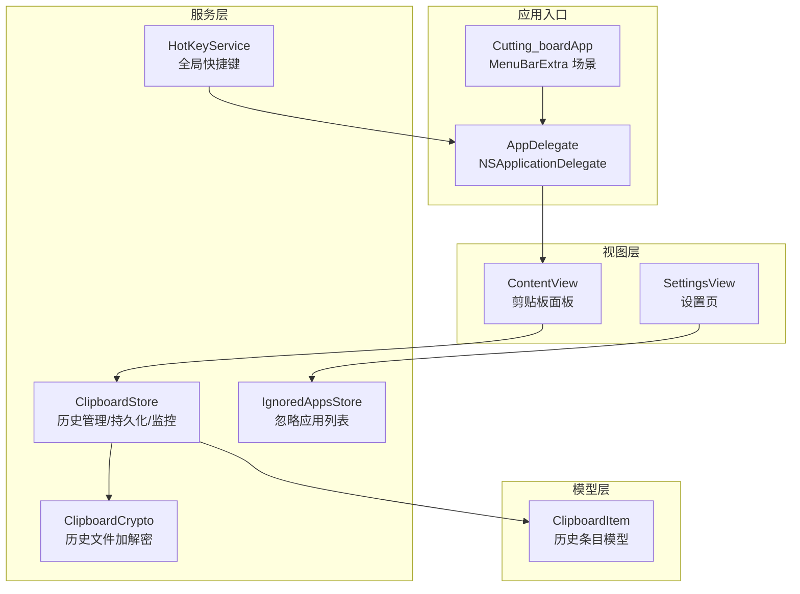
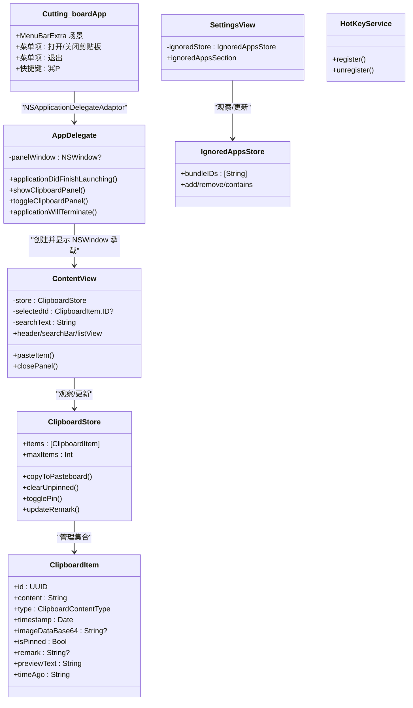
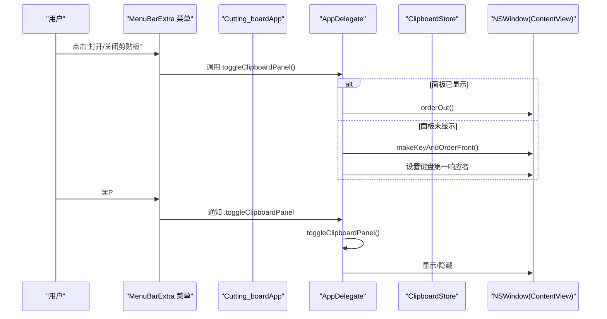
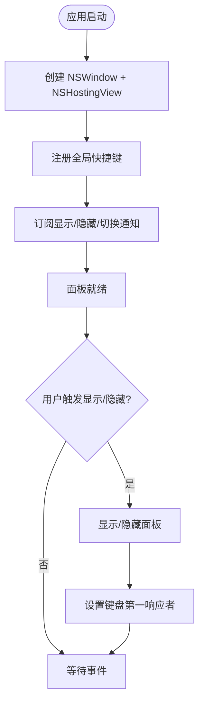
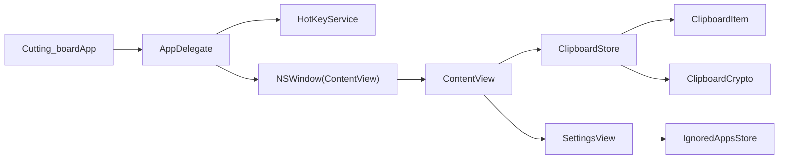

# 应用架构模式

<cite>
**本文引用的文件**
- [Cutting_boardApp.swift](file://Cutting_board/Cutting_boardApp.swift)
- [ContentView.swift](file://Cutting_board/ContentView.swift)
- [SettingsView.swift](file://Cutting_board/SettingsView.swift)
- [ClipboardItem.swift](file://Cutting_board/Models/ClipboardItem.swift)
- [ClipboardStore.swift](file://Cutting_board/Services/ClipboardStore.swift)
- [HotKeyService.swift](file://Cutting_board/Services/HotKeyService.swift)
- [IgnoredAppsStore.swift](file://Cutting_board/Services/IgnoredAppsStore.swift)
- [ClipboardCrypto.swift](file://Cutting_board/Services/ClipboardCrypto.swift)
</cite>

## 目录
1. [引言](#引言)
2. [项目结构](#项目结构)
3. [核心组件](#核心组件)
4. [架构总览](#架构总览)
5. [组件详细分析](#组件详细分析)
6. [依赖关系分析](#依赖关系分析)
7. [性能考量](#性能考量)
8. [故障排查指南](#故障排查指南)
9. [结论](#结论)
10. [附录](#附录)

## 引言
本文件系统性梳理 Cutting_board 的应用架构模式，重点阐释 MVVM 架构在项目中的落地方式：Model-View-ViewModel 的职责分离、数据绑定机制与事件流；详解应用入口 Cutting_boardApp 的设计，包括菜单栏入口(MenuBarExtra)与 AppDelegate 委托模式；剖析 SwiftUI 与 AppKit 的混合架构，解释为何在 LSUIElement 场景下需要手动创建 NSWindow 而非依赖 SwiftUI 的 WindowGroup；最后给出组件间依赖关系图与数据流向说明，并总结架构决策的技术考量与设计权衡。

## 项目结构
项目采用“按职责分层 + 功能模块化”的组织方式：
- 应用入口与场景定义：Cutting_boardApp.swift
- 视图层：ContentView.swift、SettingsView.swift
- 模型层：ClipboardItem.swift
- 服务层：ClipboardStore.swift、HotKeyService.swift、IgnoredAppsStore.swift、ClipboardCrypto.swift
- 资源与资产：Assets.xcassets（应用图标、颜色集）

图表来源
- [Cutting_boardApp.swift](file://Cutting_board/Cutting_boardApp.swift#L11-L31)
- [ContentView.swift](file://Cutting_board/ContentView.swift#L20-L95)
- [SettingsView.swift](file://Cutting_board/SettingsView.swift#L11-L39)
- [ClipboardStore.swift](file://Cutting_board/Services/ClipboardStore.swift#L14-L39)
- [HotKeyService.swift](file://Cutting_board/Services/HotKeyService.swift#L30-L69)
- [IgnoredAppsStore.swift](file://Cutting_board/Services/IgnoredAppsStore.swift#L16-L25)
- [ClipboardItem.swift](file://Cutting_board/Models/ClipboardItem.swift#L17-L45)

章节来源
- [Cutting_boardApp.swift](file://Cutting_board/Cutting_boardApp.swift#L11-L31)
- [ContentView.swift](file://Cutting_board/ContentView.swift#L20-L95)
- [SettingsView.swift](file://Cutting_board/SettingsView.swift#L11-L39)
- [ClipboardStore.swift](file://Cutting_board/Services/ClipboardStore.swift#L14-L39)
- [HotKeyService.swift](file://Cutting_board/Services/HotKeyService.swift#L30-L69)
- [IgnoredAppsStore.swift](file://Cutting_board/Services/IgnoredAppsStore.swift#L16-L25)
- [ClipboardItem.swift](file://Cutting_board/Models/ClipboardItem.swift#L17-L45)

## 核心组件
- 应用入口与场景：Cutting_boardApp 通过 MenuBarExtra 定义菜单栏入口，提供“打开/关闭剪贴板”“退出”等操作，并绑定全局快捷键。
- AppDelegate 委托：负责在应用启动时创建剪贴板面板窗口（NSWindow + NSHostingView），注册全局快捷键，监听通知以响应菜单/快捷键/通知驱动的面板显示/隐藏/切换。
- 视图层：
  - ContentView：剪贴板面板主体，包含头部、搜索、列表、空态/无结果态、备注编辑弹窗、设置入口等。
  - SettingsView：设置页，展示忽略的应用列表并支持增删与选择应用。
- 服务层：
  - ClipboardStore：剪贴板监控、历史管理、排序与裁剪、持久化、写回系统剪贴板。
  - HotKeyService：基于 Carbon API 注册全局快捷键，无需辅助功能权限。
  - IgnoredAppsStore：维护忽略的应用 Bundle ID 列表，提供名称与图标查询。
  - ClipboardCrypto：基于 Keychain 的密钥管理与 AES-GCM 加密，保护历史文件。
- 模型层：ClipboardItem：历史条目的数据结构与编码/解码、预览文本与相对时间。

章节来源
- [Cutting_boardApp.swift](file://Cutting_board/Cutting_boardApp.swift#L11-L31)
- [Cutting_boardApp.swift](file://Cutting_board/Cutting_boardApp.swift#L35-L143)
- [ContentView.swift](file://Cutting_board/ContentView.swift#L20-L305)
- [SettingsView.swift](file://Cutting_board/SettingsView.swift#L11-L89)
- [ClipboardStore.swift](file://Cutting_board/Services/ClipboardStore.swift#L14-L223)
- [HotKeyService.swift](file://Cutting_board/Services/HotKeyService.swift#L30-L81)
- [IgnoredAppsStore.swift](file://Cutting_board/Services/IgnoredAppsStore.swift#L16-L69)
- [ClipboardItem.swift](file://Cutting_board/Models/ClipboardItem.swift#L17-L90)

## 架构总览
本项目采用 MVVM 架构：
- Model：ClipboardItem（数据模型）、IgnoredAppsStore（状态模型）
- View：ContentView、SettingsView（UI 表现）
- ViewModel：通过 @ObservedObject/@Published/@State 等 SwiftUI 生命周期与状态绑定实现，视图直接持有服务实例或共享单例作为数据源，形成“视图-服务”直连的轻量 ViewModel 替代。

图表来源
- [Cutting_boardApp.swift](file://Cutting_board/Cutting_boardApp.swift#L11-L31)
- [Cutting_boardApp.swift](file://Cutting_board/Cutting_boardApp.swift#L35-L143)
- [ContentView.swift](file://Cutting_board/ContentView.swift#L20-L305)
- [SettingsView.swift](file://Cutting_board/SettingsView.swift#L11-L89)
- [ClipboardStore.swift](file://Cutting_board/Services/ClipboardStore.swift#L14-L223)
- [HotKeyService.swift](file://Cutting_board/Services/HotKeyService.swift#L30-L81)
- [IgnoredAppsStore.swift](file://Cutting_board/Services/IgnoredAppsStore.swift#L16-L69)
- [ClipboardItem.swift](file://Cutting_board/Models/ClipboardItem.swift#L17-L90)

## 组件详细分析

### 应用入口与场景：Cutting_boardApp
- 职责分离：
  - 切换场景：通过 MenuBarExtra 定义菜单栏入口，提供“打开/关闭剪贴板”“退出”等操作。
  - 快捷键绑定：为“打开/关闭剪贴板”绑定 ⌘P。
  - 委托适配：使用 @NSApplicationDelegateAdaptor(AppDelegate.self) 将 AppDelegate 注入为 NSApplicationDelegate。
- 数据绑定机制：
  - 菜单项与快捷键通过通知中心与 AppDelegate 方法交互，实现 UI 与业务逻辑解耦。
- 事件流概览：

图表来源
- [Cutting_boardApp.swift](file://Cutting_board/Cutting_boardApp.swift#L15-L30)
- [Cutting_boardApp.swift](file://Cutting_board/Cutting_boardApp.swift#L17-L27)
- [Cutting_boardApp.swift](file://Cutting_board/Cutting_boardApp.swift#L13-L19)
- [Cutting_boardApp.swift](file://Cutting_board/Cutting_boardApp.swift#L135-L142)
- [Cutting_boardApp.swift](file://Cutting_board/Cutting_boardApp.swift#L78-L98)
- [Cutting_boardApp.swift](file://Cutting_board/Cutting_boardApp.swift#L100-L121)

章节来源
- [Cutting_boardApp.swift](file://Cutting_board/Cutting_boardApp.swift#L11-L31)
- [Cutting_boardApp.swift](file://Cutting_board/Cutting_boardApp.swift#L35-L143)

### AppDelegate 委托模式与 NSWindow 手动创建
- 委托职责：
  - 应用启动：创建剪贴板面板窗口、注册全局快捷键、订阅通知。
  - 生命周期：应用退出时注销快捷键与移除通知观察者。
  - 面板控制：显示/隐藏/切换面板，设置键盘第一响应者以提升可访问性。
- 为什么手动创建 NSWindow？
  - 在 LSUIElement（菜单栏应用）场景下，SwiftUI 的 WindowGroup 不会自动创建窗口，必须由 AppKit 主动创建并托管 ContentView。
  - 通过 NSHostingView 承载 SwiftUI 视图，结合 NSWindow 的样式掩码、居中与释放策略，确保面板行为符合预期。
- 关键流程：

图表来源
- [Cutting_boardApp.swift](file://Cutting_board/Cutting_boardApp.swift#L46-L76)
- [Cutting_boardApp.swift](file://Cutting_board/Cutting_boardApp.swift#L78-L98)
- [Cutting_boardApp.swift](file://Cutting_board/Cutting_boardApp.swift#L100-L142)
- [Cutting_boardApp.swift](file://Cutting_board/Cutting_boardApp.swift#L114-L121)

章节来源
- [Cutting_boardApp.swift](file://Cutting_board/Cutting_boardApp.swift#L35-L143)

### 视图层：ContentView 与 SettingsView
- ContentView：
  - 状态管理：@ObservedObject 绑定 ClipboardStore，@State 管理搜索、选中项、备注编辑、设置弹窗等。
  - 过滤与选择：根据搜索词动态过滤历史项，键盘方向键移动选中，回车粘贴，Esc 关闭面板。
  - 交互细节：双击粘贴、右键菜单、删除、编辑备注、清空未钉住项、打开设置。
  - 可访问性：为关键元素设置可访问性标签与提示，提供无障碍体验。
- SettingsView：
  - 展示忽略的应用列表，支持添加与移除，使用 AppInfoHelper 获取应用图标与名称。
  - 通过 NSOpenPanel 选择 .app 获取 Bundle ID 并写入忽略列表。

章节来源
- [ContentView.swift](file://Cutting_board/ContentView.swift#L20-L305)
- [SettingsView.swift](file://Cutting_board/SettingsView.swift#L11-L89)

### 服务层：ClipboardStore、HotKeyService、IgnoredAppsStore、ClipboardCrypto
- ClipboardStore：
  - 监控：定时器轮询系统剪贴板 changeCount，检测变化后抓取当前内容。
  - 内容抓取：优先图片（PNG Base64），其次文本；忽略来自忽略列表应用的内容。
  - 历史管理：去重、插入位置（钉住项置顶）、裁剪至最大条数、排序、持久化。
  - 写回：将选中项写回系统剪贴板，更新 changeCount。
  - 持久化：JSON 编码 + AES-GCM 加密，Keychain 存储密钥；兼容旧版明文。
- HotKeyService：
  - 基于 Carbon API 注册全局快捷键 Command+P，无需辅助功能权限；通过通知中心派发显示/隐藏/切换。
- IgnoredAppsStore：
  - 维护忽略应用的 Bundle ID 列表，提供名称与图标查询，支持选择应用。
- ClipboardCrypto：
  - Keychain 生成/加载 32 字节密钥，AES-GCM 加密封装；文件头标识加密格式，兼容旧明文。

章节来源
- [ClipboardStore.swift](file://Cutting_board/Services/ClipboardStore.swift#L14-L223)
- [HotKeyService.swift](file://Cutting_board/Services/HotKeyService.swift#L30-L81)
- [IgnoredAppsStore.swift](file://Cutting_board/Services/IgnoredAppsStore.swift#L16-L69)
- [ClipboardCrypto.swift](file://Cutting_board/Services/ClipboardCrypto.swift#L16-L72)

### 模型层：ClipboardItem
- 数据结构：包含唯一 ID、内容、类型（文本/图片）、时间戳、图片 Base64、是否钉住、备注等。
- 编码/解码：遵循 Codable，支持 JSON 序列化与 ISO8601 时间格式。
- 辅助属性：预览文本（截断）、相对时间字符串。

章节来源
- [ClipboardItem.swift](file://Cutting_board/Models/ClipboardItem.swift#L17-L90)

## 依赖关系分析
- 视图到服务：
  - ContentView 依赖 ClipboardStore 提供数据与操作接口。
  - SettingsView 依赖 IgnoredAppsStore 提供忽略应用列表。
- 服务到模型：
  - ClipboardStore 管理 ClipboardItem 集合，持久化依赖 ClipboardCrypto。
- 应用层到系统：
  - AppDelegate 依赖 AppKit 创建 NSWindow，依赖通知中心与 Carbon API。
- 事件与通知：
  - HotKeyService 通过通知中心发布显示/隐藏/切换事件，AppDelegate 与视图均订阅。

图表来源
- [Cutting_boardApp.swift](file://Cutting_board/Cutting_boardApp.swift#L11-L31)
- [Cutting_boardApp.swift](file://Cutting_board/Cutting_boardApp.swift#L35-L143)
- [ContentView.swift](file://Cutting_board/ContentView.swift#L20-L305)
- [SettingsView.swift](file://Cutting_board/SettingsView.swift#L11-L89)
- [ClipboardStore.swift](file://Cutting_board/Services/ClipboardStore.swift#L14-L223)
- [HotKeyService.swift](file://Cutting_board/Services/HotKeyService.swift#L30-L81)
- [IgnoredAppsStore.swift](file://Cutting_board/Services/IgnoredAppsStore.swift#L16-L69)
- [ClipboardItem.swift](file://Cutting_board/Models/ClipboardItem.swift#L17-L90)
- [ClipboardCrypto.swift](file://Cutting_board/Services/ClipboardCrypto.swift#L16-L72)

## 性能考量
- 剪贴板监控频率：定时器每 0.5 秒检查一次 changeCount，平衡实时性与 CPU 开销。
- 列表渲染：使用 LazyVStack 与 Equatable Row 视图，减少不必要的重建。
- 图片缩略图：异步生成并缓存缩略图，避免主线程阻塞。
- 持久化：异步队列进行读写，避免 UI 卡顿；加密/解密在后台线程执行。
- 动画与可访问性：根据用户设置禁用动画，降低资源消耗。

## 故障排查指南
- 全局快捷键无效
  - 检查是否成功注册与注销；确认未被系统或其他应用占用。
  - 参考路径：[HotKeyService.swift](file://Cutting_board/Services/HotKeyService.swift#L36-L69)
- 面板无法显示/隐藏
  - 确认 AppDelegate 已创建 NSWindow 并托管 ContentView；检查通知订阅与处理方法。
  - 参考路径：[Cutting_boardApp.swift](file://Cutting_board/Cutting_boardApp.swift#L78-L98)，[Cutting_boardApp.swift](file://Cutting_board/Cutting_boardApp.swift#L100-L142)
- 历史记录为空
  - 检查忽略应用列表是否误屏蔽当前应用；确认 ClipboardStore 初始化与定时器运行。
  - 参考路径：[ClipboardStore.swift](file://Cutting_board/Services/ClipboardStore.swift#L31-L53)，[ClipboardStore.swift](file://Cutting_board/Services/ClipboardStore.swift#L62-L89)
- 历史文件解密失败
  - 检查 Keychain 中密钥是否存在；确认文件头标识与加密格式一致。
  - 参考路径：[ClipboardCrypto.swift](file://Cutting_board/Services/ClipboardCrypto.swift#L39-L46)，[ClipboardCrypto.swift](file://Cutting_board/Services/ClipboardCrypto.swift#L48-L60)

章节来源
- [HotKeyService.swift](file://Cutting_board/Services/HotKeyService.swift#L36-L69)
- [Cutting_boardApp.swift](file://Cutting_board/Cutting_boardApp.swift#L78-L98)
- [Cutting_boardApp.swift](file://Cutting_board/Cutting_boardApp.swift#L100-L142)
- [ClipboardStore.swift](file://Cutting_board/Services/ClipboardStore.swift#L31-L53)
- [ClipboardStore.swift](file://Cutting_board/Services/ClipboardStore.swift#L62-L89)
- [ClipboardCrypto.swift](file://Cutting_board/Services/ClipboardCrypto.swift#L39-L46)
- [ClipboardCrypto.swift](file://Cutting_board/Services/ClipboardCrypto.swift#L48-L60)

## 结论
本项目在菜单栏应用的约束下，采用 MVVM 架构与 SwiftUI + AppKit 混合方案，实现了稳定、可维护的剪贴板历史管理功能。通过 AppDelegate 手动创建 NSWindow，配合通知中心与 Carbon 全局快捷键，既满足了 UX 需求，又规避了 LSUIElement 下的限制。服务层以单例与 ObservableObject 形式提供数据与状态，视图层专注表现与交互，职责清晰、耦合度低。技术权衡上，牺牲了部分 SwiftUI 自动化能力换取了更强的可控性与跨平台兼容性。

## 附录
- MVVM 在本项目中的体现
  - Model：ClipboardItem、IgnoredAppsStore
  - View：ContentView、SettingsView
  - ViewModel：通过 @ObservedObject/@Published/@State 实现轻量 ViewModel 替代
- 数据流向
  - 系统剪贴板 → ClipboardStore 监控与抓取 → 持久化 → 视图绑定显示
  - 用户操作 → 视图触发服务方法 → 更新状态 → 视图刷新
- 架构决策与权衡
  - 选择手动 NSWindow：确保在菜单栏应用中具备可控的窗口生命周期与焦点管理
  - 选择 Carbon 全局快捷键：无需辅助功能权限，覆盖范围广
  - 选择 AES-GCM + Keychain：保护敏感历史数据，兼顾易用性与安全性