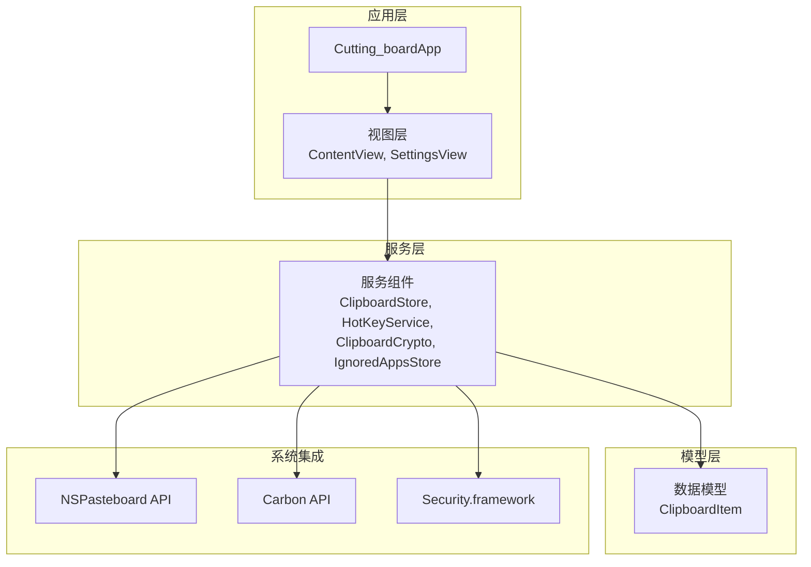
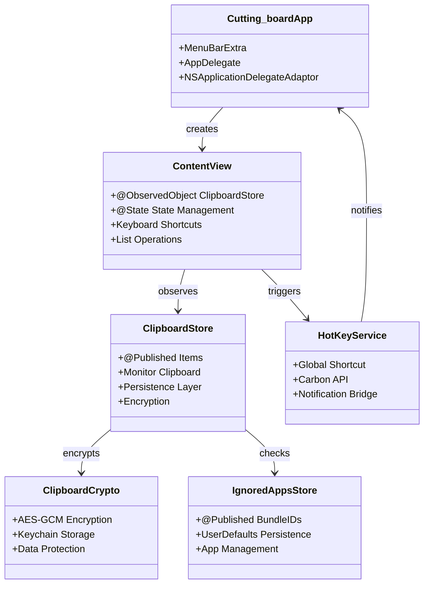
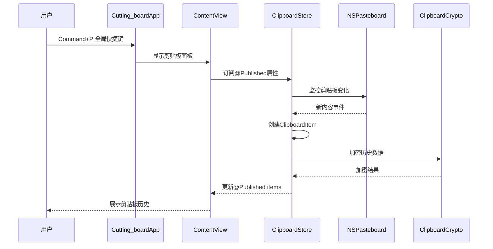
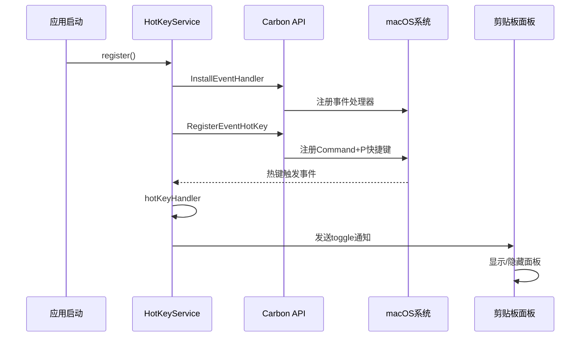
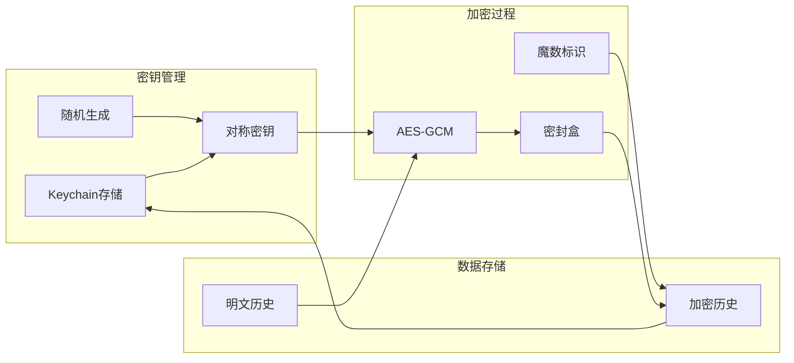
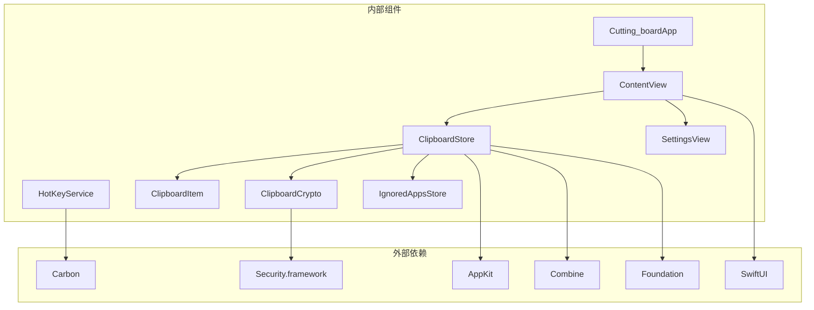

# 技术架构

<cite>
**本文档引用的文件**
- [Cutting_boardApp.swift](file://Cutting_board/Cutting_boardApp.swift)
- [ContentView.swift](file://Cutting_board/ContentView.swift)
- [SettingsView.swift](file://Cutting_board/SettingsView.swift)
- [ClipboardItem.swift](file://Cutting_board/Models/ClipboardItem.swift)
- [ClipboardStore.swift](file://Cutting_board/Services/ClipboardStore.swift)
- [HotKeyService.swift](file://Cutting_board/Services/HotKeyService.swift)
- [ClipboardCrypto.swift](file://Cutting_board/Services/ClipboardCrypto.swift)
- [IgnoredAppsStore.swift](file://Cutting_board/Services/IgnoredAppsStore.swift)
</cite>

## 目录
1. [引言](#引言)
2. [项目结构](#项目结构)
3. [核心组件](#核心组件)
4. [架构概览](#架构概览)
5. [详细组件分析](#详细组件分析)
6. [依赖关系分析](#依赖关系分析)
7. [性能考虑](#性能考虑)
8. [故障排除指南](#故障排除指南)
9. [结论](#结论)

## 引言

Cutting_board是一个基于SwiftUI开发的Mac剪贴板历史管理应用，采用MVVM架构模式，实现了完整的剪贴板监控、历史存储、加密保护和用户界面管理功能。该应用通过NSPasteboard API监控系统剪贴板变化，使用Carbon API实现全局快捷键，通过Security.framework进行数据加密，并采用Combine框架实现响应式数据绑定。

## 项目结构

项目采用清晰的分层架构，按照功能模块组织代码：



**图表来源**
- [Cutting_boardApp.swift](file://Cutting_board/Cutting_boardApp.swift#L11-L31)
- [ContentView.swift](file://Cutting_board/ContentView.swift#L20-L305)
- [ClipboardStore.swift](file://Cutting_board/Services/ClipboardStore.swift#L14-L223)

**章节来源**
- [Cutting_boardApp.swift](file://Cutting_board/Cutting_boardApp.swift#L1-L144)
- [ContentView.swift](file://Cutting_board/ContentView.swift#L1-L500)
- [SettingsView.swift](file://Cutting_board/SettingsView.swift#L1-L95)

## 核心组件

### MVVM架构实现

应用严格遵循MVVM模式，实现了清晰的职责分离：

- **Model层**: `ClipboardItem` - 数据模型，定义剪贴板历史条目的结构和行为
- **View层**: `ContentView` 和 `SettingsView` - 视图组件，负责用户界面展示和用户交互
- **ViewModel层**: `ClipboardStore` - 业务逻辑处理，管理数据状态和业务规则
- **Service层**: 各种服务组件，提供特定功能支持

### 组件职责分离



**图表来源**
- [Cutting_boardApp.swift](file://Cutting_board/Cutting_boardApp.swift#L35-L143)
- [ContentView.swift](file://Cutting_board/ContentView.swift#L20-L305)
- [ClipboardStore.swift](file://Cutting_board/Services/ClipboardStore.swift#L14-L223)
- [HotKeyService.swift](file://Cutting_board/Services/HotKeyService.swift#L30-L81)
- [ClipboardCrypto.swift](file://Cutting_board/Services/ClipboardCrypto.swift#L16-L72)
- [IgnoredAppsStore.swift](file://Cutting_board/Services/IgnoredAppsStore.swift#L16-L40)

**章节来源**
- [ClipboardItem.swift](file://Cutting_board/Models/ClipboardItem.swift#L16-L89)
- [ClipboardStore.swift](file://Cutting_board/Services/ClipboardStore.swift#L14-L223)

## 架构概览

应用的整体架构采用事件驱动的设计模式，通过通知中心实现组件间的松耦合通信：



**图表来源**
- [HotKeyService.swift](file://Cutting_board/Services/HotKeyService.swift#L22-L27)
- [Cutting_boardApp.swift](file://Cutting_board/Cutting_boardApp.swift#L46-L66)
- [ClipboardStore.swift](file://Cutting_board/Services/ClipboardStore.swift#L47-L90)

## 详细组件分析

### ClipboardStore - 核心数据管理服务

`ClipboardStore`是应用的核心服务组件，实现了完整的剪贴板历史管理和持久化功能：

#### 数据流和状态管理

```mermaid
flowchart TD
Start([应用启动]) --> Init[初始化存储路径]
Init --> Load[加载历史数据]
Load --> Monitor[开始监控剪贴板]
Monitor --> Change{检测到变化?}
Change --> |否| Monitor
Change --> |是| Capture[captureCurrentContent]
Capture --> Type{内容类型?}
Type --> |图片| ImageProcess[处理图片内容]
Type --> |文本| TextProcess[处理文本内容]
ImageProcess --> AddItem[addItem]
TextProcess --> AddItem
AddItem --> Trim[trimIfNeeded]
Trim --> Save[saveToDisk]
Save --> Publish[@Published通知]
Publish --> Monitor
```

**图表来源**
- [ClipboardStore.swift](file://Cutting_board/Services/ClipboardStore.swift#L31-L90)
- [ClipboardStore.swift](file://Cutting_board/Services/ClipboardStore.swift#L110-L147)

#### 关键特性

- **实时监控**: 使用定时器每500毫秒检查一次剪贴板变化
- **智能去重**: 避免重复内容进入历史记录
- **钉住功能**: 支持重要条目置顶，防止被清理
- **内存优化**: 限制最大历史数量，默认200条
- **异步处理**: 所有磁盘操作都在后台队列执行

**章节来源**
- [ClipboardStore.swift](file://Cutting_board/Services/ClipboardStore.swift#L14-L223)

### HotKeyService - 全局快捷键服务

`HotKeyService`使用Carbon API实现全局快捷键功能，无需辅助功能权限即可工作：

#### 快捷键注册流程



**图表来源**
- [HotKeyService.swift](file://Cutting_board/Services/HotKeyService.swift#L36-L69)
- [HotKeyService.swift](file://Cutting_board/Services/HotKeyService.swift#L22-L27)

#### 技术实现要点

- **Carbon API**: 直接调用macOS底层事件系统
- **无权限要求**: 通过事件处理器注册，无需辅助功能权限
- **线程安全**: 回调函数在主线程异步执行
- **资源管理**: 正确的注册和注销机制

**章节来源**
- [HotKeyService.swift](file://Cutting_board/Services/HotKeyService.swift#L30-L81)

### ClipboardCrypto - 数据加密服务

`ClipboardCrypto`提供端到端的数据加密保护，确保剪贴板历史的安全性：

#### 加密架构



**图表来源**
- [ClipboardCrypto.swift](file://Cutting_board/Services/ClipboardCrypto.swift#L21-L46)
- [ClipboardCrypto.swift](file://Cutting_board/Services/ClipboardCrypto.swift#L48-L71)

#### 安全特性

- **密钥生成**: 使用系统随机数生成器创建32字节密钥
- **密钥存储**: 通过Keychain安全存储加密密钥
- **加密算法**: 使用AES-GCM提供机密性和完整性保护
- **向后兼容**: 通过魔数标识区分加密和明文数据
- **错误处理**: 解密失败时回退到明文处理

**章节来源**
- [ClipboardCrypto.swift](file://Cutting_board/Services/ClipboardCrypto.swift#L16-L72)

### IgnoredAppsStore - 应用忽略管理

`IgnoredAppsStore`管理用户配置的应用程序列表，控制哪些应用的剪贴板内容不应被记录：

#### 应用管理流程

```mermaid
flowchart TD
Start([应用启动]) --> Load[加载忽略列表]
Load --> UserAction{用户操作?}
UserAction --> |添加应用| Add[add(bundleID)]
UserAction --> |移除应用| Remove[remove(bundleID)]
UserAction --> |查询应用| Check[contains(bundleID)]
Add --> Persist[保存到UserDefaults]
Remove --> Persist
Check --> Return[返回布尔结果]
Persist --> Load
```

**图表来源**
- [IgnoredAppsStore.swift](file://Cutting_board/Services/IgnoredAppsStore.swift#L27-L39)

**章节来源**
- [IgnoredAppsStore.swift](file://Cutting_board/Services/IgnoredAppsStore.swift#L16-L69)

## 依赖关系分析

### 组件间依赖关系



**图表来源**
- [Cutting_boardApp.swift](file://Cutting_board/Cutting_boardApp.swift#L8-L9)
- [ClipboardStore.swift](file://Cutting_board/Services/ClipboardStore.swift#L8-L11)
- [HotKeyService.swift](file://Cutting_board/Services/HotKeyService.swift#L8-L9)
- [ClipboardCrypto.swift](file://Cutting_board/Services/ClipboardCrypto.swift#L8-L10)

### 系统集成功能

#### NSPasteboard API集成

应用通过NSPasteboard API实现剪贴板监控和内容读取：

- **内容检测**: 使用changeCount属性检测剪贴板变化
- **多格式支持**: 同时支持文本和图片格式
- **前台应用识别**: 通过NSWorkspace获取当前活动应用
- **忽略列表检查**: 避免记录来自指定应用的内容

#### Carbon API集成

HotKeyService使用Carbon API实现全局快捷键：

- **事件处理器**: 安装键盘事件处理器
- **热键注册**: 注册Command+P组合键
- **回调机制**: 实现C可调用的热键处理函数
- **系统集成**: 直接与macOS事件系统交互

#### Security.framework集成

ClipboardCrypto通过Security.framework实现数据加密：

- **Keychain访问**: 使用SecItem API管理加密密钥
- **随机数生成**: 通过SecRandomCopyBytes生成安全随机数
- **加密操作**: 使用AES-GCM算法进行数据加密
- **密钥存储**: 安全地存储和检索加密密钥

**章节来源**
- [ClipboardStore.swift](file://Cutting_board/Services/ClipboardStore.swift#L25-L89)
- [HotKeyService.swift](file://Cutting_board/Services/HotKeyService.swift#L39-L68)
- [ClipboardCrypto.swift](file://Cutting_board/Services/ClipboardCrypto.swift#L48-L71)

## 性能考虑

### 内存管理优化

- **延迟加载**: 图片缩略图仅在需要时生成和缓存
- **智能去重**: 避免重复内容占用内存空间
- **内存限制**: 通过maxItems参数控制历史记录数量
- **弱引用**: 在通知处理中使用weak self避免循环引用

### 线程安全设计

- **主线程更新**: 所有UI更新都在主线程执行
- **后台处理**: 文件读写和加密操作在后台队列执行
- **异步操作**: 使用DispatchQueue和async/await模式
- **队列隔离**: 不同类型的处理使用不同的队列

### I/O性能优化

- **批量操作**: 批量更新历史记录时使用整体赋值
- **增量保存**: 仅在数据变更时触发保存操作
- **磁盘缓存**: 使用专用队列处理磁盘I/O操作
- **压缩存储**: JSON数据使用prettyPrinted格式存储以便调试

### 用户体验优化

- **动画流畅**: 使用Spring动画提供流畅的过渡效果
- **无障碍支持**: 完整的VoiceOver支持和键盘导航
- **响应式设计**: 自适应窗口大小和内容布局
- **性能感知**: 根据用户偏好调整动画复杂度

## 故障排除指南

### 常见问题诊断

#### 剪贴板监控失效

**症状**: 剪贴板内容变化无法被记录

**可能原因**:
- Carbon API注册失败
- 权限不足
- 应用被系统限制

**解决方案**:
- 检查HotKeyService.register()返回状态
- 验证应用具有必要的系统权限
- 重启应用重新注册事件处理器

#### 加密数据损坏

**症状**: 历史数据无法加载或显示异常

**可能原因**:
- Keychain中的密钥丢失
- 加密数据格式损坏
- 解密算法版本不兼容

**解决方案**:
- 检查Keychain中是否存在密钥
- 验证加密数据的魔数标识
- 清除历史数据重新开始

#### 性能问题

**症状**: 应用响应缓慢或内存占用过高

**可能原因**:
- 过多的历史记录
- 图片缩略图缓存过多
- 频繁的磁盘I/O操作

**解决方案**:
- 调整maxItems参数减少历史数量
- 清理不必要的图片历史
- 优化磁盘I/O操作频率

**章节来源**
- [HotKeyService.swift](file://Cutting_board/Services/HotKeyService.swift#L62-L68)
- [ClipboardStore.swift](file://Cutting_board/Services/ClipboardStore.swift#L183-L207)
- [ClipboardCrypto.swift](file://Cutting_board/Services/ClipboardCrypto.swift#L48-L60)

## 结论

Cutting_board展现了现代SwiftUI应用的最佳实践，通过清晰的MVVM架构、完善的系统集成功能和优秀的用户体验设计，实现了功能强大而可靠的剪贴板历史管理工具。

### 架构优势

- **模块化设计**: 清晰的职责分离和组件边界
- **响应式编程**: 基于Combine的现代化状态管理
- **安全性保障**: 端到端的数据加密保护
- **系统深度集成**: 充分利用macOS平台特性
- **性能优化**: 多层次的性能考虑和优化策略

### 技术亮点

- **全局快捷键**: 无需辅助功能权限的Carbon API集成
- **智能监控**: 高效的剪贴板变化检测机制
- **数据保护**: 基于Keychain的安全加密方案
- **用户友好**: 完善的无障碍支持和动画效果
- **扩展性**: 模块化的架构便于功能扩展

该架构为类似系统工具应用提供了优秀的参考模板，展示了如何在保持简洁性的同时实现复杂的功能需求。