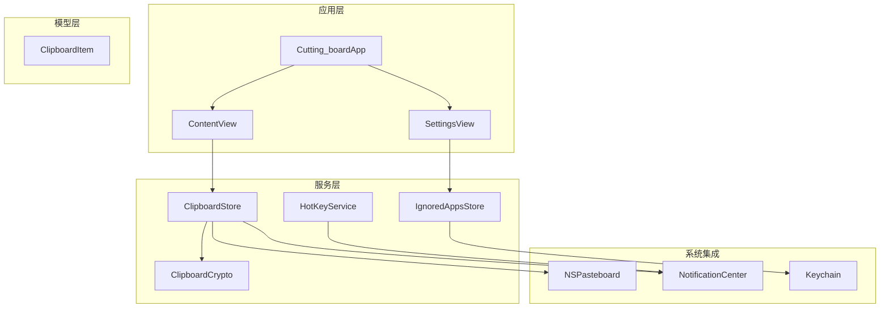
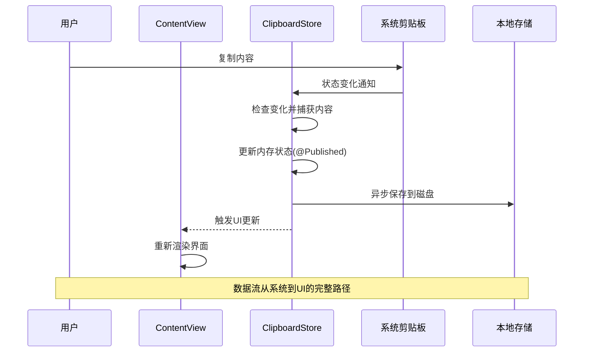
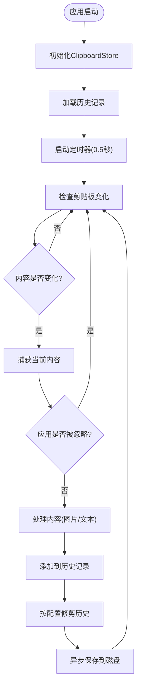
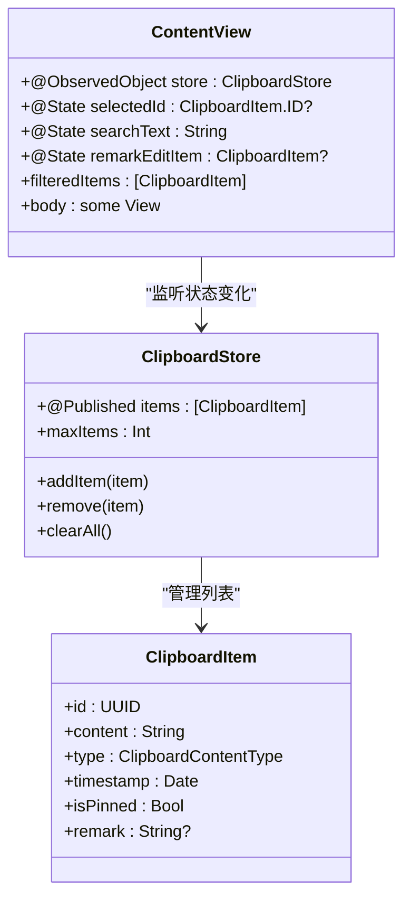
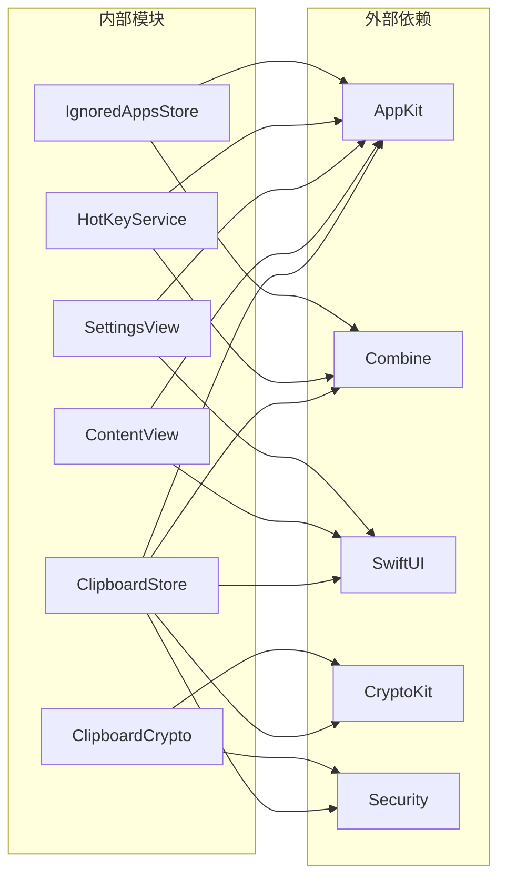

# 数据流与状态管理

<cite>
**本文档引用的文件**
- [ClipboardStore.swift](file://Cutting_board/Services/ClipboardStore.swift)
- [ClipboardItem.swift](file://Cutting_board/Models/ClipboardItem.swift)
- [ContentView.swift](file://Cutting_board/ContentView.swift)
- [Cutting_boardApp.swift](file://Cutting_board/Cutting_boardApp.swift)
- [SettingsView.swift](file://Cutting_board/SettingsView.swift)
- [HotKeyService.swift](file://Cutting_board/Services/HotKeyService.swift)
- [IgnoredAppsStore.swift](file://Cutting_board/Services/IgnoredAppsStore.swift)
- [ClipboardCrypto.swift](file://Cutting_board/Services/ClipboardCrypto.swift)
</cite>

## 目录
1. [简介](#简介)
2. [项目结构](#项目结构)
3. [核心组件](#核心组件)
4. [架构概览](#架构概览)
5. [详细组件分析](#详细组件分析)
6. [依赖关系分析](#依赖关系分析)
7. [性能考虑](#性能考虑)
8. [故障排除指南](#故障排除指南)
9. [结论](#结论)

## 简介

Cutting_board是一个基于SwiftUI的Mac剪贴板历史管理应用，它实现了完整的响应式数据流和状态管理系统。该项目展示了如何在SwiftUI中有效使用@State、@ObservedObject、@Published等属性包装器，以及如何利用Combine框架进行事件处理和数据绑定。

该应用的核心功能包括：
- 实时监控系统剪贴板变化
- 历史记录的持久化存储
- 图片和文本内容的智能识别
- 用户友好的界面交互
- 安全的数据加密存储

## 项目结构

项目采用清晰的分层架构，主要分为以下几个层次：

**图表来源**
- [Cutting_boardApp.swift](file://Cutting_board/Cutting_boardApp.swift#L12-L31)
- [ContentView.swift](file://Cutting_board/ContentView.swift#L20-L305)
- [ClipboardStore.swift](file://Cutting_board/Services/ClipboardStore.swift#L14-L223)

**章节来源**
- [Cutting_boardApp.swift](file://Cutting_board/Cutting_boardApp.swift#L1-L144)
- [ContentView.swift](file://Cutting_board/ContentView.swift#L1-L500)
- [SettingsView.swift](file://Cutting_board/SettingsView.swift#L1-L95)

## 核心组件

### ClipboardStore - 剪贴板状态管理核心

ClipboardStore是整个应用的核心状态管理组件，实现了ObservableObject协议来管理剪贴板历史的状态变化。

#### 主要特性

1. **单例模式设计**：通过静态shared实例确保全局唯一性
2. **实时监控**：使用定时器每0.5秒检查系统剪贴板变化
3. **智能去重**：避免重复内容的存储
4. **持久化存储**：支持历史记录的本地存储和恢复
5. **安全加密**：使用AES-GCM加密保护敏感数据

#### 关键属性包装器使用

- `@Published private(set) var items: [ClipboardItem]`：管理历史记录列表的状态
- `var maxItems: Int`：配置最大历史数量的可观察属性

**章节来源**
- [ClipboardStore.swift](file://Cutting_board/Services/ClipboardStore.swift#L14-L223)

### ClipboardItem - 数据模型

ClipboardItem定义了剪贴板历史记录的数据结构，实现了Codable协议以便于序列化存储。

#### 数据结构特点

- **唯一标识符**：使用UUID确保每条记录的唯一性
- **类型系统**：支持文本和图片两种内容类型
- **时间戳**：记录内容创建的时间
- **用户交互字段**：支持备注和钉住功能
- **预览功能**：提供内容预览和相对时间显示

**章节来源**
- [ClipboardItem.swift](file://Cutting_board/Models/ClipboardItem.swift#L17-L89)

### ContentView - 响应式UI界面

ContentView展示了SwiftUI响应式编程模型的最佳实践，正确使用了多种属性包装器。

#### 属性包装器使用模式

1. **@ObservedObject**：监听ClipboardStore的状态变化
2. **@State**：管理本地UI状态（选中项、搜索文本等）
3. **@Environment**：访问系统环境变量（动画偏好、颜色方案等）

**章节来源**
- [ContentView.swift](file://Cutting_board/ContentView.swift#L20-L305)

## 架构概览

应用采用MVVM（Model-View-ViewModel）架构模式，结合SwiftUI的响应式编程模型：

**图表来源**
- [ClipboardStore.swift](file://Cutting_board/Services/ClipboardStore.swift#L47-L90)
- [ContentView.swift](file://Cutting_board/ContentView.swift#L37-L95)

## 详细组件分析

### ClipboardStore 状态管理机制

#### 实时监控流程

**图表来源**
- [ClipboardStore.swift](file://Cutting_board/Services/ClipboardStore.swift#L31-L60)
- [ClipboardStore.swift](file://Cutting_board/Services/ClipboardStore.swift#L65-L90)

#### 状态更新机制

ClipboardStore使用@Published属性包装器实现自动状态通知：

1. **直接赋值触发**：通过整体替换数组触发@Published
2. **异步操作**：所有磁盘操作都在后台队列执行
3. **主线程更新**：UI更新始终在主线程进行

**章节来源**
- [ClipboardStore.swift](file://Cutting_board/Services/ClipboardStore.swift#L94-L108)
- [ClipboardStore.swift](file://Cutting_board/Services/ClipboardStore.swift#L132-L139)

### ContentView 响应式UI设计

#### 状态管理模式

ContentView正确使用了多种SwiftUI属性包装器：

**图表来源**
- [ContentView.swift](file://Cutting_board/ContentView.swift#L20-L305)
- [ClipboardStore.swift](file://Cutting_board/Services/ClipboardStore.swift#L14-L223)

#### 事件处理机制

ContentView实现了完整的键盘导航和交互：

1. **键盘快捷键**：方向键导航、回车粘贴、ESC关闭
2. **鼠标交互**：点击选择、双击粘贴、右键菜单
3. **触摸板手势**：滚动浏览历史记录

**章节来源**
- [ContentView.swift](file://Cutting_board/ContentView.swift#L61-L95)
- [ContentView.swift](file://Cutting_board/ContentView.swift#L184-L207)

### 数据验证与错误处理

#### 输入验证策略

1. **空内容过滤**：去除空白字符后为空的内容
2. **重复检测**：避免相同内容的重复存储
3. **应用白名单**：支持忽略特定应用程序的内容

#### 错误处理机制

1. **加密降级**：当加密失败时回退到明文存储
2. **网络异常**：磁盘IO异常时保持应用可用性
3. **UI容错**：界面状态在异常情况下保持一致

**章节来源**
- [ClipboardStore.swift](file://Cutting_board/Services/ClipboardStore.swift#L183-L208)
- [ClipboardCrypto.swift](file://Cutting_board/Services/ClipboardCrypto.swift#L38-L46)

## 依赖关系分析

**图表来源**
- [ClipboardStore.swift](file://Cutting_board/Services/ClipboardStore.swift#L8-L11)
- [ContentView.swift](file://Cutting_board/ContentView.swift#L8-L9)
- [HotKeyService.swift](file://Cutting_board/Services/HotKeyService.swift#L8-L10)

**章节来源**
- [HotKeyService.swift](file://Cutting_board/Services/HotKeyService.swift#L1-L82)
- [IgnoredAppsStore.swift](file://Cutting_board/Services/IgnoredAppsStore.swift#L1-L69)

## 性能考虑

### 内存优化策略

1. **延迟加载**：图片缩略图仅在需要时生成
2. **智能缓存**：使用@State缓存计算结果
3. **批量更新**：使用整体数组替换触发@Published

### 磁盘I/O优化

1. **异步写入**：所有磁盘操作在后台队列执行
2. **增量保存**：只保存必要的数据变更
3. **压缩存储**：使用JSON编码减少存储空间

### 网络和系统调用优化

1. **定时器节流**：0.5秒检查间隔平衡响应性和性能
2. **弱引用**：定时器使用弱引用避免循环引用
3. **线程安全**：正确的线程切换确保UI流畅性

**章节来源**
- [ClipboardStore.swift](file://Cutting_board/Services/ClipboardStore.swift#L28-L39)
- [ClipboardStore.swift](file://Cutting_board/Services/ClipboardStore.swift#L210-L221)

## 故障排除指南

### 常见问题及解决方案

#### 剪贴板监控失效

**症状**：复制内容后历史记录不更新
**原因**：定时器未启动或被销毁
**解决**：检查deinit方法和timer生命周期管理

#### 界面不刷新

**症状**：历史记录更新但UI不变
**原因**：@Published属性未正确触发
**解决**：确保使用整体数组替换而非索引修改

#### 数据丢失

**症状**：重启后历史记录消失
**原因**：磁盘写入失败或加密错误
**解决**：检查文件权限和Keychain访问

#### 性能问题

**症状**：界面卡顿或内存占用过高
**原因**：大量图片处理或频繁重绘
**解决**：优化图片缩略图生成和使用LazyVStack

**章节来源**
- [ClipboardStore.swift](file://Cutting_board/Services/ClipboardStore.swift#L41-L43)
- [ClipboardStore.swift](file://Cutting_board/Services/ClipboardStore.swift#L210-L221)

## 结论

Cutting_board项目展示了SwiftUI响应式编程模型的优秀实践，特别是在复杂状态管理和数据流控制方面的最佳实践。通过合理使用@State、@ObservedObject、@Published等属性包装器，以及结合Combine框架的事件处理机制，实现了高效、可靠的剪贴板历史管理应用。

### 主要成就

1. **完整的响应式架构**：从系统剪贴板到UI界面的全链路响应式数据流
2. **优秀的状态管理**：单例模式配合ObservableObject实现全局状态共享
3. **完善的错误处理**：多层次的容错机制确保应用稳定性
4. **性能优化**：异步处理、缓存策略和内存优化的综合运用

### 技术亮点

- **实时监控**：高效的剪贴板变化检测机制
- **智能存储**：图片和文本的差异化处理策略
- **安全设计**：端到端的数据加密保护
- **用户体验**：流畅的动画效果和无障碍支持

这个项目为SwiftUI应用开发提供了宝贵的参考案例，特别是在处理系统级事件和复杂数据流方面具有重要的学习价值。