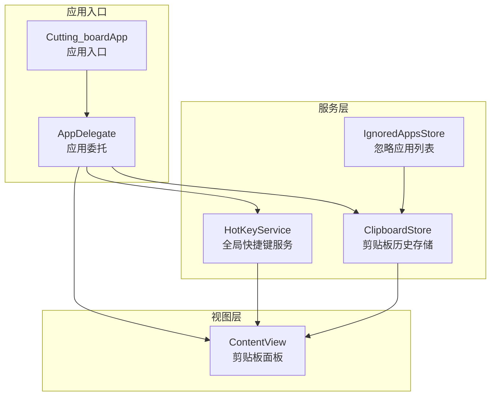
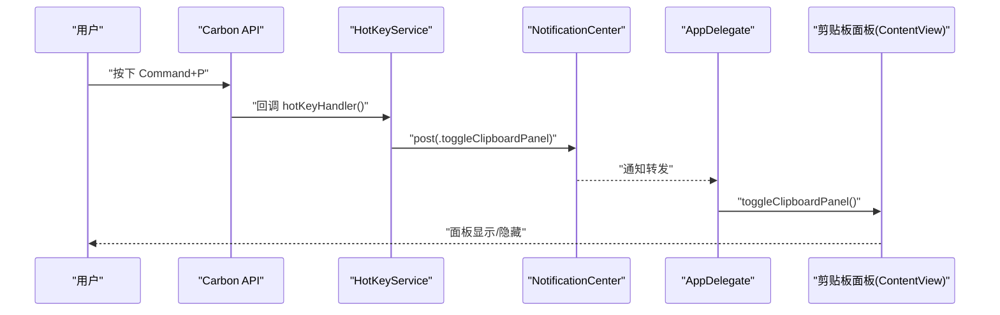
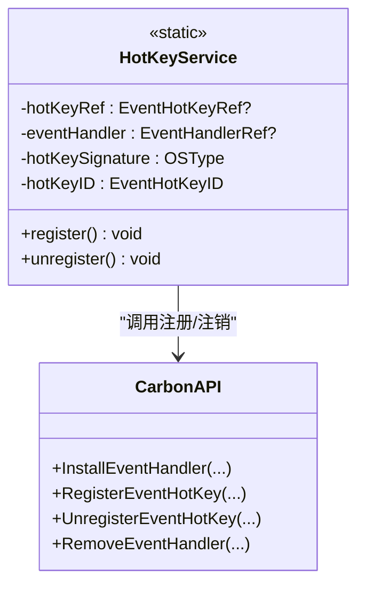
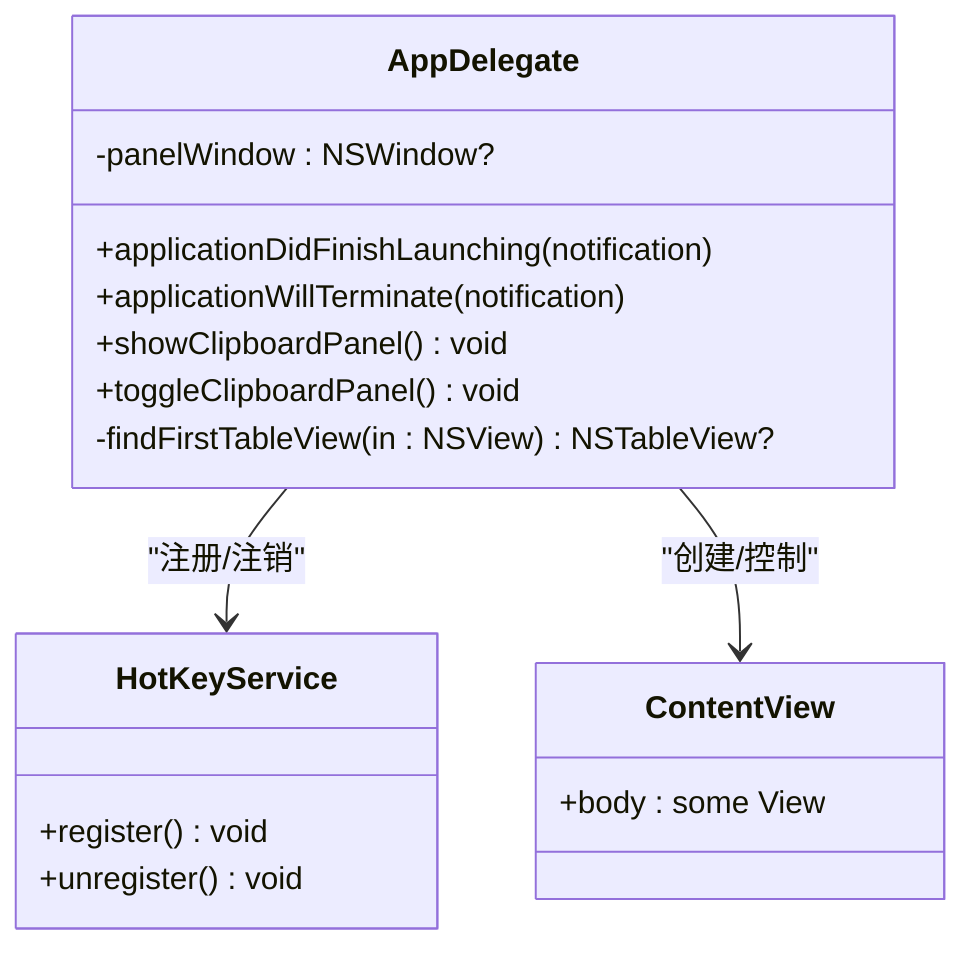
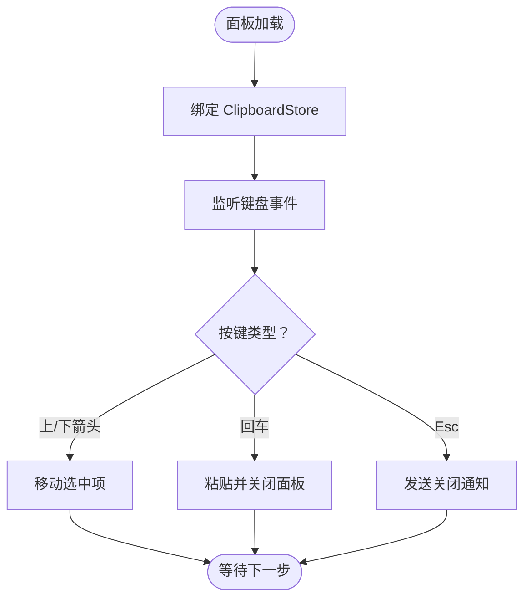
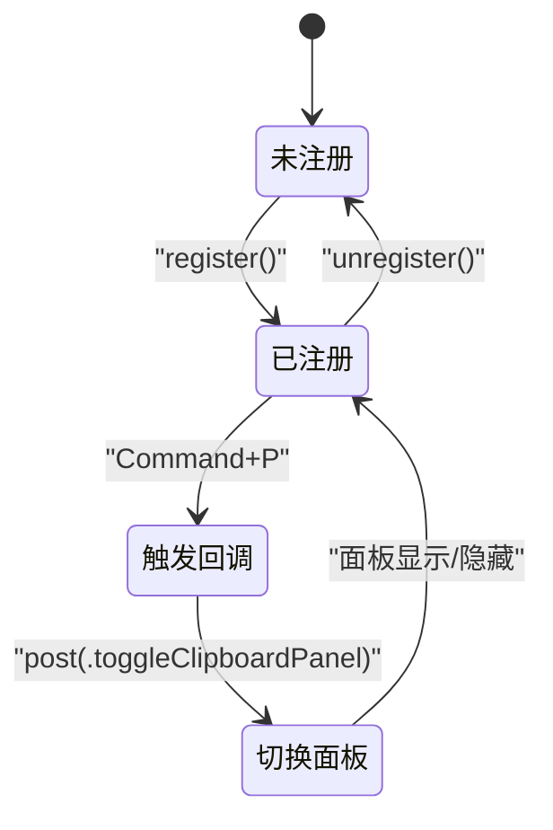
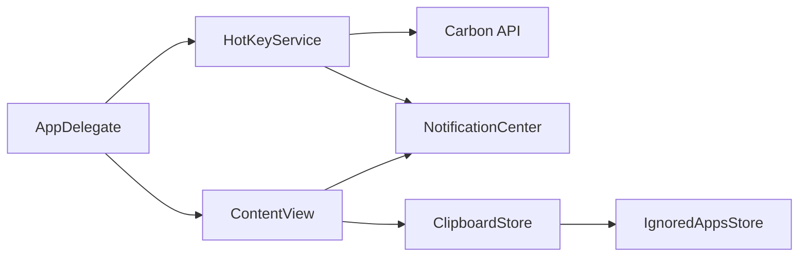

# 全局快捷键服务

<cite>
**本文引用的文件**
- [HotKeyService.swift](file://Cutting_board/Services/HotKeyService.swift)
- [Cutting_boardApp.swift](file://Cutting_board/Cutting_boardApp.swift)
- [ContentView.swift](file://Cutting_board/ContentView.swift)
- [ClipboardStore.swift](file://Cutting_board/Services/ClipboardStore.swift)
- [IgnoredAppsStore.swift](file://Cutting_board/Services/IgnoredAppsStore.swift)
- [ClipboardItem.swift](file://Cutting_board/Models/ClipboardItem.swift)
</cite>

## 目录
1. [简介](#简介)
2. [项目结构](#项目结构)
3. [核心组件](#核心组件)
4. [架构总览](#架构总览)
5. [详细组件分析](#详细组件分析)
6. [依赖关系分析](#依赖关系分析)
7. [性能考量](#性能考量)
8. [故障排查指南](#故障排查指南)
9. [结论](#结论)
10. [附录](#附录)

## 简介
本文件围绕全局快捷键服务 HotKeyService 进行系统性说明，重点涵盖：
- Carbon API 的集成方式：快捷键注册、事件监听与回调处理
- 快捷键组合定义与管理：ModifierFlags 的使用与键码映射
- 快捷键事件生命周期：从注册到触发再到响应的完整流程
- 与 AppDelegate 的协作关系与事件传递机制
- 冲突检测与错误处理策略
- 实际使用示例与调试技巧

## 项目结构
该项目采用基于功能模块的组织方式，HotKeyService 位于 Services 目录，与应用入口、视图层、存储层协同工作。

图表来源
- [Cutting_boardApp.swift](file://Cutting_board/Cutting_boardApp.swift#L11-L31)
- [Cutting_boardApp.swift](file://Cutting_board/Cutting_boardApp.swift#L35-L143)
- [HotKeyService.swift](file://Cutting_board/Services/HotKeyService.swift#L30-L81)
- [ContentView.swift](file://Cutting_board/ContentView.swift#L20-L95)
- [ClipboardStore.swift](file://Cutting_board/Services/ClipboardStore.swift#L14-L39)
- [IgnoredAppsStore.swift](file://Cutting_board/Services/IgnoredAppsStore.swift#L16-L40)

章节来源
- [Cutting_boardApp.swift](file://Cutting_board/Cutting_boardApp.swift#L11-L31)
- [HotKeyService.swift](file://Cutting_board/Services/HotKeyService.swift#L30-L81)

## 核心组件
- HotKeyService：封装 Carbon API 的全局快捷键注册与回调处理，当前实现为 Command+P 触发切换剪贴板面板。
- AppDelegate：负责应用生命周期管理、面板窗口创建、快捷键注册与通知观察者注册。
- ContentView：剪贴板面板视图，负责展示历史、交互与键盘事件处理，并通过通知关闭面板。
- ClipboardStore：剪贴板内容监控、历史记录持久化与操作。
- IgnoredAppsStore：维护忽略的应用程序列表，避免从特定应用复制的内容进入历史。
- ClipboardItem：剪贴板历史条目的数据模型。

章节来源
- [HotKeyService.swift](file://Cutting_board/Services/HotKeyService.swift#L30-L81)
- [Cutting_boardApp.swift](file://Cutting_board/Cutting_boardApp.swift#L35-L143)
- [ContentView.swift](file://Cutting_board/ContentView.swift#L20-L95)
- [ClipboardStore.swift](file://Cutting_board/Services/ClipboardStore.swift#L14-L39)
- [IgnoredAppsStore.swift](file://Cutting_board/Services/IgnoredAppsStore.swift#L16-L40)
- [ClipboardItem.swift](file://Cutting_board/Models/ClipboardItem.swift#L10-L89)

## 架构总览
全局快捷键服务通过 Carbon API 在系统层面注册热键，回调通过通知中心分发给 AppDelegate，再由 AppDelegate 控制剪贴板面板的显示/隐藏。

图表来源
- [HotKeyService.swift](file://Cutting_board/Services/HotKeyService.swift#L22-L27)
- [HotKeyService.swift](file://Cutting_board/Services/HotKeyService.swift#L36-L69)
- [Cutting_boardApp.swift](file://Cutting_board/Cutting_boardApp.swift#L46-L72)
- [Cutting_boardApp.swift](file://Cutting_board/Cutting_boardApp.swift#L135-L142)
- [ContentView.swift](file://Cutting_board/ContentView.swift#L294-L296)

## 详细组件分析

### HotKeyService 组件分析
- 快捷键注册
  - 使用 Carbon 的事件处理器安装与热键注册接口，将 Command+P 映射为全局热键。
  - 注册成功后，系统键盘事件触发时回调至 C 函数，再通过通知中心派发。
- 回调处理
  - 回调函数为 C 可调用，不捕获上下文，确保与 Carbon API 的兼容性。
  - 在主线程异步发布通知，保证 UI 更新安全。
- 注销与资源清理
  - 提供注销方法，移除事件处理器与热键引用，防止内存泄漏与重复注册。

图表来源
- [HotKeyService.swift](file://Cutting_board/Services/HotKeyService.swift#L30-L81)

章节来源
- [HotKeyService.swift](file://Cutting_board/Services/HotKeyService.swift#L36-L69)
- [HotKeyService.swift](file://Cutting_board/Services/HotKeyService.swift#L71-L80)

### AppDelegate 组件分析
- 生命周期与面板初始化
  - 应用启动完成后创建剪贴板面板窗口（非 SwiftUI WindowGroup 场景）。
  - 注册全局快捷键与通知观察者，监听显示、关闭与切换面板的通知。
- 面板控制
  - 提供显示、隐藏与切换面板的方法；切换逻辑根据面板可见状态决定行为。
  - 通过递归查找列表视图，将键盘焦点转移至可交互区域，提升可访问性。
- 资源清理
  - 应用终止时注销快捷键并移除通知观察者。

图表来源
- [Cutting_boardApp.swift](file://Cutting_board/Cutting_boardApp.swift#L35-L143)

章节来源
- [Cutting_boardApp.swift](file://Cutting_board/Cutting_boardApp.swift#L46-L72)
- [Cutting_boardApp.swift](file://Cutting_board/Cutting_boardApp.swift#L100-L142)

### ContentView 组件分析
- 面板交互
  - 监听键盘事件（上下箭头、回车、Esc 等），实现列表导航与粘贴、关闭面板。
  - 通过通知中心发送关闭面板的通知，使 AppDelegate 执行隐藏逻辑。
- 数据绑定与状态
  - 订阅 ClipboardStore 的历史数据，支持搜索、排序与选择高亮。
  - 支持备注编辑、清空历史、设置入口等操作。

图表来源
- [ContentView.swift](file://Cutting_board/ContentView.swift#L69-L87)
- [ContentView.swift](file://Cutting_board/ContentView.swift#L294-L296)

章节来源
- [ContentView.swift](file://Cutting_board/ContentView.swift#L29-L95)
- [ContentView.swift](file://Cutting_board/ContentView.swift#L294-L296)

### 快捷键组合定义与管理
- 当前实现
  - 快捷键：Command+P
  - 键码：字母 P 的虚拟键码常量
  - ModifierFlags：使用 Carbon 的 cmdKey 常量
- 可扩展性
  - 若需支持多组合，可在注册处增加多个热键注册与对应的事件处理。
  - 建议将组合参数抽取为配置，便于集中管理与冲突检测。

章节来源
- [HotKeyService.swift](file://Cutting_board/Services/HotKeyService.swift#L18-L19)
- [HotKeyService.swift](file://Cutting_board/Services/HotKeyService.swift#L53-L60)

### 快捷键事件生命周期
- 注册阶段
  - 安装键盘事件处理器，注册热键，建立签名与 ID。
- 触发阶段
  - 系统捕获 Command+P，回调至 C 函数，发布切换通知。
- 响应阶段
  - AppDelegate 接收通知，调用切换面板方法，激活应用并显示/隐藏面板。
- 注销阶段
  - 应用终止或显式注销时，移除处理器与热键，释放资源。

图表来源
- [HotKeyService.swift](file://Cutting_board/Services/HotKeyService.swift#L36-L69)
- [Cutting_boardApp.swift](file://Cutting_board/Cutting_boardApp.swift#L135-L142)

章节来源
- [HotKeyService.swift](file://Cutting_board/Services/HotKeyService.swift#L36-L69)
- [Cutting_boardApp.swift](file://Cutting_board/Cutting_boardApp.swift#L135-L142)

### 与 AppDelegate 的协作关系与事件传递机制
- AppDelegate 在应用启动时创建面板窗口并注册快捷键。
- HotKeyService 通过通知中心向 AppDelegate 发送切换面板指令。
- ContentView 作为面板主体，接收用户交互并通过通知关闭面板。
- 三者通过通知中心解耦，职责清晰，便于扩展与测试。

章节来源
- [Cutting_boardApp.swift](file://Cutting_board/Cutting_boardApp.swift#L46-L72)
- [HotKeyService.swift](file://Cutting_board/Services/HotKeyService.swift#L22-L27)
- [ContentView.swift](file://Cutting_board/ContentView.swift#L294-L296)

## 依赖关系分析
- HotKeyService 依赖 Carbon API 与 AppKit 的事件系统，不直接依赖业务层。
- AppDelegate 依赖 HotKeyService、通知中心与面板视图，承担协调职责。
- ContentView 依赖 ClipboardStore 与通知中心，负责用户交互与面板控制。
- ClipboardStore 依赖 NSPasteboard、UserDefaults 与加密模块，负责数据持久化与监控。
- IgnoredAppsStore 依赖 UserDefaults 与 NSWorkspace，负责忽略应用列表管理。

图表来源
- [HotKeyService.swift](file://Cutting_board/Services/HotKeyService.swift#L8-L10)
- [Cutting_boardApp.swift](file://Cutting_board/Cutting_boardApp.swift#L35-L143)
- [ContentView.swift](file://Cutting_board/ContentView.swift#L20-L95)
- [ClipboardStore.swift](file://Cutting_board/Services/ClipboardStore.swift#L14-L39)
- [IgnoredAppsStore.swift](file://Cutting_board/Services/IgnoredAppsStore.swift#L16-L40)

章节来源
- [HotKeyService.swift](file://Cutting_board/Services/HotKeyService.swift#L8-L10)
- [Cutting_boardApp.swift](file://Cutting_board/Cutting_boardApp.swift#L35-L143)
- [ContentView.swift](file://Cutting_board/ContentView.swift#L20-L95)
- [ClipboardStore.swift](file://Cutting_board/Services/ClipboardStore.swift#L14-L39)
- [IgnoredAppsStore.swift](file://Cutting_board/Services/IgnoredAppsStore.swift#L16-L40)

## 性能考量
- 快捷键回调为 C 函数，避免闭包捕获与上下文开销，确保低延迟响应。
- 通知发布在主线程异步进行，避免阻塞事件循环。
- ClipboardStore 使用定时器轮询剪贴板变化，建议根据场景调整轮询间隔，减少不必要的 CPU 占用。
- 面板窗口创建与焦点转移采用延迟调度，避免 UI 卡顿。

## 故障排查指南
- 快捷键无效
  - 检查是否正确调用注册与注销流程，确认返回状态。
  - 确认未与其他应用冲突（例如系统快捷键或浏览器扩展）。
- 面板无法显示
  - 确认 AppDelegate 已创建面板窗口并注册通知观察者。
  - 检查通知名称是否一致，确保回调方法存在。
- 调试技巧
  - 在回调函数中添加日志输出，验证是否触发。
  - 使用系统“辅助功能”偏好设置检查应用权限（尽管当前实现无需辅助功能权限）。
  - 在 AppDelegate 中打印面板状态与焦点信息，定位焦点问题。

章节来源
- [HotKeyService.swift](file://Cutting_board/Services/HotKeyService.swift#L36-L69)
- [Cutting_boardApp.swift](file://Cutting_board/Cutting_boardApp.swift#L46-L72)

## 结论
HotKeyService 通过 Carbon API 实现了无需辅助功能权限的全局快捷键，结合通知中心与 AppDelegate 的协作，提供了稳定的面板控制能力。当前实现聚焦于 Command+P 的切换逻辑，具备良好的扩展性与可维护性。建议后续引入组合配置、冲突检测与更完善的错误处理，以适配更复杂的使用场景。

## 附录
- 实际使用示例
  - 启动应用后，按下 Command+P 即可切换剪贴板面板的显示/隐藏。
  - 在面板内使用上下箭头选择条目，回车粘贴并关闭面板，Esc 关闭面板。
- 快捷键扩展建议
  - 将键码与修饰符抽象为配置项，支持多组合与动态更新。
  - 引入冲突检测：在注册前查询系统或第三方应用占用情况。
  - 增加错误回调与重试机制，提升稳定性。