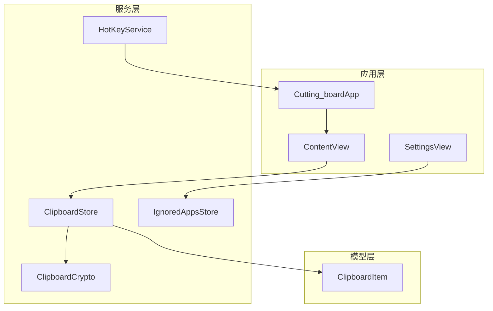
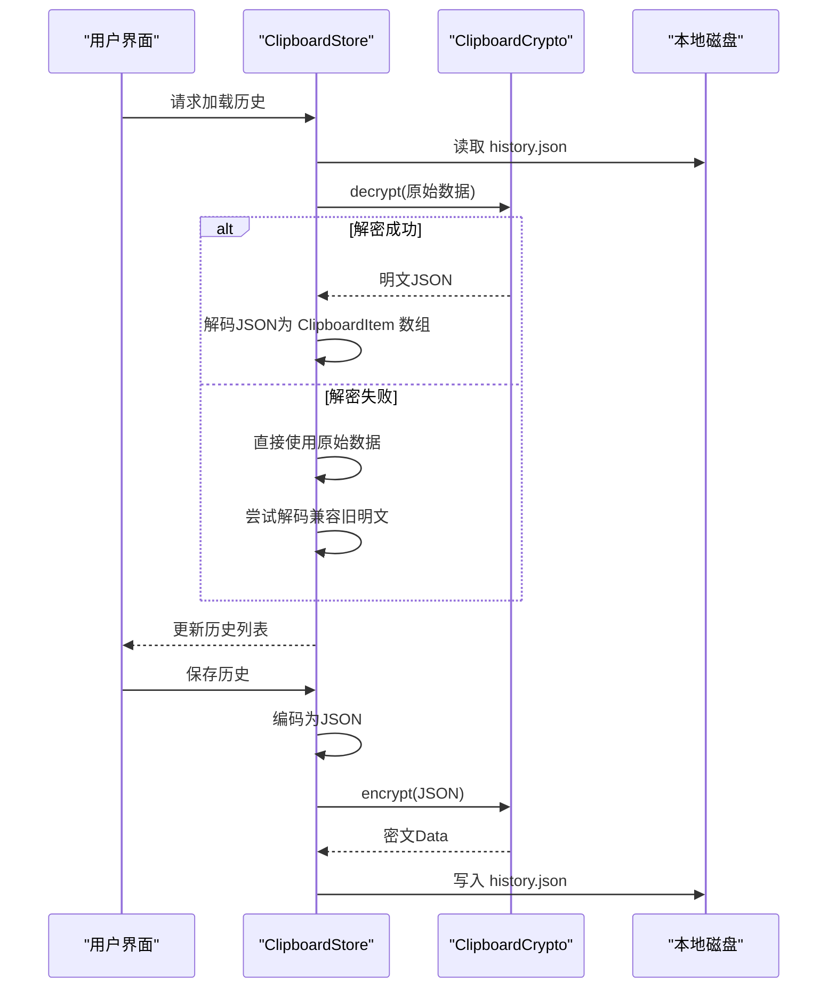
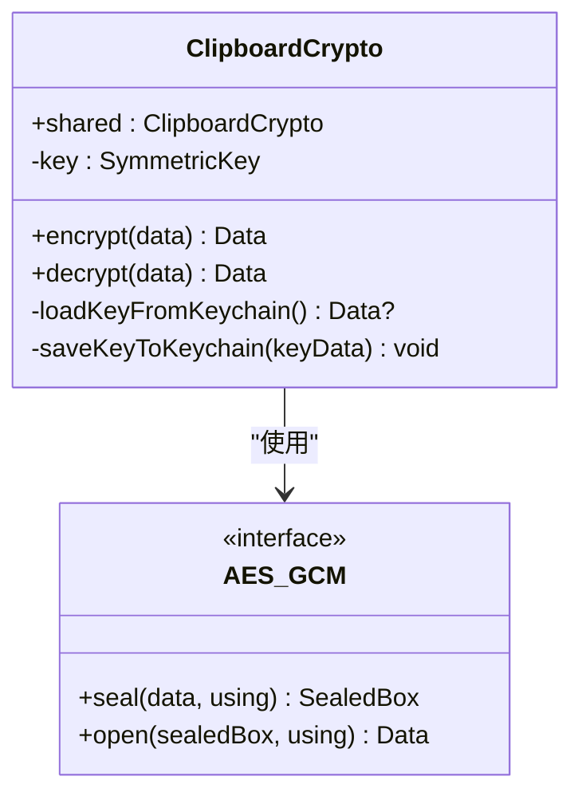
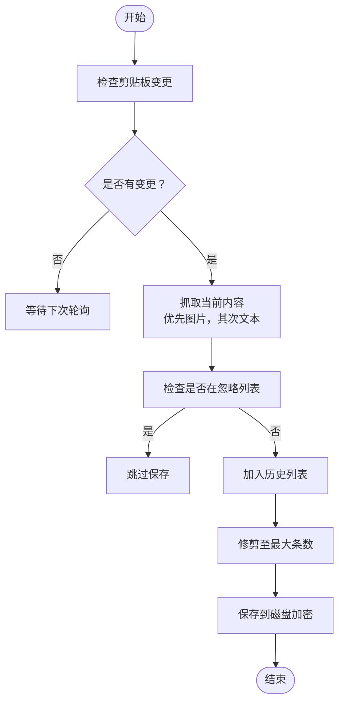
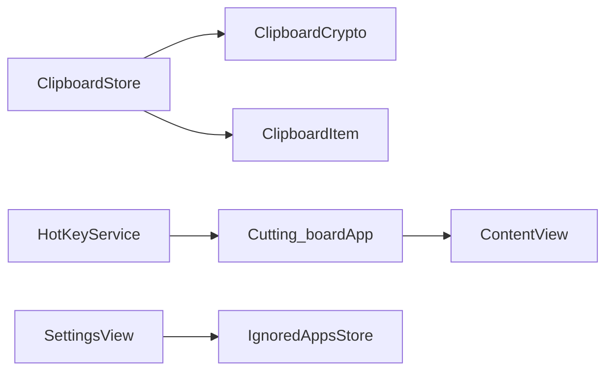

# 剪贴板加密服务

<cite>
**本文引用的文件**
- [ClipboardCrypto.swift](file://Cutting_board/Services/ClipboardCrypto.swift)
- [ClipboardStore.swift](file://Cutting_board/Services/ClipboardStore.swift)
- [ClipboardItem.swift](file://Cutting_board/Models/ClipboardItem.swift)
- [HotKeyService.swift](file://Cutting_board/Services/HotKeyService.swift)
- [SettingsView.swift](file://Cutting_board/SettingsView.swift)
- [IgnoredAppsStore.swift](file://Cutting_board/Services/IgnoredAppsStore.swift)
- [Cutting_boardApp.swift](file://Cutting_board/Cutting_boardApp.swift)
- [ContentView.swift](file://Cutting_board/ContentView.swift)
</cite>

## 目录
1. [简介](#简介)
2. [项目结构](#项目结构)
3. [核心组件](#核心组件)
4. [架构总览](#架构总览)
5. [详细组件分析](#详细组件分析)
6. [依赖关系分析](#依赖关系分析)
7. [性能考量](#性能考量)
8. [故障排除指南](#故障排除指南)
9. [结论](#结论)
10. [附录](#附录)

## 简介
本文件为“剪贴板加密服务”的技术文档，围绕 ClipboardCrypto 剪贴板加密模块展开，重点解析：
- AES-GCM 加密算法的选择原因与实现细节（密钥生成、初始化向量管理、认证标签处理）
- 密钥管理策略（Keychain 集成、密钥派生与存储机制）
- 加密数据格式设计（魔法头标识、版本兼容性与错误恢复）
- 与 ClipboardStore 的协作关系与数据流转
- 性能优化建议与安全最佳实践
- 加密/解密示例与故障排除指南

## 项目结构
该项目采用按职责分层的组织方式：
- Services 层：负责业务与系统交互（加密、存储、热键、设置）
- Models 层：定义数据模型（剪贴板历史项）
- Views 层：UI 视图与交互（主面板、设置页）

图表来源
- [Cutting_boardApp.swift](file://Cutting_board/Cutting_boardApp.swift#L11-L31)
- [ContentView.swift](file://Cutting_board/ContentView.swift#L20-L305)
- [SettingsView.swift](file://Cutting_board/SettingsView.swift#L11-L95)
- [ClipboardCrypto.swift](file://Cutting_board/Services/ClipboardCrypto.swift#L16-L72)
- [ClipboardStore.swift](file://Cutting_board/Services/ClipboardStore.swift#L14-L222)
- [HotKeyService.swift](file://Cutting_board/Services/HotKeyService.swift#L30-L81)
- [IgnoredAppsStore.swift](file://Cutting_board/Services/IgnoredAppsStore.swift#L16-L40)
- [ClipboardItem.swift](file://Cutting_board/Models/ClipboardItem.swift#L17-L89)

章节来源
- [Cutting_boardApp.swift](file://Cutting_board/Cutting_boardApp.swift#L11-L31)
- [ContentView.swift](file://Cutting_board/ContentView.swift#L20-L305)
- [SettingsView.swift](file://Cutting_board/SettingsView.swift#L11-L95)
- [ClipboardCrypto.swift](file://Cutting_board/Services/ClipboardCrypto.swift#L16-L72)
- [ClipboardStore.swift](file://Cutting_board/Services/ClipboardStore.swift#L14-L222)
- [HotKeyService.swift](file://Cutting_board/Services/HotKeyService.swift#L30-L81)
- [IgnoredAppsStore.swift](file://Cutting_board/Services/IgnoredAppsStore.swift#L16-L40)
- [ClipboardItem.swift](file://Cutting_board/Models/ClipboardItem.swift#L17-L89)

## 核心组件
- ClipboardCrypto：提供对剪贴板历史数据的加密与解密，采用 AES-GCM，密钥通过 Keychain 管理。
- ClipboardStore：负责剪贴板监控、历史记录的增删改查、持久化与与加密服务的协作。
- ClipboardItem：剪贴板历史项的数据模型，支持文本与图片两种类型。
- HotKeyService：注册全局快捷键，用于唤起/切换剪贴板面板。
- SettingsView 与 IgnoredAppsStore：设置界面与忽略应用列表，避免从特定应用复制的内容进入历史。

章节来源
- [ClipboardCrypto.swift](file://Cutting_board/Services/ClipboardCrypto.swift#L16-L72)
- [ClipboardStore.swift](file://Cutting_board/Services/ClipboardStore.swift#L14-L222)
- [ClipboardItem.swift](file://Cutting_board/Models/ClipboardItem.swift#L17-L89)
- [HotKeyService.swift](file://Cutting_board/Services/HotKeyService.swift#L30-L81)
- [SettingsView.swift](file://Cutting_board/SettingsView.swift#L11-L95)
- [IgnoredAppsStore.swift](file://Cutting_board/Services/IgnoredAppsStore.swift#L16-L40)

## 架构总览
加密服务与存储服务的协作流程如下：
- ClipboardStore 在加载与保存时，先将内存中的历史列表编码为 JSON，再交由 ClipboardCrypto 进行加密/解密。
- 加载时若磁盘数据无法解密，则回退为直接使用原始数据（兼容旧版明文）。
- 保存时强制加密，确保历史文件始终为密文。

图表来源
- [ClipboardStore.swift](file://Cutting_board/Services/ClipboardStore.swift#L183-L221)
- [ClipboardCrypto.swift](file://Cutting_board/Services/ClipboardCrypto.swift#L32-L46)

章节来源
- [ClipboardStore.swift](file://Cutting_board/Services/ClipboardStore.swift#L183-L221)
- [ClipboardCrypto.swift](file://Cutting_board/Services/ClipboardCrypto.swift#L32-L46)

## 详细组件分析

### ClipboardCrypto 组件分析
- AES-GCM 选择原因
  - 提供机密性与完整性保护（AEAD），适合存储场景；结合认证标签可检测篡改。
  - 与 CryptoKit 的集成度高，API 简洁，易于维护。
- 密钥管理
  - Keychain 服务名与账户名固定，保证跨设备迁移与卸载重装后的密钥一致性。
  - 密钥长度为 32 字节（256 位），满足 AES-256 安全强度。
  - 若 Keychain 中不存在密钥，随机生成新密钥并写入 Keychain；若存在则直接复用。
- 初始化向量与认证标签
  - AES.GCM.seal 返回的 SealedBox 包含组合数据（包含 nonce/iv 与认证标签），通过 combined 字段统一传输。
  - 解密时使用同一密钥与 SealedBox 进行 open，CryptoKit 自动验证认证标签。
- 数据格式设计
  - 加密输出格式：魔法头（3 字节） + combined（nonce/iv + 密文 + 认证标签）。
  - 魔法头用于识别是否为加密数据，兼容旧版明文历史。
  - 解密时若无魔法头或长度不足，直接返回原数据，实现向前兼容。

图表来源
- [ClipboardCrypto.swift](file://Cutting_board/Services/ClipboardCrypto.swift#L16-L72)

章节来源
- [ClipboardCrypto.swift](file://Cutting_board/Services/ClipboardCrypto.swift#L16-L72)

### ClipboardStore 组件分析
- 剪贴板监控
  - 使用定时器周期性检查 NSPasteboard.changeCount，检测到变化后抓取当前内容。
  - 优先尝试图片（PNG），其次为纯文本；去除空白后才保存。
- 历史管理
  - 支持钉住（置顶）、备注、排序、修剪（按最大条数与钉住项数量）。
  - 写回系统剪贴板时根据类型分别处理文本与图片。
- 与 ClipboardCrypto 的协作
  - 加载：先读取磁盘数据，尝试 decrypt；若失败则回退为原始数据。
  - 保存：先 encode JSON，再 encrypt，最后写入磁盘。
- 线程与并发
  - 使用专用队列进行磁盘读写，避免阻塞主线程；更新 UI 通过主线程异步刷新。

图表来源
- [ClipboardStore.swift](file://Cutting_board/Services/ClipboardStore.swift#L47-L90)
- [ClipboardStore.swift](file://Cutting_board/Services/ClipboardStore.swift#L110-L115)
- [ClipboardStore.swift](file://Cutting_board/Services/ClipboardStore.swift#L210-L221)

章节来源
- [ClipboardStore.swift](file://Cutting_board/Services/ClipboardStore.swift#L47-L90)
- [ClipboardStore.swift](file://Cutting_board/Services/ClipboardStore.swift#L110-L115)
- [ClipboardStore.swift](file://Cutting_board/Services/ClipboardStore.swift#L183-L221)

### ClipboardItem 数据模型
- 字段说明
  - id、content、type、timestamp：基础字段
  - imageDataBase64：仅图片类型使用，Base64 存储
  - isPinned：钉住标记，置顶且不被修剪
  - remark：用户备注，支持搜索
- 编解码策略
  - 使用 ISO8601 日期格式；JSON 编码时按字典序键排序，便于一致性校验与调试。

章节来源
- [ClipboardItem.swift](file://Cutting_board/Models/ClipboardItem.swift#L17-L89)

### HotKeyService 与设置页面
- HotKeyService
  - 使用 Carbon API 注册全局快捷键（Command+P），无需辅助功能权限。
  - 通过通知中心广播显示/隐藏/切换面板事件。
- SettingsView 与 IgnoredAppsStore
  - 设置页展示忽略的应用列表，支持添加/移除。
  - IgnoredAppsStore 通过 UserDefaults 持久化忽略列表，并提供包含判断。

章节来源
- [HotKeyService.swift](file://Cutting_board/Services/HotKeyService.swift#L30-L81)
- [SettingsView.swift](file://Cutting_board/SettingsView.swift#L11-L95)
- [IgnoredAppsStore.swift](file://Cutting_board/Services/IgnoredAppsStore.swift#L16-L40)

## 依赖关系分析
- 组件耦合
  - ClipboardStore 依赖 ClipboardCrypto 进行加解密；依赖 ClipboardItem 作为数据载体。
  - HotKeyService 与 Cutting_boardApp 协作，通过通知控制面板显示。
  - SettingsView 与 IgnoredAppsStore 协作，维护忽略应用列表。
- 外部依赖
  - CryptoKit：提供 AES-GCM 加密能力
  - Security：Keychain 读写
  - AppKit：剪贴板访问、全局快捷键、窗口管理
  - SwiftUI：UI 呈现与交互

图表来源
- [ClipboardStore.swift](file://Cutting_board/Services/ClipboardStore.swift#L14-L222)
- [ClipboardCrypto.swift](file://Cutting_board/Services/ClipboardCrypto.swift#L16-L72)
- [HotKeyService.swift](file://Cutting_board/Services/HotKeyService.swift#L30-L81)
- [Cutting_boardApp.swift](file://Cutting_board/Cutting_boardApp.swift#L35-L143)
- [SettingsView.swift](file://Cutting_board/SettingsView.swift#L11-L95)
- [IgnoredAppsStore.swift](file://Cutting_board/Services/IgnoredAppsStore.swift#L16-L40)
- [ContentView.swift](file://Cutting_board/ContentView.swift#L20-L305)

章节来源
- [ClipboardStore.swift](file://Cutting_board/Services/ClipboardStore.swift#L14-L222)
- [ClipboardCrypto.swift](file://Cutting_board/Services/ClipboardCrypto.swift#L16-L72)
- [HotKeyService.swift](file://Cutting_board/Services/HotKeyService.swift#L30-L81)
- [Cutting_boardApp.swift](file://Cutting_board/Cutting_boardApp.swift#L35-L143)
- [SettingsView.swift](file://Cutting_board/SettingsView.swift#L11-L95)
- [IgnoredAppsStore.swift](file://Cutting_board/Services/IgnoredAppsStore.swift#L16-L40)
- [ContentView.swift](file://Cutting_board/ContentView.swift#L20-L305)

## 性能考量
- 加密开销
  - AES-GCM 为常数级复杂度，对小到中等规模 JSON 历史文件影响有限；建议在后台队列执行加密/解密。
- I/O 优化
  - 使用专用队列进行磁盘读写，避免阻塞主线程；批量更新时减少多次写盘。
- UI 响应
  - 所有 UI 更新均在主线程异步执行；列表渲染使用 LazyVStack，提升滚动性能。
- 建议
  - 对频繁保存的场景，可考虑合并写盘频率（如去抖动）。
  - 对超大图片历史，可考虑压缩或延迟加载缩略图，降低内存占用。

[本节为通用性能建议，不直接分析具体文件]

## 故障排除指南
- 无法解密历史文件
  - 现象：加载历史时报错或显示为空。
  - 排查：确认 Keychain 中是否存在 32 字节密钥；若密钥丢失，将导致解密失败。
  - 处理：重新安装应用或手动修复 Keychain 条目；若仍失败，可临时禁用加密（不推荐）。
- 历史文件为明文
  - 现象：首次加载或旧版本明文历史。
  - 说明：未带魔法头的数据会被视为明文；保存时会强制加密。
  - 处理：保存一次即可生成加密文件；若需迁移，可手动备份并重新保存。
- 快捷键无效
  - 现象：Command+P 无法唤起面板。
  - 排查：确认 Carbon 注册是否成功；检查系统权限。
  - 处理：重启应用或重新注册；必要时检查系统偏好设置。
- 图片历史无法显示
  - 现象：图片历史项显示异常或无缩略图。
  - 排查：检查 Base64 数据是否有效；确认图片类型转换是否成功。
  - 处理：重新复制图片；检查图片格式与大小限制。

章节来源
- [ClipboardStore.swift](file://Cutting_board/Services/ClipboardStore.swift#L183-L221)
- [ClipboardCrypto.swift](file://Cutting_board/Services/ClipboardCrypto.swift#L39-L46)
- [HotKeyService.swift](file://Cutting_board/Services/HotKeyService.swift#L36-L69)

## 结论
ClipboardCrypto 通过 AES-GCM 实现了对剪贴板历史的安全存储，配合 Keychain 的密钥管理与磁盘加密文件格式，提供了良好的安全性与兼容性。ClipboardStore 将加密逻辑无缝集成到历史管理流程中，实现了“透明加密”。整体架构清晰、职责明确，具备良好的扩展性与可维护性。

[本节为总结性内容，不直接分析具体文件]

## 附录

### 加密/解密流程示例（步骤说明）
- 加密流程
  - 步骤1：将历史列表编码为 JSON（ISO8601 日期，键排序）。
  - 步骤2：调用加密函数，返回“魔法头 + combined”格式。
  - 步骤3：写入磁盘文件。
- 解密流程
  - 步骤1：读取磁盘文件。
  - 步骤2：若带魔法头则解密，否则视为明文。
  - 步骤3：解码 JSON 为历史列表并更新 UI。

章节来源
- [ClipboardStore.swift](file://Cutting_board/Services/ClipboardStore.swift#L183-L221)
- [ClipboardCrypto.swift](file://Cutting_board/Services/ClipboardCrypto.swift#L32-L46)