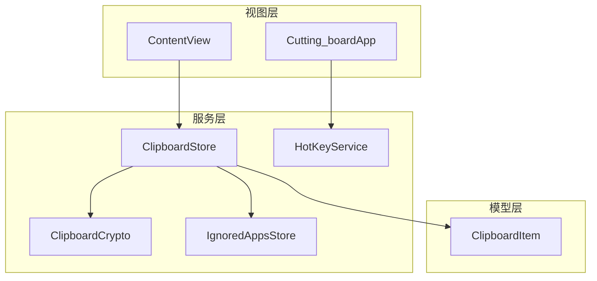
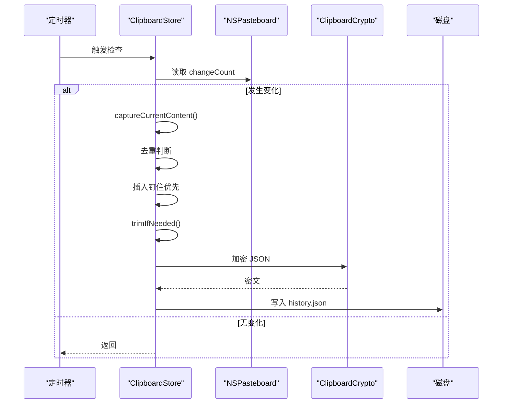
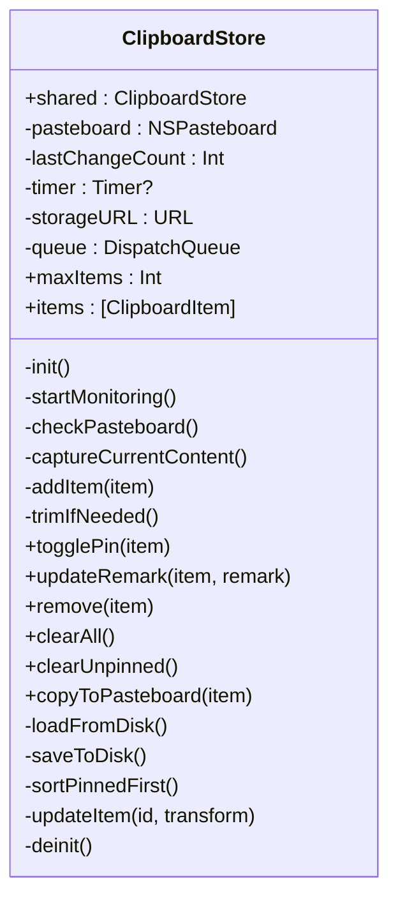
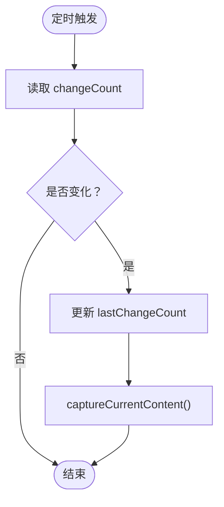
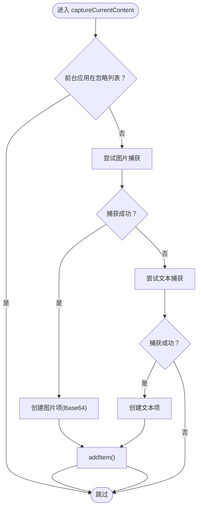
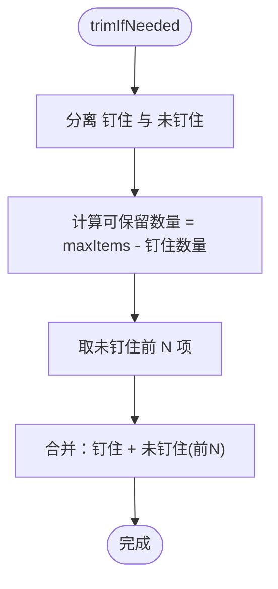
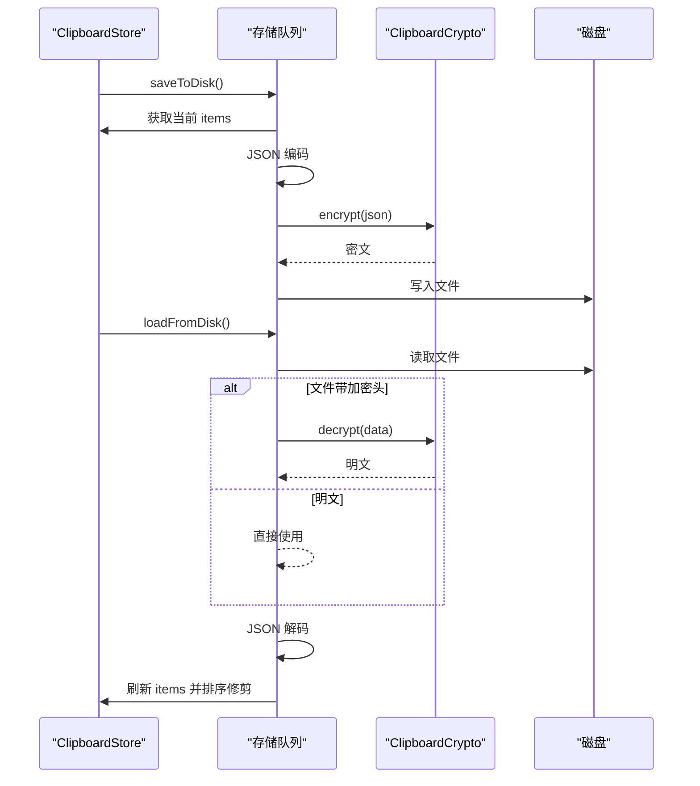
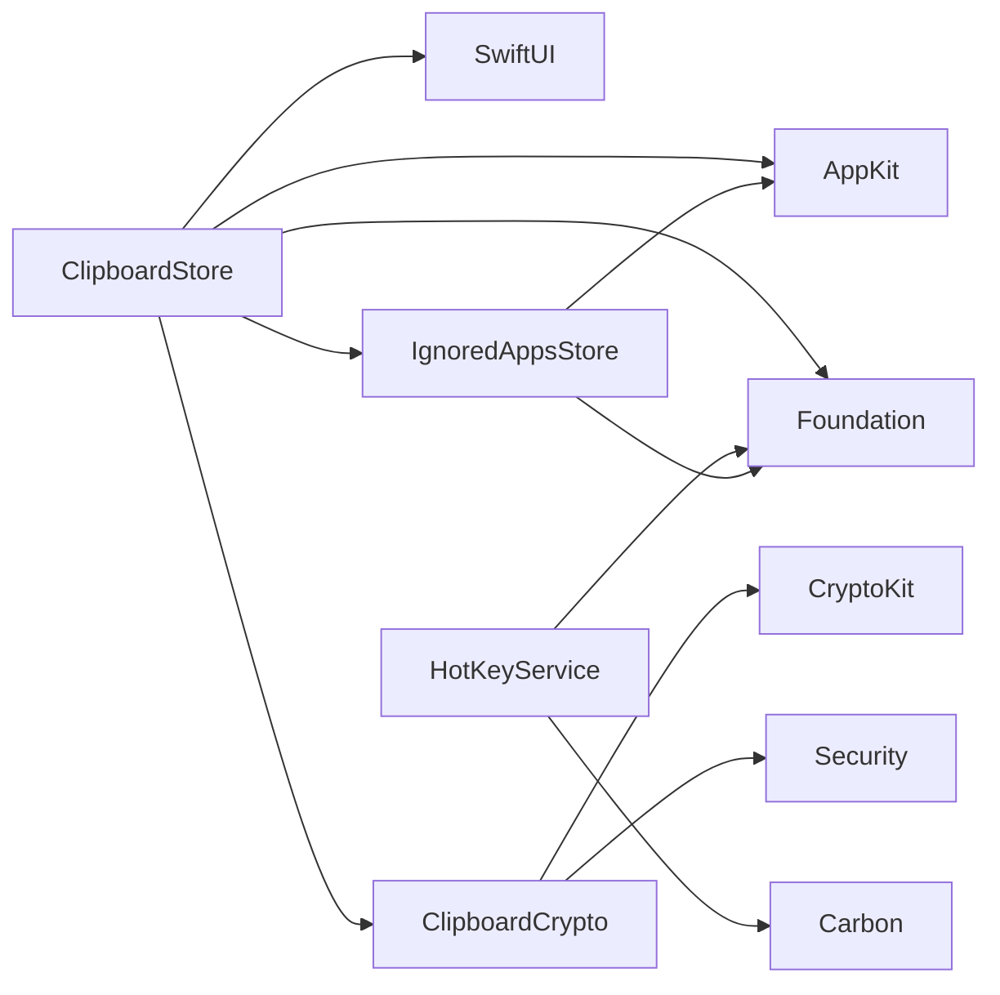

# 剪贴板存储服务

<cite>
**本文引用的文件**
- [ClipboardStore.swift](file://Cutting_board/Services/ClipboardStore.swift)
- [ClipboardItem.swift](file://Cutting_board/Models/ClipboardItem.swift)
- [ClipboardCrypto.swift](file://Cutting_board/Services/ClipboardCrypto.swift)
- [IgnoredAppsStore.swift](file://Cutting_board/Services/IgnoredAppsStore.swift)
- [HotKeyService.swift](file://Cutting_board/Services/HotKeyService.swift)
- [ContentView.swift](file://Cutting_board/ContentView.swift)
- [Cutting_boardApp.swift](file://Cutting_board/Cutting_boardApp.swift)
</cite>

## 目录
1. [简介](#简介)
2. [项目结构](#项目结构)
3. [核心组件](#核心组件)
4. [架构总览](#架构总览)
5. [详细组件分析](#详细组件分析)
6. [依赖关系分析](#依赖关系分析)
7. [性能考量](#性能考量)
8. [故障排查指南](#故障排查指南)
9. [结论](#结论)
10. [附录](#附录)

## 简介
本文件为剪贴板存储服务（ClipboardStore）的深度技术文档，围绕单例模式实现、剪贴板监控机制、数据捕获逻辑、历史记录管理、持久化机制以及API使用与性能优化进行系统性阐述。目标读者既包括需要快速上手的开发者，也包括希望理解内部实现细节的技术人员。

## 项目结构
该项目采用“按职责分层”的组织方式：
- Services 层：负责业务核心逻辑与系统集成（ClipboardStore、ClipboardCrypto、HotKeyService、IgnoredAppsStore）
- Models 层：定义数据模型（ClipboardItem）
- Views 层：UI 视图与交互（ContentView、Cutting_boardApp）

图表来源
- [ClipboardStore.swift](file://Cutting_board/Services/ClipboardStore.swift#L14-L223)
- [ClipboardItem.swift](file://Cutting_board/Models/ClipboardItem.swift#L17-L90)
- [ClipboardCrypto.swift](file://Cutting_board/Services/ClipboardCrypto.swift#L16-L73)
- [HotKeyService.swift](file://Cutting_board/Services/HotKeyService.swift#L30-L82)
- [ContentView.swift](file://Cutting_board/ContentView.swift#L20-L305)
- [Cutting_boardApp.swift](file://Cutting_board/Cutting_boardApp.swift#L35-L144)

章节来源
- [ClipboardStore.swift](file://Cutting_board/Services/ClipboardStore.swift#L1-L223)
- [ClipboardItem.swift](file://Cutting_board/Models/ClipboardItem.swift#L1-L90)
- [ClipboardCrypto.swift](file://Cutting_board/Services/ClipboardCrypto.swift#L1-L73)
- [HotKeyService.swift](file://Cutting_board/Services/HotKeyService.swift#L1-L82)
- [ContentView.swift](file://Cutting_board/ContentView.swift#L1-L305)
- [Cutting_boardApp.swift](file://Cutting_board/Cutting_boardApp.swift#L1-L144)

## 核心组件
- ClipboardStore：单例剪贴板监控与历史存储核心，负责定时轮询、内容捕获、去重、排序、钉住、持久化等
- ClipboardItem：剪贴板历史条目模型，包含内容、类型、时间戳、Base64 图片数据、钉住状态与备注
- ClipboardCrypto：基于 Keychain 的密钥管理与 AES-GCM 加密/解密，保障历史文件安全
- HotKeyService：基于 Carbon 的全局快捷键注册（Command+P），用于唤起/切换剪贴板面板
- IgnoredAppsStore：忽略应用列表管理，避免从特定应用复制的内容进入历史

章节来源
- [ClipboardStore.swift](file://Cutting_board/Services/ClipboardStore.swift#L14-L223)
- [ClipboardItem.swift](file://Cutting_board/Models/ClipboardItem.swift#L17-L90)
- [ClipboardCrypto.swift](file://Cutting_board/Services/ClipboardCrypto.swift#L16-L73)
- [HotKeyService.swift](file://Cutting_board/Services/HotKeyService.swift#L30-L82)
- [IgnoredAppsStore.swift](file://Cutting_board/Services/IgnoredAppsStore.swift#L16-L69)

## 架构总览
ClipboardStore 通过定时器周期性检查 NSPasteboard 的 changeCount，一旦变化即触发内容捕获；捕获优先尝试图片（PNG Base64），其次为纯文本；捕获后执行去重、插入（钉住项优先）、修剪与持久化。UI 通过 @Published 订阅 items 变化，实现列表刷新。

图表来源
- [ClipboardStore.swift](file://Cutting_board/Services/ClipboardStore.swift#L47-L90)
- [ClipboardStore.swift](file://Cutting_board/Services/ClipboardStore.swift#L183-L221)
- [ClipboardCrypto.swift](file://Cutting_board/Services/ClipboardCrypto.swift#L32-L46)

## 详细组件分析

### 单例模式与生命周期
- 单例实现：通过静态属性 shared 提供全局唯一实例，构造函数私有化，确保外部只能通过 shared 访问
- 初始化流程：定位 ApplicationSupport 目录，创建应用专属子目录，生成 storageURL；加载磁盘历史、初始化 lastChangeCount；启动定时器开始监控
- 生命周期管理：deinit 中失效定时器，避免循环引用与资源泄漏

图表来源
- [ClipboardStore.swift](file://Cutting_board/Services/ClipboardStore.swift#L14-L223)

章节来源
- [ClipboardStore.swift](file://Cutting_board/Services/ClipboardStore.swift#L14-L43)

### 剪贴板监控机制
- 定时器：每 0.5 秒触发一次检查，使用弱引用避免循环强引用
- changeCount 策略：通过比较 NSPasteboard.changeCount 与上次记录，仅在变化时继续处理，降低无效开销
- 前台应用过滤：读取前台应用 bundleIdentifier，若命中忽略列表则跳过捕获

图表来源
- [ClipboardStore.swift](file://Cutting_board/Services/ClipboardStore.swift#L47-L60)
- [ClipboardStore.swift](file://Cutting_board/Services/ClipboardStore.swift#L65-L90)
- [IgnoredAppsStore.swift](file://Cutting_board/Services/IgnoredAppsStore.swift#L36-L39)

章节来源
- [ClipboardStore.swift](file://Cutting_board/Services/ClipboardStore.swift#L47-L60)
- [ClipboardStore.swift](file://Cutting_board/Services/ClipboardStore.swift#L65-L90)
- [IgnoredAppsStore.swift](file://Cutting_board/Services/IgnoredAppsStore.swift#L16-L40)

### 数据捕获逻辑
- 优先级：先尝试图片（NSImage -> TIFF -> PNG Base64），再尝试文本（非空白）
- 去重策略：与首项对比，类型一致且内容一致；图片还需 Base64 相同才视为重复
- 插入规则：将新项插入到所有钉住项之后，保持钉住项在顶部

图表来源
- [ClipboardStore.swift](file://Cutting_board/Services/ClipboardStore.swift#L65-L90)
- [ClipboardStore.swift](file://Cutting_board/Services/ClipboardStore.swift#L94-L108)

章节来源
- [ClipboardStore.swift](file://Cutting_board/Services/ClipboardStore.swift#L65-L90)
- [ClipboardStore.swift](file://Cutting_board/Services/ClipboardStore.swift#L94-L108)

### 历史记录管理
- 最大条目限制：maxItems 控制总数，删除时自动修剪
- 钉住功能：togglePin 切换 isPinned，sortPinnedFirst 将钉住项置顶，其余按时间倒序
- 排序算法：稳定排序，优先 isPinned，其次按 timestamp 倒序
- 内存管理：整体替换 items 数组以触发 @Published，避免细粒度变更导致的多次渲染

图表来源
- [ClipboardStore.swift](file://Cutting_board/Services/ClipboardStore.swift#L110-L115)
- [ClipboardStore.swift](file://Cutting_board/Services/ClipboardStore.swift#L142-L147)

章节来源
- [ClipboardStore.swift](file://Cutting_board/Services/ClipboardStore.swift#L110-L115)
- [ClipboardStore.swift](file://Cutting_board/Services/ClipboardStore.swift#L142-L147)

### 持久化机制
- 存储位置：ApplicationSupport/Cutting_board/history.json
- 序列化：JSONEncoder/Decoder，日期采用 ISO8601
- 加密：ClipboardCrypto 使用 AES-GCM，文件头标识加密格式，兼容旧版明文
- 异步队列：使用独立队列进行读写，避免阻塞主线程
- 磁盘策略：读取失败时回退为空列表；写入失败静默忽略，保证健壮性

图表来源
- [ClipboardStore.swift](file://Cutting_board/Services/ClipboardStore.swift#L183-L221)
- [ClipboardCrypto.swift](file://Cutting_board/Services/ClipboardCrypto.swift#L32-L46)

章节来源
- [ClipboardStore.swift](file://Cutting_board/Services/ClipboardStore.swift#L183-L221)
- [ClipboardCrypto.swift](file://Cutting_board/Services/ClipboardCrypto.swift#L16-L73)

### API 使用示例
以下为常用 API 的使用路径（不展示具体代码，仅提供路径与行为说明）：
- 获取单例与订阅历史：参考 [ClipboardStore.swift](file://Cutting_board/Services/ClipboardStore.swift#L14-L19)
- 设置最大条目数并触发修剪：参考 [ClipboardStore.swift](file://Cutting_board/Services/ClipboardStore.swift#L20-L23)
- 钉住/取消钉住：参考 [ClipboardStore.swift](file://Cutting_board/Services/ClipboardStore.swift#L118-L122)
- 更新备注：参考 [ClipboardStore.swift](file://Cutting_board/Services/ClipboardStore.swift#L125-L129)
- 删除/清空：参考 [ClipboardStore.swift](file://Cutting_board/Services/ClipboardStore.swift#L150-L165)
- 写回系统剪贴板：参考 [ClipboardStore.swift](file://Cutting_board/Services/ClipboardStore.swift#L168-L179)
- 全局快捷键：参考 [HotKeyService.swift](file://Cutting_board/Services/HotKeyService.swift#L30-L82)，面板控制参考 [Cutting_boardApp.swift](file://Cutting_board/Cutting_boardApp.swift#L35-L144)
- 忽略应用列表：参考 [IgnoredAppsStore.swift](file://Cutting_board/Services/IgnoredAppsStore.swift#L16-L40)

章节来源
- [ClipboardStore.swift](file://Cutting_board/Services/ClipboardStore.swift#L14-L179)
- [HotKeyService.swift](file://Cutting_board/Services/HotKeyService.swift#L30-L82)
- [Cutting_boardApp.swift](file://Cutting_board/Cutting_boardApp.swift#L35-L144)
- [IgnoredAppsStore.swift](file://Cutting_board/Services/IgnoredAppsStore.swift#L16-L40)

## 依赖关系分析
- ClipboardStore 依赖：
  - AppKit：NSPasteboard、NSImage、NSWorkspace、RunLoop
  - Foundation：JSON 编解码、日期格式、UserDefaults、FileManager、DispatchQueue
  - SwiftUI：@Published、@State、@ObservedObject（UI 层）
- ClipboardCrypto 依赖：
  - CryptoKit：AES.GCM
  - Security：Keychain 读写
- HotKeyService 依赖：
  - Carbon：全局热键注册与事件处理
- IgnoredAppsStore 依赖：
  - AppKit：NSWorkspace、Bundle
  - Foundation：UserDefaults

图表来源
- [ClipboardStore.swift](file://Cutting_board/Services/ClipboardStore.swift#L8-L11)
- [ClipboardCrypto.swift](file://Cutting_board/Services/ClipboardCrypto.swift#L8-L10)
- [HotKeyService.swift](file://Cutting_board/Services/HotKeyService.swift#L8-L10)
- [IgnoredAppsStore.swift](file://Cutting_board/Services/IgnoredAppsStore.swift#L8-L12)

章节来源
- [ClipboardStore.swift](file://Cutting_board/Services/ClipboardStore.swift#L8-L11)
- [ClipboardCrypto.swift](file://Cutting_board/Services/ClipboardCrypto.swift#L8-L10)
- [HotKeyService.swift](file://Cutting_board/Services/HotKeyService.swift#L8-L10)
- [IgnoredAppsStore.swift](file://Cutting_board/Services/IgnoredAppsStore.swift#L8-L12)

## 性能考量
- 定时器频率：0.5 秒间隔平衡了响应速度与 CPU 开销
- changeCount 检测：仅在变化时继续处理，避免重复解析
- 去重策略：O(1) 比较首项，减少不必要的插入与持久化
- 图片处理：PNG Base64 存储，占用较大，建议合理设置 maxItems
- 异步存储：独立队列避免 UI 卡顿
- UI 刷新：整体替换 items 数组触发一次性刷新，减少多次重绘

[本节为通用性能建议，不直接分析具体文件]

## 故障排查指南
- 历史为空
  - 检查是否被忽略应用列表过滤：参考 [IgnoredAppsStore.swift](file://Cutting_board/Services/IgnoredAppsStore.swift#L36-L39)
  - 检查 changeCount 是否持续变化：参考 [ClipboardStore.swift](file://Cutting_board/Services/ClipboardStore.swift#L55-L60)
- 无法保存/读取历史
  - 确认 ApplicationSupport 权限与路径可用：参考 [ClipboardStore.swift](file://Cutting_board/Services/ClipboardStore.swift#L32-L35)
  - 检查加密密钥是否正常：参考 [ClipboardCrypto.swift](file://Cutting_board/Services/ClipboardCrypto.swift#L21-L29)
- 图片无法显示缩略图
  - 检查 Base64 数据有效性：参考 [ClipboardItem.swift](file://Cutting_board/Models/ClipboardItem.swift#L22-L23)
  - 检查 UI 缩略图生成逻辑：参考 [ContentView.swift](file://Cutting_board/ContentView.swift#L446-L451)
- 全局快捷键无效
  - 检查 Carbon 注册是否成功：参考 [HotKeyService.swift](file://Cutting_board/Services/HotKeyService.swift#L36-L69)
  - 确认菜单栏入口与通知转发：参考 [Cutting_boardApp.swift](file://Cutting_board/Cutting_boardApp.swift#L46-L66)

章节来源
- [ClipboardStore.swift](file://Cutting_board/Services/ClipboardStore.swift#L32-L35)
- [ClipboardStore.swift](file://Cutting_board/Services/ClipboardStore.swift#L55-L60)
- [ClipboardCrypto.swift](file://Cutting_board/Services/ClipboardCrypto.swift#L21-L29)
- [ClipboardItem.swift](file://Cutting_board/Models/ClipboardItem.swift#L22-L23)
- [ContentView.swift](file://Cutting_board/ContentView.swift#L446-L451)
- [HotKeyService.swift](file://Cutting_board/Services/HotKeyService.swift#L36-L69)
- [Cutting_boardApp.swift](file://Cutting_board/Cutting_boardApp.swift#L46-L66)

## 结论
ClipboardStore 以单例为核心，结合定时器与 changeCount 检测实现了高效稳定的剪贴板监控；通过优先级捕获、去重与钉住排序，兼顾实用性与可维护性；借助异步队列与 AES-GCM 加密，保障性能与安全性。配合全局快捷键与 UI 层交互，形成完整的剪贴板历史管理方案。

[本节为总结性内容，不直接分析具体文件]

## 附录
- 关键实现路径索引
  - 单例与初始化：[ClipboardStore.swift](file://Cutting_board/Services/ClipboardStore.swift#L14-L39)
  - 监控与捕获：[ClipboardStore.swift](file://Cutting_board/Services/ClipboardStore.swift#L47-L90)
  - 历史管理与排序：[ClipboardStore.swift](file://Cutting_board/Services/ClipboardStore.swift#L110-L147)
  - 持久化与加密：[ClipboardStore.swift](file://Cutting_board/Services/ClipboardStore.swift#L183-L221)，[ClipboardCrypto.swift](file://Cutting_board/Services/ClipboardCrypto.swift#L32-L46)
  - 全局快捷键：[HotKeyService.swift](file://Cutting_board/Services/HotKeyService.swift#L30-L82)
  - 忽略应用：[IgnoredAppsStore.swift](file://Cutting_board/Services/IgnoredAppsStore.swift#L16-L40)
  - UI 交互与面板控制：[ContentView.swift](file://Cutting_board/ContentView.swift#L20-L305)，[Cutting_boardApp.swift](file://Cutting_board/Cutting_boardApp.swift#L35-L144)

[本节为索引汇总，不直接分析具体文件]