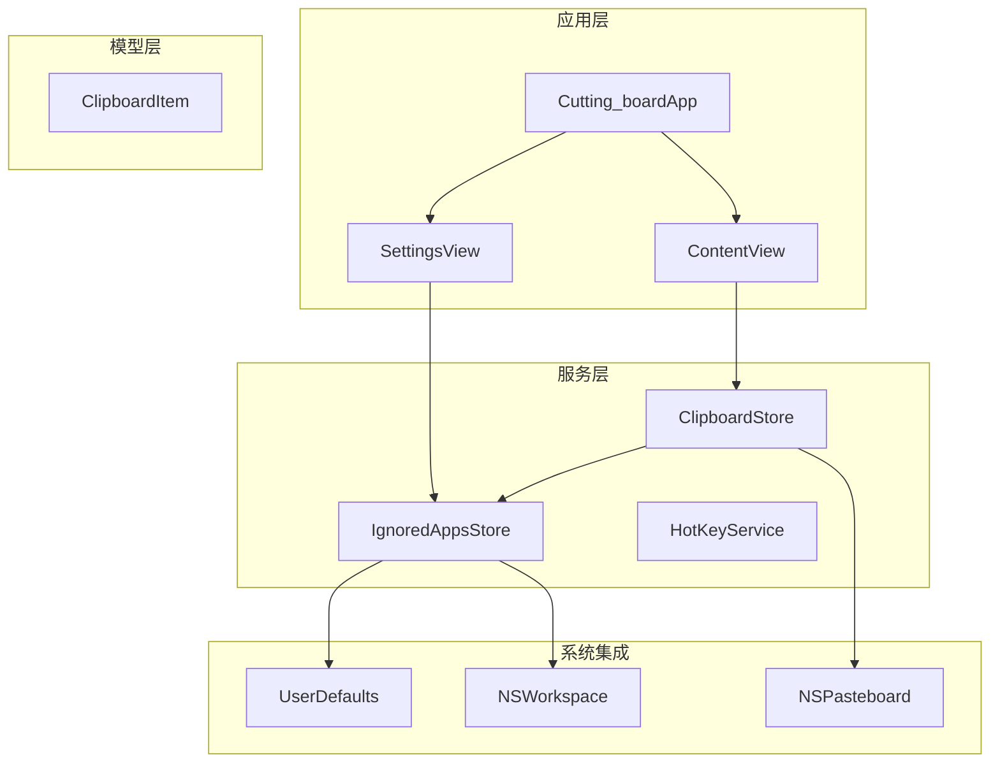
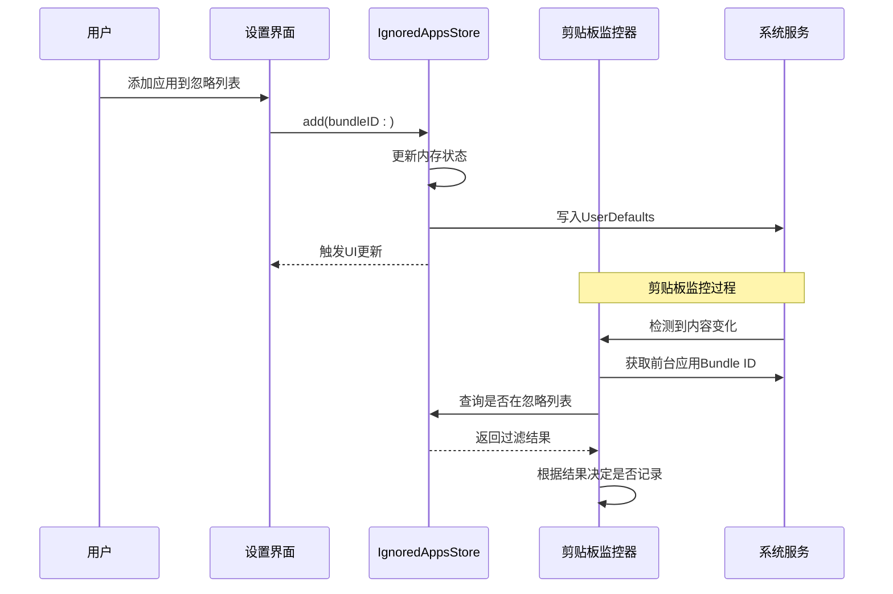
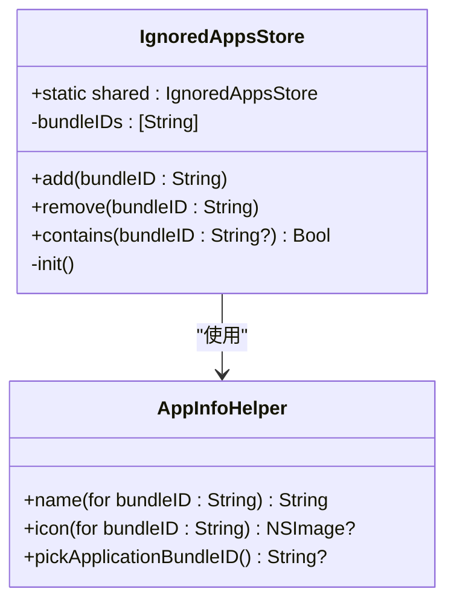
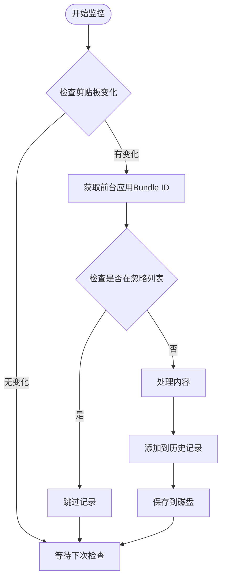
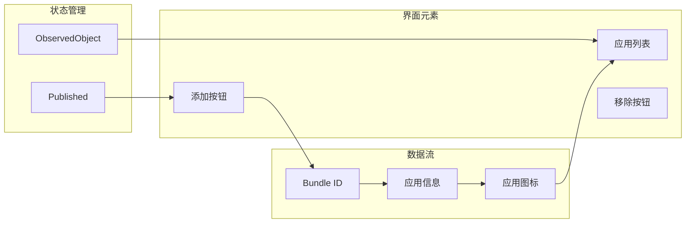
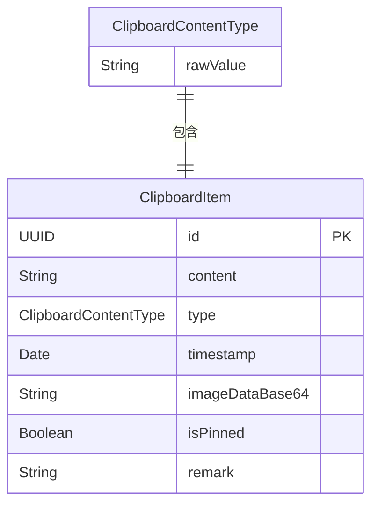
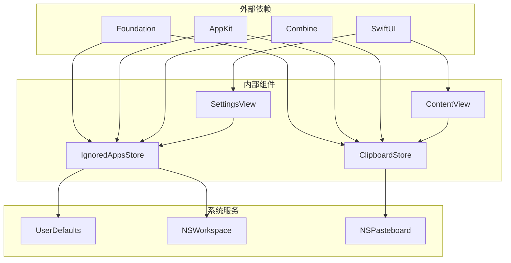

# 应用忽略存储服务

<cite>
**本文档引用的文件**
- [IgnoredAppsStore.swift](file://Cutting_board/Services/IgnoredAppsStore.swift)
- [ClipboardStore.swift](file://Cutting_board/Services/ClipboardStore.swift)
- [SettingsView.swift](file://Cutting_board/SettingsView.swift)
- [ContentView.swift](file://Cutting_board/ContentView.swift)
- [Cutting_boardApp.swift](file://Cutting_board/Cutting_boardApp.swift)
- [ClipboardItem.swift](file://Cutting_board/Models/ClipboardItem.swift)
- [HotKeyService.swift](file://Cutting_board/Services/HotKeyService.swift)
</cite>

## 目录
1. [简介](#简介)
2. [项目结构](#项目结构)
3. [核心组件](#核心组件)
4. [架构概览](#架构概览)
5. [详细组件分析](#详细组件分析)
6. [依赖关系分析](#依赖关系分析)
7. [性能考虑](#性能考虑)
8. [故障排除指南](#故障排除指南)
9. [结论](#结论)
10. [附录](#附录)

## 简介

应用忽略存储服务是Cutting_board应用中的一个关键组件，负责管理用户指定的应用程序忽略列表。该服务允许用户排除特定应用程序的剪贴板内容，防止这些应用的复制操作被记录到剪贴板历史中。通过与剪贴板监控系统的深度集成，IgnoredAppsStore为用户提供了一个灵活而强大的内容过滤机制。

该服务采用单例模式设计，使用UserDefaults进行持久化存储，并通过SwiftUI的@Published属性实现状态的实时同步。服务不仅提供了基本的添加和移除功能，还集成了应用程序信息获取、图标显示和批量管理能力。

## 项目结构

Cutting_board应用采用了清晰的分层架构，将不同职责的功能模块分离到相应的目录中：

**图表来源**
- [Cutting_boardApp.swift](file://Cutting_board/Cutting_boardApp.swift#L12-L31)
- [ContentView.swift](file://Cutting_board/ContentView.swift#L20-L28)
- [SettingsView.swift](file://Cutting_board/SettingsView.swift#L11-L13)

**章节来源**
- [Cutting_boardApp.swift](file://Cutting_board/Cutting_boardApp.swift#L1-L144)
- [ContentView.swift](file://Cutting_board/ContentView.swift#L1-L500)
- [SettingsView.swift](file://Cutting_board/SettingsView.swift#L1-L95)

## 核心组件

### IgnoredAppsStore - 应用忽略存储器

IgnoredAppsStore是应用忽略功能的核心实现，采用单例模式确保全局唯一性。该类继承自ObservableObject，利用@Published属性实现状态的自动更新和UI同步。

#### 主要特性

- **单例设计**: 提供全局唯一的实例访问点
- **持久化存储**: 使用UserDefaults存储忽略的应用程序Bundle ID列表
- **实时同步**: 通过@Published属性实现SwiftUI界面的自动更新
- **简单API**: 提供add、remove和contains等基础操作方法

#### 数据存储策略

服务使用统一的UserDefaults键值对存储格式：
- 存储键: "Cutting_board.ignoredBundleIDs"
- 数据类型: 字符串数组
- 自动同步: 每次状态变更时自动写入磁盘

**章节来源**
- [IgnoredAppsStore.swift](file://Cutting_board/Services/IgnoredAppsStore.swift#L16-L40)

### ClipboardStore - 剪贴板监控器

ClipboardStore负责监控系统剪贴板的变化并管理历史记录。该类同样采用单例模式，实现了复杂的剪贴板内容捕获、处理和存储逻辑。

#### 关键功能

- **定时监控**: 使用Timer每0.5秒检查一次剪贴板变化
- **智能过滤**: 集成IgnoredAppsStore进行应用级别的内容过滤
- **多格式支持**: 支持文本和图片两种剪贴板内容格式
- **持久化存储**: 将历史记录加密存储到应用支持目录

**章节来源**
- [ClipboardStore.swift](file://Cutting_board/Services/ClipboardStore.swift#L14-L39)

### SettingsView - 设置界面

SettingsView提供了用户友好的界面来管理忽略的应用程序列表。该界面完全响应式设计，能够实时反映IgnoredAppsStore的状态变化。

#### 界面特性

- **应用信息展示**: 显示应用程序名称和图标
- **交互式管理**: 支持添加新应用和移除现有应用
- **视觉反馈**: 使用玻璃效果和动画增强用户体验
- **实时更新**: 通过@ObservedObject实现状态同步

**章节来源**
- [SettingsView.swift](file://Cutting_board/SettingsView.swift#L11-L88)

## 架构概览

应用忽略存储服务在整个系统架构中扮演着重要的协调角色，连接着用户界面、系统服务和数据存储层。

**图表来源**
- [SettingsView.swift](file://Cutting_board/SettingsView.swift#L78-L81)
- [IgnoredAppsStore.swift](file://Cutting_board/Services/IgnoredAppsStore.swift#L27-L34)
- [ClipboardStore.swift](file://Cutting_board/Services/ClipboardStore.swift#L65-L90)

## 详细组件分析

### IgnoredAppsStore 详细分析

#### 类结构设计

**图表来源**
- [IgnoredAppsStore.swift](file://Cutting_board/Services/IgnoredAppsStore.swift#L16-L68)

#### Bundle ID 获取机制

服务提供了三种不同的Bundle ID获取方式：

1. **手动输入**: 适用于未知的应用程序
2. **系统检测**: 通过NSWorkspace自动识别当前前台应用
3. **用户选择**: 通过NSOpenPanel让用户从文件系统选择应用程序

#### 存储策略分析

存储策略采用了"内存优先，自动持久化"的设计理念：

- **内存缓存**: 所有操作首先在内存中执行
- **自动同步**: @Published属性触发UserDefaults自动写入
- **初始化加载**: 应用启动时从UserDefaults读取历史状态

**章节来源**
- [IgnoredAppsStore.swift](file://Cutting_board/Services/IgnoredAppsStore.swift#L16-L68)

### 与 ClipboardStore 的协作关系

#### 过滤逻辑实现

剪贴板监控器在捕获内容时会执行以下过滤流程：

**图表来源**
- [ClipboardStore.swift](file://Cutting_board/Services/ClipboardStore.swift#L55-L90)

#### 实时更新机制

当用户在设置界面修改忽略列表时，系统通过以下链路实现实时更新：

1. **状态变更**: IgnoredAppsStore的@Published属性触发
2. **观察者通知**: SwiftUI框架自动更新SettingsView界面
3. **剪贴板监控**: ClipboardStore在下一次检查时应用新的过滤规则
4. **即时生效**: 新的忽略规则立即影响后续的剪贴板内容捕获

**章节来源**
- [ClipboardStore.swift](file://Cutting_board/Services/ClipboardStore.swift#L65-L90)

### 用户界面集成分析

#### SettingsView 的响应式设计

SettingsView采用了现代SwiftUI的最佳实践：

**图表来源**
- [SettingsView.swift](file://Cutting_board/SettingsView.swift#L12-L87)

#### 动态管理功能

界面提供了完整的应用列表动态管理能力：

- **添加应用**: 通过AppInfoHelper.pickApplicationBundleID()获取用户选择的应用
- **移除应用**: 点击移除按钮从列表中删除对应的应用
- **批量操作**: 通过列表的增删操作实现批量管理
- **实时预览**: 应用图标和名称的实时显示

**章节来源**
- [SettingsView.swift](file://Cutting_board/SettingsView.swift#L49-L87)

### 数据模型与存储

#### ClipboardItem 数据结构

**图表来源**
- [ClipboardItem.swift](file://Cutting_board/Models/ClipboardItem.swift#L17-L45)

#### 存储优化策略

系统采用了多种存储优化技术：

- **增量更新**: 仅在状态变更时触发UserDefaults写入
- **内存缓存**: 避免频繁的磁盘I/O操作
- **延迟加载**: 应用启动时异步加载历史数据
- **加密存储**: 剪贴板历史数据采用加密保护

**章节来源**
- [ClipboardItem.swift](file://Cutting_board/Models/ClipboardItem.swift#L1-L90)

## 依赖关系分析

### 组件间依赖关系

**图表来源**
- [IgnoredAppsStore.swift](file://Cutting_board/Services/IgnoredAppsStore.swift#L8-L12)
- [ClipboardStore.swift](file://Cutting_board/Services/ClipboardStore.swift#L8-L12)

### 耦合度分析

系统采用了松耦合的设计原则：

- **低耦合**: 各组件通过明确的接口进行通信
- **高内聚**: 每个组件专注于单一职责
- **可测试性**: 组件间的依赖关系清晰，便于单元测试
- **可维护性**: 模块化设计使得代码易于维护和扩展

**章节来源**
- [IgnoredAppsStore.swift](file://Cutting_board/Services/IgnoredAppsStore.swift#L16-L40)
- [ClipboardStore.swift](file://Cutting_board/Services/ClipboardStore.swift#L14-L39)

## 性能考虑

### 内存管理优化

系统在内存管理方面采用了多项优化策略：

- **弱引用**: 在Timer回调中使用weak self避免循环引用
- **异步处理**: 文件I/O操作在后台队列执行
- **增量更新**: 仅在必要时更新UI状态
- **资源释放**: 在deinit方法中正确释放Timer资源

### 剪贴板监控效率

剪贴板监控采用了高效的轮询机制：

- **定时器优化**: 0.5秒的检查间隔平衡了响应性和性能
- **变化检测**: 通过changeCount避免重复处理相同内容
- **条件过滤**: 在内存中快速判断是否需要进一步处理
- **并发处理**: 使用DispatchQueue确保线程安全

### 存储性能优化

数据存储采用了多种优化技术：

- **批量写入**: 合并多个状态变更后的单次UserDefaults写入
- **延迟加载**: 历史数据异步加载，不影响应用启动速度
- **压缩存储**: 剪贴板历史数据采用JSON格式存储
- **加密处理**: 使用ClipboardCrypto进行数据保护

## 故障排除指南

### 常见问题及解决方案

#### 忽略列表不生效

**问题描述**: 添加到忽略列表的应用仍然被记录到剪贴板历史中

**可能原因**:
1. 应用Bundle ID获取失败
2. UserDefaults存储异常
3. 剪贴板监控逻辑错误

**解决步骤**:
1. 检查应用是否正确选择了Bundle ID
2. 验证UserDefaults中是否存在该Bundle ID
3. 查看剪贴板监控日志输出

#### 应用图标显示异常

**问题描述**: 设置界面中应用图标无法正常显示

**可能原因**:
1. 应用程序路径无效
2. Bundle信息缺失
3. NSWorkspace访问权限问题

**解决步骤**:
1. 确认应用程序位于"/Applications"目录
2. 检查应用程序的Bundle信息完整性
3. 重新启动应用以刷新缓存

#### 剪贴板监控停止工作

**问题描述**: 剪贴板内容不再被记录

**可能原因**:
1. Timer定时器失效
2. NSPasteboard访问权限问题
3. 应用程序生命周期问题

**解决步骤**:
1. 重启应用程序
2. 检查系统权限设置
3. 查看控制台日志输出

**章节来源**
- [ClipboardStore.swift](file://Cutting_board/Services/ClipboardStore.swift#L41-L53)
- [IgnoredAppsStore.swift](file://Cutting_board/Services/IgnoredAppsStore.swift#L23-L25)

## 结论

应用忽略存储服务通过精心设计的架构和实现，成功地为Cutting_board应用提供了强大的内容过滤功能。该服务不仅实现了基本的忽略列表管理功能，还通过与剪贴板监控系统的深度集成，为用户提供了无缝的使用体验。

### 主要优势

1. **简洁高效**: 采用单例模式和轻量级设计，减少系统开销
2. **实时响应**: 通过SwiftUI的响应式编程实现即时状态更新
3. **用户友好**: 提供直观的界面和丰富的交互功能
4. **系统集成**: 深度集成macOS系统服务，充分利用平台特性
5. **可扩展性**: 模块化设计便于未来功能扩展

### 技术亮点

- **智能Bundle ID管理**: 自动获取和验证应用程序标识符
- **优雅降级**: 在不同系统版本间提供兼容性支持
- **性能优化**: 多层次的性能优化确保流畅的用户体验
- **安全性考虑**: 剪贴板历史数据的加密存储保护用户隐私

该服务为类似的应用程序提供了优秀的参考实现，展示了如何在保持代码简洁的同时实现复杂的功能需求。

## 附录

### 实际使用场景

#### 场景一：排除密码管理器
用户可以将密码管理器应用程序添加到忽略列表，防止敏感的密码内容被记录到剪贴板历史中。

#### 场景二：排除邮件客户端
对于包含大量邮件内容的应用程序，用户可以选择忽略，避免邮件主题和正文被频繁记录。

#### 场景三：排除开发工具
开发者可以忽略IDE和其他开发工具，专注于记录实际的工作内容而非开发环境信息。

### 配置示例

#### 基本配置步骤
1. 打开设置界面
2. 点击"添加应用"按钮
3. 从文件系统选择目标应用程序
4. 确认添加到忽略列表

#### 高级配置技巧
- **批量管理**: 通过列表的增删操作实现批量忽略应用
- **实时预览**: 查看应用图标和名称确认选择正确的目标
- **快速移除**: 点击应用条目右侧的移除按钮快速删除

### 开发建议

#### 扩展方向
1. **规则管理**: 添加更复杂的过滤规则支持
2. **导入导出**: 支持忽略列表的备份和恢复
3. **高级搜索**: 提供基于应用名称或Bundle ID的搜索功能
4. **批量操作**: 支持全选和批量移除功能

#### 最佳实践
- 保持代码的模块化和可测试性
- 注意内存管理和资源释放
- 提供清晰的错误处理和用户反馈
- 考虑不同系统版本的兼容性