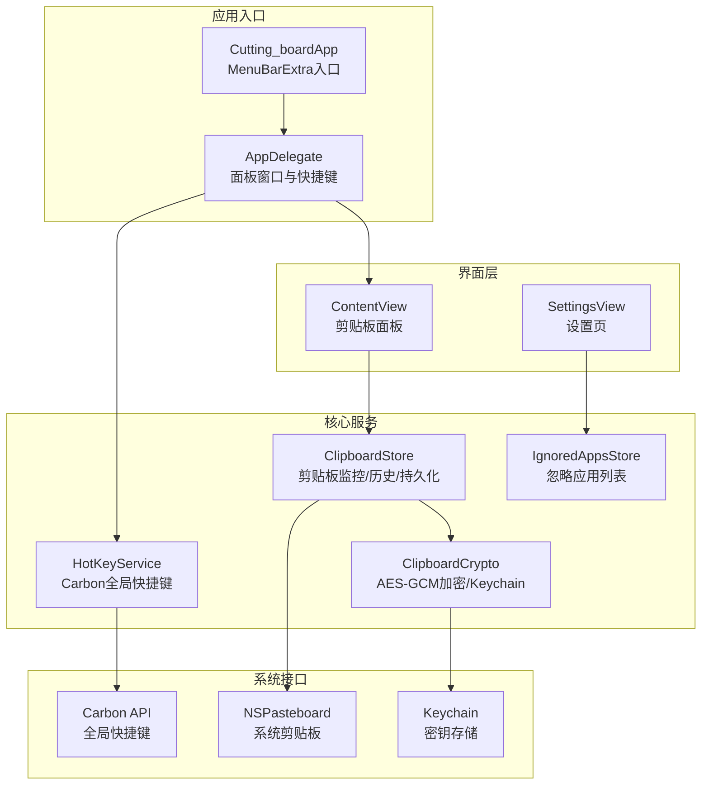
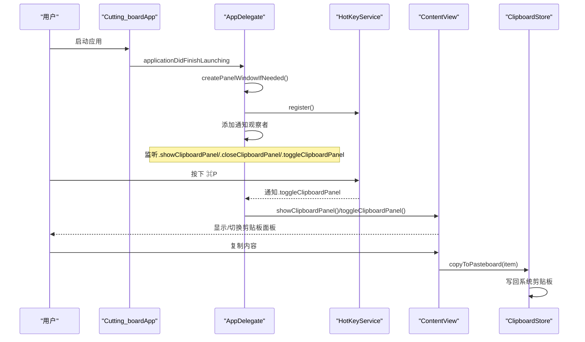
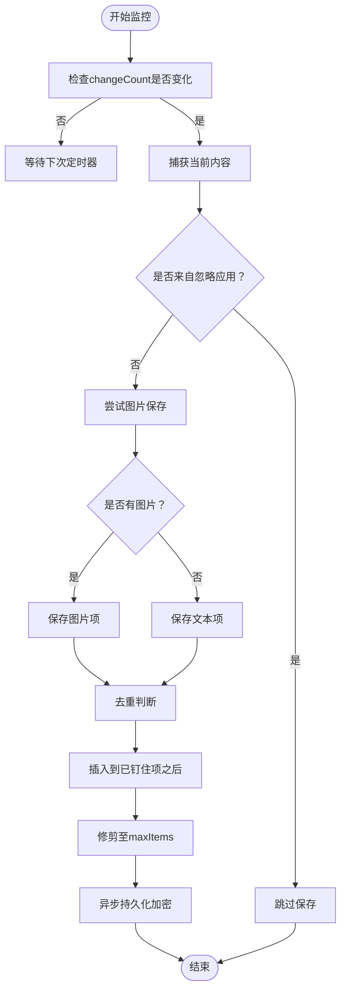
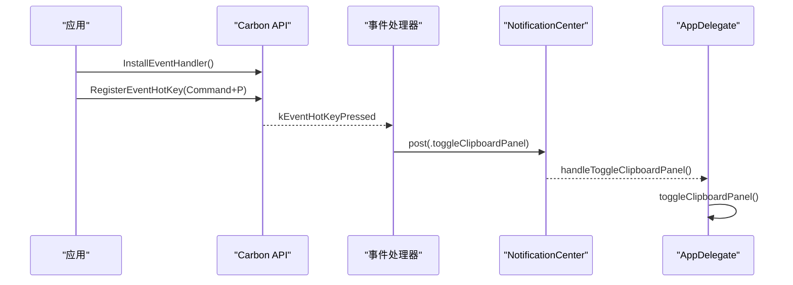
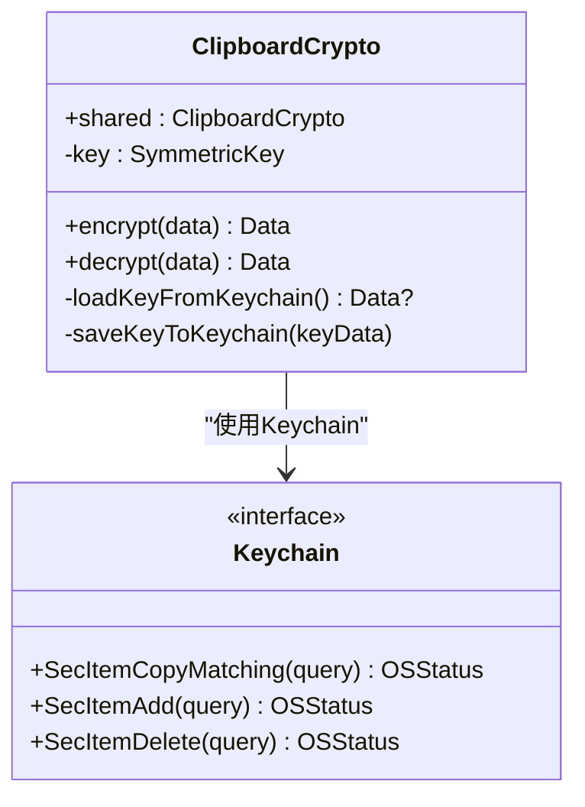
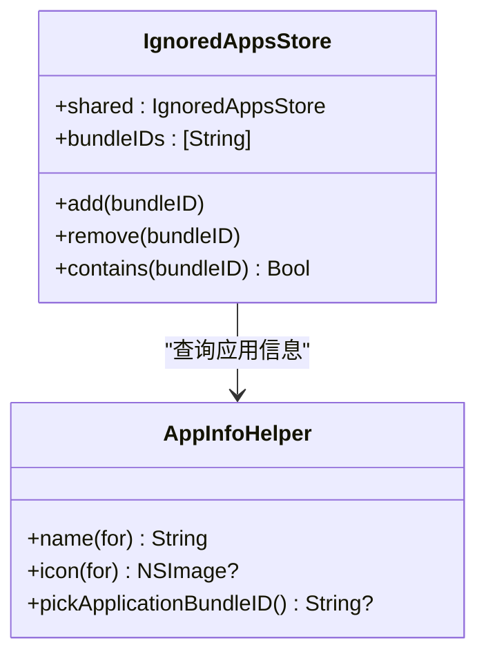
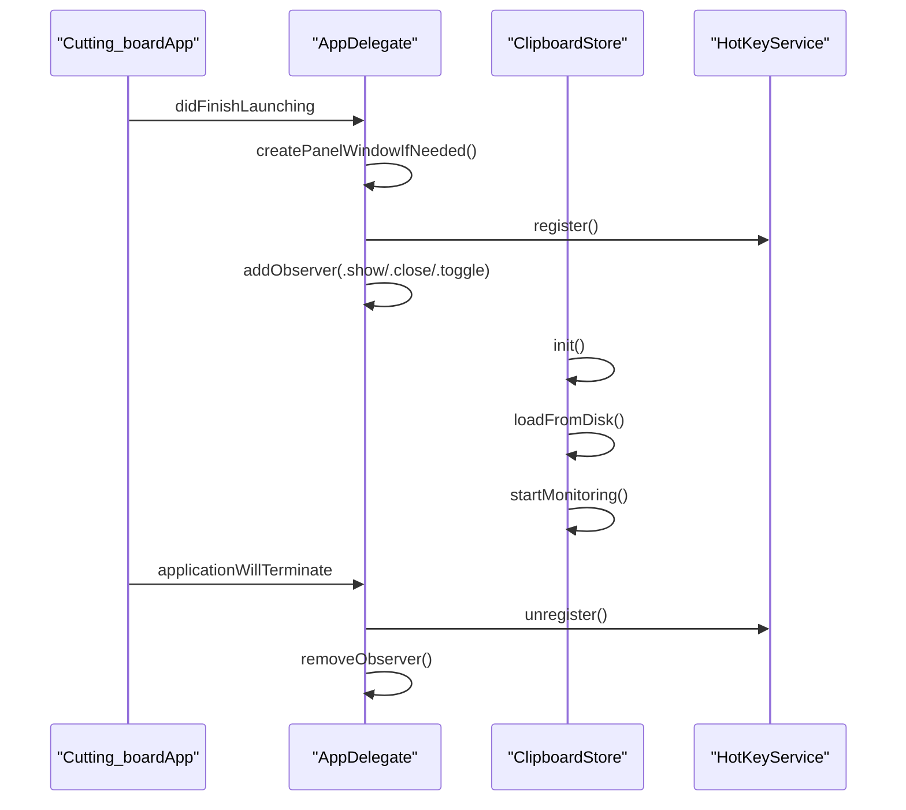
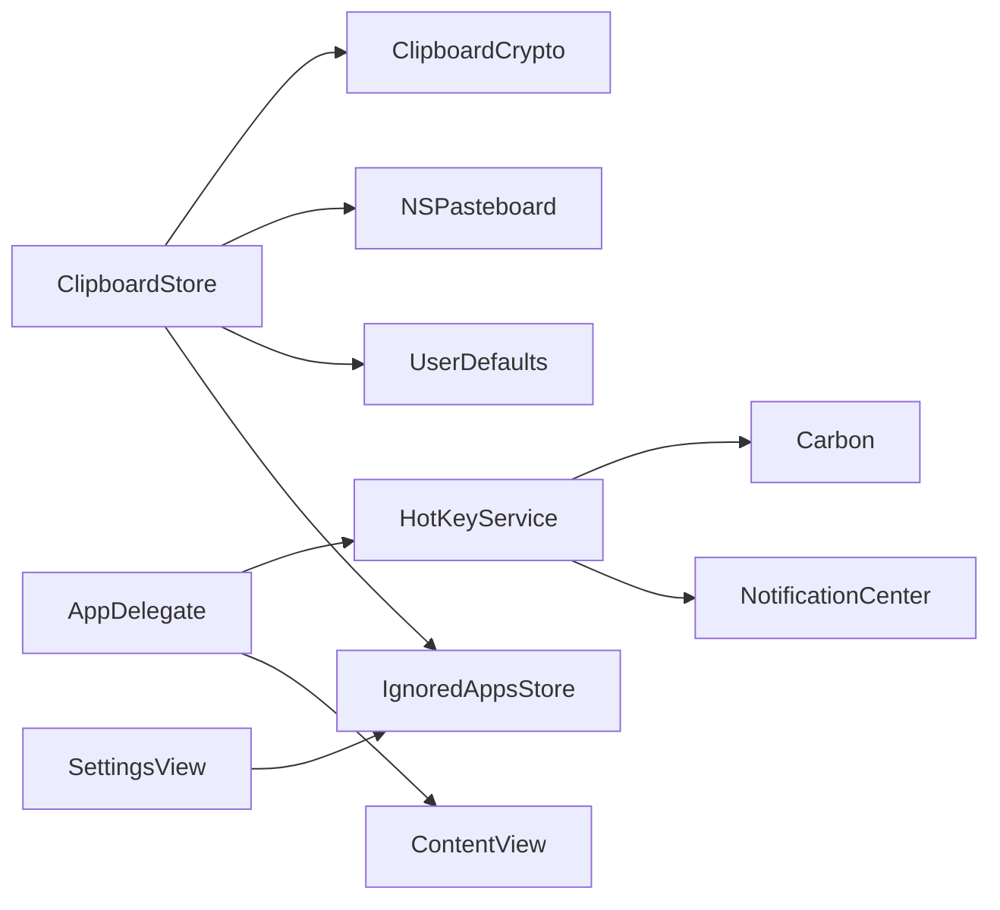

# 核心服务组件

<cite>
**本文档引用的文件**
- [ClipboardStore.swift](file://Cutting_board/Services/ClipboardStore.swift)
- [HotKeyService.swift](file://Cutting_board/Services/HotKeyService.swift)
- [ClipboardCrypto.swift](file://Cutting_board/Services/ClipboardCrypto.swift)
- [IgnoredAppsStore.swift](file://Cutting_board/Services/IgnoredAppsStore.swift)
- [ClipboardItem.swift](file://Cutting_board/Models/ClipboardItem.swift)
- [Cutting_boardApp.swift](file://Cutting_board/Cutting_boardApp.swift)
- [ContentView.swift](file://Cutting_board/ContentView.swift)
- [SettingsView.swift](file://Cutting_board/SettingsView.swift)
</cite>

## 目录
1. [简介](#简介)
2. [项目结构](#项目结构)
3. [核心组件](#核心组件)
4. [架构总览](#架构总览)
5. [详细组件分析](#详细组件分析)
6. [依赖关系分析](#依赖关系分析)
7. [性能考虑](#性能考虑)
8. [故障排除指南](#故障排除指南)
9. [结论](#结论)

## 简介
本文件面向Cutting_board的核心服务组件，围绕以下主题展开：
- 剪贴板监控与历史管理：ClipboardStore的监控机制、去重策略、持久化与加密
- 全局快捷键：HotKeyService基于Carbon API的注册与事件分发
- 数据加密：ClipboardCrypto的AES-GCM算法与Keychain密钥管理
- 应用忽略列表：IgnoredAppsStore的维护与查询
- 组件协作、依赖注入与单例模式
- 初始化流程与生命周期管理

## 项目结构
项目采用按职责分层的组织方式：
- Models：数据模型定义（剪贴板条目）
- Services：核心服务（剪贴板存储、加密、快捷键、忽略应用）
- Views：界面层（主面板、设置页）
- App入口：菜单栏常驻应用，后台创建面板窗口

图表来源
- [Cutting_boardApp.swift](file://Cutting_board/Cutting_boardApp.swift#L35-L143)
- [ContentView.swift](file://Cutting_board/ContentView.swift#L20-L305)
- [SettingsView.swift](file://Cutting_board/SettingsView.swift#L11-L89)
- [ClipboardStore.swift](file://Cutting_board/Services/ClipboardStore.swift#L14-L222)
- [ClipboardCrypto.swift](file://Cutting_board/Services/ClipboardCrypto.swift#L16-L72)
- [HotKeyService.swift](file://Cutting_board/Services/HotKeyService.swift#L30-L81)
- [IgnoredAppsStore.swift](file://Cutting_board/Services/IgnoredAppsStore.swift#L16-L40)

章节来源
- [Cutting_boardApp.swift](file://Cutting_board/Cutting_boardApp.swift#L11-L143)
- [ContentView.swift](file://Cutting_board/ContentView.swift#L20-L305)
- [SettingsView.swift](file://Cutting_board/SettingsView.swift#L11-L89)

## 核心组件
- ClipboardStore：负责系统剪贴板监控、历史记录去重、排序与持久化；支持文本与图片；提供钉住、备注、清空等功能；通过ClipboardCrypto进行加密存储。
- ClipboardCrypto：提供AES-GCM对称加密与Keychain密钥管理，兼容明文历史文件。
- HotKeyService：基于Carbon API注册全局快捷键（Command+P），无需辅助功能权限，通过通知中心分发事件。
- IgnoredAppsStore：维护忽略的应用Bundle ID列表，提供增删查与应用信息查询工具。
- ClipboardItem：剪贴板历史条目的数据模型，包含内容、类型、时间戳、图片Base64、钉住状态与备注。

章节来源
- [ClipboardStore.swift](file://Cutting_board/Services/ClipboardStore.swift#L14-L222)
- [ClipboardCrypto.swift](file://Cutting_board/Services/ClipboardCrypto.swift#L16-L72)
- [HotKeyService.swift](file://Cutting_board/Services/HotKeyService.swift#L30-L81)
- [IgnoredAppsStore.swift](file://Cutting_board/Services/IgnoredAppsStore.swift#L16-L40)
- [ClipboardItem.swift](file://Cutting_board/Models/ClipboardItem.swift#L17-L89)

## 架构总览
核心服务采用单例模式与观察者模式协同工作：
- 单例：ClipboardStore.shared、ClipboardCrypto.shared、IgnoredAppsStore.shared
- 观察者：ClipboardStore基于@Published暴露历史列表；IgnoredAppsStore基于@Published暴露忽略列表
- 生命周期：AppDelegate在应用启动时创建面板窗口、注册全局快捷键，并监听通知；在退出时注销快捷键并移除通知观察者

图表来源
- [Cutting_boardApp.swift](file://Cutting_board/Cutting_boardApp.swift#L46-L72)
- [HotKeyService.swift](file://Cutting_board/Services/HotKeyService.swift#L36-L69)
- [ContentView.swift](file://Cutting_board/ContentView.swift#L101-L142)
- [ClipboardStore.swift](file://Cutting_board/Services/ClipboardStore.swift#L168-L179)

## 详细组件分析

### ClipboardStore：剪贴板监控与历史管理
- 监控机制
  - 使用定时器每0.5秒检查NSPasteboard.changeCount变化，避免轮询过度
  - 通过frontmostApplication的Bundle ID与忽略列表结合，跳过来自忽略应用的内容
- 内容捕获
  - 优先尝试图片：将NSImage转换为PNG的Base64字符串，生成图片类型的ClipboardItem
  - 文本内容：去除空白后非空才保存
- 去重策略
  - 与首项完全一致（内容、类型、图片Base64相同）则忽略新增
  - 钉住项不受最大数量限制，始终置顶
- 排序与修剪
  - 钉住项优先，未钉住项按时间倒序
  - 当超过maxItems时，保留钉住项，未钉住项按上限截断
- 持久化与加密
  - 异步队列执行磁盘读写，JSON编码ISO8601时间
  - 读取时先尝试解密，兼容旧版明文；写入时统一加密
- 写回系统剪贴板
  - 支持文本与图片两种类型，写回后更新changeCount

图表来源
- [ClipboardStore.swift](file://Cutting_board/Services/ClipboardStore.swift#L47-L90)
- [ClipboardStore.swift](file://Cutting_board/Services/ClipboardStore.swift#L94-L115)
- [ClipboardStore.swift](file://Cutting_board/Services/ClipboardStore.swift#L183-L221)

章节来源
- [ClipboardStore.swift](file://Cutting_board/Services/ClipboardStore.swift#L14-L222)
- [ClipboardItem.swift](file://Cutting_board/Models/ClipboardItem.swift#L17-L89)

### HotKeyService：全局快捷键注册与事件处理
- 注册流程
  - 安装事件处理器到应用事件目标，监听kEventHotKeyPressed
  - 使用RegisterEventHotKey注册Command+P（字母P的keyCode），签名固定为“DING”
- 事件回调
  - 回调函数为C可调用，直接向NotificationCenter发布.toggleClipboardPanel
  - 在主线程派发，确保UI交互安全
- 注销流程
  - 取消注册热键并移除事件处理器，应用退出时由AppDelegate统一调用

图表来源
- [HotKeyService.swift](file://Cutting_board/Services/HotKeyService.swift#L36-L69)
- [HotKeyService.swift](file://Cutting_board/Services/HotKeyService.swift#L22-L27)
- [Cutting_boardApp.swift](file://Cutting_board/Cutting_boardApp.swift#L131-L133)

章节来源
- [HotKeyService.swift](file://Cutting_board/Services/HotKeyService.swift#L30-L81)
- [Cutting_boardApp.swift](file://Cutting_board/Cutting_boardApp.swift#L46-L72)

### ClipboardCrypto：数据加密服务
- 密钥管理
  - Keychain服务名为“WJIAEN.Cutting-board.clipboard”，账户名为“history-key”
  - 首次使用时随机生成32字节密钥并保存；后续直接加载
- 加密格式
  - 输出格式为“魔数”+密封盒combined，魔数用于识别加密文件
  - 解密时若无魔数则视为明文，兼容旧版本
- 算法选择
  - 使用AES-GCM，提供机密性与完整性保护

图表来源
- [ClipboardCrypto.swift](file://Cutting_board/Services/ClipboardCrypto.swift#L16-L72)

章节来源
- [ClipboardCrypto.swift](file://Cutting_board/Services/ClipboardCrypto.swift#L16-L72)

### IgnoredAppsStore：应用忽略列表管理
- 单例模式：shared实例贯穿设置页与剪贴板监控
- 数据持久化：通过UserDefaults以字符串数组形式保存Bundle ID列表
- 功能接口
  - add/remove/contains，支持从Bundle ID解析应用名称与图标
  - 提供AppInfoHelper工具：选择.app、解析CFBundleDisplayName/CFBundleName、获取图标

图表来源
- [IgnoredAppsStore.swift](file://Cutting_board/Services/IgnoredAppsStore.swift#L16-L68)

章节来源
- [IgnoredAppsStore.swift](file://Cutting_board/Services/IgnoredAppsStore.swift#L16-L68)
- [SettingsView.swift](file://Cutting_board/SettingsView.swift#L41-L88)

### 服务协作关系与依赖注入
- 依赖注入模式
  - ContentView通过@ObservedObject注入ClipboardStore.shared与IgnoredAppsStore.shared
  - SettingsView通过@ObservedObject注入IgnoredAppsStore.shared
  - ClipboardStore内部依赖ClipboardCrypto.shared与NSPasteboard
- 单例模式
  - ClipboardStore.shared、ClipboardCrypto.shared、IgnoredAppsStore.shared均为单例，保证全局一致性
- 通知与观察者
  - HotKeyService通过通知中心分发事件，AppDelegate统一接收并控制面板显示/隐藏
  - ClipboardStore与IgnoredAppsStore均采用@Published，驱动界面自动刷新

章节来源
- [ContentView.swift](file://Cutting_board/ContentView.swift#L20-L305)
- [SettingsView.swift](file://Cutting_board/SettingsView.swift#L11-L89)
- [ClipboardStore.swift](file://Cutting_board/Services/ClipboardStore.swift#L14-L222)
- [HotKeyService.swift](file://Cutting_board/Services/HotKeyService.swift#L30-L81)
- [IgnoredAppsStore.swift](file://Cutting_board/Services/IgnoredAppsStore.swift#L16-L40)

### 服务初始化流程与生命周期管理
- 应用启动
  - Cutting_boardApp创建MenuBarExtra入口，AppDelegate在applicationDidFinishLaunching中：
    - 创建剪贴板面板窗口（NSWindow + NSHostingView）
    - 注册全局快捷键（HotKeyService.register）
    - 添加通知观察者（显示/关闭/切换面板）
- 运行期
  - ClipboardStore在初始化时：
    - 创建应用支持目录下的history.json路径
    - 从磁盘加载历史（尝试解密，兼容明文）
    - 启动定时器监控剪贴板变化
- 应用退出
  - AppDelegate在applicationWillTerminate中：
    - 注销全局快捷键（HotKeyService.unregister）
    - 移除通知观察者

图表来源
- [Cutting_boardApp.swift](file://Cutting_board/Cutting_boardApp.swift#L46-L72)
- [ClipboardStore.swift](file://Cutting_board/Services/ClipboardStore.swift#L31-L39)
- [ClipboardStore.swift](file://Cutting_board/Services/ClipboardStore.swift#L183-L208)

章节来源
- [Cutting_boardApp.swift](file://Cutting_board/Cutting_boardApp.swift#L46-L72)
- [ClipboardStore.swift](file://Cutting_board/Services/ClipboardStore.swift#L31-L39)

## 依赖关系分析
- 组件耦合
  - ClipboardStore与ClipboardCrypto强耦合（加密/解密），但通过shared单例解耦具体实现
  - ClipboardStore与IgnoredAppsStore弱耦合（仅读取忽略列表），降低变更影响面
  - HotKeyService与AppDelegate通过通知解耦，遵循单一职责
- 外部依赖
  - NSPasteboard：系统剪贴板访问
  - Carbon：全局快捷键注册
  - Keychain：密钥持久化
  - UserDefaults：忽略应用列表持久化

图表来源
- [ClipboardStore.swift](file://Cutting_board/Services/ClipboardStore.swift#L14-L222)
- [ClipboardCrypto.swift](file://Cutting_board/Services/ClipboardCrypto.swift#L16-L72)
- [HotKeyService.swift](file://Cutting_board/Services/HotKeyService.swift#L30-L81)
- [IgnoredAppsStore.swift](file://Cutting_board/Services/IgnoredAppsStore.swift#L16-L40)
- [Cutting_boardApp.swift](file://Cutting_board/Cutting_boardApp.swift#L46-L72)

## 性能考虑
- 监控频率与开销
  - 0.5秒定时器平衡响应速度与CPU占用；changeCount检查避免无效捕获
- 磁盘IO与线程
  - 所有磁盘读写在独立队列执行，避免阻塞主线程；JSON编码使用ISO8601与排序键，提升可读性
- 图片处理
  - 仅在需要时将图片转为PNG Base64，避免重复转换；缩略图缓存减少渲染压力
- 去重与修剪
  - 去重在主线程快速判断，避免不必要的数组操作；修剪时保持钉住项优先，减少遍历成本

## 故障排除指南
- 快捷键无效
  - 确认HotKeyService.register返回成功；检查系统权限（Carbon无需辅助功能）
  - 查看AppDelegate是否正确安装事件处理器与注册热键
- 历史无法加载或丢失
  - 检查history.json是否存在；若为加密文件，确认ClipboardCrypto.key存在且Keychain可用
  - 如需恢复，可临时禁用加密逻辑（不建议长期使用）
- 图片历史为空
  - 确认目标应用确实写入了图片到剪贴板；检查是否被忽略应用列表过滤
- 钉住项被清理
  - maxItems设置过小可能导致未钉住项被裁剪；调整maxItems或增加钉住项数量

章节来源
- [HotKeyService.swift](file://Cutting_board/Services/HotKeyService.swift#L36-L69)
- [ClipboardStore.swift](file://Cutting_board/Services/ClipboardStore.swift#L183-L221)
- [IgnoredAppsStore.swift](file://Cutting_board/Services/IgnoredAppsStore.swift#L16-L40)

## 结论
Cutting_board通过清晰的服务分层与单例模式实现了稳定的剪贴板监控与历史管理，结合Carbon全局快捷键与AES-GCM加密保障了易用性与安全性。IgnoredAppsStore提供了灵活的应用级过滤能力。整体架构具备良好的扩展性与可维护性，适合进一步引入更多剪贴板类型与高级搜索功能。