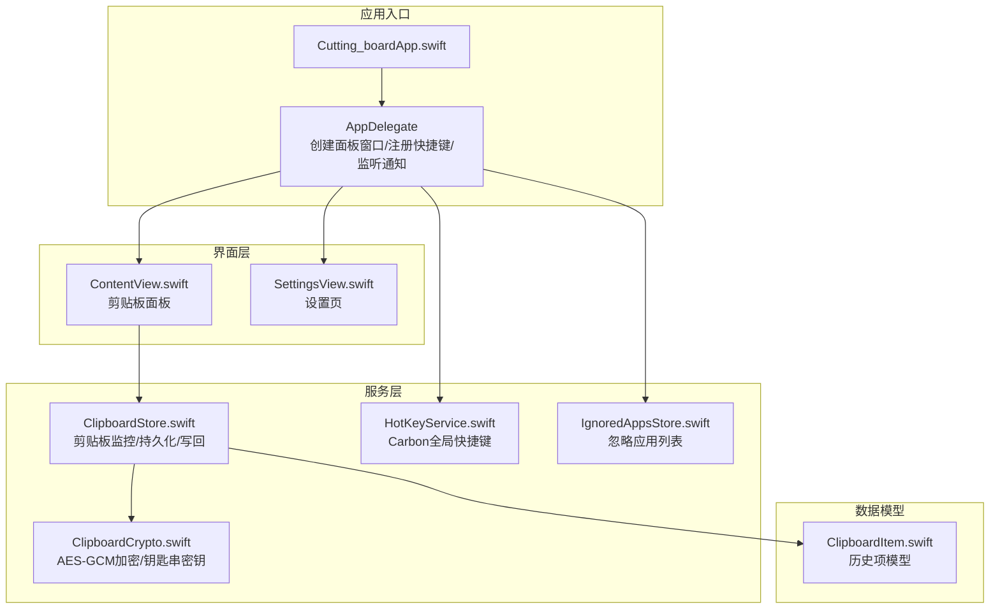
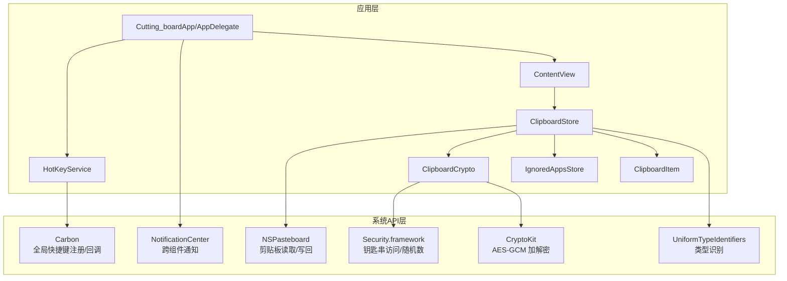
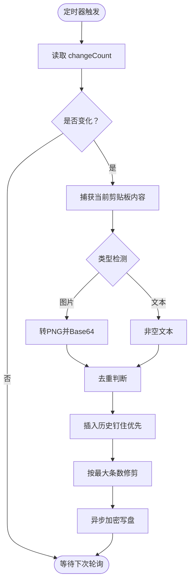
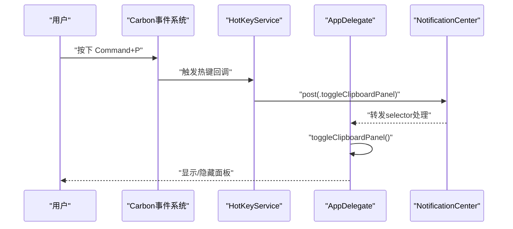
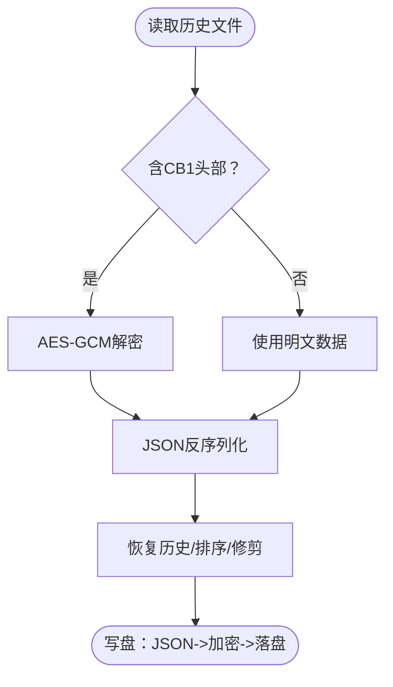
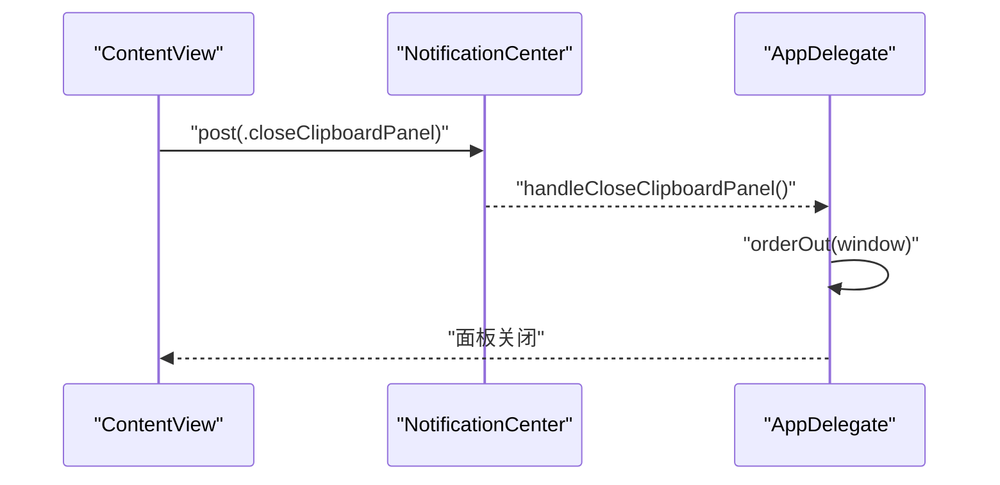
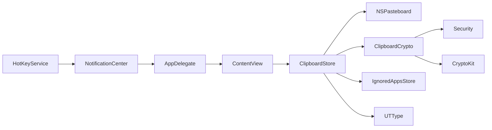

# 系统集成与API

<cite>
**本文引用的文件**
- [Cutting_board/Cutting_board/Cutting_boardApp.swift](file://Cutting_board/Cutting_board/Cutting_boardApp.swift)
- [Cutting_board/Cutting_board/Services/ClipboardStore.swift](file://Cutting_board/Cutting_board/Services/ClipboardStore.swift)
- [Cutting_board/Cutting_board/Models/ClipboardItem.swift](file://Cutting_board/Cutting_board/Models/ClipboardItem.swift)
- [Cutting_board/Cutting_board/Services/ClipboardCrypto.swift](file://Cutting_board/Cutting_board/Services/ClipboardCrypto.swift)
- [Cutting_board/Cutting_board/Services/HotKeyService.swift](file://Cutting_board/Cutting_board/Services/HotKeyService.swift)
- [Cutting_board/Cutting_board/Services/IgnoredAppsStore.swift](file://Cutting_board/Cutting_board/Services/IgnoredAppsStore.swift)
- [Cutting_board/Cutting_board/ContentView.swift](file://Cutting_board/Cutting_board/ContentView.swift)
- [Cutting_board/Cutting_board/SettingsView.swift](file://Cutting_board/Cutting_board/SettingsView.swift)
- [Cutting_board/build/Build/Intermediates.noindex/Cutting_board.build/Debug/Cutting_board.build/DerivedSources/Entitlements.plist](file://build/Build/Intermediates.noindex/Cutting_board.build/Debug/Cutting_board.build/DerivedSources/Entitlements.plist)
- [Cutting_board/build/Build/Products/Debug/ding.app/Contents/Info.plist](file://build/Build/Products/Debug/ding.app/Contents/Info.plist)
</cite>

## 目录
1. [简介](#简介)
2. [项目结构](#项目结构)
3. [核心组件](#核心组件)
4. [架构总览](#架构总览)
5. [组件详解](#组件详解)
6. [依赖关系分析](#依赖关系分析)
7. [性能考量](#性能考量)
8. [故障排查指南](#故障排查指南)
9. [结论](#结论)
10. [附录](#附录)

## 简介
本文件面向Cutting_board系统的“系统集成与API”主题，围绕以下目标展开：
- NSPasteboard API集成：剪贴板内容监听、格式检测与数据提取机制
- Carbon API在全局快捷键注册中的应用：快捷键组合定义、事件回调与权限管理
- Security.framework集成：钥匙串访问、密钥生成与AES-GCM加密的数据存储
- NotificationCenter在组件间通信中的作用与通知机制实现
- 系统权限配置、沙盒限制与兼容性考虑
- API使用的最佳实践与错误处理策略

## 项目结构
Cutting_board采用模块化组织，核心目录与职责如下：
- Models：数据模型层，如剪贴板历史项
- Services：服务层，负责剪贴板监控、加密、全局快捷键与忽略应用列表
- Views：界面层，包含主面板与设置页
- 应用入口：AppDelegate负责后台运行、全局快捷键注册与通知转发

图表来源
- [Cutting_board/Cutting_board/Cutting_boardApp.swift](file://Cutting_board/Cutting_board/Cutting_boardApp.swift#L11-L31)
- [Cutting_board/Cutting_board/Cutting_boardApp.swift](file://Cutting_board/Cutting_board/Cutting_boardApp.swift#L35-L144)
- [Cutting_board/Cutting_board/ContentView.swift](file://Cutting_board/Cutting_board/ContentView.swift#L20-L305)
- [Cutting_board/Cutting_board/SettingsView.swift](file://Cutting_board/Cutting_board/SettingsView.swift#L11-L95)
- [Cutting_board/Cutting_board/Services/ClipboardStore.swift](file://Cutting_board/Cutting_board/Services/ClipboardStore.swift#L14-L223)
- [Cutting_board/Cutting_board/Models/ClipboardItem.swift](file://Cutting_board/Cutting_board/Models/ClipboardItem.swift#L17-L90)
- [Cutting_board/Cutting_board/Services/ClipboardCrypto.swift](file://Cutting_board/Cutting_board/Services/ClipboardCrypto.swift#L16-L73)
- [Cutting_board/Cutting_board/Services/HotKeyService.swift](file://Cutting_board/Cutting_board/Services/HotKeyService.swift#L30-L82)
- [Cutting_board/Cutting_board/Services/IgnoredAppsStore.swift](file://Cutting_board/Cutting_board/Services/IgnoredAppsStore.swift#L16-L40)

章节来源
- [Cutting_board/Cutting_board/Cutting_boardApp.swift](file://Cutting_board/Cutting_board/Cutting_boardApp.swift#L11-L31)
- [Cutting_board/Cutting_board/Cutting_boardApp.swift](file://Cutting_board/Cutting_board/Cutting_boardApp.swift#L35-L144)
- [Cutting_board/Cutting_board/ContentView.swift](file://Cutting_board/Cutting_board/ContentView.swift#L20-L305)
- [Cutting_board/Cutting_board/SettingsView.swift](file://Cutting_board/Cutting_board/SettingsView.swift#L11-L95)
- [Cutting_board/Cutting_board/Services/ClipboardStore.swift](file://Cutting_board/Cutting_board/Services/ClipboardStore.swift#L14-L223)
- [Cutting_board/Cutting_board/Models/ClipboardItem.swift](file://Cutting_board/Cutting_board/Models/ClipboardItem.swift#L17-L90)
- [Cutting_board/Cutting_board/Services/ClipboardCrypto.swift](file://Cutting_board/Cutting_board/Services/ClipboardCrypto.swift#L16-L73)
- [Cutting_board/Cutting_board/Services/HotKeyService.swift](file://Cutting_board/Cutting_board/Services/HotKeyService.swift#L30-L82)
- [Cutting_board/Cutting_board/Services/IgnoredAppsStore.swift](file://Cutting_board/Cutting_board/Services/IgnoredAppsStore.swift#L16-L40)

## 核心组件
- 剪贴板监控与历史存储：通过定时轮询NSPasteboard变更，识别文本与图片，去重与排序，并持久化至磁盘，同时进行加密存储
- 加密与密钥管理：基于Security.framework的钥匙串访问，结合CryptoKit的AES-GCM实现历史文件的加解密
- 全局快捷键：使用Carbon API注册Command+P全局快捷键，无需辅助功能权限，通过通知驱动面板切换
- 组件间通信：通过NotificationCenter在AppDelegate、ContentView与服务层之间传递显示/隐藏/切换面板的通知
- 忽略应用列表：维护用户配置的忽略应用Bundle ID集合，避免从特定应用复制的内容进入历史

章节来源
- [Cutting_board/Cutting_board/Services/ClipboardStore.swift](file://Cutting_board/Cutting_board/Services/ClipboardStore.swift#L14-L223)
- [Cutting_board/Cutting_board/Services/ClipboardCrypto.swift](file://Cutting_board/Cutting_board/Services/ClipboardCrypto.swift#L16-L73)
- [Cutting_board/Cutting_board/Services/HotKeyService.swift](file://Cutting_board/Cutting_board/Services/HotKeyService.swift#L30-L82)
- [Cutting_board/Cutting_board/Cutting_boardApp.swift](file://Cutting_board/Cutting_board/Cutting_boardApp.swift#L46-L72)
- [Cutting_board/Cutting_board/Services/IgnoredAppsStore.swift](file://Cutting_board/Cutting_board/Services/IgnoredAppsStore.swift#L16-L40)

## 架构总览
下图展示Cutting_board在系统API层面的关键交互：NSPasteboard监听、Carbon快捷键、Security钥匙串与CryptoKit加密、NotificationCenter通信以及沙盒与LSUIElement配置。

图表来源
- [Cutting_board/Cutting_board/Cutting_boardApp.swift](file://Cutting_board/Cutting_board/Cutting_boardApp.swift#L35-L144)
- [Cutting_board/Cutting_board/Services/ClipboardStore.swift](file://Cutting_board/Cutting_board/Services/ClipboardStore.swift#L14-L223)
- [Cutting_board/Cutting_board/Services/ClipboardCrypto.swift](file://Cutting_board/Cutting_board/Services/ClipboardCrypto.swift#L16-L73)
- [Cutting_board/Cutting_board/Services/HotKeyService.swift](file://Cutting_board/Cutting_board/Services/HotKeyService.swift#L30-L82)
- [Cutting_board/Cutting_board/Services/IgnoredAppsStore.swift](file://Cutting_board/Cutting_board/Services/IgnoredAppsStore.swift#L16-L40)
- [Cutting_board/Cutting_board/Models/ClipboardItem.swift](file://Cutting_board/Cutting_board/Models/ClipboardItem.swift#L17-L90)
- [Cutting_board/Cutting_board/ContentView.swift](file://Cutting_board/Cutting_board/ContentView.swift#L20-L305)

## 组件详解

### NSPasteboard集成：剪贴板内容监听、格式检测与数据提取
- 监听机制：每500ms检查一次NSPasteboard.changeCount，变化时触发内容捕获
- 内容捕获顺序：优先尝试图片（PNG编码Base64），再尝试纯文本；去除空白文本
- 去重与排序：与最近一次历史项内容与类型一致则跳过；钉住项优先，其余按时间倒序
- 写回系统剪贴板：根据类型分别设置字符串或写入图像对象
- 忽略应用：若前台应用Bundle ID在忽略列表中则跳过
- 类型识别：使用UTType与NSImage构造器辅助判断与转换

图表来源
- [Cutting_board/Cutting_board/Services/ClipboardStore.swift](file://Cutting_board/Cutting_board/Services/ClipboardStore.swift#L47-L90)
- [Cutting_board/Cutting_board/Services/ClipboardStore.swift](file://Cutting_board/Cutting_board/Services/ClipboardStore.swift#L94-L115)
- [Cutting_board/Cutting_board/Services/ClipboardStore.swift](file://Cutting_board/Cutting_board/Services/ClipboardStore.swift#L183-L221)

章节来源
- [Cutting_board/Cutting_board/Services/ClipboardStore.swift](file://Cutting_board/Cutting_board/Services/ClipboardStore.swift#L14-L223)
- [Cutting_board/Cutting_board/Models/ClipboardItem.swift](file://Cutting_board/Cutting_board/Models/ClipboardItem.swift#L17-L90)
- [Cutting_board/Cutting_board/Services/IgnoredAppsStore.swift](file://Cutting_board/Cutting_board/Services/IgnoredAppsStore.swift#L16-L40)

### Carbon API：全局快捷键注册与事件回调
- 快捷键组合：Command+P（字母P的虚拟键码），签名与ID固定
- 注册流程：安装应用级事件处理器，注册热键；失败时回滚移除处理器
- 回调处理：C可调用回调中通过NotificationCenter发布“切换面板”通知
- 权限说明：无需辅助功能权限，直接使用Carbon API即可

图表来源
- [Cutting_board/Cutting_board/Services/HotKeyService.swift](file://Cutting_board/Cutting_board/Services/HotKeyService.swift#L30-L82)
- [Cutting_board/Cutting_board/Cutting_boardApp.swift](file://Cutting_board/Cutting_board/Cutting_boardApp.swift#L46-L72)
- [Cutting_board/Cutting_board/Cutting_boardApp.swift](file://Cutting_board/Cutting_board/Cutting_boardApp.swift#L135-L142)

章节来源
- [Cutting_board/Cutting_board/Services/HotKeyService.swift](file://Cutting_board/Cutting_board/Services/HotKeyService.swift#L30-L82)
- [Cutting_board/Cutting_board/Cutting_boardApp.swift](file://Cutting_board/Cutting_board/Cutting_boardApp.swift#L46-L72)

### Security.framework与CryptoKit：钥匙串访问、密钥生成与加密存储
- 密钥生成：首次使用时通过SecRandom生成32字节密钥，保存至钥匙串
- 加密格式：文件头标识“CB1”，随后为AES-GCM密封后的combined数据
- 解密兼容：若无头部则视为明文兼容；成功解密后按JSON解析
- 存储策略：异步队列中序列化JSON、加密并写入磁盘；读取时先解密再反序列化

图表来源
- [Cutting_board/Cutting_board/Services/ClipboardCrypto.swift](file://Cutting_board/Cutting_board/Services/ClipboardCrypto.swift#L38-L46)
- [Cutting_board/Cutting_board/Services/ClipboardStore.swift](file://Cutting_board/Cutting_board/Services/ClipboardStore.swift#L183-L221)

章节来源
- [Cutting_board/Cutting_board/Services/ClipboardCrypto.swift](file://Cutting_board/Cutting_board/Services/ClipboardCrypto.swift#L16-L73)
- [Cutting_board/Cutting_board/Services/ClipboardStore.swift](file://Cutting_board/Cutting_board/Services/ClipboardStore.swift#L183-L221)

### NotificationCenter：组件间通信与通知机制
- 定义通知：显示、关闭、切换面板三类通知名称
- 发布方：ContentView在用户操作（如回车粘贴、关闭按钮）时发布通知
- 订阅方：AppDelegate在应用生命周期内注册观察者，统一处理面板显示/隐藏/切换
- 优点：解耦UI与应用逻辑，便于扩展更多交互入口

图表来源
- [Cutting_board/Cutting_board/ContentView.swift](file://Cutting_board/Cutting_board/ContentView.swift#L294-L296)
- [Cutting_board/Cutting_board/Cutting_boardApp.swift](file://Cutting_board/Cutting_board/Cutting_boardApp.swift#L49-L72)

章节来源
- [Cutting_board/Cutting_board/ContentView.swift](file://Cutting_board/Cutting_board/ContentView.swift#L294-L296)
- [Cutting_board/Cutting_board/Cutting_boardApp.swift](file://Cutting_board/Cutting_board/Cutting_boardApp.swift#L49-L72)

### 数据模型与界面交互
- ClipboardItem：包含内容、类型、时间戳、图片Base64、钉住状态与备注
- ContentView：提供搜索、列表渲染、行内操作（备注、钉住、删除）、键盘导航与双击粘贴
- SettingsView：管理忽略应用列表，支持图标与名称展示、添加与移除

章节来源
- [Cutting_board/Cutting_board/Models/ClipboardItem.swift](file://Cutting_board/Cutting_board/Models/ClipboardItem.swift#L17-L90)
- [Cutting_board/Cutting_board/ContentView.swift](file://Cutting_board/Cutting_board/ContentView.swift#L20-L305)
- [Cutting_board/Cutting_board/SettingsView.swift](file://Cutting_board/Cutting_board/SettingsView.swift#L11-L95)

## 依赖关系分析
- 组件耦合与内聚：ClipboardStore高内聚于剪贴板与历史管理；HotKeyService与ClipboardStore通过通知解耦；Crypto与Keychain低耦合封装
- 外部依赖：AppKit（NSPasteboard/NSImage/NSWorkspace）、Carbon（全局快捷键）、Security（钥匙串）、CryptoKit（AES-GCM）、UniformTypeIdentifiers（类型识别）
- 潜在循环依赖：未见直接循环；通知广播模式避免了环状依赖
- 接口契约：ClipboardStore暴露ObservableObject接口；HotKeyService提供静态注册/注销；IgnoredAppsStore提供集合操作

图表来源
- [Cutting_board/Cutting_board/Services/HotKeyService.swift](file://Cutting_board/Cutting_board/Services/HotKeyService.swift#L30-L82)
- [Cutting_board/Cutting_board/Cutting_boardApp.swift](file://Cutting_board/Cutting_board/Cutting_boardApp.swift#L46-L72)
- [Cutting_board/Cutting_board/ContentView.swift](file://Cutting_board/Cutting_board/ContentView.swift#L20-L305)
- [Cutting_board/Cutting_board/Services/ClipboardStore.swift](file://Cutting_board/Cutting_board/Services/ClipboardStore.swift#L14-L223)
- [Cutting_board/Cutting_board/Services/ClipboardCrypto.swift](file://Cutting_board/Cutting_board/Services/ClipboardCrypto.swift#L16-L73)
- [Cutting_board/Cutting_board/Services/IgnoredAppsStore.swift](file://Cutting_board/Cutting_board/Services/IgnoredAppsStore.swift#L16-L40)

章节来源
- [Cutting_board/Cutting_board/Services/HotKeyService.swift](file://Cutting_board/Cutting_board/Services/HotKeyService.swift#L30-L82)
- [Cutting_board/Cutting_board/Cutting_boardApp.swift](file://Cutting_board/Cutting_board/Cutting_boardApp.swift#L46-L72)
- [Cutting_board/Cutting_board/Services/ClipboardStore.swift](file://Cutting_board/Cutting_board/Services/ClipboardStore.swift#L14-L223)
- [Cutting_board/Cutting_board/Services/ClipboardCrypto.swift](file://Cutting_board/Cutting_board/Services/ClipboardCrypto.swift#L16-L73)
- [Cutting_board/Cutting_board/Services/IgnoredAppsStore.swift](file://Cutting_board/Cutting_board/Services/IgnoredAppsStore.swift#L16-L40)

## 性能考量
- 轮询频率：500ms间隔平衡实时性与CPU占用；可根据需要调整定时器周期
- 异步IO：读写磁盘与加密均在后台队列执行，避免阻塞主线程
- 去重与修剪：插入前去重、按最大条数修剪，控制内存与磁盘占用
- 图像缩略图：按需生成缩略图，避免重复解码与渲染
- 通知与观察：使用弱引用与主线程调度，减少不必要的刷新

## 故障排查指南
- 剪贴板无响应
  - 检查定时器是否启动与RunLoop是否添加
  - 确认changeCount是否变化，必要时手动触发一次捕获
  - 查看忽略应用列表是否误判当前前台应用
- 快捷键无效
  - 确认注册返回状态；若失败，检查是否重复注册或资源释放
  - 确保未授予辅助功能权限（当前实现无需）
- 历史无法读取/乱码
  - 检查文件头是否为“CB1”；若不是，确认是否为旧版明文
  - 核对钥匙串中密钥是否存在且长度正确
- 面板无法显示
  - 确认AppDelegate已创建面板窗口并保持不随最后一个窗口关闭而终止
  - 检查通知订阅是否在应用启动时完成

章节来源
- [Cutting_board/Cutting_board/Services/ClipboardStore.swift](file://Cutting_board/Cutting_board/Services/ClipboardStore.swift#L47-L60)
- [Cutting_board/Cutting_board/Services/ClipboardStore.swift](file://Cutting_board/Cutting_board/Services/ClipboardStore.swift#L183-L221)
- [Cutting_board/Cutting_board/Services/ClipboardCrypto.swift](file://Cutting_board/Cutting_board/Services/ClipboardCrypto.swift#L48-L60)
- [Cutting_board/Cutting_board/Services/HotKeyService.swift](file://Cutting_board/Cutting_board/Services/HotKeyService.swift#L36-L69)
- [Cutting_board/Cutting_board/Cutting_boardApp.swift](file://Cutting_board/Cutting_board/Cutting_boardApp.swift#L74-L76)
- [Cutting_board/Cutting_board/Cutting_boardApp.swift](file://Cutting_board/Cutting_board/Cutting_boardApp.swift#L46-L72)

## 结论
Cutting_board通过NSPasteboard实现剪贴板内容的高效捕获与持久化，借助Security与CryptoKit确保历史数据的机密性；Carbon API提供无需辅助功能权限的全局快捷键体验；NotificationCenter在组件间建立松耦合通信。配合沙盒与LSUIElement配置，系统在功能完整性与安全性之间取得良好平衡。

## 附录

### 系统权限与沙盒配置
- LSUIElement：应用以菜单栏额外形式运行，不依赖WindowGroup创建主窗口
- 沙盒能力：用户选择只读文件访问能力（用于读取用户选择的文件场景，当前实现未直接使用）
- 辅助功能权限：当前全局快捷键实现无需该权限

章节来源
- [Cutting_board/build/Build/Products/Debug/ding.app/Contents/Info.plist](file://build/Build/Products/Debug/ding.app/Contents/Info.plist#L47-L50)
- [Cutting_board/build/Build/Intermediates.noindex/Cutting_board.build/Debug/Cutting_board.build/DerivedSources/Entitlements.plist](file://build/Build/Intermediates.noindex/Cutting_board.build/Debug/Cutting_board.build/DerivedSources/Entitlements.plist#L4-L10)

### 兼容性与版本要求
- 最低系统版本：根据Info.plist中LSMinimumSystemVersion字段确定
- SDK与编译器：Xcode与SDK版本信息可在Info.plist中查看

章节来源
- [Cutting_board/build/Build/Products/Debug/ding.app/Contents/Info.plist](file://build/Build/Products/Debug/ding.app/Contents/Info.plist#L47-L48)
- [Cutting_board/build/Build/Products/Debug/ding.app/Contents/Info.plist](file://build/Build/Products/Debug/ding.app/Contents/Info.plist#L32-L46)