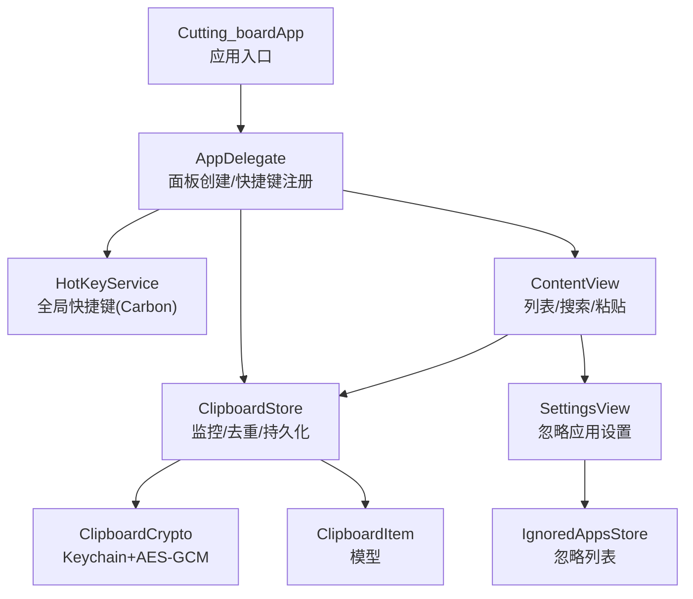
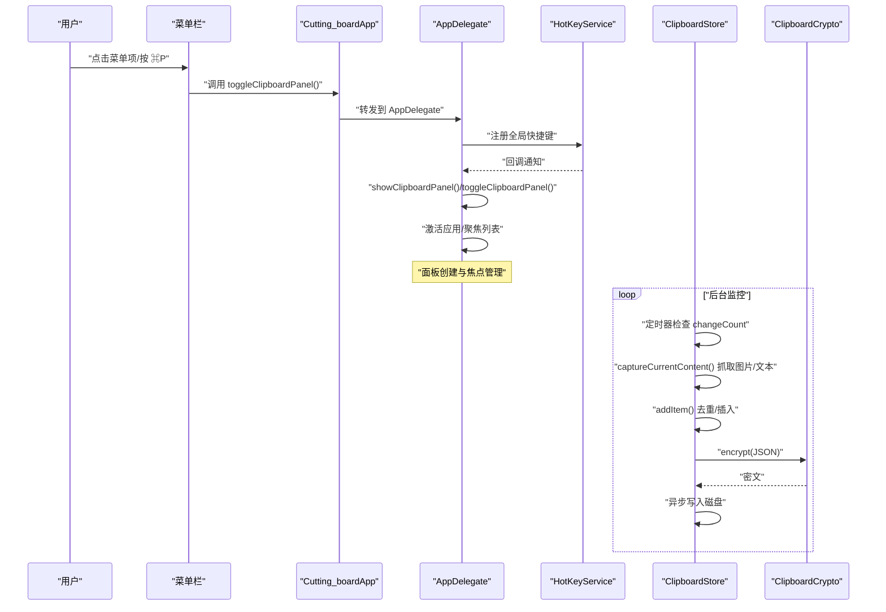
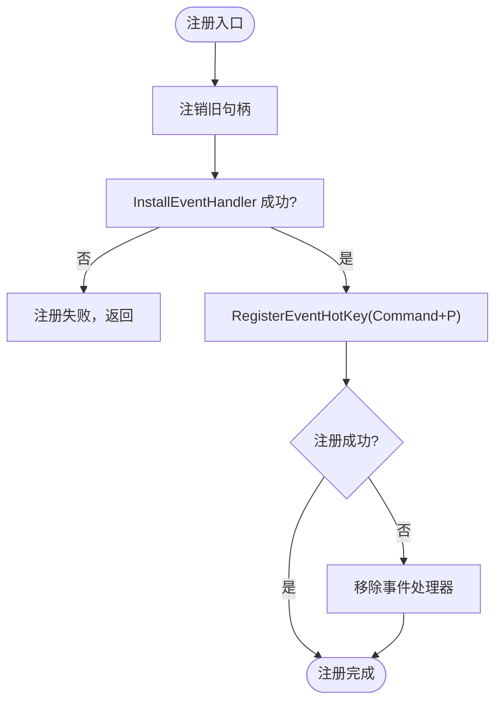
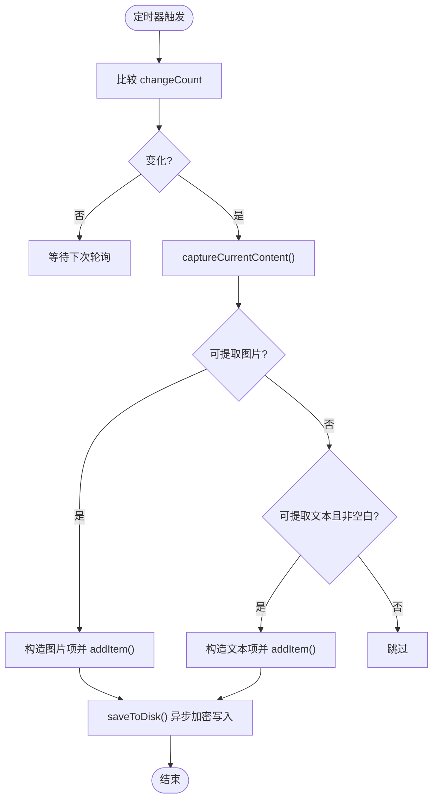
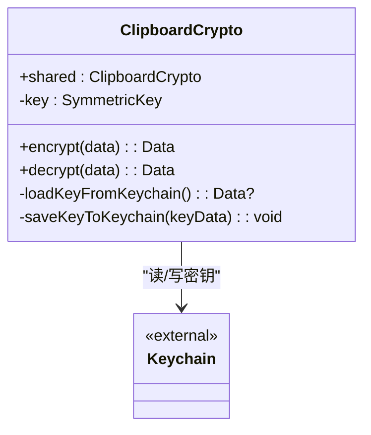
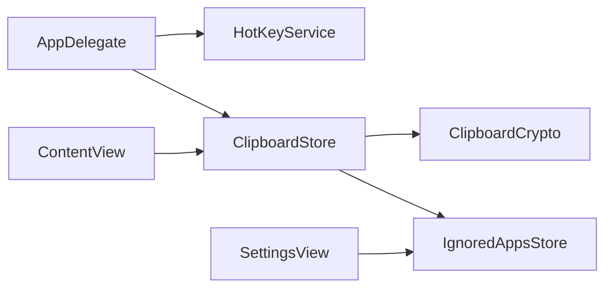

# 故障排除

<cite>
**本文引用的文件**   
- [HotKeyService.swift](file://Cutting_board/Services/HotKeyService.swift)
- [ClipboardCrypto.swift](file://Cutting_board/Services/ClipboardCrypto.swift)
- [ClipboardStore.swift](file://Cutting_board/Services/ClipboardStore.swift)
- [ClipboardItem.swift](file://Cutting_board/Models/ClipboardItem.swift)
- [Cutting_boardApp.swift](file://Cutting_board/Cutting_boardApp.swift)
- [ContentView.swift](file://Cutting_board/ContentView.swift)
- [SettingsView.swift](file://Cutting_board/SettingsView.swift)
- [IgnoredAppsStore.swift](file://Cutting_board/Services/IgnoredAppsStore.swift)
- [build-and-package.sh](file://build-and-package.sh)
</cite>

## 目录
1. [简介](#简介)
2. [项目结构](#项目结构)
3. [核心组件](#核心组件)
4. [架构总览](#架构总览)
5. [详细组件分析](#详细组件分析)
6. [依赖关系分析](#依赖关系分析)
7. [性能注意事项](#性能注意事项)
8. [故障排除指南](#故障排除指南)
9. [结论](#结论)
10. [附录](#附录)

## 简介
本指南面向使用 Cutting_board 的用户与维护者，聚焦于常见问题的定位与解决，包括：
- 快捷键失效
- 剪贴板监控异常
- 数据加密与历史文件读写问题
- 性能问题（内存泄漏、CPU 占用高、响应慢）
- 系统兼容性（macOS 版本差异、权限配置）
- 日志与诊断方法
- 用户反馈与问题报告模板

本指南结合源码中的实现细节，提供可操作的排查步骤与修复建议。

## 项目结构
Cutting_board 是一个基于 SwiftUI 的菜单栏工具，通过全局快捷键唤起剪贴板历史面板，并在后台持续监控系统剪贴板，将历史持久化至本地并进行加密存储。主要模块如下：
- 应用入口与生命周期：AppDelegate、Cutting_boardApp
- 剪贴板监控与存储：ClipboardStore（定时轮询 NSPasteboard，去重、排序、持久化）
- 加密服务：ClipboardCrypto（Keychain + AES-GCM）
- 快捷键服务：HotKeyService（Carbon API 注册全局快捷键）
- 视图层：ContentView（列表、搜索、备注、粘贴）、SettingsView（忽略应用）
- 辅助存储：IgnoredAppsStore（忽略应用列表）

图表来源
- [Cutting_boardApp.swift](file://Cutting_board/Cutting_boardApp.swift#L35-L144)
- [HotKeyService.swift](file://Cutting_board/Services/HotKeyService.swift#L30-L82)
- [ClipboardStore.swift](file://Cutting_board/Services/ClipboardStore.swift#L14-L223)
- [ClipboardCrypto.swift](file://Cutting_board/Services/ClipboardCrypto.swift#L16-L73)
- [ClipboardItem.swift](file://Cutting_board/Models/ClipboardItem.swift#L17-L90)
- [ContentView.swift](file://Cutting_board/ContentView.swift#L20-L305)
- [SettingsView.swift](file://Cutting_board/SettingsView.swift#L11-L95)
- [IgnoredAppsStore.swift](file://Cutting_board/Services/IgnoredAppsStore.swift#L16-L40)

章节来源
- [Cutting_boardApp.swift](file://Cutting_board/Cutting_boardApp.swift#L11-L31)
- [HotKeyService.swift](file://Cutting_board/Services/HotKeyService.swift#L30-L82)
- [ClipboardStore.swift](file://Cutting_board/Services/ClipboardStore.swift#L14-L223)
- [ClipboardCrypto.swift](file://Cutting_board/Services/ClipboardCrypto.swift#L16-L73)
- [ClipboardItem.swift](file://Cutting_board/Models/ClipboardItem.swift#L17-L90)
- [ContentView.swift](file://Cutting_board/ContentView.swift#L20-L305)
- [SettingsView.swift](file://Cutting_board/SettingsView.swift#L11-L95)
- [IgnoredAppsStore.swift](file://Cutting_board/Services/IgnoredAppsStore.swift#L16-L40)

## 核心组件
- 全局快捷键：通过 Carbon API 注册 Command+P，在应用前台/后台均可触发，避免了辅助功能权限要求。
- 剪贴板监控：每 0.5 秒轮询一次 NSPasteboard.changeCount，变化时尝试抓取图片或文本，去重后插入历史并持久化。
- 加密存储：历史文件以“magicHeader + AES-GCM 密文”形式保存；首次使用生成随机密钥并写入 Keychain。
- 面板交互：菜单栏唤起/切换面板，支持键盘导航、搜索、备注、钉住、删除、清空等。
- 忽略应用：可配置不保存来自某些应用的复制内容，减少噪声。

章节来源
- [HotKeyService.swift](file://Cutting_board/Services/HotKeyService.swift#L30-L82)
- [ClipboardStore.swift](file://Cutting_board/Services/ClipboardStore.swift#L47-L90)
- [ClipboardCrypto.swift](file://Cutting_board/Services/ClipboardCrypto.swift#L32-L46)
- [ContentView.swift](file://Cutting_board/ContentView.swift#L61-L95)
- [IgnoredAppsStore.swift](file://Cutting_board/Services/IgnoredAppsStore.swift#L16-L40)

## 架构总览

图表来源
- [Cutting_boardApp.swift](file://Cutting_board/Cutting_boardApp.swift#L15-L31)
- [Cutting_boardApp.swift](file://Cutting_board/Cutting_boardApp.swift#L100-L142)
- [HotKeyService.swift](file://Cutting_board/Services/HotKeyService.swift#L36-L69)
- [ClipboardStore.swift](file://Cutting_board/Services/ClipboardStore.swift#L47-L90)
- [ClipboardCrypto.swift](file://Cutting_board/Services/ClipboardCrypto.swift#L32-L36)

## 详细组件分析

### 组件一：全局快捷键（HotKeyService）
- 注册方式：Carbon API，无需辅助功能权限，Command+P 触发。
- 回调：在主线程发布通知，驱动面板显示/隐藏。
- 注销：应用终止时移除事件处理器与热键引用。

图表来源
- [HotKeyService.swift](file://Cutting_board/Services/HotKeyService.swift#L36-L69)

章节来源
- [HotKeyService.swift](file://Cutting_board/Services/HotKeyService.swift#L30-L82)
- [Cutting_boardApp.swift](file://Cutting_board/Cutting_boardApp.swift#L46-L72)

### 组件二：剪贴板监控与存储（ClipboardStore）
- 定时轮询：0.5 秒间隔，比较 changeCount，变化时抓取当前内容。
- 抓取策略：优先图片（PNG Base64），其次纯文本（去除空白）。
- 去重与排序：与首项内容/图片 Base64 相同则跳过；钉住项置顶，未钉住按时间倒序。
- 持久化：JSON 编码后经 AES-GCM 加密，写入 Application Support/Cutting_board/history.json。
- 读取：尝试解密，失败则回退为明文；解析后排序并裁剪至最大条数。

图表来源
- [ClipboardStore.swift](file://Cutting_board/Services/ClipboardStore.swift#L47-L90)
- [ClipboardStore.swift](file://Cutting_board/Services/ClipboardStore.swift#L183-L221)

章节来源
- [ClipboardStore.swift](file://Cutting_board/Services/ClipboardStore.swift#L14-L223)
- [ClipboardItem.swift](file://Cutting_board/Models/ClipboardItem.swift#L17-L90)

### 组件三：加密与密钥管理（ClipboardCrypto）
- 密钥来源：Keychain 中读取 32 字节密钥；不存在则随机生成并写入。
- 加密格式：magicHeader + sealedBox.combined。
- 兼容性：若文件不含 magicHeader，则视为明文直接返回。

图表来源
- [ClipboardCrypto.swift](file://Cutting_board/Services/ClipboardCrypto.swift#L16-L73)

章节来源
- [ClipboardCrypto.swift](file://Cutting_board/Services/ClipboardCrypto.swift#L16-L73)

### 组件四：视图与交互（ContentView、SettingsView）
- 列表：支持搜索（内容/备注）、键盘方向键导航、回车粘贴、Esc 关闭。
- 备注：支持为单项添加/编辑备注，用于检索。
- 设置：忽略应用列表，支持添加/移除，展示应用名与图标。
- 面板：菜单栏唤起/切换，激活应用并将焦点置于列表首项。

章节来源
- [ContentView.swift](file://Cutting_board/ContentView.swift#L20-L305)
- [SettingsView.swift](file://Cutting_board/SettingsView.swift#L11-L95)
- [Cutting_boardApp.swift](file://Cutting_board/Cutting_boardApp.swift#L100-L142)

### 组件五：忽略应用（IgnoredAppsStore）
- 存储：UserDefaults 数组键值。
- 功能：添加/移除/查询，配合 ClipboardStore 在抓取前判断是否忽略当前前台应用。

章节来源
- [IgnoredAppsStore.swift](file://Cutting_board/Services/IgnoredAppsStore.swift#L16-L40)
- [ClipboardStore.swift](file://Cutting_board/Services/ClipboardStore.swift#L62-L69)

## 依赖关系分析
- AppDelegate 依赖 HotKeyService 进行快捷键注册，依赖 ClipboardStore 提供历史数据，负责面板创建与焦点管理。
- ContentView 依赖 ClipboardStore 进行数据展示与交互，依赖 SettingsView 进行设置。
- ClipboardStore 依赖 ClipboardCrypto 进行加解密，依赖 NSPasteboard 与 UserDefaults。
- IgnoredAppsStore 与 ClipboardStore 协作，控制忽略应用逻辑。

图表来源
- [Cutting_boardApp.swift](file://Cutting_board/Cutting_boardApp.swift#L35-L144)
- [ClipboardStore.swift](file://Cutting_board/Services/ClipboardStore.swift#L14-L223)
- [ClipboardCrypto.swift](file://Cutting_board/Services/ClipboardCrypto.swift#L16-L73)
- [IgnoredAppsStore.swift](file://Cutting_board/Services/IgnoredAppsStore.swift#L16-L40)

章节来源
- [Cutting_boardApp.swift](file://Cutting_board/Cutting_boardApp.swift#L35-L144)
- [ClipboardStore.swift](file://Cutting_board/Services/ClipboardStore.swift#L14-L223)

## 性能注意事项
- 监控频率：0.5 秒轮询，属于轻量级；若系统剪贴板频繁变动，建议检查目标应用是否产生大量中间状态。
- 图像处理：图片抓取与 PNG 编码可能带来额外开销；缩略图缓存与懒加载有助于降低 UI 卡顿。
- 持久化：加密/解密与 JSON 编解码在主线程之外的队列执行，但磁盘写入仍可能受 I/O 影响。
- 动画与布局：视图层使用轻量动画与玻璃效果，建议在性能问题时检查是否存在不必要的视图重建。

[本节为通用指导，不直接分析具体文件]

## 故障排除指南

### 快捷键失效（Command+P 无法唤起面板）
- 现象
  - 按下 Command+P 无反应
  - 面板不显示或无法聚焦
- 排查步骤
  1) 确认应用已启动且菜单栏可见。
  2) 检查是否正确注册全局快捷键：查看注册流程是否返回成功。
  3) 验证是否有其他应用占用相同快捷键组合。
  4) 重启应用以重新注册快捷键。
- 诊断要点
  - 注册/注销路径：参考注册与注销实现，确认事件处理器与热键引用存在。
  - 回调触发：确认通知名称与监听是否一致。
- 修复建议
  - 重新安装/重装应用以确保 Carbon 注册正常。
  - 如系统升级导致权限变更，重新启动应用以重新注册。

章节来源
- [HotKeyService.swift](file://Cutting_board/Services/HotKeyService.swift#L36-L80)
- [Cutting_boardApp.swift](file://Cutting_board/Cutting_boardApp.swift#L46-L72)

### 剪贴板监控异常（无历史、历史不更新）
- 现象
  - 复制内容后历史列表无新增
  - 历史不随复制行为更新
- 排查步骤
  1) 检查定时器是否运行：确认定时器已创建并加入 RunLoop。
  2) 检查 changeCount 是否变化：对比上次 changeCount 与当前值。
  3) 检查抓取逻辑：是否命中图片路径或文本路径。
  4) 检查忽略应用：当前前台应用是否在忽略列表中。
  5) 检查磁盘读写：确认历史文件存在且可读写。
- 诊断要点
  - 抓取顺序：优先图片（PNG Base64），再文本（非空白）。
  - 去重策略：与首项内容/图片 Base64 相同则跳过。
  - 持久化：加密写入失败时应不影响后续读取（回退为明文）。
- 修复建议
  - 清理并重建历史目录，确保写权限。
  - 检查忽略应用设置，必要时移除误判的应用。
  - 降低最大条数或清理历史以减少一次性写入压力。

章节来源
- [ClipboardStore.swift](file://Cutting_board/Services/ClipboardStore.swift#L47-L90)
- [ClipboardStore.swift](file://Cutting_board/Services/ClipboardStore.swift#L183-L221)
- [IgnoredAppsStore.swift](file://Cutting_board/Services/IgnoredAppsStore.swift#L36-L39)

### 数据加密与历史文件问题
- 现象
  - 历史文件无法读取或显示为空
  - 解密报错或提示无效值
- 排查步骤
  1) 检查历史文件头部：是否包含 magicHeader。
  2) 检查 Keychain 中密钥：是否存在 32 字节密钥。
  3) 检查加密/解密流程：combined 是否存在，sealedBox 是否可还原。
  4) 检查文件权限：应用支持目录写权限。
- 诊断要点
  - 兼容策略：若无 magicHeader，视为明文直接返回。
  - 密钥生成：首次使用随机生成并写入 Keychain。
- 修复建议
  - 清理历史文件后重启应用，触发重新加密写入。
  - 如 Keychain 异常，尝试在系统钥匙串中删除对应条目后重启应用让其重新生成。

章节来源
- [ClipboardCrypto.swift](file://Cutting_board/Services/ClipboardCrypto.swift#L32-L46)
- [ClipboardCrypto.swift](file://Cutting_board/Services/ClipboardCrypto.swift#L48-L71)
- [ClipboardStore.swift](file://Cutting_board/Services/ClipboardStore.swift#L192-L196)

### 性能问题（内存泄漏、CPU 占用高、响应慢）
- 现象
  - CPU 占用偏高
  - 面板滚动卡顿
  - 响应延迟明显
- 排查步骤
  1) 检查历史规模：maxItems 是否过大导致渲染与序列化压力。
  2) 检查图像缩略图缓存：图片项较多时缩略图生成与缓存可能成为瓶颈。
  3) 检查动画与过渡：视图层存在弹簧动画与透明度过渡，必要时减少动画。
  4) 使用 Instruments 分析：SwiftUI 模板定位重渲染热点。
- 诊断要点
  - 监控线程：存储读写在专用队列执行，避免阻塞主线程。
  - 去重与裁剪：频繁插入与排序可能引发列表重排。
- 修复建议
  - 适当降低 maxItems 或清理未钉住历史。
  - 减少不必要的视图重建，避免在 body 中做重型计算。
  - 在性能模式下禁用动画或简化过渡。

章节来源
- [ClipboardStore.swift](file://Cutting_board/Services/ClipboardStore.swift#L21-L23)
- [ContentView.swift](file://Cutting_board/ContentView.swift#L51-L53)
- [ContentView.swift](file://Cutting_board/ContentView.swift#L380-L382)

### 系统兼容性问题（macOS 版本与权限）
- 现象
  - 快捷键在某些系统版本下不生效
  - 剪贴板访问受限或无权限
- 排查步骤
  1) 确认系统版本：Carbon API 与 NSPasteboard 在主流 macOS 上可用。
  2) 检查菜单栏权限：应用以 LSUIElement 方式运行，需确保系统允许此类应用。
  3) 检查辅助功能权限：虽然本项目使用 Carbon 注册快捷键，但如后续扩展功能涉及辅助功能，需确认授权。
- 修复建议
  - 在“系统设置 > 隐私与安全性 > 菜单栏外观”中允许应用显示在菜单栏。
  - 如需扩展功能，按需授予辅助功能权限并重启应用。

[本节为通用指导，不直接分析具体文件]

### 日志与诊断方法
- 日志位置
  - 应用支持目录：~/Library/Application Support/Cutting_board/history.json
- 诊断手段
  - 查看历史文件是否可读写、是否含 magicHeader。
  - 检查 Keychain 中是否存在服务名为“WJIAEN.Cutting-board.clipboard”的密钥。
  - 使用终端运行构建脚本，确认签名与打包流程正常。
- 附加信息
  - 构建与打包脚本：用于验证签名与打包流程。

章节来源
- [ClipboardStore.swift](file://Cutting_board/Services/ClipboardStore.swift#L32-L35)
- [ClipboardCrypto.swift](file://Cutting_board/Services/ClipboardCrypto.swift#L12-L14)
- [build-and-package.sh](file://build-and-package.sh#L1-L28)

### 网络连接验证
- 说明
  - 本应用为本地工具，不涉及网络请求，无需网络连通性验证。
[本节为通用指导，不直接分析具体文件]

## 结论
通过以上分层次的故障排除流程，可快速定位并解决 Cutting_board 的常见问题。建议优先检查快捷键注册与剪贴板监控链路，再逐步深入到加密与存储环节。对于性能问题，建议从历史规模、图像处理与动画三个方面入手优化。遇到系统兼容性问题，优先确认菜单栏显示权限与系统版本支持情况。

[本节为总结性内容，不直接分析具体文件]

## 附录

### 用户反馈与问题报告模板
- 请提供以下信息以便我们快速定位问题：
  - macOS 版本与系统构建号
  - 应用版本（可通过 About 或构建产物信息确认）
  - 重现步骤（最小化复现步骤）
  - 期望行为与实际行为
  - 截图或录屏（如有）
  - 历史文件大小与最近一次写入时间
  - 是否启用忽略应用列表及具体应用
  - 是否出现过快捷键冲突
  - 是否使用过第三方剪贴板增强工具
  - 是否在性能测试或高负载场景下使用
- 附加信息
  - 请附上应用支持目录下的 history.json（脱敏处理后）以便分析

[本节为通用指导，不直接分析具体文件]