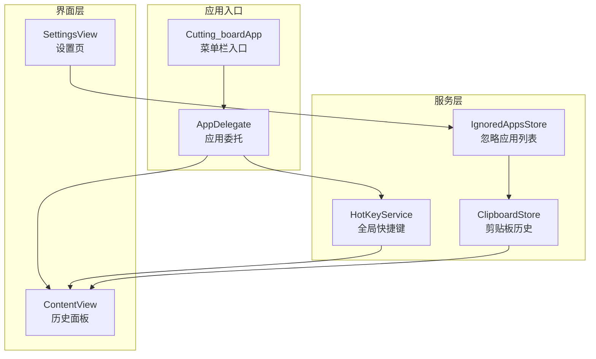
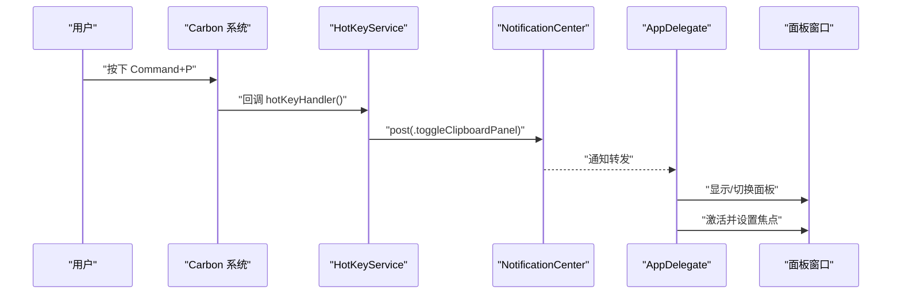
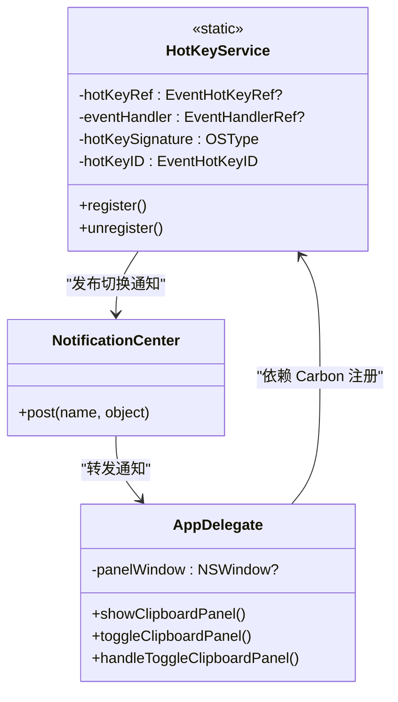
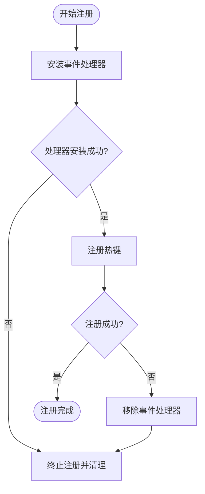
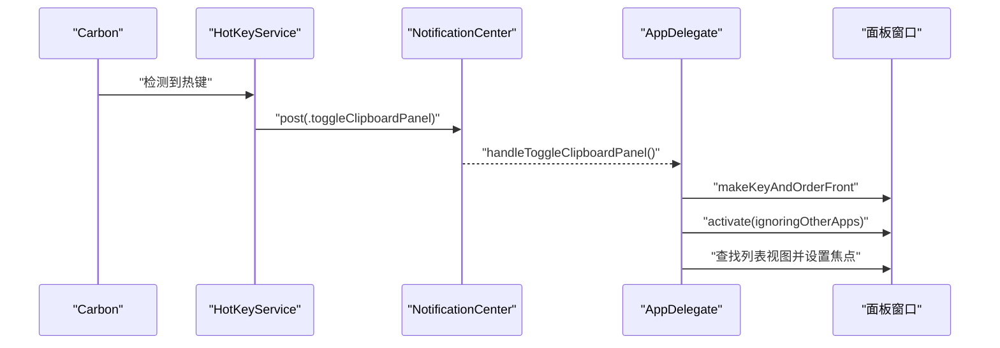
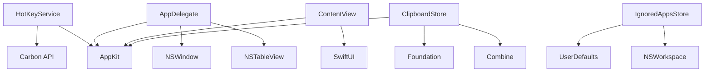

# 全局快捷键服务

<cite>
**本文档引用的文件**
- [HotKeyService.swift](file://Cutting_board/Services/HotKeyService.swift)
- [ClipboardStore.swift](file://Cutting_board/Services/ClipboardStore.swift)
- [ClipboardItem.swift](file://Cutting_board/Models/ClipboardItem.swift)
- [Cutting_boardApp.swift](file://Cutting_board/Cutting_boardApp.swift)
- [ContentView.swift](file://Cutting_board/ContentView.swift)
- [IgnoredAppsStore.swift](file://Cutting_board/Services/IgnoredAppsStore.swift)
- [SettingsView.swift](file://Cutting_board/SettingsView.swift)
- [Info.plist](file://build/Build/Products/Debug/ding.app/Contents/Info.plist)
</cite>

## 目录
1. [简介](#简介)
2. [项目结构](#项目结构)
3. [核心组件](#核心组件)
4. [架构总览](#架构总览)
5. [详细组件分析](#详细组件分析)
6. [依赖关系分析](#依赖关系分析)
7. [性能考虑](#性能考虑)
8. [故障排除指南](#故障排除指南)
9. [结论](#结论)
10. [附录](#附录)

## 简介
本文件面向全局快捷键服务的技术文档，重点围绕 HotKeyService 类的实现原理展开，涵盖：
- Carbon API 集成与快捷键注册机制
- Command+P 快捷键的注册流程（热键组合定义、系统权限检查、冲突处理）
- 快捷键事件生命周期（按键检测、重复按键抑制、焦点管理）
- 与 ClipboardStore 的集成（历史面板显示控制与应用状态同步）
- 快捷键配置的扩展方法（自定义快捷键支持与用户偏好设置）

## 项目结构
该项目采用模块化组织，关键目录与文件如下：
- Services：服务层，包含 HotKeyService、ClipboardStore、IgnoredAppsStore 等
- Models：数据模型，包含 ClipboardItem
- Views：界面层，包含主面板 ContentView、设置页 SettingsView
- 应用入口：Cutting_boardApp、AppDelegate

图表来源
- [Cutting_boardApp.swift](file://Cutting_board/Cutting_boardApp.swift#L11-L31)
- [HotKeyService.swift](file://Cutting_board/Services/HotKeyService.swift#L30-L81)
- [ClipboardStore.swift](file://Cutting_board/Services/ClipboardStore.swift#L14-L222)
- [ContentView.swift](file://Cutting_board/ContentView.swift#L20-L305)
- [SettingsView.swift](file://Cutting_board/SettingsView.swift#L11-L95)

章节来源
- [Cutting_boardApp.swift](file://Cutting_board/Cutting_boardApp.swift#L11-L31)
- [HotKeyService.swift](file://Cutting_board/Services/HotKeyService.swift#L30-L81)
- [ClipboardStore.swift](file://Cutting_board/Services/ClipboardStore.swift#L14-L222)
- [ContentView.swift](file://Cutting_board/ContentView.swift#L20-L305)
- [SettingsView.swift](file://Cutting_board/SettingsView.swift#L11-L95)

## 核心组件
- HotKeyService：基于 Carbon API 的全局快捷键服务，负责注册/注销 Command+P，并通过通知中心分发切换面板事件。
- ClipboardStore：剪贴板历史的监控、存储与持久化，提供增删改查与排序、去重、加密存储等功能。
- ClipboardItem：剪贴板历史条目的数据模型，包含内容、类型、时间戳、图片数据、钉住状态、备注等。
- IgnoredAppsStore：维护“忽略的应用”列表，避免从特定应用复制的内容进入历史。
- Cutting_boardApp/AppDelegate：应用入口与委托，负责创建面板窗口、注册全局快捷键、处理通知。
- ContentView：历史面板界面，支持搜索、选择、粘贴、备注、清空等操作。
- SettingsView：设置页，管理忽略应用列表。

章节来源
- [HotKeyService.swift](file://Cutting_board/Services/HotKeyService.swift#L30-L81)
- [ClipboardStore.swift](file://Cutting_board/Services/ClipboardStore.swift#L14-L222)
- [ClipboardItem.swift](file://Cutting_board/Models/ClipboardItem.swift#L17-L89)
- [IgnoredAppsStore.swift](file://Cutting_board/Services/IgnoredAppsStore.swift#L16-L40)
- [Cutting_boardApp.swift](file://Cutting_board/Cutting_boardApp.swift#L35-L143)
- [ContentView.swift](file://Cutting_board/ContentView.swift#L20-L305)
- [SettingsView.swift](file://Cutting_board/SettingsView.swift#L11-L95)

## 架构总览
全局快捷键服务通过 Carbon API 在系统层面注册 Command+P，不依赖辅助功能权限。当快捷键触发时，回调函数通过通知中心发布切换面板事件，AppDelegate 接收并控制面板窗口的显示/隐藏与焦点管理。

图表来源
- [HotKeyService.swift](file://Cutting_board/Services/HotKeyService.swift#L22-L27)
- [HotKeyService.swift](file://Cutting_board/Services/HotKeyService.swift#L36-L69)
- [Cutting_boardApp.swift](file://Cutting_board/Cutting_boardApp.swift#L49-L66)
- [Cutting_boardApp.swift](file://Cutting_board/Cutting_boardApp.swift#L101-L142)

## 详细组件分析

### HotKeyService 组件分析
- Carbon API 集成
  - 安装事件处理器以接收热键事件，使用 Application Event Target。
  - 注册热键组合为字母 P 的 keyCode 与 Command 修饰键。
  - 使用四字符签名标识热键，避免与其他应用冲突。
- 快捷键注册机制
  - 注册成功后保存热键引用与事件处理器引用；失败时清理已安装的处理器。
  - 注销时移除热键与事件处理器，确保资源释放。
- 事件监听处理
  - 回调函数在主线程发布切换面板通知，保证 UI 更新线程安全。
- 与 ClipboardStore 的集成
  - 通过通知中心与 AppDelegate 协作，间接影响历史面板的显示状态与焦点管理。

图表来源
- [HotKeyService.swift](file://Cutting_board/Services/HotKeyService.swift#L30-L81)
- [Cutting_boardApp.swift](file://Cutting_board/Cutting_boardApp.swift#L35-L143)

章节来源
- [HotKeyService.swift](file://Cutting_board/Services/HotKeyService.swift#L30-L81)

### Command+P 快捷键注册流程
- 热键组合定义
  - 字母 P 的 keyCode 与 Command 修饰键组合。
  - 使用固定签名标识热键，避免与其他应用冲突。
- 系统权限检查
  - 代码注释明确指出无需辅助功能权限即可工作。
  - Info.plist 中启用 LSUIElement，使应用作为菜单栏工具运行。
- 冲突处理
  - 注册失败时清理已安装的事件处理器，防止残留。
  - 注销时移除热键与处理器，确保可重复注册。

图表来源
- [HotKeyService.swift](file://Cutting_board/Services/HotKeyService.swift#L36-L69)
- [Info.plist](file://build/Build/Products/Debug/ding.app/Contents/Info.plist#L49-L50)

章节来源
- [HotKeyService.swift](file://Cutting_board/Services/HotKeyService.swift#L36-L69)
- [Info.plist](file://build/Build/Products/Debug/ding.app/Contents/Info.plist#L49-L50)

### 快捷键事件生命周期
- 按键检测
  - Carbon 系统在任意应用聚焦时检测到 Command+P。
- 重复按键抑制
  - 通过事件处理器回调直接触发一次通知，避免重复触发。
- 焦点管理
  - AppDelegate 在显示面板时激活应用并设置面板为前台，随后查找列表视图并将键盘焦点交给它，提升可用性。

图表来源
- [HotKeyService.swift](file://Cutting_board/Services/HotKeyService.swift#L22-L27)
- [Cutting_boardApp.swift](file://Cutting_board/Cutting_boardApp.swift#L101-L142)

章节来源
- [HotKeyService.swift](file://Cutting_board/Services/HotKeyService.swift#L22-L27)
- [Cutting_boardApp.swift](file://Cutting_board/Cutting_boardApp.swift#L101-L142)

### 与 ClipboardStore 的集成
- 历史面板显示控制
  - ContentView 通过通知中心关闭面板，实现与快捷键的联动。
- 应用状态同步
  - ClipboardStore 提供 @Published 属性，驱动界面更新。
  - ClipboardItem 包含时间戳、类型、图片数据、钉住状态、备注等字段，支持排序与去重。

图表来源
- [HotKeyService.swift](file://Cutting_board/Services/HotKeyService.swift#L22-L27)
- [Cutting_boardApp.swift](file://Cutting_board/Cutting_boardApp.swift#L101-L142)
- [ContentView.swift](file://Cutting_board/ContentView.swift#L20-L305)
- [ClipboardStore.swift](file://Cutting_board/Services/ClipboardStore.swift#L14-L222)
- [ClipboardItem.swift](file://Cutting_board/Models/ClipboardItem.swift#L17-L89)

章节来源
- [ContentView.swift](file://Cutting_board/ContentView.swift#L20-L305)
- [ClipboardStore.swift](file://Cutting_board/Services/ClipboardStore.swift#L14-L222)
- [ClipboardItem.swift](file://Cutting_board/Models/ClipboardItem.swift#L17-L89)

### 快捷键配置扩展方法
- 自定义快捷键支持
  - 当前实现固定为 Command+P。若需扩展，可在 HotKeyService 中增加参数化注册接口，传入 keyCode 与修饰键组合。
  - 需要确保注册成功后再保存引用，失败时清理已安装的处理器。
- 用户偏好设置
  - 可通过 UserDefaults 存储用户自定义的快捷键组合，应用启动时读取并调用注册接口。
  - SettingsView 已具备设置页框架，可扩展为快捷键配置界面。

章节来源
- [HotKeyService.swift](file://Cutting_board/Services/HotKeyService.swift#L36-L69)
- [SettingsView.swift](file://Cutting_board/SettingsView.swift#L11-L95)

## 依赖关系分析
- HotKeyService 依赖 Carbon API 与 AppKit，不依赖辅助功能权限。
- AppDelegate 依赖 NSApplication、NSWindow、NSTableView 等，负责窗口生命周期与焦点管理。
- ContentView 依赖 SwiftUI、AppKit，负责交互与数据展示。
- ClipboardStore 依赖 AppKit、Foundation、Combine，负责历史数据的监控、存储与持久化。
- IgnoredAppsStore 依赖 UserDefaults、NSWorkspace，负责忽略应用列表的维护。

图表来源
- [HotKeyService.swift](file://Cutting_board/Services/HotKeyService.swift#L8-L10)
- [Cutting_boardApp.swift](file://Cutting_board/Cutting_boardApp.swift#L35-L143)
- [ContentView.swift](file://Cutting_board/ContentView.swift#L8-L9)
- [ClipboardStore.swift](file://Cutting_board/Services/ClipboardStore.swift#L8-L11)
- [IgnoredAppsStore.swift](file://Cutting_board/Services/IgnoredAppsStore.swift#L8-L12)

章节来源
- [HotKeyService.swift](file://Cutting_board/Services/HotKeyService.swift#L8-L10)
- [Cutting_boardApp.swift](file://Cutting_board/Cutting_boardApp.swift#L35-L143)
- [ContentView.swift](file://Cutting_board/ContentView.swift#L8-L9)
- [ClipboardStore.swift](file://Cutting_board/Services/ClipboardStore.swift#L8-L11)
- [IgnoredAppsStore.swift](file://Cutting_board/Services/IgnoredAppsStore.swift#L8-L12)

## 性能考虑
- 快捷键回调在主线程发布通知，避免跨线程 UI 更新问题。
- ClipboardStore 使用队列异步进行磁盘读写，减少主线程阻塞。
- ContentView 使用懒加载列表与动画优化，提升滚动性能。
- 重复按键通过事件处理器一次性触发，避免重复处理。

## 故障排除指南
- 快捷键无效
  - 检查是否正确调用注册与注销逻辑，确认注册返回状态。
  - 确认 Info.plist 中 LSUIElement 已启用，应用以菜单栏工具运行。
- 面板无法显示或焦点异常
  - 确认 AppDelegate 已创建面板窗口并设置为可复用。
  - 检查查找列表视图的递归逻辑，确保面板内存在 NSTableView。
- 历史记录异常
  - 检查 ClipboardStore 的去重逻辑与排序策略，确认钉住项不会被清理。
  - 确认磁盘读写路径与加密解密流程正常。

章节来源
- [HotKeyService.swift](file://Cutting_board/Services/HotKeyService.swift#L36-L69)
- [Info.plist](file://build/Build/Products/Debug/ding.app/Contents/Info.plist#L49-L50)
- [Cutting_boardApp.swift](file://Cutting_board/Cutting_boardApp.swift#L78-L142)
- [ClipboardStore.swift](file://Cutting_board/Services/ClipboardStore.swift#L94-L147)

## 结论
HotKeyService 通过 Carbon API 实现了无需辅助功能权限的全局快捷键，结合通知中心与 AppDelegate 的协作，实现了稳定的面板显示/切换与焦点管理。ClipboardStore 提供了完善的剪贴板历史管理能力，配合 ContentView 与设置页，形成了完整的用户体验闭环。未来可通过参数化注册与用户偏好设置进一步增强快捷键的灵活性与可定制性。

## 附录
- 关键实现路径参考
  - 全局快捷键注册与回调：[HotKeyService.register/unregister](file://Cutting_board/Services/HotKeyService.swift#L36-L69)
  - 通知中心与 AppDelegate 协作：[AppDelegate.handleToggleClipboardPanel](file://Cutting_board/Cutting_boardApp.swift#L131-L133)
  - 历史面板显示与焦点管理：[AppDelegate.showClipboardPanel](file://Cutting_board/Cutting_boardApp.swift#L101-L112)
  - 历史面板界面与交互：[ContentView](file://Cutting_board/ContentView.swift#L20-L305)
  - 历史数据模型与持久化：[ClipboardStore](file://Cutting_board/Services/ClipboardStore.swift#L14-L222)
  - 忽略应用列表：[IgnoredAppsStore](file://Cutting_board/Services/IgnoredAppsStore.swift#L16-L40)
  - 设置页：[SettingsView](file://Cutting_board/SettingsView.swift#L11-L95)
  - 应用配置（菜单栏工具）：[Info.plist](file://build/Build/Products/Debug/ding.app/Contents/Info.plist#L49-L50)