# 剪贴板监控系统

<cite>
**本文档引用的文件**
- [ClipboardStore.swift](file://Cutting_board/Services/ClipboardStore.swift)
- [ClipboardItem.swift](file://Cutting_board/Models/ClipboardItem.swift)
- [IgnoredAppsStore.swift](file://Cutting_board/Services/IgnoredAppsStore.swift)
- [ClipboardCrypto.swift](file://Cutting_board/Services/ClipboardCrypto.swift)
- [ContentView.swift](file://Cutting_board/ContentView.swift)
- [Cutting_boardApp.swift](file://Cutting_board/Cutting_boardApp.swift)
- [SettingsView.swift](file://Cutting_board/SettingsView.swift)
- [HotKeyService.swift](file://Cutting_board/Services/HotKeyService.swift)
</cite>

## 目录
1. [简介](#简介)
2. [项目结构](#项目结构)
3. [核心组件](#核心组件)
4. [架构概览](#架构概览)
5. [详细组件分析](#详细组件分析)
6. [依赖关系分析](#依赖关系分析)
7. [性能考虑](#性能考虑)
8. [故障排除指南](#故障排除指南)
9. [结论](#结论)

## 简介

剪贴板监控系统是一个基于 macOS 的桌面应用程序，用于监控和管理系统的剪贴板历史记录。该系统实现了定时器驱动的剪贴板监控机制，支持图片和文本内容的捕获，具备智能去重策略和应用忽略列表功能。

系统采用 Swift 和 SwiftUI 构建，通过 NSPasteboard 集成实现与系统剪贴板的深度交互，并使用 AES-GCM 加密保护用户的剪贴板历史数据。

## 项目结构

项目采用模块化的组织方式，主要包含以下核心目录和文件：

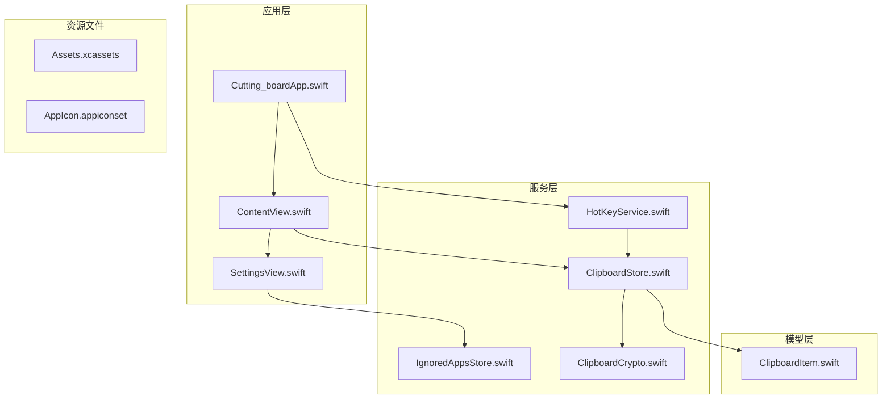

**图表来源**
- [Cutting_boardApp.swift](file://Cutting_board/Cutting_boardApp.swift#L1-L144)
- [ContentView.swift](file://Cutting_board/ContentView.swift#L1-L500)
- [ClipboardStore.swift](file://Cutting_board/Services/ClipboardStore.swift#L1-L223)

**章节来源**
- [Cutting_boardApp.swift](file://Cutting_board/Cutting_boardApp.swift#L1-L144)
- [ContentView.swift](file://Cutting_board/ContentView.swift#L1-L500)

## 核心组件

### ClipboardStore 类

ClipboardStore 是系统的核心组件，负责剪贴板监控、内容捕获、历史管理和持久化存储。

#### 主要特性
- **定时器监控**：每 0.5 秒检查一次剪贴板变化
- **内容捕获**：优先处理图片，其次处理文本
- **智能去重**：基于内容和类型的精确去重策略
- **应用忽略**：支持配置忽略特定应用程序的内容
- **加密存储**：使用 AES-GCM 加密剪贴板历史数据

#### 关键属性和方法

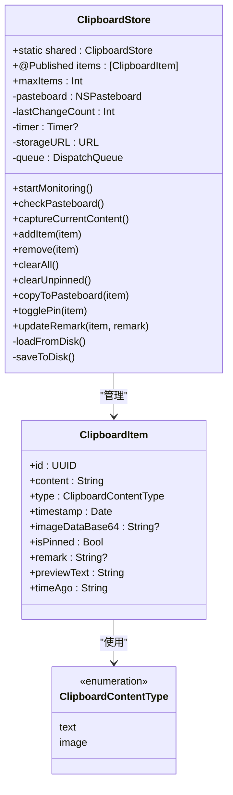

**图表来源**
- [ClipboardStore.swift](file://Cutting_board/Services/ClipboardStore.swift#L14-L223)
- [ClipboardItem.swift](file://Cutting_board/Models/ClipboardItem.swift#L10-L90)

**章节来源**
- [ClipboardStore.swift](file://Cutting_board/Services/ClipboardStore.swift#L14-L223)
- [ClipboardItem.swift](file://Cutting_board/Models/ClipboardItem.swift#L10-L90)

## 架构概览

系统采用分层架构设计，各组件职责明确，耦合度低：

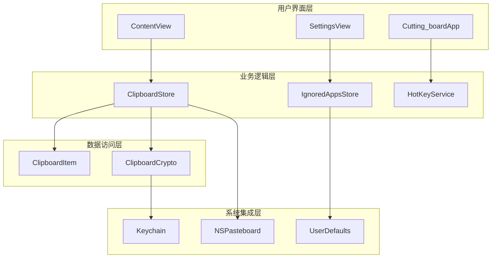

**图表来源**
- [ContentView.swift](file://Cutting_board/ContentView.swift#L20-L30)
- [ClipboardStore.swift](file://Cutting_board/Services/ClipboardStore.swift#L25-L39)
- [IgnoredAppsStore.swift](file://Cutting_board/Services/IgnoredAppsStore.swift#L16-L40)

## 详细组件分析

### 定时器监控机制

系统使用定时器实现周期性的剪贴板监控，采用 0.5 秒间隔确保响应速度和性能平衡。

#### 监控流程

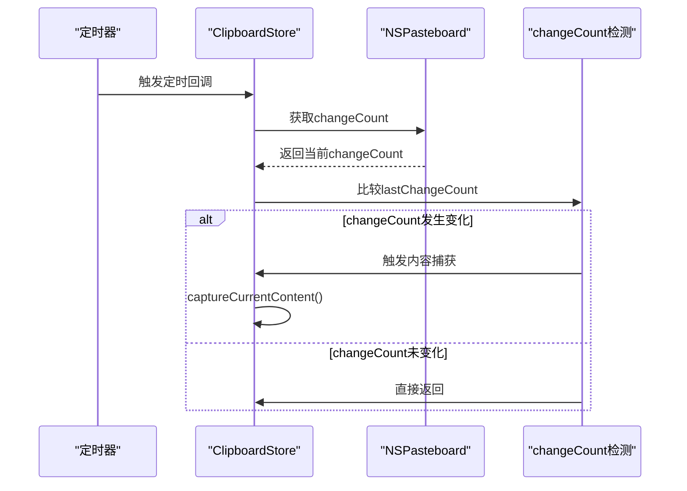

**图表来源**
- [ClipboardStore.swift](file://Cutting_board/Services/ClipboardStore.swift#L47-L60)

#### 内容捕获流程

系统采用优先级策略处理不同类型的剪贴板内容：

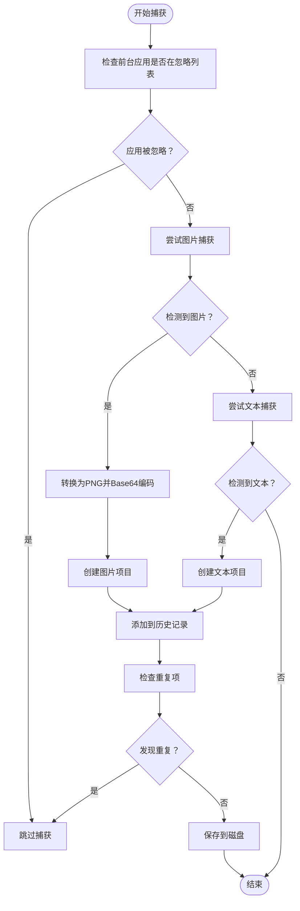

**图表来源**
- [ClipboardStore.swift](file://Cutting_board/Services/ClipboardStore.swift#L65-L90)

**章节来源**
- [ClipboardStore.swift](file://Cutting_board/Services/ClipboardStore.swift#L47-L90)

### 去重策略实现

系统实现了智能的去重机制，确保历史记录的准确性和效率：

#### 去重算法

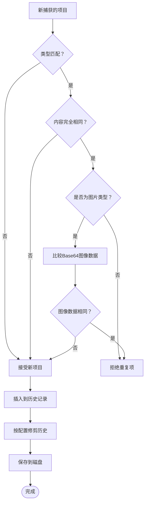

**图表来源**
- [ClipboardStore.swift](file://Cutting_board/Services/ClipboardStore.swift#L94-L108)

#### 去重策略细节

去重逻辑的关键实现点：
- **类型匹配**：不同类型的内容被视为不同的项目
- **文本内容比较**：直接比较字符串内容
- **图片内容比较**：比较 Base64 编码的图像数据
- **性能优化**：仅在必要时进行深度比较

**章节来源**
- [ClipboardStore.swift](file://Cutting_board/Services/ClipboardStore.swift#L94-L108)

### 应用忽略列表功能

系统提供了灵活的应用程序忽略机制，允许用户配置不希望监控的应用程序。

#### 忽略列表管理

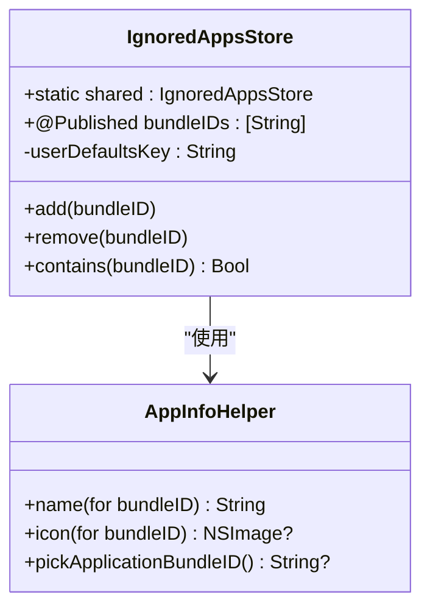

**图表来源**
- [IgnoredAppsStore.swift](file://Cutting_board/Services/IgnoredAppsStore.swift#L16-L69)

#### 忽略列表工作流程

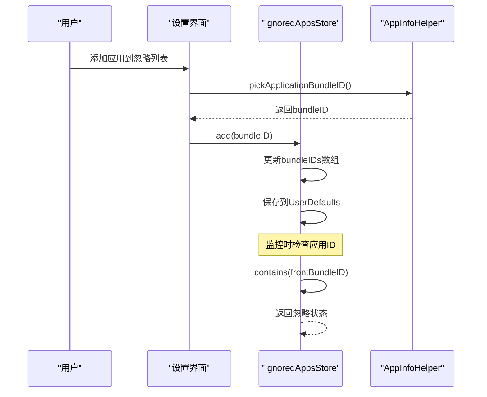

**图表来源**
- [SettingsView.swift](file://Cutting_board/SettingsView.swift#L78-L81)
- [IgnoredAppsStore.swift](file://Cutting_board/Services/IgnoredAppsStore.swift#L27-L39)

**章节来源**
- [IgnoredAppsStore.swift](file://Cutting_board/Services/IgnoredAppsStore.swift#L16-L69)
- [SettingsView.swift](file://Cutting_board/SettingsView.swift#L41-L88)

### 数据持久化和加密

系统使用加密存储保护用户的剪贴板历史数据，确保隐私安全。

#### 加密存储架构

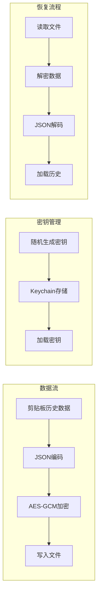

**图表来源**
- [ClipboardCrypto.swift](file://Cutting_board/Services/ClipboardCrypto.swift#L32-L46)
- [ClipboardStore.swift](file://Cutting_board/Services/ClipboardStore.swift#L183-L221)

#### 加密实现细节

- **密钥生成**：使用 32 字节随机密钥
- **加密算法**：AES-GCM 对称加密
- **密钥存储**：macOS Keychain 安全存储
- **文件格式**：魔数标识 + 密文组合
- **向后兼容**：支持明文历史文件

**章节来源**
- [ClipboardCrypto.swift](file://Cutting_board/Services/ClipboardCrypto.swift#L16-L73)
- [ClipboardStore.swift](file://Cutting_board/Services/ClipboardStore.swift#L183-L221)

### 快捷键和用户界面

系统提供了便捷的快捷键操作和直观的用户界面。

#### 快捷键功能

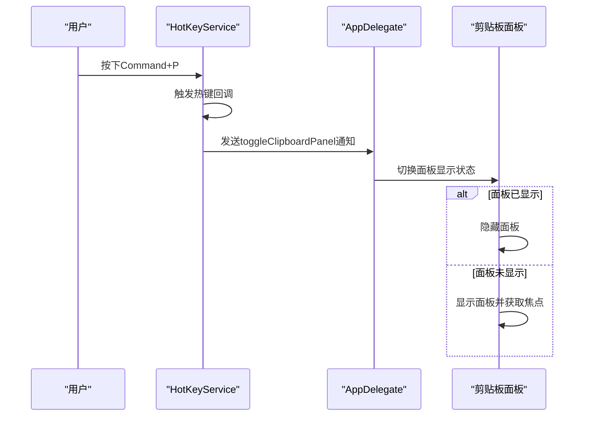

**图表来源**
- [HotKeyService.swift](file://Cutting_board/Services/HotKeyService.swift#L22-L27)
- [Cutting_boardApp.swift](file://Cutting_board/Cutting_boardApp.swift#L136-L142)

#### 用户界面设计

系统采用毛玻璃效果和现代化的设计语言：

- **主界面**：380x420 像素的固定尺寸
- **视觉效果**：Ultra Thin Material 毛玻璃背景
- **交互设计**：键盘导航、双击粘贴、右键菜单
- **无障碍支持**：完整的屏幕阅读器支持

**章节来源**
- [HotKeyService.swift](file://Cutting_board/Services/HotKeyService.swift#L12-L82)
- [Cutting_boardApp.swift](file://Cutting_board/Cutting_boardApp.swift#L35-L144)
- [ContentView.swift](file://Cutting_board/ContentView.swift#L37-L95)

## 依赖关系分析

系统各组件之间的依赖关系清晰，遵循单一职责原则：

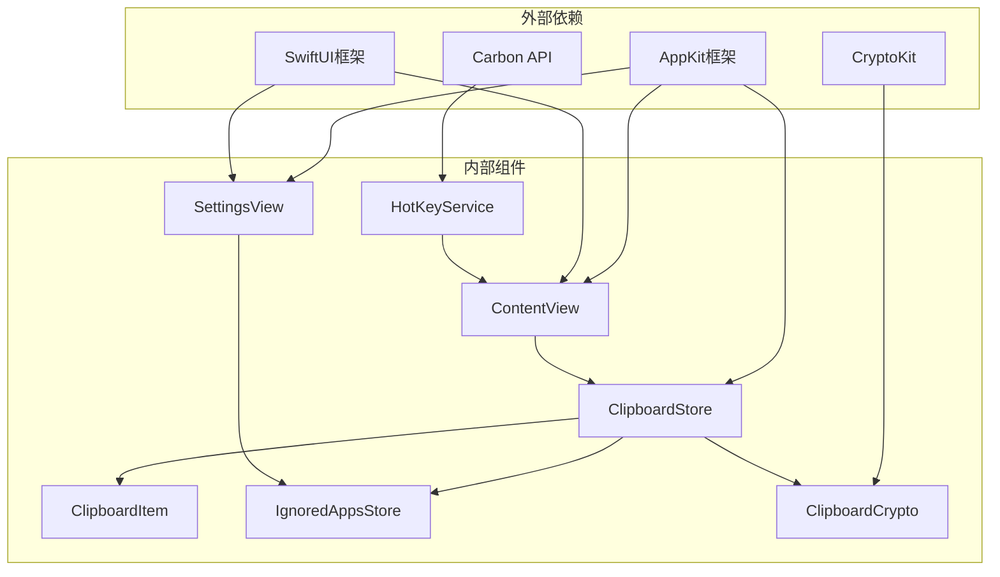

**图表来源**
- [ClipboardStore.swift](file://Cutting_board/Services/ClipboardStore.swift#L8-L11)
- [HotKeyService.swift](file://Cutting_board/Services/HotKeyService.swift#L8-L10)

**章节来源**
- [ClipboardStore.swift](file://Cutting_board/Services/ClipboardStore.swift#L8-L11)
- [HotKeyService.swift](file://Cutting_board/Services/HotKeyService.swift#L8-L10)

## 性能考虑

系统在设计时充分考虑了性能优化：

### 内存管理
- 使用弱引用避免循环引用
- 异步队列处理磁盘 I/O
- 按需加载缩略图缓存

### 磁盘 I/O 优化
- 批量写入操作
- 异步加密和解密
- 文件大小限制和历史修剪

### CPU 使用优化
- 0.5 秒轮询间隔平衡响应性和性能
- 智能去重减少不必要的处理
- 延迟初始化组件

## 故障排除指南

### 常见问题及解决方案

#### 剪贴板监控不生效
1. **检查权限**：确保应用程序具有辅助功能权限
2. **验证定时器**：确认定时器正常启动
3. **检查应用忽略**：验证目标应用不在忽略列表中

#### 图片无法正确捕获
1. **验证图片格式**：确保图片可转换为 TIFF 格式
2. **检查内存限制**：大图片可能导致转换失败
3. **确认 PNG 编码**：验证 Base64 编码过程

#### 数据丢失或损坏
1. **检查加密密钥**：验证 Keychain 中的密钥存在
2. **验证文件完整性**：检查历史文件格式
3. **恢复备份**：如有需要可手动恢复历史文件

#### 快捷键无效
1. **重新注册热键**：调用 `HotKeyService.register()`
2. **检查系统权限**：确认具有全局热键权限
3. **重启应用程序**：重新启动应用以重新初始化

**章节来源**
- [ClipboardStore.swift](file://Cutting_board/Services/ClipboardStore.swift#L47-L53)
- [ClipboardCrypto.swift](file://Cutting_board/Services/ClipboardCrypto.swift#L48-L60)
- [HotKeyService.swift](file://Cutting_board/Services/HotKeyService.swift#L36-L69)

## 结论

剪贴板监控系统是一个设计精良的 macOS 应用程序，具有以下特点：

### 技术优势
- **可靠的监控机制**：基于 NSPasteboard.changeCount 的精确检测
- **智能内容处理**：优先图片、次优文本的合理策略
- **强大的去重能力**：基于内容和类型的精确去重
- **安全的数据存储**：AES-GCM 加密保护用户隐私
- **优雅的用户界面**：现代化设计和良好的用户体验

### 架构优点
- **模块化设计**：清晰的职责分离和低耦合
- **扩展性良好**：易于添加新功能和改进现有功能
- **性能优化**：合理的资源管理和异步处理
- **错误处理**：完善的异常处理和故障恢复机制

### 改进建议
- 可以考虑实现更高级的图片识别功能
- 增加更多自定义选项和配置参数
- 实现云端同步功能
- 添加更多搜索和过滤选项

该系统为 macOS 用户提供了一个强大而易用的剪贴板历史管理工具，满足了现代工作流程中的各种需求。