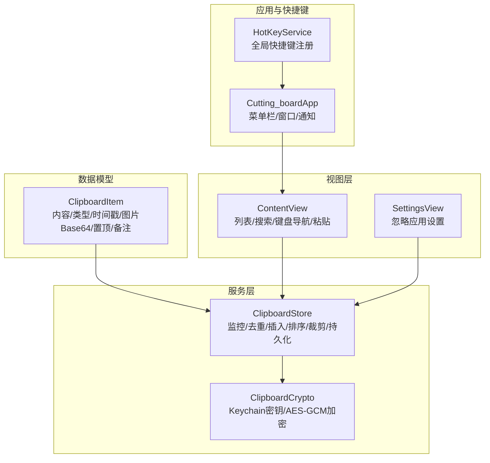
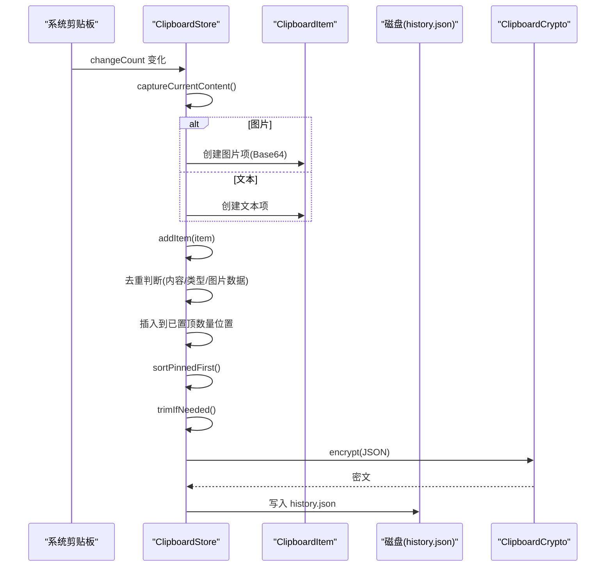
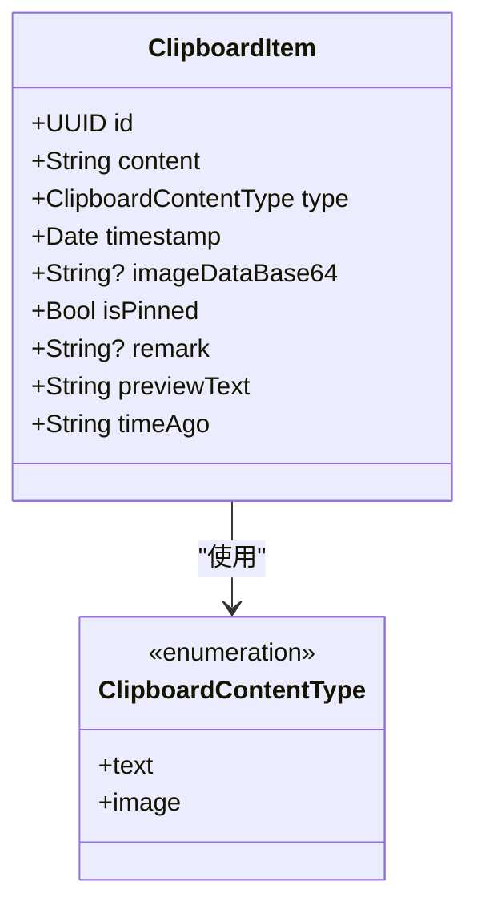
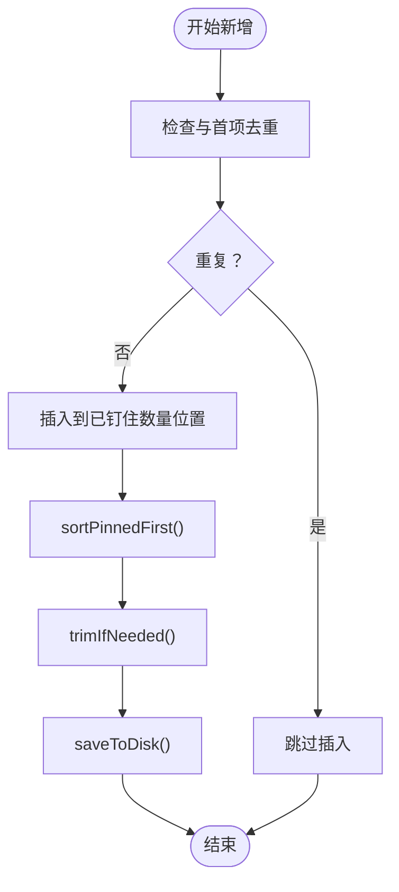
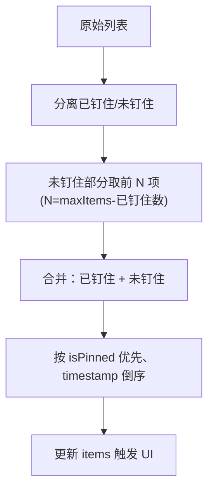
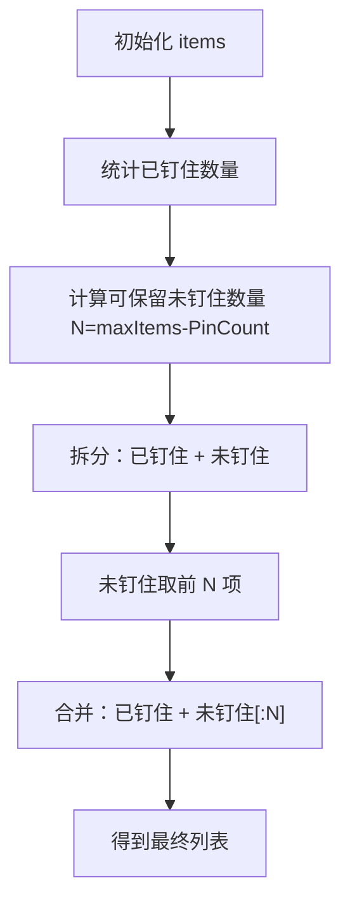
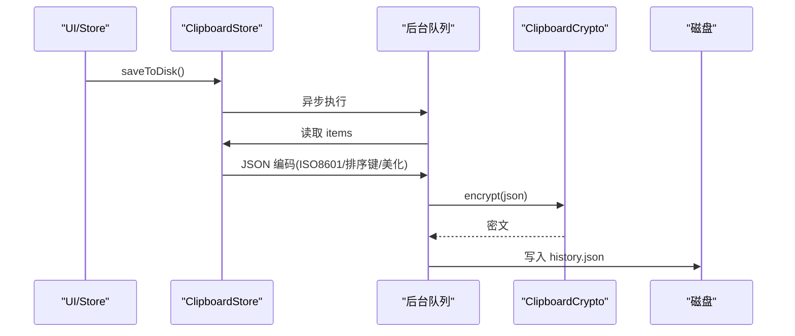
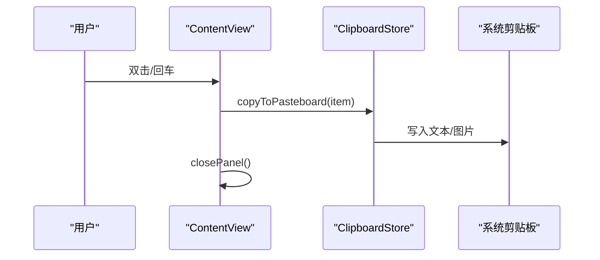
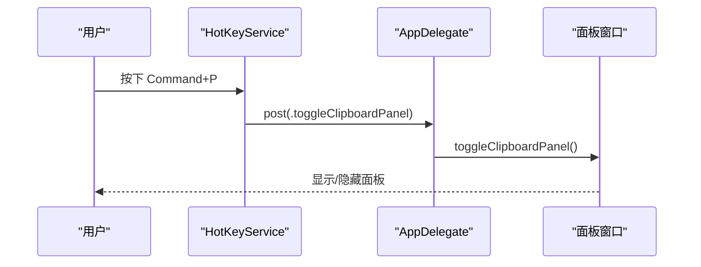
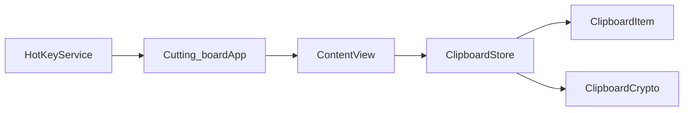

# 历史管理功能

<cite>
**本文引用的文件**
- [ClipboardItem.swift](file://Cutting_board/Models/ClipboardItem.swift)
- [ClipboardStore.swift](file://Cutting_board/Services/ClipboardStore.swift)
- [ClipboardCrypto.swift](file://Cutting_board/Services/ClipboardCrypto.swift)
- [ContentView.swift](file://Cutting_board/ContentView.swift)
- [HotKeyService.swift](file://Cutting_board/Services/HotKeyService.swift)
- [Cutting_boardApp.swift](file://Cutting_board/Cutting_boardApp.swift)
- [SettingsView.swift](file://Cutting_board/SettingsView.swift)
</cite>

## 目录
1. [简介](#简介)
2. [项目结构](#项目结构)
3. [核心组件](#核心组件)
4. [架构总览](#架构总览)
5. [详细组件分析](#详细组件分析)
6. [依赖关系分析](#依赖关系分析)
7. [性能考量](#性能考量)
8. [故障排查指南](#故障排查指南)
9. [结论](#结论)
10. [附录](#附录)

## 简介
本文件围绕“历史管理功能”进行系统性技术说明，重点覆盖：
- ClipboardItem 数据模型设计与字段语义
- 历史记录的增删改查操作与去重、置顶、删除机制
- 排序算法（钉住项优先、时间倒序）
- 最大条目数限制与自动裁剪策略（含钉住项保护）
- 历史记录持久化流程（JSON 序列化、磁盘存储、内存缓存同步）
- 使用示例与性能优化建议

## 项目结构
历史管理功能主要分布在以下模块：
- 数据模型层：ClipboardItem（剪贴板历史条目）
- 业务服务层：ClipboardStore（历史存储、监控、排序、持久化）
- 安全层：ClipboardCrypto（Keychain + AES-GCM 加密）
- 视图层：ContentView（展示、交互、搜索、键盘导航）
- 应用入口与快捷键：Cutting_boardApp、HotKeyService
- 设置页：SettingsView（忽略应用配置）

图表来源
- [ClipboardItem.swift](file://Cutting_board/Models/ClipboardItem.swift#L17-L45)
- [ClipboardStore.swift](file://Cutting_board/Services/ClipboardStore.swift#L14-L39)
- [ClipboardCrypto.swift](file://Cutting_board/Services/ClipboardCrypto.swift#L16-L46)
- [ContentView.swift](file://Cutting_board/ContentView.swift#L20-L35)
- [HotKeyService.swift](file://Cutting_board/Services/HotKeyService.swift#L35-L66)
- [Cutting_boardApp.swift](file://Cutting_board/Cutting_boardApp.swift#L35-L76)
- [SettingsView.swift](file://Cutting_board/SettingsView.swift#L11-L39)

章节来源
- [ClipboardItem.swift](file://Cutting_board/Models/ClipboardItem.swift#L1-L90)
- [ClipboardStore.swift](file://Cutting_board/Services/ClipboardStore.swift#L1-L223)
- [ClipboardCrypto.swift](file://Cutting_board/Services/ClipboardCrypto.swift#L1-L73)
- [ContentView.swift](file://Cutting_board/ContentView.swift#L1-L500)
- [HotKeyService.swift](file://Cutting_board/Services/HotKeyService.swift#L1-L82)
- [Cutting_boardApp.swift](file://Cutting_board/Cutting_boardApp.swift#L1-L144)
- [SettingsView.swift](file://Cutting_board/SettingsView.swift#L1-L95)

## 核心组件
- ClipboardItem：剪贴板历史条目的数据模型，支持文本与图片两种类型，包含去重、预览文本、相对时间等便捷属性。
- ClipboardStore：历史记录的业务中枢，负责监控系统剪贴板变化、去重插入、排序、裁剪、持久化与读取。
- ClipboardCrypto：历史文件的加解密，使用 Keychain 存储密钥，AES-GCM 加密，兼容旧版明文。
- ContentView：历史列表的 UI 层，支持搜索、键盘导航、双击粘贴、备注编辑、置顶切换等。
- HotKeyService 与 Cutting_boardApp：全局快捷键与面板窗口生命周期管理，通过通知驱动面板显示/隐藏。

章节来源
- [ClipboardItem.swift](file://Cutting_board/Models/ClipboardItem.swift#L17-L89)
- [ClipboardStore.swift](file://Cutting_board/Services/ClipboardStore.swift#L14-L223)
- [ClipboardCrypto.swift](file://Cutting_board/Services/ClipboardCrypto.swift#L16-L73)
- [ContentView.swift](file://Cutting_board/ContentView.swift#L20-L305)
- [HotKeyService.swift](file://Cutting_board/Services/HotKeyService.swift#L12-L82)
- [Cutting_boardApp.swift](file://Cutting_board/Cutting_boardApp.swift#L35-L143)

## 架构总览
历史管理采用“观察者 + 异步队列 + JSON + 加密”的架构模式：
- ClipboardStore 通过定时器轮询系统剪贴板变更，捕获文本或图片内容，生成 ClipboardItem 并执行去重插入。
- 插入后按“钉住优先、时间倒序”重新排序，并根据最大条目数进行裁剪。
- 所有变更通过 JSON 编码后经 ClipboardCrypto 加密，写入应用支持目录下的 history.json。
- 应用启动时从磁盘读取历史，解密并反序列化，恢复内存状态，再次执行排序与裁剪。

图表来源
- [ClipboardStore.swift](file://Cutting_board/Services/ClipboardStore.swift#L47-L90)
- [ClipboardStore.swift](file://Cutting_board/Services/ClipboardStore.swift#L94-L108)
- [ClipboardStore.swift](file://Cutting_board/Services/ClipboardStore.swift#L142-L147)
- [ClipboardStore.swift](file://Cutting_board/Services/ClipboardStore.swift#L110-L115)
- [ClipboardStore.swift](file://Cutting_board/Services/ClipboardStore.swift#L210-L221)
- [ClipboardCrypto.swift](file://Cutting_board/Services/ClipboardCrypto.swift#L32-L46)

## 详细组件分析

### 数据模型：ClipboardItem
- 字段与职责
  - id：唯一标识，用于稳定排序与更新定位
  - content：内容主体，文本直接保存，图片保存为 Base64
  - type：内容类型（文本/图片）
  - timestamp：记录时间，用于排序与相对时间展示
  - imageDataBase64：仅图片类型使用，Base64 存储图片数据
  - isPinned：是否钉住，决定排序优先级与裁剪保护
  - remark：用户备注，支持搜索与可访问性标签
- 编码策略
  - 实现 Codable，使用 CodingKeys 显式编码字段
  - decode 时对可选字段做默认值处理，保证向后兼容
- 辅助属性
  - previewText：对内容进行截断预览，空内容显示占位
  - timeAgo：使用相对时间格式化器输出“多久前”

图表来源
- [ClipboardItem.swift](file://Cutting_board/Models/ClipboardItem.swift#L17-L45)
- [ClipboardItem.swift](file://Cutting_board/Models/ClipboardItem.swift#L11-L14)

章节来源
- [ClipboardItem.swift](file://Cutting_board/Models/ClipboardItem.swift#L17-L89)

### 历史记录增删改查与去重逻辑
- 新增（addItem）
  - 去重规则：若首项内容与类型相同，且为图片时还需 Base64 一致，则跳过插入
  - 插入位置：计算当前已钉住数量，将新项插入到已钉住项之后，确保钉住项优先
  - 后续处理：触发排序、裁剪、落盘
- 置顶（togglePin）
  - 切换 isPinned 标志位，随后整体排序（钉住优先、时间倒序）
- 删除（remove/clear）
  - remove：按 id 移除单条
  - clearAll：清空所有
  - clearUnpinned：仅移除未钉住项，保留钉住项
- 备注更新（updateRemark）
  - 去除前后空白，空字符串转为 nil，落盘

图表来源
- [ClipboardStore.swift](file://Cutting_board/Services/ClipboardStore.swift#L94-L108)
- [ClipboardStore.swift](file://Cutting_board/Services/ClipboardStore.swift#L142-L147)
- [ClipboardStore.swift](file://Cutting_board/Services/ClipboardStore.swift#L110-L115)
- [ClipboardStore.swift](file://Cutting_board/Services/ClipboardStore.swift#L210-L221)

章节来源
- [ClipboardStore.swift](file://Cutting_board/Services/ClipboardStore.swift#L94-L165)

### 排序算法：钉住优先 + 时间倒序
- 排序策略
  - 钉住项优先于未钉住项
  - 未钉住项内部按时间倒序排列
- 实现要点
  - 使用 sorted 比较闭包，先比较 isPinned，再比较 timestamp
  - 排序完成后整体赋值给 items，触发 @Published

图表来源
- [ClipboardStore.swift](file://Cutting_board/Services/ClipboardStore.swift#L110-L115)
- [ClipboardStore.swift](file://Cutting_board/Services/ClipboardStore.swift#L142-L147)

章节来源
- [ClipboardStore.swift](file://Cutting_board/Services/ClipboardStore.swift#L110-L147)

### 最大条目数限制与自动裁剪机制
- 配置
  - maxItems 默认 200，可通过属性设置
- 裁剪策略
  - 保留所有已钉住项
  - 未钉住项按时间倒序取前 N 项，N = maxItems - 已钉住数
- 触发时机
  - 每次 maxItems 改变时立即裁剪
  - 新增后也自动裁剪

图表来源
- [ClipboardStore.swift](file://Cutting_board/Services/ClipboardStore.swift#L20-L23)
- [ClipboardStore.swift](file://Cutting_board/Services/ClipboardStore.swift#L110-L115)

章节来源
- [ClipboardStore.swift](file://Cutting_board/Services/ClipboardStore.swift#L20-L23)
- [ClipboardStore.swift](file://Cutting_board/Services/ClipboardStore.swift#L110-L115)

### 历史记录持久化流程
- 读取（loadFromDisk）
  - 从磁盘读取数据，尝试解密；若非加密格式则视为明文
  - JSON 反序列化，ISO8601 时间格式解码
  - 主线程恢复 items，执行排序与裁剪
- 写入（saveToDisk）
  - 主线程读取当前 items
  - JSON 编码（ISO8601 时间、排序键、美化输出）
  - ClipboardCrypto 加密，异步写入磁盘
- 加密（ClipboardCrypto）
  - Keychain 中存储 32 字节密钥，不存在则随机生成并保存
  - 加密格式头部标记“CB1”，兼容旧版明文
  - AES-GCM 加密封装，组合格式为“头部 + sealedBox.combined”

图表来源
- [ClipboardStore.swift](file://Cutting_board/Services/ClipboardStore.swift#L183-L221)
- [ClipboardCrypto.swift](file://Cutting_board/Services/ClipboardCrypto.swift#L32-L46)
- [ClipboardCrypto.swift](file://Cutting_board/Services/ClipboardCrypto.swift#L48-L71)

章节来源
- [ClipboardStore.swift](file://Cutting_board/Services/ClipboardStore.swift#L183-L221)
- [ClipboardCrypto.swift](file://Cutting_board/Services/ClipboardCrypto.swift#L16-L73)

### 视图层交互与使用示例
- 搜索与过滤
  - 支持按内容与备注进行本地过滤
- 键盘导航
  - 上下方向键移动选中项，回车粘贴，ESC 关闭面板，Delete 删除
- 备注编辑
  - 右键菜单或备注按钮进入备注编辑弹窗
- 置顶与删除
  - 行内按钮切换置顶状态，右键菜单删除
- 粘贴到当前应用
  - 双击或回车将选中项写回系统剪贴板

图表来源
- [ContentView.swift](file://Cutting_board/ContentView.swift#L289-L296)
- [ClipboardStore.swift](file://Cutting_board/Services/ClipboardStore.swift#L168-L179)

章节来源
- [ContentView.swift](file://Cutting_board/ContentView.swift#L29-L35)
- [ContentView.swift](file://Cutting_board/ContentView.swift#L184-L207)
- [ContentView.swift](file://Cutting_board/ContentView.swift#L289-L296)
- [ClipboardStore.swift](file://Cutting_board/Services/ClipboardStore.swift#L168-L179)

### 快捷键与面板控制
- 全局快捷键
  - 使用 Carbon API 注册 Command+P，触发切换面板通知
- 面板生命周期
  - AppDelegate 创建 NSWindow + NSHostingView 承载 ContentView
  - 通过通知控制显示/隐藏/切换
- 菜单栏入口
  - 菜单栏图标提供“打开/关闭剪贴板”与“退出”

图表来源
- [HotKeyService.swift](file://Cutting_board/Services/HotKeyService.swift#L22-L27)
- [HotKeyService.swift](file://Cutting_board/Services/HotKeyService.swift#L12-L16)
- [Cutting_boardApp.swift](file://Cutting_board/Cutting_boardApp.swift#L136-L142)

章节来源
- [HotKeyService.swift](file://Cutting_board/Services/HotKeyService.swift#L12-L82)
- [Cutting_boardApp.swift](file://Cutting_board/Cutting_boardApp.swift#L35-L143)

## 依赖关系分析
- 组件耦合
  - ContentView 依赖 ClipboardStore 进行数据读取与操作
  - ClipboardStore 依赖 ClipboardItem 作为数据载体
  - ClipboardStore 依赖 ClipboardCrypto 进行持久化安全
  - HotKeyService 与 Cutting_boardApp 通过通知协调面板显示
- 外部依赖
  - AppKit：系统剪贴板、全局快捷键、窗口管理
  - Foundation：JSON 编解码、日期格式、Keychain
  - SwiftUI：视图渲染与状态绑定

图表来源
- [ContentView.swift](file://Cutting_board/ContentView.swift#L20-L21)
- [ClipboardStore.swift](file://Cutting_board/Services/ClipboardStore.swift#L14-L15)
- [ClipboardItem.swift](file://Cutting_board/Models/ClipboardItem.swift#L17-L18)
- [ClipboardCrypto.swift](file://Cutting_board/Services/ClipboardCrypto.swift#L16-L17)
- [HotKeyService.swift](file://Cutting_board/Services/HotKeyService.swift#L35-L36)
- [Cutting_boardApp.swift](file://Cutting_board/Cutting_boardApp.swift#L35-L36)

章节来源
- [ContentView.swift](file://Cutting_board/ContentView.swift#L20-L21)
- [ClipboardStore.swift](file://Cutting_board/Services/ClipboardStore.swift#L14-L15)
- [ClipboardItem.swift](file://Cutting_board/Models/ClipboardItem.swift#L17-L18)
- [ClipboardCrypto.swift](file://Cutting_board/Services/ClipboardCrypto.swift#L16-L17)
- [HotKeyService.swift](file://Cutting_board/Services/HotKeyService.swift#L35-L36)
- [Cutting_boardApp.swift](file://Cutting_board/Cutting_boardApp.swift#L35-L36)

## 性能考量
- 去重与插入
  - 去重仅检查首项，避免全表扫描；插入按已钉住数量定位，复杂度 O(n)
- 排序与裁剪
  - 排序使用稳定的 sorted，整体 O(n log n)
  - 裁剪按需截取未钉住部分，避免昂贵的全量遍历
- 线程与 I/O
  - 磁盘读写在后台队列执行，避免阻塞主线程
  - JSON 编码启用排序键与美化，兼顾可读性与一致性
- 图片缩略图
  - 仅在需要时生成缩略图，避免不必要的解码与绘制
- 建议
  - 控制 maxItems 数量，避免过大导致排序与 I/O 压力
  - 避免频繁更新备注，减少落盘频率
  - 对大量图片场景，考虑延迟加载与缓存策略

[本节为通用性能建议，不直接分析具体文件]

## 故障排查指南
- 历史无法加载
  - 检查磁盘文件是否存在与可读
  - 若为旧版明文，确认解密逻辑是否正确
- 加密异常
  - Keychain 密钥缺失或损坏时会重新生成，注意备份
  - AES-GCM 解密失败时回退为明文读取
- 面板不显示
  - 确认全局快捷键注册成功
  - 检查通知名称与观察者注册
- 去重无效
  - 确认图片 Base64 是否一致
  - 检查类型与内容是否完全相同

章节来源
- [ClipboardStore.swift](file://Cutting_board/Services/ClipboardStore.swift#L183-L208)
- [ClipboardCrypto.swift](file://Cutting_board/Services/ClipboardCrypto.swift#L38-L46)
- [HotKeyService.swift](file://Cutting_board/Services/HotKeyService.swift#L36-L69)
- [Cutting_boardApp.swift](file://Cutting_board/Cutting_boardApp.swift#L49-L66)

## 结论
历史管理功能通过清晰的数据模型、稳健的服务层与安全的持久化机制，实现了高效、易用的剪贴板历史管理。其核心特性包括：
- 精准的去重与插入策略
- 钉住优先、时间倒序的排序
- 可配置的最大条目数与保护策略
- 基于 Keychain 的 AES-GCM 加密与兼容旧版明文
- 丰富的交互体验与无障碍支持

[本节为总结性内容，不直接分析具体文件]

## 附录

### 字段语义速览
- content：内容主体（文本或图片 Base64）
- type：内容类型（文本/图片）
- timestamp：记录时间（ISO8601）
- isPinned：是否钉住（影响排序与裁剪）
- remark：用户备注（支持搜索与可访问性）

章节来源
- [ClipboardItem.swift](file://Cutting_board/Models/ClipboardItem.swift#L17-L27)

### 使用示例（路径指引）
- 新增历史项（去重插入）
  - 参考：[ClipboardStore.swift](file://Cutting_board/Services/ClipboardStore.swift#L65-L90)
  - 参考：[ClipboardStore.swift](file://Cutting_board/Services/ClipboardStore.swift#L94-L108)
- 切换置顶
  - 参考：[ClipboardStore.swift](file://Cutting_board/Services/ClipboardStore.swift#L118-L122)
  - 参考：[ClipboardStore.swift](file://Cutting_board/Services/ClipboardStore.swift#L142-L147)
- 删除与清空
  - 参考：[ClipboardStore.swift](file://Cutting_board/Services/ClipboardStore.swift#L149-L165)
- 更新备注
  - 参考：[ClipboardStore.swift](file://Cutting_board/Services/ClipboardStore.swift#L124-L129)
- 搜索与过滤
  - 参考：[ContentView.swift](file://Cutting_board/ContentView.swift#L29-L35)
- 键盘导航与粘贴
  - 参考：[ContentView.swift](file://Cutting_board/ContentView.swift#L69-L87)
  - 参考：[ContentView.swift](file://Cutting_board/ContentView.swift#L289-L296)
- 全局快捷键
  - 参考：[HotKeyService.swift](file://Cutting_board/Services/HotKeyService.swift#L22-L27)
  - 参考：[Cutting_boardApp.swift](file://Cutting_board/Cutting_boardApp.swift#L136-L142)