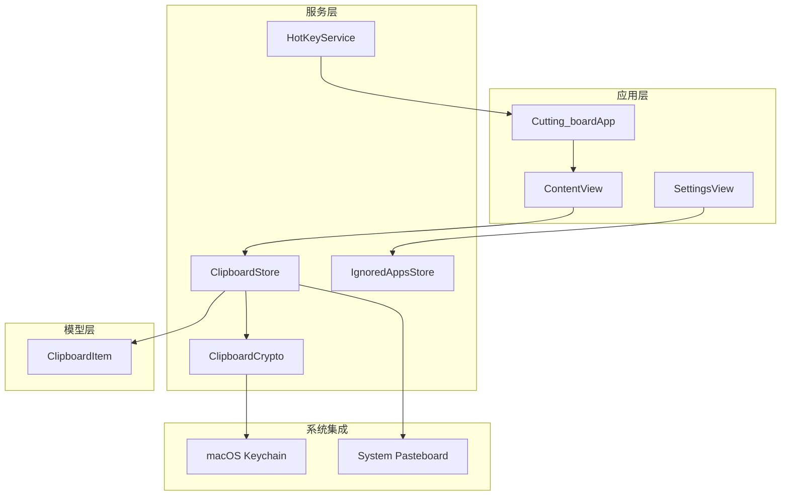
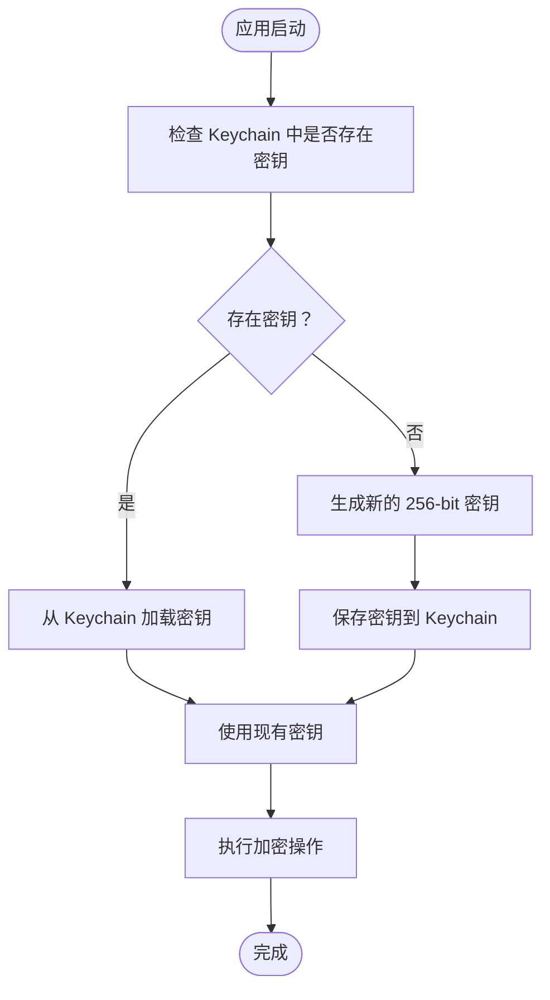
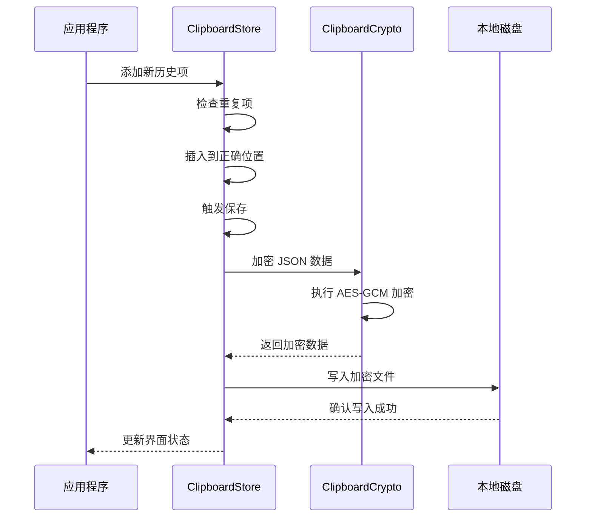
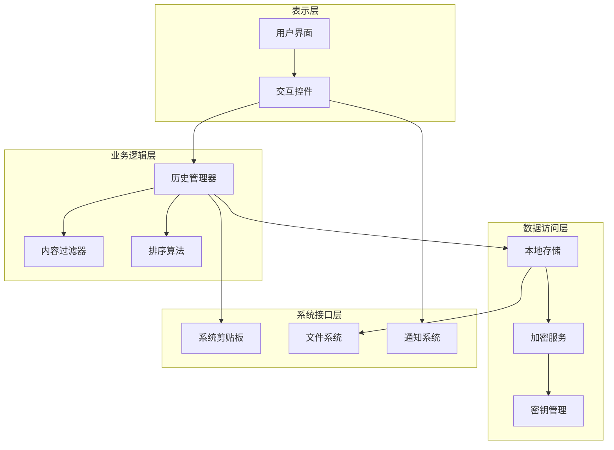
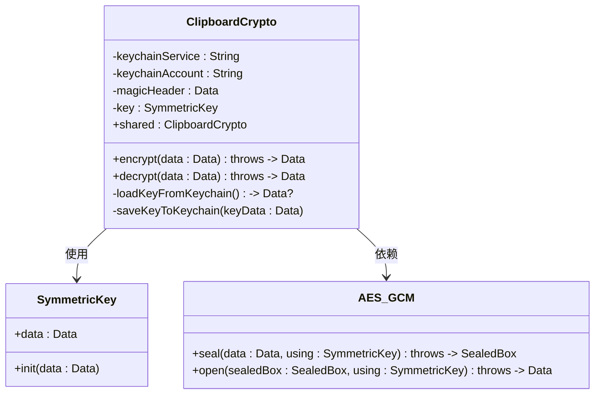
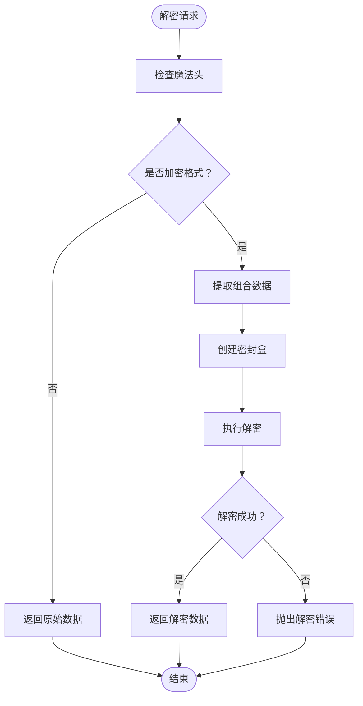
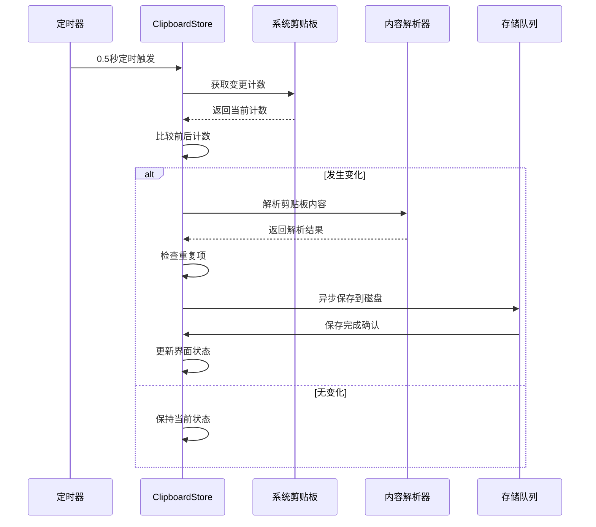
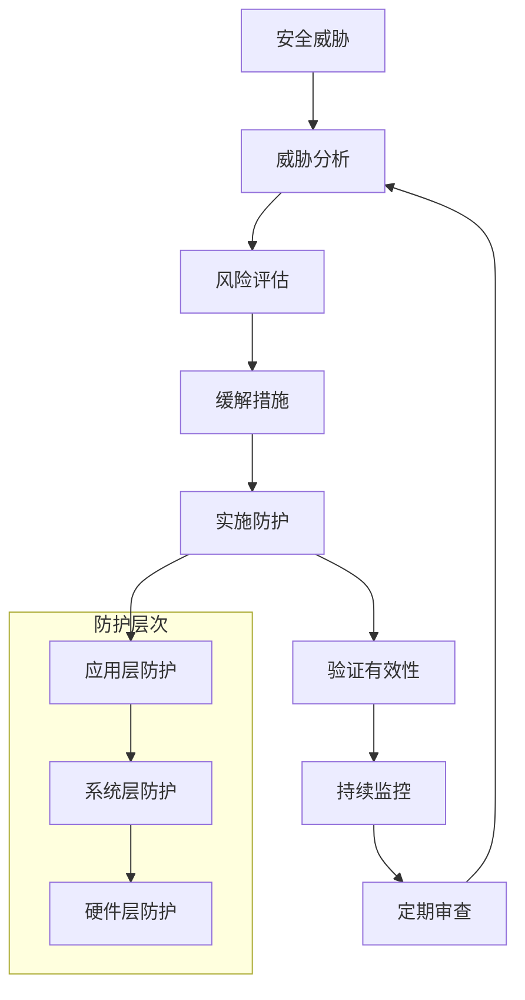
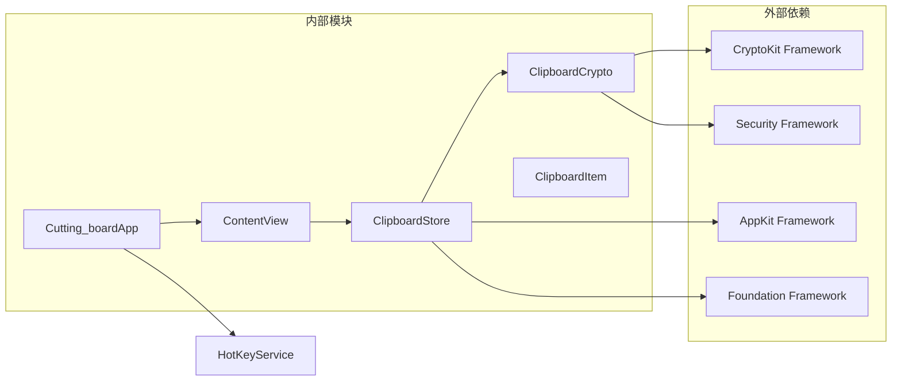

# 数据安全与隐私保护

<cite>
**本文档引用的文件**
- [ClipboardCrypto.swift](file://Cutting_board/Services/ClipboardCrypto.swift)
- [ClipboardStore.swift](file://Cutting_board/Services/ClipboardStore.swift)
- [ClipboardItem.swift](file://Cutting_board/Models/ClipboardItem.swift)
- [HotKeyService.swift](file://Cutting_board/Services/HotKeyService.swift)
- [IgnoredAppsStore.swift](file://Cutting_board/Services/IgnoredAppsStore.swift)
- [Cutting_boardApp.swift](file://Cutting_board/Cutting_boardApp.swift)
- [ContentView.swift](file://Cutting_board/ContentView.swift)
- [SettingsView.swift](file://Cutting_board/SettingsView.swift)
</cite>

## 目录
1. [简介](#简介)
2. [项目结构](#项目结构)
3. [核心组件](#核心组件)
4. [架构概览](#架构概览)
5. [详细组件分析](#详细组件分析)
6. [依赖关系分析](#依赖关系分析)
7. [性能考虑](#性能考虑)
8. [故障排除指南](#故障排除指南)
9. [结论](#结论)

## 简介

本项目是一个基于 macOS 的剪贴板历史管理应用，专注于数据安全与隐私保护。系统采用 AES-GCM 对称加密算法，结合 macOS Keychain 密钥管理，确保用户剪贴板历史数据的机密性、完整性和可用性。该系统实现了完整的加密数据存储格式，支持向后兼容性，并提供了全面的安全配置选项。

## 项目结构

项目采用模块化的 Swift 架构设计，主要分为以下几个层次：

**图表来源**
- [Cutting_boardApp.swift](file://Cutting_board/Cutting_boardApp.swift#L11-L31)
- [ContentView.swift](file://Cutting_board/ContentView.swift#L20-L30)
- [ClipboardStore.swift](file://Cutting_board/Services/ClipboardStore.swift#L14-L39)

**章节来源**
- [Cutting_boardApp.swift](file://Cutting_board/Cutting_boardApp.swift#L1-L144)
- [ContentView.swift](file://Cutting_board/ContentView.swift#L1-L500)
- [ClipboardStore.swift](file://Cutting_board/Services/ClipboardStore.swift#L1-L223)

## 核心组件

### AES-GCM 加密系统

系统采用 AES-GCM（Advanced Encryption Standard - Galois/Counter Mode）作为主要的加密算法，这是一种同时提供机密性和完整性的认证加密模式。

#### 加密算法特性
- **机密性保证**：通过 AES-256 算法确保数据无法被未授权方读取
- **完整性验证**：通过 GMAC（Galois Message Authentication Code）确保数据未被篡改
- **抗重放攻击**：内置随机生成的认证标签防止重放攻击
- **高效性能**：硬件加速支持，适合实时数据处理

#### 密钥管理架构

**图表来源**
- [ClipboardCrypto.swift](file://Cutting_board/Services/ClipboardCrypto.swift#L21-L29)

**章节来源**
- [ClipboardCrypto.swift](file://Cutting_board/Services/ClipboardCrypto.swift#L16-L73)

### 剪贴板历史存储系统

系统实现了高效的剪贴板历史管理，支持文本和图片两种内容类型，具备智能去重和排序功能。

#### 数据持久化策略

**图表来源**
- [ClipboardStore.swift](file://Cutting_board/Services/ClipboardStore.swift#L94-L108)
- [ClipboardStore.swift](file://Cutting_board/Services/ClipboardStore.swift#L210-L221)

**章节来源**
- [ClipboardStore.swift](file://Cutting_board/Services/ClipboardStore.swift#L14-L223)

## 架构概览

系统采用分层架构设计，确保关注点分离和模块化开发：

**图表来源**
- [ContentView.swift](file://Cutting_board/ContentView.swift#L20-L30)
- [ClipboardStore.swift](file://Cutting_board/Services/ClipboardStore.swift#L14-L39)

## 详细组件分析

### ClipboardCrypto 类深度分析

ClipboardCrypto 是系统的核心安全组件，实现了完整的加密、解密和密钥管理功能。

#### 类架构设计

**图表来源**
- [ClipboardCrypto.swift](file://Cutting_board/Services/ClipboardCrypto.swift#L16-L73)

#### 加密流程详解

系统采用标准化的 AES-GCM 加密流程：

1. **密钥生成与管理**
   - 首次运行时生成 256-bit 随机密钥
   - 使用 macOS Keychain 安全存储密钥
   - 支持密钥的持久化和恢复

2. **数据加密过程**
   - 使用 AES-256-GCM 算法进行加密
   - 生成认证标签确保数据完整性
   - 输出格式：魔法头标识 + 组合数据

3. **解密兼容性处理**
   - 自动检测加密格式
   - 透明处理明文历史数据
   - 保持向后兼容性

#### 错误处理机制

**图表来源**
- [ClipboardCrypto.swift](file://Cutting_board/Services/ClipboardCrypto.swift#L39-L46)

**章节来源**
- [ClipboardCrypto.swift](file://Cutting_board/Services/ClipboardCrypto.swift#L16-L73)

### ClipboardStore 存储系统

ClipboardStore 实现了完整的剪贴板历史管理功能，包括监控、存储、检索和界面更新。

#### 监控机制设计

**图表来源**
- [ClipboardStore.swift](file://Cutting_board/Services/ClipboardStore.swift#L47-L60)
- [ClipboardStore.swift](file://Cutting_board/Services/ClipboardStore.swift#L183-L208)

#### 数据存储格式

系统采用标准化的数据存储格式，确保跨版本兼容性：

| 字段 | 类型 | 描述 | 版本兼容性 |
|------|------|------|------------|
| id | UUID | 历史项唯一标识符 | v1.0+ |
| content | String | 剪贴板内容 | v1.0+ |
| type | Enum | 内容类型（text/image） | v1.0+ |
| timestamp | Date | 创建时间戳 | v1.0+ |
| imageDataBase64 | String? | 图片 Base64 数据 | v1.0+ |
| isPinned | Bool | 是否置顶标记 | v1.0+ |
| remark | String? | 用户备注 | v1.0+ |

**章节来源**
- [ClipboardStore.swift](file://Cutting_board/Services/ClipboardStore.swift#L14-L223)
- [ClipboardItem.swift](file://Cutting_board/Models/ClipboardItem.swift#L17-L89)

### 安全威胁分析与防护

#### 主要安全威胁

1. **密钥泄露风险**
   - 防护：使用 macOS Keychain 进行密钥安全存储
   - 验证：密钥仅在内存中使用，不直接暴露给文件系统

2. **数据完整性攻击**
   - 防护：AES-GCM 提供认证标签验证
   - 验证：任何篡改都会导致解密失败

3. **侧信道攻击**
   - 防护：使用标准加密库，避免自定义密码学实现
   - 验护：最小化敏感数据在内存中的停留时间

4. **权限滥用**
   - 防护：仅使用必要的系统权限
   - 验证：不请求不必要的辅助功能权限

#### 防护措施实施

**章节来源**
- [ClipboardCrypto.swift](file://Cutting_board/Services/ClipboardCrypto.swift#L48-L71)
- [HotKeyService.swift](file://Cutting_board/Services/HotKeyService.swift#L36-L69)

## 依赖关系分析

系统依赖关系清晰，遵循单一职责原则：

**图表来源**
- [ClipboardCrypto.swift](file://Cutting_board/Services/ClipboardCrypto.swift#L8-L10)
- [ClipboardStore.swift](file://Cutting_board/Services/ClipboardStore.swift#L8-L11)

**章节来源**
- [ClipboardCrypto.swift](file://Cutting_board/Services/ClipboardCrypto.swift#L1-L73)
- [ClipboardStore.swift](file://Cutting_board/Services/ClipboardStore.swift#L1-L223)

## 性能考虑

### 加密性能优化

1. **异步处理**
   - 所有加密操作在后台队列执行
   - 避免阻塞主线程用户界面

2. **内存管理**
   - 最小化敏感数据在内存中的驻留时间
   - 及时释放临时数据缓冲区

3. **缓存策略**
   - 密钥在内存中缓存，避免频繁 Keychain 访问
   - 历史数据按需加载和解密

### 存储效率

1. **增量更新**
   - 仅在数据发生变化时触发保存
   - 支持批量操作的合并处理

2. **压缩策略**
   - JSON 数据采用紧凑格式存储
   - 图片数据使用 Base64 编码优化传输

## 故障排除指南

### 常见问题诊断

#### 加密失败问题

**症状**：解密操作抛出异常
**可能原因**：
1. Keychain 权限问题
2. 密钥损坏或丢失
3. 数据格式不兼容

**解决步骤**：
1. 检查 Keychain 访问权限
2. 重新生成密钥并迁移数据
3. 验证数据格式完整性

#### 性能问题

**症状**：应用响应缓慢
**可能原因**：
1. 大量历史数据导致解密开销
2. 频繁的磁盘 I/O 操作
3. 内存泄漏

**解决步骤**：
1. 清理历史数据，限制最大条目数量
2. 优化存储队列的并发度
3. 检查内存使用情况

**章节来源**
- [ClipboardStore.swift](file://Cutting_board/Services/ClipboardStore.swift#L183-L208)
- [ClipboardCrypto.swift](file://Cutting_board/Services/ClipboardCrypto.swift#L48-L60)

## 结论

本数据安全与隐私保护系统通过采用 AES-GCM 认证加密算法和 macOS Keychain 密钥管理系统，为用户提供了可靠的数据保护方案。系统的设计充分考虑了安全性、性能和用户体验，在保证数据机密性和完整性的同时，提供了流畅的使用体验。

### 主要优势

1. **强加密保障**：AES-GCM 提供机密性和完整性双重保护
2. **安全密钥管理**：利用系统级 Keychain 确保密钥安全存储
3. **向后兼容性**：支持明文历史数据的透明处理
4. **性能优化**：异步处理和内存管理确保流畅体验
5. **模块化设计**：清晰的关注点分离便于维护和扩展

### 技术亮点

- 实现了完整的加密数据存储格式，包含魔法头标识和版本兼容性
- 提供了智能的剪贴板监控和去重机制
- 支持多种内容类型的处理和展示
- 实现了全局快捷键和菜单栏集成
- 提供了灵活的隐私保护配置选项

该系统为类似的数据安全应用场景提供了优秀的参考实现，其设计理念和安全措施值得在其他项目中借鉴和应用。