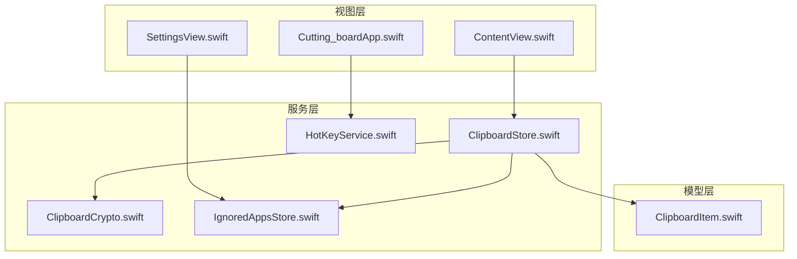
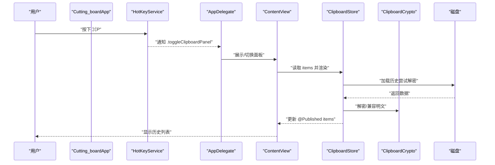
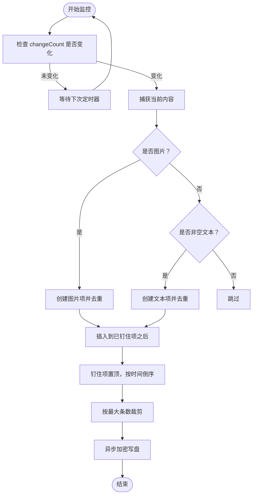
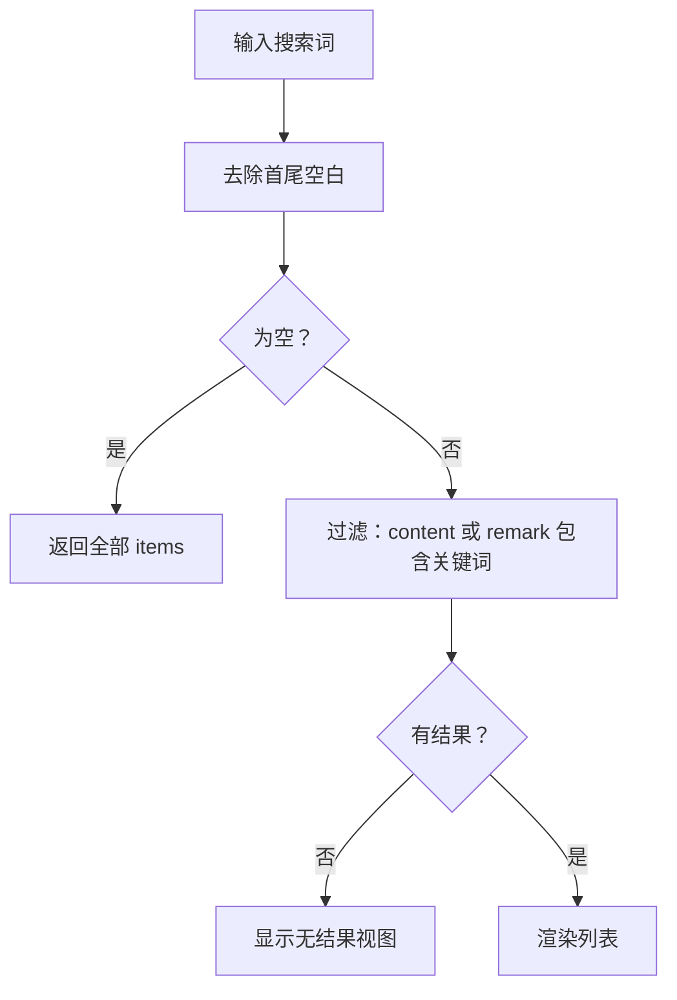
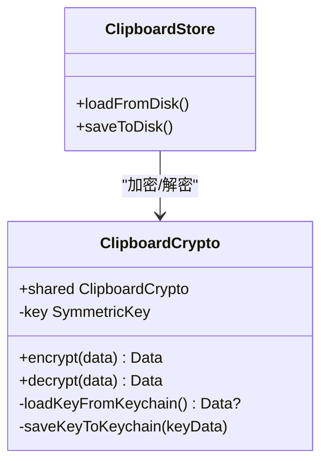
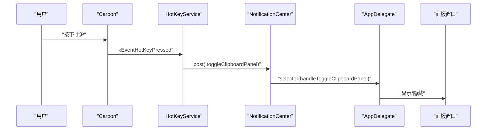
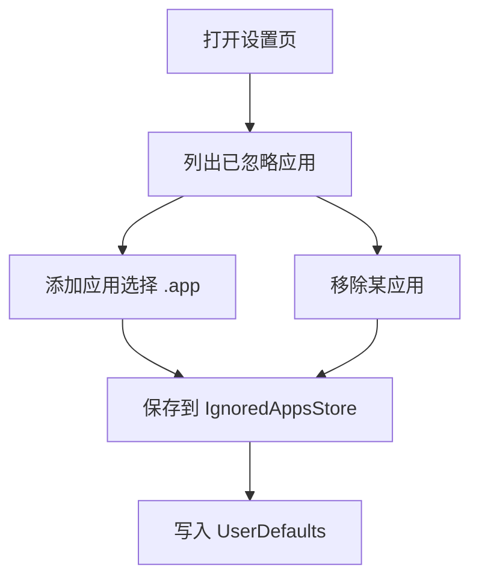
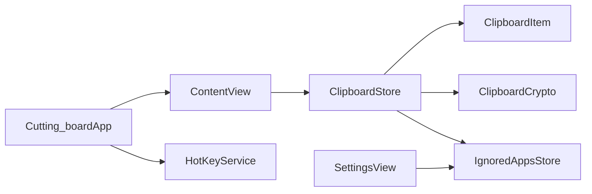

# 核心功能

<cite>
**本文引用的文件**
- [ClipboardItem.swift](file://Cutting_board/Models/ClipboardItem.swift)
- [ClipboardStore.swift](file://Cutting_board/Services/ClipboardStore.swift)
- [ClipboardCrypto.swift](file://Cutting_board/Services/ClipboardCrypto.swift)
- [HotKeyService.swift](file://Cutting_board/Services/HotKeyService.swift)
- [IgnoredAppsStore.swift](file://Cutting_board/Services/IgnoredAppsStore.swift)
- [ContentView.swift](file://Cutting_board/ContentView.swift)
- [Cutting_boardApp.swift](file://Cutting_board/Cutting_boardApp.swift)
- [SettingsView.swift](file://Cutting_board/SettingsView.swift)
</cite>

## 目录
1. [简介](#简介)
2. [项目结构](#项目结构)
3. [核心组件](#核心组件)
4. [架构总览](#架构总览)
5. [详细组件分析](#详细组件分析)
6. [依赖关系分析](#依赖关系分析)
7. [性能考量](#性能考量)
8. [故障排查指南](#故障排查指南)
9. [结论](#结论)
10. [附录](#附录)

## 简介
本文件面向开发者，系统性解析 Cutting_board 的核心功能与实现细节，覆盖以下主题：
- 剪贴板监控系统：实时监控机制、内容类型识别、去重策略
- 历史管理功能：数据存储架构、搜索过滤算法、排序逻辑
- 数据安全系统：AES-GCM 加密、密钥管理、隐私保护
- 全局快捷键服务：实现方式与系统集成
- 组件协作关系与使用场景

## 项目结构
项目采用“模型-服务-视图”分层组织，核心文件如下：
- 模型层：剪贴板历史条目定义
- 服务层：监控、存储、加密、快捷键、忽略应用列表
- 视图层：剪贴板面板、设置页、应用入口

图表来源
- [ClipboardItem.swift](file://Cutting_board/Models/ClipboardItem.swift#L17-L89)
- [ClipboardStore.swift](file://Cutting_board/Services/ClipboardStore.swift#L14-L222)
- [ClipboardCrypto.swift](file://Cutting_board/Services/ClipboardCrypto.swift#L16-L72)
- [HotKeyService.swift](file://Cutting_board/Services/HotKeyService.swift#L30-L81)
- [IgnoredAppsStore.swift](file://Cutting_board/Services/IgnoredAppsStore.swift#L16-L40)
- [ContentView.swift](file://Cutting_board/ContentView.swift#L20-L305)
- [Cutting_boardApp.swift](file://Cutting_board/Cutting_boardApp.swift#L35-L143)
- [SettingsView.swift](file://Cutting_board/SettingsView.swift#L11-L88)

章节来源
- [ClipboardItem.swift](file://Cutting_board/Models/ClipboardItem.swift#L1-L90)
- [ClipboardStore.swift](file://Cutting_board/Services/ClipboardStore.swift#L1-L223)
- [ClipboardCrypto.swift](file://Cutting_board/Services/ClipboardCrypto.swift#L1-L73)
- [HotKeyService.swift](file://Cutting_board/Services/HotKeyService.swift#L1-L82)
- [IgnoredAppsStore.swift](file://Cutting_board/Services/IgnoredAppsStore.swift#L1-L69)
- [ContentView.swift](file://Cutting_board/ContentView.swift#L1-L500)
- [Cutting_boardApp.swift](file://Cutting_board/Cutting_boardApp.swift#L1-L144)
- [SettingsView.swift](file://Cutting_board/SettingsView.swift#L1-L95)

## 核心组件
- 剪贴板监控与历史存储：负责实时检测系统剪贴板变化、去重、排序、持久化与读取
- 历史项模型：定义历史条目的字段、编码/解码、预览与时间描述
- 数据安全：基于 Keychain 的密钥管理与 AES-GCM 加密，确保历史文件隐私
- 全局快捷键：通过 Carbon API 注册全局热键，支持任意应用焦点下触发
- 忽略应用列表：维护不希望记录的应用 Bundle ID 列表
- 视图与交互：剪贴板面板、设置页、键盘导航、搜索过滤、备注编辑、粘贴回写

章节来源
- [ClipboardStore.swift](file://Cutting_board/Services/ClipboardStore.swift#L14-L222)
- [ClipboardItem.swift](file://Cutting_board/Models/ClipboardItem.swift#L17-L89)
- [ClipboardCrypto.swift](file://Cutting_board/Services/ClipboardCrypto.swift#L16-L72)
- [HotKeyService.swift](file://Cutting_board/Services/HotKeyService.swift#L30-L81)
- [IgnoredAppsStore.swift](file://Cutting_board/Services/IgnoredAppsStore.swift#L16-L40)
- [ContentView.swift](file://Cutting_board/ContentView.swift#L20-L305)
- [SettingsView.swift](file://Cutting_board/SettingsView.swift#L11-L88)

## 架构总览
系统以 ClipboardStore 为中心，围绕其构建监控、存储、加密与 UI 协作；HotKeyService 通过通知驱动 AppDelegate 控制面板显示；IgnoredAppsStore 提供应用白名单控制；ClipboardItem 定义数据结构与序列化。

图表来源
- [HotKeyService.swift](file://Cutting_board/Services/HotKeyService.swift#L36-L69)
- [Cutting_boardApp.swift](file://Cutting_board/Cutting_boardApp.swift#L100-L142)
- [ContentView.swift](file://Cutting_board/ContentView.swift#L20-L305)
- [ClipboardStore.swift](file://Cutting_board/Services/ClipboardStore.swift#L183-L221)
- [ClipboardCrypto.swift](file://Cutting_board/Services/ClipboardCrypto.swift#L32-L46)

## 详细组件分析

### 剪贴板监控系统
- 实时监控机制
  - 使用定时器周期检查 NSPasteboard.changeCount，避免轮询过密导致性能问题
  - 初次启动记录 lastChangeCount，并启动定时器
- 内容类型识别
  - 优先尝试图片：从 NSPasteboard 读取 NSImage，转换为 PNG Base64
  - 文本：若非纯空白则作为文本项处理
- 去重策略
  - 与最新项比较 content、type，以及图片 Base64 数据一致则跳过
- 应用白名单
  - 通过 IgnoredAppsStore 判断前台应用 Bundle ID 是否在忽略列表中
- 历史写入与排序
  - 新增项插入到“已钉住项数量”的位置，保证钉住项置顶
  - 按时间倒序排序，保持最新在前
  - 超出最大条数时，保留已钉住项，裁剪未钉住项
- 写回系统剪贴板
  - 支持文本与图片，分别写入对应类型
- 持久化
  - JSON 编码后经 AES-GCM 加密，写入 ApplicationSupport/Cutting_board/history.json
  - 启动时尝试解密，失败则视为明文兼容

图表来源
- [ClipboardStore.swift](file://Cutting_board/Services/ClipboardStore.swift#L47-L90)
- [ClipboardStore.swift](file://Cutting_board/Services/ClipboardStore.swift#L94-L115)
- [ClipboardStore.swift](file://Cutting_board/Services/ClipboardStore.swift#L183-L221)

章节来源
- [ClipboardStore.swift](file://Cutting_board/Services/ClipboardStore.swift#L14-L222)
- [IgnoredAppsStore.swift](file://Cutting_board/Services/IgnoredAppsStore.swift#L16-L40)

### 历史管理功能
- 数据存储架构
  - 文件路径：ApplicationSupport/Cutting_board/history.json
  - 编码：ISO8601 时间戳，JSON PrettyPrinted + SortedKeys
  - 加密：AES-GCM，带魔数标识，兼容旧版明文
- 搜索过滤算法
  - 基于本地化标准包含匹配，同时匹配 content 与 remark
  - 支持空查询返回全量，无结果时显示“未找到”
- 排序逻辑
  - 已钉住项置顶，未钉住项按时间倒序
  - 插入新项时先插入到已钉住项之后，再整体排序
- 用户操作
  - 钉住/取消钉住：更新 isPinned 并重新排序
  - 编辑备注：去除首尾空白，空字符串转为 nil
  - 删除/清空：支持删除单条、清空未钉住、清空全部

图表来源
- [ContentView.swift](file://Cutting_board/ContentView.swift#L29-L35)
- [ClipboardStore.swift](file://Cutting_board/Services/ClipboardStore.swift#L118-L147)

章节来源
- [ClipboardStore.swift](file://Cutting_board/Services/ClipboardStore.swift#L183-L221)
- [ContentView.swift](file://Cutting_board/ContentView.swift#L20-L305)

### 数据安全系统
- 密钥管理
  - 使用 Keychain Generic Password 服务存储 32 字节对称密钥
  - 首次使用生成随机密钥并保存，后续直接读取
- 加密格式
  - 输出格式：魔数 CB1 + AES.GCM sealedBox.combined
  - 解密时先检查魔数，不匹配则视为明文兼容
- 隐私保护
  - 历史文件加密存储，防止其他软件读取
  - 仅在内存中进行解密与加密，不落盘明文

图表来源
- [ClipboardCrypto.swift](file://Cutting_board/Services/ClipboardCrypto.swift#L16-L72)
- [ClipboardStore.swift](file://Cutting_board/Services/ClipboardStore.swift#L183-L221)

章节来源
- [ClipboardCrypto.swift](file://Cutting_board/Services/ClipboardCrypto.swift#L16-L72)
- [ClipboardStore.swift](file://Cutting_board/Services/ClipboardStore.swift#L183-L221)

### 全局快捷键服务
- 实现方式
  - 使用 Carbon API 的 RegisterEventHotKey 注册全局热键
  - 监听 kEventHotKeyPressed 事件，回调中通过通知中心发送 .toggleClipboardPanel
- 系统集成
  - AppDelegate 订阅通知，负责创建/切换剪贴板面板窗口
  - 无需辅助功能权限，任意应用焦点下可用
- 交互体验
  - 支持菜单栏入口（⌘P）与快捷键（⌘P）两种触发方式

图表来源
- [HotKeyService.swift](file://Cutting_board/Services/HotKeyService.swift#L36-L69)
- [Cutting_boardApp.swift](file://Cutting_board/Cutting_boardApp.swift#L100-L142)

章节来源
- [HotKeyService.swift](file://Cutting_board/Services/HotKeyService.swift#L30-L81)
- [Cutting_boardApp.swift](file://Cutting_board/Cutting_boardApp.swift#L35-L143)

### 忽略应用列表与设置页
- 忽略应用列表
  - 通过 IgnoredAppsStore 维护 Bundle ID 数组，写入 UserDefaults
  - 读取时从 UserDefaults 初始化，写入时同步保存
- 设置页
  - 展示已忽略应用的名称与图标，支持移除与新增
  - 新增时使用 NSOpenPanel 选择 .app，提取 Bundle Identifier

图表来源
- [SettingsView.swift](file://Cutting_board/SettingsView.swift#L41-L88)
- [IgnoredAppsStore.swift](file://Cutting_board/Services/IgnoredAppsStore.swift#L16-L40)

章节来源
- [IgnoredAppsStore.swift](file://Cutting_board/Services/IgnoredAppsStore.swift#L16-L69)
- [SettingsView.swift](file://Cutting_board/SettingsView.swift#L11-L95)

## 依赖关系分析
- 组件耦合
  - ClipboardStore 依赖 ClipboardItem、ClipboardCrypto、IgnoredAppsStore
  - ContentView 依赖 ClipboardStore，SettingsView 依赖 IgnoredAppsStore
  - AppDelegate 依赖 HotKeyService 与 ClipboardStore（间接）
- 外部依赖
  - AppKit、Foundation、Combine、SwiftUI、CryptoKit、Security（Keychain）

图表来源
- [ClipboardStore.swift](file://Cutting_board/Services/ClipboardStore.swift#L14-L222)
- [ClipboardItem.swift](file://Cutting_board/Models/ClipboardItem.swift#L17-L89)
- [ClipboardCrypto.swift](file://Cutting_board/Services/ClipboardCrypto.swift#L16-L72)
- [IgnoredAppsStore.swift](file://Cutting_board/Services/IgnoredAppsStore.swift#L16-L40)
- [ContentView.swift](file://Cutting_board/ContentView.swift#L20-L305)
- [SettingsView.swift](file://Cutting_board/SettingsView.swift#L11-L88)
- [Cutting_boardApp.swift](file://Cutting_board/Cutting_boardApp.swift#L35-L143)
- [HotKeyService.swift](file://Cutting_board/Services/HotKeyService.swift#L30-L81)

章节来源
- [ClipboardStore.swift](file://Cutting_board/Services/ClipboardStore.swift#L14-L222)
- [ContentView.swift](file://Cutting_board/ContentView.swift#L20-L305)
- [SettingsView.swift](file://Cutting_board/SettingsView.swift#L11-L88)
- [Cutting_boardApp.swift](file://Cutting_board/Cutting_boardApp.swift#L35-L143)
- [HotKeyService.swift](file://Cutting_board/Services/HotKeyService.swift#L30-L81)
- [IgnoredAppsStore.swift](file://Cutting_board/Services/IgnoredAppsStore.swift#L16-L40)
- [ClipboardItem.swift](file://Cutting_board/Models/ClipboardItem.swift#L17-L89)
- [ClipboardCrypto.swift](file://Cutting_board/Services/ClipboardCrypto.swift#L16-L72)

## 性能考量
- 监控频率
  - 定时器间隔 0.5 秒，平衡响应速度与 CPU 占用
- 去重与排序
  - 插入时 O(n) 检测去重，整体排序 O(n log n)，适合中小规模历史
- I/O 优化
  - 异步队列执行读写，避免阻塞主线程
  - JSON 编码启用排序键与缩进，提升可读性但增加体积
- 图片缩略图
  - 预览图片按需生成缩略图，避免大图渲染开销

[本节为通用性能建议，不直接分析具体文件]

## 故障排查指南
- 快捷键无效
  - 检查是否成功注册热键与事件处理器
  - 确认未被系统或其他应用占用
- 面板无法显示
  - 确认 AppDelegate 成功创建面板窗口并激活应用
  - 检查通知订阅是否正确
- 历史为空或异常
  - 检查 ApplicationSupport/Cutting_board/history.json 是否存在
  - 若为加密文件，确认魔数与密钥是否正确
- 忽略应用列表不生效
  - 确认 Bundle ID 正确且存在于系统中
  - 检查 UserDefaults 中的键值是否存在

章节来源
- [HotKeyService.swift](file://Cutting_board/Services/HotKeyService.swift#L36-L81)
- [Cutting_boardApp.swift](file://Cutting_board/Cutting_boardApp.swift#L78-L142)
- [ClipboardStore.swift](file://Cutting_board/Services/ClipboardStore.swift#L183-L221)
- [IgnoredAppsStore.swift](file://Cutting_board/Services/IgnoredAppsStore.swift#L16-L40)

## 结论
Cutting_board 通过简洁而稳健的架构实现了剪贴板监控、历史管理、数据安全与全局快捷键四大核心能力。其设计注重用户体验（如钉住置顶、搜索过滤、键盘导航）与隐私保护（AES-GCM 加密、Keychain 密钥管理）。组件间职责清晰、耦合度适中，便于扩展与维护。

[本节为总结性内容，不直接分析具体文件]

## 附录
- 使用场景示例（代码片段路径）
  - 监控与去重：查看 [captureCurrentContent](file://Cutting_board/Services/ClipboardStore.swift#L65-L90)
  - 历史写盘与解密：查看 [saveToDisk](file://Cutting_board/Services/ClipboardStore.swift#L210-L221) 与 [loadFromDisk](file://Cutting_board/Services/ClipboardStore.swift#L183-L208)
  - AES-GCM 加密/解密：查看 [encrypt](file://Cutting_board/Services/ClipboardCrypto.swift#L32-L36) 与 [decrypt](file://Cutting_board/Services/ClipboardCrypto.swift#L38-L46)
  - 全局快捷键注册：查看 [register](file://Cutting_board/Services/HotKeyService.swift#L36-L69)
  - 忽略应用列表：查看 [add/remove/contains](file://Cutting_board/Services/IgnoredAppsStore.swift#L27-L39)
  - 面板显示/切换：查看 [toggleClipboardPanel](file://Cutting_board/Cutting_boardApp.swift#L135-L142)
  - 搜索过滤：查看 [filteredItems](file://Cutting_board/ContentView.swift#L29-L35)